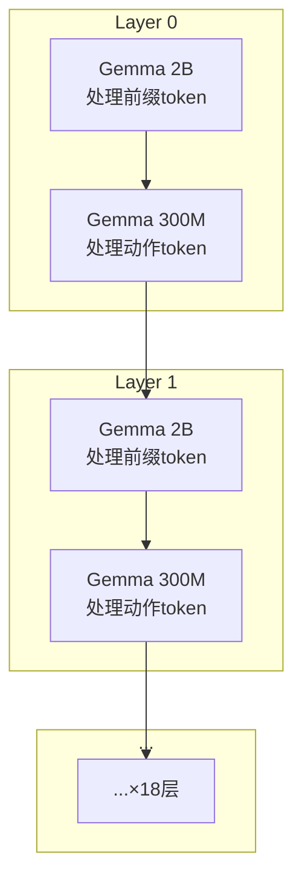

# 第十章：Gemma 语言模型骨干 —— 文本理解与多模态融合

> 本章目标：理解 Gemma 的 Decoder-only Transformer 结构、双 Gemma 设计（2B 主模型 + 300M 动作专家）的工作方式，以及 GQA、RMSNorm、GeGLU、RoPE 这些关键技术。

**前情提要**：上一章 SigLIP 将图像编码为 256×2048 的 token 序列。现在这些视觉 token 连同文本 token 一起进入 Gemma——系统的"大脑"。

**知识链接**：
- [第九章：SigLIP 视觉编码器](./09_SigLIP视觉编码器)
- [第一章：什么是 VLA？](./01_什么是VLA)

---

## 10.1 双 Gemma 设计回顾

π₀ 中有两个 Gemma 模型协同工作：

| 模型 | 参数 | 职责 | 处理的 token |
|------|------|------|-------------|
| Gemma 2B | ~2B | 理解图像和语言 | 前缀（视觉+文本） |
| Gemma 300M | ~311M | 生成动作 | 后缀（动作 token） |

它们共享同一个 Transformer 的代码，但使用不同的配置参数。在 OpenPI 中，两个 Gemma 被封装在一个 `Module` 类中，通过 `configs=[config_2b, config_300m]` 传入：

```python
llm = _gemma.Module(
    configs=[paligemma_config, action_expert_config],
    embed_dtype=config.dtype,
    adarms=config.pi05,  # π₀.₅ 启用 AdaRMSNorm
)
```

---

## 10.2 两个 Gemma 的具体参数

```python
# Gemma 2B（主模型）
gemma_2b = Config(
    width=2048,        # 隐藏维度
    depth=18,          # Transformer 层数
    mlp_dim=16_384,    # FFN 中间维度（8× width）
    num_heads=8,       # 注意力头数
    num_kv_heads=1,    # KV 头数（GQA：8个Q头共享1组KV）
    head_dim=256,      # 每个头的维度
)

# Gemma 300M（动作专家）
gemma_300m = Config(
    width=1024,        # 隐藏维度
    depth=18,          # 同样 18 层
    mlp_dim=4096,      # FFN 中间维度（4× width）
    num_heads=8,       # 注意力头数
    num_kv_heads=1,    # KV 头数
    head_dim=256,      # 每个头的维度
)
```

**关键观察**：
- 两个模型的 depth 都是 18 层——它们**逐层交错运行**
- 主要差异在 width（2048 vs 1024）和 mlp_dim（16384 vs 4096）
- 参数量差异约 6.5 倍，主要来自 width 和 mlp_dim 的差距

---

## 10.3 逐层交错执行

双 Gemma 不是"先跑完 2B 的 18 层，再跑 300M 的 18 层"。它们是**逐层交错的**——每一层中，两个模型并行处理各自负责的 token：



更准确地说：在注意力计算中，动作 token（由 300M 处理）可以**看到**前缀 token（由 2B 处理），但不会反过来。这就是信息从"理解层"流向"生成层"的机制。

---

## 10.4 Decoder-only Transformer 的基本结构

每个 Gemma 层由两个子模块组成：

### 10.4.1 多头注意力（Multi-Head Attention）

```python
# 简化的注意力计算
Q = x @ W_Q  # Query: (seq_len, num_heads, head_dim)
K = x @ W_K  # Key:   (seq_len, num_kv_heads, head_dim)
V = x @ W_V  # Value: (seq_len, num_kv_heads, head_dim)

# GQA：将 K,V 扩展到与 Q 相同的头数
K = repeat(K, groups=num_heads // num_kv_heads)
V = repeat(V, groups=num_heads // num_kv_heads)

# 注意力权重 + 掩码
attn_weights = softmax(Q @ K.T / sqrt(head_dim) + attn_mask)
output = attn_weights @ V
```

### 10.4.2 前馈网络（FFN with GeGLU）

```python
# GeGLU：Gated Linear Unit with GELU activation
gate = gelu(x @ W_gate)  # 门控信号
up = x @ W_up             # 上投影
hidden = gate * up        # 逐元素相乘
output = hidden @ W_down  # 下投影回原维度
```

---

## 10.5 Grouped Query Attention (GQA)

GQA 是 Gemma 使用的高效注意力机制。核心思想：**多个 Query 头共享同一组 Key/Value**。

| 注意力类型 | Q 头数 | KV 头数 | 参数量 | 说明 |
|------------|--------|---------|--------|------|
| Multi-Head (MHA) | 8 | 8 | 最大 | 每个 Q 头有独立的 KV |
| Grouped Query (GQA) | 8 | **1** | 节省 | 8 个 Q 头共享 1 组 KV |
| Multi-Query (MQA) | 8 | 1 | 同 GQA | GQA 的极端情况 |

OpenPI 中 `num_kv_heads=1`，即所有 8 个 Query 头共享同一组 Key/Value。这节省了 KV cache 的内存（推理时只需缓存 1 组 KV 而非 8 组），同时性能损失很小。

**代入数字**（以 Gemma 2B 为例）：
- Q 参数量：$2048 \times 8 \times 256 = 4,194,304$
- K 参数量：$2048 \times 1 \times 256 = 524,288$（节省 8 倍）
- V 参数量：同 K

---

## 10.6 RMSNorm：比 LayerNorm 更高效

Gemma 使用 RMSNorm 而非标准 LayerNorm：

$$
\text{RMSNorm}(x) = \frac{x}{\text{RMS}(x)} \cdot \gamma
$$

其中 $\text{RMS}(x) = \sqrt{\frac{1}{d}\sum_{i=1}^{d}x_i^2}$。

**与 LayerNorm 的区别**：
- LayerNorm：先减均值（center），再除以标准差（scale）
- RMSNorm：**不减均值**，只除以均方根（scale）

**为什么更好？**
1. 省略了均值计算，速度更快
2. 实验表明效果与 LayerNorm 相当
3. 现代 LLM（LLaMA、Gemma 等）广泛使用

---

## 10.7 Rotary Position Embedding (RoPE)

RoPE 是 Gemma 使用的位置编码方式，直接作用于 Query 和 Key：

$$
\text{RoPE}(x, \text{pos}) = x \cdot \cos(\text{pos} \cdot \theta) + \text{rotate}(x) \cdot \sin(\text{pos} \cdot \theta)
$$

**一句话直觉**：把每个 token 的 Q/K 向量"旋转"一个与位置成正比的角度。两个 token 的相对位置决定了它们 Q·K 点积的值——位置越近，旋转后的向量越对齐。

**与绝对位置编码的区别**：
- 绝对编码：位置信息加到嵌入上，与内容耦合
- RoPE：位置信息只影响注意力权重，不改变表示本身

**在 π₀ 中的特殊处理**：前缀中的视觉 token 和文本 token 使用正常的位置编码；后缀中的动作 token 有自己独立的位置索引——从 0 开始重新计数。

---

## 10.8 GeGLU 前馈网络

GeGLU 是 Gemma FFN 使用的激活方式：

$$
\text{GeGLU}(x) = \text{GELU}(xW_1) \odot (xW_2)
$$

**一句话直觉**：一条路生成"门控信号"（哪些信息该通过），另一条路生成"候选值"（要通过的信息），两者逐元素相乘得到最终输出。

| 符号 | 维度变化 | 作用 |
|------|----------|------|
| $xW_1$ | $(d) \to (d_{\text{mlp}})$ | 门控通道 |
| $\text{GELU}(\cdot)$ | — | 非线性激活 |
| $xW_2$ | $(d) \to (d_{\text{mlp}})$ | 值通道 |
| $\odot$ | 逐元素 | 门控选择 |
| $W_{\text{down}}$ | $(d_{\text{mlp}}) \to (d)$ | 投影回原维度 |

**代入数字**（Gemma 2B）：
- 输入：$(2048)$
- 门控/值：$(16384)$
- 输出（相乘后投影）：$(2048)$

---

## 10.9 词嵌入与词表

Gemma 使用 PaliGemma 的词表，大小为 **257,152** 个 token：

```python
PALIGEMMA_VOCAB_SIZE = 257_152
```

这个词表是标准 Gemma 词表 + PaliGemma 添加的特殊 token（用于图像占位符等）。

在 π₀ 中，词嵌入表的用途：
- **文本 token → 嵌入**：查表得到文本的 2048 维表示
- **图像 token**：不通过词嵌入，而是直接由 SigLIP + 线性投影得到

---

## 10.10 双模型在代码中的实现

OpenPI 的 Gemma `Module` 类支持同时容纳多个配置。在前向传播中，它根据 token 的位置分别应用不同配置的参数：

```python
class Module(nn.Module):
    configs: Sequence[Config]  # [gemma_2b_config, gemma_300m_config]
    
    def __call__(self, tokens, segment_ids, ...):
        # segment_ids 标记每个 token 属于哪个模型
        # segment_ids=0 → 由 configs[0]（2B）处理
        # segment_ids=1 → 由 configs[1]（300M）处理
        
        for layer in range(depth):
            # 对 segment_ids=0 的 token 用 2B 的参数
            # 对 segment_ids=1 的 token 用 300M 的参数
            # 但注意力计算中，300M 的 token 可以关注 2B 的 token
            ...
```

这种设计的妙处：
1. 两个模型共享相同的 Transformer 代码路径
2. 信息可以单向流动（动作专家可以看前缀，前缀看不到动作）
3. 不需要显式的"传递"步骤——通过注意力机制自然地读取上下文

---

## 10.11 本章小结

| 概念 | 核心理解 |
|------|----------|
| 双 Gemma 设计 | 2B 理解场景 + 300M 生成动作 |
| 逐层交错 | 18 层中两个模型并行处理各自 token |
| GQA | 8 个 Q 头共享 1 组 KV，节省内存 |
| RMSNorm | 不减均值，只除均方根，更快 |
| RoPE | 旋转位置编码，只影响注意力权重 |
| GeGLU | 门控线性单元，两路信息逐元素相乘 |
| 词表 257,152 | PaliGemma 扩展词表 |
| segment_ids | 标记 token 归属哪个模型处理 |

---

## 下一章预告

下一章我们进入 π₀ 最核心的创新——Flow Matching 动作生成。我们会详细理解为什么选择 Flow Matching 而非 Diffusion、它的数学原理（条件流匹配）、训练时的损失函数推导、以及推理时的欧拉法 ODE 求解。
