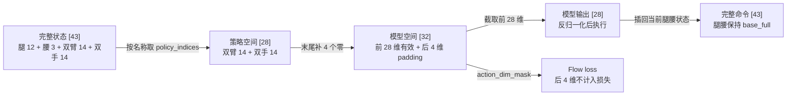

# G1 43 DoF 关节契约

> G1 的动作问题首先是一个索引问题：同一只手在记录、训练、反归一化和执行器之间必须始终占据同一位置。

**前章结论**：Pi0.7-inspired 不是只改模型，它还固定了机器人数据边界。第 1 章给出的三次维度变化是本章的主线。

**知识链接**：

- [OpenPI 项目地图](/系列/openpi_deep_dive/03_OpenPI项目地图)——理解模型输入为什么需要统一字段。
- [动作分块与时间对齐的基础](/前置知识/000l_前置知识_动作Token化与自回归策略)——理解动作序列与控制步的关系。
- [项目源码 `joints.py`](https://github.com/SILVIO-ZHENG/Pi0.7-Flow-matching/blob/main/src/g1_pi07/joints.py)。

## 三种向量不是三套关节

贯穿例子仍是“双手拿箱子”。G1 的传感器会报告完整身体，但箱子任务的策略只需要改变上半身：双臂 14 个关节和两只 Dex3-1 手各 7 个关节，共 28 维。模型配置却固定接收 32 维动作，因此剩余 4 维必须明确标成“模型占位”，不能被误当成腿或腰。

> 读图的关键是两个不同的“补全”：28→32 是为了满足模型接口，28→43 是为了恢复完整机器人命令；后者必须从当前 `base_full` 复制腿和腰，不能用零覆盖。

## `joints.py` 如何保证顺序

源码把关节名分成四个不可变元组：`LEG_JOINT_NAMES` 有 12 项，`WAIST_JOINT_NAMES` 有 3 项，`ARM_JOINT_NAMES` 有 14 项，`DEX3_JOINT_NAMES` 有 14 项。连接它们得到 `FULL_JOINT_NAMES`，连接后两个得到 `POLICY_JOINT_NAMES`。

`G1JointLayout.__post_init__` 在对象创建时检查三件事：完整列表必须是 43 项；策略列表必须是 28 项；所有名字不能重复，策略名字必须出现在完整列表中。这个检查放在构造阶段，是因为索引错位一旦进入训练集，模型仍可能正常收敛，却学到“左肩命令写到右手”的错误映射。

### 43→28：按名字得到索引

`policy_indices` 先建立“关节名→完整向量位置”的字典，再按 `POLICY_JOINT_NAMES` 的固定顺序取位置。`full_to_policy` 使用 `np.take(..., axis=-1)` 保留所有前导 batch 维度，只改变最后一维。

这比直接写 `full[..., 15:43]` 更稳健。切片只表达位置，不表达语义；如果未来 URDF 或 SDK 调整了腿腰的顺序，按名字构造的重排函数还能检查缺失关节，而一个硬编码切片无法发现问题。

### 28→32：模型 padding 也要有语义

`policy_to_model` 分配一个全零的 `[... , 32]` 数组，把 28 维策略值写入前 28 项；`model_dim_mask` 同时生成前 28 项为 true、后 4 项为 false 的布尔数组。这里的零只是数值占位，真正说明“不要学习”的是 mask。

如果只补零而不带 mask，Flow Matching 会把“预测后 4 维为零”当作训练目标。模型就会浪费容量拟合四个没有执行器对应的维度；更糟的是，这四维在输出端若没有再次截断，可能被误传给下游控制接口。

### 32→28→43：输出恢复

`model_to_policy` 只复制前 28 维，避免把 padding 带回策略空间；`policy_to_full` 先复制 `base_full`，再按 `policy_indices` 写入 28 个上半身位置。于是当前腿和腰状态天然保留下来。

用一个最小例子看这个设计：假设当前 43 维状态中的腿腰值是 `[0.1, ...]`，模型只预测双臂双手。若输出恢复函数创建全零 43 维数组再填 28 维，剩下 15 个腿腰命令会变成零；若使用 `base_full.copy()` 再写入策略索引，腿腰维度保持原来的安全状态。这是“未控制”与“命令为零”的区别。

## 输入关节名的重排

真机 SDK 给出的数组顺序不能默认等于项目顺序。`reorder_full(values, input_joint_names)` 接收数值数组和它的名字列表，先验证列表包含 43 个互不重复的名字，再按照项目的 `FULL_JOINT_NAMES` 构造重排索引。

这个函数应当在部署启动检查中运行一次，而不是在每个控制周期猜测顺序。检查通过后，内部所有数据都用 canonical order；这样记录、归一化统计和推理客户端共享一个坐标约定。

## 动作块与时间 padding

动作向量的契约还包括时间维度。`make_action_chunk` 从轨迹的 `start_index` 起取最多 50 个真实动作；如果 episode 剩余动作不足 50 步，默认重复最后一个真实动作填满张量，同时把对应的 `step_mask` 置为 false。`source_indices` 对 padding 使用 `-1`，便于审计。

例如从最后两步开始取一个 `[50,32]` 块，真实动作只有两步：第 0、1 步的 `step_mask` 为 true，第 2 到 49 步虽然有数值，却全部是合成 padding。损失必须看到 `step_mask`，否则模型会被迫学习“episode 结束后一直保持最后动作”这一数据存储副作用。

时间 mask 与维度 mask 的交集构成有效监督：真实未来步、真实 G1 维度，同时还要满足 RTC postfix 条件。三个条件中任何一个为 false，都不能把对应的数值算进平均损失。

## 失败模式对照

| 错误实现 | 直接后果 | 契约如何阻止 |
|----------|----------|--------------|
| 把 43 维数组前 28 项当成策略动作 | 腿腰误进入模型，肩关节位置错位 | `policy_indices` 按名字抽取 |
| 28 维补到 32 维但不带 mask | padding 维度参与训练 | `model_dim_mask` 明确 false |
| episode 尾部重复动作仍参与 loss | 合成动作被当作示范 | `step_mask` 排除尾部 |
| 输出恢复时创建全零 43 维 | 未控制的腿腰突然收到零命令 | `policy_to_full` 从 `base_full` 复制 |
| 不检查 SDK 关节名 | 训练成功但真机动作错关节 | `reorder_full` 启动时验证 |

## 小结

G1 的 43→28→32 不是随手 reshape，而是三个责任域：完整机器人状态、策略控制空间和模型固定接口。每次跨域转换都保留形状检查、名称检查或 mask，才能把“模型输出有数值”与“这个数值允许执行”区分开。

**下一章聚焦**：28 维策略动作从哪里来？第 3 章沿着 XR 手腕位姿和 21×3 手部关键点，解释刚体标定、阻尼最小二乘 IK（Damped Least Squares, DLS）和 Dex3 重定向怎样合成为一个候选动作。
