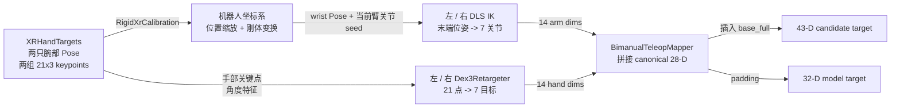

# XR 遥操作与双臂动作生成

> 这一章的输出不是“看起来像手的姿态”，而是一条通过坐标标定、双臂 IK、手部重定向和关节顺序检查的 28 维可训练动作。

**前章结论**：第 2 章把 28 维定义为双臂 14 维加双手 14 维。本章解释这 28 个数如何由 XR 观测生成。

**知识链接**：

- [G1 43 DoF 关节契约](./02_G1_43DoF关节契约)——本章所有输出都必须遵守它的 canonical order。
- [正运动学与 DH 参数](/前置知识/003a_前置知识_正运动学与DH参数)与 [雅可比矩阵与微分运动学](/前置知识/003b_前置知识_雅可比矩阵与微分运动学)——理解关节空间、末端空间和 IK 线性化。
- [项目源码 teleop](https://github.com/SILVIO-ZHENG/Pi0.7-Flow-matching/tree/main/src/g1_pi07/teleop)。

## 一条 XR 样本怎样变成动作

箱子任务中，操作者移动两只手腕并弯曲手指。XR 数据天然位于 tracking frame，G1 控制器需要的是关节角；两者之间不能直接复制数组，需要把空间和机械结构分别处理。

> 重点看两条不同的几何路径：腕部位姿需要 IK，手指关键点不走机械臂 IK，而是先提取弯曲特征，再映射到 Dex3 的 7 个执行器。

## XR 坐标标定

RigidXrCalibration 保存平移向量、四元数和位置缩放比例。transform_points 先对 XR 点乘 position_scale，再左乘旋转矩阵，最后加平移；姿态则用标定旋转与 XR 姿态做四元数乘法。

这里的顺序不能调换。位置缩放描述 tracking 空间与机器人空间的单位或尺度差异，旋转描述坐标轴方向，平移描述原点位置。若先平移再缩放，平移向量也会被错误地缩放；若只旋转位置不旋转姿态，手腕位置和末端朝向会来自两个不同坐标系。

四元数在构造时会归一化，零四元数和非有限值会直接拒绝。这个检查虽小，却避免了一个难排查的故障：非法姿态经过旋转矩阵转换后可能变成大幅、但数值上仍然有限的关节目标。

## 阻尼最小二乘 IK

DampedLeastSquaresIK.solve 以当前机械臂关节作为 seed，每轮先计算正运动学位姿与目标位姿的误差，再用 Jacobian 计算一个关节增量。需要满足的目标是：末端误差下降，同时在奇异位形附近不要让关节增量爆炸。对应的核心更新可以写成：

$$
\Delta q = J^T\left(JJ^T+\lambda^2 I\right)^{-1}e,\qquad q_{k+1}=\operatorname{clip}\left(q_k+\Delta q, q_{\min},q_{\max}\right)
$$

**这个公式在做什么**：把当前末端位姿误差 e 转成一次受阻尼、受限幅的关节更新，并把更新后的关节保持在合法范围内。

::: details 📐 公式详解（点击展开）

| 子表达式 | 它是谁 | 它在干嘛 |
|---------|--------|---------|
| $e$ | **末端偏差** | 当前腕部位姿到 XR 目标位姿的平移和旋转误差 |
| $J^T(JJ^T+\lambda^2I)^{-1}$ | **受阻尼的反解器** | 把任务空间误差映射回关节空间，并在 Jacobian 接近奇异时抑制不稳定放大 |
| $\Delta q$ | **本轮动作增量** | 还没有执行的临时更新，代码随后还会做最大步长裁剪 |
| $\operatorname{clip}(q_k+\Delta q)$ | **关节安全边界** | 把更新后的每个关节限制在 lower_limits 与 upper_limits 之间 |

**用人话读**：看见手腕还差多少，就沿着机械臂当前最可靠的方向移动一小步，遇到奇异姿态或关节边界时主动收敛而不是发散。

**为什么是这个形式**：直接用 $J^{-1}$ 要求 Jacobian 方阵且可逆，不适合冗余或接近奇异的机械臂；阻尼项让逆问题在这些位置仍有稳定解。代码还用 max_step_norm 限制单轮增量，避免一次迭代跨过可控区域。
:::

源码的完整状态转移是固定的：

1. 读取并裁剪初始 seed，验证上下限和数值有效性。
2. 用 forward kinematics 读取当前位姿，计算 6 维平移加旋转误差。
3. 若误差低于容差，返回收敛结果；否则读取 6×N Jacobian。
4. 计算阻尼最小二乘增量，超过 max_step_norm 就缩放。
5. 写入 q = clip(q + delta)，循环直到收敛或达到最大迭代次数。

这个顺序说明了 q、delta 和输出 IKResult.q 的区别：q 是迭代中的状态，delta 是本轮增量，结果中的 q 才是可以拼进动作向量的候选关节角。若没有第 5 步的 clip，公式虽然能降低位姿误差，却可能先把某个关节推过硬限位。

## Dex3 手部重定向

Dex3Retargeter 接收一只手的 21×3 关键点，但项目当前使用的是腕部、拇指、食指和中指的几何子集。_bend(a,b,c) 计算三点夹角，再把夹角归一化到 0 到 1；7 个归一化弯曲值映射到每个执行器的 lower/upper 范围。

这个设计没有假设 XR 关键点与 Dex3 电机一一对应。Dex3 的食指和中指部分执行器用相邻关节弯曲值的平均，降低单个关键点抖动对电机目标的影响；invert 则处理追踪方向和执行器正方向相反的情况。每只手独立保存 7 维标定，因此左右手不必共享同一套量程。

## 双臂拼接与失败处理

BimanualTeleopMapper.map 先从当前 43 维状态取出策略顺序的 28 维 seed，前 7 维送入左臂 IK，接着 7 维送入右臂 IK。两边都收敛后，按“左臂、右臂、左手、右手”拼接；任何一侧不收敛时，如果 require_convergence=True，函数直接抛错并要求保持上一条安全命令。

箱子任务里这意味着：如果箱子突然挡住了一个腕部目标，系统不会把“部分更新的左臂 + 失败的右臂”拼成一条看似完整的动作，而是拒绝这一帧。部分可用数据不等于可执行数据。

## 小结

遥操作动作生成有三个必须分开的变量：XR 中的观测位姿，IK 中的迭代关节状态，以及最终写入策略空间的候选动作。标定解决坐标问题，DLS 解决腕部位姿到关节角的稳定反解，Dex3 重定向解决手部关键点到执行器的非一一映射，最后由 G1JointLayout 统一索引。

**下一章聚焦**：候选动作生成后，状态和三路相机仍然来自不同设备。第 4 章解释记录器为何以动作时间戳为中心对齐所有观察，以及时间差为什么必须保留正负号。
