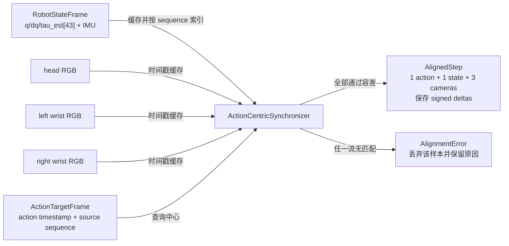

# 动作中心的时间对齐与记录

> 训练样本应该回答“机器人在执行这条动作时看到了什么”，所以这个项目用动作时间戳做共同坐标，而不是把三路传感器强行按帧号拼起来。

**前章结论**：第 3 章生成了带时间戳的 43 维候选动作。本章让机器人状态、三路相机和候选动作在同一个时间点上组成 AlignedStep。

**知识链接**：

- [数据格式入门](/系列/openpi_deep_dive/05_数据格式入门)——理解 LeRobot/RLDS 数据的基本组织。
- [G1 43 DoF 关节契约](./02_G1_43DoF关节契约)——理解被对齐的状态字段形状。
- [项目源码 time_sync.py](https://github.com/SILVIO-ZHENG/Pi0.7-Flow-matching/blob/main/src/g1_pi07/data/time_sync.py)。

## 为什么动作是时间锚点

相机是按自己的帧率采样，关节状态由另一条 ROS2 流发布，候选动作又可能在 IK 或策略推理完成后才发送。如果按“最近一帧相机”或“相同数组下标”对齐，得到的样本可能是动作发生前的画面，也可能是动作已经改变状态后的画面。

动作中心的定义更直接：每条 ActionTargetFrame 表示一个要发送或记录的动作事件，记录器围绕它选择状态和每路相机的最近观测。这样一个 Parquet 行对应一个实际动作时间点，后续训练、延迟分析和安全审计都共享同一个时钟。

> AlignedStep 只有在状态和三路相机全部通过检查时才产生；一个相机缺失不会被静默替换成另一台相机的帧。

## 最近时间匹配的目标

对某个动作时间 $t_a$，时间戳缓冲区中的候选观测时间记为 $t_i$。选择最近观测的目标是：

$$
t^*=\underset{t_i}{\arg\min}\,|t_i-t_a|,\qquad \Delta t=t^*-t_a,\qquad |\Delta t|\leq\tau
$$

**这个公式在做什么**：选择离动作最近的那一帧，同时记录它是提前还是滞后，以及它是否落在可接受时间窗内。

::: details 📐 公式详解（点击展开）

| 子表达式 | 它是谁 | 它在干嘛 |
|---------|--------|---------|
| $|t_i-t_a|$ | **距离尺** | 衡量某个状态或图像离动作事件有多远，只比较绝对距离 |
| $\arg\min$ | **最近帧选择器** | 在缓冲区中找距离最小的候选观测 |
| $\Delta t=t^*-t_a$ | **方向记录** | 保留观测相对动作是早到还是晚到，不能只保存绝对值 |
| $|\Delta t|\leq\tau$ | **质量闸门** | $\tau$ 是该设备允许的最大时间差，超出就拒绝样本 |

**用人话读**：找离动作最近的观察，标记它提前或滞后，超过允许误差就不要把它当成训练输入。

**为什么保留符号**：两个相机都差 8 ms，一个提前 8 ms、一个滞后 8 ms，绝对误差相同，但它们对运动中的箱子提供的是不同状态。符号还能让质检发现某台设备长期领先或落后。
:::

TimestampBuffer 按时间戳有序插入，因此可以容忍轻微乱序到达；bisect_left 只检查查询点左右两个候选，选择距离相同的情况下时间更早者。缓冲区有固定容量，避免长时间运行时无限增长。

## 状态优先使用来源 sequence

动作消息可携带 source_state_sequence。如果这个 sequence 仍在表中，align 先取生成该动作时使用的精确状态，再验证它与动作时间戳的差值没有超过 max_state_delta_ms。只有 sequence 查找失败时，才退化为最近时间匹配。

这个优先级同时解决精度与安全问题：sequence 能表达“这条动作基于哪一帧状态计算”，时间容差能阻止过期 sequence 被重新利用。若 sequence 已过期，代码不会因为“索引找到了”就放行，而是抛出 AlignmentError。

三路相机没有类似的来源 sequence，因此每台相机独立做最近时间匹配。默认状态容差是 15 ms，每路相机是 40 ms；这些值是质量阈值，不是为了提高样本数量而随意放宽的超参，应根据设备频率和时钟同步实测校准。

## AlignedStep 的不可变边界

AlignedStep 保存原始动作、匹配状态、相机字典、状态 signed delta 和每路相机 signed delta。构造时再次验证：状态差值必须等于“状态时间戳减动作时间戳”，相机 key 必须与帧内 camera 名一致，所有 delta 必须与实际帧时间戳一致。

重复验证把“匹配算法的结果”和“可写入数据集的样本”分开。如果某个调用方手动替换了相机帧却忘了更新 delta，错误会在记录入口暴露，而不会在数小时训练后才表现为奇怪的视觉动作。

## 从对齐样本到磁盘

EpisodeWriter.add 将对齐结果写入行缓冲：完整 q/dq/tau_est[43]、IMU、28 维观察状态、43 维候选目标、动作和命令时间字段，以及任务和当前 subtask。finalize 创建 episode 目录，写出 steps.parquet、视频文件和 metadata.json；若有原始 MCAP，则把它作为原始证据路径保存。

每个 episode 需要有明确的成功标签。结束时如果成功和失败标签混杂或完全没有标签，元数据中的 success 会保持不确定，而默认训练分割会排除失败和未标注 episode。这样“没有标签”不会被隐式解释成成功。

## 小结

动作中心对齐有三个不可替代的设计：用动作作为查询中心、状态优先使用来源 sequence、每路相机独立验证时间窗。signed delta 和 AlignedStep 构造检查让数据质量可以被统计和追责。

**下一章聚焦**：时间对齐只保证样本可信，还没有解决 episode 切分、动作块尾部 padding 和数值尺度。第 5 章把这些记录样本转换成 LeRobot 可训练数据，并解释 q01/q99 归一化为何只从 train split 估计。
