# 数据质检 LeRobot 与 q01 q99

> 这条数据管线把“可回放的原始 episode”和“固定形状的模型样本”分开保存，并用 mask 阻止 padding、无效维度和错误 split 进入监督信号。

**前章结论**：第 4 章生成了以动作时间戳为中心的 AlignedStep。本章负责从这些步骤生成可训练 episode，并保持原始数据可追溯。

**知识链接**：

- [数据格式入门](/系列/openpi_deep_dive/05_数据格式入门)——OpenPI 使用 LeRobot 的字段基础。
- [数据变换第一层](/系列/openpi_deep_dive/06_数据变换第一层)与 [归一化](/系列/openpi_deep_dive/07_数据变换第二层_归一化)——已有系列解释通用 OpenPI 变换，本章只讲 G1 的新增约束。
- [项目源码 chunks.py 与 normalization.py](https://github.com/SILVIO-ZHENG/Pi0.7-Flow-matching/tree/main/src/g1_pi07/data)。

## 数据生命周期

“拿箱子”示教失败时，原始 MCAP 仍应保留；但一个未完成、没有安全门批准的 episode 不应该混入训练。项目把原始记录、质检、分割、转换和统计拆成阶段，每一阶段都留下可检查的产物。

```mermaid
flowchart LR
    A["raw episode<br/>MCAP + Parquet + MP4"] -->|validate_g1_episodes.py| B["QC<br/>时间 / shape / safety gate / label"]
    B -->|split by episode| C["train / validation / test<br/>失败和未标注默认排除"]
    C -->|convert_g1_session_to_lerobot.py| D["LeRobot V3<br/>状态、动作、图像、task"]
    D -->|action_step_mask| E["未来 H=50 动作块"]
    E -->|training split only| F["q01/q99 stats"]
    F -->|normalize + dimension mask| G["model sample<br/>[50,32]"]
    G -->|episode map| H["raw episode 可追溯"]
```

> 需要特别区分两条路径：统计参数只从 train 数据估计，episode map 则把转换后的样本指回原始 episode，二者分别服务于数值一致性和审计。

## 按 episode 而不是按帧切分

split_episode_ids 先把 episode ID 去重并排序，再用带 seed 的 BLAKE2b 摘要得到稳定顺序，最后按比例分出 validation、test 和 train。默认每个非零 split 至少占一个完整 episode，并检查训练集仍然非空。

如果把同一 episode 的相邻帧随机分到 train 和 validation，模型可能在验证时看到几乎相同的箱子姿态、背景和动作轨迹，结果虚高。按完整 episode 切分把“场景、操作者、整段动作”一起隔离，验证才更接近新 episode 泛化。

## 固定动作块 [50,32]

在时刻 t，转换器请求从 t 开始的未来 50 步。G1 真实策略动作只有 28 维，所以 G1JointLayout.policy_to_model 把它写入 32 维张量的前 28 项，末尾 4 项置零；make_action_chunk 对 episode 尾部不足 50 步的部分默认重复最后一个真实动作。

重复最后一个动作只是一种让张量形状固定的存储策略，不是示教者在 episode 结束后继续执行了几十步。step_mask 记录哪些时间步来自真实轨迹，source_indices=-1 让 padding 在审计时可识别；dim_mask 记录哪些动作维度有真实执行器。

有效监督是三类条件的交集：真实未来步、28 个有效 G1 维度、以及 RTC 训练中尚未提交的 postfix 步。若只使用 step_mask 而忽略 dim_mask，模型会学习不存在的 4 个动作维度；若只使用 dim_mask 而忽略 step_mask，模型会学习 episode 结束后的重复尾巴。

## q01/q99 归一化的设计

关节动作的极端异常值会把均值和标准差拉远，使大多数正常动作挤在很窄的归一化区间。项目对每个维度只从训练 split 估计 1% 分位点 q01 和 99% 分位点 q99，并把这段范围映射到模型常用的 [-1,1]。

$$
x_{norm}=2\frac{x-q_{01}}{q_{99}-q_{01}+\varepsilon}-1
$$

**这个公式在做什么**：用每个动作维度自己的稳健范围，把训练数据中心的大部分值映射到 [-1,1]，同时给超出范围的推理值提供可选的 clipping 边界。

::: details 📐 公式详解（点击展开）

| 子表达式 | 它是谁 | 它在干嘛 |
|---------|--------|---------|
| $x-q_{01}$ | **相对下界的位移** | 把该维度的 1% 分位点当作局部零点，而不是假设所有关节共享零点 |
| $q_{99}-q_{01}+\varepsilon$ | **稳健尺度** | 用中间 98% 数据的范围作尺度，$\varepsilon$ 防止常量维度除零 |
| $2(\cdot)-1$ | **坐标变换** | 把分位点区间的两端分别变成 -1 和 1 |
| clip | **输出边界** | 可选地把明显超出训练范围的值截回模型输入范围 |

**用人话读**：每个关节根据自己的训练活动范围单独缩放，常见动作落在 -1 到 1，极端值不会改变其他关节的尺度。

**为什么按维度计算**：肩关节、手指关节的物理范围和数据波动完全不同，共用一个尺度会让小幅手指动作在数值上几乎消失。只用 train split 则避免验证集信息通过统计参数泄漏到训练过程。
:::

QuantileStats 对常量维度特殊处理：当 q99-q01 小于 eps 时，normalize 返回 0，denormalize 返回 q01。这样不会把数值噪声放大成动作；反归一化必须复用同一份统计文件，并在输出端再截取前 28 维。

## Sidecar 元数据的边界

项目可以通过 JSON/JSONL sidecar 附加 subtask、成功、失败、人工干预、advantage 和 sample weight。SidecarDataset 包装原始 LeRobot 数据而不修改源数据，且拒绝重复的 episode_index、frame_index key；字符串 “false” 会被解析为 false，而不是依赖 Python 的 truthiness。

这些字段改变的是训练标签、prompt 或样本权重，不改变 q01/q99 的数值统计。把失败轨迹的文本元数据和数值状态混在同一个统计入口，会让数据审计无法回答“归一化范围来自哪些真实动作”。

## 质检门

validate_g1_episodes.py 默认检查文件是否存在、行数和动作形状、相机与状态字段、时间字段、关节顺序以及安全门批准关系。command_applied=false 的候选动作可以留在 raw 记录中用于分析，但默认转换器不把它当作已批准的训练动作。

## 小结

数据工程的核心不是把 Parquet 变成另一个格式，而是维护三种事实：这条数据来自哪个完整 episode；动作块哪些位置是真实监督；归一化参数来自哪个 split。固定 [50,32] 只解决模型接口，mask 和 episode map 才解决语义与可追溯性。

**下一章聚焦**：固定动作样本进入模型后，会被拆成视觉语言 prefix 和连续动作 suffix。第 6 章走读 π₀.₅ Action Expert 的输入、Flow Matching 目标和 10 步 Euler 采样。
