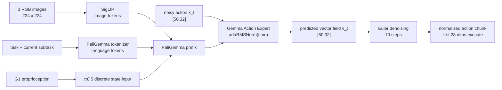

# π₀.₅ Flow Action Expert

> 这个项目的连续控制核心仍然是 OpenPI π₀.₅：视觉和语言形成条件 prefix，Action Expert 读取带噪的动作 suffix，输出从噪声流向示范动作的速度。

**前章结论**：第 5 章把 G1 轨迹整理为归一化的 [50,32] 动作块。本章说明这个块如何进入 π₀.₅-inspired 模型，以及模型如何在 10 步内生成一块动作。

**知识链接**：

- [OpenPI 中的 Gemma 语言模型骨干](/系列/openpi_deep_dive/10_Gemma语言模型骨干)——理解 PaliGemma 与 action expert 的 Transformer 实现。
- [Flow Matching 与连续归一化流](/前置知识/000g_前置知识_Flow_Matching与连续归一化流)——理解速度场和噪声到数据的连续路径。
- [什么是 VLA？](/系列/openpi_deep_dive/01_什么是VLA#1.6-π₀-家族的三种变体)——已有系列对 π₀、π₀-FAST 和 π₀.₅ 分支的定位说明。
- [项目源码 pi0_pytorch.py](https://github.com/SILVIO-ZHENG/Pi0.7-Flow-matching/blob/main/src/openpi/models_pytorch/pi0_pytorch.py)。

## 视觉语言 prefix 与动作 suffix

对于“拿起箱子”，prefix 包含三路 RGB 图像、整体任务、当前 subtask 和离散 proprioception；suffix 是一组长度为 50 的动作 token。prefix 提供“箱子在哪里、要做什么、身体当前是什么状态”，suffix 提供“未来每个控制步要怎样移动”。

> prefix 只提供条件，Action Expert 才负责连续动作；这两个角色的分开是后续 Knowledge Insulation 能成立的前提。

## π₀.₅ 和原始 π₀ 的差异

代码通过 Pi0Config 的 pi05=True 选择 π₀.₅ 路径。对本项目最关键的两处差异是：

| 位置 | 原始 π₀ 路径 | π₀.₅ 路径 |
|------|---------------|-----------|
| proprioception | 作为连续 state token 追加到 suffix | 经过离散化，进入语言 prefix |
| Flow 时间条件 | 与动作 embedding 拼接后走 MLP | 经过 time MLP 后作为 adaRMSNorm 条件 |
| G1 配置 | 一般动作维度 | action_dim=32、action_horizon=50 |

因此 embed_suffix 在 π₀.₅ 分支不会再追加 state token；它把带噪动作投影到 Action Expert 宽度，把时间 embedding 变成 adaRMSNorm 条件。这样语言模型先把状态作为上下文处理，专家网络再用时间条件判断“当前动作处在去噪路径的哪个位置”。

## Flow Matching 的训练样本

设 a 是一条归一化示范动作块，epsilon 是同形状高斯噪声，t 是 0 到 1 的训练时间。项目采用的方向约定是 t=0 为干净动作、t=1 为噪声；这与部分论文的记号方向相反，但训练和采样代码内部保持一致。

训练要解决的不是让网络直接猜完整动作，而是让它在路径上的任一点指出正确速度。源码中一次训练 forward 的核心目标是：

$$
x_t=t\epsilon+(1-t)a,\qquad u^*=\epsilon-a,\qquad \mathcal{L}_{FM}=\left\|v_\theta(x_t,t,o)-u^*\right\|_2^2
$$

**这个公式在做什么**：把示范动作和噪声连成一条直线路径，随机取一个位置，让网络预测从动作端走向噪声端的正确速度；推理时把这条速度反向积分，就能从噪声回到动作。

::: details 📐 公式详解（点击展开）

| 子表达式 | 它是谁 | 它在干嘛 |
|---------|--------|---------|
| $x_t=t\epsilon+(1-t)a$ | **路径上的当前点** | 按时间在干净动作和噪声之间插值，训练网络覆盖整条去噪路径 |
| $u^*=\epsilon-a$ | **标准方向** | 直线从动作指向噪声的固定速度，作为每个样本的监督答案 |
| $v_\theta(x_t,t,o)$ | **网络方向猜测** | 根据当前带噪动作、时间和观察条件预测应该走多快、走向哪里 |
| $\|v_\theta-u^*\|_2^2$ | **方向误差** | 对每个动作维度的速度偏差平方后求和，偏差大的方向受到更强惩罚 |

**用人话读**：把动作弄脏到某个程度，问网络现在应该沿哪条方向走，并用它和正确直线路径的差距训练网络。

**为什么是线性插值**：线性路径让训练目标由同一对动作和噪声直接确定，速度答案简单且不依赖未知的中间分布。平方误差适合连续向量场回归；第 5 章的 step/dim mask 会在它之后排除 padding 和无效维度。
:::

### 时间采样不是均匀抽样

sample_time 从 Beta(1.5, 1.0) 采样，再缩放到 [0.001,0.999]。这条概率密度随 t 增大而增大，意味着训练更频繁地观察靠近噪声端的路径位置；它不是让样本越界，而是改变不同 Flow 时间的训练频率。

> 蓝线在 t 接近 1 时高于均匀参考线，说明训练更偏向噪声端；这要求模型同时学会从高噪声输入中恢复动作条件，而不是只记住接近干净动作的局部修正。

如果把 Beta 参数换成均匀分布，路径两端会得到相同采样机会；如果把分布过度推向某一端，另一端的速度估计会变差，Euler 采样在对应阶段容易累积误差。参数是训练设置，不能和物理动作尺度混为一谈。

## 推理时的 10 步 Euler

采样从 x_t=noise 和 flow_time=1 开始，prefix 只计算一次并缓存 PaliGemma 的 Key/Value（KV）状态。每一步把当前动作块与时间送进 Action Expert，得到 v_t，再以 dt=-1/num_steps 更新；10 步后得到接近 t=0 的动作块。

这个推理循环与训练约定严格相反：训练目标是动作到噪声的速度 epsilon-a，采样沿负时间步移动，所以结果从噪声回到动作。若只改 dt 的符号而不改起始时间，模型会沿错误方向走，输出不会是有效动作。

## mask 在模型输出处的作用

Flow forward 返回逐样本、逐时间步、逐维度的 MSE，而不是立即把所有元素平均。随后动作步 mask、动作维度 mask 和 RTC postfix mask 才决定哪些误差参与总损失。对于 [50,32] 的 G1 样本，末尾 4 维永远不应产生梯度意义上的监督，episode 尾部重复动作也不应被当作真实轨迹。

推理输出经过同一份 q01/q99 统计反归一化，截取前 28 维后才进入 G1 policy。模型知道 32 个位置，执行器只接受 28 个上半身位置，这是模型接口与机器人接口的再次分离。

## 小结

π₀.₅-inspired 模型的控制路径可以压缩成三件事：prefix 提供条件，Action Expert 回归 Flow 速度，Euler 循环把噪声积分成动作。G1 的独特部分不是重新发明 Flow Matching，而是把 32 维固定模型接口、28 维有效动作、step/dim mask 和三路观察接到这个标准路径上。

**下一章聚焦**：项目还同时训练 FAST 文字/动作 token 分支。第 7 章解释为什么连续 Flow 和离散 FAST 要分开建图，以及 Stop-Gradient Knowledge Insulation 如何决定两条梯度各自更新哪些参数。
