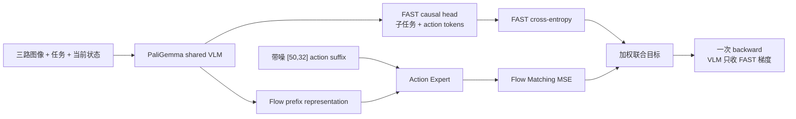
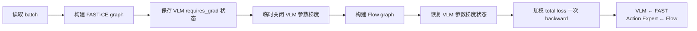

# FAST Flow 联合训练与知识隔离

> π₀.₅ 的 Flow 分支负责连续动作，FAST 分支负责把子任务和动作压缩为可自回归预测的 token。本章解释两条目标为什么同时存在，以及为什么 Flow 的梯度不能直接回写 PaliGemma。

**前情提要**：第 6 章已经确定了 G1 的连续控制路径：视觉、语言和离散状态组成 prefix，Action Expert 对 `[50,32]` 动作块做 Flow Matching。项目的联合配置在这个路径上增加 FAST teacher-forcing 分支，并用 Knowledge Insulation 固定两条梯度的边界。

**知识链接**：

- [π₀.₅ Flow Action Expert](./06_π05_Flow_Action_Expert)——连续 suffix、Flow 速度场和 10 步采样。
- [Tokenization 与 FAST](/系列/openpi_deep_dive/08_数据变换第三层_ModelTransform)——动作 token 化和自回归掩码的基础。
- [交叉熵损失与 Softmax](/前置知识/003f_前置知识_交叉熵损失与Softmax)——FAST-CE 的通用分类损失。
- [RECAP 从真实部署经验中 RL 学习](/论文综述/016_RECAP_从真实部署经验中RL学习)——Knowledge Insulation 在更大训练系统中的背景。
- [项目源码 objectives.py](https://github.com/SILVIO-ZHENG/Pi0.7-Flow-matching/blob/main/src/g1_pi07/training/objectives.py)。

## 一个模型两种监督

贯穿本章的例子仍是“G1 用双手拿箱子并放到目标区域”。仅用 Flow loss，模型能学习“这个视觉状态对应怎样的连续关节轨迹”，但它没有一个离散的、可读的中间计划；仅用 FAST-CE，模型能预测 `Subtask:` 文本和压缩动作 token，却把连续关节控制交给了有量化误差的离散表示。项目把两种监督放在一次训练 step 中，但不把它们当成同一种输出。

两条分支在模型中的位置如下。图中最重要的不是“两个 loss 相加”，而是 Flow 分支经过 PaliGemma 时，PaliGemma 的参数叶子被冻结；Action Expert 和动作投影仍然可以获得自己的梯度。

> 读图时沿着梯度方向看：FAST-CE 可以更新共享 VLM；Flow loss 更新 Action Expert 和动作投影，但不能用连续动作误差改写共享 VLM 的知识。

## FAST 分支的监督位置

FAST 分支接收专用的 `fast_tokenized_prompt`、自回归 attention mask 和 token loss mask。序列通常包含图像 token、任务描述、`Subtask:` 以及教师动作编码；模型在 teacher forcing 下看到前面的真实 token，预测下一个 token。`fast_token_loss_mask` 只打开真正属于目标输出的 token，提示词本身不计入损失。

为了精确描述“只在指定 token 上平均”，设第 $i$ 个目标 token 为 $z_i$，其预测概率为 $p_\theta(z_i\mid z_{<i},o)$，`m_i` 是 loss mask。FAST 分支的有效目标可以写成：

$$
\mathcal{L}_{FAST}=-\frac{\sum_i m_i\log p_\theta(z_i\mid z_{<i},o)}{\max(1,\sum_i m_i)}
$$

**这个公式在做什么**：只对被标记为监督目标的 FAST token 计算平均负对数似然，并防止一个 batch 没有有效 token 时出现除零。

::: details 📐 公式详解（点击展开）

| 子表达式 | 它是谁 | 它在干嘛 |
|---------|--------|---------|
| $\log p_\theta(z_i\mid z_{<i},o)$ | **第 i 道预测的得分** | 衡量模型在已经看到前文和观测后，给真实下一个 token 的信心 |
| $m_i$ | **监督开关** | 只让 `Subtask:` 后的目标 token 或动作 token 参与训练，提示词和 padding 的开关为 0 |
| $\sum_i m_i\log p_\theta(\cdot)$ | **有效 token 总账** | 把一个序列中真正需要学习的预测累加起来 |
| $\max(1,\sum_i m_i)$ | **稳定的平均分母** | 有目标时按目标数量平均；全是尾部 padding 时保持数值合法 |

**用人话读**：模型逐个预测 FAST 输出，只为被选中的真实 token 记分，再除以有效题目数。

**为什么需要 mask**：FAST 是压缩表示，一个 token 不对应一个控制步。episode 尾部的 repeat-last padding 可以参与连续张量的形状固定，却不应伪装成新的离散动作答案；因此项目在这类样本上跳过 FAST-CE，而 Flow 分支仍按真实时间步 mask 计算。
:::

`compute_fast_token_loss` 的实现顺序与公式一致：读取四个 `fast_*` 字段，拼接图像和语言 embedding，按 causal attention 做一次 PaliGemma 前向，只选择 `target_mask` 打开的 logits，最后调用 `cross_entropy(..., reduction="mean")`。当整个 batch 都没有有效目标时，代码返回与 hidden 相连的零，而不是制造一个与模型断开的常量；这样训练循环仍能完成 backward，同时不会从 padding 学到东西。

## Flow 分支仍然是连续回归

Flow 分支使用第 6 章的 `[50,32]` 连续 suffix。FAST token 不会被塞进这个 prefix 的未来信息位置，否则训练时模型可以直接从“答案 token”偷看动作，得到部署时不存在的捷径。Flow 的输入仍然是三路图像、整体 prompt、当前 subtask、离散 proprioception、带噪动作和时间条件。

逐元素的 Flow MSE 在降维前要乘三种开关：真实未来步、28 个有效 G1 维度、以及 RTC 中尚未提交的 postfix。项目让 `pi0_pytorch.py` 返回逐样本、逐时间步、逐维度的损失，再应用这些 mask；因此 reduction 不会把 4 个模型 padding 维度或 repeat-last 尾巴稀释进平均值。

## 联合目标的权重

两条分支的数值量纲不同：FAST-CE 是 token 分类的平均负对数似然，Flow loss 是连续速度的平方误差。训练配置因此显式保存两个权重，而不是假设二者天然可比。令 $\lambda_{FAST}$ 和 $\lambda_{Flow}$ 分别是用户配置的非负权重，联合目标为：

$$
\mathcal{L}_{joint}=\lambda_{FAST}\mathcal{L}_{FAST}+\lambda_{Flow}\mathcal{L}_{FM}
$$

**这个公式在做什么**：把“会不会规划/编码”和“连续动作是否沿正确速度流动”放进一个优化目标，并允许实验者控制两种监督的相对强度。

::: details 📐 公式详解（点击展开）

| 子表达式 | 它是谁 | 它在干嘛 |
|---------|--------|---------|
| $\lambda_{FAST}\mathcal{L}_{FAST}$ | **离散计划账单** | 约束共享 VLM 正确预测子任务与动作 token |
| $\lambda_{Flow}\mathcal{L}_{FM}$ | **连续控制账单** | 约束 Action Expert 在噪声到动作路径上给出正确速度 |
| $+$ | **联合训练接口** | 让同一 batch 的两个监督共同影响一次参数更新，但不决定梯度一定流向同一组参数 |
| $\lambda_{FAST},\lambda_{Flow}\ge0$ | **实验旋钮** | 可以做 Flow-only、FAST-only 或联合训练；联合配置不能让两者同时为零 |

**用人话读**：每个 batch 同时交一份 token 作业和一份连续动作作业，按配置权重合成总分。

**为什么不能直接比较两个 loss 的数值大小**：token 数量、动作维度和 mask 有效比例都不同。权重是训练设置，必须记录在实验配置中；改变权重会改变两种能力的优化优先级，而不是改变机器人关节的物理尺度。
:::

## Knowledge Insulation 的梯度边界

如果把联合目标直接对整个网络 backward，Flow 分支会把“当前 G1 关节轨迹的回归误差”传回 PaliGemma。这个梯度可能很大，而且只代表一个机器人、一个动作空间和一组示教分布；它会改写 VLM 原本承担的视觉语言知识。项目要保留 FAST 对 VLM 的适应能力，又要阻止 Flow 目标通过 VLM 叶子产生更新。

参数分工可以用下面的梯度关系表示。$\theta_V$ 是 PaliGemma 参数，$\theta_A$ 是 Action Expert 与连续动作投影参数；它们分别是模型的共享语义部分和连续动作部分。当前项目的 FAST logits 由 PaliGemma 语言头直接产生，因此 FAST-CE 不更新 $\theta_A$。

$$
\nabla_{\theta_V}\mathcal{L}_{joint}=\lambda_{FAST}\nabla_{\theta_V}\mathcal{L}_{FAST},\qquad
\nabla_{\theta_A}\mathcal{L}_{joint}=\lambda_{Flow}\nabla_{\theta_A}\mathcal{L}_{FM}
$$

**这个公式在做什么**：明确列出每类参数允许看到的训练信号：VLM 看 FAST，Action Expert 和连续动作投影看 Flow。

::: details 📐 公式详解（点击展开）

| 子表达式 | 它是谁 | 它在干嘛 |
|---------|--------|---------|
| $\nabla_{\theta_V}\mathcal{L}_{joint}$ | **VLM 的更新方向** | 表示总 loss 对 PaliGemma 参数的梯度；知识隔离后只保留 FAST 项 |
| $\lambda_{FAST}\nabla_{\theta_V}\mathcal{L}_{FAST}$ | **可接受的语义适应** | 让 VLM 学会 G1 数据中的子任务和 token 规律，同时保留共享视觉语言骨干 |
| $\nabla_{\theta_A}\mathcal{L}_{FM}$ | **连续控制更新方向** | Action Expert 和连续动作投影根据速度误差调整自己的去噪能力 |

**用人话读**：语义骨干只听 FAST 老师，连续专家只听 Flow 老师；两位老师可以在同一次 backward 中发言，但各自的学生不同。

**为什么不是冻结整个模型**：冻结整个模型会让 G1 的动作专家无法适应 28 维关节和三路观察。知识隔离保护的是 VLM 叶子，不是把所有参数锁死。
:::

代码中的 state transition 是固定的：

`knowledge_insulated_backward` 先调用 `fast_loss_fn()`，再把 `vlm_parameters()` 的 `requires_grad` 逐个设为 false，构建 `flow_loss_fn()`，最后用 `finally` 恢复原状态，然后对加权和执行一次 backward。这个顺序很关键：如果先冻结 VLM 再构建 FAST 图，FAST-CE 也会失去本应给 VLM 的梯度；如果 Flow 图构建时不冻结，隔离边界就不存在。

当前联合训练路径明确拒绝 DDP，多进程下两个 forward 汇入一次 backward 还需要专门的 reducer 集成。Flow-only 配置保留 DDP 能力；这是工程限制，不应在实验记录里误写成联合目标已经完成多卡验证。

## 当前子任务的规划角色

开启 `plan_subtask` 后，PaliGemma 先自回归生成一个当前 `Subtask:` 片段，例如“对齐左手和右手”。这个文本进入普通 Flow prefix，Action Expert 再生成一个连续动作块。它不是完整任务规划器：每次只生成当前子任务，解析不到合法 `Subtask:` 时回退到整体 prompt。

这种设计把离散分支放在“说清楚当前阶段”的位置，把连续分支放在“执行当前阶段”的位置。若使用 recorded subtask，则评估脚本可以直接把记录中的子任务作为条件，避免把 planner 误差和动作专家误差混在一个指标中。

## 配置中的训练阶段

项目给出两个具有明确职责的配置：`pi05_g1_43dof_flow` 用 32 维、50 步的 π₀.₅ Flow-only 目标做第一阶段；`pi07_g1_43dof_joint` 从 Flow checkpoint 初始化，打开 FAST-CE、RTC 训练、sidecar 和 RL token weight，做联合阶段。`pi07_g1_overfit_smoke` 只取 episode 0、1、2，用来检查数据、mask 和梯度边界是否能在很小数据上过拟合。

| 配置 | `pi05` | `joint_fast_objective` | RTC 训练 | 用途 |
|------|--------|------------------------|----------|------|
| `pi05_g1_43dof_flow` | true | false | false | 先验证连续控制路径 |
| `pi07_g1_43dof_joint` | true | true | `[0,25]` 前缀、执行后缀 25 | 联合训练和部署形态对齐 |
| `pi07_g1_overfit_smoke` | true | true | 未开启 | 三个 episode 的快速管线检查 |

## 常见错误与边界

| 错误做法 | 直接后果 | 检查方法 |
|---------|---------|---------|
| 把 FAST action token 放进 Flow prefix | 训练时偷看未来答案，部署时条件缺失 | 检查 Flow observation 是否只含任务、subtask、状态和图像 |
| 对所有 FAST token 求平均 | prompt 和 padding 淡化真正目标，尾部动作被当成标签 | 查看 `fast_token_loss_mask` 和有效 token 数 |
| Flow loss 更新整个 PaliGemma | G1 专有动作误差改写通用 VLM 表征 | 用小网络梯度测试检查 VLM 与 expert 的 grad |
| 联合目标直接启用 DDP | 两个 forward 的联合 backward 缺少 reducer 语义 | 训练入口会显式拒绝该组合 |
| 只比较两个 loss 的原始数值 | mask 比例和量纲变化导致错误调权重 | 记录有效 token、有效步和两项加权 loss |

## 小结

这套联合训练的核心不是把两个 loss 写在同一行，而是定义清楚三件事：FAST 负责离散子任务与动作 token，Flow 负责连续动作块，Knowledge Insulation 负责规定梯度谁能修改谁。这样“会理解任务”和“会生成可执行轨迹”可以共同适应 G1，又不会让一个窄动作数据集直接覆盖 VLM 的通用知识。

**下一章聚焦**：联合模型输出的 `[50,32]` 动作块仍需跨越远程推理延迟。第 8 章说明 RTC 如何把延迟期间已经提交的旧动作作为硬前缀，并让异步客户端只保留仍有执行价值的新后缀。
