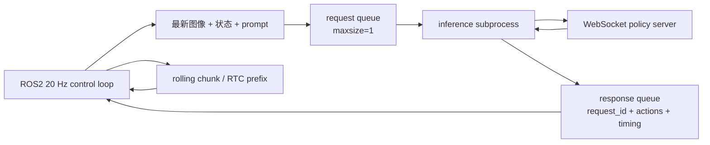
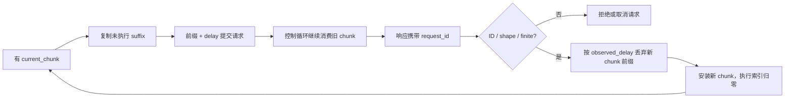

# RTC 异步推理与滚动动作块

> RTC 把“模型还在算、机器人不能停”变成一个带硬前缀的动作补全问题：旧动作负责覆盖已经承诺的控制步，Flow 模型只生成尚未承诺的后缀。

**前情提要**：第 7 章把 FAST 与 Flow 的梯度边界固定下来。本章转到部署时的时间边界：G1 控制循环以 20 Hz 发布动作，远程服务生成下一段长度为 50 的动作块，客户端必须在服务返回前继续执行当前缓存。

**知识链接**：

- [π₀.₅ Flow Action Expert](./06_π05_Flow_Action_Expert)——Euler Flow 采样和 Action Expert。
- [FAST Flow 联合训练与知识隔离](./07_FAST_Flow联合训练与知识隔离)——联合配置中的 RTC 训练参数。
- [RTC 实时控制：Train-Time 与 Test-Time](/系列/groot_rl_deep_dive/05_RTC实时控制_TrainTime与TestTime)——两种 RTC 思路的通用对比。
- [训练时 RTC 源码说明](https://github.com/SILVIO-ZHENG/Pi0.7-Flow-matching/blob/main/docs/reproduction/training_time_rtc.md)。

## 延迟先换算成控制步

假设动作块长度是 $H=50$，控制频率是 20 Hz，因此每一个动作步代表约 50 ms。模型请求发出后，机器人在等待期间仍然执行旧 chunk；若服务耗时 $d$ 个控制步，新结果到达时，它的前 $d$ 个时间位置已经失去执行机会。

系统要保留至少 $s$ 个可执行的后缀步，就必须让延迟落在动作块剩余缓冲内：

$$
d\le H-s
$$

**这个公式在做什么**：给一次异步请求设置可承受的最大控制步延迟，保证旧 chunk 至少能撑到新 chunk 返回并留下 $s$ 步可执行动作。

::: details 📐 公式详解（点击展开）

| 子表达式 | 它是谁 | 它在干嘛 |
|---------|--------|---------|
| $d$ | **实测延迟** | 从请求提交到结果被客户端接收所经过的控制 tick 数，不是一个脱离控制频率的毫秒常数 |
| $H$ | **预测视野** | 模型一次生成的动作步数；本项目固定为 50 |
| $s$ | **执行缓冲** | 需要留给机器人实际消费的最小 postfix 步数，项目的训练示例取 25 |
| $H-s$ | **可用于等待的余量** | 动作块中可以被推理时间消耗而不至于完全断粮的步数 |

**用人话读**：等待时间不能吃光动作块中预留的缓冲，块越短或要求执行的后缀越长，能承受的延迟越小。

**为什么用控制步而不是直接用毫秒**：缓存、跳过位置和执行索引都按控制循环推进；把 100 ms 在 20 Hz 下换成 2 步，才能和数组切片及控制器状态一一对应。
:::

训练配置通过 `execution_horizon=25` 和 `max_prefix_steps=25` 约束合法前缀。推理端的延迟历史使用最近若干次控制步作为保守估计；它不是把任意网络抖动隐藏掉，而是提前让请求发生，避免缓存耗尽。

## 异步客户端的两个进程

ROS2 控制回调不能等待 WebSocket 推理。项目把远程调用放进 `AsyncPolicyProcess`：主进程持续构建观察、取缓存动作和发布；子进程连接 policy server、调用 `infer`、返回动作及 client/server/model timing。请求队列深度为 1，响应队列深度为 4；提交新观察前清掉尚未开始的旧请求，取结果时保留最新 response。

> 队列的关键语义是“最新观察优先”：旧请求即使稍后返回，也必须靠 `request_id` 被识别为过期，不能覆盖当前执行状态。

`submit_latest` 生成单调递增的 `request_id`；`poll_latest` 排空 response queue，只接受不小于当前最新请求 ID 的结果。子进程异常会发送 `ok=false` 和 traceback，主进程取消对应 RTC request。这个设计把通信错误转换成可审计的状态，而不是让异常悄悄阻塞控制回调。

## 训练时 RTC 的硬前缀

部署时，旧 chunk 中等待期间必然会执行的动作是已知量。设它们是 $a_h^{old}$，前缀长度是 $d$；真实示教动作块是 $a_h$，噪声是 $\epsilon_h$，Flow 时间是 $t$。模型输入动作的每个时间位置使用下面的分段构造：

$$
\tilde{x}_{t,h}=\begin{cases}
a_h^{old}, & h<d,\\
t\epsilon_h+(1-t)a_h, & h\ge d.
\end{cases}
$$

**这个公式在做什么**：把旧 chunk 的已承诺部分直接写入新样本的前缀，只对没有承诺的 postfix 使用普通 Flow Matching 噪声路径。

::: details 📐 公式详解（点击展开）

| 子表达式 | 它是谁 | 它在干嘛 |
|---------|--------|---------|
| $a_h^{old}$ | **已承诺动作** | 机器人在推理等待期间真正会执行的旧计划，不能被新采样改写 |
| $h<d$ | **硬前缀选择器** | 用控制步索引识别已经过去或即将按旧计划执行的位置 |
| $t\epsilon_h+(1-t)a_h$ | **待生成后缀路径** | 对仍有决策空间的位置使用第 6 章的线性 Flow 路径 |
| $h\ge d$ | **postfix 选择器** | 把模型自由生成限制在尚未承诺的未来位置 |

**用人话读**：已经承诺给机器人的动作保持原样，尚未承诺的未来位置从噪声逐步生成。

**为什么是硬替换而不是平均**：平均新旧动作可能得到训练分布之外的中间轨迹；硬前缀保留物理上已经承诺的状态，只让模型学习一个有明确边界的条件分布。训练时前缀的 Flow 时间被置为 0，表示它是干净动作；Flow loss 只保留 postfix，并保留至少一个有效监督步。
:::

需要区分两种前缀来源：训练 forward 根据采样出的前缀步，直接把当前示教动作当作干净 prefix，用来模拟“这些动作已经确定”；部署时才把上一段 chunk 在等待期间实际提交的动作放进 `observation["rtc_prefix"]`。训练代码不需要读取上一轮远程请求的运行时状态。

在推理循环中，`_prepare_rtc_prefix` 检查 prefix 是否与 `[B,50,32]` 完全同形、是否包含有限数值，并把 `delay` 限制在 `[0,50]`。每个 Euler step 开始前用 `torch.where` 重写 prefix；prefix 的时间为 0，postfix 才使用当前 `flow_time`。最后一次 Euler 更新会再次改变整个张量，所以采样结束还要恢复 prefix，确保传给下游的动作与已提交计划逐元素一致。

## 从响应到滚动 chunk

`RtcChunker` 保存四类运行状态：当前 chunk、当前 chunk 已执行步数、正在飞行的 request context、最近的延迟历史。一次请求的完整转换如下：

> 回边表示滚动执行：当前 chunk 从未执行到已执行，后台请求在缓存快耗尽前启动，响应只接管尚未过期的未来。

发出请求时，`make_action_prefix` 把当前 chunk 的未执行 suffix 拷贝到 `[50,D]` 的数组，并返回估计 delay；`make_request_context` 记录 `request_id`、起始控制步、已执行步和旧 suffix。返回响应时，`observed_delay` 是当前控制步与请求起始步的差，新的 chunk 丢弃对应数量的开头位置，然后安装为当前 chunk。

一个最小的数值例子：旧 chunk 还剩 `[q_4,q_5,q_6,q_7]`，请求耗时 2 个控制步；返回的新 chunk 是 `[n_0,n_1,n_2,n_3,n_4]`。`n_0,n_1` 的时间位置已经错过，执行队列接收 `[n_2,n_3,n_4]`，而不是把整段新 chunk 从当前位置硬接上去。这样“跳过”是时间对齐，不是丢失模型预测质量。

`accept_new_chunk` 还会拒绝三类危险结果：request ID 不匹配、动作维度与旧计划不一致、数组包含 NaN/Inf。失败请求可以 `cancel_request`，让下一次滚动请求恢复；未经请求的响应不能成为当前动作。

## 轨迹整形与两种连续性

policy server 返回的是模型频率下的动作块，`make_execution_plan` 依次完成四件事：检查二维、非空和有限数值；截取最多 50 步和 28 个执行维度；按 policy action Hz 到 control Hz 做线性/三次插值；插值前后都按关节上下界裁剪。RTC chunker 再以控制 tick 消费结果。

插值处理的是采样频率差异，RTC 处理的是跨请求的时间对齐，二者不能互相替代。即使线性插值让单个 chunk 内部平滑，新旧 chunk 若在错误时间位置拼接，仍会产生 seam jump；反过来，时间位置对齐了，过低的动作采样率也可能造成单 chunk 内部阶梯。

项目另有一个普通 `async` 模式：它在新结果到达时清空执行队列并运行一段短 chunk；`rtc` 模式使用 `RtcChunker` 的硬前缀和延迟估计。评测时应明确记录控制模式，不能把普通队列刷新误称为 RTC。

## 延迟与连续性指标

离线 `simulate_rtc_replay.py` 不连接 ROS、不访问 policy server，它用合成 chunk 或 NPZ chunk 重演固定延迟，输出 `mean_delay_steps`、`max_delay_steps`、动作一阶差分和二阶差分。真机日志还应记录 request ID、prefix 步数、队列剩余步数、队列耗尽次数、server/client/model timing 以及安全门触发次数。

只看平均延迟不够：平均值可能掩盖一次很长的尾部延迟；只看动作 MAE 也不够：动作数值接近不代表 chunk seam 的一阶速度和二阶变化连续。RTC 的验收应同时看延迟分布、接缝变化和是否出现 fallback/hold。

## 小结

RTC 的工程闭环由四个动作组成：用控制步表示延迟，用旧 chunk 构造硬前缀，用 request ID 和有限性检查拒绝过期结果，按已消耗步数切掉新 chunk 的过期部分。它不让远程服务变快，而是把不可避免的等待显式建模为条件输入，并把控制循环从网络调用中解耦出来。

**下一章聚焦**：异步动作即使时间对齐，也不能绕过限位、状态新鲜度和急停状态。第 9 章给出从离线 holdout 到 policy server、ROS2 安全门和真机放行的完整复现实验顺序。
