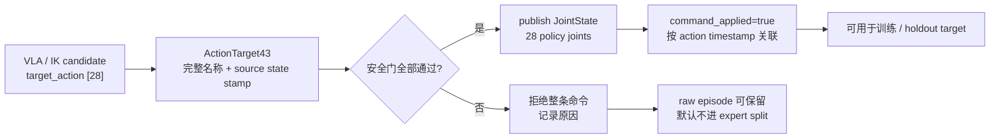

# 安全门与端到端复现实验

> 训练成功、离线动作误差合格和真机允许发布命令是三个不同结论。本章把它们拆成有顺序的检查，并说明项目的最终安全门为什么默认拒绝动作。

**前情提要**：第 8 章让异步推理可以在 20 Hz 控制循环中滚动提供动作，但滚动缓存只解决时间问题。真机还必须确认 43 个关节的命名顺序、28 个策略关节的限位、状态和图像的新鲜度、底层稳定状态及急停状态。

**知识链接**：

- [RTC 异步推理与滚动动作块](./08_RTC异步推理与滚动动作块)——延迟对齐和 chunk replay。
- [数据质检 LeRobot 与 q01 q99](./05_数据质检LeRobot与q01q99)——episode 质检、`command_applied` 和归一化统计。
- [项目源码 End-to-End Runbook](https://github.com/SILVIO-ZHENG/Pi0.7-Flow-matching/blob/main/docs/reproduction/runbook.md)。
- [ROS2 安全边界说明](https://github.com/SILVIO-ZHENG/Pi0.7-Flow-matching/blob/main/ros2_ws/README.md#command-safety-boundary)。

## 三种“通过”不是一回事

以“用双手拿箱子”为例，系统至少有三个评价层：

| 层级 | 回答的问题 | 代表产物 |
|------|------------|---------|
| 数据通过 | 这条 episode 的时间戳、shape、标签和安全门记录可信吗 | raw MCAP、Parquet、MP4、metadata |
| 模型通过 | 给定 holdout 的图像和状态，模型能否预测未来动作块 | `predictions.npz`、`targets.npz`、`metrics.csv` |
| 执行通过 | 每条命令是否在当前状态和安全条件下才被发布 | ROS2 command topic、拒绝原因和动作日志 |

训练 loss 下降只能证明优化目标在数据上变小；它不证明模型输出在目标机器人限位内，更不证明网络断开、时钟漂移或底层失稳时命令会停止。发布到执行器的边界必须有独立的确定性检查。

## 最终命令安全门

`robot_command_adapter` 接收带完整 43 维名称和时间戳的 `ActionTarget43`，只发布 28 个策略关节的命名 `JointState`。任何检查失败都拒绝整条命令，不发送“通过了一半的关节”。把门的逻辑写成合取关系，可以明确它不是一个可选的打分器：

$$
G=G_{enable}\land G_{limits}\land G_{stable}\land\neg G_{estop}\land G_{fresh}\land G_{finite}\land G_{range}\land G_{jump}\land G_{monotonic}
$$

**这个公式在做什么**：只有所有独立安全条件同时成立，候选动作才有资格从策略消息变成机器人命令；任意一项失败都会使整条命令被拒绝。

::: details 📐 公式详解（点击展开）

| 子表达式 | 它是谁 | 它在干嘛 |
|---------|--------|---------|
| $G_{enable}\land G_{limits}$ | **人工放行条件** | 要求 `enable_robot_commands=true`，并确认限位来自目标机器人的 URDF，而不是示例数值 |
| $G_{stable}\land\neg G_{estop}$ | **底层状态条件** | 低层控制器必须报告稳定，急停必须未激活；启动默认值是“不稳定 + 急停有效” |
| $G_{fresh}\land G_{finite}$ | **数据完整性条件** | 当前状态、动作消息和生成动作必须在年龄阈值内，且没有 NaN/Inf |
| $G_{range}\land G_{jump}$ | **物理幅度条件** | 28 个策略关节必须在上下界内，且相对当前关节位置的单周期跳变不超过 `max_step_rad` |
| $G_{monotonic}$ | **时间顺序条件** | action timestamp 必须严格递增，拒绝重复或回放的旧命令 |

**用人话读**：门上有九把锁，必须每一把都打开才发布一条完整命令。

**为什么使用 AND 而不是风险平均**：急停有效或关节跳变超限不是可以由其他“好条件”抵消的轻微扣分，而是单项就足以使动作不安全的硬故障。安全门因此采用 fail-closed 逻辑。
:::

默认参数体现了这一原则：`enable_robot_commands=false`、`limits_confirmed=false`，节点初始化时 `_stable=false`、`_estop=true`。状态消息若不含完整 43 个 canonical joint names、位置含 NaN/Inf 或 validity mask 缺失，也不会更新有效状态。

## 候选动作与已应用动作

策略生成的动作不是自动等于示教标签。项目在 ROS2 链路中区分：



> `target_action` 记录“模型或 IK 想做什么”，`action` 记录“安全门批准并发布了什么”；`command_applied` 记录二者是否在同一个 action timestamp 上匹配。

`command_applied=false` 的候选动作仍有分析价值，例如可以统计 IK 失败、状态过旧或命令跳变的原因，但默认不能冒充专家动作进入训练。这样模型不会把被安全门拦截的危险输出当成成功示范，也不会让数据转换器失去“这一步是否真的发出”的证据。

## 端到端复现顺序

复现实验分为“数据、训练、离线评估、服务、真机”五层。顺序本身是安全边界的一部分：没有 holdout 和 RTC replay 结果，就没有理由启动实时命令发布。

### 环境与核心测试

先安装项目声明的 Python 依赖并运行核心测试。这个阶段验证 43/28/32 映射、动作 padding、时间同步、q01/q99、IK、XR 标定、sidecar、RTC 和非有限动作拒绝；它不需要打开机器人命令。

```bash
cd .pi07_src
uv sync
uv run python -m pytest tests -q
```

运行成功后应保留测试输出；若本机缺少 `numpy`、PyTorch 或 ROS2，记录为环境阻塞并停止向真机推进，不要用“跳过测试”替代证据。

### 记录与数据质检

真机记录前，先把 43 个 canonical joint names 与目标 G1/Dex3 URDF 对照，配置双臂 MoveIt2 IK 组、校准 XR 到 `torso_link` 的刚体变换和双手七个限位/方向。启动三路 RGB、`/joint_states`、IMU、低层稳定状态和急停状态，保持 `enable_robot_commands=false`。

下面的 launch 命令只启动带安全默认值的记录链路。episode 结束前先写入成功或失败标签，录制器再完成 Parquet、MP4 和 metadata；原始 MCAP 应保留为审计源。

```bash
cd .pi07_src/ros2_ws
colcon build --symlink-install
source install/setup.bash
ros2 launch g1_pi07_bringup record_g1_episode.launch.py \
  episode_id:=pick_box_0001 \
  output_root:=../data/raw \
  task:="Pick up the box with both hands and place it in the target area" \
  enable_xr_udp_bridge:=true
```

命令停止前设置标签：

```bash
# 成功 episode 使用这一行：
ros2 param set /episode_recorder success_label true
# 失败 episode 改用下面两行（不要同时执行成功和失败分支）：
# ros2 param set /episode_recorder success_label false
# ros2 param set /episode_recorder failure_reason "grasp slipped during lift"
```

两条标签命令不是同一次 episode 的连续操作；实际运行时只应提交最终结果。脚本默认排除失败和未标注 episode，并要求动作与安全门批准记录匹配。

### 转换、统计与训练

数据验证和 split 先按完整 episode 执行，再转换为 LeRobot V3。q01/q99 只从 train split 估计，避免 validation/test 的动作范围泄漏。训练顺序是三个 episode overfit smoke、Flow-only 第一阶段、FAST-CE + Flow 第二阶段。

```bash
cd .pi07_src
uv run python scripts/validate_g1_episodes.py --raw-root ./data/raw
uv run python scripts/split_g1_episodes.py \
  --raw-root ./data/raw --output ./data/splits.json
uv run python examples/unitree_g1/data/convert_g1_session_to_lerobot.py \
  --raw-root ./data/raw \
  --root ./data/lerobot/local/g1_43dof_teleop \
  --repo-id local/g1_43dof_teleop \
  --split-file ./data/splits.json --split train
uv run python scripts/compute_norm_stats.py pi07_g1_43dof_joint
```

这些命令只生成和检查数据产物。它们不能证明模型已经学会控制，因此需要单独的训练命令；第一阶段提供稳定的 Flow checkpoint，第二阶段从该 checkpoint 初始化联合目标。

```bash
uv run python scripts/train_pytorch.py pi07_g1_overfit_smoke \
  --exp-name overfit_3eps
uv run python scripts/train_pytorch.py pi05_g1_43dof_flow \
  --exp-name g1_flow_stage1
uv run python scripts/train_pytorch.py pi07_g1_43dof_joint \
  --exp-name g1_joint_stage2 \
  --pytorch-weight-path ./checkpoints/pi05_g1_43dof_flow/g1_flow_stage1/100000
```

`pi07_g1_43dof_joint` 的 Knowledge Insulation 路径当前只支持单训练进程；Flow-only 才保留 DDP。训练日志至少应同时记录 FAST-CE、Flow loss、有效 token 数、有效动作步/维度、RTC prefix 统计和 checkpoint 配置。

### Holdout 与 RTC replay

离线 holdout 取 validation episode 的若干帧，固定随机噪声种子，预测每帧 50 步，并只在非 padding 的未来步上计算 MAE、双臂与双手误差、首步 L2 和推理时间。脚本还会输出三路图像 contact sheet，便于把误差和视觉状态对应起来。

```bash
uv run python examples/unitree_g1/eval/eval_g1_holdout.py \
  --checkpoint ./checkpoints/pi07_g1_43dof_joint/g1_joint_stage2/100000 \
  --episode-dir ./data/raw/validation_episode
uv run python examples/unitree_g1/eval/simulate_rtc_replay.py \
  --output ./outputs/rtc_replay_smoke.npz
uv run pytest examples/unitree_g1/rtc/rtc_chunker_test.py -q
```

Holdout 只回答“模型对离线目标的预测误差如何”；RTC replay 只回答“固定延迟下滚动 chunk 是否正确跳过已执行前缀、动作是否连续”。二者都不连接真实 robot command topic。

### 启动服务但仍保持命令关闭

当 holdout 和 replay 产物通过人工检查后，再启动 policy server，并让客户端先以观测、日志和拒绝模式运行。服务端负责模型 preprocess、prefix KV cache 和 10 步 Flow sampling，客户端负责 ROS2 观察、RTC、动作计划和日志。

```bash
uv run python scripts/serve_policy.py policy:checkpoint \
  --policy.config pi07_g1_43dof_joint \
  --policy.dir ./checkpoints/pi07_g1_43dof_joint/g1_joint_stage2/100000
```

客户端的 `g1_43dof.example.json` 应先保持 `enable_robot_commands: false`，确认图像尺寸、关节顺序、状态年龄、request ID、RTC prefix 和 response timing 都正常。只有在实验负责人完成 URDF 限位确认、低层稳定与急停 topic 检查后，才有资格切换放行参数。

## 真机放行检查表

| 检查 | 通过证据 | 失败时动作 |
|------|----------|------------|
| 43 维状态名称 | 与 canonical tuple 完全一致 | 拒绝状态更新 |
| 28 维策略映射 | `policy_indices` 与限位文件一致 | 拒绝动作 |
| 限位来源 | `confirmed_from_robot_urdf=true` | 保持 live commands 关闭 |
| 状态/动作新鲜度 | 年龄低于配置阈值 | 拒绝整条命令 |
| 稳定/急停 | stable=true 且 estop=false | 不发布 |
| 数值有限性 | 目标和当前状态没有 NaN/Inf | 不发布 |
| 范围与跳变 | 28 维都在上下界，单周期差低于阈值 | 不发布 |
| 时间戳 | action timestamp 严格递增 | 拒绝回放结果 |
| 回滚行为 | 队列耗尽、推理异常时进入 hold/fallback | 停止放行并保留日志 |

放行不是把所有错误都“裁剪”成合法值。当前 `make_execution_plan` 会在执行计划阶段按限位 clip，安全门随后检查送入 ROS2 的最终 28 维目标以及它相对当前状态的跳变；因此实验日志还应保存未 clip 的 `raw_actions` 并统计被 clip 的比例。否则模型可能持续输出越界值、依赖裁剪器掩盖训练和归一化问题，而安全门看不到这个上游质量退化。

## 评测报告应保存什么

每次实验至少保存以下关联关系：checkpoint 与 git commit、配置文件、norm stats、train/validation/test episode ID、随机种子、holdout 的 predictions/targets、RTC replay 的延迟和差分指标、policy/model/server/client timing、安全门拒绝计数、急停和限位触发记录。

不要只报告一个“成功率”。对这个系统，成功率必须能够回溯到：哪条 episode 被纳入、哪些动作真的 applied、哪一次推理响应被接受、哪一个安全条件拒绝了候选。如果没有这些 sidecar 和 timing，成功率无法区分模型失败、数据失败、通信延迟和安全门主动保护。

## 小结

端到端复现的终点不是“脚本能跑”，而是形成一条可审计证据链：原始 episode 可追溯，训练数据只含批准动作，Flow/FAST/RTC 的 mask 和梯度边界正确，holdout 与 replay 各自通过，policy server 延迟可测，最后每条真机命令仍需经过默认拒绝的确定性安全门。

至此，系列从 43 DoF G1 的关节契约、XR 示教、动作中心记录、LeRobot 数据、π₀.₅ Flow Expert、FAST 联合训练，一直走到了 RTC 异步部署和真机放行。项目仍是非官方 π₀.₇-inspired 研究实现；任何真实机器人结论都应以目标硬件上的独立实验记录为准。
