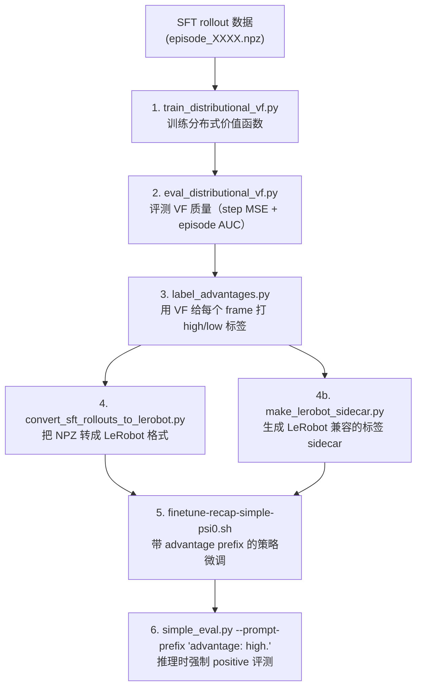

# 第一章：仓库全景与 Pipeline 总览

> 上一章：无（系列开篇）
> 下一章：[分布式价值函数：网络结构与训练](./02_分布式价值函数_网络结构与训练)

## 前情提要

本系列拆解 [Psi0-Recap](https://github.com/ashah1002/Psi0-Recap) 仓库——目前公开的最完整的 RECAP 开源复现。本章先画出全局地图：仓库长什么样、数据怎么流、脚本按什么顺序跑。

---

## 一、仓库目录结构

Psi0-Recap 是 [Ψ₀](https://github.com/physical-superintelligence-lab/Psi0) 的 fork，在上游的基础上新增了 RECAP 相关的模块。与 RECAP 直接相关的文件集中在两个位置：

```text
Psi0-Recap/
├── src/psi/recap/                    ← RECAP 核心库（被 scripts 调用）
│   ├── schema.py                     # 常量定义：201 bins、V_MIN=-1、V_MAX=0、状态维度
│   ├── npz_dataset.py                # 加载 rollout NPZ、计算归一化 return、构建 Dataset
│   ├── distributional_vf.py          # 分布式价值函数网络定义（ResNet-50 + MLP）
│   ├── advantages.py                 # A = R - V、百分位二值化、DataFrame 输出
│   ├── label_store.py                # 标签查询接口（供微调时的 Transform 消费）
│   └── checkpointing.py             # 模型存取
│
├── scripts/recap/                    ← RECAP pipeline 的 5 个脚本入口
│   ├── collect_simple_rollouts.py    # 数据采集（stub，提示用户自行准备 NPZ）
│   ├── train_distributional_vf.py    # 训练价值函数
│   ├── eval_distributional_vf.py     # 评测价值函数（step MSE + episode AUC）
│   ├── label_advantages.py           # 用训好的 VF 给每个 frame 打 high/low 标签
│   ├── make_lerobot_sidecar.py       # 转换标签格式以兼容 LeRobot 数据加载
│   ├── convert_sft_rollouts_to_lerobot.py  # 把 NPZ rollout 转成 LeRobot 格式
│   └── visualize_vf.py              # 可视化 VF 预测 vs 真实 return
│
├── scripts/train/psi0/
│   └── finetune-recap-simple-psi0.sh ← RECAP 微调的 torchrun 入口
│
├── src/psi/config/transform.py       ← SimpleRepackTransform 中的 RECAP prefix 注入逻辑
│
└── tests/
    └── test_recap_value_function.py  ← 单元测试，覆盖 return 计算、VF 形状、标签逻辑
```

**与上游 Ψ₀ 完全无关、纯 RECAP 新增的文件**只有 `src/psi/recap/` 整个目录和 `scripts/recap/` 整个目录。对 `src/psi/config/transform.py` 的改动是在已有的 `SimpleRepackTransform` 类上新增了几个字段和一个 `format_recap_instruction()` 方法——这是 RECAP 接入 Ψ₀ 训练循环的唯一侵入点。

---

## 二、数据流与 Pipeline 执行顺序

整个 RECAP pipeline 是一条线性的离线加工链路，没有循环迭代（论文原文有多轮迭代，但这个课程项目只做了一轮）：



每一步的输入输出：

| 步骤 | 输入 | 输出 | 说明 |
|------|------|------|------|
| 1. 训练 VF | `sft-bendpick/episode_*.npz` | `checkpoints/recap_vf/bendpick.pt` | 50 epochs，Adam，cross-entropy |
| 2. 评测 VF | checkpoint + NPZ | 终端打印 step MSE / episode AUC | 不产出文件，纯诊断 |
| 3. 标签生成 | checkpoint + NPZ | `recap_labels/.../advantage_labels.parquet` | 加一个 `label_summary.json` |
| 4. 数据转换 | NPZ | LeRobot 格式 dataset | 供 Ψ₀ 的训练 dataloader 消费 |
| 5. 策略微调 | LeRobot dataset + parquet 标签 | Ψ₀ checkpoint in `.runs/` | DDP 多卡 torchrun |
| 6. 评测 | 微调后 checkpoint | 成功率 / 视频 | SIMPLE 仿真闭环 |

---

## 三、NPZ 数据格式：一条 rollout 长什么样

整个 pipeline 的最上游是一组 `.npz` 文件，每个文件存储一条完整 episode 的观测序列。格式如下：

```python
# episode_0042.npz 的内容
{
    "obs_states":    # shape (T_obs, 32)     float32   # 每个 VLA 查询点的本体感受状态
    "obs_images":    # shape (T_obs, H, W, 3) uint8    # 每个查询点的前置相机图像
    "success":       # shape ()              bool      # 整条轨迹最终成功/失败
    "n_steps":       # shape ()              int64     # 总仿真步数（不是查询点数）
    "action_chunks": # shape (T_obs, 30, 36) float32   # 可选，VF 不使用
}
```

**关键区分**：`T_obs`（VLA 查询点数，通常 4-23 个）≠ `n_steps`（仿真步数，通常 100-600）。VLA 不是每个仿真步都做决策的——它每次推理出一个 30 步的动作块（action chunk），开环执行完之后才再次查询。所以一条 600 步的轨迹可能只有 ~20 个查询点。

**这意味着 value function 评估的粒度也是"每个 VLA 决策点"**，不是"每个仿真步"。这是仓库实现中最容易被忽略的一个细节——它和原论文描述的"逐步 $r_t=-1$ 累加"在语义上一致（每个决策点对应一段时间的消耗），但在数值上做了一个近似：假设查询点在轨迹内均匀分布。

---

## 四、关键常量定义（schema.py）

```python
NUM_VALUE_BINS = 201        # 价值分布的离散化 bin 数量
V_MIN = -1.0                # 归一化后 return 的下界（失败 / 最慢的成功）
V_MAX = 0.0                 # 归一化后 return 的上界（刚刚成功的最后一帧）
MAX_EPISODE_STEPS = 600     # 用于归一化 return 的最大步数
NPZ_STATE_DIM = 32          # 本体感受状态的维度
```

这些常量对齐了 π\*₀.₆ 论文的 RECAP recipe：201 bins、return 归一化到 $(-1, 0)$。`MAX_EPISODE_STEPS=600` 是 SIMPLE bendpick 任务的超时步数，对应论文中"按最大步数做归一化"的设计。

---

## 五、与原文 pipeline 的对应关系

| 原文 pipeline 步骤 | Psi0-Recap 对应 | 差异 |
|-------------------|-----------------|------|
| 多任务示教数据 → 预训练 VF | 仅用 bendpick 单任务 SFT rollout | 无多任务，VF 只见一个任务 |
| 预训练策略 π_pre | Ψ₀ 的 pre + posttrain checkpoint | 不是 π0.6，是一个 2B 的开源模型 |
| 部署策略采集自主 rollout | `collect_simple_rollouts.py`（stub） | 实际用的是现成的 SFT rollout |
| 训练 distributional VF（Gemma-670M 骨干） | `train_distributional_vf.py`（ResNet-50 骨干） | 骨干规模差 100 倍，但功能角色相同 |
| 算优势 → 二值化 | `label_advantages.py` | 完全对齐原文 |
| Advantage conditioning 训练策略 | `finetune-recap-simple-psi0.sh` | prefix 方式略有不同（见第四章） |
| 多轮迭代 | **未实现** | 课程项目只做了一轮 |
| 推理时 CFG 增强 | **未实现** | 只做了最基本的"强制 positive" |
| 人工纠错数据标记为 positive | **未实现** | 无人工纠错数据 |

---

## 六、本章小结

Psi0-Recap 的 pipeline 结构非常清晰：**5 个独立脚本串联成一条线性加工链**，从 NPZ rollout 数据出发，经过"训 VF → 打标签 → 转格式 → 微调"四步，产出一个 advantage-conditioned 的 Ψ₀ checkpoint。没有多轮迭代、没有 CFG、没有人工纠错——这些都是原文有但本实现省略的部分（具体分析见第五章）。

下一章我们进入第一个核心模块：分布式价值函数的网络结构和训练过程。

---

> 下一章：[分布式价值函数：网络结构与训练](./02_分布式价值函数_网络结构与训练)
