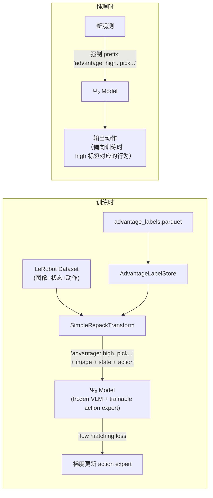

# 第四章：Advantage Conditioning 接入 Ψ₀ 训练

> 上一章：[优势计算与标签生成](./03_优势计算与标签生成)
> 下一章：[与原文的设计差异总结](./05_与原文的设计差异总结)

## 前情提要

上一章生成了 Parquet 标签文件，每个 `(episode_id, frame_id)` 都有一个 "high" 或 "low" 标签。本章讲这些标签如何**注入到 Ψ₀ 的训练输入**中——这是 RECAP "不改训练 loss、只改输入格式"这个核心设计的工程落地。

---

## 一、注入方式：instruction prefix

RECAP 的理论要求是"把改进指示符作为额外的条件输入"。原文（π\*₀.₆）把它编码成一段文本，插在预测出的子任务描述之后、动作 token 之前。Psi0-Recap 的做法更简单——直接把 advantage 标签作为**任务指令的前缀**拼接：

```python
# 原始指令："bend down and pick up the object"
# RECAP 处理后：
#   "advantage: high. bend down and pick up the object"  (如果这帧标签是 high)
#   "advantage: low. bend down and pick up the object"   (如果这帧标签是 low)
```

实现在 `src/psi/config/transform.py` 的 `SimpleRepackTransform.format_recap_instruction()`：

```python
def format_recap_instruction(self, instruction: str, data: dict) -> str:
    if not self.enable_recap_prefix:
        return instruction  # 没开 RECAP 时直接返回原始指令

    # 查表拿标签
    label = self.default_advantage_label.lower()  # 默认 "high"
    if self._label_store is not None:
        looked = self._label_store.lookup(
            episode_id=..., frame_id=...,
            episode_index=..., frame_index=...,
            default=None,
        )
        if looked is not None:
            label = looked

    # 拼接前缀
    prefix = self.advantage_prefix_high if label == "high" else self.advantage_prefix_low
    return f"{prefix} {instruction}"
    # 例：  "advantage: high. bend down and pick up the object"
```

**这个设计和原文的区别**：

| 维度 | π\*₀.₆ 原文 | Psi0-Recap |
|------|-------------|-----------|
| 标签文本 | "Advantage: positive" / "Advantage: negative" | "advantage: high." / "advantage: low." |
| 插入位置 | 子任务描述之后、动作 token 之前 | 任务指令最前面 |
| 作为独立 token 还是 prefix | 独立的一段文本 | 作为 instruction 的一部分 |
| 训练时随机丢弃 | 30% 概率不给 advantage 文本 | **未实现**（每帧都有 prefix） |

**没有 dropout 的影响**：原文的 30% dropout 是 CFG 的训练技巧——让模型同时学会"无条件生成"和"有条件生成"，推理时才能用 $\beta$ 控制增强强度。Psi0-Recap 没有实现 dropout，也没有实现推理时的 CFG 增强。推理时直接把所有帧的 prefix 强制设为 "advantage: high." 就行——效果等价于 $\beta=1$（纯条件生成，无增强）。

---

## 二、SimpleRepackTransform 的配置字段

看一下 `SimpleRepackTransform` 新增的 RECAP 相关字段：

```python
class SimpleRepackTransform(LerobotRepackTransform):
    # ... 上游的字段 ...

    # RECAP advantage-conditioned instruction prefixing
    enable_recap_prefix: bool = False                    # 总开关
    advantage_label_sidecar: str | None = None           # parquet 文件路径
    default_advantage_label: str = "high"                # 查不到标签时的默认值
    advantage_prefix_high: str = "advantage: high."      # positive 前缀文本
    advantage_prefix_low: str = "advantage: low."        # negative 前缀文本
    strict_advantage_labels: bool = False                # 查不到时是否报错

    _label_store: Any = PrivateAttr(default=None)        # 内存中的标签索引

    def model_post_init(self, __context):
        if self.advantage_label_sidecar:
            self._label_store = AdvantageLabelStore(resolve_path(self.advantage_label_sidecar))
```

几个值得注意的设计：

1. **`default_advantage_label = "high"`**：如果某个 frame 在 parquet 里找不到对应标签（比如数据集里新增了 episode），默认给 "high"。这意味着没有标签的数据等同于"把所有动作当作好动作来学"——和纯 SFT 效果一样。
2. **`strict_advantage_labels = False`**：不强制每帧都有标签。这让 pipeline 容错性更好——即使标签文件和数据集有少量不对齐（比如新采的几条 episode 还没来得及打标签），训练也不会崩。
3. **`PrivateAttr`**：`_label_store` 不参与 Pydantic 的序列化/反序列化，只在运行时存在。

---

## 三、微调脚本的关键参数

`scripts/train/psi0/finetune-recap-simple-psi0.sh` 中和 RECAP 相关的参数：

```bash
# 开启 RECAP prefix 注入
--data.transform.repack.enable-recap-prefix
# 指定标签文件路径
--data.transform.repack.advantage-label-sidecar=$advantage_sidecar
# 查不到标签时默认 "high"
--data.transform.repack.default-advantage-label=high
```

其他训练参数和标准 SFT 微调完全一致：

```bash
--train.learning_rate=1e-4
--train.max_training_steps=40000
--train.warmup_steps=1000
--train.lr_scheduler_type=cosine
--train.train_batch_size=16         # per-GPU
--train.gradient_accumulation_steps=1
--train.mixed_precision=bf16
--model.no-tune-vlm                 # 冻结 VLM 骨干，只训练 action expert
--model.noise-scheduler=flow        # Flow Matching 动作头
--model.action-chunk-size=30        # 每次生成 30 步动作
```

**`--model.no-tune-vlm` 的含义**：和原文一样，只训练 action expert（flow matching 那部分参数），VLM 骨干完全冻结。这意味着 "advantage: high." 这段前缀文本被 VLM tokenizer 编码后，通过冻结的 attention 传递给 action expert——action expert 学会的是"当输入序列里出现 advantage: high 这些 token 时，输出什么样的动作分布"。

---

## 四、推理时的使用方式

评测脚本通过 `--prompt-prefix` 参数控制推理时的 advantage 条件：

```bash
python examples/simple/simple_eval.py \
    --prompt-prefix "advantage: high." \
    --run-dir=.runs/finetune/... \
    --ckpt-step=latest
```

推理时**永远强制 "advantage: high."**，让模型只输出它在训练数据里学到的"high 那一类"对应的动作模式。这就是 [Advantage Conditioning 前置知识](/前置知识/002r_前置知识_Advantage_Conditioning优势条件化策略提取) 里推导的核心结论：条件在 positive 上采样 ≈ 从改进策略中采样。

---

## 五、数据转换：NPZ → LeRobot 格式

微调脚本消费的不是原始 NPZ，而是 LeRobot 格式的 dataset。转换由两个脚本完成：

1. **`convert_sft_rollouts_to_lerobot.py`**：把 `episode_XXXX.npz` 转成 LeRoBot 的目录结构（图像序列 + parquet 动作文件 + metadata）
2. **`make_lerobot_sidecar.py`**：把 advantage labels 的 parquet 格式调整为和 LeRobot 数据索引对齐的格式，让 `SimpleRepackTransform` 能用 `(episode_index, frame_index)` 查到标签

这两个脚本的存在是因为 Ψ₀ 的训练框架已经有了成熟的 LeRoBot 数据加载管道——RECAP 不需要重写数据加载逻辑，只需要把标签"侧挂"（sidecar）到已有的数据管道上。

---

## 六、完整训练流程的数据流图



---

## 七、和原文训练流程的对比

| 维度 | π\*₀.₆ 原文 | Psi0-Recap |
|------|-------------|-----------|
| 双分支训练（有条件 + 无条件） | ✓（30% dropout） | ✗（每帧都有 prefix） |
| CFG 推理增强 | ✓（$\beta$ 可调） | ✗（纯条件采样） |
| 人工纠错数据强制 positive | ✓ | ✗（无人工纠错数据） |
| VLM 骨干冻结 | ✓ | ✓ |
| 从预训练检查点重新微调 | ✓（每轮迭代都重新开始） | ✓（从 pre+posttrain checkpoint 开始） |
| 多轮迭代 | ✓（采集→重训→再采集） | ✗（只做一轮） |
| 混入通用多模态数据防过拟合 | ✓ | ✗（纯单任务微调） |

**缺少 dropout 和 CFG 是最大的功能缺失**——这意味着 Psi0-Recap 的策略只能做"条件在 positive 上的硬切换"，不能通过 $\beta$ 参数调节"挑食程度"。如果 30% 的 "high" 数据中恰好包含了一些噪声（VF 估计不准导致某些实际不太好的帧被误标为 high），策略会原封不动地学到这些噪声，没有 CFG 的"无条件分布"做对冲。

---

## 八、本章小结

| 维度 | 实现细节 |
|------|---------|
| 注入方式 | instruction prefix："advantage: high/low. " + 原始指令 |
| 查表机制 | `AdvantageLabelStore`，Parquet → 内存 HashMap，O(1) |
| 默认行为 | 标签缺失时默认 "high"（等效 SFT） |
| 训练目标 | 和 SFT 完全一样的 flow matching loss |
| 推理方式 | 强制 "advantage: high." 前缀 |
| 和原文的差距 | 无 dropout、无 CFG、无人工纠错 |

---

> 下一章：[与原文的设计差异总结](./05_与原文的设计差异总结)
