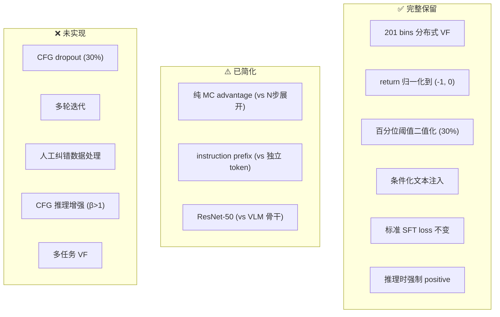
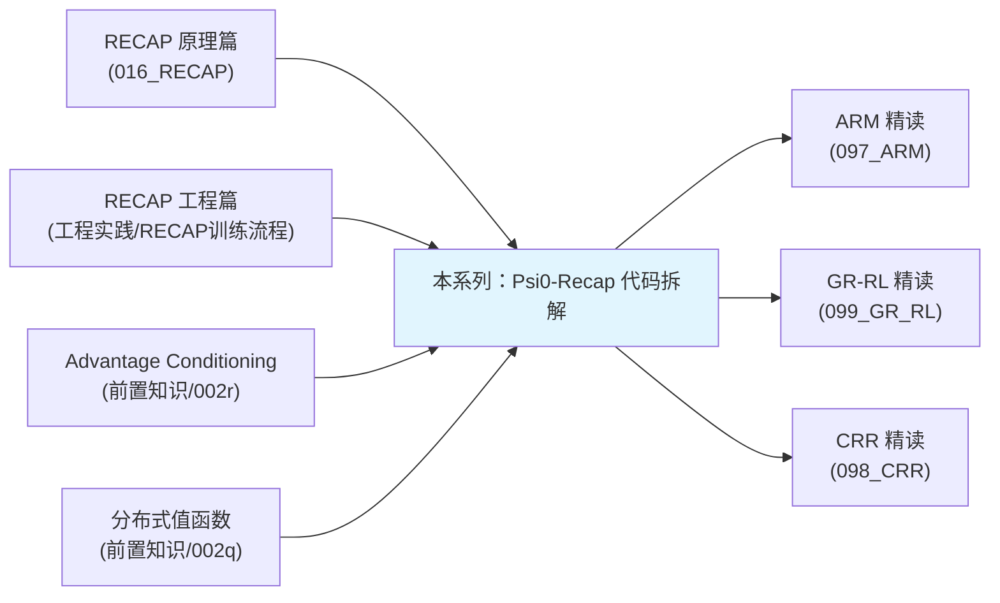

# 第五章：与原文的设计差异总结

> 上一章：[Advantage Conditioning 接入 Ψ₀ 训练](./04_Advantage_Conditioning接入训练)

## 前情提要

前四章逐模块拆解了 Psi0-Recap 的实现。本章做一个系统性的总结：哪些设计忠实复现了原文、哪些做了简化、简化是否合理、哪些地方如果要进一步开发应该补回来。

---

## 一、忠实复现的部分（核心骨架完整）

以下是 Psi0-Recap 和 π\*₀.₆ 原文**完全对齐**的设计选择：

| 设计点 | 原文描述 | Psi0-Recap 实现 | 判定 |
|--------|---------|----------------|------|
| 分布式值函数训练 | 201 bins，cross-entropy，归一化 return 到 $(-1, 0)$ | ✓ 完全一致 | ✅ |
| Return 定义 | 成功：负的归一化剩余步数；失败：饱和到 $-1$ | ✓ 完全一致 | ✅ |
| 优势定义 | $A = R_t - V(s_t)$（预训练阶段的 MC 估计） | ✓ 一致（对应预训练阶段） | ✅ |
| 二值化机制 | 百分位阈值，top 30% → positive | ✓ 完全一致 | ✅ |
| 策略训练目标 | 和 SFT 完全相同的 loss，只改输入 | ✓ 完全一致 | ✅ |
| 条件化方式 | 文本标签拼入输入序列 | ✓ 语义一致（格式略有不同） | ✅ |
| 推理时强制 positive | ✓ | ✓ | ✅ |
| VLM 骨干冻结 | ✓ | ✓ | ✅ |
| 从预训练 checkpoint 微调 | ✓ | ✓ | ✅ |

**结论**：RECAP 方法的核心骨架——"训 VF → 算优势 → 二值化 → 条件化训练 → 强制 positive 推理"——被完整保留。这个 pipeline 可以作为理解 RECAP 工程实现的参考。

---

## 二、简化的部分（功能缺失）

### 2.1 无 CFG dropout（影响：中等）

| 原文 | Psi0-Recap |
|------|-----------|
| 训练时 30% 概率丢弃 advantage 文本，学习"无条件"分布 | 每帧都有 prefix，不丢弃 |

**影响**：
- 不能做 CFG 增强推理（$\beta > 1$）
- 模型只学了"有条件"分布，没学"无条件"分布
- 对标签噪声更敏感（没有无条件分布做对冲）

**如果要补**：在 `SimpleRepackTransform.__call__()` 里加一个随机开关：

```python
if random.random() < 0.3:  # 30% 概率不加 prefix
    instruction = data["task"]  # 原始指令，不加 advantage 前缀
else:
    instruction = self.format_recap_instruction(data["task"], data)
```

### 2.2 无多轮迭代（影响：大）

| 原文 | Psi0-Recap |
|------|-----------|
| 部署新策略 → 采集新数据 → 重训 VF 和策略 → 重复 1-2 轮 | 只做一轮 |

**影响**：
- 无法验证"RECAP 的策略确实比 SFT 好 → 采集到更好的数据 → 进一步提升"这个正反馈循环
- 第一轮的效果往往有限（尤其 VF 只见过 SFT rollout，没见过改进后策略的 rollout）

**如果要补**：需要解决 `collect_simple_rollouts.py`（目前是 stub）——接通 SIMPLE 的评测循环，让改进后的策略能实际跑出新的 episode，再用新 episode 重训 VF。

### 2.3 无 N 步展开 advantage（影响：小到中等）

| 原文（目标任务微调阶段） | Psi0-Recap |
|-------------------------|-----------|
| $A = \sum_{i=0}^{49} r_{t+i} + V(s_{t+50}) - V(s_t)$ | $A = R_t - V(s_t)$（纯 MC） |

**影响**：
- 纯 MC 方差更大（被遥远未来的随机性影响），但在完整 episode 已经跑完的离线设置下，方差问题不严重
- 原文在目标任务微调阶段用 $N=50$ 是因为数据可能还在采集中（不一定有完整轨迹），或者为了减小方差做多轮快速迭代。Psi0-Recap 的数据是完整的 SFT rollout，纯 MC 更自然

**如果要补**：在 `label_advantages.py` 中改为滑窗累加 + bootstrap，但对单轮离线设置收益有限。

### 2.4 无人工纠错数据处理（影响：取决于场景）

| 原文 | Psi0-Recap |
|------|-----------|
| 纠错样本强制标记为 positive | 无此机制 |

**影响**：Psi0-Recap 只有 SFT rollout（策略自主执行），没有人工介入纠错的数据。如果未来要接入人工数据，需要在 `label_advantages.py` 里加一个 `--force-positive-episodes` 参数，把特定 episode 的所有帧强制标为 "high"。

### 2.5 VF 骨干规模差异（影响：中等）

| 原文 | Psi0-Recap |
|------|-----------|
| 670M 参数 VLM（Gemma 系列），可接收语言输入 | 25M 参数 ResNet-50（冻结），无语言输入 |

**影响**：
- 单任务场景下问题不大——VF 只需要从图像+状态推断"任务进度"，不需要理解语言
- 多任务场景下是硬伤——VF 无法区分"叠衣服"和"做咖啡"对应的不同进度信号

---

## 三、设计差异的全景表



---

## 四、如果要做二次开发，优先级排序

基于"投入产出比"排序——哪些改动最容易做、收益最大：

| 优先级 | 改动 | 工作量 | 预期收益 |
|--------|------|--------|---------|
| P0 | 打通 rollout 采集（让微调后的策略能跑出新 episode） | 中（需要接通 SIMPLE eval） | 高（多轮迭代是 RECAP 效果的关键） |
| P1 | 加 CFG dropout（30% 概率丢弃 prefix） | 低（改 transform 5 行代码） | 中（打开 CFG 推理增强的大门） |
| P2 | 加 CFG 推理增强（$\beta$ 参数） | 低（推理时两次前向取差） | 中（可以调节"挑食程度"） |
| P3 | 改为 N 步展开 advantage | 低（改 label 脚本） | 低（单轮离线收益有限） |
| P4 | 换更大的 VF 骨干（如 CLIP ViT-L） | 中 | 中（更好的视觉特征 → 更准的 VF） |
| P5 | 加语言输入到 VF | 高（需要重新设计 VF 架构） | 仅多任务场景需要 |

---

## 五、这个项目真正的价值

作为一个课程项目，Psi0-Recap 的价值不在于"复现了 RECAP 的 SOTA 效果"（它大概率没有——数据规模和模型规模都不够），而在于：

1. **提供了一套干净的、可运行的 RECAP 参考实现**：核心代码约 900 行（src/psi/recap/ + scripts/recap/），每个函数有明确的输入输出，单元测试覆盖关键逻辑。
2. **验证了 pipeline 的可行性**：从 NPZ 数据到微调完的 checkpoint，整条链路是通的。
3. **暴露了 RECAP 在"小规模 + 单任务 + 非 PI 基座"条件下的可实施性**：不需要 670M VLM 骨干也能训 VF，不需要多台真机也能走完 pipeline。
4. **提供了 VF 评测标准**：step MSE + episode AUC 两个指标，让 VF 的质量可量化、可比较。

---

## 六、和本站其他文章的关系



- 本系列是"代码级的拆解"，补充的是原理篇和工程篇没有的"具体实现怎么写"
- 和 ARM、GR-RL、CRR 等同属"advantage-based 离线后训练"这条技术脉络，但关注点不同：本系列关注工程实现，其他精读关注方法创新

---

## 七、系列总结

五章读完，你应该能回答以下问题：

1. **RECAP 的 pipeline 具体由哪几步组成？** → 训 VF → 算优势 → 打标签 → 条件化微调 → 强制 positive 推理
2. **分布式价值函数具体怎么训的？** → 冻结 ResNet-50 + 3 层 MLP，交叉熵 loss 对 201 bins 分类，标签是归一化的 return-to-go
3. **优势怎么算？怎么二值化？** → $A = R_t - V(s_t)$，全局取 top 30% 百分位阈值
4. **标签怎么注入到 VLA 训练中？** → 作为 instruction 的文本前缀，AdvantageLabelStore 从 Parquet 查表
5. **和原文比省略了什么？** → CFG dropout、多轮迭代、N 步展开、人工纠错处理
6. **如果要扩展应该从哪里入手？** → 先打通 rollout 采集实现多轮迭代，再加 CFG

---

> 返回系列目录：[Ψ₀-Recap 代码深度拆解](./index)
