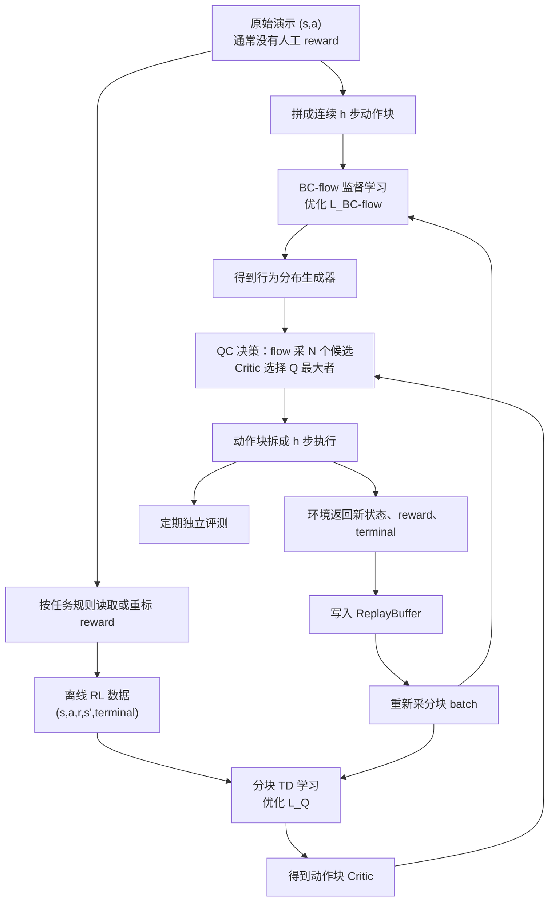

# QC：从演示数据到在线策略的整体流程与优化目标

> 前两章分别介绍了数据与网络。本章先不看逐行代码，也不引入其他改造方案，只回答 QC 本身的四个问题：训练开始时有什么？为什么需要这些东西？每一步优化什么？每一步结束后得到什么？

## 一、先给出完整答案

QC 的训练不是“把专家数据交给一个 RL 算法，然后直接得到策略”。它包含三件职责完全不同的事：

1. **行为学习**：从无 reward 的演示动作中学习“人通常会怎么做”。
2. **价值学习**：从带 reward 的 transition 中学习“哪种动作块长期回报更高”。
3. **受约束决策**：只在行为模型生成的合理候选中，让 Critic 选择价值最高的一块。

对应到项目中的组件：

| 问题 | 使用的数据 | 负责的组件 | 优化结果 |
|---|---|---|---|
| 什么动作像数据 | $(s,\mathbf a)$ | `actor_bc_flow` | 动作块生成分布 |
| 什么动作回报高 | $(s,\mathbf a,r,s')$ | `critic` | 动作块价值函数 |
| 最终执行哪个动作 | flow 候选 + Critic 分数 | best-of-$N$ | 受数据约束的高价值动作块 |

这里最容易混淆的一点是：**行为学习与价值学习是两个不同的优化目标；best-of-$N$ 是使用这两个结果进行决策的规则，不是第三个神经网络 loss。**

## 二、训练起点：演示数据通常没有 reward

原始专家演示最核心的内容是：

$$
\mathcal D_{\text{demo}}
=\{(s_t,a_t)\}_{t=0}^{T}.
$$

它告诉模型“专家看到这个状态时做了什么”，但不一定记录“这个动作值多少分”。这已经足够训练行为克隆，因为行为克隆只需要输入与监督答案：

$$
s_t\longrightarrow a_t.
$$

### 2.1 为什么还需要演示数据

动作块长度为 $h$、单步动作维度为 $d_a$ 时，一次决策位于 $h d_a$ 维空间。完全随机探索很难连续产生有意义的机械臂动作，在真实系统上还可能不安全。

演示数据给出了一个行为分布参照：

$$
\mu(\mathbf a\mid s),
$$

表示在状态 $s$ 下，数据中出现过哪些合理的 $h$ 步动作块。QC 后面不会在整个动作空间盲目找最大 Q，而是先从这个分布附近生成候选。

### 2.2 为什么训练 Critic 又必须有 reward

Critic 要判断动作好坏，必须构造 Bellman 目标：

$$
y_t=G_t^{(h)}
+\gamma^h m_t Q_{\bar\theta}(s_{t+h},\mathbf a').
$$

其中 $G_t^{(h)}$ 是 $h$ 步累计 reward。没有 reward，就无法算 $G_t^{(h)}$，也就不能进行离线 TD 学习。

因此要区分两个数据层：

| 数据层 | 字段 | 能做什么 |
|---|---|---|
| 原始演示 | $(s,a)$，通常还有轨迹边界 | 训练 BC-flow |
| 进入 QC 的离线 RL 数据 | $(s,a,r,s',\text{terminal})$ | 训练 BC-flow 和 Critic |

项目中的 OGBench 单任务数据会按任务规则重标 reward；RoboMimic 加载器则读取数据文件中的 reward。**reward 不需要由专家手工填写，但进入官方 `critic_loss` 前必须存在。**

如果始终无法为离线演示补出 reward，能做的是“先纯 BC，之后上线收集 reward 再训练 Critic”，不能直接运行本章的完整离线 QC 训练。

## 三、QC 到底在优化什么

先把最终目标写清楚，再看各个 loss 为什么存在。

### 3.1 最终决策目标：高价值，但不能离数据太远

如果只求

$$
\max_{\pi}\;
\mathbb E_{\mathbf a\sim\pi(\cdot\mid s)}
[Q_\theta(s,\mathbf a)],
$$

策略会倾向于钻 Critic 的空子：跑到离线数据没有覆盖的动作区域，利用不可靠的 Q 估计获得虚假高分。

QC 真正想解决的是一个受约束优化：

$$
\max_{\pi}\;
\mathbb E_{\mathbf a\sim\pi(\cdot\mid s)}
[Q_\theta(s,\mathbf a)]
\quad
\text{s.t.}\quad
D_{\mathrm{KL}}\!\left(
\pi(\cdot\mid s)\,\|\,\mu(\cdot\mid s)
\right)\le\varepsilon.
$$

其中：

- $\mu(\mathbf a\mid s)$ 是演示数据中的动作块分布。
- $\pi(\mathbf a\mid s)$ 是最终执行策略。
- $Q_\theta$ 负责高价值。
- KL 约束负责让策略不要离开数据分布太远。

QC 没有直接计算这条 KL。它通过“从 $\mu$ 采 $N$ 个候选，再取 Q 最大者”隐式实现约束。

### 3.2 行为目标：只学习“像数据”

`actor_bc_flow` 使用 Flow Matching 拟合 $\mu(\mathbf a\mid s)$。对演示动作块 $x_1=\mathbf a$ 和高斯噪声 $x_0$，随机采样时间 $t$：

$$
x_t=(1-t)x_0+t x_1,
\qquad
v^*=x_1-x_0.
$$

行为模型的优化目标是：

$$
\mathcal L_{\text{BC-flow}}(\xi)
=
\mathbb E
\left[
\left\|
v_\xi(s,x_t,t)-(x_1-x_0)
\right\|_2^2
\right].
$$

这就是一个纯监督式深度学习目标：

- 输入：状态 $s$、插值点 $x_t$、时间 $t$。
- 标签：可直接计算的速度 $x_1-x_0$。
- 不读取 reward。
- 不最大化 Q。

训练结束后得到的是一个动作块生成器，而不是一个懂得奖励高低的策略。

### 3.3 价值目标：学习“回报高低”

从离线 RL 数据中取真实动作块 $\mathbf a_{t:t+h-1}$，先构造 TD target：

$$
y_t
=G_t^{(h)}
+\gamma^h m_t
Q_{\bar\theta}(s_{t+h},\mathbf a').
$$

然后最小化：

$$
\mathcal L_Q(\theta)
=
\mathbb E
\left[
\left(
Q_\theta(s_t,\mathbf a_{t:t+h-1})-y_t
\right)^2
\right].
$$

这条 loss：

- 使用 reward。
- 只更新当前 `critic`。
- 用 `target_critic` 提供稳定目标。
- 不负责训练 BC-flow。

### 3.4 QC 训练时真正反向传播的总目标

QC 模式下，一次 `agent.update` 的可训练 loss 是：

$$
\mathcal L_{\text{train}}
=
\mathcal L_Q
+\mathcal L_{\text{BC-flow}}.
$$

两项在同一个 update 中计算，但梯度各自流向负责的网络：

| loss | 更新谁 | 得到什么 |
|---|---|---|
| $\mathcal L_{\text{BC-flow}}$ | `actor_bc_flow` | 数据分布生成能力 |
| $\mathcal L_Q$ | `critic` | 动作块价值判断能力 |

best-of-$N$ 没有自己的反向传播 loss。它在需要动作时调用已经学好的 flow 和 Critic。

## 四、一张图看完整训练流程

这张图要表达的核心不是“先彻底训完 BC，再彻底训完 Critic”。程序中的 BC loss 和 Critic loss 在每次更新里共同计算。图把它们画成两条路径，是为了说明二者的输入、目标和产物不同。

## 五、阶段一：离线预训练逐步走一遍

### 5.1 加载和整理数据

**已有的东西**：演示轨迹、任务 reward 定义、动作块长度 $h$。

**做的事情**：

1. 加载状态、动作和轨迹边界。
2. 读取已有 reward，或按任务规则重标 reward。
3. 从合法起点取连续 $h$ 步，不能跨越 episode 边界。
4. 拼出动作块、$h$ 步累计回报、块后状态、`mask` 和 `valid`。

**得到的东西**：

$$
(s_t,\mathbf a_{t:t+h-1},G_t^{(h)},s_{t+h},m_t,\text{valid}).
$$

其中 BC 只使用前两项，Critic 使用完整 transition 信息。

### 5.2 同一次更新中的 BC 路径

**已有的东西**：batch 中的状态和真实专家动作块。

**做的事情**：构造噪声到真实动作块的 Flow Matching 样本，计算 $\mathcal L_{\text{BC-flow}}$，更新 `actor_bc_flow`。

**得到的东西**：越来越接近数据条件分布 $\mu(\mathbf a\mid s)$ 的 flow。

### 5.3 同一次更新中的 Critic 路径

**已有的东西**：带 reward 的完整 batch、当前 flow、当前 Critic 和 target critic。

**做的事情**：

1. 在块后状态生成下一动作块。
2. target critic 估计下一块价值。
3. 用真实 $h$ 步累计 reward 构造 TD target。
4. 计算 $\mathcal L_Q$ 并更新当前 Critic。
5. 对 target critic 做软更新。

**得到的东西**：越来越能判断整个动作块长期价值的 Critic。

### 5.4 离线阶段结束后的产物

此时有两个互补组件：

- `actor_bc_flow`：知道哪些动作块像数据。
- `critic`：知道哪些动作块回报更高。

QC 的策略不是其中任何一个单独网络，而是二者的组合：

$$
\pi_{\text{QC}}(s)
=
\arg\max_{\mathbf a^{(i)}}
Q_\theta(s,\mathbf a^{(i)}),
\qquad
\mathbf a^{(i)}\sim\mu_\xi(\cdot\mid s),
\quad i=1,\ldots,N.
$$

## 六、QC 决策：best-of-$N$ 到底做了什么

给定当前状态 $s$：

1. 采 $N$ 份独立高斯噪声。
2. 每份噪声通过 BC flow 的多步 Euler 积分。
3. 得到 $N$ 个位于数据分布附近的动作块。
4. Critic 给每个动作块评分。
5. 返回分数最高的一块。

假设 $N=4$，Critic 分数分别为：

$$
[1.2,\;0.7,\;2.5,\;1.9].
$$

实际执行第 3 个候选。这里既没有修改 flow 参数，也没有修改 Critic 参数，只是在推理时使用二者已有的能力。

### 6.1 为什么这等价于“既保守又优化”

- 候选只能从 BC flow 生成，因此很难突然跳到完全没见过的动作区域。
- 在这些合理候选内部，又通过 Critic 选择最高价值动作。
- $N$ 越大，优化力度通常越强，但计算成本也越高，策略分布也会更偏离原始行为分布。

这就是 QC 对受约束优化目标的工程实现。

## 七、阶段二：在线微调怎样形成闭环

### 7.1 用离线结果初始化在线数据池

代码先把带 reward 的离线 RL 数据复制进可写 `ReplayBuffer`。这样在线初期不会只依赖少量、质量不稳定的新数据。

### 7.2 生成并执行动作块

当 `action_queue` 为空时，QC 做一次 best-of-$N$ 决策，得到 $h$ 步动作块。程序把它拆成 $h$ 个单步动作，之后每个环境时间步弹出一个动作执行。

### 7.3 收集新的 RL transition

环境每一步返回：

$$
(s_t,a_t,r_t,s_{t+1},\text{terminal}_t).
$$

这些新数据写入 replay buffer。与原始演示不同，它天然带有当前任务给出的在线 reward。

### 7.4 继续使用同样的两个优化目标

程序从 replay buffer 重新采连续 $h$ 步。此时 BC-flow 的监督数据明确来自：

$$
\mathcal D_{\text{replay}}
=
\mathcal D_{\text{offline}}
+\mathcal D_{\text{online rollout}}.
$$

其中 replay buffer 在在线阶段开始时已经装入整份离线数据，之后每一步又追加当前 QC 策略在环境里**实际执行**的 transition。代码不会给样本标注“离线”或“在线”来源，也不会固定按 50/50 混合；随机采样时两类数据被抽到的概率由它们当前在 buffer 中的数量决定。

对采出的每个合法连续窗口，BC-flow 使用：

$$
s_t,\qquad
x_1=[a_t,a_{t+1},\ldots,a_{t+h-1}],
$$

重新构造噪声 $x_0$、随机时间 $t$ 和插值点 $x_t$，继续最小化完全相同的目标：

$$
\mathcal L_{\text{BC-flow}}^{\text{online}}
=
\mathbb E_{(s,\mathbf a)\sim\mathcal D_{\text{replay}}}
\left[
\left\|v_\xi(s,x_t,t)-(\mathbf a-x_0)\right\|_2^2
\right].
$$

因此：

- BC-flow 只读取 replay batch 的状态和实际动作，不读取 reward。
- reward 和下一状态继续训练 Critic。
- `sample_sequence()` 可以从任意合法时间点开始，所以 BC 目标是 replay 中任意连续 $h$ 步的执行序列，不一定正好与某次策略输出动作块的起点对齐。

公式没有从“离线 BC loss”切换成另一套“在线 BC loss”；改变的只是监督分布从纯离线数据变成 replay buffer 的经验混合分布。

### 7.5 为什么克隆自己的 rollout 仍然可能进步

这不是简单地原样复制当前 flow。QC rollout 的动作先经过 best-of-$N$：Critic 已经从 flow 候选中挑出了较高价值动作。被选中的动作在环境里执行后进入 replay buffer，随后 BC-flow 又学习这些实际执行序列。于是形成一个策略改进反馈：

$$
\text{flow 产生候选}
\rightarrow
\text{Critic 选择较优动作}
\rightarrow
\text{环境验证并写入 replay}
\rightarrow
\text{BC-flow 拟合更新后的经验分布}.
$$

尚未被环形 buffer 覆盖的离线数据继续提供原始合理行为的锚点；随着在线数据增加，BC-flow 逐渐吸收当前策略的新行为。若 buffer 最终写满，旧数据会按环形写入规则逐步被新数据覆盖。

### 7.6 Q 选出的坏动作会不会也被 BC 学进去

**会。** 代码对在线 transition 不做 success、reward、advantage 或 Q 阈值过滤：动作只要被环境实际执行，就会被写入 replay buffer。之后只要它所在的连续序列被随机采到且对应位置 `valid=1`，就会进入 BC-flow loss。BC loss 本身不读取 reward，因此成功动作和失败动作在 BC 项中没有显式权重差别。

需要补充三个精确边界：

1. 写入 buffer 不等于立刻用于 BC；只有之后随机采到时才参与更新。
2. episode 提前结束时，action queue 中尚未执行的剩余动作会被清空，它们不会写入 buffer。
3. `valid` 会屏蔽序列越过 episode 终点后的动作位置，但终止前已经执行的坏动作仍然是有效 BC 样本。

算法依靠 Critic 的后续纠错来降低坏动作再次被选中的概率：失败 transition 的 reward 会进入 TD loss，使 Critic 下调相关动作的价值。不过，**Critic 下调价值不会撤销该动作已经给 BC-flow 提供的监督**。项目没有实现“只 BC 高回报 rollout”或 advantage-weighted BC；这是这套在线自举设计真实存在的取舍。

于是形成闭环：

$$
\text{best-of-}N\text{ 决策}
\rightarrow
\text{环境执行}
\rightarrow
\text{收集带 reward 数据}
\rightarrow
\text{更新 flow 与 Critic}
\rightarrow
\text{再次决策}.
$$

## 八、最终记住这张“已有、操作、产出”表

| 顺序 | 已有的东西 | 做了什么 | 得到了什么 |
|---|---|---|---|
| 1 | 无 reward 演示、$h$ | 拼专家动作块 | $(s,\mathbf a)$ BC 样本 |
| 2 | BC 样本、flow | 最小化 $\mathcal L_{\text{BC-flow}}$ | 行为分布生成器 |
| 3 | 任务规则 | 读取/重标 reward | 离线 RL transition |
| 4 | reward、块后状态、Critic | 最小化 $\mathcal L_Q$ | 动作块价值函数 |
| 5 | flow + Critic | best-of-$N$ | 合理候选中的最高价值动作块 |
| 6 | 动作块、环境 | 拆成单步执行 | 新的带 reward transition |
| 7 | 离线+在线数据 | 继续优化同样两个 loss | 在线适应后的 flow 与 Critic |
| 8 | 当前策略、评测环境 | 跑完整 episode | 成功率和回报 |

## 九、四个必须避免的误解

### 9.1 BC 不是 RL

BC-flow 不读 reward，只做监督式 Flow Matching。它学的是行为分布，不是价值函数。

### 9.2 没有 reward 不能训练 Critic

无 reward 演示足够训练 flow，不足以构造 TD target。必须读取、重标或在线收集 reward。

### 9.3 best-of-$N$ 不是一个 loss

QC 反向传播的是 $\mathcal L_{\text{BC-flow}}+\mathcal L_Q$。best-of-$N$ 是动作选择过程。

### 9.4 流程图的两条路径不是两个先后阶段

官方训练循环每次拿到一个完整 batch 后，同时计算 BC loss 和 Critic loss，再统一更新各自的参数。

## 十、下一章解决什么问题

本章建立的是 QC 的基础流程：行为模型生成候选，Critic 选择候选。下一章只讨论一个局部改造：怎样替换这个较慢的候选生成与选择环节，同时保持数据处理、BC-flow、Critic TD 和 offline-to-online 主循环不变。
