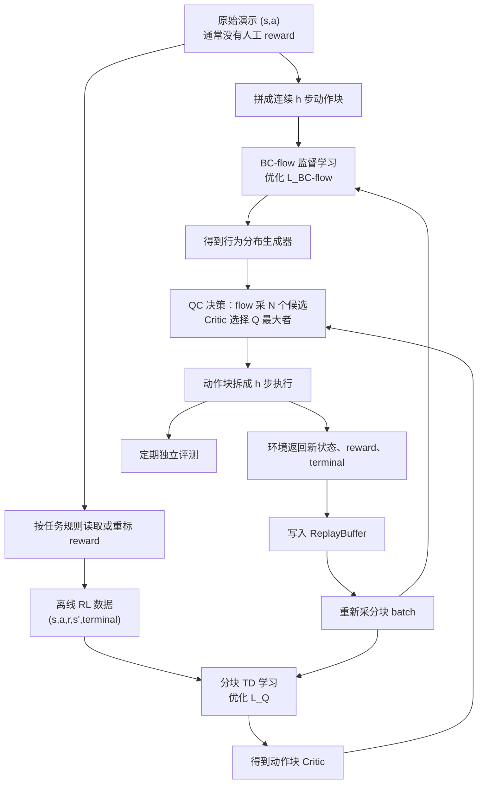

# QC：从演示数据到在线策略的整体流程与优化目标

> 前两章分别介绍了数据与网络。本章先不看逐行代码，也不引入其他改造方案，只回答 QC 本身的四个问题：训练开始时有什么？为什么需要这些东西？每一步优化什么？每一步结束后得到什么？

## 一、先给出完整答案

QC 的训练不是“把专家数据交给一个 RL 算法，然后直接得到策略”。它包含三件职责完全不同的事：

1. **行为学习**：从无 reward 的演示动作中学习“人通常会怎么做”。
2. **价值学习**：从带 reward 的 transition 中学习“哪种动作块长期回报更高”。
3. **受约束决策**：只在行为模型生成的合理候选中，让 Critic 选择价值最高的一块。

对应到项目中的组件：

| 问题 | 使用的数据 | 负责的组件 | 优化结果 |
|---|---|---|---|
| 什么动作像数据 | $(s,\mathbf a)$ | `actor_bc_flow` | 动作块生成分布 |
| 什么动作回报高 | $(s,\mathbf a,r,s')$ | `critic` | 动作块价值函数 |
| 最终执行哪个动作 | flow 候选 + Critic 分数 | best-of-$N$ | 受数据约束的高价值动作块 |

这里最容易混淆的一点是：**行为学习与价值学习是两个不同的优化目标；best-of-$N$ 是使用这两个结果进行决策的规则，不是第三个神经网络 loss。**

## 二、训练起点：演示数据通常没有 reward

原始专家演示最核心的内容是：

$$
\mathcal D_{\text{demo}}
=\{(s_t,a_t)\}_{t=0}^{T}.
$$

**这个公式在做什么**：把原始演示打包成最简单的（状态, 动作）对集合——只记录专家做了什么，不记录做得好不好。

::: details 📐 公式详解（点击展开）

| 子表达式 | 它是谁 | 它在干嘛 |
|---------|--------|---------|
| $(s_t,a_t)$ | **一次观察记录** | 专家在第 $t$ 步看到状态 $s_t$、做出动作 $a_t$，两者配对存下来 |
| $\{\cdot\}_{t=0}^{T}$ | **整条轨迹** | 把一次演示从头到尾的所有 $(s_t,a_t)$ 对按时间顺序收集起来 |
| $\mathcal D_{\text{demo}}$ | **原始演示数据集** | 所有这类轨迹的总和，是训练最先能拿到的唯一素材 |

**用人话读**："把专家从头到尾每一步'看到什么、做了什么'原样记下来，攒成一份数据集。"

**为什么是这个形式**：这是能想到的最小记录单元——不需要 reward、不需要标注好坏，只要能配对"状态→动作"就足够训练行为克隆。
:::

它告诉模型“专家看到这个状态时做了什么”，但不一定记录“这个动作值多少分”。这已经足够训练行为克隆，因为行为克隆只需要输入与监督答案：

$$
s_t\longrightarrow a_t.
$$

**这个公式在做什么**：把行为克隆看成一个最普通的监督学习映射——输入状态，输出对应的专家动作。

::: details 📐 公式详解（点击展开）

| 子表达式 | 它是谁 | 它在干嘛 |
|---------|--------|---------|
| $s_t$ | **输入特征** | 模型看到的当前状态，相当于监督学习里的 $x$ |
| $a_t$ | **监督标签** | 专家在这个状态下的真实动作，相当于监督学习里的 $y$ |
| $\longrightarrow$ | **拟合方向** | 训练一个函数，让它从 $s_t$ 尽量准确地预测出 $a_t$ |

**用人话读**："给定专家看到的状态，让模型学会输出和专家一样的动作。"

**为什么是这个形式**：这就是行为克隆的定义——不涉及 reward、不涉及未来回报，纯粹是"看图猜答案"式的监督拟合。
:::

### 2.1 为什么还需要演示数据

动作块长度为 $h$、单步动作维度为 $d_a$ 时，一次决策位于 $h d_a$ 维空间。完全随机探索很难连续产生有意义的机械臂动作，在真实系统上还可能不安全。

演示数据给出了一个行为分布参照：

$$
\mu(\mathbf a\mid s),
$$

**这个公式在做什么**：给状态 $s$ 定义一个"数据中出现过的合理动作块"的概率分布，作为后续搜索的参照范围。

::: details 📐 公式详解（点击展开）

| 子表达式 | 它是谁 | 它在干嘛 |
|---------|--------|---------|
| $\mathbf a$ | **动作块** | 连续 $h$ 步的动作序列，而不是单步动作 |
| $s$ | **条件状态** | 当前观测到的环境状态，决定"什么动作是合理的" |
| $\mu(\mathbf a\mid s)$ | **行为分布参照** | 在状态 $s$ 下，演示数据里实际出现过哪些动作块、出现的相对频率是多少 |

**用人话读**："在这个状态下，专家过去通常会做哪些动作块，把这些动作块和它们出现的比例记下来，就是 $\mu$。"

**为什么是这个形式**：QC 不打算在整个高维动作空间里盲目搜索最大 Q 值，而是先锁定 $\mu$ 附近的合理区域，再在这个区域里挑价值高的——这是避免离线 RL 外推误差的关键设计。
:::

表示在状态 $s$ 下，数据中出现过哪些合理的 $h$ 步动作块。QC 后面不会在整个动作空间盲目找最大 Q，而是先从这个分布附近生成候选。

### 2.2 为什么训练 Critic 又必须有 reward

Critic 要判断动作好坏，必须构造 Bellman 目标：

$$
y_t=G_t^{(h)}
+\gamma^h m_t Q_{\bar\theta}(s_{t+h},\mathbf a').
$$

**这个公式在做什么**：给动作块 Critic 构造一个训练目标值——"这个动作块实际拿到的 $h$ 步回报，加上之后继续走下去的估计价值"。

::: details 📐 公式详解（点击展开）

| 子表达式 | 它是谁 | 它在干嘛 |
|---------|--------|---------|
| $G_t^{(h)}$ | **实打实的收益** | 从第 $t$ 步开始、执行完整个动作块后 $h$ 步内累计拿到的真实 reward |
| $\gamma^h$ | **远期折扣** | 因为要跳过 $h$ 步才能接上下一段价值估计，所以要打 $h$ 次折扣 $\gamma$ |
| $m_t$ | **是否继续的开关** | episode 在这 $h$ 步内结束就是 0，没结束就是 1，控制要不要把未来价值加进来 |
| $Q_{\bar\theta}(s_{t+h},\mathbf a')$ | **对未来的悲观估计** | 用稳定的目标网络 $\bar\theta$（而不是正在更新的 $\theta$）估计动作块后状态 $s_{t+h}$ 继续走下去还能拿多少分 |
| $y_t$ | **TD 目标** | 上述两部分加起来，作为当前 Critic 应该逼近的"标准答案" |

**用人话读**："这个动作块真实拿到的 $h$ 步分数，加上打折后'跳过去之后还能拿多少分'的估计，两者相加就是训练目标。"

**为什么是这个形式**：这是标准 TD（时序差分）学习在"动作块"粒度上的推广——不是逐步 bootstrap，而是一次跨 $h$ 步，减少了需要 bootstrap 的次数，也降低了误差累积。
:::

其中 $G_t^{(h)}$ 是 $h$ 步累计 reward。没有 reward，就无法算 $G_t^{(h)}$，也就不能进行离线 TD 学习。

因此要区分两个数据层：

| 数据层 | 字段 | 能做什么 |
|---|---|---|
| 原始演示 | $(s,a)$，通常还有轨迹边界 | 训练 BC-flow |
| 进入 QC 的离线 RL 数据 | $(s,a,r,s',\text{terminal})$ | 训练 BC-flow 和 Critic |

项目中的 OGBench 单任务数据会按任务规则重标 reward；RoboMimic 加载器则读取数据文件中的 reward。**reward 不需要由专家手工填写，但进入官方 `critic_loss` 前必须存在。**

如果始终无法为离线演示补出 reward，能做的是“先纯 BC，之后上线收集 reward 再训练 Critic”，不能直接运行本章的完整离线 QC 训练。

## 三、QC 到底在优化什么

先把最终目标写清楚，再看各个 loss 为什么存在。

### 3.1 最终决策目标：高价值，但不能离数据太远

如果只求

$$
\max_{\pi}\;
\mathbb E_{\mathbf a\sim\pi(\cdot\mid s)}
[Q_\theta(s,\mathbf a)],
$$

**这个公式在做什么**：如果毫无限制地追求 Q 值最大化，策略会去找 Critic 打分虚高的动作，而不是真正好的动作。

::: details 📐 公式详解（点击展开）

| 子表达式 | 它是谁 | 它在干嘛 |
|---------|--------|---------|
| $\pi(\cdot\mid s)$ | **待优化的执行策略** | 最终要拿去跑环境的策略，输出动作块的分布 |
| $\mathbf a\sim\pi(\cdot\mid s)$ | **采样动作** | 从策略里抽一个动作块出来 |
| $Q_\theta(s,\mathbf a)$ | **Critic 打分** | 当前 Critic 网络对这个（状态,动作块）给出的价值估计 |
| $\mathbb E_{\mathbf a\sim\pi}[\cdot]$ | **平均收益** | 对策略采出的所有动作块的 Q 值取期望 |
| $\max_\pi$ | **无约束追高指令** | 让策略往"Q 值尽量大"的方向调整，不管这个动作是不是数据里见过的 |

**用人话读**："让策略尽量选 Critic 打分最高的动作，不设任何限制。"

**为什么这样写会出问题**：离线数据没有覆盖到的动作区域，Critic 的估计是不可靠的——它可能瞎给高分。无约束的 $\max$ 会精准地把策略推向这些"虚高"区域，这正是离线 RL 里典型的外推误差问题。
:::

策略会倾向于钻 Critic 的空子：跑到离线数据没有覆盖的动作区域，利用不可靠的 Q 估计获得虚假高分。

QC 真正想解决的是一个受约束优化：

$$
\max_{\pi}\;
\mathbb E_{\mathbf a\sim\pi(\cdot\mid s)}
[Q_\theta(s,\mathbf a)]
\quad
\text{s.t.}\quad
D_{\mathrm{KL}}\!\left(
\pi(\cdot\mid s)\,\|\,\mu(\cdot\mid s)
\right)\le\varepsilon.
$$

**这个公式在做什么**：在追求高 Q 值的同时，加一条"不能离演示数据分布太远"的安全绳，防止策略钻到 Critic 估计不靠谱的区域。

::: details 📐 公式详解（点击展开）

| 子表达式 | 它是谁 | 它在干嘛 |
|---------|--------|---------|
| $\max_\pi\,\mathbb E_{\mathbf a\sim\pi}[Q_\theta(s,\mathbf a)]$ | **追高目标** | 和上一条公式一样，希望策略选出的动作 Q 值尽量高 |
| $D_{\mathrm{KL}}(\pi(\cdot\mid s)\,\|\,\mu(\cdot\mid s))$ | **偏离度量表** | 衡量策略 $\pi$ 的动作分布和演示分布 $\mu$ 差了多远，是 [KL 散度](/前置知识/000j_前置知识_KL散度与策略约束) |
| $\varepsilon$ | **安全绳长度** | 允许偏离的上限，是一个很小的正数 |
| $\text{s.t.}\;D_{\mathrm{KL}}(\cdot)\le\varepsilon$ | **硬性约束** | 不管 Q 值多诱人，策略的动作分布都不能跑出这个偏离范围 |

**用人话读**："在不明显偏离演示数据行为习惯的前提下，尽量选 Critic 打分高的动作。"

**为什么是这个形式**：这是"信任域"思想的直接应用——既要利用 Critic 的判断力去做得比纯模仿更好，又要用 KL 约束把搜索范围锁在 Critic 估计可靠的区域内，两者缺一不可。QC 没有显式计算这条 KL，而是用"从 $\mu$ 采样再选最大 Q"的方式隐式满足它，下文马上会讲。
:::

其中：

- $\mu(\mathbf a\mid s)$ 是演示数据中的动作块分布。
- $\pi(\mathbf a\mid s)$ 是最终执行策略。
- $Q_\theta$ 负责高价值。
- KL 约束负责让策略不要离开数据分布太远。

QC 没有直接计算这条 KL。它通过“从 $\mu$ 采 $N$ 个候选，再取 Q 最大者”隐式实现约束。

### 3.2 行为目标：只学习“像数据”

`actor_bc_flow` 使用 Flow Matching 拟合 $\mu(\mathbf a\mid s)$。对演示动作块 $x_1=\mathbf a$ 和高斯噪声 $x_0$，随机采样时间 $t$：

$$
x_t=(1-t)x_0+t x_1,
\qquad
v^*=x_1-x_0.
$$

**这个公式在做什么**：在噪声 $x_0$ 和真实动作块 $x_1$ 之间画一条直线，并把这条直线的方向定义为"标准答案速度"。

::: details 📐 公式详解（点击展开）

| 子表达式 | 它是谁 | 它在干嘛 |
|---------|--------|---------|
| $x_0$ | **起点：随机噪声** | 一个采样自高斯分布的随机向量，和真实动作块无关 |
| $x_1$ | **终点：真实动作块** | 演示数据里专家实际执行的 $h$ 步动作块 |
| $t\in[0,1]$ | **进度条** | 随机采样的时间/插值系数，控制当前站在直线的哪个位置 |
| $x_t=(1-t)x_0+tx_1$ | **路上某一点** | 噪声和真实动作块的线性插值，$t=0$ 时是纯噪声，$t=1$ 时是真实动作 |
| $v^*=x_1-x_0$ | **标准答案方向** | 从起点指向终点的固定方向向量，不随 $t$ 变化 |

**用人话读**："随机在噪声到真实动作块的直线上停一个点，这条直线的方向就是网络应该学会预测的目标速度。"

**为什么是这个形式**：这是 Flow Matching 的标准构造——用直线路径连接噪声和数据，方向恒定不变，训练和推理都非常简单（推理时只需沿着预测方向做几步 Euler 积分）。
:::

行为模型的优化目标是：

$$
\mathcal L_{\text{BC-flow}}(\xi)
=
\mathbb E
\left[
\left\|
v_\xi(s,x_t,t)-(x_1-x_0)
\right\|_2^2
\right].
$$

**这个公式在做什么**：让网络学会在插值路径上任意一点都能猜对"正确前进方向"，猜得越准 loss 越低。

::: details 📐 公式详解（点击展开）

| 子表达式 | 它是谁 | 它在干嘛 |
|---------|--------|---------|
| $v_\xi(s,x_t,t)$ | **网络的猜测** | 给定状态 $s$、当前插值点 $x_t$、进度 $t$，网络猜出的方向向量 |
| $x_1-x_0$ | **标准答案方向** | 前面定义过的固定方向：从噪声指向真实动作块 |
| $\|v_\xi-(x_1-x_0)\|_2^2$ | **偏差评分** | 猜测方向和标准答案方向之间的欧氏距离平方，越小说明猜得越准 |
| $\mathbb E[\cdot]$ | **公平考试** | 对 batch 里随机抽取的 $(s,x_0,x_1,t)$ 组合取平均，实际训练中用 mini-batch 蒙特卡洛近似 |
| $\mathcal L_{\text{BC-flow}}(\xi)$ | **BC-flow 训练目标** | 网络参数 $\xi$ 就是靠最小化这个式子来更新的 |

**用人话读**："随机在噪声到真实动作块的路径上抽一个点，让网络猜这一点该往哪走，猜的方向和真实方向的差距平方就是 loss。"

**为什么是这个形式**：这是标准 Flow Matching 回归损失——不需要迭代式采样、不需要计算似然，直接用均方误差训练一个向量场，训练稳定且推理时只需几步 Euler 积分。
:::

这就是一个纯监督式深度学习目标：

- 输入：状态 $s$、插值点 $x_t$、时间 $t$。
- 标签：可直接计算的速度 $x_1-x_0$。
- 不读取 reward。
- 不最大化 Q。

训练结束后得到的是一个动作块生成器，而不是一个懂得奖励高低的策略。

### 3.3 价值目标：学习“回报高低”

从离线 RL 数据中取真实动作块 $\mathbf a_{t:t+h-1}$，先构造 TD target：

$$
y_t
=G_t^{(h)}
+\gamma^h m_t
Q_{\bar\theta}(s_{t+h},\mathbf a').
$$

**这个公式在做什么**：这是本章第二节已经出现过的同一条 TD 目标构造，这里用来给价值目标 $\mathcal L_Q$ 提供"标准答案"。

::: details 📐 公式详解（点击展开）

| 子表达式 | 它是谁 | 它在干嘛 |
|---------|--------|---------|
| $G_t^{(h)}$ | **实打实的收益** | 动作块执行后 $h$ 步内累计拿到的真实 reward |
| $\gamma^h m_t Q_{\bar\theta}(s_{t+h},\mathbf a')$ | **打折的未来估计** | 跳过 $h$ 步后，用目标网络估计继续走下去的价值，episode 结束则被 $m_t=0$ 清零 |
| $y_t$ | **Critic 的训练标签** | 上述两部分之和，是 $\mathcal L_Q$ 里 Critic 要去逼近的目标值 |

**用人话读**："动作块实际拿到的分数，加上打折后对后续价值的估计，两者相加就是 Critic 应该学会输出的答案。"

**为什么是这个形式**：和 2.2 节的构造完全一致——这里重复出现是因为它是 $\mathcal L_Q$ 的直接输入，强调价值学习的目标值来自同一套 Bellman 递推。
:::

然后最小化：

$$
\mathcal L_Q(\theta)
=
\mathbb E
\left[
\left(
Q_\theta(s_t,\mathbf a_{t:t+h-1})-y_t
\right)^2
\right].
$$

**这个公式在做什么**：让 Critic 的打分尽量贴近上面算出的 TD 目标 $y_t$，用均方误差衡量差距。

::: details 📐 公式详解（点击展开）

| 子表达式 | 它是谁 | 它在干嘛 |
|---------|--------|---------|
| $Q_\theta(s_t,\mathbf a_{t:t+h-1})$ | **当前 Critic 的估计** | 正在训练的 Critic 网络对这个真实动作块给出的价值打分 |
| $y_t$ | **TD 目标** | 上一条公式算出的"标准答案" |
| $\left(Q_\theta-y_t\right)^2$ | **打分误差** | 当前估计和目标值的差距平方，越小说明 Critic 越准 |
| $\mathbb E[\cdot]$ | **公平考试** | 对 batch 中所有采样到的 transition 取平均误差，用 mini-batch 近似 |
| $\mathcal L_Q(\theta)$ | **Critic 训练目标** | Critic 参数 $\theta$ 通过最小化这个式子来更新 |

**用人话读**："拿真实动作块喂给 Critic，看它打的分和 TD 目标差多少，差距的平方就是要最小化的 loss。"

**为什么是这个形式**：这是标准 TD 学习的均方误差形式，只是把单步 transition 换成了动作块粒度——用回归的方式让 Critic 逐步逼近真实的长期回报估计。
:::

这条 loss：

- 使用 reward。
- 只更新当前 `critic`。
- 用 `target_critic` 提供稳定目标。
- 不负责训练 BC-flow。

### 3.4 QC 训练时真正反向传播的总目标

QC 模式下，一次 `agent.update` 的可训练 loss 是：

$$
\mathcal L_{\text{train}}
=
\mathcal L_Q
+\mathcal L_{\text{BC-flow}}.
$$

**这个公式在做什么**：把两个职责完全不同的 loss 直接相加，作为一次 `update` 里真正参与反向传播的总目标——但两项梯度各走各的网络，互不干扰。

::: details 📐 公式详解（点击展开）

| 子表达式 | 它是谁 | 它在干嘛 |
|---------|--------|---------|
| $\mathcal L_Q$ | **价值学习分队** | 只把梯度传给 `critic`，教它判断动作块回报高低 |
| $\mathcal L_{\text{BC-flow}}$ | **行为学习分队** | 只把梯度传给 `actor_bc_flow`，教它生成像数据的动作块 |
| $\mathcal L_{\text{train}}$ | **一次 update 的总账** | 两项简单相加，方便在同一次反向传播里一起算出来，但本质上是两个独立任务的并列 |

**用人话读**："同一次训练迭代里，价值 loss 和行为 loss 一起算出来，但各自只更新自己负责的网络，互不抢梯度。"

**为什么是这个形式**：这不是常见的"多目标加权平衡"（如 $L=A+\lambda B$ 那种需要调权重的对抗式组合），而是两个完全独立、无耦合的子任务借用同一次前向-反向传播凑在一起算，写成加号只是工程上的实现方式。
:::

两项在同一个 update 中计算，但梯度各自流向负责的网络：

| loss | 更新谁 | 得到什么 |
|---|---|---|
| $\mathcal L_{\text{BC-flow}}$ | `actor_bc_flow` | 数据分布生成能力 |
| $\mathcal L_Q$ | `critic` | 动作块价值判断能力 |

best-of-$N$ 没有自己的反向传播 loss。它在需要动作时调用已经学好的 flow 和 Critic。

## 四、一张图看完整训练流程

```mermaid
flowchart TB
    Demo["原始演示 (s,a)<br/>通常没有人工 reward"] --> Chunk["拼成连续 h 步动作块"]
    Chunk --> BC["BC-flow 监督学习<br/>优化 L_BC-flow"]
    BC --> Flow["得到行为分布生成器"]

    Demo --> Reward["按任务规则读取或重标 reward"]
    Reward --> RLDataset["离线 RL 数据<br/>(s,a,r,s',terminal)"]
    RLDataset --> TD["分块 TD 学习<br/>优化 L_Q"]
    TD --> Critic["得到动作块 Critic"]

    Flow --> Select
    Critic --> Select
    Select["QC 决策：flow 采 N 个候选<br/>Critic 选择 Q 最大者"] --> Execute["动作块拆成 h 步执行"]
    Execute --> Transition["环境返回新状态、reward、terminal"]
    Transition --> Buffer["写入 ReplayBuffer"]
    Buffer --> OnlineBatch["重新采分块 batch"]
    OnlineBatch --> BC
    OnlineBatch --> TD
    Execute --> Eval["定期独立评测"]
```

这张图要表达的核心不是“先彻底训完 BC，再彻底训完 Critic”。程序中的 BC loss 和 Critic loss 在每次更新里共同计算。图把它们画成两条路径，是为了说明二者的输入、目标和产物不同。

## 五、阶段一：离线预训练逐步走一遍

### 5.1 加载和整理数据

**已有的东西**：演示轨迹、任务 reward 定义、动作块长度 $h$。

**做的事情**：

1. 加载状态、动作和轨迹边界。
2. 读取已有 reward，或按任务规则重标 reward。
3. 从合法起点取连续 $h$ 步，不能跨越 episode 边界。
4. 拼出动作块、$h$ 步累计回报、块后状态、`mask` 和 `valid`。

**得到的东西**：

$$
(s_t,\mathbf a_{t:t+h-1},G_t^{(h)},s_{t+h},m_t,\text{valid}).
$$

**这个公式在做什么**：把一条原始轨迹整理成动作块粒度的训练样本，一次打包好 BC 和 Critic 各自需要的全部字段。

::: details 📐 公式详解（点击展开）

| 子表达式 | 它是谁 | 它在干嘛 |
|---------|--------|---------|
| $s_t$ | **块起点状态** | 动作块开始执行前观测到的状态 |
| $\mathbf a_{t:t+h-1}$ | **动作块本身** | 连续 $h$ 步的动作序列，是 BC 的监督标签 |
| $G_t^{(h)}$ | **$h$ 步累计回报** | 执行完这个动作块后累积拿到的真实 reward，供 Critic 使用 |
| $s_{t+h}$ | **块后状态** | 动作块执行完毕后到达的状态，用于估计后续价值 |
| $m_t$ | **继续标志** | episode 是否在这 $h$ 步内结束的开关 |
| $\text{valid}$ | **合法性标志** | 标记这个窗口是否越过了 episode 边界，无效样本要被屏蔽 |

**用人话读**："把一条轨迹切成一个个动作块，每个块记下起点状态、动作序列、累计回报、终点状态和两个合法性开关。"

**为什么是这个形式**：BC-flow 只需要 $(s_t,\mathbf a_{t:t+h-1})$ 就能训练，Critic 需要完整的六元组才能构造 TD target——这条记录一次性满足两者的数据需求，避免重复采样。
:::

其中 BC 只使用前两项，Critic 使用完整 transition 信息。

### 5.2 同一次更新中的 BC 路径

**已有的东西**：batch 中的状态和真实专家动作块。

**做的事情**：构造噪声到真实动作块的 Flow Matching 样本，计算 $\mathcal L_{\text{BC-flow}}$，更新 `actor_bc_flow`。

**得到的东西**：越来越接近数据条件分布 $\mu(\mathbf a\mid s)$ 的 flow。

### 5.3 同一次更新中的 Critic 路径

**已有的东西**：带 reward 的完整 batch、当前 flow、当前 Critic 和 target critic。

**做的事情**：

1. 在块后状态生成下一动作块。
2. target critic 估计下一块价值。
3. 用真实 $h$ 步累计 reward 构造 TD target。
4. 计算 $\mathcal L_Q$ 并更新当前 Critic。
5. 对 target critic 做软更新。

**得到的东西**：越来越能判断整个动作块长期价值的 Critic。

### 5.4 离线阶段结束后的产物

此时有两个互补组件：

- `actor_bc_flow`：知道哪些动作块像数据。
- `critic`：知道哪些动作块回报更高。

QC 的策略不是其中任何一个单独网络，而是二者的组合：

$$
\pi_{\text{QC}}(s)
=
\arg\max_{\mathbf a^{(i)}}
Q_\theta(s,\mathbf a^{(i)}),
\qquad
\mathbf a^{(i)}\sim\mu_\xi(\cdot\mid s),
\quad i=1,\ldots,N.
$$

**这个公式在做什么**：定义 QC 最终执行的策略——先用 flow 生成一批候选动作块，再让 Critic 从里面挑分数最高的一个。

::: details 📐 公式详解（点击展开）

| 子表达式 | 它是谁 | 它在干嘛 |
|---------|--------|---------|
| $\mathbf a^{(i)}\sim\mu_\xi(\cdot\mid s)$ | **候选生成器** | 从训练好的 BC-flow（参数 $\xi$）里独立采样 $N$ 个动作块候选 |
| $i=1,\ldots,N$ | **候选编号** | 一共生成 $N$ 份候选，$N$ 是一个可调的超参数 |
| $Q_\theta(s,\mathbf a^{(i)})$ | **打分器** | Critic 给每个候选打分 |
| $\arg\max_{\mathbf a^{(i)}}$ | **裁判选择** | 在这 $N$ 个候选里挑出 Critic 打分最高的那一个 |
| $\pi_{\text{QC}}(s)$ | **最终执行策略** | 上述"生成+打分+选择"整个流程的输出，不是一个单独的神经网络 |

**用人话读**："先让 flow 生成 $N$ 个合理的候选动作块，再让 Critic 给每个候选打分，最后执行分数最高的那个。"

**为什么是这个形式**：这是对 3.1 节受约束优化目标的工程近似——候选只能来自 $\mu_\xi$（天然满足"不离数据太远"的约束），再在候选内部做 Q 最大化（满足"追求高价值"的目标），两个目标不需要联合求解，用采样+挑选就能同时满足。
:::

## 六、QC 决策：best-of-$N$ 到底做了什么

给定当前状态 $s$：

1. 采 $N$ 份独立高斯噪声。
2. 每份噪声通过 BC flow 的多步 Euler 积分。
3. 得到 $N$ 个位于数据分布附近的动作块。
4. Critic 给每个动作块评分。
5. 返回分数最高的一块。

假设 $N=4$，Critic 分数分别为：

$$
[1.2,\;0.7,\;2.5,\;1.9].
$$

**这个公式在做什么**：给出一个具体的数值例子，展示 best-of-$N$ 决策在 $N=4$ 时实际发生了什么。

::: details 📐 公式详解（点击展开）

| 子表达式 | 它是谁 | 它在干嘛 |
|---------|--------|---------|
| $1.2,\,0.7,\,2.5,\,1.9$ | **四个候选的打分** | Critic 分别对 flow 生成的 4 个候选动作块给出的 Q 值 |
| 第 3 个数 $2.5$ | **最高分候选** | 4 个分数里最大的一个，对应 $\arg\max$ 选中的候选 |

**用人话读**："4 个候选里，第 3 个候选的 Critic 打分最高（2.5 分），所以最终执行它。"

**为什么是这个形式**：用具体数字让抽象的 $\arg\max$ 操作变得可验证——只要看一眼这四个数就能确认选择规则是"直接取最大值"，没有额外的加权或采样随机性。
:::

实际执行第 3 个候选。这里既没有修改 flow 参数，也没有修改 Critic 参数，只是在推理时使用二者已有的能力。

### 6.1 为什么这等价于“既保守又优化”

- 候选只能从 BC flow 生成，因此很难突然跳到完全没见过的动作区域。
- 在这些合理候选内部，又通过 Critic 选择最高价值动作。
- $N$ 越大，优化力度通常越强，但计算成本也越高，策略分布也会更偏离原始行为分布。

这就是 QC 对受约束优化目标的工程实现。

## 七、阶段二：在线微调怎样形成闭环

### 7.1 用离线结果初始化在线数据池

代码先把带 reward 的离线 RL 数据复制进可写 `ReplayBuffer`。这样在线初期不会只依赖少量、质量不稳定的新数据。

### 7.2 生成并执行动作块

当 `action_queue` 为空时，QC 做一次 best-of-$N$ 决策，得到 $h$ 步动作块。程序把它拆成 $h$ 个单步动作，之后每个环境时间步弹出一个动作执行。

### 7.3 收集新的 RL transition

环境每一步返回：

$$
(s_t,a_t,r_t,s_{t+1},\text{terminal}_t).
$$

**这个公式在做什么**：这是环境交互产生的最原始的单步 transition 格式——在线阶段新数据的基本单元。

::: details 📐 公式详解（点击展开）

| 子表达式 | 它是谁 | 它在干嘛 |
|---------|--------|---------|
| $s_t$ | **当前状态** | 执行动作前观测到的环境状态 |
| $a_t$ | **实际执行的单步动作** | 从动作块拆出来、在这一步真正送给环境的动作 |
| $r_t$ | **即时奖励** | 环境返回的这一步的 reward，天然由当前任务给出，不需要人工重标 |
| $s_{t+1}$ | **下一状态** | 执行动作后环境跳转到的新状态 |
| $\text{terminal}_t$ | **终止标志** | 这一步是否让 episode 结束 |

**用人话读**："每执行一步动作，环境就返回这一步的状态、动作、奖励、下一状态和是否结束，五项打包成一条记录。"

**为什么是这个形式**：这是强化学习里最标准的单步 transition 定义，和演示数据 $(s_t,a_t)$ 的关键区别是多了 $r_t$、$s_{t+1}$、$\text{terminal}_t$ 三项——因为这是在线阶段可以直接从环境拿到 reward 的数据，不需要像离线演示那样重标。
:::

这些新数据写入 replay buffer。与原始演示不同，它天然带有当前任务给出的在线 reward。

### 7.4 继续使用同样的两个优化目标

程序从 replay buffer 重新采连续 $h$ 步。此时 BC-flow 的监督数据明确来自：

$$
\mathcal D_{\text{replay}}
=
\mathcal D_{\text{offline}}
+\mathcal D_{\text{online rollout}}.
$$

**这个公式在做什么**：说明在线阶段 replay buffer 里的数据来源——离线数据和在线 rollout 数据混在同一个池子里，不做区分。

::: details 📐 公式详解（点击展开）

| 子表达式 | 它是谁 | 它在干嘛 |
|---------|--------|---------|
| $\mathcal D_{\text{offline}}$ | **离线遗产** | 进入在线阶段之前已经装入 buffer 的全部离线 RL 数据 |
| $\mathcal D_{\text{online rollout}}$ | **在线新增** | 当前 QC 策略在环境里实际执行后产生、追加进 buffer 的新 transition |
| $+$ | **合并而非区分** | 两部分数据物理上共享同一个 buffer，没有来源标签，也不固定混合比例 |
| $\mathcal D_{\text{replay}}$ | **实际采样池** | BC-flow 和 Critic 训练时随机采样的对象，就是这个合并后的整体 |

**用人话读**："在线训练用的数据池，就是一开始装进去的离线数据，加上后面策略跑出来的在线数据，两者混在一起随机抽。"

**为什么是这个形式**：用同一个 buffer、不打标签、不固定比例，是最简单的离线到在线过渡实现——采样概率自然由两类数据当前的相对数量决定，不需要额外设计混合调度。
:::

其中 replay buffer 在在线阶段开始时已经装入整份离线数据，之后每一步又追加当前 QC 策略在环境里**实际执行**的 transition。代码不会给样本标注“离线”或“在线”来源，也不会固定按 50/50 混合；随机采样时两类数据被抽到的概率由它们当前在 buffer 中的数量决定。

对采出的每个合法连续窗口，BC-flow 使用：

$$
s_t,\qquad
x_1=[a_t,a_{t+1},\ldots,a_{t+h-1}],
$$

**这个公式在做什么**：说明在线阶段的 BC-flow 训练样本从哪里来——直接从 replay buffer 里任意合法窗口切出状态和实际执行的动作序列。

::: details 📐 公式详解（点击展开）

| 子表达式 | 它是谁 | 它在干嘛 |
|---------|--------|---------|
| $s_t$ | **窗口起点状态** | 从 replay buffer 里随机采到的某个时间点的状态 |
| $[a_t,a_{t+1},\ldots,a_{t+h-1}]$ | **实际执行序列** | 从 $s_t$ 开始连续 $h$ 步、策略当时真正执行过的动作，拼成新的监督标签 $x_1$ |

**用人话读**："从 replay buffer 里随便挑一个合法的起点，把它后面连续 $h$ 步实际执行的动作拼起来，当作新的 BC 训练目标。"

**为什么是这个形式**：和离线阶段用演示动作块作 $x_1$ 的做法完全一致，只是数据来源换成了 replay buffer——这样 BC-flow 就能持续吸收策略自己跑出来的新经验，而不需要改动 loss 的数学形式。
:::

重新构造噪声 $x_0$、随机时间 $t$ 和插值点 $x_t$，继续最小化完全相同的目标：

$$
\mathcal L_{\text{BC-flow}}^{\text{online}}
=
\mathbb E_{(s,\mathbf a)\sim\mathcal D_{\text{replay}}}
\left[
\left\|v_\xi(s,x_t,t)-(\mathbf a-x_0)\right\|_2^2
\right].
$$

**这个公式在做什么**：和离线阶段的 $\mathcal L_{\text{BC-flow}}$ 是完全同一条数学公式，唯一区别是采样来源换成了 replay buffer 的混合分布。

::: details 📐 公式详解（点击展开）

| 子表达式 | 它是谁 | 它在干嘛 |
|---------|--------|---------|
| $(s,\mathbf a)\sim\mathcal D_{\text{replay}}$ | **采样来源** | 从离线+在线混合的 replay buffer 里随机抽状态和动作块 |
| $v_\xi(s,x_t,t)$ | **网络的猜测** | 和离线阶段一样，网络猜测插值点上的前进方向 |
| $\mathbf a-x_0$ | **标准答案方向** | 从噪声指向这次采到的真实动作 $\mathbf a$ 的方向 |
| $\|v_\xi-(\mathbf a-x_0)\|_2^2$ | **偏差评分** | 猜测方向和标准答案的差距平方 |
| $\mathcal L_{\text{BC-flow}}^{\text{online}}$ | **在线阶段 BC 目标** | 数学形式和离线阶段完全一致，只是右上角标"online"提醒读者数据来源变了 |

**用人话读**："和离线阶段一模一样地训练 flow，只是现在训练样本从离线+在线混合的 replay buffer 里抽，而不是只从原始演示里抽。"

**为什么是这个形式**：不需要为在线阶段设计新的 loss——只要把采样分布从纯离线数据换成 replay buffer 的混合分布，flow 就能持续学习当前策略产生的新行为，同时不丢弃早期的离线锚点。
:::

因此：

- BC-flow 只读取 replay batch 的状态和实际动作，不读取 reward。
- reward 和下一状态继续训练 Critic。
- `sample_sequence()` 可以从任意合法时间点开始，所以 BC 目标是 replay 中任意连续 $h$ 步的执行序列，不一定正好与某次策略输出动作块的起点对齐。

公式没有从“离线 BC loss”切换成另一套“在线 BC loss”；改变的只是监督分布从纯离线数据变成 replay buffer 的经验混合分布。

### 7.5 为什么克隆自己的 rollout 仍然可能进步

这不是简单地原样复制当前 flow。QC rollout 的动作先经过 best-of-$N$：Critic 已经从 flow 候选中挑出了较高价值动作。被选中的动作在环境里执行后进入 replay buffer，随后 BC-flow 又学习这些实际执行序列。于是形成一个策略改进反馈：

$$
\text{flow 产生候选}
\rightarrow
\text{Critic 选择较优动作}
\rightarrow
\text{环境验证并写入 replay}
\rightarrow
\text{BC-flow 拟合更新后的经验分布}.
$$

**这个公式在做什么**：这不是一条数学等式，而是用箭头串成一条因果链，说明"克隆自己的 rollout"为什么不是原地打转而是能带来策略改进。

::: details 📐 公式详解（点击展开）

| 子表达式 | 它是谁 | 它在干嘛 |
|---------|--------|---------|
| $\text{flow 产生候选}$ | **起点** | BC-flow 按当前学到的分布生成一批候选动作块 |
| $\text{Critic 选择较优动作}$ | **筛选环节** | best-of-$N$ 从候选里挑出 Critic 打分较高的那个，不是随机选 |
| $\text{环境验证并写入 replay}$ | **真实反馈** | 被选中的动作在环境里实际执行，结果（成功与否、reward）写入 buffer |
| $\text{BC-flow 拟合更新后的经验分布}$ | **反哺环节** | flow 下一次训练时会学到这批"被 Critic 筛选过"的新数据 |

**用人话读**："flow 先生成候选，Critic 挑出更好的那个去执行，执行结果存起来，flow 再从这些'被挑选过的经验'里学习——这样每一轮 flow 学到的都比原始分布更偏向高价值动作。"

**为什么是这个形式**：如果 flow 直接克隆自己上一轮的原始输出，确实是原地打转；但因为中间插了 Critic 的筛选环节，flow 实际学习的是"经过价值筛选后的动作分布"，这个分布会逐步向高回报区域偏移，从而形成正向的策略改进循环。
:::

尚未被环形 buffer 覆盖的离线数据继续提供原始合理行为的锚点；随着在线数据增加，BC-flow 逐渐吸收当前策略的新行为。若 buffer 最终写满，旧数据会按环形写入规则逐步被新数据覆盖。

### 7.6 Q 选出的坏动作会不会也被 BC 学进去

**会。** 代码对在线 transition 不做 success、reward、advantage 或 Q 阈值过滤：动作只要被环境实际执行，就会被写入 replay buffer。之后只要它所在的连续序列被随机采到且对应位置 `valid=1`，就会进入 BC-flow loss。BC loss 本身不读取 reward，因此成功动作和失败动作在 BC 项中没有显式权重差别。

需要补充三个精确边界：

1. 写入 buffer 不等于立刻用于 BC；只有之后随机采到时才参与更新。
2. episode 提前结束时，action queue 中尚未执行的剩余动作会被清空，它们不会写入 buffer。
3. `valid` 会屏蔽序列越过 episode 终点后的动作位置，但终止前已经执行的坏动作仍然是有效 BC 样本。

算法依靠 Critic 的后续纠错来降低坏动作再次被选中的概率：失败 transition 的 reward 会进入 TD loss，使 Critic 下调相关动作的价值。不过，**Critic 下调价值不会撤销该动作已经给 BC-flow 提供的监督**。项目没有实现“只 BC 高回报 rollout”或 advantage-weighted BC；这是这套在线自举设计真实存在的取舍。

于是形成闭环：

$$
\text{best-of-}N\text{ 决策}
\rightarrow
\text{环境执行}
\rightarrow
\text{收集带 reward 数据}
\rightarrow
\text{更新 flow 与 Critic}
\rightarrow
\text{再次决策}.
$$

**这个公式在做什么**：把整章讲的 offline-to-online 训练总结成一个闭环——决策、执行、收集、更新、再决策，循环推进。

::: details 📐 公式详解（点击展开）

| 子表达式 | 它是谁 | 它在干嘛 |
|---------|--------|---------|
| $\text{best-of-}N\text{ 决策}$ | **闭环入口** | flow 生成候选、Critic 挑选，得到本轮要执行的动作块 |
| $\text{环境执行}$ | **真实世界检验** | 动作块拆成单步送进环境 |
| $\text{收集带 reward 数据}$ | **反馈采集** | 环境返回的 transition 写入 replay buffer |
| $\text{更新 flow 与 Critic}$ | **两个学习目标** | 用采样到的 batch 分别优化 $\mathcal L_{\text{BC-flow}}$ 和 $\mathcal L_Q$ |
| $\text{再次决策}$ | **闭环出口=下一轮入口** | 用刚更新过的 flow 和 Critic 做下一次 best-of-$N$ 决策 |

**用人话读**："决策、执行、收集数据、更新两个网络，然后带着更新后的网络回到起点再决策一次——如此循环，就是整个在线微调阶段的运作方式。"

**为什么是这个形式**：这正是标准的 offline-to-online RL 闭环结构——区别于纯离线训练（没有"环境执行"和"再次决策"这两环），也区别于纯在线 RL（起点不是随机策略而是离线预训练好的 flow 和 Critic）。
:::

## 八、最终记住这张“已有、操作、产出”表

| 顺序 | 已有的东西 | 做了什么 | 得到了什么 |
|---|---|---|---|
| 1 | 无 reward 演示、$h$ | 拼专家动作块 | $(s,\mathbf a)$ BC 样本 |
| 2 | BC 样本、flow | 最小化 $\mathcal L_{\text{BC-flow}}$ | 行为分布生成器 |
| 3 | 任务规则 | 读取/重标 reward | 离线 RL transition |
| 4 | reward、块后状态、Critic | 最小化 $\mathcal L_Q$ | 动作块价值函数 |
| 5 | flow + Critic | best-of-$N$ | 合理候选中的最高价值动作块 |
| 6 | 动作块、环境 | 拆成单步执行 | 新的带 reward transition |
| 7 | 离线+在线数据 | 继续优化同样两个 loss | 在线适应后的 flow 与 Critic |
| 8 | 当前策略、评测环境 | 跑完整 episode | 成功率和回报 |

## 九、四个必须避免的误解

### 9.1 BC 不是 RL

BC-flow 不读 reward，只做监督式 Flow Matching。它学的是行为分布，不是价值函数。

### 9.2 没有 reward 不能训练 Critic

无 reward 演示足够训练 flow，不足以构造 TD target。必须读取、重标或在线收集 reward。

### 9.3 best-of-$N$ 不是一个 loss

QC 反向传播的是 $\mathcal L_{\text{BC-flow}}+\mathcal L_Q$。best-of-$N$ 是动作选择过程。

### 9.4 流程图的两条路径不是两个先后阶段

官方训练循环每次拿到一个完整 batch 后，同时计算 BC loss 和 Critic loss，再统一更新各自的参数。

## 十、下一章解决什么问题

本章建立的是 QC 的基础流程：行为模型生成候选，Critic 选择候选。下一章只讨论一个局部改造：怎样替换这个较慢的候选生成与选择环节，同时保持数据处理、BC-flow、Critic TD 和 offline-to-online 主循环不变。
