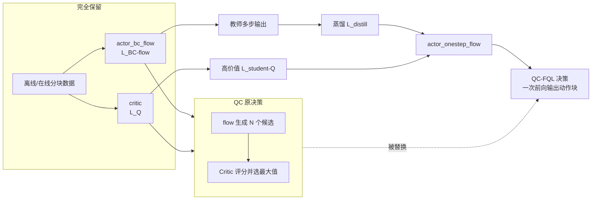

# 从 QC 到 QC-FQL：FQL 替换了什么

> [上一章](./03_QC_从演示数据到在线策略的整体流程与优化目标) 已经建立 QC 的完整基础流程：BC-flow 学行为分布，Critic 学动作块价值，best-of-$N$ 从合理候选中选择最高价值动作。本章只讲一件事：引入 FQL 后，原流程的哪一部分被替换，为什么要替换，替换后多训练了什么。

## 一、先给结论：只替换最终策略的实现

QC-FQL 没有推翻 QC 的完整训练管线。下面这些部分全部保留：

- 原始演示与 reward 的处理方式不变。
- 连续 $h$ 步动作仍然拼成一个动作块。
- `actor_bc_flow` 仍然用纯 BC-flow loss 拟合数据分布。
- `critic` 仍然用相同的 $h$ 步 TD loss 学习价值。
- 离线预训练、ReplayBuffer、在线收集、UTD 和评测流程不变。

真正被替换的只有“**怎样得到最终执行的动作块**”：

| | QC 原方案 | 引入 FQL 后 |
|---|---|---|
| 最终策略 | flow 生成 $N$ 个候选，Critic 选最大 Q | 单步学生网络直接输出动作块 |
| 推理需要 flow 积分 | 需要，而且要处理 $N$ 个候选 | 不需要 |
| 推理需要 Critic 选候选 | 需要 | 不需要 |
| 额外训练网络 | 不需要 | 需要 `actor_onestep_flow` |

一句话概括：**FQL 用训练时的教师-学生蒸馏，替换 QC 推理时的 best-of-$N$ 搜索。**

## 二、为什么要替换 best-of-$N$

QC 每次决策需要：

1. 采 $N$ 份噪声。
2. 对 $N$ 个候选做多步 flow 积分。
3. 用 Critic 给 $N$ 个候选评分。
4. 取最高分动作块。

这种方法逻辑直接，但推理计算随候选数 $N$ 增长。FQL 的目标是把这套“运行时搜索”提前压缩进一个学生网络，使决策变成：

$$
\mathbf a=\mu_\psi(s,z),
\qquad z\sim\mathcal N(0,I).
$$

即给定状态和噪声，只做一次前向。

## 三、FQL 带来了哪些已有组件

FQL 原本是一种 Flow Q-Learning 方法，包含三个角色：

| 角色 | 网络 | 职责 |
|---|---|---|
| 行为教师 | 多步 flow | 表达数据中的多模态动作分布 |
| 单步学生 | 一步映射网络 | 模仿教师，同时追求高 Q |
| 价值指导 | Critic | 告诉学生动作应该往哪个方向优化 |

应用到 Q-Chunking 时，FQL 的机制不变，只把单步动作 $a$ 全部换成动作块 $\mathbf a_{t:t+h-1}$：

$$
a\quad\longrightarrow\quad
\mathbf a=[a_t,\ldots,a_{t+h-1}].
$$

项目中的对应关系是：

- 教师：`actor_bc_flow`。
- 学生：`actor_onestep_flow`。
- 价值指导：`critic`。

## 四、替换前：QC 的策略是怎样形成的

QC 没有独立的高价值 Actor。它组合两个已经训练好的组件：

$$
\mathbf a^{(1)},\ldots,\mathbf a^{(N)}
\sim\mu_\xi(\cdot\mid s),
$$

$$
\pi_{\text{QC}}(s)
=
\arg\max_i Q_\theta(s,\mathbf a^{(i)}).
$$

其中 BC flow 保证候选像数据，Critic 负责从候选中追求高回报。行为约束由候选的来源隐式实现。

## 五、替换后：用蒸馏训练单步学生

这里采用的是标准的**教师—学生蒸馏**：先让教师模型推理出一个结果，再让学生模型对同一输入输出结果，最后用 MSE 让学生模仿教师。区别只在于：这里蒸馏的结果不是分类概率，而是一个完整的 action chunk。

若不熟悉蒸馏，可先看 [知识蒸馏基础](/前置知识/000v_前置知识_知识蒸馏基础)。

### 5.1 目标是什么

BC flow 教师生成动作的质量较好，但需要多次调用网络完成积分，推理较慢。学生的目标是：

1. 用**一次前向**近似教师多步推理的结果；
2. 在接近教师输出的同时，让动作获得更高的 Critic 评分；
3. 最终在与环境交互时只使用学生，不再运行教师的多步积分。

这里的“单步学生”是指只进行一次网络前向，不是只输出一个环境动作。学生输出的仍是包含未来多步动作的完整 chunk。

### 5.2 蒸馏具体怎么做

对同一个状态 $s$，采样同一份噪声 $z$。

**第一步：教师生成监督目标。**

教师 `actor_bc_flow` 从噪声 $z$ 出发，连续进行 $K$ 次 Euler 更新：

$$
\mathbf a^{(0)}=z,
\qquad
\mathbf a^{(k+1)}
=
\mathbf a^{(k)}+\frac{1}{K}
v_\xi(s,\mathbf a^{(k)},t_k).
$$

$v_\xi$ 是 BC flow 网络预测的移动方向。经过 $K$ 次更新后，噪声被逐步变成一个具体的动作块：

$$
\mathbf a_{\text{teacher}}
=
F_\xi(s,z).
$$

因此，$F_\xi(s,z)$ 表示的是“教师完成整段多步推理后得到的结果”。它是一个具体的 action chunk，形状为 $h\times d_a$；不是 loss，也不是另一个网络。

**第二步：学生预测同一个目标。**

学生 `actor_onestep_flow` 接收相同的状态和噪声，只进行一次前向：

$$
\mathbf a_{\text{student}}
=
\mu_\psi(s,z).
$$

学生输出与教师输出形状完全相同，也是一个完整的 action chunk。

**第三步：计算教师与学生输出的 MSE。**

$$
\mathcal L_{\text{distill}}
=
\mathbb E_{s,z}
\left[
\left\|
\mathbf a_{\text{student}}
-
\mathbf a_{\text{teacher}}
\right\|_2^2
\right].
$$

这个公式做的事情很直接：逐个比较两个 chunk 中对应的动作值，再对平方误差取平均。误差越大，学生参数更新得越明显；误差越小，说明学生越接近教师。

这项损失只更新学生参数 $\psi$。教师输出在这里是固定的监督目标；教师本身仍由 BC-flow loss 训练。

### 5.3 Critic 怎样让学生偏向更高价值动作

只做蒸馏，学生最多复制教师，并不会主动选择价值更高的动作。因此还要把学生输出交给 Critic 评分：

$$
q
=
Q_\theta
\left(
s,
\operatorname{clip}(\mathbf a_{\text{student}},-1,1)
\right).
$$

这里：

- 输入是状态 $s$ 和学生刚生成的 action chunk；
- 输出 $q$ 是 Critic 对这个 chunk 的长期回报估计；
- `clip` 只是把动作限制在环境允许的范围内。

希望 $q$ 越大越好，但优化器默认最小化损失，所以写成：

$$
\mathcal L_{\text{student-Q}}
=
-
Q_\theta
\left(
s,
\operatorname{clip}(\mu_\psi(s,z),-1,1)
\right).
$$

如果 Critic 评分从 $1.7$ 提高到 $2.0$，这个损失就从 $-1.7$ 降到 $-2.0$。因此，最小化负 Q 就是在提高 Q。

训练时，Critic 根据“动作怎样变化会使 Q 增大”给出梯度。梯度沿下面的路径回到学生：

$$
- Q
\longrightarrow
\mathbf a_{\text{student}}
\longrightarrow
\psi.
$$

所以真正被修改的是学生参数：学生以后会更倾向于输出 Critic 评分较高的 chunk。Critic 在这项损失中只负责提供梯度方向，不由这项损失更新；它仍由自己的 TD loss 更新。

### 5.4 学生最终优化什么

学生同时最小化：

$$
\mathcal L_{\text{student}}
=
\alpha\mathcal L_{\text{distill}}
+
\mathcal L_{\text{student-Q}}.
$$

两项的作用分别是：

- $\mathcal L_{\text{distill}}$：让学生靠近教师生成的动作，避免随意跑出数据分布；
- $\mathcal L_{\text{student-Q}}$：让学生在教师动作附近，进一步偏向 Critic 认为价值更高的方向；
- $\alpha$：控制“模仿教师”和“提高 Q”之间的权衡。

最终得到的不是教师挑选出的新标签，而是一个经过训练的单步策略：它既近似 BC flow 教师，又受到 Critic 的价值引导。

### 5.5 推理阶段

训练时需要教师和 Critic 指导学生；真正与环境交互时，只使用学生：

$$
(s,z)
\xrightarrow{\mu_\psi\text{ 一次前向}}
[a_t,a_{t+1},\ldots,a_{t+h-1}].
$$

也就是：输入当前状态和噪声，一次生成一个完整 action chunk，然后交给环境执行。

## 六、QC-FQL 的优化目标怎样组成

原 QC 已有两个训练目标：

$$
\mathcal L_Q
+\mathcal L_{\text{BC-flow}}.
$$

引入 FQL 后，保留这两项，再增加学生的两项：

$$
\boxed{
\mathcal L_{\text{total}}
=
\mathcal L_Q
+\mathcal L_{\text{BC-flow}}
+\alpha\mathcal L_{\text{distill}}
+\mathcal L_{\text{student-Q}}
}
$$

四项职责不能混淆：

| loss | 更新谁 | 解决什么 |
|---|---|---|
| $\mathcal L_Q$ | `critic` | 学动作块价值 |
| $\mathcal L_{\text{BC-flow}}$ | `actor_bc_flow` | 学数据分布 |
| $\mathcal L_{\text{distill}}$ | `actor_onestep_flow` | 让学生贴近教师 |
| $\mathcal L_{\text{student-Q}}$ | `actor_onestep_flow` | 让学生追求高价值 |

$\alpha$ 控制“贴近数据”和“追求高 Q”的平衡：

- $\alpha$ 大：学生更接近教师，更保守。
- $\alpha$ 小：Q loss 相对更强，学生更激进。

## 七、约束形式为什么从隐式 KL 变成显式距离

QC 通过“只从行为分布采候选”隐式限制策略，其思想对应 KL 约束：

$$
D_{\mathrm{KL}}(\pi\|\mu)\le\varepsilon.
$$

学生网络不再直接从教师分布中挑样本，因此需要显式约束学生不要远离教师。项目用同噪声下的蒸馏 MSE：

$$
\|\mu_\psi(s,z)-F_\xi(s,z)\|_2^2.
$$

它可以理解为学生分布与教师分布之间 2-Wasserstein 距离的一种可计算上界。直觉上，它度量的是“把教师输出搬到学生输出要移动多远”。

所以改变的是约束的实现：

- QC：候选来源自动限制动作，属于运行时隐式约束。
- QC-FQL：蒸馏 loss 显式限制学生，属于训练时约束。

## 八、一张图看替换关系



## 九、训练与执行流程分别发生了什么变化

### 9.1 训练阶段

每个 batch 原本训练 BC flow 和 Critic；现在再让学生：

1. 看教师在同一噪声下的终点。
2. 用蒸馏 loss 模仿教师。
3. 用 Q loss 向高价值方向移动。

因此训练更复杂，多了一张学生网络和两项 loss。

### 9.2 离线评测与在线执行

原来调用 best-of-$N$；现在只调用：

```python
noises = jax.random.normal(rng, shape)
actions = actor_onestep_flow(observations, noises)
```

不再运行多步教师，不再生成 $N$ 个候选，也不再用 Critic 做候选排序。

### 9.3 在线数据与继续更新

环境仍逐步执行动作块、返回 reward、写入同一个 ReplayBuffer。采样 batch 后，四项 loss 继续更新。外层 online-to-offline 闭环没有改变。

## 十、最终用“原有、替换、结果”记住

| 原有部分 | FQL 做了什么 | 最终结果 |
|---|---|---|
| BC flow 多步生成动作 | 保留，并把它作为教师 | 数据分布参照不变 |
| Critic 学分块 Q | 保留，并用来指导学生 | 价值学习不变 |
| best-of-$N$ 搜索 | 用学生的蒸馏 + Q 优化替换 | 推理只需一次前向 |
| 隐式行为约束 | 改成显式蒸馏距离 | 学生不会轻易跑离数据 |
| 离线到在线主循环 | 不修改 | 数据闭环不变 |

下一章进入逐行代码，对照 `actor_type="best-of-n"` 和 `actor_type="distill-ddpg"` 两个分支，验证本章描述的替换关系具体落在哪几行实现上。
