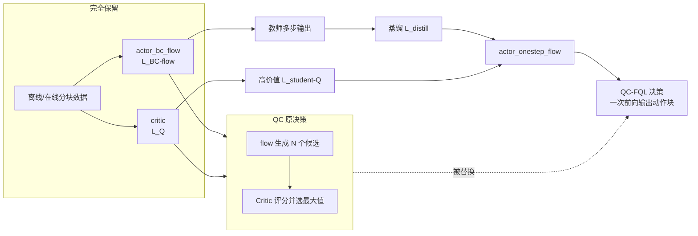

# 从 QC 到 QC-FQL：FQL 替换了什么

> [上一章](./03_QC_从演示数据到在线策略的整体流程与优化目标) 已经建立 QC 的完整基础流程：BC-flow 学行为分布，Critic 学动作块价值，best-of-$N$ 从合理候选中选择最高价值动作。本章只讲一件事：引入 FQL 后，原流程的哪一部分被替换，为什么要替换，替换后多训练了什么。

## 一、先给结论：只替换最终策略的实现

QC-FQL 没有推翻 QC 的完整训练管线。下面这些部分全部保留：

- 原始演示与 reward 的处理方式不变。
- 连续 $h$ 步动作仍然拼成一个动作块。
- `actor_bc_flow` 仍然用纯 BC-flow loss 拟合数据分布。
- `critic` 仍然用相同的 $h$ 步 TD loss 学习价值。
- 离线预训练、ReplayBuffer、在线收集、UTD 和评测流程不变。

真正被替换的只有“**怎样得到最终执行的动作块**”：

| | QC 原方案 | 引入 FQL 后 |
|---|---|---|
| 最终策略 | flow 生成 $N$ 个候选，Critic 选最大 Q | 单步学生网络直接输出动作块 |
| 推理需要 flow 积分 | 需要，而且要处理 $N$ 个候选 | 不需要 |
| 推理需要 Critic 选候选 | 需要 | 不需要 |
| 额外训练网络 | 不需要 | 需要 `actor_onestep_flow` |

一句话概括：**FQL 用训练时的教师-学生蒸馏，替换 QC 推理时的 best-of-$N$ 搜索。**

## 二、为什么要替换 best-of-$N$

QC 每次决策需要：

1. 采 $N$ 份噪声。
2. 对 $N$ 个候选做多步 flow 积分。
3. 用 Critic 给 $N$ 个候选评分。
4. 取最高分动作块。

这种方法逻辑直接，但推理计算随候选数 $N$ 增长。FQL 的目标是把这套“运行时搜索”提前压缩进一个学生网络，使决策变成：

$$
\mathbf a=\mu_\psi(s,z),
\qquad z\sim\mathcal N(0,I).
$$

**这个公式在做什么**：把"采样-积分-打分-挑选"的多步搜索压缩成一次网络前向——给定状态和一份噪声，学生网络直接吐出最终动作块。

::: details 📐 公式详解（点击展开）

| 子表达式 | 它是谁 | 它在干嘛 |
|---------|--------|---------|
| $z\sim\mathcal N(0,I)$ | **随机种子** | 从标准正态分布里随机抽一份噪声，决定这次生成的具体走向 |
| $\mu_\psi(s,z)$ | **单步学生网络** | 参数为 $\psi$ 的网络，输入状态和噪声，一次前向直接输出动作块 |
| $\mathbf a$ | **最终执行的动作块** | 学生网络的输出，就是接下来要交给环境执行的完整 chunk |

**用人话读**："给学生网络一个状态和一份随机噪声，它一次前向直接给出要执行的动作块，不再需要多步积分和候选打分。"

**为什么是这个形式**：QC 原方案要采 $N$ 个候选、跑多步 flow 积分、再让 Critic 逐一打分选最优，计算量随 $N$ 线性增长。FQL 把这套运行时搜索提前"蒸馏"进一个网络里，训练时付出代价，推理时只需一次前向。
:::

即给定状态和噪声，只做一次前向。

## 三、FQL 带来了哪些已有组件

FQL 原本是一种 Flow Q-Learning 方法，包含三个角色：

| 角色 | 网络 | 职责 |
|---|---|---|
| 行为教师 | 多步 flow | 表达数据中的多模态动作分布 |
| 单步学生 | 一步映射网络 | 模仿教师，同时追求高 Q |
| 价值指导 | Critic | 告诉学生动作应该往哪个方向优化 |

应用到 Q-Chunking 时，FQL 的机制不变，只把单步动作 $a$ 全部换成动作块 $\mathbf a_{t:t+h-1}$：

$$
a\quad\longrightarrow\quad
\mathbf a=[a_t,\ldots,a_{t+h-1}].
$$

**这个公式在做什么**：说明 FQL 原本处理的是单步动作 $a$，套进 Q-Chunking 后把它整体换成一个 $h$ 步动作块，机制本身不变。

::: details 📐 公式详解（点击展开）

| 子表达式 | 它是谁 | 它在干嘛 |
|---------|--------|---------|
| $a$ | **FQL 原本的操作对象** | 标准 FQL 里教师、学生、Critic 都围绕单个时间步的动作 |
| $[a_t,\ldots,a_{t+h-1}]$ | **QC 场景下的替代对象** | 把连续 $h$ 步的动作拼成一个整体，作为教师/学生/Critic 共同操作的单元 |
| $\longrightarrow$ | **替换关系** | 表示"只是把操作对象从单步换成了动作块"，三个角色的职责和训练方式都不变 |

**用人话读**："FQL 原来对一个动作做的事，现在对一整段 $h$ 步动作块做同样的事。"

**为什么是这个形式**：这样替换后可以直接复用 FQL 现成的教师-学生蒸馏机制，不需要重新设计算法，只是把输入输出的维度从单步动作换成动作块。
:::

项目中的对应关系是：

- 教师：`actor_bc_flow`。
- 学生：`actor_onestep_flow`。
- 价值指导：`critic`。

## 四、替换前：QC 的策略是怎样形成的

QC 没有独立的高价值 Actor。它组合两个已经训练好的组件：

$$
\mathbf a^{(1)},\ldots,\mathbf a^{(N)}
\sim\mu_\xi(\cdot\mid s),
$$

**这个公式在做什么**：从行为分布 $\mu_\xi$ 里独立采样 $N$ 个候选动作块，作为下一步 Critic 打分的候选池。

::: details 📐 公式详解（点击展开）

| 子表达式 | 它是谁 | 它在干嘛 |
|---------|--------|---------|
| $\mu_\xi(\cdot\mid s)$ | **行为分布** | BC flow 教师学到的、给定状态 $s$ 下动作块的分布，保证生成的动作"像数据" |
| $\mathbf a^{(1)},\ldots,\mathbf a^{(N)}$ | **候选池** | 从这个分布里独立采样出的 $N$ 个动作块，等待 Critic 逐一打分 |
| $\sim$ | **采样关系** | 表示每个候选都是从同一个分布里随机抽出的独立样本 |

**用人话读**："让教师网络按数据分布随机生成 $N$ 个候选动作块，凑成一个候选池。"

**为什么是这个形式**：因为 QC 没有单独训练一个"高价值 Actor"，只能借助已经训练好的行为分布采样出多个候选，再靠后面的打分步骤挑出好的——这就是"隐式行为约束"的来源：候选天生就来自数据分布，不会跑出分布之外。
:::

$$
\pi_{\text{QC}}(s)
=
\arg\max_i Q_\theta(s,\mathbf a^{(i)}).
$$

**这个公式在做什么**：让 Critic 给候选池里的每个动作块打分，选出分数最高的那一个作为最终执行的动作。

::: details 📐 公式详解（点击展开）

| 子表达式 | 它是谁 | 它在干嘛 |
|---------|--------|---------|
| $Q_\theta(s,\mathbf a^{(i)})$ | **价值裁判** | Critic 网络对第 $i$ 个候选动作块给出的长期回报估计 |
| $\arg\max_i$ | **挑选赢家** | 在 $N$ 个候选里找出 Critic 打分最高的那个下标 $i$ |
| $\pi_{\text{QC}}(s)$ | **最终决策** | best-of-$N$ 挑出来的那个动作块，就是 QC 实际执行的动作 |

**用人话读**："把 $N$ 个候选动作块都送给 Critic 打分，选分数最高的那个执行。"

**为什么是这个形式**：这是"生成候选 + 打分挑选"这套 best-of-$N$ 搜索的直接写法，好处是简单直接，代价是推理时要跑 $N$ 次候选生成和打分，计算量随 $N$ 线性增长——这正是 FQL 要替换掉的部分。
:::

其中 BC flow 保证候选像数据，Critic 负责从候选中追求高回报。行为约束由候选的来源隐式实现。

## 五、替换后：用蒸馏训练单步学生

这里采用的是标准的**教师—学生蒸馏**：先让教师模型推理出一个结果，再让学生模型对同一输入输出结果，最后用 MSE 让学生模仿教师。区别只在于：这里蒸馏的结果不是分类概率，而是一个完整的 action chunk。

若不熟悉蒸馏，可先看 [知识蒸馏基础](/前置知识/000v_前置知识_知识蒸馏基础)。

### 5.1 目标是什么

BC flow 教师生成动作的质量较好，但需要多次调用网络完成积分，推理较慢。学生的目标是：

1. 用**一次前向**近似教师多步推理的结果；
2. 在接近教师输出的同时，让动作获得更高的 Critic 评分；
3. 最终在与环境交互时只使用学生，不再运行教师的多步积分。

这里的“单步学生”是指只进行一次网络前向，不是只输出一个环境动作。学生输出的仍是包含未来多步动作的完整 chunk。

### 5.2 蒸馏具体怎么做

对同一个状态 $s$，采样同一份噪声 $z$。

**第一步：教师生成监督目标。**

教师 `actor_bc_flow` 从噪声 $z$ 出发，连续进行 $K$ 次 Euler 更新：

$$
\mathbf a^{(0)}=z,
\qquad
\mathbf a^{(k+1)}
=
\mathbf a^{(k)}+\frac{1}{K}
v_\xi(s,\mathbf a^{(k)},t_k).
$$

**这个公式在做什么**：从一份噪声出发，用教师网络预测的方向连续走 $K$ 小步，逐步把噪声"走成"一个具体的动作块。

::: details 📐 公式详解（点击展开）

| 子表达式 | 它是谁 | 它在干嘛 |
|---------|--------|---------|
| $\mathbf a^{(0)}=z$ | **出发点** | 积分从纯噪声开始，第 0 步就是采样到的噪声本身 |
| $v_\xi(s,\mathbf a^{(k)},t_k)$ | **方向指南针** | BC flow 网络在当前位置 $\mathbf a^{(k)}$、当前时刻 $t_k$ 给出的移动方向 |
| $\frac{1}{K}$ | **步长** | 把整段路径均匀切成 $K$ 步，每步只走这么一小段 |
| $\mathbf a^{(k+1)}=\mathbf a^{(k)}+\frac{1}{K}v_\xi(\cdot)$ | **单步 Euler 更新** | 沿着当前方向走一小步，更新到下一个位置 |

**用人话读**："从噪声出发，每一步都问网络'现在该往哪走'，顺着这个方向走一小步，连走 $K$ 步就走到了目标动作块。"

**为什么是这个形式**：这是标准的 Euler 方法数值积分——用有限步的直线近似连续的流动路径，详见 [常微分方程直觉与数值求解](/前置知识/001b_前置知识_常微分方程ODE直觉与数值求解)。$K$ 越大积分越精确，但网络调用次数也越多，这正是教师推理慢、需要被蒸馏成单步学生的原因。
:::

$v_\xi$ 是 BC flow 网络预测的移动方向。经过 $K$ 次更新后，噪声被逐步变成一个具体的动作块：

$$
\mathbf a_{\text{teacher}}
=
F_\xi(s,z).
$$

**这个公式在做什么**：把"教师跑完整段 $K$ 步积分"这件事打包成一个记号 $F_\xi(s,z)$，方便后面直接引用这个最终结果。

::: details 📐 公式详解（点击展开）

| 子表达式 | 它是谁 | 它在干嘛 |
|---------|--------|---------|
| $F_\xi(s,z)$ | **教师的完整推理结果** | 上一个公式里 $K$ 次迭代结束后的 $\mathbf a^{(K)}$，是一个具体的数值，不是网络也不是 loss |
| $\mathbf a_{\text{teacher}}$ | **监督目标** | 给这个具体结果起的名字，接下来会作为学生模仿的目标 |

**用人话读**："把教师跑完整套多步积分之后拿到的那个具体动作块，记作 $F_\xi(s,z)$，作为学生要模仿的答案。"

**为什么是这个形式**：给"教师推理的最终产物"一个独立记号，方便下面蒸馏损失里直接引用它，而不用每次都展开整个 $K$ 步迭代过程。
:::

**第二步：学生预测同一个目标。**

学生 `actor_onestep_flow` 接收相同的状态和噪声，只进行一次前向：

$$
\mathbf a_{\text{student}}
=
\mu_\psi(s,z).
$$

**这个公式在做什么**：学生网络接收和教师完全相同的状态与噪声，但只做一次前向，直接给出自己对同一个目标的猜测。

::: details 📐 公式详解（点击展开）

| 子表达式 | 它是谁 | 它在干嘛 |
|---------|--------|---------|
| $s,z$ | **相同的输入** | 和教师那一步用的是完全同一个状态、同一份噪声 |
| $\mu_\psi(s,z)$ | **学生的一次猜测** | 学生网络一次前向直接输出的动作块，试图逼近教师的多步结果 |
| $\mathbf a_{\text{student}}$ | **学生的输出** | 这个猜测结果的记号，接下来会拿去和 $\mathbf a_{\text{teacher}}$ 比较 |

**用人话读**："给学生和教师同样的状态、同样的噪声，学生一次前向就给出答案，不用像教师那样走 $K$ 步。"

**为什么是这个形式**：输入对齐（相同 $s,z$）是蒸馏能生效的前提——只有输入完全一致，才能公平比较"学生一步猜的"和"教师多步走的"差多少。
:::

学生输出与教师输出形状完全相同，也是一个完整的 action chunk。

**第三步：计算教师与学生输出的 MSE。**

$$
\mathcal L_{\text{distill}}
=
\mathbb E_{s,z}
\left[
\left\|
\mathbf a_{\text{student}}
-
\mathbf a_{\text{teacher}}
\right\|_2^2
\right].
$$

**这个公式在做什么**：算出学生输出和教师输出之间的均方误差，让学生朝着"贴近教师"的方向更新。

::: details 📐 公式详解（点击展开）

| 子表达式 | 它是谁 | 它在干嘛 |
|---------|--------|---------|
| $\mathbf a_{\text{student}}-\mathbf a_{\text{teacher}}$ | **偏差向量** | 学生猜的动作块和教师真实走出的动作块之间逐元素的差 |
| $\|\cdot\|_2^2$ | **偏差评分** | 把差值向量的每个分量平方后求和，差得越多分数越高 |
| $\mathbb E_{s,z}[\cdot]$ | **批量平均** | 训练中实际是对一个 mini-batch 里采样到的多组 $(s,z)$ 取平均 |

**用人话读**："让学生的输出和教师的输出逐元素比对，差得越多 loss 越大，训练目标就是让学生越来越像教师。"

**为什么是这个形式**：这是标准的知识蒸馏 MSE 损失（详见 [知识蒸馏基础](/前置知识/000v_前置知识_知识蒸馏基础)），用一次前向的输出直接回归多步积分的结果，把"多步推理的能力"压缩进单步网络的参数里。
:::

这个公式做的事情很直接：逐个比较两个 chunk 中对应的动作值，再对平方误差取平均。误差越大，学生参数更新得越明显；误差越小，说明学生越接近教师。

这项损失只更新学生参数 $\psi$。教师输出在这里是固定的监督目标；教师本身仍由 BC-flow loss 训练。

### 5.3 Critic 怎样让学生偏向更高价值动作

只做蒸馏，学生最多复制教师，并不会主动选择价值更高的动作。因此还要把学生输出交给 Critic 评分：

$$
q
=
Q_\theta
\left(
s,
\operatorname{clip}(\mathbf a_{\text{student}},-1,1)
\right).
$$

**这个公式在做什么**：把学生刚生成的动作块限制在合法范围内，再交给 Critic 打分，得到一个衡量"这个动作块未来回报有多高"的数值。

::: details 📐 公式详解（点击展开）

| 子表达式 | 它是谁 | 它在干嘛 |
|---------|--------|---------|
| $\mathbf a_{\text{student}}$ | **学生的输出** | 学生网络刚生成的、还没做任何限制的动作块 |
| $\operatorname{clip}(\cdot,-1,1)$ | **安全限位器** | 把动作块的每个分量强行卡进 $[-1,1]$，避免超出环境允许的动作范围 |
| $Q_\theta(s,\cdot)$ | **价值裁判** | Critic 网络，给状态和动作块的组合打一个长期回报分 |
| $q$ | **打分结果** | Critic 认为这个学生输出的动作块未来能拿多少回报 |

**用人话读**："把学生生成的动作限制在合法范围内，交给 Critic 打分，这个分数就是 $q$。"

**为什么是这个形式**：clip 是工程上的必要步骤——网络输出理论上可以是任意实数，但环境执行的动作必须落在物理允许的范围内；Critic 打分则是为下一步"让学生追求高分"提供依据。
:::

这里：

- 输入是状态 $s$ 和学生刚生成的 action chunk；
- 输出 $q$ 是 Critic 对这个 chunk 的长期回报估计；
- `clip` 只是把动作限制在环境允许的范围内。

希望 $q$ 越大越好，但优化器默认最小化损失，所以写成：

$$
\mathcal L_{\text{student-Q}}
=
-
Q_\theta
\left(
s,
\operatorname{clip}(\mu_\psi(s,z),-1,1)
\right).
$$

**这个公式在做什么**：把"让 Critic 打分越高越好"这个目标，翻译成一个可以最小化的损失——给 Q 值加个负号。

::: details 📐 公式详解（点击展开）

| 子表达式 | 它是谁 | 它在干嘛 |
|---------|--------|---------|
| $\mu_\psi(s,z)$ | **学生的生成过程** | 学生网络接收状态和噪声，一次前向输出动作块（内嵌在公式里，强调这是端到端可导的） |
| $Q_\theta(s,\operatorname{clip}(\cdot))$ | **价值裁判** | 对 clip 之后的学生输出打分，同上一个公式 |
| $-Q_\theta(\cdot)$ | **反转符号** | 优化器只会做梯度下降（最小化），取负号后"最小化损失"等价于"最大化 Q" |
| $\mathcal L_{\text{student-Q}}$ | **追求高价值的损失项** | 学生这一项损失的最终值，越小说明 Critic 打分越高 |

**用人话读**："把 Critic 给学生输出的打分取个负号当作损失，最小化这个损失就是让学生的动作拿到越来越高的 Critic 评分。"

**为什么是这个形式**：深度学习框架的优化器约定统一做梯度下降，任何"想最大化"的目标都要先取负号变成"想最小化"，这是最直接的做法。
:::

如果 Critic 评分从 $1.7$ 提高到 $2.0$，这个损失就从 $-1.7$ 降到 $-2.0$。因此，最小化负 Q 就是在提高 Q。

训练时，Critic 根据“动作怎样变化会使 Q 增大”给出梯度。梯度沿下面的路径回到学生：

$$
- Q
\longrightarrow
\mathbf a_{\text{student}}
\longrightarrow
\psi.
$$

**这个公式在做什么**：展示梯度从 Critic 打分一路回传到学生网络参数的路径，说明这条链路上谁被更新、谁只是"过路"。

::: details 📐 公式详解（点击展开）

| 子表达式 | 它是谁 | 它在干嘛 |
|---------|--------|---------|
| $-Q$ | **梯度起点** | 反向传播从这个损失值开始往回传 |
| $\mathbf a_{\text{student}}$ | **中间站** | 梯度先传到学生输出的动作块这一层，但动作块本身不是参数，不会被直接更新 |
| $\psi$ | **梯度终点** | 梯度继续沿着 $\mu_\psi$ 内部的计算图传到学生网络的参数 $\psi$，这里才是真正被更新的地方 |

**用人话读**："Critic 打的分数往回传，先经过学生生成的动作块，最终传到学生网络的参数上，只有学生的参数会被这条 loss 更新。"

**为什么是这个形式**：这条链路清楚说明了 Critic 在这项损失里只是"提供方向"的角色（本身参数不被这项损失更新，仍靠自己的 TD loss 训练），真正被修改的是学生参数 $\psi$——这是 actor-critic 类方法里 policy loss 回传的标准路径。
:::

所以真正被修改的是学生参数：学生以后会更倾向于输出 Critic 评分较高的 chunk。Critic 在这项损失中只负责提供梯度方向，不由这项损失更新；它仍由自己的 TD loss 更新。

### 5.4 学生最终优化什么

学生同时最小化：

$$
\mathcal L_{\text{student}}
=
\alpha\mathcal L_{\text{distill}}
+
\mathcal L_{\text{student-Q}}.
$$

**这个公式在做什么**：把"模仿教师"和"追求高价值"两个目标加权合并成学生网络唯一要最小化的总损失。

::: details 📐 公式详解（点击展开）

| 子表达式 | 它是谁 | 它在干嘛 |
|---------|--------|---------|
| $\mathcal L_{\text{distill}}$ | **模仿力** | 拉着学生往教师的输出靠近，防止学生跑出数据分布 |
| $\mathcal L_{\text{student-Q}}$ | **进取力** | 推着学生往 Critic 认为价值更高的方向走 |
| $\alpha$ | **平衡旋钮** | 控制"模仿教师"这一项的权重，$\alpha$ 越大学生越保守 |

**用人话读**："学生的总损失是模仿教师的误差（加权）加上追求高价值的负 Q，两个目标同时优化。"

**为什么是这个形式**：这是标准的多目标加权和写法——用一个系数 $\alpha$ 显式权衡两个可能冲突的目标（贴近数据 vs. 追求高回报），类似离线 RL 里行为约束和价值最大化之间的权衡。
:::

两项的作用分别是：

- $\mathcal L_{\text{distill}}$：让学生靠近教师生成的动作，避免随意跑出数据分布；
- $\mathcal L_{\text{student-Q}}$：让学生在教师动作附近，进一步偏向 Critic 认为价值更高的方向；
- $\alpha$：控制“模仿教师”和“提高 Q”之间的权衡。

最终得到的不是教师挑选出的新标签，而是一个经过训练的单步策略：它既近似 BC flow 教师，又受到 Critic 的价值引导。

### 5.5 推理阶段

训练时需要教师和 Critic 指导学生；真正与环境交互时，只使用学生：

$$
(s,z)
\xrightarrow{\mu_\psi\text{ 一次前向}}
[a_t,a_{t+1},\ldots,a_{t+h-1}].
$$

**这个公式在做什么**：展示推理阶段的完整流程——只需要状态和一份噪声，经过学生网络一次前向，直接得到要执行的整段动作块。

::: details 📐 公式详解（点击展开）

| 子表达式 | 它是谁 | 它在干嘛 |
|---------|--------|---------|
| $(s,z)$ | **唯一输入** | 当前观测到的状态和随机采样的一份噪声，推理时不再需要教师或 Critic |
| $\mu_\psi\text{ 一次前向}$ | **唯一计算步骤** | 学生网络跑一次前向传播，不涉及多步积分或候选打分 |
| $[a_t,\ldots,a_{t+h-1}]$ | **输出结果** | 一整段 $h$ 步的动作块，直接交给环境执行 |

**用人话读**："推理时只需要把状态和噪声喂给学生网络，一次前向就拿到要执行的整段动作。"

**为什么是这个形式**：这正是 FQL 蒸馏的最终收益——训练阶段的教师、Critic 都不再参与推理，运行时开销从"多步积分 + $N$ 次打分"降到"一次前向"。
:::

也就是：输入当前状态和噪声，一次生成一个完整 action chunk，然后交给环境执行。

## 六、QC-FQL 的优化目标怎样组成

原 QC 已有两个训练目标：

$$
\mathcal L_Q
+\mathcal L_{\text{BC-flow}}.
$$

**这个公式在做什么**：回顾 QC 原方案已有的两个训练目标——一个学价值、一个学行为分布，为下面加入学生的两项损失做铺垫。

::: details 📐 公式详解（点击展开）

| 子表达式 | 它是谁 | 它在干嘛 |
|---------|--------|---------|
| $\mathcal L_Q$ | **价值学习损失** | 训练 Critic 网络，让它学会预测动作块的长期回报 |
| $\mathcal L_{\text{BC-flow}}$ | **行为分布损失** | 训练教师网络 `actor_bc_flow`，让它学会拟合数据中的动作分布 |

**用人话读**："QC 原本就有两项损失，一项教 Critic 打分，一项教教师网络模仿数据。"

**为什么是这个形式**：这两项在引入 FQL 之后完全保留不变，是承接下文"新增两项"的基线。
:::

引入 FQL 后，保留这两项，再增加学生的两项：

$$
\boxed{
\mathcal L_{\text{total}}
=
\mathcal L_Q
+\mathcal L_{\text{BC-flow}}
+\alpha\mathcal L_{\text{distill}}
+\mathcal L_{\text{student-Q}}
}
$$

**这个公式在做什么**：把四个各自负责不同网络、不同任务的损失加在一起，作为整个 QC-FQL 系统一次反向传播要联合优化的总目标。

::: details 📐 公式详解（点击展开）

| 子表达式 | 它是谁 | 它在干嘛 |
|---------|--------|---------|
| $\mathcal L_Q$ | **Critic 的功课** | 让 Critic 学会准确预测动作块的价值 |
| $\mathcal L_{\text{BC-flow}}$ | **教师的功课** | 让教师网络拟合数据分布，作为学生蒸馏的监督来源 |
| $\alpha\mathcal L_{\text{distill}}$ | **学生的模仿功课** | 让学生的一次前向输出逼近教师多步积分的结果 |
| $\mathcal L_{\text{student-Q}}$ | **学生的进取功课** | 让学生在模仿教师的基础上进一步偏向高价值动作 |

**用人话读**："把四个网络各自的训练目标加在一起，形成整个系统的总损失，四项分别更新四个（组）不同的参数，互不干扰。"

**为什么是这个形式**：虽然写成一个总损失方便统一反向传播，但每一项的梯度只流向对应的那部分参数（Critic、教师、学生），本质上仍是四个独立的训练信号打包在一起，方便实现上一次 `backward()` 完成所有更新。
:::

四项职责不能混淆：

| loss | 更新谁 | 解决什么 |
|---|---|---|
| $\mathcal L_Q$ | `critic` | 学动作块价值 |
| $\mathcal L_{\text{BC-flow}}$ | `actor_bc_flow` | 学数据分布 |
| $\mathcal L_{\text{distill}}$ | `actor_onestep_flow` | 让学生贴近教师 |
| $\mathcal L_{\text{student-Q}}$ | `actor_onestep_flow` | 让学生追求高价值 |

$\alpha$ 控制“贴近数据”和“追求高 Q”的平衡：

- $\alpha$ 大：学生更接近教师，更保守。
- $\alpha$ 小：Q loss 相对更强，学生更激进。

## 七、约束形式为什么从隐式 KL 变成显式距离

QC 通过“只从行为分布采候选”隐式限制策略，其思想对应 KL 约束：

$$
D_{\mathrm{KL}}(\pi\|\mu)\le\varepsilon.
$$

**这个公式在做什么**：用一个上限 $\varepsilon$ 限制策略 $\pi$ 相对行为分布 $\mu$ 能偏离多远，这是离线 RL 里常见的行为约束写法。

::: details 📐 公式详解（点击展开）

| 子表达式 | 它是谁 | 它在干嘛 |
|---------|--------|---------|
| $D_{\mathrm{KL}}(\pi\|\mu)$ | **偏离量尺** | KL 散度，衡量策略分布 $\pi$ 和行为分布 $\mu$ 之间差多少 |
| $\varepsilon$ | **容忍上限** | 允许偏离的最大程度，超过这个值就认为策略跑出数据分布太远 |
| $\le$ | **硬约束** | 要求偏离量必须控制在这个上限之内，而不是软性惩罚 |

**用人话读**："限制新策略和行为数据分布之间的差异不能超过一个给定的上限。"

**为什么是这个形式**：这是离线 RL 里防止策略在训练数据覆盖不到的区域"乱猜"的标准写法（详见 [离线强化学习基础](/前置知识/000s_前置知识_离线强化学习基础)）。QC 通过"候选只从行为分布采样"隐式实现了这个约束，从未显式计算过 KL 散度。
:::

学生网络不再直接从教师分布中挑样本，因此需要显式约束学生不要远离教师。项目用同噪声下的蒸馏 MSE：

$$
\|\mu_\psi(s,z)-F_\xi(s,z)\|_2^2.
$$

**这个公式在做什么**：用同一份噪声下学生和教师输出之间的距离，作为 KL 约束的显式替代实现。

::: details 📐 公式详解（点击展开）

| 子表达式 | 它是谁 | 它在干嘛 |
|---------|--------|---------|
| $\mu_\psi(s,z)$ | **学生输出** | 学生网络在给定状态、噪声下的一次前向结果 |
| $F_\xi(s,z)$ | **教师输出** | 教师网络在同样状态、噪声下走完整段积分的结果 |
| $\|\cdot\|_2^2$ | **距离度量** | 两个输出之间的欧式距离平方，越小说明学生越贴近教师 |

**用人话读**："在同一份噪声下比较学生和教师的输出差多少，这个差值就是显式约束学生不要跑太远的手段。"

**为什么是这个形式**：它可以理解为学生分布与教师分布之间 2-Wasserstein 距离的一种可计算上界，直觉上度量的是"把教师输出搬到学生输出要移动多远"。相比隐式的 KL 约束（只能通过采样候选间接实现），这个 MSE 是直接、可导、可以端到端训练的约束形式，正是从"运行时隐式约束"变成"训练时显式约束"的具体落地。
:::

所以改变的是约束的实现：

- QC：候选来源自动限制动作，属于运行时隐式约束。
- QC-FQL：蒸馏 loss 显式限制学生，属于训练时约束。

## 八、一张图看替换关系


```mermaid
flowchart LR
    subgraph Shared["完全保留"]
        Data["离线/在线分块数据"] --> BC["actor_bc_flow<br/>L_BC-flow"]
        Data --> Critic["critic<br/>L_Q"]
    end

    BC --> Old
    Critic --> Old
    subgraph Old["QC 原决策"]
        Samples["flow 生成 N 个候选"] --> Rank["Critic 评分并选最大值"]
    end

    BC --> Teacher["教师多步输出"]
    Teacher --> Distill["蒸馏 L_distill"]
    Critic --> StudentQ["高价值 L_student-Q"]
    Distill --> Student["actor_onestep_flow"]
    StudentQ --> Student
    Student --> New["QC-FQL 决策<br/>一次前向输出动作块"]

    Old -.->|"被替换"| New
```

## 九、训练与执行流程分别发生了什么变化

### 9.1 训练阶段

每个 batch 原本训练 BC flow 和 Critic；现在再让学生：

1. 看教师在同一噪声下的终点。
2. 用蒸馏 loss 模仿教师。
3. 用 Q loss 向高价值方向移动。

因此训练更复杂，多了一张学生网络和两项 loss。

### 9.2 离线评测与在线执行

原来调用 best-of-$N$；现在只调用：

```python
noises = jax.random.normal(rng, shape)
actions = actor_onestep_flow(observations, noises)
```

不再运行多步教师，不再生成 $N$ 个候选，也不再用 Critic 做候选排序。

### 9.3 在线数据与继续更新

环境仍逐步执行动作块、返回 reward、写入同一个 ReplayBuffer。采样 batch 后，四项 loss 继续更新。外层 online-to-offline 闭环没有改变。

## 十、最终用“原有、替换、结果”记住

| 原有部分 | FQL 做了什么 | 最终结果 |
|---|---|---|
| BC flow 多步生成动作 | 保留，并把它作为教师 | 数据分布参照不变 |
| Critic 学分块 Q | 保留，并用来指导学生 | 价值学习不变 |
| best-of-$N$ 搜索 | 用学生的蒸馏 + Q 优化替换 | 推理只需一次前向 |
| 隐式行为约束 | 改成显式蒸馏距离 | 学生不会轻易跑离数据 |
| 离线到在线主循环 | 不修改 | 数据闭环不变 |

下一章进入逐行代码，对照 `actor_type="best-of-n"` 和 `actor_type="distill-ddpg"` 两个分支，验证本章描述的替换关系具体落在哪几行实现上。
