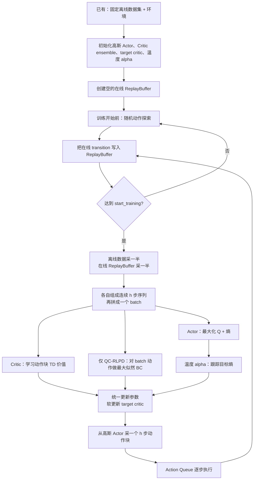

# RLPD-AC 与 QC-RLPD：另一条技术路线

> 前几章讲的是 QC 主线：Flow Matching 表达动作分布，分块 Critic 评价动作，QC 或单步学生负责最终决策。本章讲论文中的另一组对照方法。先不看代码，先回答它为什么存在、训练数据怎样组织、每个网络的输入输出是什么，以及 RLPD-AC 和 QC-RLPD 究竟只差哪一项。

## 一、先明确这条路线要验证什么

RLPD（Reinforcement Learning with Prior Data）不是 Q-Chunking 论文提出的新算法，而是一个已有的“在线 RL + 离线先验数据”训练范式。它的基本想法是：

1. 在线 replay buffer 负责提供当前策略亲自探索得到的新经验。
2. 离线数据集始终作为独立的 prior data 保留下来。
3. 每次更新都同时使用两类数据，避免在线训练完全忘掉已有经验。

项目在这个思路上加入动作分块，得到 **RLPD-AC**。这里的 AC 是 action chunking：Actor 一次产生 $h$ 步动作，Critic 一次评价整段动作。

然后项目再给这个高斯 Actor 增加一个最大似然 BC 约束，得到 **QC-RLPD**。

所以两种方法的关系非常简单：

| 方法 | SAC 风格 Actor-Critic | 动作分块 | 额外 BC 约束 |
|---|---:|---:|---:|
| RLPD-AC | 有 | 有 | 无，`bc_alpha=0` |
| QC-RLPD | 有 | 有 | 有，`bc_alpha>0` |

**QC-RLPD 不是另一套网络，也不是先训练 RLPD-AC 再切换。两者使用同一个 `ACRLPDAgent`，只由 BC 系数是否为零区分。**

## 二、它和 QC 主线的根本区别

先从整体设计对比，而不是从类名和代码细节对比：

| 维度 | QC 主线 | RLPD-AC / QC-RLPD |
|---|---|---|
| 动作分布 | Flow Matching，可表达多模态 | 对角高斯经过 `tanh`，主要表达单峰 |
| 最终动作 | flow 候选 + Critic 选择，或单步学生 | 直接从高斯 Actor 采样 |
| 独立离线预训练 | 有 | 没有 |
| 在线开始时的 replay | 装入完整离线数据 | 从空 buffer 开始 |
| 离线/在线数据关系 | 混在同一个 buffer | 两个数据源始终隔离 |
| 每个训练 batch | 按同一 buffer 当前比例随机采样 | 强制一半离线、一半在线 |
| 行为约束 | 候选来源或教师蒸馏 | 可选的高斯策略最大似然 BC |

这组对照要回答的是：

- 只使用“动作分块 + 成熟的 SAC/RLPD 训练配方”，能取得多少收益？
- 再给高斯 Actor 增加直接 BC 约束，能否达到 Flow Matching 路线的效果？
- 如果不能，问题究竟来自约束强度，还是高斯分布表达多模态动作的能力上限？

## 三、从程序启动到在线更新的完整流程

这条路线没有独立 offline pretrain，整个训练从在线环境开始。



这张图最重要的两点：

1. 离线数据从不搬入在线 replay buffer。
2. 训练时才从两个独立数据源各采一半，临时拼成一个 batch。

## 四、训练一步之前，具体有哪些输入

### 4.1 两个永久分开的数据源

**离线数据 `train_dataset`**：

- 启动时已经存在。
- 只读，不追加在线数据。
- 提供已有行为和奖励 transition。
- 不会被在线数据环形覆盖。

**在线数据 `replay_buffer`**：

- 启动时为空。
- 只保存当前运行产生的 rollout transition。
- 容量固定，写满后环形覆盖旧在线数据。
- 不包含离线数据的拷贝。

训练开始后，每个 batch 强制：

$$
\mathcal B
=
\frac{1}{2}\mathcal B_{\text{offline}}
+\frac{1}{2}\mathcal B_{\text{online}}.
$$

这里的“加号”表示沿 batch 维拼接，不是把两个 buffer 合并。每个梯度更新看到的样本数始终一半来自离线数据、一半来自在线数据。

### 4.2 单条分块训练样本包含什么

两个数据源都会通过 `sample_sequence(..., sequence_length=h)` 生成相同格式：

$$
\left(
s_t,\;
\mathbf a_{t:t+h-1},\;
G_t^{(h)},\;
s_{t+h},\;
m_t,\;
\text{valid}
\right).
$$

| 字段 | 形状示意 | 用途 |
|---|---|---|
| 起始状态 $s_t$ | `(batch, obs_dim)` | Actor 和 Critic 的条件输入 |
| 动作块 $\mathbf a$ | `(batch, h, action_dim)` | Critic 的真实动作；可选 BC 的监督答案 |
| $h$ 步累计回报 | `(batch, h)`，最后一项是完整累计值 | 构造 TD target |
| 块后状态 | `(batch, h, obs_dim)`，使用最后一个 | 生成 bootstrap 动作 |
| `mask` | `(batch, h)` | 终止后不再 bootstrap |
| `valid` | `(batch, h)` | 屏蔽跨 episode 的无效动作块 |

两类数据先分别组成这种结构，再沿 batch 维拼起来。网络看不到“这个样本来自离线还是在线”的标签。

## 五、四个学习组件：输入什么，输出什么

### 5.1 高斯 Actor

Actor 接收状态 $s$，输出动作块分布的参数：

$$
s
\longrightarrow
\left(
\mu_\phi(s),\log\sigma_\phi(s)
\right).
$$

由此构造高斯，再经过 `tanh` 把每个动作维度限制在 $[-1,1]$：

$$
\mathbf a
=
\tanh\left(
\mu_\phi(s)+\sigma_\phi(s)\odot\epsilon
\right),
\qquad
\epsilon\sim\mathcal N(0,I).
$$

若单步动作维度是 $d_a$，动作块长度是 $h$，Actor 输出分布的事件维度就是 $h d_a$。采样结果先是扁平向量，执行时再 reshape 成 $h$ 个单步动作。

**产物**：可以一次前向采样完整动作块的随机策略。

### 5.2 Critic ensemble

每个 Critic 接收“起始状态 + 扁平动作块”：

$$
(s,\mathbf a)\longrightarrow Q_i(s,\mathbf a).
$$

项目默认使用 10 个 Critic：

$$
[Q_1,\ldots,Q_{10}].
$$

bootstrap 时可以取 ensemble 的均值或最小值；Actor 优化时使用均值。较大的 ensemble 是 RLPD 在高 UTD 更新下保持稳定的重要设计。

**产物**：多个对整个动作块长期回报的估计。

### 5.3 Target Critic

Target Critic 的输入输出与当前 Critic 相同，但不直接通过梯度训练。每次更新后做软更新：

$$
\bar\theta
\leftarrow
\tau\theta+(1-\tau)\bar\theta.
$$

**产物**：变化更慢的 bootstrap 目标，减少 TD 训练振荡。

### 5.4 温度系数 $\alpha$

$\alpha$ 是一个正标量，用来控制 Actor 的随机性：

- $\alpha$ 大：更重视熵，策略更随机。
- $\alpha$ 小：更重视 Q，策略更确定。

代码训练的是 `log_temp`，再取指数保证 $\alpha>0$。它会自动跟踪目标熵，不需要手工固定探索强度。

注意：这里的温度 $\alpha$ 与其他章节中可能出现的蒸馏权重不是同一个概念。

## 六、先理解优化目标，再看实现

### 6.1 Critic：学习动作块价值

先在块后状态 $s_{t+h}$ 从当前高斯 Actor 采样下一动作块：

$$
\mathbf a'
\sim
\pi_\phi(\cdot\mid s_{t+h}).
$$

Target Critic 给它估值，并构造：

$$
y_t
=
G_t^{(h)}
+\gamma^h m_t
\operatorname{Agg}_i
Q_{\bar\theta_i}(s_{t+h},\mathbf a').
$$

Critic 最小化：

$$
\mathcal L_{\text{critic}}
=
\mathbb E
\left[
\left(
Q_{\theta_i}(s_t,\mathbf a_{t:t+h-1})-y_t
\right)^2
\cdot\text{valid}
\right].
$$

**输入**：混合 batch 的状态、真实动作块、累计 reward、块后状态。

**更新**：当前 Critic。

**输出**：更准确的动作块价值函数。

一个必须按代码说明的细节：这个项目的 TD target 只有“累计 reward + 下一 Q”，**没有加入教科书 SAC target 中的 $-\alpha\log\pi(\mathbf a'|s')$ 熵项**。因此更准确的说法是“使用 SAC 风格 Actor 的分块 TD Critic”，而不是完整照搬标准 soft Bellman target。

### 6.2 Actor：在保持随机性的同时追求高 Q

Actor 从自己的分布重参数化采样 $\mathbf a\sim\pi_\phi(\cdot|s)$，最小化：

$$
\mathcal L_{\text{actor}}
=
\mathbb E
\left[
\alpha\log\pi_\phi(\mathbf a\mid s)
-\frac{1}{K}\sum_{i=1}^KQ_{\theta_i}(s,\mathbf a)
\right].
$$

因为训练在做最小化：

- $-Q$ 推动 Actor 产生更高价值动作。
- $\alpha\log\pi$ 鼓励更高熵，防止策略过早坍缩。

**输入**：混合 batch 中的状态。这里的 Q 优化不需要 batch 里的真实动作。

**更新**：高斯 Actor。

**输出**：更偏向高价值、同时保持一定随机性的动作块分布。

### 6.3 温度：让策略熵靠近目标值

根据 Actor 当前样本的 `log_prob` 估计熵：

$$
\mathcal H(\pi)
=-\mathbb E[\log\pi(\mathbf a\mid s)].
$$

再用目标熵调节 $\alpha$。项目默认目标熵为：

$$
\mathcal H_{\text{target}}
=-0.5\,(h d_a).
$$

这项只更新温度参数；对熵估计使用 `stop_gradient`，不会借这项 loss 再更新 Actor。

### 6.4 可选 BC：直接提高数据动作的似然

QC-RLPD 比 RLPD-AC 多出的唯一目标是：

$$
\mathcal L_{\text{BC}}
=
-\lambda_{\text{BC}}
\mathbb E_{(s,\mathbf a)\sim\mathcal B}
\left[
\log\pi_\phi(\mathbf a\mid s)
\right].
$$

其中 $\lambda_{\text{BC}}$ 就是配置中的 `bc_alpha`。

**输入**：混合 batch 的状态和真实动作块。

**更新**：同一个高斯 Actor。

**输出**：提高 Actor 对 batch 动作的概率，使策略不只追求 Q，也贴近已有行为。

这里有一个非常重要的代码事实：

$$
\mathcal B
=
\tfrac12\mathcal B_{\text{offline}}
+\tfrac12\mathcal B_{\text{online}}.
$$

BC loss 没有只选离线专家半边，而是直接作用于拼好的整个 batch。因此 QC-RLPD 会同时克隆：

- 离线 prior data 中的动作。
- 在线 replay 中所有被采到的实际 rollout 动作。

它没有按 reward、success 或 advantage 过滤在线 BC 样本。

### 6.5 一次更新的总目标

RLPD-AC：

$$
\mathcal L_{\text{RLPD-AC}}
=
\mathcal L_{\text{critic}}
+\mathcal L_{\text{actor}}
+\mathcal L_{\alpha}.
$$

QC-RLPD：

$$
\mathcal L_{\text{QC-RLPD}}
=
\mathcal L_{\text{critic}}
+\mathcal L_{\text{actor}}
+\mathcal L_{\alpha}
+\mathcal L_{\text{BC}}.
$$

| loss | 使用状态 | 使用真实动作 | 使用 reward | 更新谁 |
|---|---:|---:|---:|---|
| Critic TD | 是 | 是 | 是 | Critic |
| Actor Q + entropy | 是 | 否 | 否 | Actor |
| Temperature | 间接使用 Actor 样本 | 否 | 否 | $\alpha$ |
| BC（仅 QC-RLPD） | 是 | 是 | 否 | Actor |

## 七、RLPD-AC 与 QC-RLPD 分别怎样工作

### 7.1 RLPD-AC：完全依赖 RL 目标优化 Actor

设置：

$$
\texttt{bc\_alpha}=0.
$$

此时 $\mathcal L_{\text{BC}}=0$。离线数据仍然会进入训练，但它的作用是：

- 给 Critic 提供先验 transition。
- 给 Actor 的 Q loss 提供状态分布。

Actor 不会直接最大化离线动作的似然。因此，“使用 prior data”不等于“行为克隆 prior data”。

### 7.2 QC-RLPD：给同一个 Actor 增加行为约束

设置：

$$
\texttt{bc\_alpha}>0
\quad
\text{（README 示例为 }0.01\text{）}.
$$

此时 Actor 同时承受三种方向：

1. $-Q$：追求高价值。
2. $\alpha\log\pi$：保持随机探索。
3. $-\lambda_{\text{BC}}\log\pi(\mathbf a_{\text{data}}|s)$：贴近混合 batch 中的实际动作。

它不增加教师网络，也不增加第二张 Actor，只是在原高斯 Actor 上多加一个最大似然项。

### 7.3 这种 BC 约束的能力上限

高斯策略只有一组均值和方差。若同一状态附近存在两种相距很远的合理动作模式，直接最大似然可能：

- 增大方差，覆盖两边但产生大量中间动作。
- 把均值拉到两个模式中间。
- 难以像 Flow Matching 那样分别保持多个清晰模式。

所以 QC-RLPD 的问题不一定能靠继续增大 `bc_alpha` 解决。系数只控制约束强弱，不能改变单高斯的表达能力上限。

## 八、在线运行时，每一步用了什么、做了什么、得到什么

### 8.1 随机预热

**已有**：空在线 replay buffer、随机初始化网络、固定离线数据集。

**操作**：`start_training` 之前使用均匀随机动作与环境交互，把 transition 写入在线 buffer。

**得到**：足够进行连续 $h$ 步采样的初始在线经验。

### 8.2 构造严格 50/50 的 batch

**已有**：只读离线数据集和只含 rollout 的在线 buffer。

**操作**：分别采 `batch_size/2` 条分块序列，再沿 batch 维拼接。

**得到**：字段格式统一、来源比例固定的训练 batch。

### 8.3 同时更新四个组件

**已有**：混合 batch。

**操作**：计算 Critic、Actor、温度，以及可选 BC loss；统一求梯度，然后软更新 target critic。

**得到**：更新后的高斯 Actor、Critic ensemble、温度和 target critic。

### 8.4 生成并执行下一动作块

**已有**：当前状态和更新后的 Actor。

**操作**：从高斯分布采一个扁平动作块，裁剪到 $[-1,1]$，reshape 后放入 action queue。

**得到**：连续 $h$ 个单步动作；执行结果再写回在线 buffer，形成下一轮训练数据。

## 九、理解完成后，再用代码核对三个关键事实

到这里才需要看少量实现，以确认上面的设计没有被概括错。

### 9.1 两个数据源确实隔离并各采一半

```python
replay_buffer = ReplayBuffer.create(example_batch, size=FLAGS.buffer_size)

dataset_batch = train_dataset.sample_sequence(batch_size // 2 * utd_ratio, ...)
replay_batch = replay_buffer.sample_sequence(batch_size // 2 * utd_ratio, ...)
batch = {
    k: np.concatenate([dataset_batch[k], replay_batch[k]], axis=1)
    for k in dataset_batch
}
```

`replay_buffer` 从空创建，而不是从离线数据初始化。离线与在线数据只在当前 batch 中临时拼接。

### 9.2 Actor 的输入输出确实是高斯动作块分布

```python
dist = self.network.select("actor")(batch["observations"], params=grad_params)
actions = dist.sample(seed=rng)
log_probs = dist.log_prob(actions)
```

`dist` 同时提供采样结果和对数概率，因此同一个 Actor 能同时计算 SAC 风格目标与最大似然 BC。

### 9.3 BC 确实作用于整个混合 batch

```python
bc_loss = -dist.log_prob(
    jnp.clip(batch_actions, -1 + 1e-5, 1 - 1e-5)
).mean() * self.config["bc_alpha"]
```

`batch_actions` 没有按前半/后半切片，也没有质量过滤。这直接证明 QC-RLPD 的 BC 数据包含离线和在线两部分。

## 十、最后用一张表记住

| 问题 | RLPD-AC | QC-RLPD |
|---|---|---|
| 在线 replay 初始内容 | 空 | 空 |
| 离线数据是否独立保存 | 是 | 是 |
| 每个 batch 的来源 | 50% 离线 + 50% 在线 | 50% 离线 + 50% 在线 |
| Actor | `tanh` 对角高斯 | 同一个 `tanh` 对角高斯 |
| Actor RL 目标 | 最大化 Q + 熵 | 最大化 Q + 熵 |
| 直接克隆数据动作 | 否 | 是 |
| BC 使用哪些数据 | 无 BC | 整个混合 batch |
| 多模态表达能力 | 受单高斯限制 | 仍受单高斯限制 |

## 十一、下一章要解决的问题

本章先建立了设计、数据流、输入输出和优化目标，最后才用代码确认实现。[下一章](./07_训练主循环_评测与复现实验) 会把 `main.py` 与 `main_online.py` 放在一起，详细解释 action queue、UTD、评测和复现实验命令。
