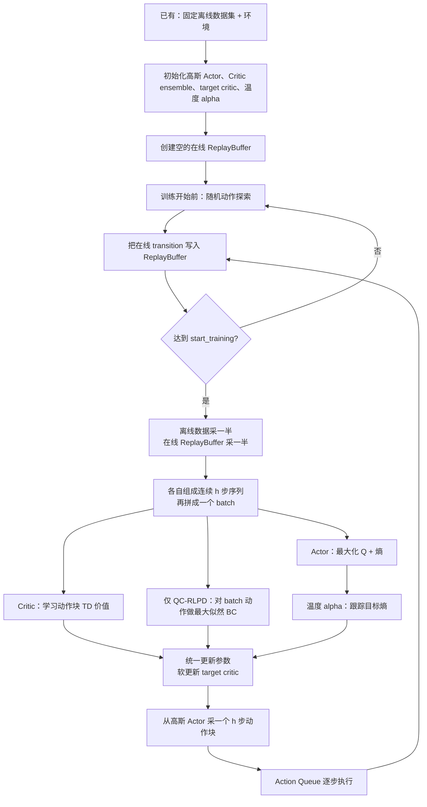

# RLPD-AC 与 QC-RLPD：另一条技术路线

> 前几章讲的是 QC 主线：Flow Matching 表达动作分布，分块 Critic 评价动作，QC 或单步学生负责最终决策。本章讲论文中的另一组对照方法。先不看代码，先回答它为什么存在、训练数据怎样组织、每个网络的输入输出是什么，以及 RLPD-AC 和 QC-RLPD 究竟只差哪一项。

## 一、先明确这条路线要验证什么

RLPD（Reinforcement Learning with Prior Data）不是 Q-Chunking 论文提出的新算法，而是一个已有的“在线 RL + 离线先验数据”训练范式。它的基本想法是：

1. 在线 replay buffer 负责提供当前策略亲自探索得到的新经验。
2. 离线数据集始终作为独立的 prior data 保留下来。
3. 每次更新都同时使用两类数据，避免在线训练完全忘掉已有经验。

项目在这个思路上加入动作分块，得到 **RLPD-AC**。这里的 AC 是 action chunking：Actor 一次产生 $h$ 步动作，Critic 一次评价整段动作。

然后项目再给这个高斯 Actor 增加一个最大似然 BC 约束，得到 **QC-RLPD**。

所以两种方法的关系非常简单：

| 方法 | SAC 风格 Actor-Critic | 动作分块 | 额外 BC 约束 |
|---|---:|---:|---:|
| RLPD-AC | 有 | 有 | 无，`bc_alpha=0` |
| QC-RLPD | 有 | 有 | 有，`bc_alpha>0` |

**QC-RLPD 不是另一套网络，也不是先训练 RLPD-AC 再切换。两者使用同一个 `ACRLPDAgent`，只由 BC 系数是否为零区分。**

## 二、它和 QC 主线的根本区别

先从整体设计对比，而不是从类名和代码细节对比：

| 维度 | QC 主线 | RLPD-AC / QC-RLPD |
|---|---|---|
| 动作分布 | Flow Matching，可表达多模态 | 对角高斯经过 `tanh`，主要表达单峰 |
| 最终动作 | flow 候选 + Critic 选择，或单步学生 | 直接从高斯 Actor 采样 |
| 独立离线预训练 | 有 | 没有 |
| 在线开始时的 replay | 装入完整离线数据 | 从空 buffer 开始 |
| 离线/在线数据关系 | 混在同一个 buffer | 两个数据源始终隔离 |
| 每个训练 batch | 按同一 buffer 当前比例随机采样 | 强制一半离线、一半在线 |
| 行为约束 | 候选来源或教师蒸馏 | 可选的高斯策略最大似然 BC |

这组对照要回答的是：

- 只使用“动作分块 + 成熟的 SAC/RLPD 训练配方”，能取得多少收益？
- 再给高斯 Actor 增加直接 BC 约束，能否达到 Flow Matching 路线的效果？
- 如果不能，问题究竟来自约束强度，还是高斯分布表达多模态动作的能力上限？

## 三、从程序启动到在线更新的完整流程

这条路线没有独立 offline pretrain，整个训练从在线环境开始。


```mermaid
flowchart TB
    Start["已有：固定离线数据集 + 环境"] --> Init["初始化高斯 Actor、Critic ensemble、target critic、温度 alpha"]
    Init --> Empty["创建空的在线 ReplayBuffer"]
    Empty --> Warmup["训练开始前：随机动作探索"]
    Warmup --> Add["把在线 transition 写入 ReplayBuffer"]
    Add --> Ready{"达到 start_training?"}
    Ready -->|否| Warmup
    Ready -->|是| Mix["离线数据采一半<br/>在线 ReplayBuffer 采一半"]
    Mix --> Chunk["各自组成连续 h 步序列<br/>再拼成一个 batch"]
    Chunk --> Critic["Critic：学习动作块 TD 价值"]
    Chunk --> Actor["Actor：最大化 Q + 熵"]
    Chunk --> BC["仅 QC-RLPD：对 batch 动作做最大似然 BC"]
    Actor --> Alpha["温度 alpha：跟踪目标熵"]
    Critic --> Update["统一更新参数<br/>软更新 target critic"]
    BC --> Update
    Alpha --> Update
    Update --> Policy["从高斯 Actor 采一个 h 步动作块"]
    Policy --> Execute["Action Queue 逐步执行"]
    Execute --> Add
```

这张图最重要的两点：

1. 离线数据从不搬入在线 replay buffer。
2. 训练时才从两个独立数据源各采一半，临时拼成一个 batch。

## 四、训练一步之前，具体有哪些输入

### 4.1 两个永久分开的数据源

**离线数据 `train_dataset`**：

- 启动时已经存在。
- 只读，不追加在线数据。
- 提供已有行为和奖励 transition。
- 不会被在线数据环形覆盖。

**在线数据 `replay_buffer`**：

- 启动时为空。
- 只保存当前运行产生的 rollout transition。
- 容量固定，写满后环形覆盖旧在线数据。
- 不包含离线数据的拷贝。

训练开始后，每个 batch 强制：

$$
\mathcal B
=
\frac{1}{2}\mathcal B_{\text{offline}}
+\frac{1}{2}\mathcal B_{\text{online}}.
$$

**这个公式在做什么**：规定每次训练用的 batch 必须严格一半来自离线数据、一半来自在线数据，不像 QC 主线那样按 buffer 当前比例随机采。

::: details 📐 公式详解（点击展开）

| 子表达式 | 它是谁 | 它在干嘛 |
|---------|--------|---------|
| $\mathcal B_{\text{offline}}$ | **离线那一半** | 从只读的 `train_dataset` 里采出的分块序列 |
| $\mathcal B_{\text{online}}$ | **在线那一半** | 从当前运行产生的 `replay_buffer` 里采出的分块序列 |
| $\frac12(\cdot)+\frac12(\cdot)$ | **强制对半拼接** | 沿 batch 维度把两部分数据拼起来，各占一半，不是概率意义上的加权平均 |
| $\mathcal B$ | **最终训练 batch** | Critic、Actor、BC loss 都在这个拼好的混合 batch 上计算 |

**用人话读**："每次训练的 batch，固定一半样本来自离线数据集，另一半固定来自在线 replay buffer，两边各占一半，拼成一个 batch 送去训练。"

**为什么是这个形式**：这是 RLPD 范式的核心设计——离线数据和在线数据物理上永远隔离、不互相污染，但训练时强制按固定比例混合，既保证不遗忘离线先验，又能持续吸收在线新经验。这与 QC 主线"混进同一个 buffer 按数量自然采样"的做法形成直接对比。
:::

这里的“加号”表示沿 batch 维拼接，不是把两个 buffer 合并。每个梯度更新看到的样本数始终一半来自离线数据、一半来自在线数据。

### 4.2 单条分块训练样本包含什么

两个数据源都会通过 `sample_sequence(..., sequence_length=h)` 生成相同格式：

$$
\left(
s_t,\;
\mathbf a_{t:t+h-1},\;
G_t^{(h)},\;
s_{t+h},\;
m_t,\;
\text{valid}
\right).
$$

**这个公式在做什么**：定义 RLPD-AC / QC-RLPD 两个数据源统一生成的单条训练样本格式——和 QC 主线的动作块样本结构完全一样。

::: details 📐 公式详解（点击展开）

| 子表达式 | 它是谁 | 它在干嘛 |
|---------|--------|---------|
| $s_t$ | **块起点状态** | Actor 和 Critic 共同的条件输入 |
| $\mathbf a_{t:t+h-1}$ | **动作块** | 连续 $h$ 步的真实动作序列，供 Critic 和可选 BC 使用 |
| $G_t^{(h)}$ | **$h$ 步累计回报** | 构造 Critic 的 TD target |
| $s_{t+h}$ | **块后状态** | 用来生成 bootstrap 下一动作 |
| $m_t$ | **继续标志** | episode 是否在这 $h$ 步内结束 |
| $\text{valid}$ | **合法性标志** | 屏蔽跨 episode 边界的无效动作块 |

**用人话读**："不管来自离线数据集还是在线 replay buffer，每条训练样本都打包成同样的六元组：起点状态、动作块、累计回报、终点状态和两个合法性开关。"

**为什么是这个形式**：两个数据源用同一个 `sample_sequence` 函数生成完全相同的字段结构，这样才能在 batch 维直接拼接，网络训练时完全看不出样本来自哪个数据源。
:::

| 字段 | 形状示意 | 用途 |
|---|---|---|
| 起始状态 $s_t$ | `(batch, obs_dim)` | Actor 和 Critic 的条件输入 |
| 动作块 $\mathbf a$ | `(batch, h, action_dim)` | Critic 的真实动作；可选 BC 的监督答案 |
| $h$ 步累计回报 | `(batch, h)`，最后一项是完整累计值 | 构造 TD target |
| 块后状态 | `(batch, h, obs_dim)`，使用最后一个 | 生成 bootstrap 动作 |
| `mask` | `(batch, h)` | 终止后不再 bootstrap |
| `valid` | `(batch, h)` | 屏蔽跨 episode 的无效动作块 |

两类数据先分别组成这种结构，再沿 batch 维拼起来。网络看不到“这个样本来自离线还是在线”的标签。

## 五、四个学习组件：输入什么，输出什么

### 5.1 高斯 Actor

Actor 接收状态 $s$，输出动作块分布的参数：

$$
s
\longrightarrow
\left(
\mu_\phi(s),\log\sigma_\phi(s)
\right).
$$

**这个公式在做什么**：把 Actor 定义成一个从状态输出高斯分布参数的网络——和 Flow Matching 路线完全不同的动作分布表达方式。

::: details 📐 公式详解（点击展开）

| 子表达式 | 它是谁 | 它在干嘛 |
|---------|--------|---------|
| $s$ | **输入状态** | Actor 网络唯一的条件输入 |
| $\mu_\phi(s)$ | **均值输出** | 网络预测的动作块分布中心 |
| $\log\sigma_\phi(s)$ | **对数标准差输出** | 网络预测的分布"胖瘦程度"，取对数是为了保证 $\sigma>0$ 且训练更稳定 |
| $\phi$ | **Actor 参数** | 整个映射由这一组可训练参数决定 |

**用人话读**："给定状态，网络直接输出一个高斯分布的均值和方差，而不是像 flow 那样输出一个逐步去噪的向量场。"

**为什么是这个形式**：这是 SAC 类算法最常用的策略参数化方式——只需要一次前向就能拿到完整分布，采样和算 log-prob 都非常简单，代价是只能表达单峰分布。
:::

由此构造高斯，再经过 `tanh` 把每个动作维度限制在 $[-1,1]$：

$$
\mathbf a
=
\tanh\left(
\mu_\phi(s)+\sigma_\phi(s)\odot\epsilon
\right),
\qquad
\epsilon\sim\mathcal N(0,I).
$$

**这个公式在做什么**：用重参数化技巧从高斯分布里采出一个动作块，再用 $\tanh$ 把值域压缩到合法动作范围内。

::: details 📐 公式详解（点击展开）

| 子表达式 | 它是谁 | 它在干嘛 |
|---------|--------|---------|
| $\epsilon\sim\mathcal N(0,I)$ | **随机扰动源** | 独立于网络参数的标准高斯噪声，负责引入随机性 |
| $\mu_\phi(s)+\sigma_\phi(s)\odot\epsilon$ | **重参数化采样** | 把随机性拆成"确定性均值+方差缩放的噪声"，这样梯度可以穿过采样过程 |
| $\tanh(\cdot)$ | **值域压缩器** | 把无约束的实数值挤压进 $(-1,1)$，保证输出是合法动作 |
| $\mathbf a$ | **最终动作块** | 压缩后的扁平向量，之后 reshape 成 $h$ 个单步动作 |

**用人话读**："先按均值和方差生成一个正常的高斯随机数，再用 tanh 把它挤压到 $[-1,1]$ 之间，就是输出的动作。"

**为什么是这个形式**：重参数化让采样过程可导，是 SAC 类算法能直接用梯度优化 Actor 的关键；`tanh` 挤压是应对连续控制任务里动作有界这一常见约束的标准做法。
:::

若单步动作维度是 $d_a$，动作块长度是 $h$，Actor 输出分布的事件维度就是 $h d_a$。采样结果先是扁平向量，执行时再 reshape 成 $h$ 个单步动作。

**产物**：可以一次前向采样完整动作块的随机策略。

### 5.2 Critic ensemble

每个 Critic 接收“起始状态 + 扁平动作块”：

$$
(s,\mathbf a)\longrightarrow Q_i(s,\mathbf a).
$$

**这个公式在做什么**：定义单个 Critic 的输入输出——接收整段动作块（而不是单步动作），一次性给出这个动作块的价值估计。

::: details 📐 公式详解（点击展开）

| 子表达式 | 它是谁 | 它在干嘛 |
|---------|--------|---------|
| $s$ | **起始状态** | 动作块执行前观测到的状态 |
| $\mathbf a$ | **扁平动作块** | $h$ 步动作拼成的一个扁平向量，作为一个整体输入网络 |
| $Q_i(s,\mathbf a)$ | **第 $i$ 个 Critic 的打分** | 这个 Critic 网络对整段动作块的长期价值估计 |

**用人话读**："每个 Critic 接收状态和一整段动作块，直接给出一个分数，不是逐步打分再累加。"

**为什么是这个形式**：把 $h$ 步动作打包成一个整体输入，是"动作分块"（action chunking）思想在 Critic 上的体现——Critic 判断的是"这一整段动作序列"的价值，而不是单步价值。
:::

项目默认使用 10 个 Critic：

$$
[Q_1,\ldots,Q_{10}].
$$

**这个公式在做什么**：说明项目用了一个规模较大的 Critic 集成（10 个），而不是常见的 2 个，这是 RLPD 保持高更新频率下训练稳定的关键设计。

::: details 📐 公式详解（点击展开）

| 子表达式 | 它是谁 | 它在干嘛 |
|---------|--------|---------|
| $Q_1,\ldots,Q_{10}$ | **十个独立 Critic** | 结构相同但参数独立初始化、独立训练的十份价值估计 |
| $[\cdot]$ | **集成打包** | 把这十个网络当作一个整体使用，bootstrap 或 Actor 更新时聚合它们的输出 |

**用人话读**："不是只用一两个 Critic，而是同时训练十个，用它们的集体意见来降低单个网络的估计误差。"

**为什么是这个形式**：RLPD 论文发现在高 UTD（每步环境交互对应多次梯度更新）场景下，Critic 容易过拟合或高估，用更大的 ensemble（10 个而不是标准 SAC 的 2 个）并结合均值/最小值聚合，能显著提升训练稳定性。
:::

bootstrap 时可以取 ensemble 的均值或最小值；Actor 优化时使用均值。较大的 ensemble 是 RLPD 在高 UTD 更新下保持稳定的重要设计。

**产物**：多个对整个动作块长期回报的估计。

### 5.3 Target Critic

Target Critic 的输入输出与当前 Critic 相同，但不直接通过梯度训练。每次更新后做软更新：

$$
\bar\theta
\leftarrow
\tau\theta+(1-\tau)\bar\theta.
$$

**这个公式在做什么**：让 Target Critic 的参数缓慢追随当前 Critic，而不是每步直接复制，从而给 TD 目标提供一个更稳定的参照。

::: details 📐 公式详解（点击展开）

| 子表达式 | 它是谁 | 它在干嘛 |
|---------|--------|---------|
| $\theta$ | **当前 Critic 参数** | 正在被梯度更新的那份参数 |
| $\bar\theta$ | **Target Critic 参数** | 只通过软更新缓慢变化，不直接参与反向传播 |
| $\tau$ | **追随速度旋钮** | 一个很小的正数（如 0.005），控制每次更新中"新参数"占的比例 |
| $\tau\theta+(1-\tau)\bar\theta$ | **指数滑动平均** | 让 $\bar\theta$ 朝 $\theta$ 缓慢移动一小步，而不是瞬间跳到 $\theta$ |

**用人话读**："Target Critic 每次只朝当前 Critic 挪一点点，绝大部分还是保留自己原来的参数。"

**为什么是这个形式**：如果 Target Critic 直接等于当前 Critic，TD 目标会随着每次更新剧烈变化，造成训练振荡；软更新让目标网络变化平滑，是 DDPG/SAC 系列算法稳定训练的标准技巧。
:::

**产物**：变化更慢的 bootstrap 目标，减少 TD 训练振荡。

### 5.4 温度系数 $\alpha$

$\alpha$ 是一个正标量，用来控制 Actor 的随机性：

- $\alpha$ 大：更重视熵，策略更随机。
- $\alpha$ 小：更重视 Q，策略更确定。

代码训练的是 `log_temp`，再取指数保证 $\alpha>0$。它会自动跟踪目标熵，不需要手工固定探索强度。

注意：这里的温度 $\alpha$ 与其他章节中可能出现的蒸馏权重不是同一个概念。

## 六、先理解优化目标，再看实现

### 6.1 Critic：学习动作块价值

先在块后状态 $s_{t+h}$ 从当前高斯 Actor 采样下一动作块：

$$
\mathbf a'
\sim
\pi_\phi(\cdot\mid s_{t+h}).
$$

**这个公式在做什么**：为了构造 Critic 的 TD 目标，需要先知道"块后状态下，策略会怎么做"，所以从当前高斯 Actor 里采一个下一动作块。

::: details 📐 公式详解（点击展开）

| 子表达式 | 它是谁 | 它在干嘛 |
|---------|--------|---------|
| $s_{t+h}$ | **块后状态** | 当前动作块执行完毕后到达的状态 |
| $\pi_\phi(\cdot\mid s_{t+h})$ | **当前高斯 Actor** | 用正在训练的策略（不是 target 策略）在这个状态下给出动作分布 |
| $\mathbf a'$ | **下一动作块采样** | 从上述分布里抽出的一个具体动作块，用于喂给 Target Critic 估值 |

**用人话读**："在动作块执行完之后的状态，让当前策略给出一个'接下来会怎么做'的动作块样本。"

**为什么是这个形式**：这是标准 SAC 风格 TD target 构造的第一步——bootstrap 目标需要"下一步策略会选的动作"，用当前策略采样是让 Critic 的目标值跟着策略同步演化。
:::

Target Critic 给它估值，并构造：

$$
y_t
=
G_t^{(h)}
+\gamma^h m_t
\operatorname{Agg}_i
Q_{\bar\theta_i}(s_{t+h},\mathbf a').
$$

**这个公式在做什么**：把"这个动作块实际拿到的回报"和"用 Target Critic 集成估计的未来价值"加起来，构成 Critic 训练的目标值。

::: details 📐 公式详解（点击展开）

| 子表达式 | 它是谁 | 它在干嘛 |
|---------|--------|---------|
| $G_t^{(h)}$ | **实打实的收益** | 动作块执行后 $h$ 步内累计拿到的真实 reward |
| $\gamma^h m_t$ | **远期折扣+继续开关** | 跨 $h$ 步的折扣，episode 若已结束则被 $m_t=0$ 清零 |
| $\operatorname{Agg}_i Q_{\bar\theta_i}(s_{t+h},\mathbf a')$ | **集成聚合估计** | 对 10 个 Target Critic 的打分做聚合（取均值或最小值），得到对未来价值更稳健的估计 |
| $y_t$ | **TD 目标** | 上述两部分之和 |

**用人话读**："这个动作块真实拿到的分数，加上打折后、用十个 Target Critic 聚合估计的未来价值，两者相加就是训练目标。"

**为什么是这个形式**：和 QC 主线的 TD target 结构一致，唯一区别是这里用 $\operatorname{Agg}_i$ 聚合了 10 个 Critic 的估计（而不是单个网络），这是大规模 ensemble 设计在 target 构造上的直接体现。注意这里没有额外加入标准 soft Bellman target 中的熵项 $-\alpha\log\pi(\mathbf a'|s')$，下文会专门说明这一点。
:::

Critic 最小化：

$$
\mathcal L_{\text{critic}}
=
\mathbb E
\left[
\left(
Q_{\theta_i}(s_t,\mathbf a_{t:t+h-1})-y_t
\right)^2
\cdot\text{valid}
\right].
$$

**这个公式在做什么**：让每个 Critic 的打分尽量贴近上面算出的 TD 目标，用 `valid` 屏蔽掉跨越 episode 边界的无效样本。

::: details 📐 公式详解（点击展开）

| 子表达式 | 它是谁 | 它在干嘛 |
|---------|--------|---------|
| $Q_{\theta_i}(s_t,\mathbf a_{t:t+h-1})$ | **当前第 $i$ 个 Critic 的估计** | 用真实动作块喂进当前正在训练的 Critic |
| $y_t$ | **TD 目标** | 上一条公式算出的"标准答案" |
| $(Q_{\theta_i}-y_t)^2$ | **打分误差** | 每个 Critic 各自的均方误差 |
| $\cdot\,\text{valid}$ | **合法性过滤器** | 把跨越 episode 边界的无效样本对应的误差项清零，不参与梯度更新 |
| $\mathbb E[\cdot]$ | **公平考试** | 对混合 batch 中所有有效样本取平均 |

**用人话读**："拿真实动作块喂给每个 Critic，看它打的分和 TD 目标差多少，差距的平方（跳过无效样本）就是要最小化的 loss。"

**为什么是这个形式**：这是分块 TD 学习的标准均方误差写法，`valid` 过滤是必要的工程细节——防止越过 episode 终点的伪造动作块污染训练信号。
:::

**输入**：混合 batch 的状态、真实动作块、累计 reward、块后状态。

**更新**：当前 Critic。

**输出**：更准确的动作块价值函数。

一个必须按代码说明的细节：这个项目的 TD target 只有“累计 reward + 下一 Q”，**没有加入教科书 SAC target 中的 $-\alpha\log\pi(\mathbf a'|s')$ 熵项**。因此更准确的说法是“使用 SAC 风格 Actor 的分块 TD Critic”，而不是完整照搬标准 soft Bellman target。

### 6.2 Actor：在保持随机性的同时追求高 Q

Actor 从自己的分布重参数化采样 $\mathbf a\sim\pi_\phi(\cdot|s)$，最小化：

$$
\mathcal L_{\text{actor}}
=
\mathbb E
\left[
\alpha\log\pi_\phi(\mathbf a\mid s)
-\frac{1}{K}\sum_{i=1}^KQ_{\theta_i}(s,\mathbf a)
\right].
$$

**这个公式在做什么**：让 Actor 在追求高 Critic 打分的同时，也保留一定的随机性（熵），两个目标同时体现在一个 loss 里，通过最小化实现。

::: details 📐 公式详解（点击展开）

| 子表达式 | 它是谁 | 它在干嘛 |
|---------|--------|---------|
| $\mathbf a\sim\pi_\phi(\cdot\mid s)$ | **重参数化采样** | Actor 自己采出的动作块，采样过程可导 |
| $\frac1K\sum_{i=1}^K Q_{\theta_i}(s,\mathbf a)$ | **集成平均打分** | $K$ 个 Critic 对这个动作的平均估值，代表"这个动作有多好" |
| $-\frac1K\sum_i Q_{\theta_i}$ | **追高驱动力** | 取负号后最小化它，等价于让 Actor 朝 Q 值更高的方向调整 |
| $\alpha\log\pi_\phi(\mathbf a\mid s)$ | **保熵驱动力** | $\log\pi$ 越负说明分布越尖锐（熵越低），最小化这一项会推动分布变得更平坦（熵更高） |
| $\mathbb E[\cdot]$ | **公平考试** | 对混合 batch 中所有状态取平均 |

**用人话读**："让 Actor 的动作尽量拿到高的 Critic 平均分，同时不要让自己的分布变得太尖锐、太快失去随机性。"

**为什么是这个形式**：这是标准 SAC 的 Actor loss——$-Q$ 项负责性能提升，$\alpha\log\pi$ 项负责维持探索熵，两者的相对权重由温度 $\alpha$ 自动调节（见 6.3 节），不需要手动平衡。
:::

因为训练在做最小化：

- $-Q$ 推动 Actor 产生更高价值动作。
- $\alpha\log\pi$ 鼓励更高熵，防止策略过早坍缩。

**输入**：混合 batch 中的状态。这里的 Q 优化不需要 batch 里的真实动作。

**更新**：高斯 Actor。

**输出**：更偏向高价值、同时保持一定随机性的动作块分布。

### 6.3 温度：让策略熵靠近目标值

根据 Actor 当前样本的 `log_prob` 估计熵：

$$
\mathcal H(\pi)
=-\mathbb E[\log\pi(\mathbf a\mid s)].
$$

**这个公式在做什么**：用 Actor 自己采样得到的 log-prob 估计当前策略的随机程度（熵），作为调节温度 $\alpha$ 的依据。

::: details 📐 公式详解（点击展开）

| 子表达式 | 它是谁 | 它在干嘛 |
|---------|--------|---------|
| $\log\pi(\mathbf a\mid s)$ | **对数概率** | Actor 对自己采出的动作打的对数概率，越尖锐的分布这个值越大（越接近 0 或为正） |
| $-\log\pi(\mathbf a\mid s)$ | **单样本熵估计** | 取负号后，分布越随机（越平坦）这个值越大 |
| $\mathbb E[\cdot]$ | **蒙特卡洛平均** | 用 batch 里采样到的动作对 $-\log\pi$ 求平均，近似真实的熵 |
| $\mathcal H(\pi)$ | **策略熵估计** | 衡量当前策略随机程度的一个标量 |

**用人话读**："策略越随机，采出的动作对数概率就越低（越负），取负号平均之后得到的熵估计就越高。"

**为什么是这个形式**：连续动作空间下策略熵没有解析形式，只能借助已经采样出来的动作和网络给出的 log-prob 做蒙特卡洛近似——这是 SAC 温度自动调节机制的标准做法。
:::

再用目标熵调节 $\alpha$。项目默认目标熵为：

$$
\mathcal H_{\text{target}}
=-0.5\,(h d_a).
$$

**这个公式在做什么**：给策略熵设定一个具体的目标数值，训练时会自动调节 $\alpha$，让实际熵靠近这个目标，而不需要手动设定探索强度。

::: details 📐 公式详解（点击展开）

| 子表达式 | 它是谁 | 它在干嘛 |
|---------|--------|---------|
| $h$ | **动作块长度** | 一次决策包含多少步单步动作 |
| $d_a$ | **单步动作维度** | 每一步动作向量的维度 |
| $h d_a$ | **动作块总维度** | 展平后送进高斯分布的事件维度 |
| $-0.5\,(h d_a)$ | **目标熵数值** | 一个和动作块维度成比例的负数，维度越大目标熵越低（越负） |

**用人话读**："目标熵设成'负的、和动作块总维度成比例'的一个具体数字，温度会自动调整让策略实际的熵靠近这个数。"

**为什么是这个形式**：这是 SAC 论文里常用的经验设置（目标熵与动作维度成比例），维度越高，需要的目标熵越低，这个系数是社区验证过比较好用的默认值，不需要针对每个任务单独调参。
:::

这项只更新温度参数；对熵估计使用 `stop_gradient`，不会借这项 loss 再更新 Actor。

### 6.4 可选 BC：直接提高数据动作的似然

QC-RLPD 比 RLPD-AC 多出的唯一目标是：

$$
\mathcal L_{\text{BC}}
=
-\lambda_{\text{BC}}
\mathbb E_{(s,\mathbf a)\sim\mathcal B}
\left[
\log\pi_\phi(\mathbf a\mid s)
\right].
$$

**这个公式在做什么**：直接提高 Actor 对混合 batch 中真实动作的输出概率，让高斯策略除了追求高 Q 之外，也贴近已有数据的行为。

::: details 📐 公式详解（点击展开）

| 子表达式 | 它是谁 | 它在干嘛 |
|---------|--------|---------|
| $(s,\mathbf a)\sim\mathcal B$ | **数据来源** | 从当前混合 batch（离线+在线各半）里取出的真实状态-动作对 |
| $\log\pi_\phi(\mathbf a\mid s)$ | **对数似然** | Actor 对这个真实动作给出的对数概率，越高说明策略越"认可"这个动作 |
| $-\lambda_{\text{BC}}\log\pi_\phi(\mathbf a\mid s)$ | **最大似然驱动力** | 取负号后最小化，等价于推动 Actor 提高对这个真实动作的概率 |
| $\lambda_{\text{BC}}$ | **约束强度旋钮** | 配置中的 `bc_alpha`，控制这条约束和 RL 目标相比有多重要 |
| $\mathbb E[\cdot]$ | **公平考试** | 对 batch 中所有样本取平均 |

**用人话读**："对混合 batch 里每个真实动作，让 Actor 输出它的概率尽量大——这就是标准的最大似然行为克隆，只是权重由 $\lambda_{\text{BC}}$ 控制。"

**为什么是这个形式**：这是给高斯 Actor 加约束最直接的方式——不需要额外网络，直接在原有 RL loss 上叠加一个最大似然项，用 $\lambda_{\text{BC}}$ 控制"贴近数据"和"追求高价值"之间的取舍。
:::

其中 $\lambda_{\text{BC}}$ 就是配置中的 `bc_alpha`。

**输入**：混合 batch 的状态和真实动作块。

**更新**：同一个高斯 Actor。

**输出**：提高 Actor 对 batch 动作的概率，使策略不只追求 Q，也贴近已有行为。

这里有一个非常重要的代码事实：

$$
\mathcal B
=
\tfrac12\mathcal B_{\text{offline}}
+\tfrac12\mathcal B_{\text{online}}.
$$

**这个公式在做什么**：强调 BC loss 用的 $\mathcal B$ 就是 4.1 节定义的那个整体混合 batch，没有单独挑出离线那一半来做行为克隆。

::: details 📐 公式详解（点击展开）

| 子表达式 | 它是谁 | 它在干嘛 |
|---------|--------|---------|
| $\mathcal B_{\text{offline}}$ | **离线那一半** | 混合 batch 中来自离线数据集的部分 |
| $\mathcal B_{\text{online}}$ | **在线那一半** | 混合 batch 中来自在线 rollout 的部分 |
| $\mathcal B$ | **BC loss 实际作用的整体** | 6.4 节的 $\mathcal L_{\text{BC}}$ 公式里 $(s,\mathbf a)\sim\mathcal B$ 就是这个完整的混合 batch，不做切片 |

**用人话读**："BC loss 用的数据，就是那个一半离线一半在线拼好的完整 batch，没有单独只挑离线部分。"

**为什么要强调这一点**：这意味着 QC-RLPD 会连带克隆在线 rollout 中的所有实际执行动作（不管好坏），不是只克隆"高质量"的离线专家数据——这是理解 6.5 节"没有按 reward 过滤 BC 样本"这一取舍的关键前提。
:::

BC loss 没有只选离线专家半边，而是直接作用于拼好的整个 batch。因此 QC-RLPD 会同时克隆：

- 离线 prior data 中的动作。
- 在线 replay 中所有被采到的实际 rollout 动作。

它没有按 reward、success 或 advantage 过滤在线 BC 样本。

### 6.5 一次更新的总目标

RLPD-AC：

$$
\mathcal L_{\text{RLPD-AC}}
=
\mathcal L_{\text{critic}}
+\mathcal L_{\text{actor}}
+\mathcal L_{\alpha}.
$$

**这个公式在做什么**：把 RLPD-AC 一次更新里同时计算的三个独立子任务 loss 加在一起，方便在同一次前向-反向传播里统一处理，但各自只更新自己负责的网络。

::: details 📐 公式详解（点击展开）

| 子表达式 | 它是谁 | 它在干嘛 |
|---------|--------|---------|
| $\mathcal L_{\text{critic}}$ | **价值学习分队** | 只更新 Critic ensemble，教它们判断动作块价值 |
| $\mathcal L_{\text{actor}}$ | **决策学习分队** | 只更新高斯 Actor，让它追求高 Q 同时保持熵 |
| $\mathcal L_{\alpha}$ | **温度调节分队** | 只更新温度参数 $\alpha$，让熵靠近目标熵 |
| $\mathcal L_{\text{RLPD-AC}}$ | **一次 update 总账** | 三项简单相加，梯度各走各的网络，互不干扰 |

**用人话读**："一次训练迭代里，价值 loss、策略 loss、温度 loss 一起算出来，但各自只更新自己负责的那部分参数。"

**为什么是这个形式**：这是标准 SAC 训练循环的写法——三个组件（Critic、Actor、温度）各自有明确定义的目标，写成加号只是为了在同一次调用里方便地一起计算，不涉及权重平衡。
:::

QC-RLPD：

$$
\mathcal L_{\text{QC-RLPD}}
=
\mathcal L_{\text{critic}}
+\mathcal L_{\text{actor}}
+\mathcal L_{\alpha}
+\mathcal L_{\text{BC}}.
$$

**这个公式在做什么**：在 RLPD-AC 的三项基础上，再加一项 BC loss，构成 QC-RLPD 的完整训练目标——这也是两种方法之间唯一的公式差异。

::: details 📐 公式详解（点击展开）

| 子表达式 | 它是谁 | 它在干嘛 |
|---------|--------|---------|
| $\mathcal L_{\text{critic}}+\mathcal L_{\text{actor}}+\mathcal L_{\alpha}$ | **与 RLPD-AC 完全相同的三项** | 价值学习、决策学习、温度调节，逐字复用 |
| $\mathcal L_{\text{BC}}$ | **新增的行为约束分队** | 只更新高斯 Actor，额外让它贴近混合 batch 里的真实动作 |
| $\mathcal L_{\text{QC-RLPD}}$ | **QC-RLPD 的总账** | 比 RLPD-AC 多了最后一项，其余完全一致 |

**用人话读**："QC-RLPD 和 RLPD-AC 用的是同一套 Critic loss、Actor loss、温度 loss，唯一区别是多加了一项让 Actor 直接模仿数据动作的 BC loss。"

**为什么是这个形式**：这直观地展示了本章开头强调的事实——QC-RLPD 不是另一套算法，而是同一个 `ACRLPDAgent` 在 `bc_alpha>0` 时多算一项 loss，网络结构和其余三项 loss 完全不变。
:::

| loss | 使用状态 | 使用真实动作 | 使用 reward | 更新谁 |
|---|---:|---:|---:|---|
| Critic TD | 是 | 是 | 是 | Critic |
| Actor Q + entropy | 是 | 否 | 否 | Actor |
| Temperature | 间接使用 Actor 样本 | 否 | 否 | $\alpha$ |
| BC（仅 QC-RLPD） | 是 | 是 | 否 | Actor |

## 七、RLPD-AC 与 QC-RLPD 分别怎样工作

### 7.1 RLPD-AC：完全依赖 RL 目标优化 Actor

设置：

$$
\texttt{bc\_alpha}=0.
$$

**这个公式在做什么**：这是 RLPD-AC 相对于 QC-RLPD 唯一的配置区别——把 BC 约束的强度旋钮直接关到零。

::: details 📐 公式详解（点击展开）

| 子表达式 | 它是谁 | 它在干嘛 |
|---------|--------|---------|
| `bc_alpha` | **配置项** | 对应公式里的 $\lambda_{\text{BC}}$，控制 BC loss 的权重 |
| $=0$ | **关闭开关** | 把这个权重设为零，等价于完全不计算 BC 这一项 |

**用人话读**："把 BC 约束的强度设成 0，就得到了 RLPD-AC——没有任何行为克隆的成分。"

**为什么是这个形式**：这是"用同一份代码实现两个方法"最简单的做法——不需要写两套 Actor loss，只要把一个系数设为 0，BC 项自然从总 loss 中消失。
:::

此时 $\mathcal L_{\text{BC}}=0$。离线数据仍然会进入训练，但它的作用是：

- 给 Critic 提供先验 transition。
- 给 Actor 的 Q loss 提供状态分布。

Actor 不会直接最大化离线动作的似然。因此，“使用 prior data”不等于“行为克隆 prior data”。

### 7.2 QC-RLPD：给同一个 Actor 增加行为约束

设置：

$$
\texttt{bc\_alpha}>0
\quad
\text{（README 示例为 }0.01\text{）}.
$$

**这个公式在做什么**：把同一个配置项打开成正数，就从 RLPD-AC 切换成了 QC-RLPD，多出一条把 Actor 拉向数据分布的力。

::: details 📐 公式详解（点击展开）

| 子表达式 | 它是谁 | 它在干嘛 |
|---------|--------|---------|
| `bc_alpha` | **同一个配置项** | 和上一条公式里的开关完全是同一个变量 |
| $>0$ | **打开开关** | 只要不是零，BC loss 就会真正参与梯度更新 |
| $0.01$ | **README 给出的示例值** | 一个很小的正数，说明这条约束通常只是"轻推"而不是"强绑" |

**用人话读**："把这个系数从 0 调成一个小的正数（比如 0.01），Actor 就会额外多学一项'贴近数据动作'的目标——这就是 QC-RLPD。"

**为什么是这个形式**：用一个很小的正系数而不是很大的值，是因为 BC 项和 RL 项（追求高 Q）方向可能冲突——系数太大会让策略退化成纯模仿，太小则起不到约束作用，0.01 是一个经验上的折中选择。
:::

此时 Actor 同时承受三种方向：

1. $-Q$：追求高价值。
2. $\alpha\log\pi$：保持随机探索。
3. $-\lambda_{\text{BC}}\log\pi(\mathbf a_{\text{data}}|s)$：贴近混合 batch 中的实际动作。

它不增加教师网络，也不增加第二张 Actor，只是在原高斯 Actor 上多加一个最大似然项。

### 7.3 这种 BC 约束的能力上限

高斯策略只有一组均值和方差。若同一状态附近存在两种相距很远的合理动作模式，直接最大似然可能：

- 增大方差，覆盖两边但产生大量中间动作。
- 把均值拉到两个模式中间。
- 难以像 Flow Matching 那样分别保持多个清晰模式。

所以 QC-RLPD 的问题不一定能靠继续增大 `bc_alpha` 解决。系数只控制约束强弱，不能改变单高斯的表达能力上限。

## 八、在线运行时，每一步用了什么、做了什么、得到什么

### 8.1 随机预热

**已有**：空在线 replay buffer、随机初始化网络、固定离线数据集。

**操作**：`start_training` 之前使用均匀随机动作与环境交互，把 transition 写入在线 buffer。

**得到**：足够进行连续 $h$ 步采样的初始在线经验。

### 8.2 构造严格 50/50 的 batch

**已有**：只读离线数据集和只含 rollout 的在线 buffer。

**操作**：分别采 `batch_size/2` 条分块序列，再沿 batch 维拼接。

**得到**：字段格式统一、来源比例固定的训练 batch。

### 8.3 同时更新四个组件

**已有**：混合 batch。

**操作**：计算 Critic、Actor、温度，以及可选 BC loss；统一求梯度，然后软更新 target critic。

**得到**：更新后的高斯 Actor、Critic ensemble、温度和 target critic。

### 8.4 生成并执行下一动作块

**已有**：当前状态和更新后的 Actor。

**操作**：从高斯分布采一个扁平动作块，裁剪到 $[-1,1]$，reshape 后放入 action queue。

**得到**：连续 $h$ 个单步动作；执行结果再写回在线 buffer，形成下一轮训练数据。

## 九、理解完成后，再用代码核对三个关键事实

到这里才需要看少量实现，以确认上面的设计没有被概括错。

### 9.1 两个数据源确实隔离并各采一半

```python
replay_buffer = ReplayBuffer.create(example_batch, size=FLAGS.buffer_size)

dataset_batch = train_dataset.sample_sequence(batch_size // 2 * utd_ratio, ...)
replay_batch = replay_buffer.sample_sequence(batch_size // 2 * utd_ratio, ...)
batch = {
    k: np.concatenate([dataset_batch[k], replay_batch[k]], axis=1)
    for k in dataset_batch
}
```

`replay_buffer` 从空创建，而不是从离线数据初始化。离线与在线数据只在当前 batch 中临时拼接。

### 9.2 Actor 的输入输出确实是高斯动作块分布

```python
dist = self.network.select("actor")(batch["observations"], params=grad_params)
actions = dist.sample(seed=rng)
log_probs = dist.log_prob(actions)
```

`dist` 同时提供采样结果和对数概率，因此同一个 Actor 能同时计算 SAC 风格目标与最大似然 BC。

### 9.3 BC 确实作用于整个混合 batch

```python
bc_loss = -dist.log_prob(
    jnp.clip(batch_actions, -1 + 1e-5, 1 - 1e-5)
).mean() * self.config["bc_alpha"]
```

`batch_actions` 没有按前半/后半切片，也没有质量过滤。这直接证明 QC-RLPD 的 BC 数据包含离线和在线两部分。

## 十、最后用一张表记住

| 问题 | RLPD-AC | QC-RLPD |
|---|---|---|
| 在线 replay 初始内容 | 空 | 空 |
| 离线数据是否独立保存 | 是 | 是 |
| 每个 batch 的来源 | 50% 离线 + 50% 在线 | 50% 离线 + 50% 在线 |
| Actor | `tanh` 对角高斯 | 同一个 `tanh` 对角高斯 |
| Actor RL 目标 | 最大化 Q + 熵 | 最大化 Q + 熵 |
| 直接克隆数据动作 | 否 | 是 |
| BC 使用哪些数据 | 无 BC | 整个混合 batch |
| 多模态表达能力 | 受单高斯限制 | 仍受单高斯限制 |

## 十一、下一章要解决的问题

本章先建立了设计、数据流、输入输出和优化目标，最后才用代码确认实现。[下一章](./07_训练主循环_评测与复现实验) 会把 `main.py` 与 `main_online.py` 放在一起，详细解释 action queue、UTD、评测和复现实验命令。
