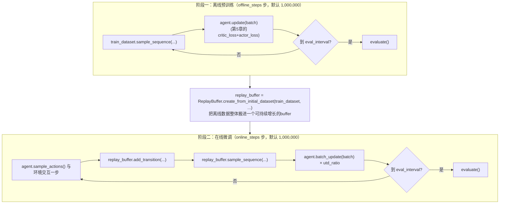
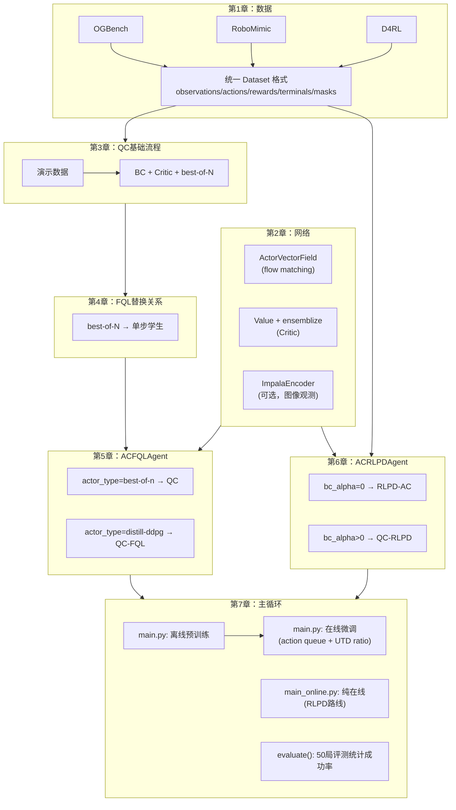

# 训练主循环、评测与复现实验

> 前情提要：前六章已经讲完数据与网络、QC 基础流程、FQL 替换关系、逐行实现，以及 RLPD 对照路线。本章是最后一块拼图：`main.py` / `main_online.py` 怎样把这些部件组织成真正运行的训练程序，以及怎样用 README 命令复现论文实验。

## 一、`main.py` 的两阶段主循环骨架

`main.py`（对应 QC/QC-FQL）严格分成两段：



**逐段拆开看代码。离线阶段：**

```python
for i in tqdm.tqdm(range(1, FLAGS.offline_steps + 1)):
    batch = train_dataset.sample_sequence(config['batch_size'], sequence_length=FLAGS.horizon_length, discount=discount)
    agent, offline_info = agent.update(batch)
    if i % FLAGS.log_interval == 0:
        logger.log(offline_info, "offline_agent", step=log_step)
    if i == FLAGS.offline_steps - 1 or i % FLAGS.eval_interval == 0:
        eval_info, _, _ = evaluate(agent=agent, env=eval_env, ...)
        logger.log(eval_info, "eval", step=log_step)
```

每一步：从固定的 `train_dataset` 里随机采一批"长度为 `horizon_length` 的连续动作块序列"（第 3 章已经解释它在整体流程中的作用），喂给 `agent.update`（第 5 章的完整 Critic+Actor 更新），定期跑一次评测。

**从离线到在线的过渡，这一步是两个阶段之间唯一的"桥梁"：**

```python
replay_buffer = ReplayBuffer.create_from_initial_dataset(
    dict(train_dataset), size=max(FLAGS.buffer_size, train_dataset.size + 1)
)
ob, _ = env.reset()
action_queue = []
```

把离线数据集的全部内容复制进一个新建的、更大容量的 `ReplayBuffer`（第 1 章讲过这个类支持持续 `add_transition`），并且重置环境、清空动作队列，为在线交互做准备。

**在线阶段，这是整个项目里代码密度最高的一段循环：**

```python
for i in tqdm.tqdm(range(1, FLAGS.online_steps + 1)):
    online_rng, key = jax.random.split(online_rng)

    if len(action_queue) == 0:
        action = agent.sample_actions(observations=ob, rng=key)
        action_chunk = np.array(action).reshape(-1, action_dim)
        for a in action_chunk:
            action_queue.append(a)
    action = action_queue.pop(0)

    next_ob, int_reward, terminated, truncated, info = env.step(action)
    done = terminated or truncated

    transition = dict(observations=ob, actions=action, rewards=int_reward,
                       terminals=float(done), masks=1.0 - terminated, next_observations=next_ob)
    replay_buffer.add_transition(transition)

    if done:
        ob, _ = env.reset()
        action_queue = []
    else:
        ob = next_ob

    if i >= FLAGS.start_training:
        batch = replay_buffer.sample_sequence(config['batch_size'] * FLAGS.utd_ratio,
                    sequence_length=FLAGS.horizon_length, discount=discount)
        batch = jax.tree.map(lambda x: x.reshape((FLAGS.utd_ratio, config["batch_size"]) + x.shape[1:]), batch)
        agent, update_info["online_agent"] = agent.batch_update(batch)
```

这里的 `batch` 是后续 **Critic 和 BC-flow 共同使用的 batch**。`actor_loss` 从中读取 `observations` 和连续 $h$ 步 `actions` 做 Flow Matching，不读取 reward；`critic_loss` 才读取 reward 和下一状态。由于这个 `ReplayBuffer` 由完整离线数据初始化、再追加 rollout transition，所以在线 BC 拟合的是离线与在线实际执行动作的经验混合分布，不是只克隆初始专家，也不是只克隆最新一轮 rollout，二者比例也没有固定成 50/50。

下面两节把这段代码里两个最关键的机制单独拎出来讲。

## 二、Action Queue：怎么把"一次决策 h 步"接到"环境一步步执行"上

**为什么需要这个机制**：`agent.sample_actions` 一次调用输出的是**整段 $h$ 步动作块**（第 2、3 章讲过，网络输出维度是 `action_dim * horizon_length`）。但 `env.step(action)` 每次只接受一个**单步**动作——物理仿真器不存在"喂一整块动作，自己拆开执行"的接口。`action_queue` 就是解决这个维度不匹配的中间层：

1. 队列空了 → 查询策略,拿到一整段 $h$ 步动作,`reshape(-1, action_dim)` 拆成 $h$ 个单步动作,依次放进队列
2. 队列不空 → 直接从队列头部弹出一个单步动作去执行,**不重新查询策略**
3. 一个 episode 结束（`done=True`）→ 清空队列,不把"属于上一个 episode 的剩余动作"带到下一个 episode

这正是 [Q-Chunking 精读第 1.3 节](/论文综述/071_QChunking_RL与动作分块#1.3-本文的核心洞察) "动作分块 + 开环执行"的字面含义——策略是低频决策（每 $h$ 步查询一次），执行是高频的（每步都要和环境交互），中间靠这个队列缓冲。

## 三、UTD Ratio：`jax.lax.scan` 怎么实现"一步交互，多次梯度更新"

```python
batch = jax.tree.map(lambda x: x.reshape((FLAGS.utd_ratio, config["batch_size"]) + x.shape[1:]), batch)
agent, update_info["online_agent"] = agent.batch_update(batch)
```

```python
@jax.jit
def batch_update(self, batch):
    agent, infos = jax.lax.scan(self._update, self, batch)
    return agent, jax.tree_util.tree_map(lambda x: x.mean(), infos)
```

**这在做什么**：先一次性采样出 `batch_size * utd_ratio` 条数据,`reshape` 出一个 `utd_ratio` 维度,`jax.lax.scan` 沿着这个维度循环调用 `_update`（也就是第 3、4 章讲的一次完整的 Critic+Actor 更新），每次循环用新的一份数据、把 agent 的新参数带入下一次循环。效果等价于每和环境交互 1 步，就做 `utd_ratio` 次独立的梯度更新——这是很多现代 off-policy 方法（包括 RLPD 本身）常用的加速训练手段：环境交互慢（尤其真实机器人），网络更新快，多做几次更新能更充分利用已有数据。[Q-Chunking 精读第 6.2 节](/论文综述/071_QChunking_RL与动作分块#6.2-消融:chunk-长度-critic-ensemble-utd-的影响) 的实验发现单纯提高 UTD 并不能带来和"分块"同等的效果提升,这正是通过这个机制跑出来的对照实验。

## 四、`main_online.py`：`ACRLPDAgent` 的主循环有什么不同

第 6 章讲过 `ACRLPDAgent` 离线数据和在线数据"各占一半"混合训练的机制，这里补充它在主循环结构上的另一处不同：**没有独立的离线预训练阶段**。

```python
replay_buffer = ReplayBuffer.create(example_batch, size=FLAGS.buffer_size)   # 从空的开始，不搬入离线数据
ob, _ = env.reset()
for i in tqdm.tqdm(range(1, FLAGS.online_steps + 1)):
    if len(action_queue) == 0:
        if i <= FLAGS.start_training:
            action = jax.random.uniform(key, shape=(action_dim,), minval=-1, maxval=1)   # 纯随机探索
        else:
            action = agent.sample_actions(observations=ob, rng=key)
        ...
```

两处区别一次看清：

1. `replay_buffer` 从**空**的创建（`ReplayBuffer.create`），不像 `main.py` 那样把离线数据"搬进去"——离线数据只存在于独立的 `train_dataset` 里，永远单独采样（第 6 章第五节讲过的"各占一半"机制）
2. `start_training` 之前用**纯随机动作**探索（`jax.random.uniform`），而不是调用策略网络——这是因为 `ACRLPDAgent` 没有离线预训练阶段,策略网络此刻还完全没训练过,不如直接随机探索来快速填充 replay buffer

这个设计对应 README 里 RLPD-AC/QC-RLPD 只有一条启动命令（用 `main_online.py`），而 QC/QC-FQL 需要先跑完离线阶段才进入在线阶段（`main.py` 内部自动完成过渡，命令本身不需要分两次跑）。

## 五、`evaluate` 函数：怎么衡量一个 agent 好不好

```python
def evaluate(agent, env, num_eval_episodes=50, num_video_episodes=0, action_dim=None, ...):
    actor_fn = supply_rng(agent.sample_actions, rng=jax.random.PRNGKey(np.random.randint(0, 2**32)))
    for i in trange(num_eval_episodes + num_video_episodes):
        observation, info = env.reset()
        action_queue = []
        done = False
        while not done:
            action = actor_fn(observations=observation)
            if len(action_queue) == 0:
                action_chunk = np.array(action).reshape(-1, action_dim)
                for a in action_chunk:
                    action_queue.append(a)
            action = action_queue.pop(0)
            next_observation, reward, terminated, truncated, info = env.step(np.clip(action, -1, 1))
            done = terminated or truncated
            ...
    for k, v in stats.items():
        stats[k] = np.mean(v)
    return stats, trajs, renders
```

**这个函数在做什么**：跑固定局数（默认 50 局）的完整 episode，**同样用了 action queue 机制**（和在线训练时的执行方式完全一致，保证评测和训练用的是同一种"决策频率"），把每一局的统计信息（来自环境 `info` 字典，通常包含"是否成功""归一化回报"等）收集起来，最后取平均。`supply_rng` 是一个小的包装函数,每次调用前自动切分一个新的随机种子——因为 JAX 要求随机性必须显式管理，不能像其他框架一样有一个全局隐式的随机数生成器状态。

**`num_video_episodes`**：如果设成大于 0，会额外跑几局并录制视频帧（`env.render()`），这些局不计入统计指标（`if i < num_eval_episodes` 才会被记入 `stats`），纯粹用来生成可视化结果。

## 六、怎么用 README 命令复现实验：逐个参数对照

回到 README 给出的复现命令，现在可以逐个参数讲清楚它在改什么：

```bash
# QC
python main.py --agent.actor_type=best-of-n --agent.actor_num_samples=32 \
    --env_name=cube-triple-play-singletask-task2-v0 --sparse=False --horizon_length=5
```

| 参数 | 对应本系列哪一章 | 含义 |
|------|------|------|
| `--agent.actor_type=best-of-n` | 第 5 章第一节 | 走 QC 分支（采样+挑选），不是 QC-FQL |
| `--agent.actor_num_samples=32` | 第 5 章第三节 | best-of-N 的 $N=32$ |
| `--env_name=...` | 第 1 章第二节 | 选择 OGBench 的 `cube-triple` 任务、第 2 个子任务 |
| `--sparse=False` | `main.py` 里 `process_train_dataset` 函数 | 是否把奖励转换成稀疏形式（`(rewards != 0) * -1`），`False` 表示用原始的稠密奖励 |
| `--horizon_length=5` | 第 2、3 章反复出现的 $h$ | 分块长度 |

```bash
# BFN-n（消融：n步回报但不分块）
python main.py --agent.actor_type=best-of-n --agent.actor_num_samples=4 \
    --env_name=... --horizon_length=5 --agent.action_chunking=False
```

`--agent.action_chunking=False` 是第 2 章第四节提到的关键开关——网络的动作维度不再是 `action_dim * horizon_length`，退化成普通的单步动作维度，但 Critic 的 TD 目标仍然用 `horizon_length` 步的累积奖励（`main.py`/`agents/acfql.py` 里 `critic_loss` 用 `batch["actions"][..., 0, :]` 只取第一步动作，但 `discount ** horizon_length` 这个折扣幂次不变）——这就是[Q-Chunking 精读第二节](/论文综述/071_QChunking_RL与动作分块#2.1-回顾问题:朴素-n-步回报为什么有偏) 讨论的"朴素 n 步回报"消融对照,专门用来验证"是分块本身有效,还是仅仅多看几步奖励就有效"。

```bash
# RLPD-AC
python main_online.py --horizon_length=5 --env_name=...
```

这条命令走 `main_online.py`，自动对应 `ACRLPDAgent`（第 6 章），`--agent.bc_alpha` 不设置时用默认值 `0.0`——纯 RLPD-AC，没有 BC 约束。

```bash
# QC-RLPD
python main_online.py --horizon_length=5 --agent.bc_alpha=0.01 --env_name=...
```

只多了一个 `--agent.bc_alpha=0.01`，就是第 6 章第四节讲的那一行极大似然 BC 惩罚项被打开的 QC-RLPD。

## 七、全系列回顾：一张图看清整个项目



到这里，这个系列把 [ColinQiyangLi/qc](https://github.com/ColinQiyangLi/qc) 这个仓库从"数据从哪来"到"怎么跑出论文里的实验数字"完整走了一遍。如果还想继续深入，[Q-Chunking 论文精读](/论文综述/071_QChunking_RL与动作分块) 第五、六节有更详细的实验设计和结果分析，可以对照本章的 `evaluate` 机制理解这些结果具体怎样跑出来。
