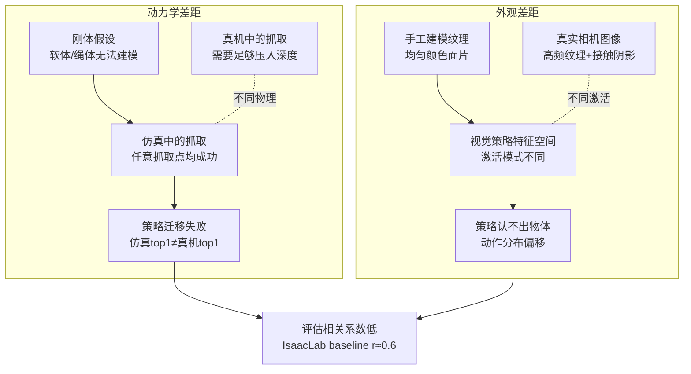
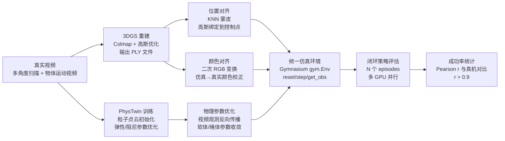

# 第一章：真机评测的成本墙

本章的目标是量化真机评测的实际代价，并说明现有仿真方案为什么无法填补这个缺口，从而确立 real2sim-eval 要解决的核心问题。

---

**知识链接**

- [Sim-to-Real 迁移综述](/论文综述/S04_Sim_to_Real迁移综述) — 提供 domain randomization 和 system identification 的历史背景
- [前置知识：3D Gaussian Splatting 三维场景重建](/前置知识/007a_前置知识_3D_Gaussian_Splatting三维场景重建) — 本系列外观子系统的技术基础
- PhysTwin — 可变形物体的神经物理仿真器，本系列动力学子系统的核心

---

## 一 真机评测为什么是瓶颈

机器人策略训练结束后，最终需要一个"这个策略能不能用"的答案。真机是目前最权威的评判者，但它的代价在多个环节上都难以接受。

下表逐环节列出真机评测的典型做法与问题：

| 评测环节 | 真机做法 | 成本与问题 |
|---|---|---|
| 任务复位 | 操作员手动把物体摆回初始状态 | 每个 episode 需要 30–120 秒人工介入，无法批量并行 |
| 单次 rollout | 机器人执行完整任务序列 | 1 个 episode 通常需要 30–120 秒机器人时间 |
| 成功率统计 | 重复 N 次取均值，N≥20 才有统计意义 | N=20 次 × 每次 2 分钟 = 约 40 分钟纯机器时间，不计复位 |
| 磨损与故障 | 软体任务中抓取失败可能损坏夹具或物体 | 每次故障需要维修窗口，评测流程中断 |
| checkpoint 选择 | 训练过程中产生数十个 checkpoint | 只有极少数能送上真机，选择本身存在高风险 |
| 分布测试 | 需在多种初始姿态下评估鲁棒性 | 每种姿态都需要独立的 episode 序列，乘数效应使成本爆炸 |

**量化一个典型训练流程的评测开销：** 假设策略训练 1 万步，每 500 步做一次评测，共 20 个评测点。每个评测点统计 20 个 episode，每个 episode 包含任务执行（约 60 秒）和手动复位（约 45 秒），则：

$$20 \text{ 个评测点} \times 20 \text{ episodes} \times (60 + 45) \text{ 秒} = 42000 \text{ 秒} \approx 11.7 \text{ 小时}$$

这还只算了一条训练曲线。如果需要对比 3 种超参数配置，真机时间直接翻三倍，达到 35 小时以上。在每天机器人可用窗口约 8 小时的实验室中，这意味着超过 4 天的纯评测时间——而这期间训练本身早已完成，研究进度被评测卡死。

**机器人基础模型时代的挑战加剧了这一矛盾。** 基础模型训练产生的 checkpoint 数量不是 20 个，而是 100–500 个。研究者需要用这些 checkpoint 回答的问题也更复杂：不只是"哪个最好"，还包括"在哪个训练阶段出现能力涌现"、"哪些技能先学会"、"微调对通用能力的影响曲线"。这些问题在真机上根本无法以合理的代价回答。举个具体例子：一项基础模型实验产生 500 个 checkpoint，真机资源只允许评测 15 个；研究者必须在不看数据的情况下决定挑哪 15 个，这个决策本身就是巨大的科学风险。仿真如果能在这 500 个 checkpoint 里准确找出最优的 Top-5，再把这 5 个送上真机确认，整个科学循环才能合理运转。

## 二 现有仿真器为什么不够用

仿真评测并非新思路，IsaacLab、MuJoCo、PyBullet 都提供了可以运行策略的环境。它们的问题不是"不存在"，而是"仿真成功率和真机成功率之间的相关系数太低"。相关系数低意味着仿真排名第一的策略在真机上可能排名第五，仿真评测完全失去了筛选价值。

相关系数低来自两个方向的差距，以及一个被忽视的评估协议问题。

### 动力学差距：刚体假设的边界

传统物理仿真器（包括 IsaacLab、MuJoCo）以刚体动力学为核心。对于金属工件、塑料块、木制积木，这个假设成立得很好。但机器人操作任务里有大量非刚体物体：

- **软体**：毛绒玩具、海绵、布料、硅胶件。它们在被抓取时会变形，抓取点和形变模式对成功率有关键影响。IsaacLab 的刚体毛绒玩具在任何抓取方式下都保持形状不变，策略在仿真里只需要"触碰"即成功，而真机上夹具必须压入足够深度才能稳定抓取。
- **绳状物体**：线缆、绳子、橡皮管。它们的构型空间是无限维的，刚体关节链只能做粗糙近似。一个"绳子穿孔"任务在刚体仿真中绳子形态固定，策略学到的是固定构型下的精确坐标操作；真机上绳子形态每次略有不同，策略完全无法泛化。

### 外观差距：手工建模的纹理与光照鸿沟

传统仿真器的视觉渲染由手工创建的 CAD 模型和程序化材质驱动。这个过程有三个系统性缺陷：

**第一，纹理细节缺失。** 真实毛绒玩具的表面有复杂的高频纹理，会在视觉策略的 feature 空间里产生特定的激活模式。手工建模的均匀颜色面片激活的是完全不同的 feature，策略看到"陌生物体"，动作分布偏移。

**第二，光照模型过于理想。** Maya/Blender 渲染器使用全局点光源，没有接触阴影、环境遮挡、次表面散射。真实相机图像里这些效果都存在，而且它们恰恰是视觉策略判断深度和接触状态的重要线索。

**第三，背景与场景构成不同。** 真机实验台有特定的桌面纹理、侧面障碍物、固定光源的位置。手工搭建一个视觉上完全相同的仿真场景需要数周的美术工作，而且每次真机布置有细微变化时就需要重做。

### 腕部相机的特殊挑战

现代机器人策略越来越依赖**腕部相机（wrist camera）**——安装在末端执行器附近的相机，它随着机器人运动，视角从机器人内部看向目标物体。腕部相机的视角让外观差距问题在现有解决方案中变得更难处理：

常见的缩小外观差距方案之一是**绿幕合成（green screen compositing）**：把真实场景的背景图像合成进仿真渲染里，这样至少背景部分与真实一致。但这个方法对腕部相机完全失效——腕部相机看到的不是固定背景，而是动态变化的目标物体、机器人本体局部（如夹具内侧）、以及随机器人运动而变化的相对视角。没有固定背景可以合成，绿幕方案无从下手。

这三个问题——软体动力学不准确、外观渲染不真实、腕部相机无法绿幕合成——共同导致了现有仿真器的相关系数低下。

图中两条因果链各自独立，但最终汇聚到同一个结果：仿真评估的相关系数低，仿真排名无法指导真机实验。

## 三 real2sim-eval 的核心思路

real2sim-eval 的答案是：**不要手工建模，从真实视频里重建一切。** 外观从真实场景的 3D 扫描中来，动力学参数从真实物体运动的视频中拟合出来。

**外观子系统**用 3D Gaussian Splatting（3DGS）从多角度视频重建场景。重建结果是一个 PLY 文件，包含数十万个三维高斯基元，每个基元携带位置、形状、颜色（球谐系数）和不透明度。这些高斯点在任意视角下可以实时光栅化成照片级图像，不需要手工建模，不需要美术工作，只需要一段围绕场景拍摄的视频。

**动力学子系统**用 PhysTwin 从真实物体的运动视频中拟合物理参数。PhysTwin 把物体表示为粒子点云，用一个神经网络模拟粒子间的弹性力和阻尼力。它的参数不是手工设置的，而是通过视频观测反向优化出来的：给 PhysTwin 看毛绒玩具被压缩时的真实变形视频，它会调整刚度和阻尼参数直到仿真变形曲线与真实视频匹配。

两个子系统通过一个**共享粒子状态**连接：PhysTwin 推进粒子点云的位置，外观子系统把每个高斯基元绑定到最近的粒子上，粒子移动时高斯跟着移动，渲染图像随之更新。这个设计使得物理仿真和视觉渲染在每一帧都保持同步，策略看到的图像始终反映当前的物理状态。

**三个任务作为验证锚点：**

- **plush toy packing（软体任务）**：把毛绒玩具装进箱子。软体变形是关键难点，IsaacLab 在这个任务上与真机相关系数约为 0.55。
- **rope routing（绳状物体任务）**：把绳子穿过指定路径。绳子构型变化复杂，传统仿真完全无法建模。
- **T-block pushing（刚体任务）**：推动 T 形积木到目标位置。这是一个外观差距为主要挑战的任务，动力学相对简单。

real2sim-eval 在三个任务上的 Pearson 相关系数均超过 0.9，而 IsaacLab 基线在三个任务上的平均相关系数约为 0.62。这个差距意味着：如果用 real2sim-eval 从 20 个 checkpoint 里选出 Top-3，有极高概率这 Top-3 在真机上也排名靠前；而用 IsaacLab 做同样的选择，仿真排名和真机排名之间几乎是噪声关系。

## 四 整体框架预览

下图展示 real2sim-eval 的完整数据流 pipeline，从真实视频的录制到最终的成功率统计。

pipeline 的两条主线——外观（左侧：GS重建→位置对齐→颜色对齐）和动力学（右侧：PhysTwin训练→物理参数优化）——在"统一仿真环境"节点汇合。Gymnasium 接口把两个子系统封装成标准的 `reset/step/get_obs` 循环，任何兼容 gym 接口的策略都可以直接插入评估，无需修改策略代码。

后续各章沿着这条 pipeline 逐节展开：第 2 章讲整体框架和接口设计，第 3、4 章深入外观子系统，第 5 章深入动力学子系统，第 6 章处理腕部相机这个特殊观测模式，第 7 章讲闭环评估的实现细节，第 8 章用三个任务的数据量化验证整个框架的效果。
