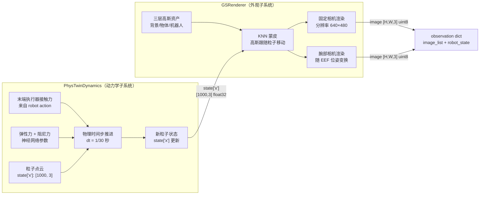

# 第二章：框架全景与流水线总览

本章从系统架构的角度俯瞰 real2sim-eval 的全貌：两个子系统如何分工、如何通过共享状态交互，Gymnasium 接口如何把它们封装成标准评估循环，以及多 GPU 并行评估和 Hydra 配置系统如何支撑大规模实验。

---

**知识链接**

- [第 1 章：真机评测的成本墙](/系列/real2sim_eval_deep_dive/01_真机评测的成本墙) — 本章架构设计的动机来源
- [前置知识：3D Gaussian Splatting 三维场景重建](/前置知识/007a_前置知识_3D_Gaussian_Splatting三维场景重建) — 外观子系统的技术基础
- [Sim-to-Real 迁移综述](/论文综述/S04_Sim_to_Real迁移综述) — 本框架在更大研究图景中的位置

---

## 一 两个子系统的分工

real2sim-eval 的核心架构由两个子系统构成：**GSRenderer**（外观子系统）和 **PhysTwinDynamics**（动力学子系统）。两者的职责边界清晰：GSRenderer 只负责"看起来像什么"，PhysTwinDynamics 只负责"物理上怎么运动"。

**GSRenderer** 持有场景的 3DGS 表示——背景、物体、机器人三层高斯资产的集合。它的工作是：给定当前时刻所有高斯基元的位置和朝向，从指定相机视角渲染出一张 RGB 图像。它不知道物体为什么在那个位置，也不参与物理计算；它只负责把"当前高斯状态"映射到"当前像素图像"。

**PhysTwinDynamics** 持有物体的粒子点云表示。它的工作是：给定当前粒子状态和施加的外力（来自机器人末端执行器），推进一个物理时间步，输出下一时刻的粒子状态。它不知道场景看起来什么样，也不参与渲染；它只负责把"当前物理状态"推进到"下一物理状态"。

两个子系统的交互通过**共享粒子状态** `state['x']`（形状为 `[1000, 3]` 的 3D 坐标张量）完成：

- PhysTwinDynamics 在每个时间步后更新 `state['x']`
- GSRenderer 读取 `state['x']`，用 KNN 蒙皮把数十万个高斯基元的位置更新到与粒子一致的位置，再执行渲染

这个设计使得两个子系统可以完全独立开发和测试：只要 `state['x']` 的格式不变，可以换不同的物理后端，也可以换不同的渲染方案，不影响对方。



两个子系统之间的数据接口非常薄：只有 `state['x']`，一个 `[1000, 3]` 的浮点张量。这种薄接口是设计上的刻意选择——它允许对两个子系统分别进行单元测试，也允许在不触碰对方代码的情况下替换任一子系统的实现。

## 二 Gymnasium 环境接口

real2sim-eval 把整个仿真环境封装为标准的 `gym.Env` 子类，对外只暴露三个方法：`reset()`、`step(action)`、`get_obs()`。任何遵循 Gymnasium 接口的策略代码都可以直接插入，不需要了解 3DGS 或 PhysTwin 的任何内部细节。

### reset()：初始化场景

`reset()` 完成以下工作，按顺序执行：

1. 从配置中选取本 episode 的初始状态编号（由 `episode_id` 决定初始物体位姿的网格采样点）
2. 加载对应的 3DGS 资产（背景 PLY + 物体 PLY + 机器人 PLY），拼合为完整的 `rendervar` 字典
3. 初始化 PhysTwin 的粒子点云到初始静止状态（从预先扫描得到的参考点云加载）
4. 把机器人关节角度重置到 home 位置
5. 调用 `get_obs()` 生成第一帧观测，作为 `reset()` 的返回值

其中步骤 2 和步骤 3 的初始化顺序不能颠倒：必须先有 `rendervar`（高斯基元数据），再初始化粒子点云，才能确保 KNN 蒙皮绑定关系在第一帧就建立正确。

### step(action)：推进一个仿真步

`step()` 是整个环境的核心循环。它接收策略输出的动作（末端执行器的目标位姿 delta），执行如下流程：

```python
def step(self, action):
    # 1. 把策略动作转换为末端执行器目标位姿
    delta_pos, delta_rot, gripper_cmd = self._parse_action(action)
    
    # 2. 用逆运动学求解关节角度，更新机器人状态
    self.robot_state = self._ik_step(delta_pos, delta_rot)
    
    # 3. 计算末端执行器与粒子点云之间的接触力
    contact_forces = self._compute_contact(
        self.robot_state['eef_pos'],
        self.phystwin.state['x']
    )
    
    # 4. PhysTwin 推进一个物理时间步
    #    输入：当前粒子状态 + 接触力
    #    输出：新粒子状态（修改 self.phystwin.state['x'] in-place）
    self.phystwin.step(contact_forces)
    
    # 5. 更新高斯渲染变量：把高斯基元位置同步到新粒子状态
    #    这一步执行 KNN LBS 蒙皮，是连接两个子系统的关键
    self.gs_renderer.update_rendervar(self.phystwin.state['x'])
    
    # 6. 更新机器人高斯的位置（根据新的关节角度重新变换）
    self.gs_renderer.update_robot_gaussians(self.robot_state['joint_angles'])
    
    # 7. 生成当前步的观测、奖励和终止信号
    obs = self.get_obs()
    reward = self._compute_reward()
    done = self._check_termination()
    
    return obs, reward, done, {}
```

步骤 3（接触力计算）是动力学准确性的关键：接触力的大小和方向由末端执行器的位置与粒子点云的距离决定，夹具越深入物体，接触力越大，反力使粒子向外推动，模拟被抓取时物体的压缩变形。步骤 5（`update_rendervar`）是外观准确性的关键：它把 PhysTwin 推进的新粒子状态传递给渲染器，保证每一帧的渲染图像都反映当前的物理形变。

### get_obs()：生成多视角观测

`get_obs()` 从两个视角各渲染一张图像，并打包成策略期望的观测格式：

- **固定相机（overhead/side camera）**：相机参数固定，每次调用从相同视角渲染，得到整个工作区的鸟瞰或侧视图
- **腕部相机（wrist camera）**：相机位姿跟随当前末端执行器位姿实时变换，渲染"从机器人内部看向目标"的视角

两张图像加上机器人状态向量（关节角度 + 末端执行器位姿）打包成 `obs` 字典：

```python
obs = {
    'image_list': [overhead_img, wrist_img],  # List[np.ndarray (H,W,3)]
    'robot_state': {
        'joint_angles': ...,    # [7] float32，弧度
        'eef_pos': ...,         # [3] float32，世界坐标系
        'eef_quat': ...,        # [4] float32，四元数
        'gripper_width': ...,   # [1] float32，米
    }
}
```

这个格式与真机评测时策略接收的观测格式完全一致，确保同一个策略代码可以无缝在仿真和真机之间切换。

## 三 状态表示：粒子点云是什么

PhysTwin 用粒子点云表示可变形物体的状态。`state['x']` 是一个形状为 `[1000, 3]` 的张量，存储 1000 个"代表性点"在世界坐标系下的三维坐标。

这 1000 个点不是随机采样的——它们是从物体表面的 3DGS 点云中通过最远点采样（Farthest Point Sampling，FPS）选出的代表性子集，在空间上均匀覆盖物体的几何形状。FPS 保证了每个代表性点之间的间距尽量均匀，避免某个区域点密度过高（浪费表达力）而另一个区域完全没有代表点（物理驱动缺失）。

**为什么是 1000 个而不是全部高斯点？**

一个典型的 3DGS 重建物体有 50,000–200,000 个高斯基元。如果把所有高斯基元都作为 PhysTwin 的粒子，有两个问题：

- **计算成本**：PhysTwin 的物理推进步骤需要计算粒子间的弹性力矩阵，复杂度与粒子数的平方成正比。1000 个粒子需要 10^6 次力计算，200,000 个粒子需要 4×10^10 次——慢 40,000 倍，完全不可实时。
- **信息冗余**：高斯基元的密度在视觉上很重要（高频纹理区域需要更多高斯），但对物理形变不重要。软体的弹性变形是低频的，1000 个均匀分布的控制点足以捕捉所有物理上显著的形变模式。

1000 个粒子作为"骨架"控制点，其余 199,000 个高斯基元通过 KNN 蒙皮跟随最近的控制点运动。这是一个精度与效率之间的经过验证的权衡点：第 4 章会展示 KNN 蒙皮的具体实现和它带来的视觉误差量级。

## 四 多 GPU 并行评估设计

评估一个策略需要统计 200 个 episode 的成功率才有足够的置信区间（标准误差 < 3.5%）。单 GPU 顺序评估 200 个 episode 需要约 2 小时；8 GPU 并行可以压缩到 15 分钟，使得在训练过程中频繁评估成为可能。

`eval_policy_parallel.py` 的分发逻辑是标准的进程级数据并行：

```
总 episode 数 = 200
GPU 数 = 8
每个 GPU 负责的 episode = [0..24], [25..49], ..., [175..199]

每个 GPU：
  - 创建独立的 gym.Env 实例（独立的 CUDA context）
  - 加载独立的策略模型副本到该 GPU
  - 顺序执行分配到的 25 个 episode
  - 把成功/失败结果写入共享内存或临时文件

主进程：
  - 等待所有 GPU 进程结束
  - 汇总 200 个 episode 的结果，计算成功率
```

**为什么这样设计是安全的（无竞争条件）：**

每个进程拥有独立的 CUDA context，独立的 GPU 显存空间，独立的 gym.Env 实例。进程之间没有任何共享的可写状态——3DGS 的 `rendervar` 张量在每个进程内各有一份副本，PhysTwin 的粒子状态在每个进程内也各有一份。唯一的进程间通信是最终写入文件的成功/失败标量，这发生在每个 episode 结束后，不存在并发写入问题。

**实际加速比估算：**

假设单个 episode 仿真耗时 30 秒（100 步 × 每步 0.3 秒），200 个 episode 顺序执行需要 100 分钟。8 GPU 并行后，每个 GPU 处理 25 个 episode，耗时 12.5 分钟，加速比约为 8×。实际测量中由于进程启动和资源加载的开销（约 2–3 分钟），加速比约为 6–7×，总评估时间约 15–18 分钟。

这个加速比使得"每 500 训练步做一次评估"成为现实：500 步训练约需 30–60 分钟，评估的 15 分钟开销在整个训练时间线上只占 20–30%，可以接受。

## 五 Hydra 配置系统

real2sim-eval 使用 Hydra 管理配置，所有参数组织成五个子树：

| 子树 | 管理内容 | 关键参数 |
|---|---|---|
| `env` | 任务名、episode 数量、初始状态分布 | `task_name`, `n_episodes`, `use_grid_randomization` |
| `gs` | GS 资产路径、分辨率、背景/物体/机器人 PLY 文件路径 | `background_ply`, `object_ply`, `robot_ply`, `render_width` |
| `physics` | PhysTwin 模型路径、物理参数（弹性系数、阻尼系数）、时间步 | `model_ckpt`, `stiffness`, `damping`, `dt` |
| `policy` | 策略 checkpoint 路径、推理设备、动作空间类型 | `ckpt_path`, `device`, `action_type` |
| `renderer` | 相机内参、颜色对齐系数文件路径 | `camera_intrinsics`, `color_align_coeffs` |

通过命令行 override，切换到不同任务只需要改变 `gs` 和 `physics` 子树：

```bash
# 评估绳子任务的第 42 个 checkpoint，使用 8 GPU 并行，每 GPU 25 个 episode
python eval_policy_parallel.py \
    gs=rope_routing \
    physics=rope_routing \
    policy.ckpt_path=/checkpoints/rope/step_042000.ckpt \
    env.n_episodes=200 \
    env.n_gpus=8 \
    env.task_name=rope_routing \
    renderer.color_align_coeffs=configs/color_align/rope_routing.npy
```

逐参数解释：

- `gs=rope_routing`：加载 `configs/gs/rope_routing.yaml`，其中定义了绳子任务的 PLY 文件路径和场景尺寸
- `physics=rope_routing`：加载 `configs/physics/rope_routing.yaml`，其中定义了绳子的弹性/阻尼参数和对应的 PhysTwin checkpoint
- `policy.ckpt_path`：直接指定要评估的策略 checkpoint，训练过程中可以用脚本批量枚举所有 checkpoint
- `env.n_episodes=200`：总评估 episode 数，决定成功率估计的置信区间
- `env.n_gpus=8`：并行进程数，框架会自动把 200 个 episode 均分到 8 个进程
- `renderer.color_align_coeffs`：颜色对齐系数文件，不同任务/场景光照不同，需要各自拟合的系数

Hydra 的 multirun 功能可以进一步批量化 checkpoint 扫描：

```bash
# 扫描 step_010000 到 step_100000 之间每隔 10000 步的所有 checkpoint
python eval_policy_parallel.py \
    gs=rope_routing \
    physics=rope_routing \
    "policy.ckpt_path=glob(/checkpoints/rope/step_0[1-9]0000.ckpt)" \
    env.n_episodes=200 \
    --multirun
```

这条命令会顺序启动 9 次评估（每次 15–18 分钟），总计 2.5–3 小时内扫描完整个训练过程中的 9 个关键 checkpoint，输出完整的训练曲线。在真机上完成同样的扫描需要超过 70 小时的机器人时间，差距约为 25×。
