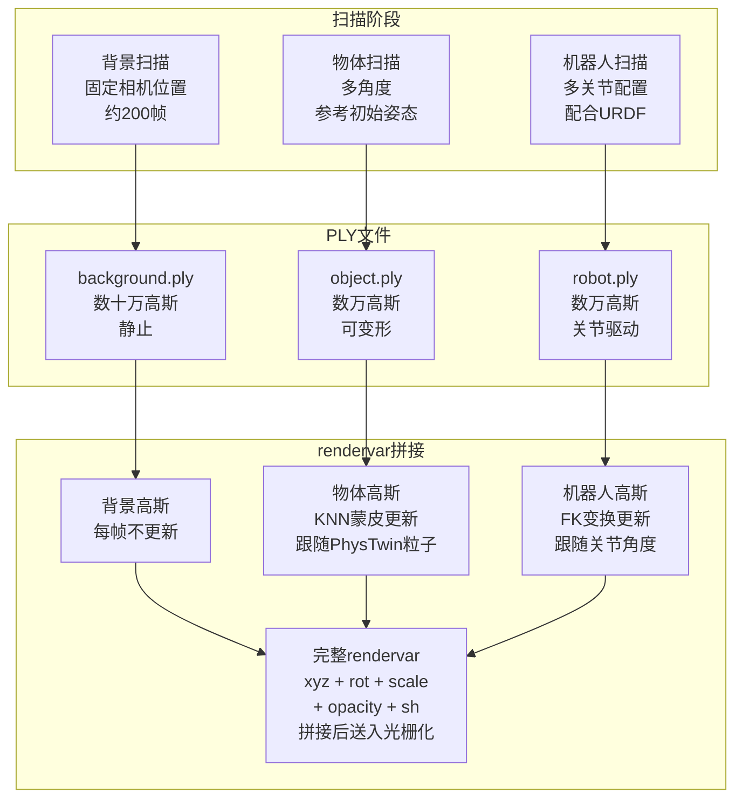
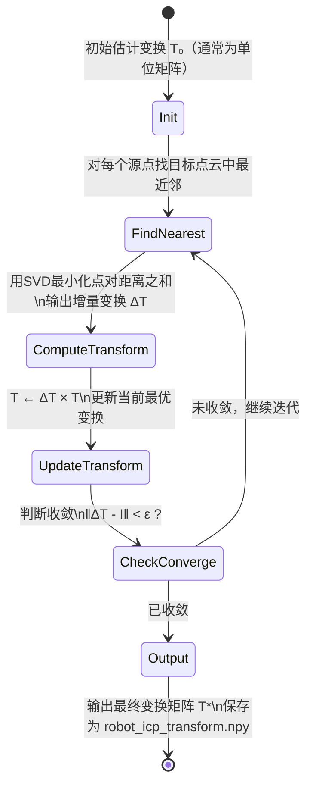

# 第三章：3DGS资产构建与场景扫描

本章讲解 real2sim-eval 的外观子系统输入端：如何从真实场景的多角度视频中构建可驱动的 3DGS 资产，以及如何处理背景、物体、机器人三类资产各自的特殊需求。

---

**知识链接**

- [前置知识：3D Gaussian Splatting 三维场景重建](/前置知识/007a_前置知识_3D_Gaussian_Splatting三维场景重建) — 覆盖高斯表示、球谐系数、可微光栅化；本章假设读者已了解这些基础
- [第 2 章：框架全景与流水线总览](/系列/real2sim_eval_deep_dive/02_框架全景与流水线总览) — 本章构建的资产在 GSRenderer 中的使用方式

---

## 一 高斯溅射是什么（在这里的用途）

3DGS 把三维场景表示为数十万个三维高斯基元的集合，每个基元携带位置、形状（协方差椭球）、不透明度和视角相关颜色（球谐系数）。详细原理见前置知识文章；在 real2sim-eval 里使用它的理由有三点：

**PLY 文件格式**：重建结果存储为标准 PLY 点云文件，每个高斯基元对应一行属性记录。这个格式易于读写，可以用标准点云库处理，也便于对不同资产（背景、物体、机器人）分别扫描后合并到同一场景。

**实时光栅化**：3DGS 使用 GPU 光栅化管线，在 2080Ti 上可以 30fps 以上渲染 640×480 分辨率图像，满足策略评估的实时需求。传统 NeRF 需要每像素多次 MLP 推理，同分辨率下慢 10–50 倍。

**任意视角渲染**：一次重建后，任意相机位姿下都可以渲染，包括腕部相机随机器人运动变化的动态视角。手工建模同样可以做到这一点，但重建精度远高于手工建模。

## 二 资产分层：背景 vs 物体 vs 机器人

场景被分为三类资产，分层处理是因为它们的"动静"属性完全不同。

**背景（table_splat）**：桌面、墙壁、固定障碍物。整个评估过程中完全静止。扫描时围绕整个工作台拍摄约 200 帧视频，用 Colmap 估计相机位姿，再训练 3DGS。训练完成后 PLY 文件加载一次，此后只读，不需要任何更新。

**物体（object splat）**：毛绒玩具、绳子、T 形积木。静止时扫描（在参考初始姿态下），但仿真过程中由 PhysTwin 驱动变形或移动。物体高斯基元需要在每个仿真步后根据 PhysTwin 粒子位置更新，第 4 章详细描述这个更新机制（KNN 蒙皮）。

**机器人（robot splat）**：Franka Panda 机械臂本体（包含夹具）。机器人不由 PhysTwin 驱动，而是根据关节角度通过正向运动学（FK）计算每个连杆的变换，再把对应高斯基元变换到新位置。



`rendervar` 是送入 3DGS 光栅化器的输入字典，它把三类资产的高斯属性沿第一维（高斯基元数量维度）拼接成单一张量。光栅化器一次处理所有高斯基元，不区分它们属于哪类资产——分层只在更新阶段有意义，渲染阶段是统一的。

## 三 GSProcessor：PLY 文件的加载与解析

`gs_processor.py` 的 `load()` 方法把 PLY 文件读入 GPU 张量，并组装成 `rendervar` 字典。PLY 文件里每一行代表一个高斯基元，存储以下属性：

| 属性名 | 维度 | 含义 |
|---|---|---|
| `x, y, z` | 3 | 高斯中心在世界坐标系下的三维位置 |
| `f_dc_0, f_dc_1, f_dc_2` | 3 | 0 阶球谐系数（基础颜色，与视角无关） |
| `f_rest_0` … `f_rest_44` | 45 | 1–3 阶球谐系数（视角相关颜色变化） |
| `opacity` | 1 | 不透明度的 logit 值（sigmoid 后得到 [0,1] 不透明度） |
| `scale_0, scale_1, scale_2` | 3 | 三轴缩放的 log 值（exp 后得到实际缩放） |
| `rot_0, rot_1, rot_2, rot_3` | 4 | 旋转四元数（wxyz 格式） |

**为什么有 48 个球谐系数（3 个 DC + 45 个 rest）：** 球谐函数按阶数展开，第 $l$ 阶有 $2l+1$ 个基函数。0 阶 1 个，1 阶 3 个，2 阶 5 个，3 阶 7 个，共 16 个基函数。RGB 三通道各需要一套，共 16 × 3 = 48 个系数。其中 0 阶（DC 项）的 3 个系数单独存储为 `f_dc_0/1/2`，其余 45 个存储为 `f_rest_0` 到 `f_rest_44`。4 阶以上的球谐项在视觉上贡献极小，训练时通常不用。

加载后的 `rendervar` 字典结构如下：

```python
rendervar = {
    # 高斯中心位置，形状 (N, 3)，float32，世界坐标系，单位米
    'means3D': torch.Tensor,
    
    # 颜色球谐系数，形状 (N, 16, 3)
    # 第一维 N：高斯基元数量
    # 第二维 16：球谐基函数数量（0-3 阶共 16 个）
    # 第三维 3：RGB 通道
    'colors_precomp': None,   # 不预计算，由光栅化器动态求值
    'shs': torch.Tensor,      # 形状 (N, 16, 3)，直接传给光栅化器
    
    # 不透明度，形状 (N, 1)，float32，已经过 sigmoid，值域 [0, 1]
    'opacities': torch.Tensor,
    
    # 三轴缩放，形状 (N, 3)，float32，已经过 exp，单位米
    'scales': torch.Tensor,
    
    # 旋转四元数，形状 (N, 4)，float32，已归一化，wxyz 格式
    'rotations': torch.Tensor,
}
```

`load()` 在读取 PLY 原始值后会立即做三个数值变换：opacity 经过 sigmoid（把 logit 转为概率），scale 经过 exp（把 log 缩放转为实际长度），rotation 经过 L2 归一化（确保四元数是单位四元数）。这三个变换都是不可逆的——后续代码操作的永远是变换后的值，PLY 文件里存储 logit/log 格式是为了让训练时的梯度更稳定，不是渲染时的实际表示。

## 四 机器人高斯的构建：ICP 对齐

机器人高斯资产面临一个独特问题：用 Scaniverse 手持扫描仪扫描出的机器人点云，其坐标系与 URDF 文件里定义的关节坐标系不一致。URDF 描述的是各连杆在机器人本体坐标系下的几何形状和关节位置，而扫描得到的点云在扫描仪的世界坐标系下。如果不对齐，用 FK 计算出的连杆变换矩阵应用到高斯上会产生明显的位置错误。

ICP（Iterative Closest Point，迭代最近点）解决这个问题：它把扫描得到的高斯点云对齐到从 URDF 网格采样得到的参考点云，输出一个 4×4 刚体变换矩阵（旋转 + 平移），把扫描坐标系映射到 URDF 坐标系。



`construct_scene_gripper.py` 执行以下流程：

```python
def build_robot_gaussians(scan_ply_path, urdf_path, output_path):
    # 1. 从扫描点云中提取机器人区域
    #    用深度图或颜色阈值分割出机器人像素，反投影到 3D
    robot_scan_pts = extract_robot_region(scan_ply_path)
    
    # 2. 从 URDF 各连杆网格采样参考点云
    #    在 home 关节角度下，把每个连杆网格变换到世界坐标并采样
    urdf_ref_pts = sample_urdf_surface(urdf_path, home_joint_angles)
    
    # 3. ICP 对齐：把扫描点云对齐到 URDF 参考点云
    #    输出刚体变换矩阵 T_scan2urdf，形状 (4, 4)
    T_scan2urdf, _ = icp(robot_scan_pts, urdf_ref_pts, max_iter=100)
    
    # 4. 把变换矩阵应用到机器人高斯的 means3D 和 rotations
    #    means3D：直接乘变换矩阵（齐次坐标）
    #    rotations：提取旋转部分并用四元数乘法更新
    robot_gs = transform_gaussians(load_ply(scan_ply_path), T_scan2urdf)
    
    # 5. 保存对齐后的机器人高斯和变换矩阵
    save_ply(robot_gs, output_path)
    np.save(output_path.replace('.ply', '_T.npy'), T_scan2urdf)
```

ICP 对齐的精度决定了机器人高斯和虚拟机器人运动之间的视觉一致性。对齐误差超过 5mm 时，渲染图像里机器人连杆的位置与实际关节角度不符，策略会接收到"机器人去了它以为的位置，但图像显示没有"的矛盾信号，直接影响评估准确性。

## 五 随机化：初始状态的网格枚举

为了让成功率估计有足够的覆盖面，real2sim-eval 对物体的初始位姿进行系统性枚举，而不是随机采样。

`use_grid_randomization` 开关开启时，物体的初始状态由两个参数的笛卡尔积确定：
- **xy 位置**：在桌面有效区域内按固定间距划分网格，例如 5×5 = 25 个位置
- **朝向（yaw 角）**：按固定角度间隔枚举，例如每 45° 一个，共 8 个朝向

25 × 8 = 200 个组合，每个组合对应一个 episode。`episode_id` 直接映射到这个笛卡尔积的第 `episode_id` 个元素：

```python
def load_scaniverse(cfg, episode_id):
    """
    根据 episode_id 选取初始状态。
    
    网格参数（来自 cfg）：
      n_pos_x = 5    # x 方向位置数
      n_pos_y = 5    # y 方向位置数  
      n_yaw = 8      # 朝向数
    
    episode_id 的映射：
      总 episodes = n_pos_x * n_pos_y * n_yaw = 200
      episode_id ∈ [0, 199]
    """
    if cfg.use_grid_randomization:
        n_pos_x = cfg.grid.n_pos_x      # 5
        n_pos_y = cfg.grid.n_pos_y      # 5
        n_yaw   = cfg.grid.n_yaw        # 8
        
        # 把 episode_id 分解为三个维度的索引
        # true_index 就是 episode_id，直接用整除和取余分解
        ix    = episode_id // (n_pos_y * n_yaw)           # x 方向索引 [0,4]
        iy    = (episode_id % (n_pos_y * n_yaw)) // n_yaw # y 方向索引 [0,4]
        i_yaw = episode_id % n_yaw                        # 朝向索引 [0,7]
        
        # 把索引转换为实际的 xy 坐标和 yaw 角
        x   = cfg.grid.x_min + ix * cfg.grid.dx
        y   = cfg.grid.y_min + iy * cfg.grid.dy
        yaw = cfg.grid.yaw_min + i_yaw * cfg.grid.d_yaw
        
        return build_initial_state(x, y, yaw)
    else:
        # 随机模式：从预先录制的真实初始状态里选第 episode_id 个
        return load_recorded_state(cfg.recorded_states_path, episode_id)
```

`true_index = episode_id` 这行代码（注释在原版中存在）强调的是：在网格随机化模式下，episode 的编号和初始状态之间是一一对应的确定性映射，没有随机性。这保证了两个重要属性：

**评估可复现**：给定相同的策略和相同的 `episode_id`，每次运行结果相同（除了策略本身的随机性）。这使得不同策略之间的比较在完全相同的初始条件下进行。

**分布可控**：网格采样保证初始状态在有效工作空间内均匀分布，避免随机采样可能出现的聚集偏差（比如随机采样的 200 个点集中在工作空间的一个角落）。如果真机评测也使用同样的网格参数，仿真和真机的初始状态分布完全一致，消除了"评估协议差距"的一个重要来源。

**网格 vs 随机的对比**：随机采样的 200 个点不能事先知道哪些点会被选中，也不能保证空间覆盖均匀。网格的 200 个点可以事先枚举，可以对任意子集（例如只测中心区域或只测边缘区域）单独分析，便于做消融实验（"策略在哪些初始位姿上失败？"）。
