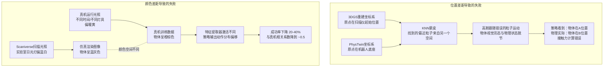
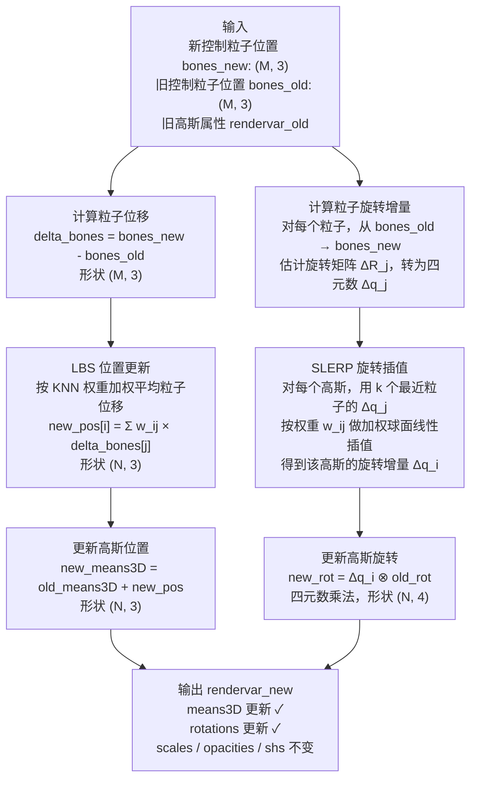

# 第四章：位置对齐与颜色对齐

本章讲解消除外观差距的两个关键步骤：让高斯基元跟随物理粒子运动的位置对齐，以及让渲染图像颜色与真实相机图像匹配的颜色对齐。

---

**知识链接**

- [第 3 章：3DGS 资产构建与场景扫描](/系列/real2sim_eval_deep_dive/03_3DGS资产构建与场景扫描) — 本章操作的高斯资产从那里加载
- [第 2 章：框架全景与流水线总览](/系列/real2sim_eval_deep_dive/02_框架全景与流水线总览) — 两种对齐在整体 pipeline 中的位置
- [前置知识：3D Gaussian Splatting 三维场景重建](/前置知识/007a_前置知识_3D_Gaussian_Splatting三维场景重建) — 高斯基元的位置和旋转表示

---

## 一 两类对齐的作用

**位置对齐的失败后果**：高斯基元在 PLY 文件里的初始坐标来自 3DGS 重建，物理粒子的初始坐标来自 PhysTwin 初始化。两个坐标系的原点和尺度可能不同。如果不做对齐，PhysTwin 推进粒子后，用于驱动高斯移动的粒子坐标处于一个与高斯坐标系不同的空间，KNN 蒙皮计算出的"最近粒子"完全错误——渲染图像里物体的视觉形态和它在物理上的状态完全脱节。

**颜色对齐的失败后果**：Scaniverse 扫描时的环境光照、白平衡设置、相机响应曲线与真机运行时的实验室光照不同。即使几何形状完全正确，颜色偏差也会让策略把仿真图像识别为陌生场景。视觉策略对颜色分布非常敏感——在真实数据上训练的策略会把偏蓝的仿真图像（扫描时光源偏蓝）理解为"物体不在这里"，因为真机上物体在正常光照下是橙色或棕色的。



两类差距的修复顺序：位置对齐必须在第一次渲染前完成（在 `reset()` 里），颜色对齐在每次渲染后作为后处理步骤应用。

## 二 位置对齐：KNN 权重蒙皮

### 问题的规模不对称

一个典型物体高斯资产有 N = 80,000 个高斯基元，PhysTwin 只有 K = 1,000 个控制粒子。每次 PhysTwin 推进一步，1,000 个粒子的新位置已知，需要据此更新 80,000 个高斯基元的位置。

直接方法是：用刚体变换矩阵，但这只适用于整体运动，无法表示局部变形（软体压缩时不同部位移动量不同）。PhysTwin 的强项正是建模这种局部变形，如果高斯跟不上局部变形，渲染图像里就看不到任何变形。

**线性混合蒙皮（Linear Blend Skinning，LBS）**是动画领域处理这类问题的标准方案：每个高斯基元被分配到若干个控制点（"骨骼"），其位移由这些控制点的位移加权平均决定，权重反映每个控制点的影响力大小。

### KNN 权重的计算

权重的分配规则是距离倒数归一化：距离越近的粒子权重越大，权重之和为 1。

$$\mathbf{p}'_i = \sum_{j \in \mathcal{N}(i)} w_{ij} \cdot \mathbf{b}'_j, \quad w_{ij} = \frac{1/d_{ij}}{\sum_{k \in \mathcal{N}(i)} 1/d_{ik}}$$

这个公式的设计目标是：给定第 $i$ 个高斯基元周围最近的 $k$ 个控制粒子（集合 $\mathcal{N}(i)$），在这些粒子的新位置 $\mathbf{b}'_j$ 中，做一个以距离倒数为权重的加权平均，得到该高斯基元的新位置 $\mathbf{p}'_i$。

**为什么是距离倒数而不是均匀权重？** 均匀权重意味着所有 $k=16$ 个控制粒子对该高斯基元的影响力相等，包括最远的那个。对于软体中相距较远的控制粒子，它们描述的是物体不同部位的运动，强制等权混合会让一个部位的运动"渗透"到另一个部位，产生不自然的拉伸。距离倒数权重保证最近的粒子主导，远处粒子的贡献随距离迅速衰减。

**为什么权重之和归一化为 1？** 不归一化的话，如果某个高斯基元周围的所有控制粒子都向同一方向移动了 1cm，该高斯基元应该也移动 1cm（整体平移不变性）。归一化的加权平均自然满足这个条件，未归一化的权重和不为 1，无法保证整体平移时高斯位移量正确。

**边界情况：如果高斯基元与某个控制粒子距离为零（即高斯中心恰好在粒子上）？** 分母变为 0，权重无穷大，数值崩溃。`1e-6` 的偏置项解决这个问题：

```python
weights = 1 / (dist + 1e-6)
```

加上 `1e-6` 后，即使 `dist = 0`，权重也是 `1 / 1e-6 = 1,000,000`，是有限值。由于其他控制粒子的距离通常在毫米到厘米量级（对应 `dist ≈ 0.001` 到 `0.01`），它们的权重是 `1/0.001 = 1000` 到 `1/0.01 = 100`。距离为零的控制粒子权重比其他粒子大 1,000 到 10,000 倍，实际上完全主导了该高斯的运动，这正是期望的行为：如果某个高斯恰好在控制粒子上，它就完全跟着那个粒子走。

### 代码实现逐行解析

```python
def knn_weights(pts, bones, k=16):
    """
    计算每个高斯基元对 k 个最近控制粒子的 LBS 权重。
    
    参数：
      pts:   (N, 3)  高斯基元中心位置，N = 高斯数量（约80,000）
      bones: (M, 3)  控制粒子位置，M = 粒子数量（约1,000）
      k:     int     每个高斯使用的最近邻数量
    
    返回：
      indices: (N, k)  每个高斯的 k 个最近粒子在 bones 中的索引
      weights: (N, k)  对应的归一化距离倒数权重，每行和为 1
    """
    # 第一步：计算 N×M 的全对距离矩阵
    # pts[:, None]  形状变为 (N, 1, 3)，在 M 维广播
    # bones         形状为  (M, 3)，在 N 维广播
    # 结果 dist     形状为  (N, M)，dist[i,j] = ||pts[i] - bones[j]||₂
    dist = torch.norm(pts[:, None] - bones, dim=-1)  # (N, M)
    
    # 第二步：对每个高斯找最近的 k 个粒子
    # largest=False 表示取最小值，即最近的 k 个
    # 返回值 indices 形状 (N, k)，每行是 k 个最近粒子在 bones 里的索引
    # （topk 的第一个返回值是距离值本身，这里不需要，用 _ 丢弃）
    _, indices = torch.topk(dist, k, dim=-1, largest=False)  # (N, k)
    
    # 第三步：根据索引取出 k 个最近粒子的坐标
    # indices 形状 (N, k)，bones 形状 (M, 3)
    # bones[indices] 形状 (N, k, 3)：对每个高斯，取出 k 个粒子的 3D 坐标
    bones_selected = bones[indices]  # (N, k, 3)
    
    # 第四步：重新计算高斯到这 k 个最近粒子的精确距离
    # pts[:, None] 形状 (N, 1, 3)，广播到 (N, k, 3)
    # 减法后 norm(dim=-1) 得到 (N, k) 的距离张量
    # 注意：这里的距离和第一步的 dist 值相同，重新算是为了得到
    # 与 bones_selected 一一对应的距离张量，方便后续计算
    dist = torch.norm(bones_selected - pts[:, None], dim=-1)  # (N, k)
    
    # 第五步：计算距离倒数权重
    # 加 1e-6 防止除零（当高斯恰好在粒子上时）
    weights = 1 / (dist + 1e-6)  # (N, k)，未归一化
    
    # 第六步：对每个高斯的 k 个权重归一化，使其和为 1
    # keepdim=True 保持 (N, 1) 形状，广播到 (N, k)
    weights = weights / weights.sum(dim=-1, keepdim=True)  # (N, k)，和为 1
    
    return indices, weights
```

**如果把 `k` 从 16 换成 1（只用最近邻）会怎样？** 每个高斯完全跟随最近的控制粒子刚性运动，高斯之间会出现不连续的"裂缝"——物体表面看起来像碎成了很多块，每块独立运动，视觉上极为不自然。`k=16` 的权重混合使相邻高斯的运动平滑过渡，消除这种不连续性。

## 三 颜色对齐：二次 RGB 变换

### 问题根源

Scaniverse 在扫描时记录的是特定光照条件下的物体颜色，这些颜色被编码进 3DGS 的球谐系数。仿真渲染时，从这些球谐系数还原出的颜色反映的是扫描时的光照，而不是机器人真机实验时的光照。

两者的差异来自多个源头：白平衡设置（扫描时自动白平衡可能调成日光模式，真机相机固定在白炽灯模式）、曝光响应曲线（不同相机的非线性响应不同）、色调映射（Scaniverse 内置的 HDR 压缩算法）、以及真实光照强度的变化。

线性 RGB 矩阵（一个 3×3 矩阵，表示颜色旋转和缩放）可以处理白平衡偏差，但无法处理非线性的曝光响应。"亮部偏黄、暗部偏蓝"这类非线性色调偏差必须用非线性变换才能纠正。

### 二次 RGB 变换的公式设计

对每个输出通道独立拟合一个关于三个输入通道的二次多项式。以输出 $R'$ 通道为例：

$$R' = a_0 + a_1 R + a_2 G + a_3 B + a_4 R^2 + a_5 G^2 + a_6 B^2 + a_7 RG + a_8 RB + a_9 GB$$

这个公式包含 10 个系数（$a_0$ 到 $a_9$）：

- $a_0$：常数偏置，处理整体亮度偏移
- $a_1, a_2, a_3$：线性项，处理颜色旋转、白平衡、通道缩放，相当于经典的 3×3 颜色矩阵中的一行
- $a_4, a_5, a_6$：纯二次项（$R^2, G^2, B^2$），处理各通道的非线性响应曲线（相机的 gamma 曲线、HDR 映射）
- $a_7, a_8, a_9$：交叉二次项（$RG, RB, GB$），处理通道间的非线性耦合（例如"高亮绿色区域中红色响应特别强"这种现象）

**为什么用二次而不是线性：** 线性变换（3×3 矩阵）是 $a_0=0, a_4=a_5=a_6=a_7=a_8=a_9=0$ 时的特例。它对于线性颜色偏差（比如纯白平衡偏移）已经足够，但相机的非线性响应曲线和色调映射是二次量级的非线性——在相同的颜色变化量下，暗部变化量不等于亮部变化量。二次项捕捉这种"亮度依赖的颜色偏差"。

**为什么不用三次：** 三次多项式有 $\binom{3+3}{3} = 20$ 个系数（每通道），配对样本数量通常在 500–2000 个像素对之间，20 个系数用 2000 个样本拟合在统计上勉强可行，但过拟合风险显著增加——拟合结果会把噪声也建模进去，对新帧的颜色纠正效果反而下降。10 个二次系数是精度和泛化之间验证过的权衡点。

### 实现：最小二乘拟合

`color_alignment.py` 的实现对每个通道独立做最小二乘拟合：

```python
def fit_color_alignment(sim_imgs, real_imgs):
    """
    从配对的仿真渲染图和真实相机图中拟合二次 RGB 变换系数。
    
    参数：
      sim_imgs:  List[np.ndarray]，仿真渲染的图像，形状 (H, W, 3)，uint8
      real_imgs: List[np.ndarray]，对应的真实相机图像，形状 (H, W, 3)，uint8
    
    返回：
      coeffs: np.ndarray，形状 (3, 10)，每行是一个 RGB 输出通道的 10 个系数
    """
    # 把所有图像展平为像素对列表
    # sim_pixels:  (N_total_pixels, 3)，值域 [0, 1]（从 uint8 归一化）
    # real_pixels: (N_total_pixels, 3)
    sim_pixels  = np.vstack([img.reshape(-1, 3) for img in sim_imgs]) / 255.0
    real_pixels = np.vstack([img.reshape(-1, 3) for img in real_imgs]) / 255.0
    
    R, G, B = sim_pixels[:, 0], sim_pixels[:, 1], sim_pixels[:, 2]
    
    # 构建设计矩阵：每行是一个像素的 10 个特征
    # [1, R, G, B, R², G², B², RG, RB, GB]
    X = np.column_stack([
        np.ones_like(R),  # 常数项
        R, G, B,          # 一次项
        R**2, G**2, B**2, # 纯二次项
        R*G, R*B, G*B     # 交叉项
    ])  # 形状 (N, 10)
    
    # 对每个输出通道独立做最小二乘拟合
    # np.linalg.lstsq 求解 X @ coeffs_channel = real_channel
    # 最小化 ||X @ coeffs - real||² 的 L2 损失
    coeffs = np.zeros((3, 10))
    for c in range(3):
        coeffs[c], _, _, _ = np.linalg.lstsq(X, real_pixels[:, c], rcond=None)
    
    return coeffs  # (3, 10)


def apply_color_alignment(img, coeffs):
    """
    把拟合好的二次变换应用到仿真渲染图像上。
    
    参数：
      img:    np.ndarray，形状 (H, W, 3)，uint8，仿真渲染图
      coeffs: np.ndarray，形状 (3, 10)，拟合好的系数
    
    返回：
      corrected: np.ndarray，形状 (H, W, 3)，uint8，颜色校正后的图像
    """
    pixels = img.reshape(-1, 3) / 255.0
    R, G, B = pixels[:, 0], pixels[:, 1], pixels[:, 2]
    
    X = np.column_stack([
        np.ones_like(R), R, G, B,
        R**2, G**2, B**2, R*G, R*B, G*B
    ])
    
    corrected = np.zeros_like(pixels)
    for c in range(3):
        corrected[:, c] = X @ coeffs[c]  # 矩阵乘法，对所有像素并行计算
    
    # clip 到 [0, 1] 再还原为 uint8
    corrected = np.clip(corrected, 0, 1)
    return (corrected * 255).astype(np.uint8).reshape(img.shape)
```

**配对样本如何收集：** 在数据采集阶段，把机器人移到预定义的若干位置，仿真渲染该位置的图像，同时用真实相机拍摄。每个位置得到一对（仿真图，真实图），把所有对的像素展平后拟合系数。每个场景（任务）需要独立采集一次，因为不同任务的光照条件可能不同。

## 四 旋转变换的传播：从位置到朝向

高斯基元不仅有位置，还有朝向。3DGS 用一个旋转四元数 $\mathbf{q} \in \mathbb{R}^4$ 描述每个高斯的协方差椭球的朝向。当物体发生变形时，不仅高斯的位置要更新，朝向也要跟着旋转——否则渲染出的椭球方向不对，高光和阴影的方向错误，视觉上看起来"旋转了但纹理没跟上"。

**更新逻辑：** 对每个高斯基元，用它的 $k$ 个最近控制粒子的旋转变化量做球面线性插值（SLERP），得到该高斯的旋转增量，再乘以原始四元数得到新四元数。

`update_rendervar` 的完整数据流：



`scales`（三轴缩放）和 `opacities`（不透明度）在变形过程中保持不变。这是一个近似假设：真实软体变形时，被压缩的区域高斯可能应该变小。但实验结果表明，这个假设导致的视觉误差在评估精度需求范围内可以接受，而更新 scale 需要从粒子的雅可比矩阵（局部体积变化）计算，实现复杂度和计算成本都显著更高。在精度要求更高的未来工作中，这是一个可以改进的点。

**SLERP 权重的物理意义：** 高斯基元的旋转增量由它周围最近 $k$ 个粒子的旋转增量加权平均决定。对于在物体内部靠近某个粒子的高斯，那个粒子的旋转主导；对于处于两个粒子中间的高斯，它的旋转是两者的平滑插值。这保证了物体表面各部分的旋转变化连续过渡，不会出现相邻高斯朝向突变的视觉撕裂。
