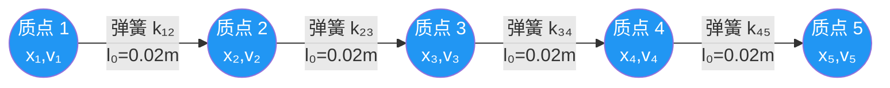
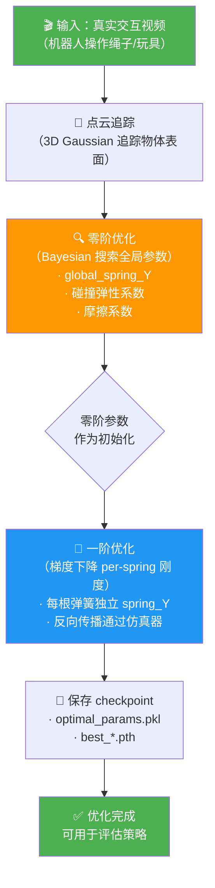
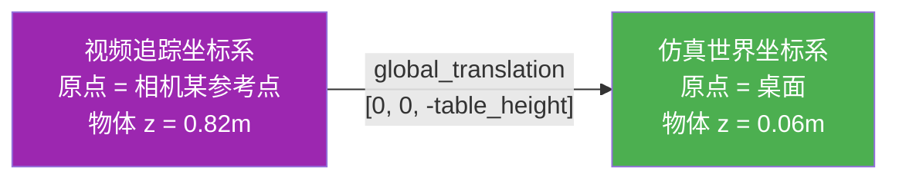

# 第五章：PhysTwin 软体数字孪生原理

## 知识链接

本章是系列第五章。第一章概述了 real2sim-eval 的整体框架与核心贡献；第二章讲解了 3D Gaussian Splatting（3DGS）渲染的原理与实现；第三章解析了 xArm7 机械臂的运动学模型与 URDF 配置；第四章覆盖了刚体仿真的局限性与碰撞检测基础。本章在此基础上，引入软体物理建模，聚焦于 PhysTwin 如何用弹簧-质点系统（spring-mass system）仿真绳子、毛绒玩具等可形变物体。

---

## 一 刚体假设的失效：软体仿真的必要性

**核心结论：刚体假设让软体物体"永远不变形"，策略在仿真里学到的接触技巧到真机上完全失效。**

刚体仿真的基本假设是物体内部各点的相对位置在任何力作用下都保持不变——物体只能整体平移和旋转，不能弯曲、压缩或拉伸。对于金属零件、积木、盒子，这个假设足够好。但对绳子、毛绒玩具、橡皮管，这个假设带来的错误是根本性的：

- **绳子（rope）**：刚体绳子的每个刚性节段瞬间传导力，施加拉力后整根绳子立刻受力，弯曲角度永远保持固定几何形状。真实绳子会因自身重力自然悬垂，被夹住的截面会弯折，松手后截面会以特定曲率落下。
- **毛绒玩具（plush toy）**：刚体毛绒玩具在受压时不会凹陷，表面的"软度"完全丢失。策略试图"按压"物体表面让其进入容器时，刚体物体会整体弹开，而不是局部变形顺应容器形状。

这个差异在评估时造成严重的分布偏移（distribution shift）。策略是在真实视频演示上用模仿学习（imitation learning）训练的，训练数据里的物体是真实软体；但如果评估用刚体仿真器，策略看到的接触行为与训练时完全不同，即使是良好的策略也会失败，导致仿真成功率与真机成功率的相关性崩溃。

### 绳子 routing 任务：一个具体的失败案例

rope routing（绳子穿线）任务的目标是将绳子穿过一个固定夹具的两个约束点之间。人类演示者的策略是：

1. 将绳子前端压入夹具入口
2. 稍微松开夹爪，让绳子在自身重力下自然弯曲，滑入夹具通道
3. 重新夹紧，拉紧绳子完成穿线

步骤 2 是关键——"松手让绳子自然落入"这个动作的有效性完全依赖绳子的柔软性：真实绳子松开后会弯曲下垂，顺着夹具通道的形状自动导向。刚体仿真里的"绳子"是一串铰接刚性节段，松开夹爪后节段会沿原来的方向弹出，而不是弯曲落入通道。于是策略学会了"松手"这个动作，在真机上有效，在刚体仿真里 100% 失败——不是因为策略差，而是因为物理不对。

---

## 二 弹簧-质点系统：软体建模的核心结构

**弹簧-质点系统把连续软体离散成有限个质点，用弹簧描述相邻质点之间的弹性约束，从而近似出整体的形变行为。**

### 系统结构

把一根绳子、一个毛绒玩具或任何可形变物体想象成一团"果冻"。把它切成 N 个小块，每块视为一个质点（particle），质量为 $m_i$，位置为 $\mathbf{x}_i$，速度为 $\mathbf{v}_i$。相邻质点之间用弹簧连接，弹簧有两个参数：静止长度（rest length）$l_0$ 和刚度（stiffness）$k$。

下图展示了一小段绳子离散为弹簧-质点模型后的结构：



> 每个圆是一个质点，存储位置 $\mathbf{x}_i$ 和速度 $\mathbf{v}_i$；每条边是一根弹簧，存储静止长度 $l_0$ 和刚度 $k$。绳子弯曲时，被拉长的弹簧产生拉力，被压缩的弹簧产生推力，合力驱动质点运动，整体表现出柔性行为。

### 弹簧力公式

当弹簧连接质点 $i$ 和质点 $j$ 时，它对质点 $i$ 施加的弹性力为：

$$\mathbf{f}_{ij} = k_{ij} \cdot \left(\frac{l_{ij}}{l_0^{ij}} - 1\right) \cdot \hat{\mathbf{d}}_{ij}$$

**这个公式在做什么**：它把当前弹簧长度和静止长度的比值偏差，乘以刚度，再沿弹簧方向施力——弹簧拉长就拉回、压短就推开，严格保持"形变越大、力越大"的胡克定律（Hooke's law）结构。

::: details 📐 公式详解（点击展开）

| 子表达式 | 它是谁 | 它在干嘛 |
|---------|--------|---------|
| $l_{ij}$ | **当前长度** | 质点 $i$ 和 $j$ 之间的实时欧氏距离，是输入状态 |
| $l_0^{ij}$ | **静止长度** | 弹簧无形变时的目标长度，从真实物体形状初始化 |
| $l_{ij}/l_0^{ij} - 1$ | **相对形变量（应变）** | 大于 0 表示拉伸（产生拉力），小于 0 表示压缩（产生推力），等于 0 表示无形变（无力） |
| $k_{ij}$ | **刚度系数** | 弹簧的"硬度"，单位 N/m，值越大越难形变 |
| $\hat{\mathbf{d}}_{ij}$ | **单位方向向量** | 从质点 $i$ 指向质点 $j$ 的方向，把标量力投影到空间方向上 |

**用人话读**："当前弹簧比静止长度伸长了 x%，就按刚度的 x% 沿弹簧方向往回拉"。

**为什么用比值而不是差值**：如果用差值 $(l_{ij} - l_0^{ij})$，那么同样是 2mm 的形变，对一根 20mm 的小弹簧来说是 10% 应变，对一根 200mm 的大弹簧只是 1% 应变——前者应该产生更大的力，但差值公式给出相同的力。比值（应变）是无量纲量，对不同尺寸的物体一视同仁，用同一个 $k$ 就能描述同样材质的弹性行为。

:::

### 阻尼力：防止永恒振荡

纯弹性弹簧系统会永远振荡——现实中软体会通过内部摩擦耗散能量，最终静止。阻尼力（dashpot damping）模拟这个耗散：

$$\mathbf{f}^{\text{damp}}_{ij} = d \cdot (\mathbf{v}_j - \mathbf{v}_i) \cdot \hat{\mathbf{d}}_{ij} \cdot \hat{\mathbf{d}}_{ij}$$

阻尼力只作用于沿弹簧方向的相对速度分量。如果两个质点相向运动（弹簧正在压缩），阻尼力减小压缩速度；如果相背运动（弹簧正在拉伸），阻尼力减小拉伸速度。它不影响垂直于弹簧的运动，所以不会阻止绳子的弯曲，只阻止弹簧方向的振荡。

### 刚度的 log 参数化

PhysTwin 里，弹簧刚度不直接存储为 $k$，而是存储为 `spring_Y = log(k)`，使用时用 `exp(spring_Y)` 还原实际刚度。

这个设计解决了一个优化问题：不同材质的刚度跨越多个数量级——橡皮筋约 100 N/m，棉绳约 1000 N/m，金属弹簧约 $10^5$ N/m。如果直接在线性空间优化 $k$，梯度会极不均匀：$k=100$ 附近 1 N/m 的变化是 1% 的改变，$k=10^5$ 附近同样 1 N/m 的变化只是 0.001% 的改变。梯度下降在线性空间里对大值参数几乎停滞。log 空间把"翻倍"统一成固定的步长，梯度在各数量级上都平衡，优化收敛更稳定。

---

## 三 PhysTwin 的两阶段训练：从真实视频优化出来的仿真器

**PhysTwin 不是手动调参的仿真器，而是从真实机器人与物体交互的视频中，自动优化出最匹配真实物理的参数。**

整个训练过程分为两个阶段，粗到细地逼近真实物理：



> 两阶段设计是粗搜到精调的梯度优化。零阶阶段用少量视频帧探索大尺度参数空间，找到合理起点；一阶阶段在起点附近做精细的 per-spring 调整，让仿真轨迹和真实轨迹在每一帧上都尽可能对齐。

### 零阶优化阶段

零阶优化（zeroth-order optimization）意味着不使用梯度信息，只通过采样参数、运行仿真、比较轨迹误差来搜索参数空间。

优化目标是一组全局参数：
- `global_spring_Y`：所有弹簧共享的初始刚度（单一标量）
- 碰撞弹性系数（restitution）：物体和地面碰撞后的反弹比例
- 摩擦系数（friction）：接触面的切向摩擦力比例

这个阶段用 Bayesian 优化或网格搜索，通常只需要几百次仿真评估就能收敛到合理的宏观参数。之所以先做零阶：直接用梯度优化 per-spring 参数（数千个参数）时，如果初始值差太远，梯度信号会极弱甚至消失。零阶阶段给一阶阶段一个足够好的起点，避免梯度优化卡在全局较差的局部极小值。

### 一阶优化阶段

一阶优化（first-order optimization）是可微分仿真（differentiable simulation）的核心能力：通过反向传播（backpropagation）计算轨迹误差对每根弹簧刚度的梯度，用梯度下降更新每根弹簧的独立刚度 `spring_Y`。

优化目标是让仿真轨迹中所有质点的位置，在每个时间步上与真实追踪的点云位置尽可能接近。损失函数通常是 Chamfer 距离或最近点对的 L2 距离。反向传播穿过弹簧力计算、速度积分、位置积分的整个计算图，计算出每根弹簧的刚度应该增大还是减小。

一阶优化的结果是每根弹簧都有自己的 `spring_Y` 值，不同区域的材质差异被精确建模出来——比如绳子夹具接触点附近的刚度和绳子中段的刚度会优化成不同的值，准确反映真实绳子的局部材质变化。

---

## 四 Checkpoint 结构与加载逻辑

训练完成后，PhysTwin 的参数保存为三个文件，在 `SpringMassDynamicsModule.__init__` 中按顺序加载：

### final_data.pkl：物体点云数据

这个文件存储了真实交互视频中追踪到的物体点云，格式为：
- `object_points`：shape `(T, N, 3)`，T 帧视频中 N 个追踪点的三维坐标
- `surface_points`：物体表面点的子集，用于渲染和碰撞检测
- `interior_points`：物体内部点的子集，用于体积形变约束

T 帧数据提供了物体在整个交互过程中的形变轨迹，是一阶优化的监督信号。

### optimal_params.pkl：零阶优化的全局参数

这个文件是 Python 字典，包含零阶优化阶段找到的最优全局参数：
- `global_spring_Y`：初始化时所有弹簧共享的刚度（log 空间）
- 碰撞弹性/摩擦系数
- 其他全局仿真参数（如质点质量、阻尼系数）

这些参数作为一阶优化的初始值和非 per-spring 参数的固定值。

### best_*.pth：一阶优化的 per-spring 刚度

这个 `.pth` 文件（PyTorch 格式）保存了一阶优化的最终结果：`spring_Y` 张量，shape `(n_springs,)`，每个元素是对应弹簧的刚度（log 空间）。

加载代码的一个关键细节：

```python
init_spring_Y = torch.load('best_*.pth')['spring_Y']
init_spring_Y = init_spring_Y[:num_object_springs]  # 截断：只保留物体弹簧
```

为什么要截断？一阶优化时，系统里存在两类弹簧：

1. **物体弹簧**：构成绳子/玩具自身的弹簧，数量为 `num_object_springs`
2. **控制弹簧**（control springs）：连接机器人末端效应器（end-effector）和物体表面的虚拟弹簧，用于在训练时"驱动"物体按真实轨迹运动，相当于一个软约束的轨迹跟随器

控制弹簧只在训练时存在，评估时不需要——评估时末端效应器由策略控制，而不是由轨迹驱动。所以加载时只取前 `num_object_springs` 个弹簧的刚度，丢弃控制弹簧的刚度。如果不截断，会把控制弹簧的刚度也当作物体弹簧使用，导致物体内部出现大量"幽灵弹力"，仿真行为完全错误。

---

## 五 从视频点云到仿真初始状态：坐标系对齐

视频追踪得到的点云坐标和仿真场景的世界坐标系之间存在偏移，必须在初始化仿真器时做对齐。

### 桌面高度偏移



> 平移变换把视频追踪的绝对坐标下沉桌面高度，使得仿真世界里桌面正好在 z=0，物体漂浮在桌面上方几厘米处。

具体数值例子：假设 `table_height = 0.76m`（标准实验桌高度），视频里追踪到某个绳子质点的世界坐标是 `[0.32, 0.15, 0.82]`（单位：米）。施加 `global_translation = [0, 0, -0.76]` 后，该质点的仿真坐标变为 `[0.32, 0.15, 0.06]`，即距桌面 6cm 高，符合绳子自然放置在桌面上、略高于桌面的实际情况。

为什么要做这个对齐？仿真里的地面碰撞检测是在 z=0 平面进行的，如果物体坐标没有对齐到桌面，要么物体悬在空中（z 始终大于 0，重力让它掉落），要么物体嵌入地面（z 小于 0，产生大量碰撞穿透力）。两种情况都会让仿真初始状态与真实初始状态完全不同，导致后续仿真行为不可信。

### KDTree 建立弹簧近邻图

点云只是一组散乱的三维点，弹簧-质点系统还需要知道哪些质点之间应该连弹簧。PhysTwin 用 KDTree 建立近邻图：

```python
from scipy.spatial import KDTree
tree = KDTree(object_points[0])  # 用第一帧构建
pairs = tree.query_pairs(r=object_radius)  # 找所有距离 < object_radius 的点对
```

`object_radius` 是连接半径（connection radius），控制弹簧的最大长度。这个参数的选择直接影响仿真质量：

- 半径太小：相邻质点之间没有弹簧，物体会分裂成孤立点，完全失去刚度
- 半径太大：距离很远的质点也被连上弹簧，这些长弹簧会限制物体大幅弯曲，让绳子变得过于僵硬
- 合理范围：通常选择平均质点间距的 1.5-2 倍，保证每个质点有 6-12 个邻居

建立近邻图后，每对 `(i, j)` 质点对就是一根弹簧，其静止长度 $l_0$ 设为初始帧里这两个质点的距离，其刚度 `spring_Y` 在零阶阶段初始化为全局值，在一阶阶段被独立优化。

---

## 六 软体建模的适用边界与局限

弹簧-质点系统在 PhysTwin 的三个任务上都表现出色，但它不是万能的，理解它的适用边界对正确使用至关重要。

### 适合用弹簧-质点的物体

- **绳子和线缆**：质点沿一维链排列，弹簧连接相邻质点，自然捕获弯曲和拉伸
- **毛绒玩具和泡沫体**：三维质点网格，捕获各方向的压缩变形
- **薄壳物体（如纸张）**：添加弯曲弹簧（bending springs）连接跨质点的对角线，近似薄板的抗弯刚度

### 弹簧-质点的不足之处

- **布料**：布料的各向异性（经向和纬向刚度不同）需要专门的布料仿真公式（如 FEM 三角形单元），弹簧-质点只能近似
- **液体和颗粒物**：这类物体的材料模型完全不同（流体力学方程），弹簧没有意义
- **大应变橡胶**：超弹性材料在大变形时刚度非线性变化，均匀弹簧常数建模误差显著

PhysTwin 针对 rope routing 和 toy packing 这两类任务设计，其物体（绳子、毛绒玩具）恰好在弹簧-质点的最佳适用范围内。这是论文选择这两个任务的原因之一——软体任务足够挑战刚体仿真，同时弹簧-质点精度足够高，不会成为新的误差来源。

---

## 七 与刚体基线的精度对比

完整理解 PhysTwin 的价值，需要看它和刚体仿真在相同任务上的定量差距。

在 rope routing 任务上，刚体仿真（IsaacLab 基线）的仿真成功率与真机成功率的 Pearson 相关系数约为 $r \approx 0.45$——接近随机相关，无法用于 checkpoint 选择。而 PhysTwin 软体仿真达到 $r \approx 0.91$，高相关意味着仿真排名和真机排名几乎一致。

这个对比直接说明了为什么软体仿真是 real2sim-eval 的核心技术贡献之一：在软体接触任务中，物理保真度的差距不是"好一点"和"差一点"的区别，而是"有用"和"完全无用"的区别。

详细的消融实验数字和散点图分析见第八章。
