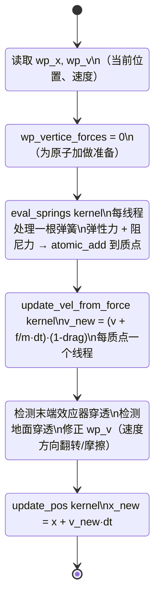
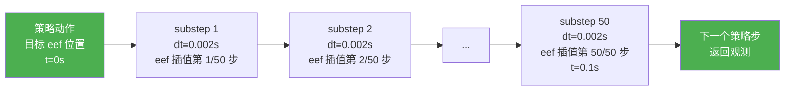

# 第六章：弹簧质点仿真器代码实现

## 知识链接

本章是第五章的代码对应篇。第五章讲解了弹簧-质点系统的物理原理——质点、弹簧力公式、阻尼力、log 参数化，以及 PhysTwin 的两阶段训练过程和 checkpoint 结构。读者应当已经理解弹簧力公式 $\mathbf{f}_{ij} = k_{ij}(l_{ij}/l_0^{ij}-1)\hat{\mathbf{d}}_{ij}$，以及为什么刚度要存为 `log(k)`。本章聚焦于这些原理在 GPU 代码中的具体实现：NVIDIA Warp 框架的使用方式、单步仿真的完整执行序列、substep 机制、碰撞处理的张量操作、CUDA Graph 加速。

---

## 一 NVIDIA Warp：GPU 并行物理的基础设施

**Warp 是 NVIDIA 的 GPU 加速科学计算框架，允许用 Python 语法写 GPU kernel，JIT 编译到 CUDA，专为物理仿真中的稀疏并行操作优化。**

### Warp 和 PyTorch 的分工

PyTorch 的强项是规则的张量操作：矩阵乘法、卷积、逐元素运算。这些操作的数据访问模式非常规则（每个输出元素的计算独立且相似），GPU 可以用高度优化的 cuBLAS/cuDNN 内核执行，效率极高。

弹簧-质点仿真的计算模式完全不同：
- 每根弹簧连接两个特定质点，质点的索引由拓扑结构决定，不是规则的 stride 访问
- 多根弹簧同时向同一个质点施力，需要原子加（atomic add）——这是 PyTorch 的向量化矩阵操作无法高效表达的
- 碰撞检测需要对每个质点做近邻查询，访问模式高度不规则

Warp 的 `@wp.kernel` 装饰器把 Python 函数编译为 CUDA kernel，每个线程（thread）处理一根弹簧或一个质点。这种"一个任务一个线程"的编程模型天然适合物理仿真的并行结构，也支持 `wp.atomic_add`、`wp.atomic_sub` 等原子操作，安全地处理多线程写同一内存位置的情况。

### Warp 数组与 PyTorch 张量的互转

Warp 有自己的内存管理（`wp.array`），但可以零拷贝地与 PyTorch 张量共享 GPU 内存：

```python
import warp as wp

# PyTorch 张量 → Warp 数组（共享内存，无拷贝）
x_torch = torch.zeros(N, 3, device='cuda')
x_wp = wp.from_torch(x_torch, dtype=wp.vec3)

# Warp 数组 → PyTorch 张量（同样共享内存）
x_back = wp.to_torch(x_wp)
```

这个零拷贝互转对性能至关重要：仿真结果（质点位置）需要传回 PyTorch 做渲染（GS 渲染需要 PyTorch 张量），如果每步都做内存拷贝，会抵消 GPU 加速的大部分收益。

---

## 二 单步仿真的完整状态转换

理解仿真器的执行逻辑，最清晰的方式是看一个 substep（子步）的完整状态机。下图展示了从输入状态到输出状态的每一个环节：



> 注意清零力缓冲在弹簧力计算之前，而不是之后——这是因为多个弹簧会向同一质点原子加力，清零确保每个 substep 的力是当前状态的合力，而不是历史叠加。

### 为什么是这个顺序

这个顺序实现的是半隐式欧拉积分（semi-implicit Euler integration）：先用当前位置计算力，再用力更新速度，再用**新速度**更新位置（而不是用旧速度）。相比显式欧拉（用旧速度更新位置），半隐式方案的能量误差不会随时间积累，仿真稳定性更好，可以使用更大的时间步长。

---

## 三 eval_springs kernel：弹簧力的并行计算

弹簧力计算是整个仿真器计算量最大的环节，也是 Warp GPU 化的核心内核。在解释代码之前，先明确这个 kernel 要做的事：

对系统里的每根弹簧，同时并行地：
1. 读取两端质点的当前位置和速度
2. 计算弹性力和阻尼力（第五章的公式）
3. 用原子操作把力分别加到两个质点的力缓冲里（方向相反）

```python
@wp.kernel(enable_backward=False)
def eval_springs(
    x: wp.array(dtype=wp.vec3),          # 所有质点的当前位置，shape (N, 3)
    v: wp.array(dtype=wp.vec3),          # 所有质点的当前速度，shape (N, 3)
    springs: wp.array(dtype=wp.vec2i),   # 弹簧两端质点索引，shape (n_springs, 2)
    rest_lengths: wp.array(dtype=float), # 每根弹簧的静止长度，shape (n_springs,)
    spring_Y: wp.array(dtype=float),     # 每根弹簧的刚度（log 空间），shape (n_springs,)
    dashpot_damping: float,              # 全局阻尼系数（标量）
    spring_Y_min: float,                 # 刚度下界（防止 exp 溢出，跳过接近 0 的弹簧）
    spring_Y_max: float,                 # 刚度上界（物理合理性约束）
    f: wp.array(dtype=wp.vec3),          # 力缓冲（输出），shape (N, 3)
):
    tid = wp.tid()  # 线程 ID，对应第 tid 根弹簧

    # 刚度极小的弹簧（优化后趋近于 0）直接跳过，节省计算
    if wp.exp(spring_Y[tid]) > spring_Y_min:
        # 读取两端质点索引
        idx1 = springs[tid][0]
        idx2 = springs[tid][1]

        # 读取位置和速度
        x1 = x[idx1]
        x2 = x[idx2]
        v1 = v[idx1]
        v2 = v[idx2]

        rest = rest_lengths[tid]

        # 弹簧向量：从质点 1 指向质点 2
        dis = x2 - x1
        dis_len = wp.length(dis)  # 当前弹簧长度

        # 单位方向向量，wp.max 防止长度为 0 时除零
        d = dis / wp.max(dis_len, 1e-6)

        # 弹性力：k * (l/l0 - 1) * d_hat
        # wp.clamp 限制刚度在物理合理范围内
        k = wp.clamp(wp.exp(spring_Y[tid]), low=spring_Y_min, high=spring_Y_max)
        spring_force = k * (dis_len / rest - 1.0) * d

        # 阻尼力：d * (v2-v1)·d_hat * d_hat（只取沿弹簧方向的分量）
        v_rel = wp.dot(v2 - v1, d)
        dashpot_forces = dashpot_damping * v_rel * d

        total_force = spring_force + dashpot_forces

        # 原子加：质点 1 受力方向从 1 指向 2（同向），质点 2 受力方向相反（牛顿第三定律）
        wp.atomic_add(f, idx1, total_force)
        wp.atomic_sub(f, idx2, total_force)
```

### 三个关键设计点

**`wp.atomic_add` / `wp.atomic_sub`**：这是并行安全的内存加法。假设质点 3 同时被弹簧 (2,3)、弹簧 (3,5)、弹簧 (3,7) 施力，三根弹簧在三个线程里同时执行，都要往 `f[3]` 加值。如果用普通的 `f[idx] += force`，三个线程会读到同一个旧值，各自加完再写回，最终 `f[3]` 只包含最后写入的那个力，另外两个力丢失（race condition）。原子操作保证每次加法都是全局串行的，无论多少线程同时执行，最终结果正确。

**`wp.clamp(wp.exp(spring_Y), spring_Y_min, spring_Y_max)`**：log 空间参数在反向传播时可能被优化到很大的负数，`exp` 后接近 0；也可能被优化到很大的正数，`exp` 后产生数值上溢。`clamp` 在物理合理范围内截断，同时 `spring_Y_min` 判断让接近 0 的弹簧整根跳过——这些是被优化器"删掉"的冗余弹簧（刚度太小，对物体形变几乎没有影响），跳过它们直接节省了线程数量 × 每次浮点操作的计算开销。

**`wp.max(dis_len, 1e-6)`**：两个质点恰好重合时，`dis_len = 0`，除零会产生 NaN（Not a Number），一个 NaN 会通过力计算传播到整个系统，一帧之后所有质点坐标都变成 NaN，仿真崩溃。这个 clamp 是防御性设计——正常仿真里质点不会重合，但数值误差累积或极端参数配置下可能发生。

---

## 四 速度和位置积分的 kernel

完成弹簧力计算后，两个简单的 kernel 分别更新速度和位置。展示代码之前，先明确它们各自的职责：

`update_vel_from_force` 做的事：每个质点线程读取该质点的总合力，除以质量得到加速度，乘以时间步长得到速度增量，加到当前速度上，再乘以 `(1 - drag)` 系数模拟空气阻力（drag）的均匀衰减。

`update_pos` 做的事：每个质点线程用碰撞修正后的速度（此时速度已经过碰撞处理）乘以时间步长，加到当前位置上。

```python
@wp.kernel(enable_backward=False)
def update_vel_from_force(
    v: wp.array(dtype=wp.vec3),    # 当前速度（读）
    f: wp.array(dtype=wp.vec3),    # 当前总合力（读）
    inv_mass: float,               # 质量的倒数（所有质点质量相同）
    dt: float,                     # 物理时间步长（如 0.002s）
    drag: float,                   # 速度衰减系数（如 0.01，表示每步衰减 1%）
    v_out: wp.array(dtype=wp.vec3) # 更新后的速度（写）
):
    tid = wp.tid()
    # v_new = (v + a*dt) * (1 - drag)
    # 其中 a = f * inv_mass
    v_out[tid] = (v[tid] + f[tid] * inv_mass * dt) * (1.0 - drag)

@wp.kernel(enable_backward=False)
def update_pos(
    x: wp.array(dtype=wp.vec3),    # 当前位置（读）
    v: wp.array(dtype=wp.vec3),    # 碰撞修正后的速度（读）
    dt: float,
    x_out: wp.array(dtype=wp.vec3) # 更新后的位置（写）
):
    tid = wp.tid()
    x_out[tid] = x[tid] + v[tid] * dt
```

`drag` 的角色值得解释：它不是物理上精确的空气阻力模型，而是数值稳定性工具。弹簧-质点系统在某些参数配置下会积累微小的数值误差，这些误差以高频振动的形式表现（质点在平衡位置附近以极小幅度高速振荡）。`drag` 每步给速度乘以一个小于 1 的因子，把这种数值噪声缓慢耗散掉，同时不影响宏观运动。`drag = 0.01` 表示每步速度衰减 1%，在 0.002s 时间步下，0.1s 后速度会衰减到约 $0.99^{50} \approx 0.605$ 倍，实际上并不强——真实物体悬在空中自由下落时速度不应该衰减，所以 drag 要设小。

---

## 五 substep 机制：时间步长解耦

**仿真稳定性要求时间步长极小，而策略控制频率只需要 10Hz。substep 机制把这两个时间尺度解耦：一个策略步内部跑多个物理子步。**

弹簧仿真的稳定性条件（CFL 条件）要求：

$$dt < \sqrt{\frac{m}{k}}$$

其中 $m$ 是质点质量（通常在克量级），$k$ 是弹簧刚度（通常在 100-10000 N/m 量级）。以 $m = 0.01\text{kg}$、$k = 1000\text{ N/m}$ 为例：

$$dt < \sqrt{\frac{0.01}{1000}} = \sqrt{10^{-5}} \approx 0.003\text{s}$$

即时间步长必须小于约 3ms。策略控制频率 10Hz 意味着每 100ms 输出一个动作，两者之间差了 33 倍。

substep 参数从用户配置自动计算：

```python
fps = 10          # 策略控制频率（Hz）
dt = 0.002        # 物理时间步长（秒）
n_substeps = round(1.0 / fps / dt)  # = round(0.1 / 0.002) = 50
```

数值例子：`fps=10`，`dt=0.002`，`n_substeps=50`。一个策略步 = 50 个物理子步。



> 末端效应器（end-effector）在 50 个子步内从当前位置线性插值到目标位置，每步移动 1/50 的路程。这模拟了真实机械臂平滑趋近目标的过程，同时让碰撞检测有机会在每个 2ms 的子步里捕获穿透。

末端效应器的插值位置计算：

```python
# 生成 substep 时间数组：dt, 2dt, 3dt, ..., n_substeps*dt
dts = torch.arange(1, n_substeps + 1, device=device) * dt  # shape (50,)

# eef_vel 是末端效应器在这一策略步内的平均速度（从当前位置到目标位置）
# eef_xyz shape (1, 3)，dts shape (50,)
eef_xyz_next = eef_xyz[None] + eef_vel[None] * dts[:, None, None]
# 结果 shape: (50, 1, 3) — 50 个子步，每个子步末端效应器的位置
```

---

## 六 碰撞处理：末端效应器与物体的交互

**夹具碰撞处理是仿真器里最复杂的部分——它不是点与点的距离检测，而是每个物体质点与完整夹具几何体的穿透检测和响应。**

### 夹具表示

夹具（gripper）不是一个点，而是从 URDF 网格（mesh）采样的点云，通常包含左右两片指尖各约 200 个表面点。这些点的位置随夹具姿态（末端位置、旋转、开合度）实时变化。

每个 substep 开始时，系统根据当前关节角度更新夹具点云位置：

```python
# eef_pts_before: 夹具在参考姿态下的局部点云，shape (n_pts, 3)
# init_eef_xyz: 参考姿态的末端位置，shape (3,)
# eef_rot_next: 每个 substep 的末端旋转矩阵，shape (50, 1, 3, 3)
# eef_xyz_next: 每个 substep 的末端位置，shape (50, 1, 3)

# 夹具局部坐标（相对于参考末端位置）
relative_eef_pts = eef_pts_before - init_eef_xyz  # shape (n_pts, 3)

# 将局部坐标旋转到当前朝向，再加上当前末端位置
# relative_eef_pts @ eef_rot_next.permute(0,1,3,2): shape (50, n_pts, 3)
interpolated_dynamic_points = (
    eef_xyz_next[:, :, None]   # (50, 1, 1, 3) 广播
    + relative_eef_pts         # (n_pts, 3) 广播
    @ eef_rot_next.permute(0, 1, 3, 2)  # (50, 1, 3, 3) 旋转
)
# 最终 shape: (50, n_pts, 3) — 50个substep × n_pts个夹具点 × 3坐标
```

张量维度说明：
- `dts` shape `(50,)` — 50 个 substep 的时间
- `eef_xyz` shape `(1, 3)` — 当前末端位置（在 substep 维度上广播）
- `relative_eef_pts` shape `(n_pts, 3)` — 局部坐标下的夹具点（在 substep 维度上广播）
- `eef_rot_next` shape `(50, 1, 3, 3)` — 每个 substep 的旋转矩阵
- 最终 `interpolated_dynamic_points` shape `(50, n_pts, 3)` — 每个 substep 里，每个夹具表面点的世界坐标

### 穿透响应

对每个物体质点，检查它是否穿入夹具几何体内部。穿透深度（penetration depth）$d$ 定义为质点到夹具最近表面的有符号距离，负值表示穿入：

- 如果 $d < 0$（穿透），在质点速度上施加沿法向量方向的冲量，使质点向外弹出（弹性响应），同时施加切向摩擦力（Coulomb 摩擦）
- 如果 $d \geq 0$（未穿透），不做任何操作

同样的逻辑处理地面（z=0 平面）碰撞：质点 z 坐标小于 0 时，将 z 方向速度取反（乘以弹性系数），施加地面摩擦。

---

## 七 CUDA Graph 加速：消除 CPU-GPU 调度开销

**CUDA Graph 把一系列 GPU kernel 的调用序列录制一次，之后每次执行直接回放，消除每步的 CPU-GPU 同步延迟。**

### 为什么需要 CUDA Graph

没有 CUDA Graph 时，每个 substep 的执行流程是：

```
CPU: 调度 eval_springs kernel → 等 GPU → 调度 update_vel kernel → 等 GPU → ...
```

每次 "等 GPU" 是一次 CPU-GPU 同步点，有几十到几百微秒的延迟。50 个 substep × 3 个 kernel × 几百微秒 = 几十毫秒的纯调度开销，不含任何实际计算。对于大批量并行仿真（同时跑 10 个 episode），这个开销乘以 10，达到几百毫秒，严重拖慢评估速度。

CUDA Graph 的思路是：第一次执行时"录制"整个 substep 序列里所有 kernel 的调用参数和执行依赖，生成一个 graph 对象。之后每次执行，只需要告诉 GPU "执行 graph"，GPU 按照录制的顺序自动执行所有 kernel，CPU 只需要发出一次调用指令，不参与中间每个 kernel 的调度。

```python
if self.phystwin_cfg.use_graph:
    # 回放已录制的 CUDA Graph（一次调用，GPU 自动执行所有 kernel）
    wp.capture_launch(self.simulator.graph)
else:
    # 逐步执行（调试时用，每步都有 CPU-GPU 同步）
    self.simulator.step()
```

### CUDA Graph 的适用条件

CUDA Graph 有一个重要限制：图拓扑（kernel 的调用顺序、输入输出内存地址）必须在录制时固定，不能在回放时改变。对弹簧-质点仿真，这个条件恰好满足：

- 弹簧的连接关系（哪两个质点）在仿真过程中不变（拓扑固定）
- 所有 kernel 的输入输出都是同一批固定分配的 Warp 数组（内存地址固定）
- 每步的执行顺序（eval_springs → update_vel → collision → update_pos）不变

只有时间步长 `dt` 和末端效应器目标位置是每步变化的，但这些作为 kernel 参数（标量或小张量），可以通过 CUDA Graph 的"图参数更新"（graph parameter update）机制在不重录 graph 的情况下更新。

实测加速效果：在单 GPU 上跑 50 个 substep，CUDA Graph 对比逐步执行，端到端加速约 2-3 倍，使每个策略步的物理仿真时间从约 30ms 降到约 10ms。在批量并行评估（多 episode 同时仿真）的场景下，加速效果更显著。

---

## 八 完整仿真一步的调用接口

理解了以上所有组件，把它们拼在一起看一个完整的 `step()` 函数调用链：

```python
def step(self, action_dict: dict) -> None:
    """
    执行一个策略时间步（对应 n_substeps 个物理子步）。
    action_dict 包含：
        - eef_xyz: 目标末端位置 (3,)
        - eef_rot: 目标末端旋转矩阵 (3,3)
        - gripper_width: 目标开合度 (1,)
    """
    # 1. 从 action_dict 计算末端效应器速度
    eef_vel = (action_dict['eef_xyz'] - self.current_eef_xyz) / self.dt_policy

    # 2. 预计算 50 个 substep 的夹具点云位置
    interpolated_dynamic_points = self._interpolate_eef_trajectory(
        eef_vel, action_dict['eef_rot'], action_dict['gripper_width']
    )  # shape (50, n_pts, 3)

    # 3. 把夹具点云传入 Warp 数组
    wp.copy(self.simulator.wp_dynamic_points, 
            wp.from_torch(interpolated_dynamic_points))

    # 4. 执行 50 个物理子步（CUDA Graph 或逐步）
    if self.phystwin_cfg.use_graph:
        wp.capture_launch(self.simulator.graph)
    else:
        for _ in range(self.n_substeps):
            self.simulator.substep()

    # 5. 把更新后的质点位置同步回 PyTorch 张量（用于渲染）
    self.object_positions = wp.to_torch(self.simulator.wp_x).clone()
    self.current_eef_xyz = action_dict['eef_xyz']
```

这个函数是物理仿真对外暴露的唯一接口。策略代码和环境代码不需要知道内部的 Warp kernel、原子操作、CUDA Graph 细节，只需要把目标末端位置传进来，拿到更新后的物体状态。下一章（第七章）将讲解这个 `step()` 如何被 Gym 环境包装，以及策略推理如何通过 Gym 接口与仿真器对话。
