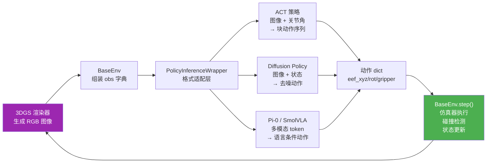
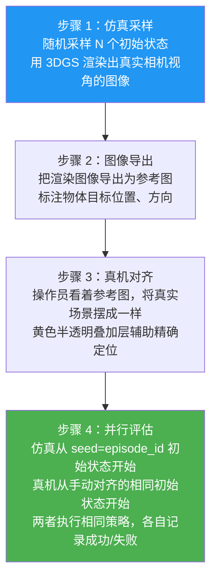

# 第七章：仿真环境接口与闭环策略评估

## 知识链接

本章衔接第六章（仿真器物理实现）与第八章（实验结果分析）。第五、六章已经建立了完整的物理仿真层——弹簧-质点系统、Warp GPU kernel、substep 机制、碰撞处理。本章关注的是仿真层之上的接口层：策略如何通过标准化的 Gym 接口与仿真器对话、如何处理不同策略的观测格式差异、评估循环的完整执行逻辑、成功率的判定标准，以及 real2sim-eval 最重要的方法论贡献——初始状态对齐协议。

---

## 一 Gym 接口：策略看到的世界

**Gym（`gymnasium.Env`）是机器人学习领域的标准环境接口，real2sim-eval 的 `BaseEnv` 实现了它，让任何支持 Gym 的策略代码无需修改就能在这个仿真里运行。**

Gym 接口的核心是三个方法：

- `reset(seed)` → 返回初始观测 `obs`，根据 `seed` 确定性地设置初始状态
- `step(action)` → 执行动作，返回 `(obs, reward, terminated, truncated, info)`
- `render()` → 返回当前帧的 RGB 图像（可选）

### 观测结构

策略每步接收的观测 `obs` 是一个字典，包含三类信息：

```python
obs = {
    # 固定相机图像列表（通常 1-3 个角度）
    'image_list': [img_cam0, img_cam1],   # 每个 shape (H, W, 3)，uint8 RGB

    # 腕部相机图像列表（安装在末端效应器上）
    'image_wrist_list': [img_wrist],       # 通常 1 个

    # 机器人本体状态
    'robot': {
        'eef_xyz':     np.array([x, y, z]),          # 末端位置 (3,)
        'eef_quat':    np.array([qw, qx, qy, qz]),   # 末端朝向（四元数）(4,)
        'eef_gripper': np.array([width]),             # 夹具开合度 (1,)，0=全合，1=全开
    }
}
```

图像由 3D Gaussian Splatting（3DGS）渲染器实时生成，渲染结果模拟真实相机的画面，包含正确的物体颜色、光照和几何细节（第二章有 3DGS 渲染的详细原理）。

### 观测渲染到策略推理的数据流

策略不直接接收 `BaseEnv` 的原始 `obs`，而是通过 `PolicyInferenceWrapper` 做格式转换——不同策略框架（ACT、Diffusion Policy、Pi-0、SmolVLA）对观测格式的要求各不相同：



> 注意 `PolicyInferenceWrapper` 在 `BaseEnv` 和策略之间，负责把通用 `obs` 字典转换成各策略需要的输入张量格式，以及把各策略输出的动作格式统一转换成 `BaseEnv.step()` 接受的 `action_dict`。这个解耦设计让 real2sim-eval 能无缝评估任意新策略，只需为新策略实现一个 adapter。

---

## 二 动作空间与速度控制

**策略的动作是目标末端位置，但真实机械臂不是瞬间跳到目标——仿真里必须模拟这个平滑趋近过程，否则碰撞检测会失效。**

### 两种动作格式

策略可以输出两种格式之一，`PolicyInferenceWrapper` 统一转换为 `action_dict`：

**`xyz_rot` 模式（13 维）**：
- 末端位置 $\mathbf{p}$ (3维)
- 旋转矩阵展平为向量 $[R_{11}, R_{12}, ..., R_{33}]$ (9维)
- 夹具开合度 (1维)

旋转矩阵 (3×3) 比四元数 (4维) 多用了 5 个维度，但表示更稳定——四元数有双覆盖问题（$q$ 和 $-q$ 表示同一个旋转），策略网络很难学会这个约束。旋转矩阵没有这个问题，但有正交性约束（$R^TR=I$），策略输出的矩阵不保证严格正交，在传入仿真器前要用 Gram-Schmidt 正交化修正。

**`joint` 模式（8 维）**：
- xArm7 的 7 个关节角 (7维)
- 夹具开合度 (1维)

关节角模式需要额外的运动学（IK/FK）变换，把关节角转换为末端位置和旋转矩阵。`xyz_rot` 模式更直观，大多数策略使用这个模式。

### 速度控制（`mimic_velocity_control`）

真实机器人的控制器是速度跟踪器：每次收到目标位置指令，机械臂以有限速度趋近目标，而不是瞬间到达。这个过程可以用比例控制近似：

$$\mathbf{p}_{t+1} = \mathbf{p}_t + (\mathbf{p}_{\text{target}} - \mathbf{p}_t) \cdot \alpha$$

其中 $\alpha \in (0, 1]$ 是增益（gain），$\alpha=1$ 表示瞬间到达（无速度限制），$\alpha=0.5$ 表示每步走向目标一半的距离。

```python
def mimic_velocity_control(current_eef, target_eef, gain=0.5):
    """模拟真实机械臂的速度控制行为"""
    return current_eef + (target_eef - current_eef) * gain
```

为什么必须做这个？如果策略输出的目标位置和当前位置相差很大（比如 5cm），不加速度限制会让末端效应器在一个策略步（0.1s）内跨越 5cm，对应的 50 个物理子步每步移动 1mm。但如果有速度控制，第一步只走向目标的 50%（即 2.5cm），分到 50 个子步只有 0.5mm/步。两种情况下碰撞检测的精度差了 2 倍，但更根本的是：真实机械臂有速度限制，仿真里不限速会导致仿真动力学和真实动力学出现系统性差异，策略在仿真里学到的"快速跨越"动作在真机上无法复现。

---

## 三 完整评估循环：`eval_policy.py` 解析

评估的目标是：给定一个训练好的策略（固定权重），在 N 个随机初始状态下运行闭环评估，统计成功率。评估循环的核心逻辑如下：

```python
# eval_policy.py 的主评估循环（简化版）
results = []

for episode_id in range(cfg.policy.n_episodes):
    # 每个 episode 单独初始化策略（防止内部状态泄漏）
    policy = PolicyInferenceWrapper(
        cfg=cfg.policy,
        device=device
    )

    # 创建仿真环境，randomize=True 允许初始状态随机扰动
    env = gym.make(
        cfg.env.task_name,
        cfg=cfg.env,
        randomize=True
    )

    # 用 episode_id 作为随机种子，确保可复现
    obs, _ = env.reset(seed=episode_id)

    # 运行 frame_rate * duration 步（如 10Hz × 30s = 300步）
    for step_id in range(cfg.eval.frame_rate * cfg.eval.duration):
        # 策略推理：观测 → 动作
        action_dict = policy.get_action(obs)

        # 仿真一步：动作 → 新观测
        obs, _, terminated, truncated, info = env.step(action_dict)

        # 保存帧图像（用于事后分析）
        if cfg.eval.save_video:
            frames.append(obs['image_list'][0])

        if terminated or truncated:
            break

    # 获取最终物理状态，计算成功率
    final_state = env.get_state()
    success = env.compute_success(final_state)
    results.append(success)

    env.close()

success_rate = np.mean(results)
```

### 两个关键设计

**`seed=episode_id` 的作用**：每次调用 `env.reset(seed=N)` 时，所有随机数生成器（物体初始位置、姿态的随机扰动）都从 seed N 开始，产生确定性的初始状态。对同一个 seed，仿真初始状态完全相同，无论运行多少次。这保证了跨 checkpoint、跨策略的对比是公平的——每个 checkpoint 面对完全相同的 N 个初始状态。

**每个 episode 重建 policy 的原因**：某些策略（如 ACT）有内部的历史动作缓冲（action chunking buffer），存储最近几步的动作序列用于平滑。如果不重建 policy，上一个 episode 末尾的缓冲内容会"污染"下一个 episode 的开头，导致前几步动作异常。逐 episode 重建 policy 虽然增加了少量初始化开销，但彻底消除了状态泄漏的风险。

---

## 四 成功率计算：任务特定的状态判据

**成功率基于物理状态（质点位置、物体姿态）判断，而不是图像像素——物理状态判断不受光照变化、渲染差异的影响，更可靠。**

三个任务各有专门设计的成功判据：

### Toy Packing（玩具打包）

任务目标：把毛绒玩具从桌面放入容器（如盒子）。成功条件：玩具的大多数质点（例如 >80%）的 z 坐标低于容器边缘高度，且 xy 坐标在容器边界的水平投影内。

```python
def compute_success_toy_packing(particle_positions, container_bounds):
    """
    particle_positions: shape (N, 3)，玩具的质点位置
    container_bounds: 容器的 (x_min, x_max, y_min, y_max, z_top)
    """
    in_xy = (
        (particle_positions[:, 0] > container_bounds[0]) &
        (particle_positions[:, 0] < container_bounds[1]) &
        (particle_positions[:, 1] > container_bounds[2]) &
        (particle_positions[:, 1] < container_bounds[3])
    )
    below_top = particle_positions[:, 2] < container_bounds[4]
    ratio_inside = (in_xy & below_top).float().mean()
    return ratio_inside > 0.8
```

用质点比例而不是质心位置的原因：毛绒玩具是软体，质心位置判断不够精确——玩具可能质心在容器内但大部分体积挂在容器外面，这不算真正"装进去"了。

### Rope Routing（绳子穿线）

任务目标：把绳子穿过固定夹具的两个约束销（constraint pins）之间。成功条件：绳子上的若干参考点，其 xy 坐标穿越了两个约束销连线的正下方区域，且 z 坐标在约束销高度以下。

这个判断本质上是检测绳子是否"绕过"了约束销：从上方看，绳子的参考点必须在两个销的内侧（x 坐标夹在两销之间），且有从外向内穿过的轨迹。这需要比较绳子的当前状态和初始状态，判断是否发生了拓扑变化。

### T-Block Pushing（T 块推入）

任务目标：把 T 形积木推入形状匹配的插槽。成功条件：T 块的位置和朝向都在容差范围内与目标插槽对齐，即 6DoF 姿态误差（位置误差 <5mm，旋转误差 <10°）同时满足。

T 块是刚体（非软体），用传统 6DoF 姿态估计而不是质点位置判断。因为 T 块有旋转对称性（180°旋转后形状相同），判断时需要分别检测 0° 和 180° 两种对齐方式，取最小误差。

---

## 五 初始状态对齐协议：评估有效性的基础

**real2sim-eval 最重要的方法论贡献是提出了严格的初始状态对齐协议，确保仿真和真机从完全一致的初始状态出发——没有这个对齐，仿真和真机成功率之间的相关性可能是虚假的。**

### 为什么初始状态对齐如此重要

不对齐初始状态会带来严重的混淆变量（confounding variable）：

- 仿真里可能系统性地采样到更容易的初始状态（物体正好在策略训练分布的中心）
- 真机里可能系统性地遇到更难的初始状态（操作员手动放置时偏向某些角度）
- 如果某个策略在"简单"初始状态下成功率高，在"难"初始状态下成功率低，那么不对齐的仿真评估给出"高成功率"，真机评估给出"低成功率"，两者不是在评估同一件事

### 对齐协议的四个步骤



> 黄色半透明叠加（overlay）是真机对齐的关键工具：把渲染图像叠加在真实相机画面上，操作员移动物体直到真实物体轮廓和渲染轮廓完全重合。这种视觉引导对齐的精度通常在 5mm / 5° 以内，足以消除初始状态差异带来的成功率系统偏差。

### 协议的实际操作开销

每次评估 20 个 episode 需要的对齐时间约为 10-15 分钟（每个 episode 操作员需要摆放物体 20-30 秒）。这是 real2sim-eval 方法的主要实验成本，但这个成本是**一次性**的：给定一个策略集合（比如某方法的 20 个 checkpoint），只需要对齐一次 20 个初始状态，所有 checkpoint 都用同一批初始状态评估，总评估时间远小于逐 checkpoint 在真机上随机评估。

---

## 六 多 GPU 并行评估：`eval_policy_parallel.py`

单 GPU 评估 20 个 checkpoint × 20 个 episode = 400 次评估，如果每次评估 30 秒，串行执行需要约 3.3 小时。多 GPU 并行把这个时间除以 GPU 数量。

### 分发逻辑

把总 episode 数平均分配到 N 个 GPU 进程，每个进程负责自己的子集：

```python
# eval_policy_parallel.py（简化版）
import multiprocessing as mp

def eval_on_gpu(gpu_id, episode_ids, cfg):
    """单个 GPU 进程的评估函数"""
    import os
    os.environ['CUDA_VISIBLE_DEVICES'] = str(gpu_id)
    # 在这个进程里，只有 gpu_id 号 GPU 可见
    # 所有 torch/warp 操作自动路由到这块 GPU
    results = run_eval(episode_ids, cfg)
    return results

if __name__ == '__main__':
    n_gpus = 4
    total_episodes = 80
    episodes_per_gpu = total_episodes // n_gpus  # = 20

    # 用 spawn 而不是 fork 创建进程
    ctx = mp.get_context('spawn')
    jobs = []
    for gpu_id in range(n_gpus):
        start = gpu_id * episodes_per_gpu
        end = start + episodes_per_gpu
        p = ctx.Process(
            target=eval_on_gpu,
            args=(gpu_id, list(range(start, end)), cfg)
        )
        p.start()
        jobs.append(p)

    for p in jobs:
        p.join()
```

### 为什么用 `spawn` 而不是 `fork`

Python 的 `multiprocessing` 有两种进程创建模式：
- `fork`：复制当前进程的整个内存状态（包括已初始化的 CUDA 上下文）到子进程
- `spawn`：子进程从干净状态启动，重新导入模块，重新初始化 CUDA

CUDA 上下文（CUDA context）不能被 fork 复制——CUDA 驱动维护每个进程对 GPU 的独立上下文，`fork` 后父子进程尝试共享同一个上下文会导致 CUDA 报错（"CUDA error: device not available" 或随机崩溃）。`spawn` 创建完全独立的进程，每个进程有自己的 CUDA 上下文，互不干扰。代价是每个子进程需要重新初始化 CUDA、重新加载模型权重、重新构建仿真器，增加约 10-20 秒的启动开销——对于每个进程要跑 20 个 episode（约 600 秒工作量）的情况，这个启动开销是可接受的。

### 结果聚合

每个进程把自己负责的 episode 的成功/失败结果写入共享文件（JSON 格式，用 episode_id 为 key 避免冲突）。所有进程结束后，主进程读取所有结果，按 episode_id 排序，计算全局成功率。用文件而不是进程间通信（IPC）的好处是：即使某个进程崩溃，其他进程的结果不丢失，可以手动补跑崩溃的 episode。
