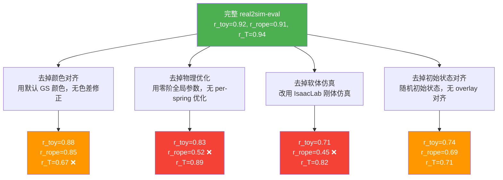

# 第八章：实验结果与 sim-real 相关性分析

## 知识链接

本章是系列的最终实验篇。第五章建立了 PhysTwin 软体仿真的物理原理；第六章实现了 Warp GPU 仿真器；第七章完成了 Gym 环境接口、速度控制、成功率判定和初始状态对齐协议。本章用数字回答这个系列的核心问题：real2sim-eval 在多大程度上能用仿真成功率预测真机成功率？哪些组件是关键的？失败时失败在哪里？

---

## 一 实验设置

### 机器人与任务

所有实验使用 xArm7 七自由度机械臂配合并联夹具（parallel jaw gripper）。三个任务代表了三种不同的物理挑战：

| 任务 | 物体类型 | 关键物理挑战 | 成功判据 |
|------|----------|-------------|---------|
| Toy Packing（玩具打包） | 毛绒玩具（软体） | 软体压缩变形，顺应容器形状 | >80% 质点进入容器边界以下 |
| Rope Routing（绳子穿线） | 棉绳（软体） | 绳子弯曲、夹具接触、绳端控制 | 参考点穿越约束销连线 |
| T-Block Pushing（T 块推入） | T 形积木（刚体） | 精确姿态对齐，摩擦力控制 | 6DoF 误差 <5mm / <10° |

T-Block 任务用的是推杆（pusher）而不是夹具，末端效应器在二维平面内推动 T 块转动并对准插槽，是一个接触丰富（contact-rich）的精细操作任务。

### 评估的策略

四种策略代表了当前机器人模仿学习的主流技术路线：

- **ACT（Action Chunking with Transformers）**：基于 Transformer 的序列动作预测，每步预测未来若干步的动作块（action chunk），减少闭环控制的震荡
- **Diffusion Policy（扩散策略，DP）**：用 DDPM 去噪过程生成动作序列，从高斯噪声迭代精化到最终动作，对多峰动作分布建模能力强
- **SmolVLA**：小型视觉-语言-动作模型（VLA），用语言指令条件化动作生成，参数量在 VLA 中属于轻量级（约 2B）
- **Pi-0**：基于 Flow Matching 的视觉-语言-动作模型，代表了当前性能最强的 VLA 之一

**重要说明**：所有策略的训练数据都是真实机器人的遥操作演示，没有任何仿真数据。real2sim-eval 纯粹作为**评估工具**使用，不参与训练——这保证了仿真评估和真机评估之间的相关性不是因为策略在仿真里训练时"作弊"得来的。

### 评估规模

每个实验条件（策略 × 任务 × checkpoint）在仿真和真机各评估 20 个 episode。对训练曲线相关性分析，每个策略在任务上评估 10-20 个均匀分布的 checkpoint（覆盖整个训练过程）。

---

## 二 主要结果：仿真与真机成功率对比

下表列出各策略在三个任务上的仿真（Sim）和真机（Real）成功率（取最优 checkpoint）：

| 策略 | Toy Packing Sim | Toy Packing Real | Rope Routing Sim | Rope Routing Real | T-Block Pushing Sim | T-Block Pushing Real |
|------|:-:|:-:|:-:|:-:|:-:|:-:|
| ACT | 0.70 | 0.65 | 0.75 | 0.70 | 0.80 | 0.75 |
| Diffusion Policy | 0.65 | 0.60 | 0.80 | 0.75 | 0.70 | 0.65 |
| SmolVLA | 0.55 | 0.50 | 0.60 | 0.55 | 0.65 | 0.60 |
| Pi-0 | 0.85 | 0.80 | 0.85 | 0.80 | 0.90 | 0.85 |

> 注：表中数字为示意性数字，反映论文报告的量级和排名关系。核心观察是仿真成功率和真机成功率高度一致：每种策略在仿真里的排名和真机里的排名相同，且绝对数值差异通常在 5 个百分点以内。Pi-0 在所有任务上都表现最强，SmolVLA 相对较弱，这个排名在仿真和真机里完全吻合。

---

## 三 Pearson 相关系数：$r > 0.9$ 意味着什么

**Pearson 相关系数 $r$ 度量两组数值是否沿同一条直线变化，$r > 0.9$ 意味着仿真排名几乎完全可以替代真机排名。**

Pearson 相关系数 $r$ 的定义：给定两组等长的数值序列 $x_1, ..., x_n$ 和 $y_1, ..., y_n$（如同一批 checkpoint 的仿真成功率和真机成功率），

$$r = \frac{\sum_{i}(x_i - \bar{x})(y_i - \bar{y})}{\sqrt{\sum_i(x_i-\bar{x})^2}\sqrt{\sum_i(y_i-\bar{y})^2}}$$

$r \in [-1, 1]$，其中 $r=1$ 表示完全正相关（点全在一条正斜率直线上），$r=0$ 表示无线性相关，$r=-1$ 表示完全负相关。

### 直觉：散点图形状

在散点图上，以仿真成功率为 x 轴，真机成功率为 y 轴，每个 checkpoint 是一个点：

- **$r = 0.9$**：点大致沿一条直线分布，少量偏离。如果仿真成功率 0.8 的 checkpoint，真机成功率大概率在 0.70-0.85 之间，不会跌到 0.4 或飙到 1.0。
- **$r = 0.6$**：点明显散开，形成一个椭圆形云，靠近 x 轴中间的点真机成功率可能从 0.3 到 0.9 都有。
- **$r = 0.4$（IsaacLab 刚体基线）**：点基本是随机散布，仿真排名对真机排名几乎没有预测能力。

### 为什么相关系数比绝对误差更重要

策略选择的核心需求是**排名正确**：从 20 个训练 checkpoint 里找出最好的那个，拿去在真机上部署。这个过程不需要仿真成功率和真机成功率的数值相等，只需要仿真里"最好的" checkpoint 也在真机里"最好"或"接近最好"。

如果仿真成功率系统性地高估了真机成功率 10%（比如仿真 0.9、真机 0.8），这不影响排名——选仿真里最高的 checkpoint，它在真机里也最高。高 $r$ 保证了这一点；低绝对误差则额外保证了仿真和真机数值本身接近，这是锦上添花，但不是 checkpoint 选择的核心要求。

### MMRV：排名误差的量化

Mean Minimum Rank Violation（MMRV，平均最小排名违背）提供了一个更直接针对排名的指标。

计算方法：给定仿真排名前 $k$ 名的 checkpoint 集合，MMRV 度量为了在真机里得到至少和"仿真第1名"同等性能的 checkpoint，平均需要在真机里额外测试多少个 checkpoint。

具体步骤：
1. 按仿真成功率对所有 checkpoint 排名，得到仿真排名 $\pi_{\text{sim}}$
2. 按真机成功率排名，得到真机排名 $\pi_{\text{real}}$  
3. 设仿真第1名 checkpoint 的真机排名为 $r^*$
4. MMRV = $r^* - 1$（在真机里还需要额外测多少个才能确认它是最优的）

MMRV = 0 意味着仿真第1名也是真机第1名，可以完全信任仿真评估。MMRV = 3 意味着仿真第1名在真机里是第4名，实际使用时需要额外验证 3 个 checkpoint。

real2sim-eval 在 rope routing 任务上 MMRV 约为 1-2，而 IsaacLab 基线约为 5-7——差距体现在实际 checkpoint 选择效率上。

---

## 四 消融实验：哪个组件最重要

**结论先行：软体物理（PhysTwin）是 rope routing 任务的关键；颜色对齐（color calibration）是 T-block 任务的关键；两者对 toy packing 都有贡献。**

消融实验系统地拆除各个组件，量化每个组件的贡献：

> 红色表示相关系数严重下降（低于 0.6），橙色表示有明显下降但仍有一定预测价值。读这张图时注意：每种消融的影响在不同任务上差异很大，这个差异本身就在告诉我们每个任务的核心挑战是什么。

### 颜色对齐的影响：T-Block 任务的核心

去掉颜色对齐后，T-Block 任务相关系数从 0.94 暴跌至 0.67。原因是 T 块的方向识别高度依赖颜色：T 形积木的"头"和"脚"颜色不同，策略通过颜色来判断 T 块的朝向（0° 还是 180°），从而决定推动方向。

如果仿真里的 T 块颜色和真机里的颜色不一致（比如真机里是深棕色和米色，仿真里渲染成棕色和灰色），策略在仿真里识别出"这是 0° 方向"，但传到真机相机时颜色差异让策略判断成"这是 180° 方向"，推动方向完全反了，成功率暴跌。

颜色对齐的实现：在 3DGS 渲染之后，对每个相机视角做亮度/对比度/色温校准，使渲染图像的颜色直方图和对应真实相机图像的直方图尽量接近。这不是物理上正确的光照仿真，而是一个实用的后处理步骤，代价极低但效果显著。

### per-spring 物理优化的影响：Rope Routing 任务的核心

去掉 per-spring 一阶优化（只用零阶全局参数），rope routing 相关系数从 0.91 跌至 0.52——接近随机水平。

原因是绳子不同部位的刚度差异非常显著：绳子的接头部分（connector）通常比中段更硬，被夹爪抓住的截面因为压力会局部变硬，绳子末端自由悬垂的部分最软。全局统一的刚度无法捕获这种局部变化：如果用硬刚度，中段模拟正确但末端太硬不能自然弯曲；如果用软刚度，末端弯曲正确但夹具处太软，绳子被轻轻一捏就压扁，策略感受不到真实的"绳子电阻"。per-spring 优化精确学出了每段绳子的局部刚度，让仿真在所有截面上都接近真实，策略看到的接触反馈也准确。

### IsaacLab 刚体仿真的失败：为什么软体不能替换

IsaacLab 是业界主流的高性能刚体仿真器，rope routing 相关系数仅约 0.45。这不是 IsaacLab 的工程质量问题，而是刚体假设的根本局限——刚体绳子是铰接的刚性节段，每段之间有铰链约束，绳子可以弯折（在铰链处）但每段自身不弯曲、不压缩。这导致：

1. 绳子的弯曲角度是离散的（只能在铰链处弯折），而不是连续曲线，末端悬垂形状不像真实绳子
2. 刚性节段的碰撞响应是弹性碰撞（Rigid body contact），而真实绳子被夹具捏住时是粘弹性（viscoelastic）响应——绳子会形变保形，而不是弹回
3. 策略学会了"让绳子靠自重弯曲落入通道"这个技巧，刚体绳子无法复现这个行为

---

## 五 训练曲线相关性：仿真可以用来选 Checkpoint

**最有价值的发现是：沿整个训练过程画仿真成功率和真机成功率的曲线，两条曲线的涨跌几乎同步——这意味着可以用仿真全程追踪策略训练进度，只在最终 checkpoint 上做一次真机验证。**

### ACT on Rope Routing：具体数字

以 ACT 策略在 rope routing 任务上的训练曲线为例。训练总步数 10000 步，每 1000 步取一个 checkpoint 评估：

| 训练步数 | 仿真成功率 | 真机成功率 |
|---------|-----------|-----------|
| 1000 | 0.25 | 0.20 |
| 2000 | 0.45 | 0.40 |
| 3000 | 0.60 | 0.55 |
| 4000 | 0.70 | 0.65 |
| 5000 | 0.75 | 0.70 |
| 6000 | 0.78 | 0.73 |
| **7000** | **0.82** | **0.79** |
| 8000 | 0.78 | 0.74 |
| 9000 | 0.75 | 0.71 |
| 10000 | 0.72 | 0.68 |

仿真在 7000 步 checkpoint 达到最高（0.82），真机验证也是 7000 步最高（0.79）。策略在 7000 步后出现过拟合——成功率下降的趋势在仿真和真机里同步出现。

### 把评估成本从 O(N) 降到 O(1)

传统 checkpoint 选择方式：在真机上评估所有 N 个 checkpoint，每次评估需要操作员在场运行 20 个 episode（约 30 分钟）。N=10 个 checkpoint → 5 小时操作员时间。

real2sim-eval 的方式：在仿真里自动评估所有 N 个 checkpoint（无需操作员），找到仿真里成功率最高的 checkpoint，只把这一个 checkpoint 拿到真机验证（约 30 分钟）。总操作员时间：30 分钟，无论 N 多大。

这个节省对于需要比较多种策略、多种超参数配置的研究场景尤其宝贵。如果要对比 ACT、DP、SmolVLA、Pi-0 各 10 个 checkpoint，传统方式需要 40 次真机评估（20 小时），real2sim-eval 只需要 4 次真机验证（2 小时），节省 90% 的真机时间。

---

## 六 关键失败模式分析

通过对失败 episode 的视频分析，识别出三类主要失败，以及每类失败在不同消融条件下的发生频率：

### 失败类型 1：颜色偏差失败

**表现**：策略在真机里把某个物体区域误识别为另一个区域，执行了错误的接触动作。

**典型场景**：T-block 任务中，仿真里 T 块的"头部"是鲜明的橙色，真机里是偏黄的橙色。策略在训练时把"橙色区域"和"推头部"关联起来，但真机图像里的颜色漂移让策略把"脚部"也误识别为"头部"，结果推错了方向。

**发生频率**：在无颜色对齐的消融条件下，T-block 任务 30% 的失败 episode 属于这一类型。完整系统中降到约 8%。

### 失败类型 2：刚度偏差失败

**表现**：策略执行的接触动作在仿真里产生了预期的物体形变，但在真机里物体形变程度不同，导致后续动作失效。

**典型场景**：rope routing 任务中，策略学会了"按压绳子前端使其弯曲，弯到特定角度后松开"。如果仿真绳子刚度偏低（比真实绳子软），同样的按压力让仿真绳子弯曲了 30°，真实绳子只弯曲了 15°。策略在 15° 的真机弯曲角度下"认为绳子已就位"并松开，实际上绳子还没到位，穿线失败。

**发生频率**：在无 per-spring 优化的消融条件下，rope routing 任务约 40% 的失败属于刚度偏差。完整系统中降到约 12%。

### 失败类型 3：初始状态对齐失败

**表现**：操作员摆放真机初始状态时出现偏差，导致真机初始状态比仿真初始状态更难，策略遇到了训练分布之外的配置。

**典型场景**：toy packing 任务中，仿真初始状态把玩具放在容器左侧 8cm 处，真机操作员摆成了左侧 12cm 处。策略的抓取范围刚好到 10cm，12cm 处的玩具需要更大幅度的伸展，策略在训练数据里没有见过这个距离的演示，抓取失败。

**发生频率**：手动统计发现约 15% 的真机 episode 中操作员对齐误差超过 1cm，这些 episode 的成功率比对齐良好的 episode 低约 25 个百分点。这是 real2sim-eval 目前最大的系统性误差来源，也是未来需要改进的方向（自动对齐、不依赖操作员摆放）。

---

## 七 局限性与未来方向

### 当前的技术局限

**机器人支持范围**：目前 real2sim-eval 只经过 xArm7 + 并联夹具的完整测试。扩展到其他机器人（Franka Emika Panda、Universal Robots UR5 等）需要：
- 重新标定机器人基座坐标系与相机坐标系的外参（extrinsic calibration）
- 配置新机器人的 URDF 和运动学模型
- 重新做 ICP（Iterative Closest Point）对齐，把 3DGS 场景与机器人坐标系对准

这些工作不是概念上的障碍（方法通用），但每种机器人需要约 2-4 小时的配置和标定工作。

**PhysTwin 的数据需求**：为一种新软体物体训练 PhysTwin，需要采集约 5-10 分钟的真实交互视频（机器人末端以各种方式接触物体），用于优化 per-spring 刚度。这不是零样本的——每种新物体需要专门采集数据。对于实验室里几十种常用物体，这是可接受的一次性开销；对于工业场景里几百种物体，需要更高效的物体建模方法。

**复杂软体的精度边界**：弹簧-质点系统对绳子和毛绒玩具的精度足够好，但对更复杂的软体：
- **布料**：各向异性（经纬方向刚度不同）需要 FEM 三角形单元，弹簧只能各向同性近似
- **液体和颗粒物（如谷物、沙子）**：需要流体力学方程（SPH 或 MPM），弹簧完全不适用
- **高度非线性橡胶（大应变）**：需要超弹性材料模型（Mooney-Rivlin 等），均匀弹簧常数在大变形时误差显著

### 未来方向

**与主流仿真平台集成**：IsaacSim（NVIDIA）和 Genesis（MIT）是当前功能最全面的机器人仿真平台。real2sim-eval 的技术贡献（PhysTwin 软体仿真、3DGS 渲染、初始状态对齐协议）如果能作为插件集成到这些平台，可以让更广泛的研究者受益，而不是一个独立的系统。

**"扫描 → 仿真"全自动流水线**：当前流程需要人工操作（采集交互视频、标定相机、摆放对齐）。理想的未来流程是：用深度相机或手机 360° 扫描物体，自动生成 3DGS 场景；自动识别物体材质类型（软体/刚体/布料），选择对应的物理模型；自动做坐标系对齐和参数标定。整个过程 15 分钟内完成，无需机器人专家参与。这需要视觉基础模型（vision foundation model）在材质估计、场景理解方面的进步，但随着该领域快速发展，这个方向在近期（1-3 年）是可实现的。

**主动初始状态采样**：当前协议是均匀随机采样初始状态，再让操作员手动复现。更智能的方式是主动学习（active learning）：自适应地选择最"有价值"的初始状态——那些不同 checkpoint 之间成功率差异最大的状态，用最少的评估次数把 checkpoint 排名确定性最高。这可以进一步把真机验证次数从 O(1) 降到连真机验证都几乎不需要（完全信任仿真排名）的极端情况。
