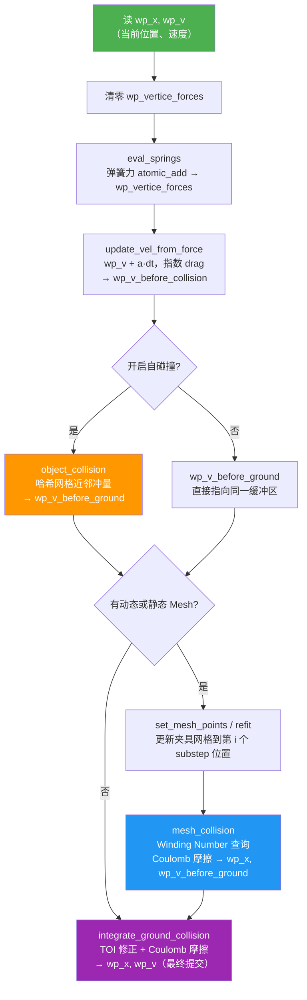
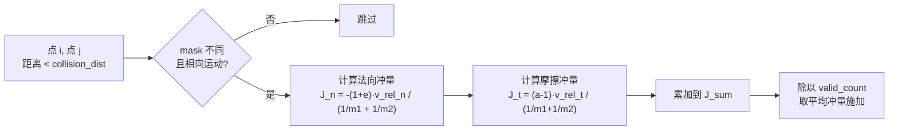
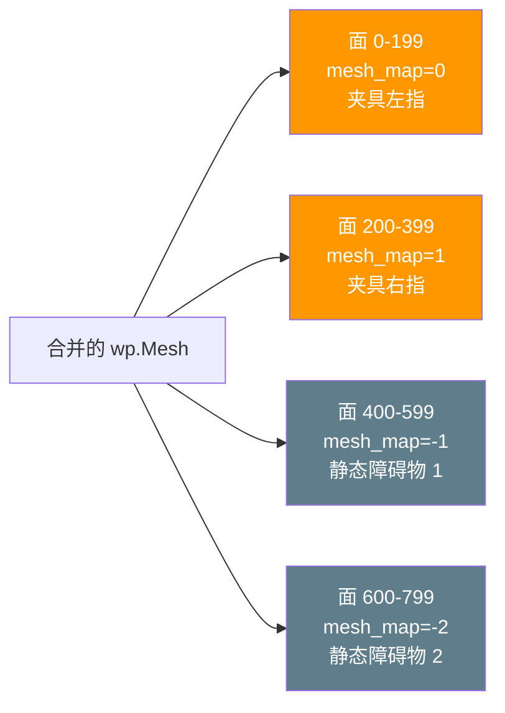

# 第九章：物理引擎框架与碰撞处理详解

## 知识链接

第五章讲解了弹簧-质点系统的物理原理——弹性力公式、log 参数化、PhysTwin 两阶段训练；第六章介绍了 Warp 框架和 substep 机制的整体轮廓。本章是这两章的深度补充，直接对照 `sim/physics/spring_mass_warp.py` 的源码，逐一拆解三层碰撞的设计动机与实现细节：速度积分的指数衰减、自碰撞哈希网格与静止对排除、Mesh 碰撞的 Winding Number 内外判断与 Coulomb 摩擦模型、地面碰撞的 TOI 精确时刻修正，以及夹具轨迹插值的速度分解。

---

## 一 物理流水线全景：三层碰撞与三个速度缓冲区

一个 substep 内部并不是"算力然后改速度"这么简单。仿真器维护**三个速度缓冲区**，对应碰撞流水线的三个阶段：

| 缓冲区 | 含义 | 写入时机 |
|--------|------|----------|
| `wp_v` | 上一 substep 结束时的"已提交"速度，也是下一 substep 的读取源 | 地面碰撞之后 |
| `wp_v_before_collision` | 弹簧力积分后、自碰撞之前的中间速度 | 速度积分之后 |
| `wp_v_before_ground` | 自碰撞（或无自碰撞时直接）与 mesh 碰撞之后的速度 | mesh/自碰撞之后 |

这三个缓冲区构成一条单向管道：每根弹簧的力先被积分进 `wp_v_before_collision`，自碰撞修正写入 `wp_v_before_ground`，mesh 碰撞在 `wp_v_before_ground` 上原地更新，地面碰撞最终产生 `wp_v`。



> 注意三个碰撞层的顺序：自碰撞 → mesh 碰撞 → 地面碰撞。顺序不能调换——地面碰撞负责最终位置写回（含 TOI 修正），必须在最后；mesh 碰撞依赖已经过弹簧力积分的速度；自碰撞用的是刚算完弹簧力的中间速度，避免 mesh 碰撞的法向冲量干扰物体间的相对速度判断。

---

## 二 速度积分：指数衰减的精确性

第六章展示的 drag 衰减用的是 `v * (1 - drag)` 形式，但实际代码是：

```python
drag_damping_factor = wp.exp(-dt * drag_damping)
all_force = f0 + m0 * wp.vec3(0.0, 0.0, -9.8) * reverse_factor
a = all_force / m0
v1 = v0 + a * dt
v2 = v1 * drag_damping_factor
```

这两种写法的差异值得解释清楚。

### 为什么用 exp 而不是线性截断

速度在空气阻力下的连续衰减满足：

$$\frac{dv}{dt} = -\gamma v$$

其中 $\gamma$ 是 `drag_damping`（阻尼系数，单位 1/s）。这个方程的精确解是：

$$v(t) = v_0 \cdot e^{-\gamma t}$$

一个 substep 时间 $\Delta t$ 内，衰减因子是 $e^{-\gamma \Delta t}$，这正是代码中的 `wp.exp(-dt * drag_damping)`。

线性近似 `(1 - drag*dt)` 是 $e^{-\gamma \Delta t} \approx 1 - \gamma \Delta t$（一阶 Taylor 展开），在 $\gamma \Delta t \ll 1$ 时精度尚可，但有一个隐患：当阻尼系数设得较大或时间步长较大时，`(1 - drag*dt)` 可能变成负数，导致速度在衰减过程中反号，违背物理直觉（速度应该是单调趋零而非振荡）。指数形式永远为正，不存在这个问题。

数值比较：`drag_damping = 5.0`，`dt = 0.002s`：
- 线性近似：`1 - 5.0 * 0.002 = 0.99`
- 精确指数：`exp(-5.0 * 0.002) = exp(-0.01) ≈ 0.9900`

在这个典型参数下两者几乎相同（差距 < 0.01%），但精确形式对数值稳定性更严格。

### gravity 的 reverse_factor 设计

重力项 `m0 * vec3(0, 0, -9.8) * reverse_factor` 中的 `reverse_factor` 是 `±1`，由配置的 `reverse_z` 标志决定。这是因为不同传感器采集的点云可能在 z 轴方向上是向上还是向下各不相同。`reverse_z=True` 时 `reverse_factor=-1`，重力变为 `+z` 方向，适配 z 轴朝下的坐标系。地面碰撞检测也同步用这个系数判断 `next_x_z * reverse_factor < 0`。

---

## 三 自碰撞：哈希网格与静止对排除

自碰撞（self-collision）处理物体不同部位之间的接触——比如绳子弯折后两段绳子互相接触，或毛绒玩具被压缩时内部质点相互挤压。

### HashGrid 加速

暴力枚举所有质点对的复杂度是 $O(N^2)$，N=1000 的点云就是 100 万次距离计算，每 substep 都跑一遍代价太高。Warp 的 `wp.HashGrid` 把三维空间划分成 $128 \times 128 \times 128$ 个格子，每帧把所有质点分配到对应格子里，查询某质点的邻居时只搜索附近几个格子。

```python
self.collision_grid = wp.HashGrid(128, 128, 128)

# 每帧调用（在 step 之前）
def update_collision_graph(self):
    self.collision_grid.build(self.wp_state.wp_x, self.collision_dist * 5.0)
    self.wp_collision_number.zero_()
    wp.launch(update_potential_collision, ...)
```

`update_potential_collision` 核心逻辑：对每个质点 $i$，查询半径 `collision_dist * 5.0` 内的所有邻居，筛选满足条件的对存入 `collision_indices[i]`。注意查询半径是 `collision_dist * 5.0`（潜在碰撞候选）而不是 `collision_dist`（实际碰撞触发距离），这样每帧只需要刷新哈希网格和候选列表一次，实际碰撞检测在 `object_collision` 里进一步过滤。

### 静止对排除（Resting Collision Pairs）

一个初始化帧里距离 < `collision_dist` 的质点对，在整个仿真过程中都不参与自碰撞检测：

```python
# 初始化时一次性建立静止对表
def create_resting_case(self):
    self.collision_grid.build(self.wp_state.wp_x, self.collision_dist * 5.0)
    wp.launch(build_resting_collision_pairs, ...)
```

`resting_collision_pairs` 是一个 `(N, N)` 的布尔矩阵，初始帧里互相邻近的任意两点对会被标记为 `True`。在 `update_potential_collision` 里，凡是 `resting_collision_pairs[i][j] == True` 的对都跳过：

```python
if resting_collision_pairs[i][index] == True or resting_collision_pairs[index][i] == True:
    continue
```

为什么需要这个机制？弹簧-质点系统里，构成物体本身的相邻质点之间已经有弹簧维持它们的平衡距离。这些质点在初始帧里天然紧密相邻（间距往往小于 `collision_dist`），如果把它们纳入自碰撞，它们会持续产生相互排斥的冲量，和弹簧的吸引力相互抵消，形成永久的数值震荡。静止对排除机制把"初始状态下就紧贴的质点对"认定为结构接触而非动态碰撞，只处理运动过程中新产生的接触。

### 碰撞冲量与摩擦

碰撞检测条件是：两点属于不同子物体（`mask1 != mask2`，由 `collision_mask` 标识），距离 < `collision_dist`，且沿连线方向相向运动（`dot(dis, relative_v) < -1e-4`）。



> 当一个质点同时与多个邻居发生碰撞时，代码对所有冲量求平均（`J_sum / valid_count`）而不是直接叠加。这是一种简化近似，避免多碰撞叠加导致的速度过冲，但代价是碰撞响应的能量不严格守恒。

法向冲量 $J_n$ 是标准弹性碰撞公式，$e$ 是恢复系数（`collide_self_elas`，0=完全非弹性，1=完全弹性）。摩擦冲量的推导和 mesh 碰撞相同，见下一节。

---

## 四 Mesh 碰撞：Winding Number 判断内外

Mesh 碰撞是整套物理系统最复杂的部分。它处理物体质点和机械臂夹具（动态网格）及桌面障碍物（静态网格）之间的接触。

### Winding Number 内外判断

`wp.mesh_query_point_sign_winding_number` 是 Warp 提供的有符号距离查询函数。对空间中一个查询点，它：
1. 在网格上找到距离查询点最近的表面点
2. 用 Winding Number（绕数）方法判断查询点在网格内部还是外部
3. 返回有符号距离：正值 = 在外部，负值 = 在内部

Winding Number 的直觉：想象从查询点向所有方向发射射线，统计射线穿过网格表面的次数。内部点的统计量（绕数）不为零；外部点的绕数为零。相比简单的光线投射法（只发一根射线），Winding Number 对非水密（non-watertight，有小孔洞）的网格也鲁棒，不会因为单根射线恰好穿过孔洞而误判。

```python
query = wp.mesh_query_point_sign_winding_number(
    mesh, next_x, max_dist=0.02, accuracy=3.0, threshold=0.6
)
if query.result:
    p = wp.mesh_eval_position(mesh, query.face, query.u, query.v)
    delta = next_x - p          # 查询点到最近表面点的向量
    dist = wp.length(delta) * query.sign  # 有符号距离
```

`query.sign` 由 Winding Number 决定：内部为 -1，外部为 +1。`dist = length(delta) * sign` 使得穿透时 `dist < 0`，穿透深度为 `|dist|`。

### 动态网格与静态网格的 mesh_map 编码

所有动态网格（夹具左右手指）和静态网格（桌面障碍物）在初始化时被合并成一个 `wp.Mesh` 对象，用 `mesh_map` 区分每个三角面属于哪类网格：

```python
# 动态网格（夹具左指 = 0，右指 = 1）
mesh_map.append(np.ones(...) * mesh_index)  # mesh_index 从 0 开始递增

# 静态网格
mesh_index = -1  # 切换到负索引
mesh_map.append(np.ones(...) * mesh_index)  # -1, -2, ...
```

碰撞核函数根据 `mesh_map[query.face]` 的正负来判断：`>= 0` 是夹具，`< 0` 是静态障碍物，分别用不同的弹性和摩擦系数，以及不同的安全裕量（margin）：

```python
if is_gripper >= 1 and not use_pusher:
    margin = 0.005  # 5mm — 夹具更大的安全裕量，防止抓取时质点钻入
else:
    margin = 0.001  # 1mm — 静态障碍物只需防止明显穿透
```

5mm 对夹具的含义：质点在距夹具表面 5mm 处就开始受排斥，而不是等到真正穿入才响应。这是因为夹具在运动时有速度，每个 substep 2ms 内可能移动若干毫米；如果裕量太小，快速运动的夹具会在一步内跨过质点，导致穿透检测失效。



> 一个统一 Mesh 而不是分开多个 Mesh 的原因：Warp 的 `mesh_query_point_sign_winding_number` 每次调用只能查询一个 Mesh。如果夹具和桌面是独立 Mesh，每个质点就需要两次查询，而合并成一个 Mesh 后一次查询就找到全局最近面，再由 `mesh_map` 确定类型。代价是每次夹具移动需要更新合并 Mesh 里属于夹具的顶点位置并调用 `refit()`。

### Coulomb 摩擦模型

碰撞响应把质点速度分解为法向和切向两个分量，分别处理弹性反弹和摩擦：

$$v_n = (\mathbf{v} \cdot \hat{\mathbf{n}}) \hat{\mathbf{n}}, \quad v_t = \mathbf{v} - v_n$$

法向分量按弹性系数 $e$ 反弹：

$$v_n^{\text{new}} = -e \cdot v_n$$

切向分量按 Coulomb 摩擦锥截断：

$$a = \max\left(0,\ 1 - \mu \cdot \frac{(1+e)|v_n|}{|v_t|}\right)$$

$$v_t^{\text{new}} = a \cdot v_t$$

**这个 $a$ 的来源**：Coulomb 摩擦要求切向冲量不超过摩擦系数乘以法向冲量的限制。法向冲量大小（对单位质量）为 $(1+e)|v_n|$，允许的最大切向冲量为 $\mu(1+e)|v_n|$。如果 $|v_t| > \mu(1+e)|v_n|$，有足够大的切向速度需要减小到 $|v_t| - \mu(1+e)|v_n|$，缩放因子即为 $1 - \mu(1+e)|v_n|/|v_t|$。如果这个比值超过 1（切向速度极小），用 `max(0, ...)` 截断到 0，表示切向运动被完全停止（静摩擦区）。

数值例子：法向速度 $|v_n| = 0.5$ m/s，切向速度 $|v_t| = 0.3$ m/s，$e = 0.3$，$\mu = 0.5$：
- 允许的最大切向冲量 = $0.5 \times (1+0.3) \times 0.5 = 0.325$ m/s
- $|v_t| = 0.3 < 0.325$，切向速度完全在摩擦锥内
- $a = \max(0, 1 - 0.5 \times 1.3 \times 0.5 / 0.3) = \max(0, 1 - 1.083) = 0$
- 结论：切向速度被完全停止，质点粘住

若切向速度更大，如 $|v_t| = 1.0$ m/s：
- $a = \max(0, 1 - 0.5 \times 1.3 \times 0.5 / 1.0) = \max(0, 1 - 0.325) = 0.675$
- 切向速度衰减为 $0.675$ m/s，质点继续滑动但被摩擦减速

### 夹具碰撞的二次检验

夹具碰撞（`is_gripper >= 1`）有一个静态网格没有的额外步骤：用修正后的速度预测新位置，再做一次 Winding Number 查询，若仍然穿透则做**位置直接修正**（position correction）：

```python
if is_gripper >= 1:
    next_x = x0 + next_v * dt  # 用新速度预测位置
    query = wp.mesh_query_point_sign_winding_number(mesh, next_x, ...)
    if query.result:
        dist = wp.length(next_x - p) * query.sign
        err = dist - margin
        if err < 0.0:
            next_x = next_x - normal * err  # 直接把质点推出网格
else:
    next_x = next_x - normal * err  # 静态网格直接修正位置
```

夹具在高速运动时（比如快速抓取），即使速度方向已经被修正，预测的新位置仍可能穿入夹具内部——这时直接把质点沿法向推到安全距离是必要的后备手段。静态障碍物也做位置修正，但只做一次（不需要二次检验）。

### 夹具速度：线速度 + 角速度分解

夹具不是只有平动，还有绕末端效应器（end-effector）的旋转。质点 $\mathbf{x}$ 处的夹具实际速度由刚体运动公式给出：

$$\mathbf{v}_{\text{gripper}} = \mathbf{v}_{\text{center}} + \boldsymbol{\omega} \times (\mathbf{x} - \mathbf{x}_{\text{center}})$$

```python
real_dynamic_velocity = dynamic_velocity[finger_idx] + wp.cross(
    dynamic_omega[0], (x0 - interpolated_center[step][0])
)
```

`dynamic_velocity` 是末端效应器的平动速度（含夹爪开合分量），`dynamic_omega` 是旋转角速度，`x0 - center` 是质点相对于末端的位置向量。取 `v0 = v0 - real_dynamic_velocity` 把碰撞速度转换到夹具参考系，在该参考系里应用 Coulomb 摩擦，再加回 `real_dynamic_velocity`。

---

## 五 地面碰撞：TOI 时间矫正

地面碰撞的实现比"速度取反"要精细很多，用了 TOI（Time of Impact，碰撞发生时刻）修正：

```python
if next_x_z < ground_height and v_z * reverse_factor < -1e-4:
    # 速度处理（Coulomb 摩擦，和 mesh 碰撞相同）
    v1 = v_normal_new + v_tao_new
    toi = -(x_z - ground_height) / v_z  # 精确碰撞时刻
else:
    v1 = v0
    toi = 0.0

x_new = x0 + v0 * toi + v1 * (dt - toi)
```

这个设计解决了"质点从地面上方坠落，单步时间步长内跨过地面"的精度问题。

如果不做 TOI 修正，直接用 `x_new = x0 + v1 * dt`，质点在碰撞前走了一段距离，碰撞后的新速度却从碰撞前位置开始积分，位置误差约为 $(v_1 - v_0) \times \Delta t$（碰撞前后速度差乘以整个时间步长）。

TOI 修正把 $[0, \Delta t]$ 分成两段：$[0, \text{toi}]$ 用碰前速度 $\mathbf{v}_0$ 积分，$[\text{toi}, \Delta t]$ 用碰后速度 $\mathbf{v}_1$ 积分。

数值例子：$\Delta t = 0.002s$，质点高度 $z_0 = 0.001m$（距地面 1mm），$v_z = -1.0$ m/s：
- TOI = $-0.001 / (-1.0) = 0.001s$（在时间步长一半处触地）
- 碰前积分：$x_0 + v_0 \times 0.001 = 0.001 - 1.0 \times 0.001 = 0.0$（恰好到地面）
- 碰后积分：$v_1 = +e \cdot 1.0$ m/s（设 $e=0.3$，$v_1 = 0.3$ m/s），继续走 $0.001s$
- 最终位置 $= 0.0 + 0.3 \times 0.001 = 0.0003m = 0.3mm$（地面上方 0.3mm）

不做 TOI 修正时最终位置：$0.001 + 0.3 \times 0.002 = 0.0016m = 1.6mm$（误差是正确值的 5 倍）。这个误差在快速碰撞场景（如物体高速坠落桌面）下会积累，导致物体在桌面上持续"跳动"而无法静止。

---

## 六 夹具轨迹插值：速度分解与平滑运动

每个策略步（100ms）里，`SpringMassDynamicsModule.step` 负责把末端效应器的当前状态和目标状态插值成 `num_substeps`（通常 50）个子步的轨迹。

### 平动和转动插值

平动用线性插值（匀速运动假设）：

```python
dts = torch.linspace(1, n_substeps, n_substeps) * phystwin_cfg.dt
# eef_vel = (eef_xyz_next - eef_xyz) * fps
eef_xyz_substeps = eef_xyz[None] + eef_vel[None] * dts[:, None, None]
```

旋转用轴角（axis-angle）线性插值：

```python
eef_aa_delta = eef_rot_vel[None] * dts[:, None, None]
eef_rot_delta = axis_angle_to_rotation_matrix(eef_aa_delta.reshape(-1, 3))
eef_rot_substeps = eef_rot_delta.permute(0,1,3,2) @ eef_rot
```

`eef_rot_vel`（角速度）是从当前旋转到目标旋转的相对旋转，换算成轴角后按时间线性缩放。这是小角度旋转的线性近似，在每 2ms 的子步内旋转角度通常极小，误差可忽略。

### 夹爪开合速度的分解

夹爪开合（gripper openness 从 `openness_before` 到 `openness`）在三维空间里表现为两片指尖的相向/相离运动，这个运动速度需要被分解成两片指尖各自的速度，加到整体末端速度上：

```python
eef_pts_delta = eef_pts - eef_pts_before  # 开合引起的指尖点位移 (n_points, 3)
# 翻转 y, z 轴（坐标系对齐）
eef_pts_delta[:, 1] *= -1
eef_pts_delta[:, 2] *= -1

closing_velocity = eef_pts_delta @ eef_rot[0].permute(1, 0) / (2 * dt * n_substeps)

# 左右各取前/后半部分点的均值
left_closing_velocity = closing_velocity[:len(closing_velocity)//2].mean(0)
right_closing_velocity = closing_velocity[len(closing_velocity)//2:].mean(0)
closing_velocity = torch.stack([left_closing_velocity, right_closing_velocity])

dynamic_velocity = eef_vel[0] * 0.5 + closing_velocity  # shape (2, 3)
```

最终 `dynamic_velocity` 是一个 `(2, 3)` 张量，分别代表左右指尖的线速度，包含：
1. 末端效应器平动速度的 0.5 倍（取一半是因为速度在 substep 间线性增长，0.5 是平均值）
2. 开合运动在末端旋转坐标系下的分量

`dynamic_omega` 是末端旋转角速度的 `−0.5` 倍（负号是因为夹具的旋转方向和坐标系约定相反）。这两者合并用刚体速度公式计算网格上任意一点的速度，即第四节所示的 $\mathbf{v} = \mathbf{v}_{\text{center}} + \boldsymbol{\omega} \times \mathbf{r}$。

---

## 七 参数可优化性与梯度流

`SpringMassSystemWarp` 里所有可优化的参数（弹簧刚度、碰撞弹性、摩擦系数）在 Warp 数组中都以 `requires_grad=True` 的形式存储：

```python
self.wp_spring_Y = wp.from_torch(
    torch.log(spring_Y) * torch.ones(n_springs),
    requires_grad=True,   # 允许反向传播
)
self.wp_collide_elas = wp.from_torch(..., requires_grad=phystwin_cfg.collision_requires_grad)
```

碰撞核函数头部的 `@wp.kernel(enable_backward=False)` 表示这些核函数目前**不支持**反向传播。这个限制来自 Warp 本身：有符号距离查询（winding number）的梯度在接触点附近不连续，数学上无法通过自动微分得到正确梯度。

实际上，PhysTwin 的一阶优化（per-spring 刚度的梯度下降）只对**弹簧力计算和速度积分**两个 kernel 开启梯度，碰撞处理部分的参数用零阶优化（Bayesian 搜索）找到初始值后固定下来，在评估阶段则直接加载训练好的值而不再优化。

这个设计选择说明了为什么第五章介绍的两阶段训练是必要的：即使有可微分仿真的工具，并非所有物理参数都能被端到端梯度优化——碰撞参数是其中不可微分的部分，必须绕道零阶方法。
