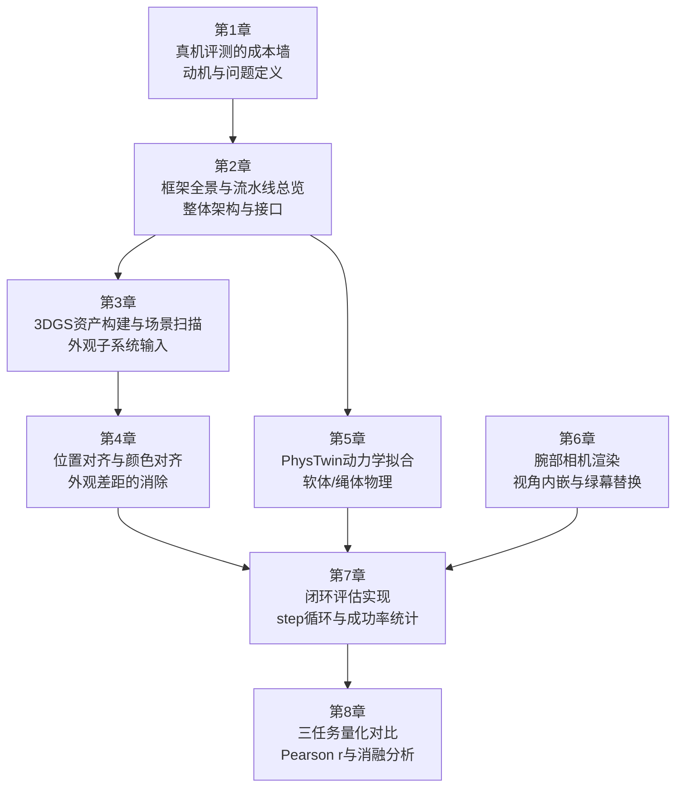

# real2sim-eval 深度解析：用高斯溅射仿真评测机器人策略

机器人策略评测长期依赖真机运行，每一轮评估都消耗真实的机器人时间、操作员精力和实验室资源。当策略训练规模扩大到基础模型量级时，这道成本墙变得难以逾越：数十个 checkpoint 中只有极少数能送上真机测试，选哪几个本身就是一个高风险决策。real2sim-eval（ICRA 2026）提出一条不同的路径——用 3D Gaussian Splatting（3DGS）重建照片级场景外观，用 PhysTwin 拟合真实物体的动力学，将二者整合为一个闭环仿真环境，让策略在仿真中运行并记录成功率。实验结果显示，仿真成功率与真机成功率的 Pearson 相关系数超过 0.9，而同等条件下 IsaacLab 基线仅达到 0.6 左右。本系列逐层拆解这套方法的每个技术环节。

## 系列简介

real2sim-eval 要解决的核心矛盾是：仿真足够便宜，但"仿真成功"不等于"真机成功"。这个不等价关系来自两个方向的差距，加上一个容易被忽视的协议问题。

**外观差距（Appearance Gap）**：传统仿真器用手工建模的网格和材质渲染图像，颜色、纹理、光照与真实相机图像存在明显偏差。视觉策略（尤其是端到端的 imitation learning 策略）对这种偏差极其敏感——在真机上训练的策略会把仿真渲染图识别为"陌生场景"，动作输出随之漂移。

**动力学差距（Dynamics Gap）**：传统物理引擎以刚体为基础，对软体（毛绒玩具、布料）和绳状物体（线缆、绳子）的模拟严重失真。策略在仿真里抓住了一个"刚体化"的玩具，真机上面对真实的软体时动作序列完全失效。

**评估协议差距（Evaluation Protocol Gap）**：即使外观和动力学都接近真实，如果仿真的初始状态分布、观测视角或成功判定逻辑与真机实验不一致，相关系数同样会崩塌。

本系列八章依次覆盖这三个问题：从动机到整体架构，再到 3DGS 资产构建、位置对齐与颜色对齐、PhysTwin 动力学拟合、腕部相机渲染、闭环评估实现，最后以三个任务的量化对比收尾。

## 适合读者

- 机器人学习方向的研究者，正在为策略训练寻找更可靠的离线评估手段
- 熟悉 3DGS 基础原理，想了解如何把它集成进物理仿真循环的开发者
- 希望理解 sim-to-real 相关系数如何被系统性提升到 0.9 以上的工程师
- 对 PhysTwin、可变形物体仿真或神经辐射场有了解，想看具体落地案例的读者

## 你将获得

读完本系列后，你能够：

- 解释 3DGS + PhysTwin 联合仿真的完整数据流，从 PLY 文件加载到闭环 step 函数
- 理解 KNN 线性混合蒙皮（LBS）如何把数十万个高斯点绑定到千级别的物理控制点
- 知道颜色对齐为什么必须用二次 RGB 变换而不是线性矩阵
- 读懂 `eval_policy_parallel.py` 的多 GPU 分发逻辑并估算加速比
- 在新任务上复现类似流水线所需的关键步骤和易错点

## 章节地图

下图展示八章之间的依赖关系，箭头表示"建议先读前者再读后者"。第 1、2 章构成必读基础，其余章节在此之上各自展开一个技术子系统。

第 3、4 章处理外观子系统；第 5 章处理动力学子系统；第 6 章处理腕部相机这一特殊观测模式；第 7 章把所有子系统接入 Gymnasium 闭环；第 8 章用三个任务的数据验证整个框架。

## 相关背景知识链接

在进入系列正文之前，如果对以下主题不熟悉，建议先阅读：

- **3DGS 原理**：[前置知识：3D Gaussian Splatting 三维场景重建](/前置知识/007a_前置知识_3D_Gaussian_Splatting三维场景重建) — 覆盖高斯表示、球谐系数、可微光栅化和训练流程，是理解第 3、4 章的必要基础。
- **Sim-to-Real 综述**：[Sim-to-Real 迁移综述](/论文综述/S04_Sim_to_Real迁移综述) — 覆盖 domain randomization、system identification 和 real2sim 的历史脉络，帮助理解本系列方法在更大图景中的位置。
