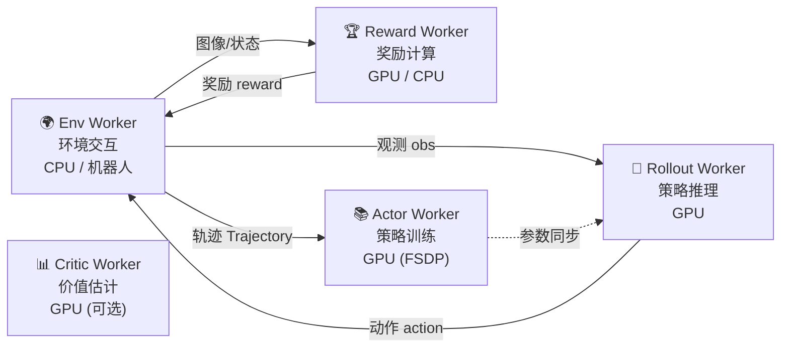

# 全景图与核心概念

> 本章回答三个问题：RLinf 是什么、解决什么问题、整体由哪些模块组成。

## RLinf 一句话定义

RLinf 是一个**分布式强化学习训练框架**，专门为具身智能（机器人）和智能体 AI 设计。它让你可以用 YAML 配置文件描述"我要训练什么模型、在什么环境、用什么算法、用多少 GPU"，然后框架自动完成分布式编排、数据流转和梯度更新。

名字中的 "inf" 既是 Infrastructure（基础设施），也是 Infinite（无限可能）。

## 它解决什么问题

传统的 RL 训练代码面临一个核心矛盾：

**算法研究者**想快速试验新算法、新环境、新模型组合——代码要简洁。

**工程现实**是：RL 训练涉及多个异构组件（环境交互、策略推理、梯度更新、奖励计算），它们的计算特征完全不同，需要不同的硬件和并行策略——系统要复杂。

RLinf 的解法是**宏观流到微观流变换（Macro-to-Micro Flow Transformation）**：

- **宏观流（Macro Flow）**：用户层面看到的就是一个简单的循环——采集数据→计算奖励→更新策略
- **微观流（Micro Flow）**：框架自动把这个循环拆解成多个 Worker，分配到不同 GPU/节点上并行执行，通过 Channel 和 NCCL 通信协调

用户只管宏观流，框架负责微观流。

## 核心术语表

在阅读后续章节前，先把这些术语对齐：

| 术语 | 含义 |
|------|------|
| **Worker** | 一个运行在 Ray Actor 中的进程。RLinf 中所有计算单元都是 Worker。 |
| **Worker Group** | 同一类型 Worker 的集合。如 "ActorGroup" 包含所有 Actor Worker 进程。 |
| **Channel** | Worker 之间的异步消息队列。基于 Ray Actor 实现，支持 put/get、key 路由、批量取。 |
| **Collective** | Worker 之间的高性能张量通信（NCCL/GLOO）。用于参数同步等大数据传输。 |
| **Cluster** | Ray 集群的抽象。管理节点、硬件资源（GPU/机器人）。 |
| **Placement** | 描述"哪个 Worker Group 放在哪些 GPU 上"的映射策略。 |
| **Runner** | 训练主循环。协调所有 Worker Group 的执行顺序。 |
| **Rollout** | 用当前策略在环境中收集经验数据的过程。在 RLinf 中由 Rollout Worker 执行策略推理。 |

## 五大 Worker 角色

RLinf 把 RL 训练拆分为 5 种角色，每种角色是一个 Worker Group：



| Worker | 职责 | 计算特征 | 典型硬件 |
|--------|------|---------|---------|
| **Env Worker** | 运行仿真器或真机，产出观测、奖励、done 信号 | I/O 密集 + 少量 GPU（渲染） | CPU 为主，可选 GPU |
| **Rollout Worker** | 加载策略模型，对观测做推理得到动作 | GPU 推理 | GPU |
| **Actor Worker** | 用收集到的轨迹数据做策略梯度更新 | GPU 训练（FSDP/Megatron） | GPU |
| **Reward Worker** | 用奖励模型或规则计算奖励 | 可选 GPU 推理 | GPU / CPU |
| **Critic Worker** | 估计状态价值（PPO 中使用） | GPU 训练 | GPU（可与 Actor 合并） |

## 两种执行模式

### 同步模式（EmbodiedRunner）

每一步严格顺序执行：

```
同步权重 → 环境交互 + 策略推理 → 收集轨迹 → 计算优势 → 策略更新 → 下一步
```

优点：实现简单、调试方便。缺点：GPU 利用率低（推理时训练 GPU 空闲，训练时推理 GPU 空闲）。

### 异步模式（AsyncEmbodiedRunner）

环境交互和策略推理**持续运行**，Actor 从 Channel 中持续拉取轨迹数据进行训练：

```
Env + Rollout: 持续产出轨迹 → Channel
Actor: 持续从 Channel 拉数据 → 训练 → 权重同步回 Rollout
```

优点：GPU 利用率高，吞吐量提升 2.4 倍。缺点：权重同步有延迟（off-policy 偏差），需要 importance sampling 修正。

## 两个训练后端

| 后端 | 适用场景 | 优点 | 缺点 |
|------|---------|------|------|
| **FSDP** (+ HuggingFace) | 快速原型、单机多卡、模型 < 30B | 配置简单、兼容 HuggingFace 模型 | 大规模效率不如 Megatron |
| **Megatron** (+ SGLang/vLLM) | 大规模训练、多机多卡、模型 > 30B | Tensor/Pipeline 并行、极致效率 | 配置复杂、需要模型转换 |

大部分具身 RL 场景使用 FSDP 后端即可（VLA 模型通常 3B-7B）。

## 配置驱动的设计

RLinf 的一切行为都由 YAML 配置决定。一个完整配置包含以下顶层 section：

```yaml
cluster:          # 集群拓扑：几个节点、Worker 怎么放
runner:           # 训练循环：多少步、多久保存、多久评估
algorithm:        # 算法参数：PPO/GRPO/SAC、clip ratio、gamma、group_size
env:              # 环境配置：哪个仿真器、多少并行环境、最大步数
rollout:          # 推理配置：后端选择、pipeline stage 数
actor:            # 训练配置：batch size、学习率、FSDP 策略
reward:           # 奖励配置：是否用奖励模型
critic:           # Critic 配置：是否使用独立 Critic
```

这些 section 的每一个参数都会在后续章节逐一详解。

## RLinf 支持的算法一览

| 算法 | `algorithm.loss_type` | `algorithm.adv_type` | 特点 |
|------|---------------------|---------------------|------|
| PPO (Actor-Critic) | `actor_critic` | `gae` | 完整 PPO，含 Critic 价值网络 |
| GRPO | `actor` | `grpo` | 无 Critic，用组内相对排名作 baseline |
| DAPO | `actor` | `grpo` | GRPO 变体，动态 clip ratio |
| Reinforce++ | `actor` | `reinpp` | Reinforce++ baseline |
| SAC | `embodied_sac` | — | Off-policy，连续动作空间 |
| DAgger | `embodied_dagger` | — | 模仿学习 + 在线修正 |
| DSRL | `embodied_sac` | — | 扩散策略的 SAC 微调 |
| NFT | `embodied_nft` | — | Step-level fine-tuning |

## 下一章预告

[第 02 章](./02_启动流程_从YAML到分布式集群) 将从 `train_embodied_agent.py` 的第一行开始，逐行追踪 RLinf 从读取 YAML 配置到启动完整分布式集群的全过程。
