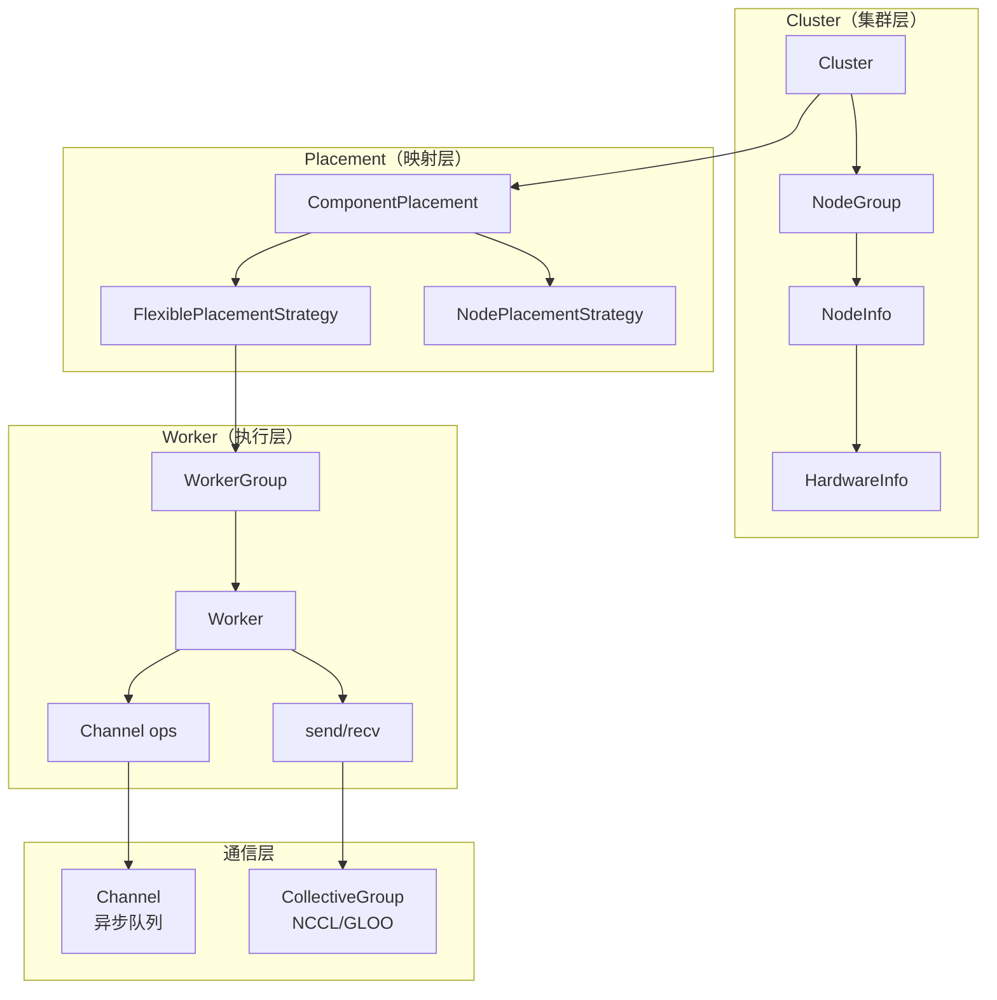

# Scheduler 调度系统

> 前情提要：上一章追踪了从 YAML 到分布式集群的启动流程。本章深入 `rlinf/scheduler/` 目录，详解四大子系统。

`rlinf/scheduler/` 是 RLinf 的调度核心，负责集群管理、Worker 编排、通信协调。它由 6 个子模块构成：

```
rlinf/scheduler/
├── cluster/            # 集群拓扑抽象
├── placement/          # Worker → 硬件的映射
├── worker/             # Worker 基类与 WorkerGroup
├── channel/            # 异步消息队列
├── collective/         # NCCL/GLOO 张量通信
├── hardware/           # 硬件描述（GPU、机器人等）
├── manager/            # 管理器入口
└── dynamic_scheduler/  # 动态调度（自动扩缩）
```

## 一、Cluster：集群拓扑抽象

### 核心类

| 类 | 文件 | 职责 |
|---|------|------|
| `Cluster` | `cluster/cluster.py` | 顶层集群对象，封装 Ray 集群信息 |
| `NodeGroupInfo` | `cluster/node.py` | 一组同类节点的描述（如"8 卡 A800"） |
| `NodeInfo` | `cluster/node.py` | 单个节点的描述（IP、GPU 数、硬件类型） |
| `ClusterEnvVar` | `cluster/config.py` | 管理集群环境变量 |

### Cluster 初始化做了什么

```python
cluster = Cluster(cluster_cfg=cfg.cluster)
```

1. 如果 Ray 未初始化，调用 `ray.init(address="auto")`
2. 从 Ray 获取所有节点信息（IP、资源）
3. 根据 `cluster_cfg` 中的 `num_nodes` 和 `node_groups` 构建节点组
4. 暴露 `cluster.num_nodes`、`cluster.nodes` 等属性

### 节点组（Node Group）

当集群中有异构硬件时，用 node_groups 分组：

```yaml
cluster:
  node_groups:
    - label: a800
      num_nodes: 2
      accelerator_per_node: 8
    - label: robot
      num_nodes: 1
      hardware_type: franka      # 自定义硬件类型
      hardware_per_node: 2
```

这让 Placement 可以把 Actor 放 A800、Env 放机器人节点。

## 二、Placement：Worker 到硬件的映射

### 设计目标

把一行配置 `actor,env,rollout: 0-7` 转换成具体的"第 N 个进程运行在第 M 号 GPU 上"。

### 类层次

```
ComponentPlacement          # 解析 cluster.component_placement 配置
├── FlexiblePlacementStrategy   # 基于 GPU/加速器的放置
├── NodePlacementStrategy       # 基于节点的放置（无 GPU 场景）
└── PackedPlacementStrategy     # 紧凑放置（测试/单机用）
```

### FlexiblePlacementStrategy 的核心逻辑

解析 `0-3:0-7` 这种配置后，它会计算：

```python
# 输入：4 个 GPU (0-3)，8 个进程 (0-7)
# 输出：每个 GPU 承载 2 个进程

process_to_resource = {
    0: [0], 1: [0],   # 进程 0,1 → GPU 0
    2: [1], 3: [1],   # 进程 2,3 → GPU 1
    4: [2], 5: [2],   # 进程 4,5 → GPU 2
    6: [3], 7: [3],   # 进程 6,7 → GPU 3
}
```

也支持反向：

```python
# 输入：8 个 GPU (0-7)，4 个进程 (0-3)
# 输出：每个进程占 2 个 GPU

process_to_resource = {
    0: [0, 1],   # 进程 0 → GPU 0,1
    1: [2, 3],   # 进程 1 → GPU 2,3
    2: [4, 5],   # 进程 2 → GPU 4,5
    3: [6, 7],   # 进程 3 → GPU 6,7
}
```

### MultiNodeGroupResolver

当 Placement 跨多个 node_group 时（如 `node_group: "a800,4090"`），`MultiNodeGroupResolver` 负责把全局硬件编号映射到具体 node_group 的本地编号：

```
全局 GPU 0-7  → a800 节点的 GPU 0-7
全局 GPU 8-15 → 4090 节点的 GPU 0-7
```

### 共享 GPU 场景

当配置写 `actor,env,rollout: 0-7` 时，三个组**共享**同一组 GPU。RLinf 通过 `enable_offload` 机制解决显存竞争：

- Actor 训练时：Rollout 模型 offload 到 CPU
- Rollout 推理时：Actor 模型 offload 到 CPU
- 同一时刻只有一个模型在 GPU 上

## 三、Channel：异步消息队列

### 设计定位

Channel 是 Worker 之间传递**任意 Python 对象**的异步队列。它基于 Ray Actor 实现，语义类似 `asyncio.Queue`。

### 使用方式

```python
# 创建（通常在 Runner 中）
channel = Channel.create("Env", maxsize=0)

# 生产者（Env Worker）
channel.put(env_output)                          # 同步
channel.put(env_output, async_op=True).wait()    # 异步

# 消费者（Rollout Worker）
data = channel.get()                              # 同步阻塞
data = await channel.get(async_op=True).async_wait()  # 异步

# 支持 key 路由
channel.put(data, key="task_42")
data = channel.get(key="task_42")

# 支持带权重的批量获取
channel.put(item1, weight=1)
channel.put(item2, weight=2)
batch = channel.get_batch(target_weight=3)  # 取出 weight 总和 ≥ 3 的数据
```

### Channel 的三种模式

| 模式 | 创建方式 | 特点 |
|------|---------|------|
| **Local** | `Channel.create("x", local=True)` | 进程内通信，零拷贝，不可跨进程 |
| **Single-node** | `Channel.create("x")` | 单节点 Ray Actor，跨进程序列化 |
| **Distributed** | `Channel.create("x", distributed=True)` | 每节点一个 Channel Worker，本地优先路由 |

### ChannelWorker 内部

Channel 的后端是一个 Ray Actor（`ChannelWorker`），内部维护一个 `asyncio.Queue`。高并发场景下 `max_concurrency` 设为 `2^31 - 1` 以避免大量 get 阻塞 put。

## 四、Collective：高性能张量通信

### 与 Channel 的区别

| | Channel | Collective |
|---|---------|-----------|
| 数据类型 | 任意 Python 对象 | torch.Tensor |
| 传输方式 | Ray Actor 序列化 | NCCL (GPU) / GLOO (CPU) |
| 吞吐量 | 中等 | 极高（直接 GPU 通信） |
| 使用场景 | 轨迹数据、控制信号 | 模型参数同步 |

### Worker.send() / Worker.recv()

RLinf 在 `Worker` 基类中封装了统一的 `send()`/`recv()` API，内部自动选择通信后端：

```python
# Actor Worker 发送模型参数给 Rollout
await self.send(
    state_dict,                    # Dict[str, Tensor]
    dst_group_name="RolloutGroup", # 目标 Worker Group
    dst_rank=0,                    # 目标 rank
    async_op=True,
    options=CollectiveGroupOptions(accel_max_ctas=2),
)

# Rollout Worker 接收
param_state_dict = await self.recv(
    "ActorGroup",
    src_rank=self.actor_weight_src_rank,
    async_op=True,
).async_wait()
```

### 传输协议选择

`CollectiveGroup` 根据数据类型自动选择协议：

| 数据类型 | 协议 | 传输通道 |
|---------|------|---------|
| GPU Tensor | `TENSOR` | NCCL |
| `List[GPU Tensor]` | `TENSOR_LIST` | NCCL |
| `Dict[str, GPU Tensor]` | `TENSOR_DICT` | NCCL |
| Dataclass with Tensors | `DATACLASS_WITH_TENSORS` | NCCL + GLOO |
| CPU Tensor / Python object | `OBJECT` | GLOO（序列化为 CPU tensor） |

### CollectiveGroupOptions

精调 NCCL 通信性能的参数：

```python
@dataclass
class CollectiveGroupOptions:
    accel_cluster_size: Optional[int] = None     # NCCL cluster size
    accel_max_ctas: Optional[int] = None         # GPU SM 占用上限
    accel_min_ctas: Optional[int] = None         # GPU SM 占用下限
    is_high_priority_stream: bool = False         # 是否用高优先级 CUDA stream
```

`accel_max_ctas` 控制 NCCL 使用多少 SM（流多处理器）做通信。值越大通信越快但抢占计算资源越多。参数同步通常设 2-4。

## 五、Worker 基类

### Worker 的职责

`rlinf/scheduler/worker/worker.py` 中的 `Worker` 类是所有计算单元的基类。它提供：

1. **生命周期管理**：`create_group()` → `launch()` → `init_worker()` → 业务方法 → 销毁
2. **通信能力**：`send()`、`recv()`、`broadcast()`
3. **Channel 操作**：`create_channel()`、`connect_channel()`
4. **日志**：`self.log_info()`、`self.log_warning()`
5. **设备管理**：`self.torch_platform`、`self.device`
6. **计时器**：`@Worker.timer("name")` 装饰器

### WorkerMeta 元类

Worker 使用 `WorkerMeta` 元类，它会自动包装所有公开方法以捕获 `SystemExit`，防止 Ray Actor 静默崩溃。

### WorkerGroup

`WorkerGroup` 是 Worker 的集合管理器。调用 `worker_group.some_method()` 会自动在所有 Worker 上并行调用，返回 `WorkerGroupFuncResult`（Handle）：

```python
handle = actor_group.run_training()  # 在所有 Actor Worker 上并行调用
results = handle.wait()              # 等待所有 Worker 完成，收集结果
duration = handle.consume_duration() # 获取执行耗时
```

## 六、Hardware 硬件描述

`rlinf/scheduler/hardware/` 定义了 RLinf 支持的硬件类型：

```python
class AcceleratorType(Enum):
    NO_ACCEL = "no_accel"    # 无加速器（纯 CPU）
    CUDA = "cuda"            # NVIDIA GPU
    ASCEND = "ascend"        # 华为 Ascend NPU
    MUSA = "musa"            # 摩尔线程 GPU
```

`hardware/robots/` 目录包含机器人硬件的描述（用于真机 RL 场景）。

## 模块协作总结



## 下一章预告

[第 04 章](./04_Worker体系_五大角色详解) 将深入每个 Worker 的具体实现：Actor Worker 如何用 FSDP 训练、Rollout Worker 如何做推理、Env Worker 如何管理仿真器。
