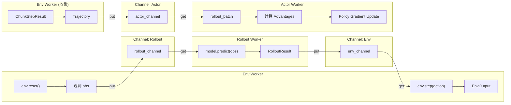
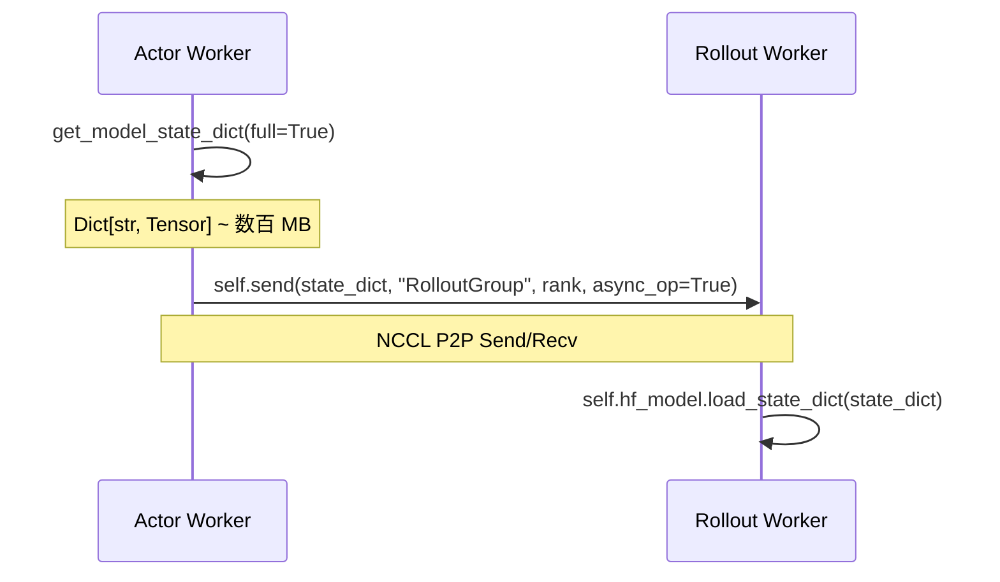

# 数据流与通信机制

> 前情提要：上一章详解了五大 Worker 的实现。本章追踪数据从环境产生到梯度更新的完整路径。

## 数据流全景图



## 核心数据结构

### EnvOutput：环境产出

```python
@dataclass
class EnvOutput:
    obs: dict[str, Any]              # 观测字典
    final_obs: Optional[dict]        # 最终观测（episode 结束时）
    dones: Optional[torch.Tensor]    # [B] 是否结束
    terminations: Optional[torch.Tensor]  # [B] 是否因任务完成结束
    truncations: Optional[torch.Tensor]   # [B] 是否因超时截断
    rewards: Optional[torch.Tensor]  # [B] 单步奖励
```

`obs` 字典的标准结构：

| 字段 | 形状 | 含义 |
|------|------|------|
| `main_images` | `[B, H, W, C]` | 主相机图像 |
| `wrist_images` | `[B, H, W, C]` 或 `[B, N, H, W, C]` | 腕部相机图像 |
| `extra_view_images` | `[B, N, H, W, C]` | 额外视角图像 |
| `states` | `[B, D]` | 机器人关节状态 |
| `task_descriptions` | `List[str]` | 任务描述文本 |

所有张量在 `__post_init__` 中自动搬到 CPU（避免跨进程传输时 GPU 内存泄漏）。

### RolloutResult：推理产出

```python
@dataclass
class RolloutResult:
    actions: torch.Tensor           # [B, num_action_chunks, action_dim]
    prev_logprobs: Optional[torch.Tensor]   # [B, num_action_chunks] 或 token-level
    prev_values: Optional[torch.Tensor]     # [B, 1] 价值估计
    bootstrap_values: Optional[torch.Tensor] # [B, 1] 最后一步的 V(s')
    save_flags: Optional[torch.Tensor]      # [B, chunks] DAgger 用
    forward_inputs: Optional[dict]          # 模型前向输入（用于 Actor 重算 logprobs）
    versions: Optional[torch.Tensor]        # [B, chunks] 模型版本号
```

`versions` 字段在异步模式下很关键——Actor 可以根据版本号判断数据是哪个版本的策略产出的，用于 importance sampling 修正。

### ChunkStepResult：单步结果

一个 chunk step（`num_action_chunks` 步）的完整记录：

```python
@dataclass
class ChunkStepResult:
    actions: torch.Tensor           # 动作
    rewards: torch.Tensor           # 奖励
    dones: torch.Tensor             # 结束标志
    terminations: torch.Tensor      # 终止标志
    truncations: torch.Tensor       # 截断标志
    prev_logprobs: Optional[torch.Tensor]
    prev_values: Optional[torch.Tensor]
    bootstrap_values: Optional[torch.Tensor]
    forward_inputs: Optional[dict]
    versions: Optional[torch.Tensor]
```

### Trajectory：轨迹

Env Worker 收集多个 ChunkStepResult 后组装成 Trajectory 发送给 Actor：

```python
@dataclass
class Trajectory:
    actions: torch.Tensor        # [T, B, chunks, action_dim]
    rewards: torch.Tensor        # [T, B, chunks]
    dones: torch.Tensor          # [T+1, B, chunks]  (多一步用于 GAE)
    terminations: torch.Tensor   # [T+1, B, chunks]
    truncations: torch.Tensor    # [T+1, B, chunks]
    prev_logprobs: torch.Tensor  # [T, B, chunks]
    prev_values: torch.Tensor    # [T+1, B, 1]
    forward_inputs: dict         # [T, B, ...] 模型输入缓存
    versions: torch.Tensor       # [T, B, chunks]
```

其中 `T = n_chunk_steps`（每个 rollout epoch 的 chunk 数），`B` = 该 Worker 管理的环境数。

## 数据流详细追踪

### 阶段 1：Env → Rollout（观测传输）

```python
# Env Worker 中
env_output = EnvOutput(
    obs=self.prepare_observations(obs),
    dones=dones, rewards=rewards, ...
).to_dict()
rollout_channel.put(env_output, key=channel_key)
```

Channel key 用于路由：确保同一组环境的观测发给同一个 Rollout Worker。key 的生成：

```python
# CommMapper.build_channel_key()
channel_key = f"rank_{env_rank}_stage_{stage_idx}"
```

### 阶段 2：Rollout → Env（动作传输）

```python
# Rollout Worker 中
actions, result = self.predict(env_output["obs"])
rollout_result = RolloutResult(actions=actions, prev_logprobs=..., ...)
output_channel.put(rollout_result.to_dict(), key=channel_key)
```

### 阶段 3：Env 积累轨迹

Env Worker 在一个 rollout epoch 内收集 `n_chunk_steps` 个 ChunkStepResult：

```python
# 伪代码
chunk_results = []
for step in range(n_chunk_steps):
    # 发送 obs → 接收 action → step → 记录
    chunk_results.append(ChunkStepResult(...))

# 组装为 Trajectory
trajectory = Trajectory.from_chunk_steps(chunk_results)
```

### 阶段 4：Env → Actor（轨迹传输）

```python
# Env Worker 中
actor_channel.put(trajectory)
```

如果有多个 Env Worker 和 Actor Worker，数据会根据 `compute_split_num()` 决定每个 Actor 接收几份：

```python
send_num = env_world_size * stage_num  # Env 端发送的总份数
recv_num = actor_world_size            # Actor 端接收者数
split_num = ceil(send_num / recv_num)  # 每个 Actor 接收几份
```

### 阶段 5：Actor 处理轨迹

```python
# Actor Worker 中
recv_list = [channel.get() for _ in range(split_num)]
rollout_batch = convert_trajectories_to_batch(recv_list)

# reshape: [rollout_epoch × T, B, ...] → [T, rollout_epoch × B, ...]
rollout_batch = process_nested_dict_for_adv(rollout_batch, rollout_epoch)
```

这个 reshape 很关键：多个 rollout epoch 的数据被合并到 batch 维度，让 GAE 能正确计算。

## M:N 通信拓扑

当 Env Worker 数 ≠ Rollout Worker 数时，需要数据分片或合并。RLinf 使用 `CommMapper` 处理：

### 场景：4 Env + 2 Rollout

```
Env 0 (16 envs) → Rollout 0 (处理 32 envs)
Env 1 (16 envs) ↗
Env 2 (16 envs) → Rollout 1 (处理 32 envs)
Env 3 (16 envs) ↗
```

每个 Rollout Worker 的 `src_ranks` = `[0, 1]` 或 `[2, 3]`。

### 场景：2 Env + 4 Rollout

```
Env 0 (32 envs) → 拆成两份 → Rollout 0 (16 envs) + Rollout 1 (16 envs)
Env 1 (32 envs) → 拆成两份 → Rollout 2 (16 envs) + Rollout 3 (16 envs)
```

Env Worker 使用 `split_dict_to_chunk()` 把观测按 batch 维度切分后发送。

## 参数同步数据流

Actor → Rollout 的模型参数同步走 Collective（NCCL），不走 Channel：



为什么不走 Channel？因为模型参数很大（3B 模型 ~6GB），Channel 走 Ray 序列化太慢，NCCL 直接走 GPU 高速互连。

## Replay Buffer（SAC 模式）

SAC 等 off-policy 算法使用 `TrajectoryReplayBuffer` 存储历史轨迹：

```python
class TrajectoryReplayBuffer:
    def __init__(self, max_size, save_dir=None):
        self._cache = TrajectoryCache(max_size)  # 内存 FIFO 缓存
        self._disk_dir = save_dir                # 可选磁盘持久化
    
    def add(self, trajectory: dict):
        self._cache.insert(trajectory)
    
    def sample(self, batch_size: int) -> dict:
        indices = np.random.randint(0, len(self._cache), batch_size)
        return self._cache.get_batch(indices)
```

`TrajectoryCache` 使用预分配的连续内存（flat buffer），新轨迹以 FIFO 方式覆盖旧数据。

## 下一章预告

[第 06 章](./06_训练后端_FSDP与Megatron) 将深入 FSDP 训练后端的实现细节：模型如何被 wrap、梯度如何累积、mixed precision 如何配置。
