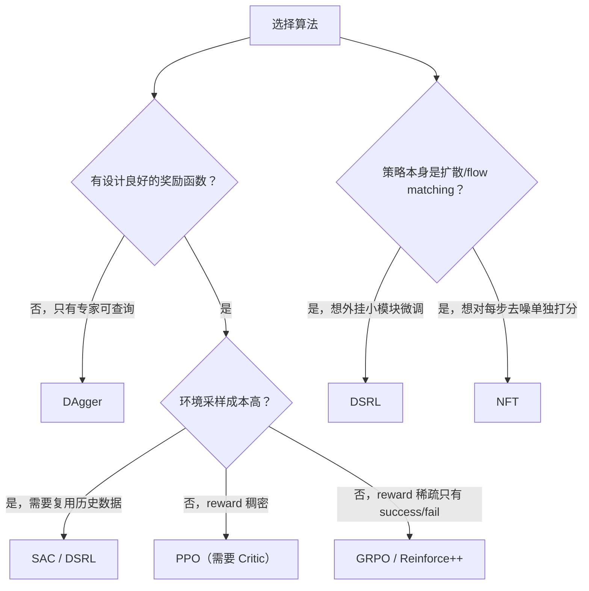

# 算法实现：SAC 与其他算法

> 前情提要：前两章讲的 PPO 和 GRPO 都是 on-policy 算法——用当前策略采一批数据，训一步，数据就扔了。本章看几种完全不同思路的算法：能反复复用历史数据的 SAC，靠专家纠错而不是奖励函数的 DAgger，以及在扩散策略上的两种变体 DSRL 和 NFT。

## 一、为什么 PPO/GRPO 不够用

PPO 和 GRPO 有一个共同的前提：每次用的都是"刚采集出来的新鲜数据"，训完就丢掉，下一步重新采集。这在 reward 稠密、采样成本不高的场景下没问题，但会遇到两类新问题：

- **采样成本高**：如果每次和环境交互都很贵（比如真实机器人而不是仿真器），"训一步就丢弃数据"太浪费——这时候需要能够反复复用历史数据的 off-policy 方法，也就是 SAC。
- **没有奖励函数，只有专家示范**：有些任务很难设计出一个靠谱的 reward，但可以请一个专家策略（或人类）实时纠正学生的错误动作——这时候训练目标根本不是"最大化累积奖励"，而是"让学生学会模仿专家在这个状态下的动作"，这是 DAgger 的场景。

RLinf 通过 `algorithm.loss_type` 这一个配置项来切换到完全不同的 Actor Worker 实现——不同算法需要维护的状态（要不要 Critic、要不要 Replay Buffer、要不要专家模型）差异太大，用同一套 Worker 硬套反而更复杂：

```yaml
algorithm:
  loss_type: embodied_sac   # 切换到 SAC Worker
```

```python
if cfg.algorithm.loss_type == "embodied_sac":
    from rlinf.workers.actor.fsdp_sac_policy_worker import EmbodiedSACFSDPPolicy
    actor_worker_cls = EmbodiedSACFSDPPolicy
```

## 二、SAC：让旧数据也能反复训练

### 2.1 SAC 比 PPO 多管了什么

SAC（Soft Actor-Critic）是 off-policy 算法，核心区别是**数据可以反复用**：训练时不是直接用刚采集的这批轨迹，而是把新采集的数据存进一个 Replay Buffer，每次训练从 Buffer 里随机采样一批（可能包含很旧的数据）。这个设计带来了额外的复杂度——`EmbodiedSACFSDPPolicy` 继承 `EmbodiedFSDPActor`，在标准 PPO Actor 的基础上多管理这几样东西：

- **Replay Buffer**：`TrajectoryReplayBuffer`，存储历史轨迹，训练时随机采样
- **双 Q 网络 + 目标网络**：估计 state-action 价值，目标网络是 Q 网络的滑动平均（EMA）版本，用于稳定训练目标
- **温度参数 α**：控制策略探索性（熵）权重的大小，可以固定也可以自动调节

### 2.2 目标网络：为什么不直接用当前的 Q 网络算目标

SAC 训练 Q 网络时，需要一个"目标值"来算 TD 误差——但如果这个目标值也用当前正在更新的 Q 网络去算，会出现"自己追自己尾巴"的不稳定问题（目标值和被训练的值同时在变化，容易发散）。解法是维护一份 Q 网络的**滑动平均副本**（目标网络），每一步用当前网络"轻微更新"目标网络，而不是直接复制：

```python
def soft_update_target_model(self, tau=None):
    if tau is None:
        tau = self.cfg.algorithm.tau
    for (name1, online_param), (name2, target_param) in zip(
        self.model.named_parameters(), self.target_model.named_parameters()
    ):
        target_param.data.mul_(1.0 - tau)
        target_param.data.add_(online_param.data * tau)
```

`tau=0.005` 意味着目标网络每一步只往当前网络的方向挪动 0.5%——这个"挪得很慢"的性质正是稳定性的来源：目标值在训练过程中变化得非常平滑，Q 网络有一个相对稳定的目标可以追，不会出现前面说的"自己追自己"的震荡。初始化时会调用一次 `tau=1.0`（也就是完全复制），之后训练中才用默认的小 `tau`。

### 2.3 自动调节的温度参数

SAC 的目标函数里除了最大化累积奖励，还要最大化策略的熵（鼓励探索、避免过早收敛到局部最优），这个熵项前面乘的系数就是温度参数 `alpha`。手动设一个固定值不太好调——策略训练过程中，"探索多少才合适"是会变化的。RLinf 提供了自动调节这个参数的能力：

```yaml
algorithm:
  tau: 0.005
  alpha: 0.2
  auto_alpha: True
  target_entropy: -6
```

`auto_alpha: True` 时，`alpha` 不再是一个固定超参数，而是变成一个可学习的参数，训练目标是让策略的实际熵尽量接近 `target_entropy`——如果当前策略的熵比目标值低（探索不足），就自动调大 `alpha`（增加探索的权重）；反之调小。这样不需要手动反复试探"多大的 alpha 合适"，训练过程会自己找到合适的探索强度。

### 2.4 为什么 SAC 天然适合异步模式

回顾 [第 07 章](./07_Runner训练循环#三异步模式不再互相等待)讲过的同步/异步之分：同步模式要求"采集完一批，训练一步，再采集下一批"，这对 on-policy 算法（PPO/GRPO）是必须的，因为它们要求训练用的数据必须是当前策略产出的。但 SAC 本来就设计成可以用历史数据训练——Replay Buffer 里本身就混着不同时期采集的数据,"数据新不新鲜"这个问题对 SAC 来说不是必须严格保证的约束。所以 SAC 几乎总是配合异步 Runner（`AsyncEmbodiedSACFSDPPolicy`）使用：Env+Rollout 持续往 Buffer 里灌数据，Actor 持续从 Buffer 里采样训练，两条线完全不用互相等待。

## 三、DAgger：没有奖励函数，靠专家纠错

### 3.1 核心思路：学生走错了，专家立刻纠正

DAgger（Dataset Aggregation）适用于一种特殊场景：没有设计良好的 reward，但有一个可以实时查询的专家策略（可能是更强的模型，也可能是人类遥操作）。核心思路是：让学生策略实际执行任务，但**执行过程中随时可能被专家介入纠正**，专家纠正时给出的"正确动作"就是监督信号，训练学生模仿这些纠正。

这个"随时可能被介入"的机制,由一个概率 `beta` 控制,发生在 Rollout Worker 推理的那一刻——不是固定切换,而是每一步都按概率决定这一步谁来出动作:

```python
use_expert = torch.rand(1).item() < self._dagger_sampling_params["beta"]
```

`beta=0.5` 意味着大约一半的步是专家在操作、一半是学生自己在操作。专家操作的这些步会被标记出来，成为训练数据（学生自己操作的步不需要专家标注"正确答案"，没法用来做监督训练）。

### 3.2 beta 会随训练衰减

训练刚开始时学生几乎不会做对，需要专家介入得更频繁；随着学生越来越好，应该逐渐减少专家的介入，让学生更多地自主探索（同时暴露出自己还没学会的情况，供专家继续纠正）。这个"逐渐减少依赖"通过 `beta_schedule` 控制：

```yaml
algorithm:
  dagger:
    init_beta: 0.5
    beta_schedule: exponential
    beta_decay: 0.99
    beta_min: 0.05
```

```python
def update_dagger_beta(self):
    if self._dagger_sampling_params["beta_schedule"] == "exponential":
        self._dagger_sampling_params["beta"] = max(
            self._dagger_sampling_params["beta_min"],
            self._dagger_sampling_params["beta"] * self._dagger_sampling_params["beta_decay"],
        )
```

每次调用（每个 rollout epoch 开始时）`beta` 都乘以 `0.99`，指数衰减，但设了下限 `beta_min=0.05`——完全去掉专家介入（`beta=0`）意味着学生一旦在某个陌生状态下越走越偏，没有人能把它纠正回来，训练容易崩掉；保留一个小概率的介入，相当于一直留着一个"安全网"。

### 3.3 训练目标：模仿专家动作,不是最大化奖励

DAgger 完全不涉及 reward、advantage 这些强化学习概念——它的 `compute_advantages_and_returns` 直接返回空字典,训练用的是纯监督学习的损失,让学生的动作输出去逼近专家在同一状态下给出的动作:

```python
def compute_advantages_and_returns(self):
    """Skip advantage computation for supervised DAgger updates."""
    return {}
```

真正的训练数据来自"专家介入的那些步"——Trajectory 里会记录哪些步是专家操作的（通过 `extract_intervene_traj` 提取），这些被专家纠正过的片段进入 Replay Buffer，之后 `EmbodiedDAGGERFSDPPolicy.forward_actor` 用监督学习的方式（本质上是行为克隆 loss）训练学生去逼近这些专家动作。

## 四、DSRL：给冻结的扩散策略装一个"转向"模块

DSRL（Diffusion Steering via RL）解决的是另一类问题：如何用 RL 微调一个扩散策略（比如 Pi0 这类基于扩散/flow matching 的 VLA）。直接对扩散模型的采样过程求策略梯度是很困难的（涉及多步迭代去噪，梯度链路又长又不稳定）。DSRL 绕开了这个难题：**完全冻结原来的扩散策略不动**，额外训练一个很小的 SAC agent，让这个小 agent 在扩散去噪过程的每一步上施加一个微小的"转向"修正——相当于不去改造原来那个复杂的大模型，而是外挂一个小模块专门学"怎么把大模型的输出往更好的方向推一点"。

```yaml
algorithm:
  loss_type: embodied_sac
  dsrl:
    steering_scale: 0.1
    num_diffusion_steps: 10
```

之所以 `loss_type` 仍然是 `embodied_sac`——DSRL 本质上就是在用 SAC，只是 SAC 要学习的策略网络不再是整个 VLA，而是一个专门输出"转向修正量"的小型 MLP（steering network）。前面第二节讲的 Replay Buffer、目标网络、自动温度调节这些 SAC 的机制在 DSRL 里原样保留，改变的只是"策略网络长什么样、控制的是什么"。`steering_scale` 限制了这个修正量的强度上限，避免小 agent 学坏了以后把原本还不错的扩散策略输出彻底带偏。

## 五、NFT：给扩散去噪的每一步单独打分

NFT 处理的是另一个和扩散策略相关的问题：传统 RL 只有整条轨迹结束才有一个奖励，但扩散策略的一次动作生成本身要经过多步去噪，如果能对"去噪的每一步"提供中间的学习信号，训练效率会更高。NFT 的做法是把每一步去噪对应的"速度场"输出（flow matching 里预测的方向）当成一个可以被 DPO 式对比学习的对象：给同一个状态生成一个正样本方向和负样本方向，学习让正样本更被偏好：

```python
v_pos = v_old + beta * delta_v_clipped   # 正样本方向：往优势更高的方向推
v_neg = v_old - beta * delta_v_clipped   # 负样本方向：往优势更低的方向推
logit = (dpo_beta / 2.0) * y * delta_e
nft_loss = masked_mean(F.softplus(logit), loss_mask)
```

这里 `y * delta_e` 的直觉是：`y` 编码了"这条轨迹的优势是正是负"，`delta_e` 是正负样本之间在能量（对数概率）上的差异，两者相乘再过 `softplus` 得到一个类似 DPO 的对比损失——优势为正的轨迹，希望模型更倾向于 `v_pos` 这个方向；优势为负的轨迹，希望模型更倾向于 `v_neg`。`beta` 和 `dpo_beta` 分别控制"正负样本方向拉开的幅度"和"对比损失的锐利程度"，属于需要根据具体任务调的超参数，不需要死记数值。

## 六、Reinforce++：不用组内比较,用全局标准化

前两章看到 GRPO 靠"组内比较"得到优势估计，Reinforce++ 提供了一个更简单的替代方案：不分组，直接把每条轨迹的最终 reward 放到轨迹的最后一步（其余步都是 0），再往前累加成 return，最后对整个 batch（而不是组内）做标准化：

```python
r_matrix = torch.zeros_like(loss_mask).float()
r_matrix.scatter_(dim=0, index=eos_indices, src=rewards)  # reward 放在每条轨迹最后一步

if kl_beta > 0:
    r_matrix -= kl_beta * kl_penalty(logprob, ref_logprob, kl_penalty_type)

ret_matrix = torch.cumsum(r_matrix.flip(dims=[0]), dim=0).flip(dims=[0])  # 从后往前累加
advantages = (ret_matrix - ret_matrix.mean()) / ret_matrix.std()  # 全局标准化，而非组内
```

`use_reinpp_baseline: True` 时会在这之前加一步组内减均值（`rewards -= grouped_rewards.mean()`），相当于 GRPO 的"组内比较"和 Reinforce++ 的"全局标准化"各取一部分——这也是为什么它被称为 Reinforce++ Baseline，是标准 Reinforce++ 上叠加了 baseline 项。三种方式的核心差异可以这样概括：GRPO 完全依赖组内排名，Reinforce++ 完全依赖全局统计，Reinforce++ Baseline 是两者的折中。

## 七、算法怎么选



## 总结

| 算法 | 核心思路 | 不需要什么 | 典型场景 |
|------|---------|-----------|---------|
| SAC | Replay Buffer + 双 Q + 自动温度 | 不需要 on-policy 数据 | 采样成本高、需要复用历史数据 |
| DAgger | 专家按概率介入纠正 | 不需要奖励函数 | 有专家可查询、reward 难设计 |
| DSRL | 冻结扩散策略，外挂 SAC 转向模块 | 不需要对扩散过程求梯度 | 扩散/flow matching 策略的 RL 微调 |
| NFT | 对每步去噪做 DPO 式对比学习 | 不需要等到 episode 结束才有信号 | 扩散策略，想要更密集的训练信号 |
| Reinforce++ | 全局标准化替代组内比较 | 不需要同任务多次 rollout | 想要 GRPO 效果但环境不便"多次跑同一任务" |

## 下一章预告

[第 11 章](./11_环境接入与模型适配) 将讲解如何在 RLinf 中接入新的仿真器环境和新的 VLA 模型。
