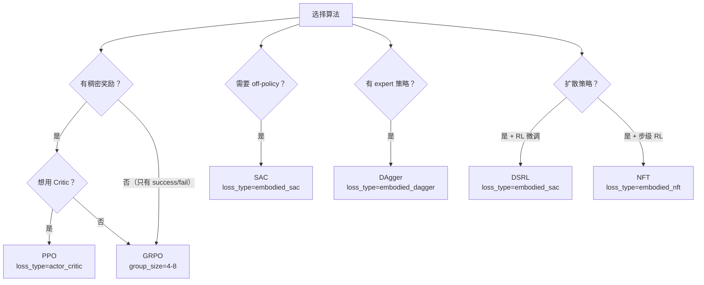

# 算法实现：SAC 与其他算法

> 前情提要：上一章详解了 GRPO 配置。本章覆盖 RLinf 中除 PPO/GRPO 外的其他算法变体。

## SAC (Soft Actor-Critic)

### 何时用 SAC

- 连续动作空间
- 需要 sample efficiency（off-policy，可以复用历史数据）
- 适合 MLP/CNN 策略或 Flow-based 策略

### 核心差异

```yaml
algorithm:
  loss_type: embodied_sac   # 触发 SAC Worker
```

这会选择 `EmbodiedSACFSDPPolicy` 作为 Actor Worker：

```python
if cfg.algorithm.loss_type == "embodied_sac":
    from rlinf.workers.actor.fsdp_sac_policy_worker import EmbodiedSACFSDPPolicy
    actor_worker_cls = EmbodiedSACFSDPPolicy
```

### SAC Worker 的特殊性

与 PPO Actor 相比，SAC Worker 额外管理：

1. **Replay Buffer**：存储历史轨迹，训练时从中采样
2. **Q 网络**（双 Q）：估计 state-action 价值
3. **目标网络**：Q 网络的 EMA 版本
4. **温度参数 α**：自动调节 entropy 权重

### SAC 配置示例

```yaml
algorithm:
  loss_type: embodied_sac
  sac:
    tau: 0.005              # 目标网络 EMA 系数
    alpha: 0.2              # 初始温度
    auto_alpha: True        # 自动调节 alpha
    target_entropy: -6      # 目标熵（auto_alpha 时使用）
    replay_buffer_size: 100000
    batch_size: 256
    warmup_steps: 1000      # 随机探索步数
    update_to_data_ratio: 1 # UTD ratio
```

### Async SAC Runner

SAC 天然适合异步模式（`AsyncEmbodiedRunner`）：
- Env + Rollout 持续采集数据 → 放入 Replay Buffer
- Actor 持续从 Buffer 采样 → 训练
- 无需等待同步

对应 Worker：`AsyncEmbodiedSACFSDPPolicy`。

## DSRL (Diffusion Steering via RL)

### 原理简述

DSRL 用于微调扩散策略（如 Pi0）。核心思想：

- 冻结预训练的扩散策略
- 训练一个轻量级 SAC agent 在扩散噪声空间中进行"转向"
- SAC agent 学习对去噪过程的每一步施加一个小修正

### 配置差异

```yaml
algorithm:
  loss_type: embodied_sac    # 使用 SAC 训练 steering agent
  dsrl:
    steering_scale: 0.1      # steering 修正的强度
    num_diffusion_steps: 10  # 扩散步数
```

### Worker 复用

DSRL 复用 `EmbodiedSACFSDPPolicy`，但策略模型结构不同——它是一个小型 MLP（steering network），而不是整个 VLA。

## DAgger (Dataset Aggregation)

### 何时用 DAgger

- 有一个 expert 策略可以实时查询
- 想在模仿学习基础上做在线修正
- 不需要奖励函数

### 核心机制

```
1. 用学生策略执行动作
2. 用教师策略标注"正确动作"
3. 用教师动作作为监督信号训练学生
4. β-schedule：逐步减少教师介入比例
```

### 配置示例

```yaml
algorithm:
  loss_type: embodied_dagger
  dagger:
    init_beta: 0.5           # 初始教师介入概率
    beta_schedule: exponential # 衰减方式：exponential / linear
    beta_decay: 0.995        # 每步衰减系数

rollout:
  expert_model:
    model_path: "/path/to/expert"  # 教师模型路径
    precision: bf16
```

### DAgger Worker

`EmbodiedDAGGERFSDPPolicy` 的训练 loss 是 BC loss（行为克隆），而不是策略梯度：

```python
loss = MSE(student_actions, expert_actions)  # 或 L1 loss
```

Rollout Worker 中根据 β 概率混合学生和教师的动作：

```python
if random() < beta:
    actions = expert_model.predict(obs)  # 用教师动作
    save_flags = True                    # 标记为可训练数据
else:
    actions = student_model.predict(obs) # 用学生动作
```

## NFT (Step-Level Fine-Tuning)

### 原理

NFT（也叫 step-level RL）对扩散策略做逐步微调：

- 每一步扩散去噪都可以获得一个中间奖励
- 用这些中间奖励做策略梯度
- 比传统 RL（只有 episode 结束才有奖励）更高效

### 配置

```yaml
algorithm:
  loss_type: embodied_nft
```

对应 Worker：`EmbodiedNFTFSDPPolicy`。

## Reinforce++ / Reinforce++ Baseline

### 与 GRPO 的区别

```yaml
algorithm:
  adv_type: reinpp
  use_reinpp_baseline: False  # True 时为 Reinforce++ Baseline
```

Reinforce++ 的 advantage 计算：

```python
@register_advantage("reinpp")
def compute_reinpp_advantages(rewards, loss_mask, group_size, ...):
    # 1. 构建奖励矩阵（奖励放在最后一步）
    r_matrix = zeros_like(loss_mask)
    r_matrix.scatter_(dim=0, index=eos_indices, src=rewards)
    
    # 2. 可选：加 KL 惩罚
    if kl_beta > 0:
        r_matrix -= kl_beta * kl_penalty(logprob, ref_logprob)
    
    # 3. 计算 return（从后往前累加）
    ret_matrix = cumsum(r_matrix.flip(0), dim=0).flip(0)
    
    # 4. 标准化
    advantages = (ret_matrix - mean) / std
```

区别：
- GRPO：组内排名作 baseline
- Reinforce++：全局标准化
- Reinforce++ Baseline：先做组内减去均值，再标准化

## DAPO (Dynamic Clip PPO)

DAPO 是 GRPO 的变体，使用动态 clip ratio：

```yaml
algorithm:
  adv_type: grpo
  loss_type: actor
  # DAPO 特有：不对称 clip
  clip_ratio_high: 0.28     # 更宽松的上界
  clip_ratio_low: 0.2       # 标准下界
```

DAPO 的核心创新在 clip ratio 的动态调整（根据训练进度），但在 RLinf 配置层面主要体现为不对称的 `clip_ratio_high` 和 `clip_ratio_low`。

## 算法选择决策树



## 下一章预告

[第 11 章](./11_环境接入与模型适配) 将讲解如何在 RLinf 中接入新的仿真器环境和新的 VLA 模型。
