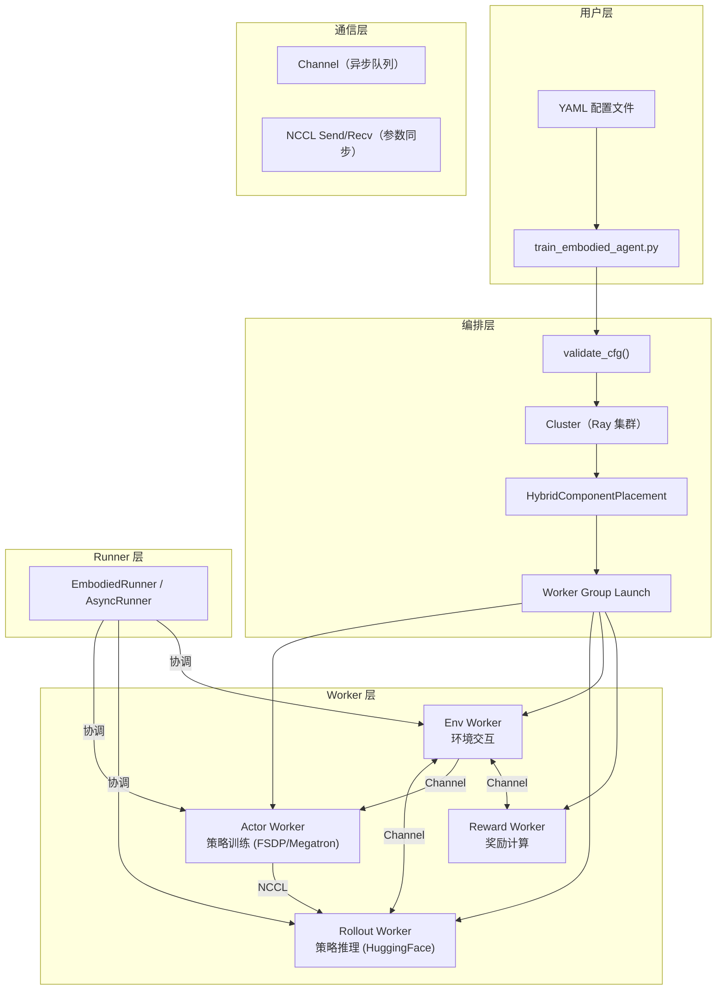

# RLinf 深度解析：具身智能强化学习基础设施完全指南

> 从项目全景到每一行配置参数，让你完全掌握 RLinf 的所有设计细节。

## 系列简介

RLinf 是一个面向具身智能和智能体 AI 的大规模强化学习基础设施框架。本系列的目标是：**让一个完全不了解这个项目的人，读完后能掌握 RLinf 的全部架构细节和使用方法。**

重点放在项目本身：架构设计、模块职责、通信机制、配置系统、算法差异。不讲泛泛的 RL 理论，直接进入项目实战。

**适合读者**：
- 想深度使用或贡献 RLinf 的开发者
- 需要理解 RLinf 内部机制以进行二次开发的工程师
- 对分布式 RL 系统架构感兴趣的研究者

## 章节目录

| 章节 | 标题 | 简介 |
|------|------|------|
| 01 | [全景图与核心概念](./01_全景图与核心概念) | RLinf 在解决什么、整体架构一览、关键术语定义 |
| 02 | [启动流程：从 YAML 到分布式集群](./02_启动流程_从YAML到分布式集群) | Config → Cluster → Placement → Worker 启动的完整链路 |
| 03 | [Scheduler 调度系统](./03_Scheduler调度系统) | Cluster、Placement、Channel、Collective 四大子模块详解 |
| 04 | [Worker 体系：五大角色详解](./04_Worker体系_五大角色详解) | Actor、Rollout、Env、Reward、Critic 的实现与协作 |
| 05 | [数据流与通信机制](./05_数据流与通信机制) | EnvOutput → RolloutResult → Trajectory 的完整数据流转 |
| 06 | [训练后端：FSDP 与 Megatron](./06_训练后端_FSDP与Megatron) | FSDPModelManager、Strategy 模式、参数同步与 Offload |
| 07 | [Runner 训练循环](./07_Runner训练循环) | EmbodiedRunner 同步模式 vs AsyncRunner 异步模式 |
| 08 | [算法实现：PPO 配置详解](./08_算法实现_PPO配置详解) | PPO 在 RLinf 中的损失函数、GAE、Critic、每个参数的含义 |
| 09 | [算法实现：GRPO 配置详解](./09_算法实现_GRPO配置详解) | GRPO 与 PPO 的差异、group_size、rollout_epoch、filter_rewards |
| 10 | [算法实现：SAC 与其他算法](./10_算法实现_SAC与其他算法) | SAC/DSRL/DAgger/NFT 各自的 Worker 变体与配置差异 |
| 11 | [环境接入与模型适配](./11_环境接入与模型适配) | 支持的仿真器/真机、VLA 模型注册、自定义扩展方法 |
| 12 | [实战配置对照手册](./12_实战配置对照手册) | 逐字段对比 ManiSkill-PPO / LIBERO-GRPO / IsaacLab-PPO 等完整配置 |

## 前置知识

本系列假设你了解：
- Python 编程和 PyTorch 基础
- RL 的基本概念（策略、奖励、回合——不需要深入）
- 分布式训练的基本概念（知道什么是 data parallel 即可）

## 学习建议

1. 先读第 01 章建立全局认知，再读第 02 章理解启动流程
2. 第 03-07 章是核心架构，按顺序精读
3. 第 08-10 章是算法差异对照，按需查阅
4. 第 12 章是实战参考手册，边用边查

## RLinf 核心架构概览

## 源码目录速查

| 模块 | 目录 | 核心文件 |
|------|------|---------|
| 启动入口 | `examples/embodiment/` | `train_embodied_agent.py` |
| 配置验证 | `rlinf/` | `config.py` |
| 调度系统 | `rlinf/scheduler/` | `cluster/`, `placement/`, `channel/`, `collective/`, `worker/` |
| Worker 实现 | `rlinf/workers/` | `actor/`, `rollout/`, `env/`, `reward/`, `sft/` |
| 训练后端 | `rlinf/hybrid_engines/` | `fsdp/fsdp_model_manager.py`, `fsdp/strategy/` |
| 算法 | `rlinf/algorithms/` | `losses.py`, `advantages.py`, `registry.py` |
| 数据结构 | `rlinf/data/` | `embodied_io_struct.py`, `io_struct.py`, `replay_buffer.py` |
| 环境 | `rlinf/envs/` | `__init__.py`(注册), 各仿真器子目录 |
| 模型 | `rlinf/models/` | `embodiment/` 下各 VLA 模型适配 |
| Runner | `rlinf/runners/` | `embodied_runner.py`, `async_embodied_runner.py`, `sft_runner.py` |
| 工具 | `rlinf/utils/` | `placement.py`, `distributed.py`, `checkpoint.py` |
