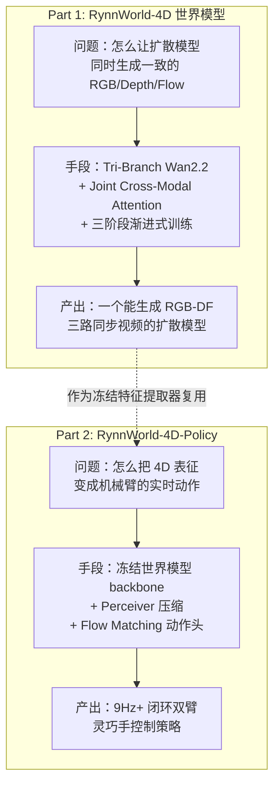

# 第一章：全景图 —— RynnWorld-4D 在解决什么问题？

> 本章目标：搞清楚"机器人操控"这个具体任务对"世界模型"提出了什么要求，纯像素视频预测为什么满足不了这个要求，RynnWorld-4D 用什么具体方案去补这个缺口，以及围绕这个方案项目开源了哪两块代码、各自解决什么问题。

**相关阅读**：读本章前建议先了解 [世界模型基础](/前置知识/000t_前置知识_世界模型基础)（了解"世界模型"这个词泛指什么），本章会在此基础上聚焦到"视频生成式世界模型用于机器人操控"这一条具体路线。

---

## 一、贯穿全文的例子

后面所有讨论都围绕一个具体场景：**天机（Tianji）双臂机器人做 pick-place（抓取-放置）任务**。机器人头部装了一个 RGB 相机，任务是"把桌上的方块放进篮子"。这也是 RynnWorld-4D-Policy 实际训练用的数据集场景（项目自带 3 条示例 episode，位于 `data/tianji_sample/`）。

机器人在执行这个任务时，每一步控制循环需要回答两个问题：

1. **场景现在长什么样**——方块在哪、篮子在哪、手离方块还有多远
2. **场景接下来会怎么变**——手往前伸之后，方块会不会被碰到、会往哪个方向移动、移动了多少

第一个问题是"感知"，第二个问题正是"世界模型"要回答的。下面就从这第二个问题出发，看纯像素预测能不能给出可用的答案。

---

## 二、机器人操控需要的不是"下一帧长什么样"，而是"下一帧里的东西在哪、动了多少"

### 2.1 纯像素视频预测模型具体做什么

一个标准的视频生成式世界模型（比如 [世界模型基础](/前置知识/000t_前置知识_世界模型基础#2-2-三种主要形式) 里讲的"形式三：视频预测世界模型"）做的事情很直接：输入当前帧 $o_t$ 和一个动作/文本条件，输出下一帧（或未来若干帧）的 RGB 图像 $\hat{o}_{t+1}$。这类模型的训练监督信号就是像素级的重建损失——网络学的是"这张图接下来会变成哪张图"。

DIAMOND、UniSim、Genie 这类工作走的就是这条路线，本项目文档中的 fast-WAM（见[Fast-WAM 精读](/论文综述/093_FastWAM_世界动作模型无需推理时想象)）本质上也是在这个基础上加了一个动作输出分支。

### 2.2 具体哪一步出了问题

问题不在"预测得不准"，而在**预测出来的东西根本不携带机器人控制需要的物理量**。拆开看：

- **没有深度**：RGB 图像里一个像素只记录了"这个方向上反射的颜色是什么"，不记录"这个方向上的物体离相机多远"。同一张图里，一个近处的小方块和一个远处的大方块可以投影出完全相同的像素块。
- **没有度量运动**：即使模型准确预测出"方块对应的像素往右移动了 5 个像素"，这 5 个像素在真实世界里对应移动了 5 毫米还是 5 厘米，取决于这个物体离相机多远——而像素本身不携带这个信息。

机械臂的控制指令是关节角度增量、末端位姿增量，单位是米和弧度，不是"像素"。要把"像素怎么变"翻译成"手该往哪伸多少"，中间缺了一层深度信息——纯像素预测模型把这一层直接跳过了。

### 2.3 问题的数学本质

把这件事写成公式看得更清楚。一个像素 $(u, v)$ 要还原成 3D 空间里的真实坐标，需要知道它对应的深度值 $D(u,v)$（这个点离相机的距离），再结合相机的内参矩阵 $K$（记录焦距、光心等，把像素坐标转换成相机坐标系下的方向向量）做反投影：

$$
\mathbf{X}_t(u,v) = D_t(u,v) \cdot K^{-1} \begin{bmatrix} u \\ v \\ 1 \end{bmatrix}
$$

**这个公式在做什么**：把一个 2D 像素坐标 $(u,v)$，结合它的深度值，还原成一个 3D 空间坐标 $\mathbf{X}_t(u,v)$——这是从"图像"走向"真实几何"的必经一步。

> **一句话**：知道一个点在图上的位置，还知道它离相机多远，就能算出它在真实三维空间里的坐标。

**逐符号拆解**：

| 符号 | 数学含义 | 在本场景中具体是什么 |
|------|---------|---------------------|
| $u, v$ | 像素在图像平面上的横、纵坐标 | 比如方块中心在图像里的第 150 列、第 120 行 |
| $D_t(u,v)$ | $t$ 时刻该像素处的深度值（标量，单位米） | 由深度图（RGB-DF 中的 depth 分支）在该像素处的取值给出 |
| $K$ | 相机内参矩阵（$3\times3$），记录焦距 $f_x, f_y$ 和光心 $c_x, c_y$ | 由相机标定得到，是固定常数，不随时间变化 |
| $K^{-1}[u,v,1]^\top$ | 内参矩阵的逆作用在齐次像素坐标上 | 算出这个像素方向对应的、深度为 1 时的相机坐标方向向量 |
| $\mathbf{X}_t(u,v)$ | 该像素在 $t$ 时刻对应的 3D 空间坐标（相机坐标系下，单位米） | 一个三维向量 $[X, Y, Z]$，这才是机械臂控制真正关心的量 |

**代入数字**：取一个简化的针孔相机内参 $f_x = f_y = 500$，光心 $c_x = c_y = 112$（对应 224×224 分辨率图像的中心）。假设方块中心像素在 $t$ 时刻位于 $(u,v) = (150, 120)$，该处深度 $D_t = 1.2\text{m}$：

$$
K^{-1}\begin{bmatrix}150\\120\\1\end{bmatrix} = \begin{bmatrix}(150-112)/500\\(120-112)/500\\1\end{bmatrix} = \begin{bmatrix}0.076\\0.016\\1\end{bmatrix}
$$

$$
\mathbf{X}_t = 1.2 \times [0.076,\ 0.016,\ 1] = [0.0912,\ 0.0192,\ 1.2]\ \text{（米）}
$$

也就是这个方块在相机坐标系下大约位于右前方 9.1 厘米、上方 1.9 厘米、前方 1.2 米处——这才是机械臂规划末端轨迹时能直接用的量。

**为什么是这个形式**：用内参矩阵的逆而不是直接用像素坐标，是因为像素坐标本身是非线性透视投影的结果（近大远小），必须先用 $K^{-1}$ 校正掉焦距和光心带来的畸变，才能得到一个可以直接乘深度值的方向向量。这是计算机视觉里标准的针孔相机反投影公式，不是本项目的发明，这里写出来是为了说明"深度"在整个链路里扮演的角色。

再看运动。如果只有 RGB 光流（像素级的位移场），知道方块像素从 $(150,120)$ 移动到了 $(155,117)$，但不知道对应的深度，就无法知道这 5 个像素、3 个像素的位移对应真实世界里多远的移动。只有把光流和深度结合起来，才能算出**场景流（3D 运动场）**：

$$
\Delta\mathbf{X}(u,v) = \mathbf{X}_{t+1}(u+f_u,\ v+f_v) - \mathbf{X}_t(u,v)
$$

**这个公式在做什么**：把"像素在图上怎么移动"（光流 $(f_u, f_v)$）和"深度怎么变化"结合起来，算出物体在真实 3D 空间中的位移量。

> **一句话**：光流告诉你像素往哪挪，深度告诉你挪之前挪之后各自离相机多远，两者一结合就是"这个物体真的移动了多少厘米"。

**逐符号拆解**：

| 符号 | 数学含义 | 在本场景中具体是什么 |
|------|---------|---------------------|
| $f_u, f_v$ | 光流在横、纵方向上的分量（单位：像素） | 方块对应像素从 $t$ 到 $t+1$ 的位移，比如向右 5 像素、向上 3 像素 |
| $\mathbf{X}_{t+1}(u+f_u, v+f_v)$ | $t+1$ 时刻、光流指向的新像素位置处反投影出的 3D 坐标 | 用上一个公式，把 $D_{t+1}$ 代入新像素位置算出 |
| $\Delta\mathbf{X}(u,v)$ | 这个像素对应的 3D 场景流（位移向量，单位米） | 机器人真正关心的"这个物体这一步移动了多少" |

**代入数字**：延续上面的例子，光流 $(f_u, f_v) = (5, -3)$，也就是新像素位置 $(155, 117)$，该处 $t+1$ 时刻深度 $D_{t+1} = 1.15\text{m}$：

$$
K^{-1}\begin{bmatrix}155\\117\\1\end{bmatrix} = [0.086,\ 0.010,\ 1], \qquad \mathbf{X}_{t+1} = 1.15\times[0.086,\ 0.010,\ 1] = [0.0989,\ 0.0115,\ 1.15]
$$

$$
\Delta\mathbf{X} = [0.0989,\ 0.0115,\ 1.15] - [0.0912,\ 0.0192,\ 1.2] = [0.0077,\ -0.0077,\ -0.05]\ \text{（米）}
$$

换算成毫米：这个方块在这一步里大约往右移动了 7.7mm、往下移动了 7.7mm、朝相机方向靠近了 50mm。这是一个可以直接和机械臂末端位移做比较、判断"手有没有真的碰到并推动了方块"的物理量——单看像素位移 $(5, -3)$ 是完全得不到这个结论的。

**为什么是这个形式**：用差分（$t+1$ 时刻坐标减去 $t$ 时刻坐标）而不是别的组合方式，是因为位移本身的定义就是"位置的变化量"，这是运动学里最基本的定义，不需要引入更复杂的形式。

这两个公式合起来说明一件事：**要从视频里榨出机器人控制真正需要的物理量（3D 位置、3D 运动），深度和光流缺一不可，光有 RGB 不够**。这正是 RynnWorld-4D 要解决的问题。

---

## 三、RynnWorld-4D 的方案：RGB-DF 三路同步生成

### 3.1 核心思路

RynnWorld-4D 不再让世界模型只生成 RGB 视频，而是让**一个统一的扩散模型同时生成三路时空同步的视频**：RGB（外观）、Depth（每个像素的深度值，编码成一路灰度视频）、Optical Flow（每个像素的光流，编码成一路视频）。这三路拼在一起，论文里称为 **RGB-DF 表示**。

深度和光流都以视频的形式表示，是为了能直接复用现成的视频生成 backbone（VAE 编码器、Transformer 骨干）——不需要为深度、光流单独设计网络结构，本质上是把"深度图序列"和"光流图序列"都当成普通视频，用相同的方式过 VAE 编码、送进 Transformer。项目的预处理脚本（`utils/pre-process.py`）就是把 RGB 视频、depth 视频、flow 视频三份视频分别过 VAE 编码成三份 latent，作为训练数据。

有了同步生成的 RGB-DF 三路视频，就可以直接套用上一节推出的两个公式：用 depth 视频做反投影、用 flow 视频算场景流，把"世界模型预测的下一帧"直接变成机器人控制可用的 3D 几何和 3D 运动，不需要再额外训练一个深度估计模型或光流估计模型去"补课"。

### 3.2 靠什么保证三路视频不是各自乱生成

三路视频不是三个独立模型各自生成再拼起来的——如果每一路各自为战，很容易出现"RGB 里方块在左边，深度图里方块却在右边"这种不一致。RynnWorld-4D 用的是**三分支（tri-branch）架构**：三个 Transformer 分支分别处理 RGB、depth、flow，但分支之间通过跨模态注意力机制（Joint Cross-Modal Attention）互相"对话"，让三路生成过程在每一层都能看到彼此的中间状态，从而保持时空一致。这个机制的具体设计（共享 KV、零初始化门控、模态嵌入等）是**第 2 章和第 4 章**的主题，这里先建立"三路不是独立生成、而是耦合生成"这个整体认知即可。

### 3.3 三路视频具体在训练/推理的哪个阶段起作用

- **训练阶段**：三路视频（RGB、depth、flow）都需要提前从原始数据里准备好——depth 来自专门的深度估计模型跑出来的深度视频，flow 来自光流估计模型（项目用了 [ptlflow](https://github.com/hmorimitsu/ptlflow)）跑出来的光流视频，三者按同样的时间轴对齐后一起训练。RynnWorld-4D 采用**三阶段训练**：先各分支独立 SFT（warm-up），再引入跨模态注意力做联合训练，最后全参数微调收尾——具体设计在**第 3 章**展开。
- **推理阶段**：给定首帧 RGB（以及可选的首帧 depth/flow）和一句语言指令，三个分支的 scheduler 并行做 50 步去噪迭代，同时产出三路视频。这一步是**第 6 章**的主题。
- **下游 Policy 阶段**：训练好的世界模型被**冻结**，只取它中间层的特征（三路拼接），作为下游动作策略的视觉表征来源——这是下一小节的主题。

---

## 四、项目的两大组成部分：世界模型本身 vs 下游 Policy

开源代码分成两块，分别解决不同层次的问题：

### 4.1 RynnWorld-4D（世界模型本身）：解决"怎么生成一致的 4D 表征"

这部分要解决的问题是**生成质量和一致性**：怎么让一个扩散模型同时吐出三路互相对得上的视频，而不是各自乱猜。手段是本章第三节提到的 tri-branch 架构 + 三阶段训练。它的输出形态就是三个 mp4 文件（`rgb.mp4` / `depth.mp4` / `flow.mp4`），可以直接被人眼检查、也可以被下一步的策略复用。这部分单独训练、单独评估，不涉及机器人动作。

### 4.2 RynnWorld-4D-Policy（下游策略）：解决"怎么把 4D 表征变成动作"

这部分要解决的是完全不同层次的问题：**世界模型的内部表征已经蕴含了丰富的几何和运动信息，怎么把这些信息利用起来生成机械臂动作，而且要足够快（闭环控制不能等世界模型跑完 50 步去噪）**。

它的手段是：把训练好的世界模型**整体冻结**，只做一次前向传播（而不是完整的多步去噪采样），从中间某一层 hook 出三个分支的特征、沿 channel 维度拼接（$3 \times 3072 = 9216$ 维），再经过一个 Perceiver Resampler（压缩到 224 个 token，详见 [Perceiver Resampler：跨模态 Token 压缩](/前置知识/002o_前置知识_Perceiver_Resampler跨模态Token压缩)）把长序列压成定长表征，最后接一个轻量级的 [Flow Matching](/前置知识/000g_前置知识_Flow_Matching与连续归一化流) 动作头，4 步 Euler 积分直接输出 54 维的双臂+双灵巧手动作。

这个设计的关键在"绕过完整去噪"——世界模型原本的用法是跑完整个扩散采样过程生成视频，但那需要 50 步网络前向传播，对实时控制来说太慢。RynnWorld-4D-Policy 只借用世界模型**单步前向传播**产生的中间层特征（这一步的具体机制是**第 9 章**的主题），把"生成视频"这个昂贵的能力换成了"提取一次性 4D 特征"这个廉价的能力，这也是项目 README 里"Action-from-Latent"这个说法的含义——策略直接吃世界模型内部的 latent，不等它把视频画完。

两部分合起来的完整链路是：世界模型解决"怎么表示 4D 场景"，Policy 解决"怎么用这个表示做控制"——前者是表征学习问题，后者是表征复用+动作生成问题。

---

## 五、和同类工作的定位对比

### 5.1 和纯像素预测世界模型的对比

| 维度 | 纯像素预测世界模型（DIAMOND / UniSim / Genie 等） | RynnWorld-4D |
|------|----------------------------------------------------|--------------|
| 生成内容 | 只生成 RGB 视频 | 同步生成 RGB + Depth + Flow（RGB-DF） |
| 携带的物理量 | 像素颜色，不含深度/度量运动 | 可反投影为 3D 场景流，携带度量几何和运动 |
| 一致性保证 | 单路生成，不涉及跨模态一致性问题 | Tri-branch + Joint Cross-Modal Attention 保证三路同步 |
| 下游动作生成 | 通常需要额外的动作解码模块，且要靠像素本身"隐式"学到物理 | 显式提供几何/运动信息，Policy 可以直接复用冻结特征 |
| 典型代表 | DIAMOND（Atari）、UniSim、Genie、fast-WAM | RynnWorld-4D |

需要说明的是，"只生成 RGB"不代表这类模型完全没有物理理解——像 fast-WAM（见[精读](/论文综述/093_FastWAM_世界动作模型无需推理时想象)）的假设正是"如果模型能准确预测像素级的未来，它就隐式学到了物理规律"。RynnWorld-4D 的立场不同：它认为**把几何和运动显式建模出来（而不是指望网络从像素里隐式学会），能提供更直接、更可解释、更容易被下游模块复用的表征**——这是两条不同的技术路线，不是谁绝对更优，而是"隐式学习物理"和"显式建模物理量"这两种设计哲学的分野。

### 5.2 和基座模型 Wan2.2 的关系

RynnWorld-4D 不是从零训练的模型，而是在 **Wan2.2-TI2V-5B-Diffusers**（阿里通义开源的文本+图像到视频扩散模型）基础上改造出来的：

- **复用的部分**：Wan2.2 的 3D VAE（把视频压缩成 latent）、T5 文本编码器、原始的单分支 Transformer 权重（`WanTransformerBlock`）
- **改造的部分**：把原本单一的 RGB 分支扩展成三个分支（RGB / depth / flow），depth 和 flow 分支的 Transformer 权重**从 RGB 分支的预训练权重初始化而来**（而不是随机初始化），再插入跨模态注意力层把三个分支耦合起来

这个"复用预训练权重初始化新分支"的做法，本质上是把 Wan2.2 已经学到的视频生成先验（怎么画出连贯合理的画面）当作三个分支共同的起点，避免 depth/flow 分支从零学习浪费的算力和数据。具体怎么从单分支 `WanTransformerBlock` 变成三分支 `RynnWorld4DTransformerBlock`，是**第 2 章**要拆开看的内容。

同样地，RynnWorld-4D-Policy 的骨干也是这个改造后的三分支 Wan2.2（5B 参数），只是训练策略头时把整个骨干冻结，不再更新。

---

## 六、下一章预告

本章建立了三个认知：为什么需要深度和光流（而不只是 RGB 像素）来支撑机器人控制、RynnWorld-4D 用 RGB-DF 三路同步生成 + tri-branch 架构来解决这个问题、以及世界模型和下游 Policy 是两个独立但衔接的模块。

**[第 2 章](./02_TriBranch架构总览_从单分支Wan2.2到三分支世界模型)** 会正式打开 tri-branch 架构的内部：`RynnWorld4DTransformerBlock` 具体由哪些子模块组成，depth/flow 分支的权重具体怎么从 RGB 分支的预训练权重"复制"出来，以及三个分支在没有跨模态注意力时（Stage 1）各自是怎么独立跑通训练的。

---

**知识链接**：
- [世界模型基础](/前置知识/000t_前置知识_世界模型基础) — 理解"世界模型"这个概念的整体定位，本章聚焦其中"视频预测世界模型"这一条分支
- [Flow Matching 与连续归一化流](/前置知识/000g_前置知识_Flow_Matching与连续归一化流) — RynnWorld-4D-Policy 动作头使用的生成算法，第 10 章会详细展开
- [Perceiver Resampler：跨模态 Token 压缩](/前置知识/002o_前置知识_Perceiver_Resampler跨模态Token压缩) — Policy 侧压缩三分支特征所用的机制，第 9 章核心内容
- [Fast-WAM：世界动作模型无需推理时想象](/论文综述/093_FastWAM_世界动作模型无需推理时想象) — 同样基于视频生成模型改造、但走"隐式学习物理"路线的对照工作
- [世界模型强化学习综述](/论文综述/S10_世界模型强化学习综述) — 更广的世界模型方法谱系，帮助理解 RynnWorld-4D 在整个领域里的位置
- [第 2 章：Tri-Branch 架构总览](./02_TriBranch架构总览_从单分支Wan2.2到三分支世界模型) — 本章"三分支怎么保持一致"的具体实现
