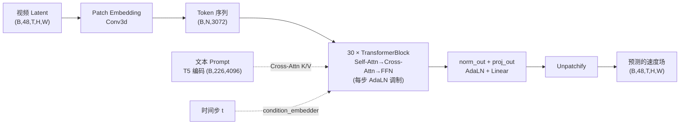

# Tri-Branch 架构总览：从单分支 Wan2.2 到三分支世界模型

> RynnWorld-4D 没有从零训练一个能同时生成 RGB、深度、光流的模型，而是把预训练好的 Wan2.2-TI2V-5B 单分支 DiT"复制"成三份，再逐步教它们互相配合。这一章拆解这个"复制"具体是怎么做的：哪些权重原样共享，哪些权重各自独立初始化，独立之后张量形状怎么流动。

## 相关阅读

- [AdaLayerNorm 条件化归一化](/前置知识/001f_前置知识_AdaLayerNorm条件化归一化)（Wan2.2 DiT block 的调制机制）
- [Cross-Attention 与交替注意力机制](/前置知识/001e_前置知识_Cross_Attention与交替注意力机制)（理解文本条件如何注入）
- [RoPE 旋转位置编码](/前置知识/002k_前置知识_RoPE旋转位置编码)（三分支共享的位置编码机制）
- [3D 卷积与 Causal 卷积](/前置知识/002a_前置知识_3D卷积与Causal卷积)（Patch Embedding 用的 Conv3d）
- [Zero-Init 门控与渐进式模块注入](/前置知识/002n_前置知识_Zero-Init门控与渐进式模块注入)（fusion_mode 里零初始化线性层的原理）
- [全景图：RynnWorld-4D 在解决什么问题？](./01_全景图_RynnWorld4D在解决什么问题)（上一章）

---

## 前情提要

上一章讲了 RynnWorld-4D 要解决的问题：纯 RGB 视频生成模型只预测像素的未来，不携带几何和运动的度量信息，机器人操控真正需要的是"这个物体离我多远""它接下来往哪个方向移动多快"。RynnWorld-4D 的答案是让一个模型同时吐出三路同步视频——RGB、深度、光流，拼成 RGB-DF 表示。

这一章要回答一个更具体的工程问题：**这个"同时生成三路视频"的模型,内部到底长什么样？** 答案不是设计一个全新的三头网络从零训练,而是找一个已经训练好、生成质量很强的单分支视频扩散模型(Wan2.2-TI2V-5B),把它的每一层"复制"三份,分别负责 RGB、深度、光流,再想办法让三份之间产生联系。这一章只讲"复制"这一步——三份分支从哪来、复制了什么、什么东西没复制(共享)。分支之间怎么"产生联系"(融合机制)留到后面几章展开。

## 贯穿例子

为了让每一步的张量形状都有具体数字,我们用一个真实的训练配置作为例子:一段机械臂伸手抓取桌面上物体的视频片段,分辨率 832×480,25 帧,对应 RynnWorld-4D 官方 Stage 1 训练脚本里的实际参数 `--train_resolution 25x480x832`。这段视频会被同时录制(或估计出)三个版本:摄像头拍到的 RGB 画面、深度相机给出的深度图、光流估计模型算出的逐帧运动场。三个版本像素尺寸完全一致,只是通道语义不同。后面每一步的形状推导都基于这一个具体例子。

## 1. 先看单分支:Wan2.2-TI2V-5B 的 DiT block 长什么样

Wan2.2-TI2V-5B 是阿里通义万相开源的一个 50 亿参数视频扩散模型,原本只做一件事:给一段带噪声的视频 latent、一个时间步、一句文本 prompt,预测出去噪所需的速度场(flow matching 目标)。它的骨架是一个标准的 DiT(Diffusion Transformer),由三部分组成:

1. **Patch Embedding**:把视频 latent 切成 patch,映射到 Transformer 的隐层维度
2. **30 层 Transformer Block**,每层内部是 Self-Attention → Cross-Attention(接文本条件) → FFN 的顺序结构,每一步之前都做一次 AdaLN 调制
3. **输出层**:再做一次 AdaLN 调制,投影回 patch 空间,还原成 latent 形状

具体到 RynnWorld-4D 实际加载的 `Wan2.2-TI2V-5B-Diffusers` 配置,关键数字是:`num_attention_heads=24`、`attention_head_dim=128`,算出隐层维度 `inner_dim = 24 × 128 = 3072`;`num_layers=30`;`ffn_dim=14336`;`in_channels=out_channels=48`(这是 latent 的通道数,不是像素 RGB 的 3 通道,原因见下一节);`patch_size=(1,2,2)`(时间维不切,空间维切成 2×2)。

每一层 Block 内部的调制方式是**AdaLN**(Adaptive Layer Norm):时间步和文本条件被编码成一个向量 `temb`,再通过一个线性层产出 6 组 `(shift, scale, gate)`,分别用在 Self-Attention 前、Cross-Attention 后的 FFN 前、以及各自的残差连接门控上。这套机制不是本章的重点,如果想搞清楚"AdaLN 为什么要用 shift+scale+gate 三件套"以及"为什么要用一个共享的 `scale_shift_table` 参数",可以看 [AdaLayerNorm 条件化归一化](/前置知识/001f_前置知识_AdaLayerNorm条件化归一化)。这里只需要记住一个结论:**每一层 Block 都有自己独立的一份 AdaLN 调制参数(`scale_shift_table`),但同一层内,Self-Attn、Cross-Attn、FFN 用的是从同一次 `temb` 计算出来的 6 组调制值。**

Cross-Attention 这一步值得多说一句,因为它是文本 prompt 影响生成内容的唯一入口:Self-Attention 的 Q/K/V 全部来自视频 token 自己(所以叫"自"注意力),而 Cross-Attention 的 Q 来自视频 token,K/V 来自文本编码器(T5,输出维度 4096)编码出的文本特征。如果对 Cross-Attention 具体怎么把两种不同来源的序列接到一起还不熟悉,可以看 [Cross-Attention 与交替注意力机制](/前置知识/001e_前置知识_Cross_Attention与交替注意力机制)。

单分支的完整前向路径是:



这就是 RynnWorld-4D 改造前的起点:一个只吃视频 latent、只吐视频 latent 的单分支模型。它没有"分支"这个概念,因为只有一路数据流。

## 2. 为什么不能直接塞进深度和光流

最直接的想法是:把深度图和光流图也编码成同样格式的 latent,拼接到 RGB latent 的 channel 维上,一起塞进上面这个单分支模型,让模型输出一个更宽的通道来同时预测三种模态。这样做不需要改任何网络结构。

问题出在 Patch Embedding 和 Self-Attention 这两步。Patch Embedding 是一个 `Conv3d`,它的卷积核学到的是"RGB 像素的空间/时间局部相关性"——比如相邻像素颜色渐变、相邻帧运动连续。深度图和光流图的局部统计特性完全不同:深度图往往是大片平坦区域加边缘跳变,光流图的数值分布和 RGB 天差地别。用同一套卷积核去提取三种模态的局部特征,相当于强迫三种不同统计分布的信号共享同一个特征提取器,训练会互相拖累。Self-Attention 也是同理:RGB 分支学到的"哪些 token 该互相关注"的模式(比如物体边缘、纹理一致性),不见得适合深度或光流。

RynnWorld-4D 的做法是**保留三种模态各自独立学习底层特征的自由度,但共享那些和模态无关、只和"这是同一段视频的同一个时刻"有关的部分**。哪些该独立、哪些该共享,是下一节的核心。

## 3. 三分支怎么来:哪些独立、哪些共享

新概念引入前先回答三个问题。RynnWorld-4D 的三分支结构,和上面讲的单分支 Wan2.2 DiT block 是什么关系?——它是在原来的 `WanTransformerBlock` 基础上做**继承和扩展**:源码里 `RynnWorld4DTransformerBlock` 直接继承自 `WanTransformerBlock`,`__init__` 里先调用 `super().__init__()` 把原来那一整套 RGB 分支的层(`attn1`、`attn2`、`ffn`、`norm1/2/3`)原样建好,再往这个对象上"追加"深度和光流分支需要的新层。在什么阶段用?训练和推理都要用——这不是一个只在训练时插入、推理时可以跳过的辅助模块,三个分支是模型的常驻结构,前向传播每次都要跑三遍(某种意义上)。为什么需要它?因为要在"复用 Wan2.2 已经学到的强视频先验"和"给深度/光流留出独立学习空间"之间找平衡——完全共享参数学不好三种模态,完全独立训练三个模型又浪费了 Wan2.2 的预训练权重,继承+扩展是这两者的折中。

具体到 `RynnWorld4DTransformerBlock` 的构造函数,新增的层可以按下表梳理:

| 组件 | RGB 分支(继承自父类) | Depth 分支(新增) | Flow 分支(新增) | 共享/独立 |
|---|---|---|---|---|
| Self-Attn 前的 Norm | `norm1` | `norm1_depth` | `norm1_flow` | 独立(各自参数) |
| Self-Attention | `attn1` | `attn1_depth` | `attn1_flow` | 独立(Q/K/V/Out 全部各自) |
| Cross-Attn 前的 Norm | `norm2` | `norm2_depth` | `norm2_flow` | 独立 |
| Cross-Attention 的 Q、Out | `attn2` 自带 | `attn2_depth` 自带 | `attn2_flow` 自带 | 独立 |
| Cross-Attention 的 K、V(接文本) | `attn2.to_k/to_v` | 复用 `attn2.to_k/to_v` | 复用 `attn2.to_k/to_v` | **共享** |
| FFN 前的 Norm | `norm3` | `norm3_depth` | `norm3_flow` | 独立 |
| FFN | `ffn` | `ffn_depth`(若 `share_ffn=False`)否则复用 `ffn` | `ffn_flow`(若 `share_ffn=False`)否则复用 `ffn` | 可配置 |
| AdaLN 调制参数 `scale_shift_table` | 每层一份 | 复用同一份 | 复用同一份 | **共享** |
| Patch Embedding | `patch_embedding` | `patch_embedding_depth` | `patch_embedding_flow` | 独立(模型级,不在 Block 内) |
| 输出投影 `proj_out` / `norm_out` | 原有 | `proj_out_depth` / `norm_out_depth` | `proj_out_flow` / `norm_out_flow` | 独立(模型级) |
| `condition_embedder`(时间步+文本) | 原有 | 复用 | 复用 | **共享** |
| RoPE(`self.rope`) | 原有 | 复用 | 复用 | **共享** |

表里最容易被忽略、但设计上很关键的一行是 Cross-Attention 的 K/V。三个分支各自有自己的 Cross-Attention 模块(`attn2`、`attn2_depth`、`attn2_flow`),但源码里明确把 `attn2_depth.to_k`、`attn2_depth.to_v`、`attn2_depth.norm_k` 直接指向 `attn2` 的同名属性(Python 对象引用,不是权重复制):

```python
self.attn2_depth.to_k = self.attn2.to_k
self.attn2_depth.to_v = self.attn2.to_v
self.attn2_depth.norm_k = self.attn2.norm_k
self.attn2_flow.to_k = self.attn2.to_k
self.attn2_flow.to_v = self.attn2.to_v
self.attn2_flow.norm_k = self.attn2.norm_k
```

这么做的道理是:Cross-Attention 的 K、V 是从**文本编码**算出来的,而文本描述的是同一句指令("机械臂伸手抓取红色方块"),三个分支面对的是同一段文本,没必要各自学一套"如何把文本特征映射成 K/V"。真正需要独立的是 Q——因为 Q 决定了"每个分支的视频 token 该怎么去查询文本",RGB 分支可能更关注文本里描述外观的词("红色""方块"),深度分支可能更关注描述空间关系的词("伸手""桌面上")。所以 Q 和输出投影 `to_out` 各自独立,K/V 直接共享底层参数对象,反向传播时梯度会汇总到这同一份 K/V 权重上。

AdaLN 调制参数 `scale_shift_table` 的共享逻辑类似:它决定"这一层在当前时间步下,Self-Attn/Cross-Attn/FFN 各自的调制强度",而这个调制强度只依赖时间步和文本条件,不依赖是哪个模态——三个分支处在同一个去噪时间步上,理应用同一套调制强度。真正独立的是各自的 `norm1/2/3`,因为这些是无可学习参数的 `FP32LayerNorm`(`elementwise_affine=False`),它们只是把每个分支自己的激活值做归一化,归一化的输入(激活值分布)本来就因模态不同而不同,所以即使没有可学习参数也要分开算。

`condition_embedder` 和 `RoPE` 在模型级(不在每层 Block 内,是 `RynnWorld4DTransformer3DModel` 顶层的属性)也是三分支共享的:`condition_embedder` 把时间步和文本 prompt 编码成 `temb`、`timestep_proj`、`encoder_hidden_states`,这些量本来就跟"视频内容是什么模态"无关,只跟"当前处于扩散过程的哪一步、指令是什么"有关,自然全局共享一份。`RoPE` 更进一步——它编码的是 token 在时空网格中的绝对位置(第几帧、第几行、第几列),三个分支描述的是**同一个物理场景在同一时刻的三种观测视角**,RGB 的第 7 帧第 15 行第 26 列的 token,和深度、光流对应位置的 token,指向的是完全相同的时空坐标,所以位置编码必须一致,否则三个分支的注意力机制就没法对齐同一个时空点。

## 4. `from_pretrained`:权重怎么从一份变成三份

搞清楚哪些层独立、哪些共享之后,下一个问题是:新增的 `patch_embedding_depth`、`attn1_depth` 这些独立层,初始权重从哪来?如果用随机初始化,深度和光流分支要从零学起,完全浪费了 Wan2.2 已经在海量视频数据上学到的先验(比如"物体边缘处特征该怎么提取""相邻帧的运动该怎么建模")。

RynnWorld-4D 的做法是:**深度分支和光流分支的初始权重,直接从预训练好的 RGB 分支权重复制过去**。这个决定的前提是三个分支的网络结构完全一致(层数、每层的模块组成、每个模块的输入输出维度都相同),唯一的区别是它们各自处理的输入模态不同(RGB 像素 vs 深度值 vs 运动矢量)。既然结构相同,那么"RGB 分支学到的、如何从视频 latent 里提取局部时空特征"这套权重,拿去初始化深度/光流分支,至少是一个比随机初始化好得多的起点——后续训练会让它们各自朝深度、光流的统计特性偏移,但不用从零开始摸索"什么是合理的卷积核""什么是合理的注意力模式"。

具体实现在 `RynnWorld4DTransformer3DModel.from_pretrained` 这个类方法里。先看第一步——加载预训练的单分支模型,再用同样的配置(加上 `fusion_mode`、`share_ffn` 这两个 RynnWorld-4D 专属参数)实例化一个空的三分支模型:

```python
@classmethod
def from_pretrained(cls, pretrained_model_name_or_path, **kwargs):
    fusion_mode = kwargs.pop("fusion_mode", "bidirectional")
    share_ffn = kwargs.pop("share_ffn", True)

    base_model = WanTransformer3DModel.from_pretrained(pretrained_model_name_or_path, **kwargs)
    config = dict(base_model.config)
    config["fusion_mode"] = fusion_mode
    config["share_ffn"] = share_ffn
    model = cls(**config)

    base_sd = base_model.state_dict()
    new_sd = model.state_dict()
```

这里 `base_model` 是加载进来的原版 Wan2.2 单分支模型,`model` 是刚创建的三分支模型(此刻权重还是随机初始化)。`base_sd` 和 `new_sd` 分别是两者的参数字典(key 是参数名字符串,如 `"blocks.0.attn1.to_q.weight"`,value 是对应的 tensor)。接下来的核心逻辑就是:**遍历 `base_sd` 里的每一个参数,决定它应该原样复制到 `new_sd` 的哪些位置。**

第一类是形状完全匹配、直接复制的部分——这对应上一节表格里"共享"的那些层(`condition_embedder`、`rope` 的 buffer、模型级的 `scale_shift_table`):

```python
for key, value in base_sd.items():
    # 1. condition_embedder, rope
    if key in new_sd and new_sd[key].shape == value.shape:
        new_sd[key] = value
```

这一步很直接:只要新模型里存在同名同形状的 key,就直接把预训练值搬过去。因为这些层三分支本来就共享同一份参数(不是复制三份,是同一个 key),所以这一步之后深度和光流分支自动就"继承"了这些共享层。

第二类是 Patch Embedding 和输出投影层。这两处是模型级的独立层(不在 Block 循环内),需要显式地把 `patch_embedding.*` 的权重克隆两份,分别塞给 `patch_embedding_depth.*` 和 `patch_embedding_flow.*`:

```python
    # 2. Patch Embedding
    if "patch_embedding." in key:
        new_sd[key.replace("patch_embedding.", "patch_embedding_depth.")] = value.clone()
        new_sd[key.replace("patch_embedding.", "patch_embedding_flow.")] = value.clone()

    # 3. Output Projection
    if "norm_out." in key:
        new_sd[key.replace("norm_out.", "norm_out_depth.")] = value.clone()
        new_sd[key.replace("norm_out.", "norm_out_flow.")] = value.clone()
    if "proj_out." in key:
        new_sd[key.replace("proj_out.", "proj_out_depth.")] = value.clone()
        new_sd[key.replace("proj_out.", "proj_out_flow.")] = value.clone()
```

注意这里用的是 `.clone()`,不是直接赋值引用——因为 Patch Embedding 和输出投影是三分支**各自独立**要训练的层(不像 Cross-Attention 的 K/V 那样共享底层参数对象),`clone()` 保证深度、光流的这份权重和 RGB 分支的权重在内存里是两个独立的 tensor,训练时各自更新,不会互相干扰,只是初始值相同。

第三类,也是最核心的一类,是 30 层 Transformer Block 内部的所有独立层。这一步通过字符串替换,把 RGB 分支每一层内的 `attn1`、`norm1`、`attn2`、`norm2`、`norm3` 权重,分别映射成 `_depth` 和 `_flow` 后缀的 key:

```python
    # 4. Transformer Blocks
    if "blocks." in key:
        k_depth = key.replace("attn1.", "attn1_depth.").replace("norm1.", "norm1_depth.") \
                     .replace("attn2.", "attn2_depth.").replace("norm2.", "norm2_depth.") \
                     .replace("norm3.", "norm3_depth.")
        if k_depth in new_sd:
            new_sd[k_depth] = value.clone()

        k_flow = key.replace("attn1.", "attn1_flow.").replace("norm1.", "norm1_flow.") \
                    .replace("attn2.", "attn2_flow.").replace("norm2.", "norm2_flow.") \
                    .replace("norm3.", "norm3_flow.")
        if k_flow in new_sd:
            new_sd[k_flow] = value.clone()

        # 5. Independent FFN
        if ".ffn." in key:
            k_ffn_depth = key.replace(".ffn.", ".ffn_depth.")
            k_ffn_flow = key.replace(".ffn.", ".ffn_flow.")
            if k_ffn_depth in new_sd:
                new_sd[k_ffn_depth] = value.clone()
            if k_ffn_flow in new_sd:
                new_sd[k_ffn_flow] = value.clone()
```

这里有个细节需要留意:字符串替换会把原本属于 `attn2.to_k`/`attn2.to_v`/`attn2.norm_k` 的 key 也替换成 `attn2_depth.to_k` 之类的形式,并且判断 `if k_depth in new_sd` 时确实会命中(因为前面 `self.attn2_depth.to_k = self.attn2.to_k` 让这个 key 在 `model.state_dict()` 里也存在)。但由于这是同一个 Python 对象,不管这行代码把值赋给 `attn2.to_k` 还是 `attn2_depth.to_k`,最终 `load_state_dict` 都是往同一块内存 copy 同一份数值,不会产生冲突或覆盖问题。

最后一行是 `FeedForward` 层的处理,只有当 `share_ffn=False`(深度、光流用独立 FFN)时,`ffn_depth`、`ffn_flow` 这两个属性才存在于模型里,`if k_ffn_depth in new_sd` 的判断才会为真——如果 `share_ffn=True`,三分支的 FFN 本来就是共享同一个 `self.ffn`,不需要这一步。

整个函数最后一步是把拼好的 `new_sd` 加载回模型:

```python
    model.load_state_dict(new_sd)
    return model
```

跑一遍这个流程之后,深度分支和光流分支的 `attn1_depth`、`attn1_flow`、`norm1_depth`、`norm1_flow` 等等,初始值和 RGB 分支的 `attn1`、`norm1` 完全相同(只是内存地址不同、可以独立更新);而 `condition_embedder`、`rope`、模型级 `scale_shift_table`、Cross-Attention 的 K/V,则是三分支实打实共享同一份参数。这样,三分支模型刚初始化完成时,如果分别喂给三个分支各自对应模态的输入,输出的质量应该和原始单分支 Wan2.2 处理 RGB 视频的质量相当接近——因为除了 Patch Embedding 的输入通道语义变了,其余权重和 RGB 分支逐层对齐。

## 5. fusion_mode:三分支之间要不要说话

三分支各自独立初始化完之后,还剩一个问题:它们目前是三个完全独立跑的模型,共享的只有条件嵌入和位置编码,深度分支预测深度的时候完全看不到 RGB 分支在做什么。这在很多场景下是不够的——比如 RGB 里一个物体被遮挡后重新出现,深度和光流理应"知道"这件事,单纯靠共享的文本条件传不出这种细粒度信息。

`RynnWorld4DTransformerBlock` 的构造函数里有一个 `fusion_mode` 参数,决定了每一层 Block 要不要在三分支之间搭桥,以及桥怎么搭。这一章先只描述三种最基础的形态(第 4 章会讲第四种更精细的 `joint` 模式):

- **`"none"`**:完全不搭桥,三分支的 Self-Attn、Cross-Attn、FFN 全部独立跑完,互不干扰。这是 Stage 1 训练用的模式——先让深度、光流分支各自学会"怎么用 Wan2.2 的先验去生成自己的模态",不急着让它们互相影响。
- **`"unidirectional"`**:只允许深度、光流的信息流向 RGB(单向),RGB 不反过来影响深度、光流。
- **`"bidirectional"`**:RGB 和深度、光流之间双向都有反馈。

搭桥的具体机制是两个(或四个)`nn.Linear(dim, dim)` 线性层,用来把一个分支的隐藏状态映射后加到另一个分支上。比如 `bidirectional` 模式下:

```python
if fusion_mode == "bidirectional":
    self.video_to_depth_zero = nn.Linear(dim, dim)
    self.video_to_flow_zero = nn.Linear(dim, dim)
    self.depth_to_video_zero = nn.Linear(dim, dim)
    self.flow_to_video_zero = nn.Linear(dim, dim)
```

前向传播时,RGB 分支的更新变成"自己的 Cross-Attn 输出,加上深度、光流各自过一遍这个线性层之后的结果":

```python
hidden_states = hidden_states + self.depth_to_video_zero(hidden_states_depth) + self.flow_to_video_zero(hidden_states_flow)
```

这几个线性层的权重和偏置在初始化时被显式清零:

```python
for layer in fusion_layers:
    nn.init.zeros_(layer.weight)
    nn.init.zeros_(layer.bias)
```

清零意味着这几个 `Linear` 层刚建好的时候,不管输入是什么,输出恒为零。代入上面那行加法,`fusion_mode="bidirectional"` 的模型在**刚切换到这个模式的那一刻**,行为和 `fusion_mode="none"` 完全一样——三分支之间实际上还没有真正的信息流动。之后训练过程中,梯度会驱使这些线性层的权重逐渐偏离零,融合的强度才慢慢"长出来"。这种"新增模块先恒等于无操作,再靠训练慢慢生效"的技巧,叫 Zero-Init(零初始化),是渐进式给预训练模型注入新能力的标准做法,不想在训练一开始就用一个随机初始化的新模块把已经训练好的分支给带偏。具体这套技巧的数学原理和适用场景,可以看 [Zero-Init 门控与渐进式模块注入](/前置知识/002n_前置知识_Zero-Init门控与渐进式模块注入)。

这三种基础形态(`none` → `unidirectional` → `bidirectional`)之间的选择,以及为什么 RynnWorld-4D 最终没有停在 `bidirectional`,而是继续演化出一个用共享 K/V、模态嵌入、frame-wise 限制包装得更精细的 `joint` 模式——这些内容属于训练策略的范畴,第 3、4 章会展开。这一章只需要记住:融合机制是用零初始化线性层实现的"渐进式"设计,不是从一开始就让三分支强行互相干扰。

## 6. 张量形状怎么流动:从像素到三路速度场预测

前面几节讲的是"哪些层独立、哪些共享、怎么初始化",这一节把贯穿例子的具体数字过一遍,搞清楚数据在网络里流动时形状怎么变。

### Step 1:这一步在做什么

Patch Embedding 要解决的问题是:VAE 编码出的视频 latent 是一个 5 维张量 `(batch, channel, frame, height, width)`,而 Transformer 只认识"一串 token,每个 token 是一个向量"这种格式。Patch Embedding 用一个 `Conv3d` 把 latent 切成一个个小方块(patch),每个方块映射成一个高维向量,方块的排列顺序被"拉平"成一条 token 序列。三个分支各自有自己的 `patch_embedding_depth` / `patch_embedding_flow`,但做的是同一件事,只是权重不同。

### Step 2:逐维度拆解

先明确输入是怎么来的。原始像素视频形状是 `(B, 3, T_pixel, H_pixel, W_pixel)`(3 是 RGB 通道)。VAE 把它压缩成 latent,压缩比例由 `AutoencoderKLWan` 的配置决定:

| 符号 | 含义 | Wan2.2-TI2V-5B 的取值 |
|---|---|---|
| `z_dim` | latent 的通道数 | 48 |
| `scale_factor_spatial` | 空间(H、W)压缩倍数 | 16 |
| `scale_factor_temporal` | 时间(帧数)压缩倍数,且是 causal(首帧独立) | 4 |

时间维的压缩规则是 causal 的:第一帧单独映射成 latent 的第一帧,之后每 4 个像素帧压缩成 1 个 latent 帧,公式是 `T_latent = 1 + (T_pixel - 1) // 4`。空间维直接除以压缩倍数:`H_latent = H_pixel // 16`,`W_latent = W_pixel // 16`。

再看 Patch Embedding 这个 `Conv3d` 本身的参数:输入通道 `in_channels=48`(即 latent 的通道数),输出通道 `out_channels=inner_dim=3072`(Transformer 隐层维度),卷积核大小和步长都是 `patch_size=(1,2,2)`——时间维核大小 1(不切),空间维核大小 2×2(每 2×2 的 patch 合并成一个 token)。`Conv3d` 之后紧跟一步 `flatten(2).transpose(1,2)`,把 `(B, C, T, H, W)` 展平成 `(B, T×H×W, C)` 的 token 序列。

### Step 3:代入贯穿例子的具体数字

原始像素视频 `T_pixel=25, H_pixel=480, W_pixel=832`(对应贯穿例子的训练分辨率)。VAE 编码后:

$$
T_{latent} = 1 + \frac{25-1}{4} = 1+6=7,\quad H_{latent}=\frac{480}{16}=30,\quad W_{latent}=\frac{832}{16}=52
$$

latent 形状变成 `(1, 48, 7, 30, 52)`。这正是源码 `compute_loss` 里注释标注的真实形状(`# latent torch.Size([1, 48, 7, 30, 52])`),说明这套推导和实际训练流程完全对得上。

Patch Embedding 的 `Conv3d(48, 3072, kernel=(1,2,2), stride=(1,2,2))` 作用在这个张量上:时间维核大小 1、步长 1,7 帧不变;空间维核大小 2、步长 2,`30/2=15`,`52/2=26`。输出形状是 `(1, 3072, 7, 15, 26)`。紧接着 `flatten(2).transpose(1,2)` 把后三维 `7×15×26=2730` 展平并挪到序列维:

$$
(1, 3072, 7, 15, 26) \xrightarrow{\text{flatten+transpose}} (1,\ 2730,\ 3072)
$$

三个分支各自跑一遍这个流程(用各自的 `patch_embedding_depth`/`patch_embedding_flow`,权重不同但形状规则完全一样),得到三个 `(1, 2730, 3072)` 的 token 序列,分别送进 30 层 `RynnWorld4DTransformerBlock`。

下表汇总从像素到三分支输出的完整形状链路:

| 阶段 | RGB 分支 | Depth 分支 | Flow 分支 | 备注 |
|---|---|---|---|---|
| 原始像素视频 | `(1,3,25,480,832)` | `(1,3,25,480,832)` | `(1,3,25,480,832)` | 光流通常编码成伪 RGB 3 通道 |
| VAE 编码后 latent | `(1,48,7,30,52)` | `(1,48,7,30,52)` | `(1,48,7,30,52)` | 三路 latent 形状必须严格一致 |
| Patch Embedding 后 | `(1,3072,7,15,26)` | 同上 | 同上 | 各自独立卷积权重 |
| Flatten 成 token 序列 | `(1,2730,3072)` | `(1,2730,3072)` | `(1,2730,3072)` | 2730 = 7×15×26,三分支共享这个 token 数 |
| 30 层 Block 处理后 | `(1,2730,3072)` | `(1,2730,3072)` | `(1,2730,3072)` | 形状不变,只是内容被反复调制 |
| `proj_out` 投影后 | `(1,2730,192)` | `(1,2730,192)` | `(1,2730,192)` | 192 = 48×1×2×2(输出通道×patch 体积) |
| Unpatchify 还原后 | `(1,48,7,30,52)` | `(1,48,7,30,52)` | `(1,48,7,30,52)` | 与输入 latent 形状完全一致 |

最后一步 Unpatchify 值得单独看一眼,因为它是 Patch Embedding 的逆过程,同样要按 Step 1-2-3 理解。**这一步在做什么**:把 Transformer 输出的每个 token 向量(192 维)重新还原成一个 `48×1×2×2` 的小方块,再把所有方块按原来的空间位置拼回一张完整的 latent。**逐维度拆解**:先 `reshape` 把 `(1,2730,192)` 拆成 `(1, 7, 15, 26, 1, 2, 2, 48)`(依次是 batch、时间 patch 数、高 patch 数、宽 patch 数、时间核大小、高核大小、宽核大小、通道),再用 `permute(0,7,1,4,2,5,3,6)` 把维度顺序重排成 `(batch, 通道, 时间patch数, 时间核, 高patch数, 高核, 宽patch数, 宽核)`,最后连续三次 `flatten` 把"patch 数"和"核大小"这两个维度两两合并回真实的时间/高/宽。**代入数字**:`permute` 后形状是 `(1,48,7,1,15,2,26,2)`,`flatten(6,7)` 把最后两维 `26×2=52` 合并,`flatten(4,5)` 把 `15×2=30` 合并,`flatten(2,3)` 把 `7×1=7` 合并,最终得到 `(1,48,7,30,52)`——和最初 VAE 编码出的 latent 形状分毫不差。这不是巧合,而是 Unpatchify 存在的意义:扩散模型预测的"速度场"(flow matching 的目标)必须和被加噪的 latent 同形状,才能做逐元素的加减更新。

三分支跑完各自的 `norm_out_depth/flow`、`proj_out_depth/flow` 和 Unpatchify 之后,输出的是三个独立的 `(1,48,7,30,52)` 张量,分别对应 RGB、深度、光流各自预测的速度场。训练时,这三个输出各自和对应模态的真实速度场(噪声减去真实 latent)算 MSE loss,再按 `loss = loss_video + loss_depth + loss_weight_flow * loss_flow` 加权求和——这一步已经涉及第 5 章要讲的 Flow Matching 训练目标,这里先不展开。

## 小结

这一章沿着源码把"三分支从哪来"这件事拆解完了。核心结论可以浓缩成三句话:

1. **三分支不是三个独立模型,是同一套 `WanTransformerBlock` 结构继承出来的三份实例**——RGB 分支的类直接被继承,深度、光流分支往上追加同构的新层。
2. **独立的是"如何提取本模态的局部特征",共享的是"和模态无关的全局条件"**——Patch Embedding、Self-Attn、FFN(可选)、输出投影各自独立;条件嵌入、RoPE、模型级 AdaLN 参数、Cross-Attention 的文本 K/V 全局共享。
3. **独立层的初始权重直接克隆自预训练的 RGB 分支**,不是随机初始化,这样三分支模型刚建好时就能复用 Wan2.2 在海量视频上学到的先验,深度、光流分支不用从零学"什么是合理的视频局部特征"。

三分支之间目前的联系仅限于共享层——`fusion_mode="none"` 时它们各自独立生成,`unidirectional`/`bidirectional` 靠几个零初始化的线性层留了一道还没打开的"门"。下一章会讲 RynnWorld-4D 为什么要把训练拆成三个阶段——先用 `fusion_mode="none"` 让三分支各自站稳,再逐步打开分支之间的信息通道,最后换成更精细的联合注意力机制——以及每个阶段具体在解决上一阶段遗留的什么问题。

## 知识链接

- [AdaLayerNorm 条件化归一化](/前置知识/001f_前置知识_AdaLayerNorm条件化归一化)
- [Cross-Attention 与交替注意力机制](/前置知识/001e_前置知识_Cross_Attention与交替注意力机制)
- [RoPE 旋转位置编码](/前置知识/002k_前置知识_RoPE旋转位置编码)
- [3D 卷积与 Causal 卷积](/前置知识/002a_前置知识_3D卷积与Causal卷积)
- [Zero-Init 门控与渐进式模块注入](/前置知识/002n_前置知识_Zero-Init门控与渐进式模块注入)
- [全景图:RynnWorld-4D 在解决什么问题?](./01_全景图_RynnWorld4D在解决什么问题)
