# 三阶段渐进式融合：为什么要 none → joint 这样分阶段训练

> **前情提要**：第 2 章讲了 RynnWorld-4D 的三分支架构怎么从单分支 Wan2.2 改造而来——`patch_embedding_depth`/`patch_embedding_flow` 直接克隆自 RGB 分支的预训练权重，depth/flow 两条分支起点和 RGB 完全一样，只是后续训练中逐渐分化出各自的能力。本章要回答的问题是：**这三条分支、外加负责让它们互相看到对方信息的 Joint Cross-Modal Attention 模块，为什么不能一次性放在一起从头训练，而要拆成 Stage1 → Stage2 → Stage3 三步走**。
>
> **相关阅读**：[Zero-Init 门控与渐进式模块注入](/前置知识/002n_前置知识_Zero-Init门控与渐进式模块注入)（本章核心依据，建议先读）、[Cross-Attention 与交替注意力机制](/前置知识/001e_前置知识_Cross_Attention与交替注意力机制)、第 2 章 [Tri-Branch 架构总览](./02_TriBranch架构总览_从单分支Wan2.2到三分支世界模型)

## 0. 贯穿本章的例子

后面每一节都用同一个场景讲清楚"这一步在干什么"：输入一张桌面首帧图（一个杯子、一个盘子）加一句指令"把杯子放到盘子里"，模型要输出 25 帧同步的 RGB 视频、深度视频、光流视频。三条分支各自负责生成其中一路，Joint Cross-Modal Attention 负责让三路视频里的杯子在每一帧都出现在同一个位置——RGB 里杯子移动的轨迹，必须和深度图里对应像素的距离变化、光流图里对应像素的位移矢量对得上。

## 1. 问题：为什么不能一步到位联合训练三分支 + 跨模态注意力

最省事的做法当然是：初始化好三分支 + 跨模态注意力全部参数，丢进训练循环，一起端到端优化。RynnWorld-4D 没有这么做，原因分两层，一层是"多分支耦合训练"本身的问题，一层是"给已有能力的模型加新模块"的问题。

### 1.1 三分支从零开始联合训练：谁都学不稳

Stage1 之前，depth 分支和 flow 分支的权重是从 RGB 分支的预训练权重克隆来的（第 2 章已经讲过），但克隆的只是初始值，它们还完全不会生成深度图和光流图——深度图和光流图的像素统计分布跟 RGB 差得很远，这些权重需要经过训练才能"学会"深度、光流各自的生成规律。

如果这时候直接打开跨模态注意力，depth/flow 分支在每一层都会把自己"还不会生成深度/光流"这个错误信号，通过共享的 Q/K/V 注意力传给 RGB 分支和彼此。RGB 分支本来是从成熟的 Wan2.2 视频生成模型继承来的，已经具备很强的生成能力，一旦被两个还在乱猜的分支通过跨模态注意力持续注入噪声梯度，RGB 这一路的训练也会被拖着一起震荡。三条分支互相"扯后腿"，谁都学不到稳定的表示——这跟多任务学习里"任务之间梯度冲突导致谁都学不好"是同一类问题，只是这里冲突的载体是跨模态注意力这个共享通道。

### 1.2 即使分支已经训练好，直接接入随机初始化的跨模态注意力照样会出问题

假设换一种做法：先把三分支各自训练到能独立生成 RGB / 深度 / 光流（这正是 Stage1 要做的事），再一次性接入跨模态注意力，全参数联合训练。这样是不是就没问题了？

还是不行，问题换了个位置。跨模态注意力模块自己的参数（Q/K/V 投影、输出投影、门控）是随机初始化的，它的输出在训练刚开始时是随机噪声。如果这个随机噪声被直接加到已经训练好的 RGB 分支的隐藏状态上：

$$
h_{\text{RGB}}' = h_{\text{RGB}} + \text{JointAttn}(h_{\text{RGB}}, h_{\text{depth}}, h_{\text{flow}})
$$

右边第二项在参数随机初始化时是非零的随机值，加到已经调好的 $h_{\text{RGB}}$ 上，相当于给一个训练好的模型的每一层激活都注入随机扰动。RGB 分支这时候已经具备很强的生成能力，这种扰动会让它在训练最初的若干步里输出质量骤降，loss 曲线出现尖峰甚至发散，而且这种"先破坏再修复"的过程会浪费大量算力去重新找回已经丢失的能力。

这正是 [Zero-Init 门控与渐进式模块注入](/前置知识/002n_前置知识_Zero-Init门控与渐进式模块注入) 这篇前置知识讨论的核心问题：**给一个已经训练好的系统 $f$ 加一个新模块 $g$，如果 $g$ 的初始输出不是恒为零，$f$ 原有的能力就会被随机噪声打乱**。RynnWorld-4D 的 Joint Cross-Modal Attention 采用的正是前置知识里讲的"输出投影清零 + 门控系数初始化为 1（而不是 0，避免梯度死锁）"方案——具体到代码，`joint_out_video/depth/flow` 三个输出线性层的权重和 bias 被 `nn.init.zeros_` 清零，而 `joint_gate_video/depth/flow` 被初始化为 `nn.Parameter(torch.ones(1))`。这套机制保证了跨模态注意力刚插入的那一刻，对三条分支的输出贡献恒为零，不会瞬间破坏已经学好的能力。完整的模块内部结构会在第 4 章逐行拆解，这里只需要记住一个结论：**Zero-Init 门控解决的是"新模块插入瞬间不出问题"，但它不能解决"新模块要学会有用的东西"这个训练过程本身的问题**——这就是为什么即便有了 Zero-Init，RynnWorld-4D 仍然需要把训练拆成三个阶段，而不是直接在 Stage1 之后打开跨模态注意力做端到端联合训练。

三阶段训练要解决的问题可以概括成一句话：**先让三条分支各自站稳，再让跨模态注意力在不破坏已有能力的前提下学会怎么融合信息，最后再放开全部参数一起精调**。下面逐阶段拆开讲。

## 2. Stage1：三条分支各自独立训练，先学会怎么生成

Stage1 对应的脚本是 `rynnworld4d-stage1.sh`，关键参数：

```bash
FLOWWORLD_ARGS=(
    --fusion_mode none
    --share_ffn False
    --use_ema True
    --loss_weight_flow 0.5
    --periodic_inference_steps 200
    --num_inference_samples 3
)
```

`fusion_mode none` 意味着这一阶段完全不启用跨模态注意力——RGB、depth、flow 三条分支各自走自己的 self-attention、text cross-attention、FFN，互相看不到对方的隐藏状态。三条分支唯一共享的是输入的文本条件（同一句指令），除此之外它们就是三个独立训练的 Wan2.2 分支,分别在学"给定首帧 RGB + 指令，怎么生成后续 RGB 帧""给定首帧深度图 + 指令，怎么生成后续深度帧""给定首帧光流图（起点是零光流）+ 指令，怎么生成后续光流帧"。

`share_ffn False` 表示 depth/flow 不共享 RGB 的 FFN 层，各自有独立的 FFN 参数——这是因为深度图、光流图的数值分布和 RGB 差异很大（深度图是单调的距离场，光流图是二维位移矢量场），继续共享 FFN 会让这层参数被两种不兼容的分布拉着走，不如各自独立学。

`loss_weight_flow 0.5` 把光流分支的重建 loss 权重砍半，这是因为光流分支的"首帧条件"是一张全零光流图（约定第一帧没有运动），不像 RGB/depth 首帧那样携带具体的场景内容信息——光流分支能拿到的有效信息全部来自后续帧要不要生成合理的运动模式，训练初期这一路的 loss 天然比 RGB/depth 更不稳定，降低权重可以避免它在梯度里占据不成比例的份额，拖慢另外两条分支的收敛。

Stage1 用的学习率是 `1.5e-5`，配合 `lr_warmup_steps 300` 的 cosine 调度，这是一个针对"全参数微调一个已经预训练好的 5B 视频生成模型"的常规量级——比从头训练小两到三个数量级，避免破坏 RGB 分支继承来的生成能力，同时给 depth/flow 分支足够的学习空间去追上。

Stage1 结束时，三条分支应该已经能独立生成质量合格的 RGB / 深度 / 光流视频，但彼此之间没有任何时空一致性保证——比如 RGB 里杯子往左移动，深度图里对应位置的距离变化可能完全对不上，因为两条分支训练时根本看不到对方的输出。这正是 Stage2 要解决的问题。

## 3. Stage2：冻结已经学会的三分支，只训练新加入的跨模态融合模块

Stage2 对应 `rynnworld4d-stage2.sh`，关键参数：

```bash
OPTIMIZER_ARGS=(
    --learning_rate 5e-5
    --joint_out_lr 2.5e-4
    ...
)

FLOWWORLD_ARGS=(
    --fusion_mode joint
    --share_ffn False
    --joint_start_layer 0
    --joint_end_layer 30
    --joint_every_n_layers 3
    --joint_frame_wise True
    --joint_use_rope True
    --joint_unidirectional True
    --use_ema True
    --loss_weight_flow 1.0
    --resume_from_stage1 <stage1_ckpt>
    --freeze_non_joint True
    --branch_dropout_prob 0.2
    --branch_dropout_modes depth,flow
)
```

这一阶段第一次打开 `fusion_mode joint`，在 Transformer 的第 0、3、6、...、27 层（`joint_start_layer=0`、`joint_end_layer=30`、`joint_every_n_layers=3`，等间隔每 3 层插入一次，共 10 层）插入 Joint Cross-Modal Attention 模块。这个模块新增的可学习参数包括每条分支各自的 `joint_kv_*`（提供给别的分支当 K/V 用）、`joint_q_*`（去查询别的分支）、`joint_align_*`（跨模态前的对齐归一化）、`joint_out_*`（输出投影，零初始化）、`joint_gate_*`（门控，初始化为 1）、`modality_embed_*`（模态标签嵌入）。这些具体参数怎么组合成一次跨模态注意力计算，是第 4 章的内容，这里先把它们当作"一整套新加的、专门负责融合信息的参数"。

`joint_frame_wise True` 和 `joint_use_rope True` 分别表示"跨模态注意力只在同一帧内的 token 之间计算"（防止跨时间的信息串味，比如让第 5 帧的 RGB 去关注第 20 帧的深度）和"跨模态的 Q/K 也要带上 3D RoPE 位置编码"（保证空间位置信息在跨分支查询时依然生效）。这两个开关同样是第 4 章的重点，本章只需要知道它们从 Stage2 起就被打开。

### 3.1 为什么要 `freeze_non_joint=True`：保护已经学会的能力，让新参数专心学融合

Stage2 最关键的设计是 `freeze_non_joint True`。它的效果是：除了名字里带 `joint_` 或 `modality_embed` 的参数，其余所有参数（包括 RGB/depth/flow 各自的 self-attention、FFN、patch embedding 等 Stage1 训练过的部分）全部冻结，不参与梯度更新。这段逻辑在训练代码里就是一次简单的按名字过滤：

```python
if args.fusion_mode == 'joint' and args.freeze_non_joint:
    for name, param in model.named_parameters():
        if 'joint_' not in name and 'modality_embed' not in name:
            param.requires_grad = False
        else:
            param.requires_grad = True
```

**这段代码要做什么**：把模型参数分成两组——"Stage1 已经训练好的旧参数"和"Stage2 新加入的 joint 相关参数"，只让优化器更新后一组，前一组的权重在整个 Stage2 训练期间保持 Stage1 结束时的状态不变。

**为什么要冻结旧参数**：即使 Joint Cross-Modal Attention 用了 Zero-Init 门控，保证了模块插入瞬间贡献为零，训练一旦开始，`joint_out_*` 的权重就会随着梯度下降迅速偏离零——这时它输出的已经不再是"恒为零"，而是一个还在乱试、大概率带噪声的信号。如果 RGB/depth/flow 各自的 self-attention、FFN 这些参数这时候也在同时更新，就会出现两股训练信号互相追赶的情况：旧参数要处理"来自还没学好的跨模态注意力的噪声输入"，同时跨模态注意力本身也在根据一个还在变化的旧参数分布调整自己——两边都在变,谁都没有一个稳定的目标去拟合,训练效率和稳定性都会下降。把旧参数完全冻结,相当于把"分支各自的生成能力"这个变量固定住,让新参数在一个完全静止的、已知质量合格的特征空间上专心学"怎么把三个分支的信息对齐、融合",这是一个更简单、更容易收敛的子问题。

代入本章开头的例子：Stage1 结束后，RGB 分支已经能生成"杯子往盘子方向移动"的视频，depth 分支已经能生成对应的深度变化，flow 分支已经能生成对应的光流场——但它们互相独立，谁都不知道对方的运动轨迹。Stage2 冻结这三条分支各自的生成能力，只让新加的 `joint_*` 参数去学：depth 分支在生成每一帧时，应该去看 RGB 分支同一帧的隐藏状态里的哪些 token，才能保证深度变化的方向和 RGB 里杯子移动的方向一致。这是一个更单纯的"信息路由"问题，不需要同时还要维持"深度图本身长什么样"这件事。

### 3.2 为什么要 `joint_unidirectional=True`：保护强分支不被弱分支污染

`joint_unidirectional True` 的含义（在 `finetune_rynnworld4d.py` 的参数说明里写得很直白）：video 分支只作为 K/V 的来源，被 depth 分支和 flow 分支拿去当查询对象，但 video 分支自己不发起查询、也不接收跨模态注意力的输出——它的隐藏状态在跨模态这一步完全不被修改。depth 和 flow 各自独立地去关注 video 分支的 K/V，把结果加到自己的隐藏状态上。

这个设计的动机是分支强弱不对等：RGB 分支继承自成熟的 Wan2.2，生成质量最高；depth、flow 分支即使经过 Stage1 训练，生成质量和稳定性通常还是不如 RGB。如果做双向的跨模态注意力（RGB 也去关注 depth/flow 的 K/V），一旦 depth/flow 某一帧生成得不好，这个"污染"就会通过跨模态注意力反向传到 RGB 分支，拉低整个系统里质量最高的那一路。`joint_unidirectional=True` 把信息流限制成单向——depth 向 RGB 借力对齐自己的时空结构，但 RGB 不需要向depth/flow借力，因为它本来就不需要这份帮助，反而要避免被拖累。

在代码里，这个方向性直接体现为参数冻结：因为 video 分支不发起查询、不接收跨模态输出，`joint_q_video`、`joint_out_video`、`joint_gate_video`、`modality_embed_video` 这几组参数在前向传播里根本不会被用到，训练脚本直接把它们连同 `freeze_non_joint` 一起冻结掉，省下这部分显存和计算：

```python
if fusion_mode == "joint" and joint_unidirectional:
    unused_video_joint_keys = (
        "joint_q_video.", "joint_out_video.",
        "joint_gate_video", "modality_embed_video",
    )
    for name, param in model.named_parameters():
        if any(k in name for k in unused_video_joint_keys):
            param.requires_grad = False
```

注意 `joint_kv_video` 和 `joint_align_video` 并不在这份冻结列表里——它们仍然需要训练，因为 depth/flow 要去查询 video 分支的 K/V，这两组参数决定了 video 分支"暴露给别人看的信息"是什么样的，必须保持可学习。

### 3.3 checkpoint 交接：`resume_from_stage1` 只加载能匹配上的权重

Stage2 通过 `--resume_from_stage1 <stage1_ckpt>` 从 Stage1 的输出目录加载权重。因为 Stage2 的模型结构比 Stage1 多了一整套 `joint_*` 参数，两边的 state_dict 键不是完全对齐的，加载逻辑用的是"能匹配上形状就加载，匹配不上就跳过"：

```python
stage1_sd = torch.load(stage1_ckpt_path, map_location="cpu")
model_sd = model.state_dict()
for k, v in stage1_sd.items():
    if k in model_sd and model_sd[k].shape == v.shape:
        model_sd[k] = v
model.load_state_dict(model_sd, strict=False)
```

`strict=False` 是这里的关键——严格模式会要求两边 state_dict 的键完全一致，一旦不一致就报错退出。Stage1 的 checkpoint 里没有任何 `joint_*` 参数（因为 Stage1 的 `fusion_mode=none`，模型里根本没有创建这些模块），Stage2 的模型初始化时这些新参数走的是前面讲的 Zero-Init 方案（`joint_out_*` 清零，`joint_gate_*` 置 1），不需要也不能从 Stage1 checkpoint 里加载。这段代码做的事情，就是把 Stage1 训练好的 RGB/depth/flow 三分支权重原样搬进 Stage2 的模型里，同时保留新参数的 Zero-Init 初始值不被覆盖。

### 3.4 `branch_dropout_prob=0.2`：Stage2 里已经开始给跨模态注意力一点"不得不用"的信号

Stage2 的脚本里 `branch_dropout_prob` 设成了 0.2，`branch_dropout_modes` 是 `depth,flow`——训练时每个 batch 有 20% 的概率，随机选中 depth 或 flow 其中一条分支，把它除首帧之外的所有噪声输入替换成纯随机噪声（具体机制在下一节详细讲）。Stage2 阶段主干参数是冻结的，这个操作的意义是：即便大部分参数不学习，也要让刚开始学习的 `joint_*` 参数从训练第一步起就有真实的学习压力去"证明自己有用"——如果 depth 分支的输入被打成噪声，只有通过跨模态注意力向 RGB/flow 借信息，才能把这一帧的深度图重建对。这比单纯让跨模态注意力自己慢慢发现"关注别的分支有帮助"要快得多。这个机制在 Stage3 里会被更系统地使用，我们放到下一节一起讲。

## 4. Stage3：解冻全部参数，端到端联合精调

Stage3 对应 `rynnworld4d-stage3.sh`，关键参数：

```bash
OPTIMIZER_ARGS=(
    --learning_rate 5e-6
    --joint_out_lr 1e-5
    --joint_other_lr_multiplier 1.0
    ...
)

FLOWWORLD_ARGS=(
    --fusion_mode joint
    ...（joint_start_layer/end_layer/every_n_layers/frame_wise/use_rope/unidirectional 与 Stage2 相同）
    --freeze_non_joint False
    --branch_dropout_prob 0.05
    --branch_dropout_modes depth,flow
)
```

### 4.1 为什么现在可以解冻全部参数了

Stage2 结束时，`joint_*` 参数已经从"零贡献"状态学到了一套能把三分支信息初步对齐的融合逻辑，而且这套逻辑是在"三分支各自的生成能力保持不变"的前提下学出来的——不存在"新参数是在追一个还在漂移的目标"这种不稳定问题了。这时候再解冻全部参数做联合精调，风险就小得多：跨模态注意力已经有了一个还不差的初始策略，继续训练主要是让三分支的生成参数去适应"现在能收到跨模态信息了"这件事，而不是从头学习怎么融合。

Stage3 的学习率降到 `5e-6`，比 Stage1 的 `1.5e-5` 还低，这是一个典型的"精调阶段调小学习率"的做法——此时模型整体已经接近目标状态，需要的是小步微调而不是大幅度调整。同时把 `joint_other_lr_multiplier` 从 Stage2 隐含使用的默认值 `10.0` 降到 `1.0`，意味着 `joint_kv/q/norm/align/modality_embed` 这组参数的学习率不再享有比主干高 10 倍的加速，而是和主干统一到同一个量级（`5e-6`）——这个变化直接反映了训练阶段的定位切换：Stage2 需要新参数快速学出一个可用的融合策略，所以给它们更高的学习率；Stage3 是全局精调，所有参数都已经在合理的区域附近，不再需要给某一组参数特殊加速。只有 `joint_out`（零初始化输出投影）仍然保留一个略高于主干的专属学习率 `1e-5`，因为它承担的是"决定跨模态信息最终以多大强度混入主干"这个更敏感的角色，需要单独控制。

### 4.2 branch dropout：强制模型学会"不能只靠自己"

Stage3 的核心新增机制是 branch dropout，具体实现在训练循环里构造带噪声的输入之后：

```python
if branch_dropout_prob > 0:
    allowed = [m for m in branch_dropout_modes if m != "video"]
    if allowed and random.random() < branch_dropout_prob:
        chosen = random.choice(allowed)
        if chosen == "depth":
            noisy_latents_depth[:, :, 1:] = torch.randn_like(noisy_latents_depth[:, :, 1:])
        else:
            noisy_latents_flow[:, :, 1:] = torch.randn_like(noisy_latents_flow[:, :, 1:])
```

**这段代码要做什么**：以概率 `branch_dropout_prob` 随机挑选 depth 或 flow 中的一条分支，把它除第一帧之外的全部噪声输入替换成纯高斯噪声，然后照常让模型去预测这一分支应该生成的目标（真实的深度/光流减去噪声，按 Flow Matching 的目标定义，第 5 章会展开）。RGB 分支永远不会被选中（`allowed_modes` 明确排除 `video`），代码里还专门写了一条警告日志防止有人误配置进去——RGB 是质量最高、最不能牺牲的锚点分支，不能拿来做这种破坏性实验。

用公式表达这个替换规则：

$$
\tilde{z}_{\text{depth}}^{(2:T)} =
\begin{cases}
\epsilon \sim \mathcal{N}(0, I), & \text{以概率 } p_{\text{drop}} \text{ 命中 depth} \\
z_{\text{depth}}^{(2:T)}, & \text{否则}
\end{cases}
$$

**为什么需要这个式子**：模型每一步训练要根据"当前噪声化的深度/光流输入"去预测"去噪方向"，如果这个输入本身被替换成了跟真实深度毫无关系的纯噪声，模型还想把这一帧的深度预测对，唯一能利用的信息来源就只剩跨模态注意力里从 RGB（和未被丢弃的 flow）借来的信息。

> **一句话**：随机把 depth 或 flow 的输入信号"致盲"，逼着模型必须学会用跨模态注意力去补回丢失的信息，而不是想着"自己分支的输入已经够用了，不用管别的分支"。

**逐符号拆解**：

| 符号 | 含义 | 在本场景中对应什么 |
|------|------|-------------------|
| $\tilde{z}_{\text{depth}}^{(2:T)}$ | 替换后实际喂给模型的深度分支噪声输入（从第 2 帧到第 $T$ 帧） | 深度分支 Transformer 输入序列里，除第一帧之外的所有 token |
| $z_{\text{depth}}^{(2:T)}$ | 原本按 Flow Matching 加噪规则算出来的深度噪声输入 | 正常训练流程下应该喂进模型的值 |
| $\epsilon \sim \mathcal{N}(0, I)$ | 一份全新采样的标准高斯噪声，形状和 $z_{\text{depth}}^{(2:T)}$ 一致 | 与深度图真实内容完全无关的随机张量 |
| $p_{\text{drop}}$ | 触发丢弃的概率 | Stage2 里是 0.2，Stage3 里是 0.05 |
| 第一帧（不在替换范围内） | 首帧深度图条件 | 首帧永远保留真实值，因为它是这次生成任务的输入条件，不参与去噪目标 |

**代入数字**：假设某个训练 batch 里 `branch_dropout_prob = 0.05`，训练循环采样一个 $[0,1)$ 均匀分布随机数 $u$。如果 $u = 0.031 < 0.05$，触发丢弃，再从 `["depth", "flow"]` 里等概率随机选一个，假设选中了 `depth`——这个 batch 里深度分支从第 2 帧到第 25 帧（共 24 帧）的输入全部被替换成标准高斯噪声，flow 分支和 RGB 分支的输入不受影响,照常进行。如果 $u = 0.62 \geq 0.05$，则本 batch 完全不触发丢弃，三条分支都用各自正常的加噪输入训练。

**为什么是这个形式**：只丢弃"分支的噪声输入"，不改变对应的训练目标（模型仍然要预测出正确的深度去噪方向），也不丢弃首帧——首帧是这次生成任务的输入条件，丢掉它等于让模型在"不知道任务是什么"的情况下还要给出正确答案，这不是在训练泛化能力，只是在制造无意义的任务。

Stage2 用的丢弃概率是 0.2，Stage3 降到 0.05，这个差异对应两个阶段不同的目的：Stage2 阶段主干参数是冻结的,只有刚起步的 `joint_*` 参数在学习，需要更高强度的丢弃逼着它尽快学会"必须用跨模态信息"这件事；Stage3 阶段全部参数已经解冻，跨模态依赖关系已经基本建立，这时候丢弃概率太高会让模型在大多数训练步里都要处理"输入残缺"的极端情况,影响整体生成质量的精调效果，降到 0.05 只是留一点持续的正则化压力，防止模型在全参数微调过程中重新"偷懒"退化成只依赖自己分支的输入。

### 4.3 checkpoint 交接：`load_stage2_model_weights` 只加载模型权重，跳过优化器状态

Stage3 通过 `--load_stage2_model_weights <stage2_ckpt>` 从 Stage2 的输出加载权重，这里有一个和 `resume_from_stage1` 相似但目的不同的细节——它明确只加载模型的 state_dict，完全不碰优化器状态：

```python
stage2_sd = torch.load(stage2_ckpt_path, map_location="cpu")
model_sd = model.state_dict()
for k, v in stage2_sd.items():
    if k in model_sd and model_sd[k].shape == v.shape:
        model_sd[k] = v
model.load_state_dict(model_sd, strict=False)
# 注意：这里没有加载 optimizer.state_dict() 或 lr_scheduler.state_dict()
```

**为什么要跳过优化器状态**：RynnWorld-4D 用 DeepSpeed ZeRO 做分布式训练，ZeRO 会把优化器状态（如 Adam 的一阶、二阶动量）按参数切片分布到各个 GPU 上，切片方式和当前的 GPU 数量强绑定。如果 Stage2 训练用的是 8 卡，Stage3 换到了 16 卡（或者反过来），ZeRO 保存下来的优化器分片布局就和新的 GPU 数量对不上——不是简单地"权重形状不匹配"，而是分片元数据本身就依赖 world size，跨 world size 直接加载优化器状态会导致这部分状态错位或加载失败。Stage3 脚本的注释里把这一点写得很直接：`load_stage2_model_weights` 就是"加载一个可能用不同 GPU 数量保存的 checkpoint 的模型权重，跳过 ZeRO 优化器状态，因为 world size 可能不同"。

代价是 Stage3 开始训练时优化器是全新初始化的（Adam 的动量从零开始累积），这跟真正的"断点续训"（脚本里 `find_latest_checkpoint` 找到的是 Stage3 自己产生的、world size 一致的 checkpoint 时才会用 `--resume_from_checkpoint`，此时优化器状态会被完整恢复）是两种不同的场景：跨阶段交接时只关心"继承训练好的权重"，阶段内部断点续训才需要完整恢复优化器状态。EMA 权重的处理也遵循同样的逻辑——如果 Stage2 目录下存在 `ema_weights.pt`，Stage3 会在自己的 EMA 模块初始化完成后单独加载这份 EMA 权重，而不是把它跟优化器状态混在一起处理。

## 5. 三阶段超参数总对比

把三个脚本里 `FLOWWORLD_ARGS` 和 `OPTIMIZER_ARGS` 的关键差异汇总成一张表：

| 超参数 | Stage1 | Stage2 | Stage3 |
|--------|--------|--------|--------|
| `fusion_mode` | `none` | `joint` | `joint` |
| `learning_rate`（主干） | `1.5e-5` | `5e-5` | `5e-6` |
| `joint_out_lr`（零初始化输出投影专属学习率） | — | `2.5e-4` | `1e-5` |
| `joint_other_lr_multiplier`（`joint_kv/q/norm/align/modality_embed` 相对主干的倍数） | — | 默认 `10.0`（脚本未覆盖） | `1.0`（显式降为与主干一致） |
| `freeze_non_joint` | 不适用（无 joint 参数） | `True` | `False` |
| `joint_unidirectional` | 不适用 | `True` | `True` |
| `joint_frame_wise` / `joint_use_rope` | 不适用 | `True` / `True` | `True` / `True` |
| `joint_start/end/every_n_layers` | 不适用 | `0` / `30` / `3`（共 10 层插入） | `0` / `30` / `3`（同 Stage2） |
| `branch_dropout_prob` | `0`（不启用） | `0.2` | `0.05` |
| `branch_dropout_modes` | 不适用 | `depth,flow` | `depth,flow` |
| `loss_weight_flow` | `0.5`（首帧无信息，降权） | `1.0` | `1.0` |
| `share_ffn` | `False` | `False` | `False` |
| `use_ema` / `ema_decay` | `True` / 默认 `0.9999` | `True` / 默认 `0.9999` | `True` / 显式 `0.999`（衰减更快，更贴近最新权重） |
| checkpoint 来源 | 无（从 Wan2.2 预训练权重初始化） | `resume_from_stage1`（权重全量加载，`strict=False`） | `load_stage2_model_weights`（仅模型权重，跳过优化器，兼容 world size 变化） |
| lr_warmup_steps | `300` | `200` | `500` |

表格里最能体现"训练阶段目的"的三个变量是 `freeze_non_joint`、`branch_dropout_prob`、`joint_other_lr_multiplier`——它们分别从"只训练新参数"到"全部解冻"、从"高强度逼迫依赖跨模态信息"到"轻量正则化"、从"新参数特殊加速"到"和主干统一节奏"，三条曲线共同勾勒出"新模块从被小心保护到被完全信任"的过程。

## 6. 三阶段与 checkpoint 交接的完整流程

```mermaid
flowchart LR
    subgraph S1["Stage1: fusion_mode=none"]
        direction TB
        S1A["RGB/Depth/Flow 分支<br/>各自独立 SFT<br/>lr=1.5e-5"]
    end

    subgraph S2["Stage2: fusion_mode=joint<br/>freeze_non_joint=True"]
        direction TB
        S2A["❄️ 三分支主干冻结<br/>（保持 Stage1 权重不变）"]
        S2B["🔥 仅训练 joint_*/modality_embed<br/>lr=5e-5×10 (joint_other)<br/>joint_out_lr=2.5e-4"]
        S2C["branch_dropout_prob=0.2<br/>逼迫新参数快速学会<br/>利用跨模态信息"]
    end

    subgraph S3["Stage3: fusion_mode=joint<br/>freeze_non_joint=False"]
        direction TB
        S3A["🔥 全部参数解冻<br/>backbone lr=5e-6<br/>joint_other 与主干统一"]
        S3B["branch_dropout_prob=0.05<br/>轻量正则化维持依赖"]
    end

    S1 -->|"resume_from_stage1<br/>（全量权重，strict=False）"| S2
    S2 -->|"load_stage2_model_weights<br/>（仅模型权重，跳过 ZeRO 优化器状态）"| S3
    S3 --> OUT["🎬 最终 RynnWorld-4D<br/>世界模型 checkpoint"]
```



图中两条 checkpoint 交接边分别对应两种不同的"要不要带优化器状态"的选择：Stage1→Stage2 时模型结构发生了变化（多了 `joint_*` 参数），优化器本来就无法直接复用，所以只做权重迁移；Stage2→Stage3 时模型结构没变，但训练可能切换了 GPU 数量，ZeRO 优化器状态的分片布局跟 world size 绑定，为了避免不兼容，同样选择只迁移权重、重新初始化优化器。

## 7. 总结：渐进式训练的设计哲学

三个阶段做的事情可以归纳成一句话：**先分别把三个能力立起来，再在完全不破坏已有能力的前提下教会系统怎么融合它们，最后放开手让整个系统一起精调**。这背后是一个通用的工程原则——给已经具备一定能力的系统引入新的耦合机制时，耦合机制的引入本身就是一个需要被小心管理的训练过程,而不是一次性的架构改动。Zero-Init 门控解决了"新模块插入瞬间"的安全性问题，`freeze_non_joint` 和 `joint_unidirectional` 解决了"新模块训练过程中"的稳定性问题，`branch_dropout` 解决了"新模块学到的融合能力是否真的被依赖"的有效性问题——三者配合，才把"从三个独立分支到一个真正协同工作的三分支世界模型"这件事拆成了一条风险可控的路径。

## 8. 下一章预告

本章把三阶段训练"为什么这样分"讲清楚了，但 Joint Cross-Modal Attention 模块本身——`joint_kv/q/out/align/gate/modality_embed` 这一整套参数具体怎么组合成一次跨模态注意力计算，`joint_frame_wise` 怎么限制注意力范围，`joint_use_rope` 怎么让 3D 位置编码在跨分支查询时依然生效，`joint_unidirectional` 在具体的前向传播代码里是怎么实现"video 只当 K/V 源"——都还没有展开。第 4 章会把 `module_joint.py` 逐行拆开讲清楚这些细节。

## 知识链接

- [Zero-Init 门控与渐进式模块注入](/前置知识/002n_前置知识_Zero-Init门控与渐进式模块注入) —— 本章 1.2 节、3.1 节论证的核心依据，Joint Cross-Modal Attention 的输出投影清零 + 门控初始化为 1 的设计直接来自这套方案
- [Cross-Attention 与交替注意力机制](/前置知识/001e_前置知识_Cross_Attention与交替注意力机制) —— 理解跨模态注意力的注意力计算基础
- 第 2 章 [Tri-Branch 架构总览：从单分支 Wan2.2 到三分支世界模型](./02_TriBranch架构总览_从单分支Wan2.2到三分支世界模型) —— depth/flow 分支权重克隆自 RGB 分支预训练权重的细节
- 第 4 章 [Joint Cross-Modal Attention 逐行拆解](./04_JointCrossModalAttention逐行拆解) —— 本章预告的下一章，`joint_*` 模块的完整代码级讲解
