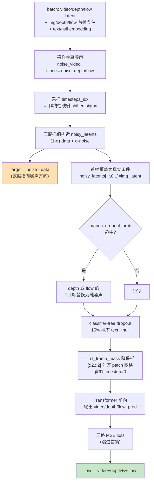

# 训练细节：Flow Matching 目标、时间步偏移与分支随机丢弃

> **前情提要**：第 3 章讲了三阶段训练"为什么要分阶段"（none → joint，freeze_non_joint 从 True 到 False），第 4 章讲了 Joint Cross-Modal Attention 内部具体怎么做跨分支信息交换。这两章都在讲"模型结构和训练策略层面"的设计。本章往下钻一层，钻到最具体的地方——**每一个训练 step 里，loss 到底是怎么算出来的**。这是 `rynnworld4d_trainer.py` 里 `compute_loss` 方法要做的事，前三阶段无论 `fusion_mode` 怎么切换，走的都是这同一套 loss 计算逻辑。
>
> **相关阅读**：[Flow Matching 与连续归一化流](/前置知识/000g_前置知识_Flow_Matching与连续归一化流)（本章大量复用这篇前置知识里的结论，建议先读）、[扩散模型 DDPM](/前置知识/000b_前置知识_扩散模型DDPM)（5.3 节讲了 Classifier-Free Guidance 的通用原理，本章直接引用）、第 3 章 [三阶段渐进式融合](./03_三阶段渐进式融合_训练策略总览)（branch dropout 的动机在这里已经论证过）、第 4 章 [Joint Cross-Modal Attention 逐行拆解](./04_JointCrossModalAttention逐行拆解)

## 0. 先建立连接：通用目标 vs 这里的具体实现

[Flow Matching 前置知识](/前置知识/000g_前置知识_Flow_Matching与连续归一化流) 已经把"为什么用 Flow Matching""为什么直线插值路径最简单""为什么回归条件速度就等价于回归边际向量场"这几件事讲透了。这里只用一句话回顾核心结论：**Flow Matching 训练一个网络 $v_\theta$，让它在给定的中间状态 $\mathbf{x}_t$ 和时间 $t$ 下，预测"从噪声流向数据"这条直线路径上的速度，训练目标是回归条件速度场，用 MSE 衡量预测和真实速度的差距**。

这一章不重新推导这套通用原理，只讲一件事：**RynnWorld-4D 的 tri-branch 场景下，这个通用目标具体怎么落地成代码**。会遇到三个通用原理没有覆盖的具体问题：

1. 三条分支（RGB / 深度 / 光流）要不要各自独立采样噪声？如果不是，为什么？
2. 时间步 $t$ 要不要真的按 $U(0,1)$ 均匀采样？RynnWorld-4D 实际用的是一个非线性变形后的分布，这个变形怎么实现、为什么要这样变形？
3. 首帧是"条件"不是"要生成的内容"，这件事在插值构造、目标构造、时间步嵌入里分别要怎么处理才不会被当成噪声去预测？

这些问题都不是 Flow Matching 的通用理论要回答的,而是"把一个通用生成目标塞进一个具体的三分支视频扩散工程"时必然会碰到的实现细节。下面按 `compute_loss` 方法里代码出现的顺序逐个讲清楚。

## 1. 完整代码先过一遍

在拆开逐个细节之前，先把 `compute_loss` 的完整实现贴出来,建立一个整体印象。后面每一节都会回到这段代码的某一块,详细展开:

```python
@override
def compute_loss(self, batch) -> torch.Tensor:
    target_module = getattr(self.components.high_noise_model, "module", self.components.high_noise_model)
    model_dtype = target_module.patch_embedding.weight.dtype
    device = self.components.high_noise_model.device

    video_latent = batch["encoded_videos"].to(model_dtype)       # [B, C, T, H, W]
    depth_video_latent = batch["encoded_depth"].to(model_dtype)
    flow_video_latent = batch["encoded_flow"].to(model_dtype)

    img_latent = batch["img_latent"].to(model_dtype)
    depth_latent = batch["depth_latent"].to(model_dtype)
    flow_latent = batch["flow_latent"].to(model_dtype)

    null_embedding = batch["null_embedding"].to(model_dtype)
    text_embedding = batch["text_embedding"].to(model_dtype)

    batch_size, num_channels, num_frames, height, width = video_latent.shape

    # 共享噪声
    noise_video = torch.randn_like(video_latent)
    noise_depth = noise_video.clone()
    noise_flow = noise_video.clone()

    num_train_timesteps = self.components.scheduler.config.num_train_timesteps
    timesteps_idx = torch.randint(0, num_train_timesteps, (batch_size,), device=device).long()
    s = timesteps_idx.float() / num_train_timesteps
    flow_shift = self.components.scheduler.config.flow_shift  # 5.0
    sigma_t = flow_shift * s / (1 + (flow_shift - 1) * s)
    sigma_view = sigma_t.view(batch_size, 1, 1, 1, 1).to(model_dtype)
    shifted_timesteps = sigma_t * num_train_timesteps

    noisy_latents = (1.0 - sigma_view) * video_latent + sigma_view * noise_video
    noisy_latents_depth = (1.0 - sigma_view) * depth_video_latent + sigma_view * noise_depth
    noisy_latents_flow = (1.0 - sigma_view) * flow_video_latent + sigma_view * noise_flow

    target_video = noise_video - video_latent
    target_depth = noise_depth - depth_video_latent
    target_flow = noise_flow - flow_video_latent

    noisy_latents[:, :, 0:1, :, :] = img_latent
    noisy_latents_depth[:, :, 0:1, :, :] = depth_latent
    noisy_latents_flow[:, :, 0:1, :, :] = flow_latent

    # branch dropout
    dropout_hit = False
    if getattr(self.args, 'branch_dropout_prob', 0.0) > 0:
        allowed_modes = [m for m in self.args.branch_dropout_modes if m != 'video']
        if allowed_modes and random.random() < self.args.branch_dropout_prob:
            chosen = random.choice(allowed_modes)
            if chosen == 'depth':
                noisy_latents_depth[:, :, 1:, :, :] = torch.randn_like(noisy_latents_depth[:, :, 1:, :, :])
            else:
                noisy_latents_flow[:, :, 1:, :, :] = torch.randn_like(noisy_latents_flow[:, :, 1:, :, :])
            dropout_hit = True

    # classifier-free guidance 训练侧
    if random.random() < 0.15:
        text_embedding = null_embedding

    first_frame_mask = torch.ones(1, 1, num_frames, height, width, device=device)
    first_frame_mask[:, :, 0] = 0
    temp_ts = (first_frame_mask[0][0][:, ::2, ::2] * shifted_timesteps.view(-1, 1, 1, 1).float()).flatten(1)
    timestep_input = temp_ts.to(model_dtype)

    video_pred, depth_pred, flow_pred = self.components.high_noise_model(
        hidden_states=noisy_latents,
        hidden_states_depth=noisy_latents_depth,
        hidden_states_flow=noisy_latents_flow,
        timestep=timestep_input,
        encoder_hidden_states=text_embedding,
        encoder_hidden_states_image=None,
        attention_kwargs=None,
        return_dict=False,
    )

    loss_video = F.mse_loss(video_pred[:, :, 1:].float(), target_video[:, :, 1:].float(), reduction="mean")
    loss_depth = F.mse_loss(depth_pred[:, :, 1:].float(), target_depth[:, :, 1:].float(), reduction="mean")
    loss_flow = F.mse_loss(flow_pred[:, :, 1:].float(), target_flow[:, :, 1:].float(), reduction="mean")

    loss = loss_video + loss_depth + self.args.loss_weight_flow * loss_flow
    return loss, {
        "loss_video": loss_video.detach(),
        "loss_depth": loss_depth.detach(),
        "loss_flow": loss_flow.detach(),
        "dropout_hit": dropout_hit,
    }
```

这段代码可以拆成六个动作：造共享噪声 → 构造非线性时间步和插值噪声 → 注入首帧条件 → 随机丢弃某个分支 → 随机丢弃文本条件 → 构造 per-token 时间步嵌入并算三路 loss。下面逐个展开。

## 2. 共享噪声：为什么三条分支要从同一份噪声出发

```python
noise_video = torch.randn_like(video_latent)
noise_depth = noise_video.clone()
noise_flow = noise_video.clone()
```

这三行代码在做一件很容易被忽略但很关键的事——**深度分支和光流分支没有各自独立采样噪声，而是直接克隆了 RGB 分支采样出来的那一份**。`torch.randn_like` 只调用了一次,后面两行是纯拷贝,不涉及任何新的随机数生成。

**为什么不各自独立采样**：如果三条分支各自调用一次 `torch.randn_like`，会得到三份完全不相关的高斯噪声。回忆 Flow Matching 的插值路径 $\mathbf{x}_t = (1-t)\mathbf{x}_0 + t\mathbf{x}_1$——这里的 $\mathbf{x}_0$ 就是噪声。如果 RGB 用噪声 $A$、深度用噪声 $B$、光流用噪声 $C$（$A,B,C$ 互相独立），那么在同一个训练 step、同一个采样时间步 $t$ 下，三条分支各自的"去噪起点"其实完全不是同一个东西——RGB 走的是从 $A$ 到"杯子移动"这条特定路径，深度走的是从 $B$ 到"对应深度变化"这条完全不相关的路径。两条路径除了终点（真实数据）是配套的，中间过程毫无对齐关系。

**共享噪声之后会发生什么**：三条分支的插值路径变成 $\mathbf{x}_t^{\text{video}} = (1-t)v + t\cdot\text{noise}$、$\mathbf{x}_t^{\text{depth}} = (1-t)d + t\cdot\text{noise}$、$\mathbf{x}_t^{\text{flow}} = (1-t)f + t\cdot\text{noise}$——三者用的是完全同一份 `noise` 张量。这意味着在同一个时间步 $t$ 下，三条分支的"去噪进度"是严格对齐的：$t$ 越接近 1，三路都同等程度地趋向纯噪声；$t$ 越接近 0，三路都同等程度地趋向各自的真实数据。这不是说三条分支在空间上会长得像（RGB 像素值和深度值本来就是完全不同的物理量,不可能靠共享噪声让它们数值上接近），而是说它们在**时间步这个维度上的"进度条"是绑死的**——不会出现"RGB 这一步已经快接近真实图像了，深度却还停留在接近纯噪声的阶段"这种进度不一致的情况。

**这为什么对跨模态一致性有帮助**：Joint Cross-Modal Attention（第 4 章）要做的事情，是让 depth/flow 分支在生成时去关注 RGB 分支同一帧的隐藏状态,借力对齐运动轨迹。如果三条分支各自的噪声不共享，同一个训练 step 里"RGB 已经很干净、深度还很脏"这种进度错位会经常出现,depth 分支这时候去 attend RGB 的 K/V，其实是在拿一个"信息完整的干净特征"去纠正一个"几乎全是噪声"的深度表示,这种不对等的信息量差会让跨模态注意力学到的对齐关系变得不稳定。把三路噪声共享之后,三条分支在训练的每一步都处在"同等程度被污染"的状态,跨模态注意力学到的是"如何在同等噪声水平下互相校准",这是一个更简单、更一致的学习目标。这是提升跨模态一致性最直接、成本最低的手段——不需要任何额外的模块或 loss 项,只是把一次随机数采样换成三次张量拷贝。

## 3. Shifted Sigma：非线性时间步映射

这是本章公式密度最高的一节，也是整个 `compute_loss` 里最容易被误读的一段代码。先看代码：

```python
timesteps_idx = torch.randint(0, num_train_timesteps, (batch_size,), device=device).long()
s = timesteps_idx.float() / num_train_timesteps
flow_shift = self.components.scheduler.config.flow_shift  # 5.0
sigma_t = flow_shift * s / (1 + (flow_shift - 1) * s)
```

### 3.1 为什么需要这个公式

[Flow Matching 前置知识](/前置知识/000g_前置知识_Flow_Matching与连续归一化流#三-flow-matching-的数学推导) 里训练时间步的采样方式是 $t \sim U(0,1)$——均匀采样，不做任何加权。但 RynnWorld-4D 实际用的时间步分布不是均匀的：先均匀采样一个整数索引 `timesteps_idx`（对应 $[0, \text{num\_train\_timesteps})$ 里的离散刻度），归一化成 $s \in [0,1)$，再把 $s$ 喂进一个非线性函数得到真正用于插值的 $\sigma_t$。这个非线性函数就是 `sigma_t = flow_shift * s / (1 + (flow_shift - 1) * s)`。

为什么要多这一步变形？视频扩散模型（不只是 RynnWorld-4D，这是这类模型训练里的常见做法）在训练时希望给"高噪声区间"更多的采样密度——直觉原因是：视频比图像有更强的时序结构和更大的数据量（每个 latent 多了时间维），模型在噪声接近 1（几乎看不清内容）的区间需要更多训练信号才能学好"从一团几乎纯噪声里恢复出粗略结构"这一步，而这一步恰恰是生成质量的瓶颈所在。均匀采样 $t$ 会让高噪声区间和低噪声区间拿到同样多的训练样本，但高噪声区间的任务明显更难，摊到的训练信号却和简单区间一样多，相当于隐性地"欠训练"了最难的部分。原理层面的完整论证不在本章展开（这是 Flow Matching 通用理论之外、视频扩散工程实践里的一个经验结论），这里只讲清楚 RynnWorld-4D 具体用哪个公式实现这个偏移、偏移的具体形状是什么样。

### 3.2 一句话直觉

> 这个公式把"均匀撒出去的采样点" $s$ 重新揉一遍，让原本落在低数值区间的点被推向更高的数值，而原本已经在高数值区间的点几乎不动——效果是同样多的采样点，更多地聚集在了高噪声那一侧。

### 3.3 逐符号拆解

$$
\sigma_t = \frac{\text{flow\_shift} \cdot s}{1 + (\text{flow\_shift} - 1) \cdot s}
$$

| 符号 | 数学含义 | 在本场景中具体是什么 | 典型值/维度 |
|------|----------|----------------------|-------------|
| `timesteps_idx` | 离散时间步索引，均匀整数采样 | `torch.randint` 采样出的整数张量，shape 为 `(batch_size,)` | 取值范围 $[0, \text{num\_train\_timesteps})$，如 $[0, 1000)$ |
| `num_train_timesteps` | scheduler 配置里训练用的离散步数 | 来自 `self.components.scheduler.config.num_train_timesteps`，Wan2.2 默认是 1000 | 整数常量 |
| $s$ | 归一化后的均匀采样点 | `timesteps_idx / num_train_timesteps`，取值 $[0,1)$ 的浮点数 | shape `(batch_size,)` |
| `flow_shift` | 偏移强度的超参数 | 来自 `scheduler.config.flow_shift`，代码注释标注默认为 5.0 | 标量，>1 时把分布推向高噪声区间 |
| $\sigma_t$ | 变形后真正用于插值的噪声强度 | 后面直接控制"混多少噪声进去"的插值系数 | 取值仍在 $[0,1)$，但分布形状变了 |
| 分子 $\text{flow\_shift}\cdot s$ | 对 $s$ 做一次线性放大 | 单独这一项会让 $\sigma_t$ 远超 1，需要分母来"拉回" | — |
| 分母 $1+(\text{flow\_shift}-1)s$ | 一个随 $s$ 增大而增大的归一化因子 | 保证整个式子的输出仍落在 $[0,1)$ 区间内，且 $s=0\Rightarrow\sigma_t=0$，$s\to 1\Rightarrow \sigma_t\to 1$ | — |

注意这个公式没有"多项相加"的结构（不是 $L=A+B+C$ 这种 loss），是一个单一的有理函数，所以不需要拆成多个子项分别讲，但因为它是非线性映射，逐点代入数值看形状变化是理解它的关键。

### 3.4 数值代入：完整算一遍映射形状

取 `flow_shift = 5.0`（代码注释里标注的默认值），代入几个具体的 $s$ 值：

| $s$ | 分子 $5.0 \times s$ | 分母 $1+4.0\times s$ | $\sigma_t = \dfrac{5.0s}{1+4.0s}$ | 相比线性 $\sigma_t=s$ 的偏移方向 |
|---|---|---|---|---|
| 0.0 | 0.0 | 1.0 | 0.000 | 无偏移（起点固定） |
| 0.1 | 0.5 | 1.4 | 0.357 | 比 0.1 高很多，被推高了 3.57 倍 |
| 0.3 | 1.5 | 2.2 | 0.682 | 比 0.3 高，推高了 2.27 倍 |
| 0.5 | 2.5 | 3.0 | 0.833 | 比 0.5 高，推高了 1.67 倍 |
| 0.7 | 3.5 | 3.8 | 0.921 | 比 0.7 高，但倍数已经缩小到 1.32 |
| 0.9 | 4.5 | 4.6 | 0.978 | 比 0.9 高，倍数只剩 1.09 |
| 1.0 | 5.0 | 5.0 | 1.000 | 无偏移（终点固定） |

把这一列 $\sigma_t$ 值和原始 $s$ 值画在同一个数轴上会看得更清楚：$s=0.5$（正中间）被推到了 $\sigma_t=0.833$——已经接近纯噪声区间了。要让 $\sigma_t$ 落在正中间 0.5 附近，反过来解需要 $s\approx 0.2$（可以验算：$s=0.2$ 时，$\sigma_t = 1.0/1.8 \approx 0.556$，确实接近 0.5）。这说明**原本均匀分布在 $[0,0.2]$ 这一小段里的采样点，被映射拉伸到了 $[0, 0.556]$ 这一大段 $\sigma_t$ 区间**，而原本占据 $[0.5,1.0]$ 这一大段的 $s$，被压缩进了 $\sigma_t\in[0.833,1.0]$ 这一小段。

换个角度看等效采样密度：如果把 $s$ 按 0.1 的步长均匀切成 10 段（每段拿到的训练样本数量相同,因为 $s$ 本身是均匀采样的），对应到 $\sigma_t$ 轴上，$s\in[0,0.1]$ 这一段被拉伸映射到 $\sigma_t\in[0,0.357]$，跨度 0.357；而 $s\in[0.9,1.0]$ 这一段被压缩映射到 $\sigma_t\in[0.978,1.0]$，跨度只有 0.022。同样数量的训练样本，前者覆盖的 $\sigma_t$ 区间是后者的 16 倍——反过来说，**同样长度的 $\sigma_t$ 区间，低噪声端（$\sigma_t$ 接近 0）分到的训练样本反而更稀疏，高噪声端（$\sigma_t$ 接近 1）分到的训练样本更密集**。这正是"给高噪声区间更多采样密度"这句话在这个具体公式里的数值体现。

### 3.5 为什么是这个形式

这个公式在扩散模型社会区里通常被称为 "shifted sigmoid"/"time shift" 变换，核心性质有三点，恰好都能从上面的数值例子里验证：

1. **保持端点不变**：$s=0\Rightarrow \sigma_t=0$，$s=1\Rightarrow \sigma_t=1$（表格首尾两行）。这保证了"纯数据"和"纯噪声"这两个物理上有明确含义的边界点不会被变形，只有中间过程被重新分配。
2. **单调递增**：$\sigma_t$ 随 $s$ 单调增大（表格从上到下递增），保证了"时间步索引越大 = 混入的噪声越多"这个基本语义没有被破坏，只是中间的映射关系不再是恒等的。
3. **`flow_shift` 是形状旋钮**：`flow_shift=1` 时，代入公式 $\sigma_t = 1\cdot s/(1+0\cdot s) = s$，退化成没有偏移的线性映射（也就是标准 Flow Matching 的均匀采样）；`flow_shift` 越大，偏移越强，越多的采样密度被推向高噪声区间。RynnWorld-4D 用 5.0，是一个在视频扩散工程里常见的经验量级，既能明显偏移分布，又不会把低噪声区间压缩到几乎采不到样本的程度。

## 4. Noisy Latents 的插值构造与 target 的符号方向

```python
noisy_latents = (1.0 - sigma_view) * video_latent + sigma_view * noise_video
noisy_latents_depth = (1.0 - sigma_view) * depth_video_latent + sigma_view * noise_depth
noisy_latents_flow = (1.0 - sigma_view) * flow_video_latent + sigma_view * noise_flow

target_video = noise_video - video_latent
target_depth = noise_depth - depth_video_latent
target_flow = noise_flow - flow_video_latent
```

### 4.1 这两行在做什么

第一组三行，是 [Flow Matching 前置知识](/前置知识/000g_前置知识_Flow_Matching与连续归一化流#31-条件flow-conditional-flow) 里直线插值公式 $\mathbf{x}_t=(1-t)\mathbf{x}_0+t\mathbf{x}_1$ 的直接实现——只是这里 $t$ 换成了上一节算出来的 $\sigma_t$，$\mathbf{x}_0$ 是噪声，$\mathbf{x}_1$ 是真实 latent。第二组三行构造训练目标，也就是这个插值路径在每一点上的瞬时速度。

> **一句话直觉**：把真实数据和一份噪声按 $\sigma_t$ 的比例混合，得到网络实际看到的"脏"输入；同时算出这条混合路径瞬时移动的方向，作为网络应该学会预测的"标准答案"。

### 4.2 逐符号拆解

| 符号 | 数学含义 | 在本场景中的对应 |
|------|----------|------------------|
| `video_latent` | 真实的干净 RGB latent | VAE 编码后的 ground truth 视频，对应前置知识里的 $\mathbf{x}_1$（数据端点） |
| `noise_video` | 采样出的高斯噪声 | 对应前置知识里的 $\mathbf{x}_0$（噪声端点） |
| `sigma_view` | 广播成 5 维张量的 $\sigma_t$ | `sigma_t.view(batch_size,1,1,1,1)`，把逐样本标量广播到 `[B,C,T,H,W]` 每个位置，保证同一个样本在所有通道/帧/像素位置用同一个噪声强度 |
| `1.0 - sigma_view` | 数据端点的权重份额 | $\sigma_t$ 越大，这个权重越小，混入的真实数据越少 |
| `noisy_latents` | 插值得到的中间噪声化 latent | 对应前置知识里的 $\mathbf{x}_t$，也就是真正喂给 Transformer 的输入 |
| `target_video = noise_video - video_latent` | 训练回归目标 | 对应速度场 $v$，但注意符号方向 |

### 4.3 符号方向的关键提醒：和前置知识教程的方向刚好相反

[Flow Matching 前置知识](/前置知识/000g_前置知识_Flow_Matching与连续归一化流#31-条件flow-conditional-flow) 里的约定是 $t=0$ 是噪声、$t=1$ 是数据，速度场定义为 $v=\mathbf{x}_1-\mathbf{x}_0=\text{数据}-\text{噪声}$，也就是"从噪声指向数据"的方向。

RynnWorld-4D 这里的代码写的是 `target_video = noise_video - video_latent`，也就是 `噪声 - 数据`，方向刚好反过来——**从数据指向噪声**。这不是笔误，而是和这里的时间步约定配套的：代码里 $\sigma_t$ 越大代表混入越多噪声（对应"离数据越远、离纯噪声越近"），也就是说这里 $\sigma_t=0$ 对应纯数据、$\sigma_t=1$ 对应纯噪声——这和前置知识教程里 $t=0$ 是噪声、$t=1$ 是数据的时间方向是**倒过来的**。检查插值公式 `noisy_latents = (1-sigma)*data + sigma*noise`：当 $\sigma_t\to 0$ 时趋向 `video_latent`（纯数据），当 $\sigma_t\to 1$ 时趋向 `noise_video`（纯噪声）——确认了这里 $\sigma_t$ 扮演的角色等价于前置知识里的 $(1-t)$，不是 $t$ 本身。

对插值路径 $\mathbf{x}_{\sigma} = (1-\sigma)\cdot\text{data} + \sigma\cdot\text{noise}$ 关于 $\sigma$ 求导：

$$
\frac{\mathrm{d}\mathbf{x}_\sigma}{\mathrm{d}\sigma} = \text{noise} - \text{data}
$$

这正是代码里 `target_video = noise_video - video_latent` 的来源——它是路径关于**这里定义的 $\sigma_t$**（不是关于前置知识里的 $t$）求导的结果，方向自然是"数据指向噪声"，因为 $\sigma_t$ 增大的方向就是从数据走向噪声的方向。这两种约定（前置知识的 $t$-从噪声到数据 vs. 这里的 $\sigma$-从数据到噪声）在数学上是完全等价的，只是把同一条直线路径的参数化方向反过来标注，网络学到的向量场也整体反了个符号，推理时用 scheduler 自己配套的积分方向（`inference-sft.py` 里的 `self.scheduler.step`）去用这个预测值,结果是一致的。**这里特别提醒方向差异，是因为如果直接照搬前置知识里"$v=\mathbf{x}_1-\mathbf{x}_0$"的写法去读这段代码,会觉得符号反了、以为是 bug——实际上这是扩散模型社区里 $\epsilon$-prediction 传统（预测"从数据到噪声"的方向，呼应 DDPM 里"预测噪声"的直觉）留下的约定，和 Flow Matching 论文原始的 $\mathbf{x}_1-\mathbf{x}_0$ 约定只是方向选择不同，不影响训练目标本身的正确性。**

### 4.4 数值代入

假设某个训练 batch 里 batch_size=1，简化成标量情况（真实场景是每个 latent 位置独立算，这里只演示单个数值）：$\sigma_t=0.3$，`video_latent = 2.0`（某个具体位置的真实 latent 值），`noise_video = -1.5`（对应位置采样到的噪声值）。

- `noisy_latents = (1-0.3)*2.0 + 0.3*(-1.5) = 0.7*2.0 + 0.3*(-1.5) = 1.4 - 0.45 = 0.95`
- `target_video = noise_video - video_latent = -1.5 - 2.0 = -3.5`

模型看到输入 `0.95`（和对应的时间步嵌入），要学着预测出 `-3.5`。如果模型当前预测值是 `-3.0`，MSE loss 对这个位置的贡献是 $(-3.0-(-3.5))^2=0.25$，梯度会推动模型下一步把这个位置的预测值继续往 `-3.5` 靠近,也就是往"更负"的方向调整。

## 5. 首帧条件注入：为什么首帧要被替换而不是加噪

```python
noisy_latents[:, :, 0:1, :, :] = img_latent
noisy_latents_depth[:, :, 0:1, :, :] = depth_latent
noisy_latents_flow[:, :, 0:1, :, :] = flow_latent
```

这三行发生在插值构造之后，直接把刚才算出的 `noisy_latents` 第一帧（时间维索引 0）整段**覆盖**成 `img_latent`（真实的首帧 RGB latent，没有经过任何加噪或插值处理）。深度和光流分支同理，各自覆盖成对应的真实首帧条件。

**为什么首帧不能像其他帧一样走 $(1-\sigma_t)\cdot\text{data}+\sigma_t\cdot\text{noise}$ 这套插值加噪**：这个任务是 image-to-video 生成——首帧是用户给定的、已知的输入条件，不是模型要生成的内容。模型的任务是"给定第一帧,生成后面 $T-1$ 帧",不是"把包括第一帧在内的所有帧都从噪声里恢复出来"。如果第一帧也按插值公式加噪,相当于把一份已知的、精确的信息人为地污染成一个带随机噪声的近似值,然后还要求模型在自己的输出里把这份噪声"猜"回真实值——这是在浪费模型的容量去做一件根本不需要做的事(信息本来就是确定的,不存在"猜"的必要),而且训练信号本身还会跟着噪声抽样的随机性上下抖动,让本该是最简单、最稳定的那一部分输入反而带上了不必要的方差。

直接覆盖成真实值，等价于告诉模型：这一部分不用管"去噪"，它就是确定性的输入条件，你只需要关注怎么基于这个条件去正确处理后面帧的加噪重建。

## 6. Branch Dropout 在这里的具体作用位置

```python
if getattr(self.args, 'branch_dropout_prob', 0.0) > 0:
    allowed_modes = [m for m in self.args.branch_dropout_modes if m != 'video']
    if allowed_modes and random.random() < self.args.branch_dropout_prob:
        chosen = random.choice(allowed_modes)
        if chosen == 'depth':
            noisy_latents_depth[:, :, 1:, :, :] = torch.randn_like(noisy_latents_depth[:, :, 1:, :, :])
        else:
            noisy_latents_flow[:, :, 1:, :, :] = torch.randn_like(noisy_latents_flow[:, :, 1:, :, :])
        dropout_hit = True
```

第 3 章已经完整论证过 branch dropout 的动机——逼着 Joint Cross-Modal Attention 不能"偷懒"只靠自己分支的输入，必须真正学会利用跨模态信息。这里只需要定位清楚它在 `compute_loss` 里具体作用在哪个变量上：**它发生在首帧条件注入之后、送进模型之前，直接对 `noisy_latents_depth` 或 `noisy_latents_flow` 的第 1 帧到最后一帧（切片 `[:, :, 1:, :, :]`，跳过已经被首帧条件覆盖的第 0 帧）做一次整体替换，替换成一份全新采样的纯高斯噪声**，覆盖掉刚才第 4 节按 Flow Matching 插值公式算出来的、本该混合了真实数据和噪声的那个值。注意训练目标 `target_depth`/`target_flow` 完全不受这次替换影响，仍然是原本算出来的"数据指向噪声"方向——模型依然要预测出正确的目标，只是这次它能直接从自己分支输入里读到的有效信息几乎为零，唯一的信息来源变成了跨模态注意力从 RGB（和未被丢弃的另一分支）借来的内容。RGB 分支的 `noisy_latents` 永远不参与这个替换逻辑，`allowed_modes` 在读取配置时就先过滤掉了 `'video'`。

## 7. Classifier-Free Guidance 的训练侧实现

```python
if random.random() < 0.15:
    text_embedding = null_embedding
```

这一行紧跟在 branch dropout 之后，逻辑很简单：以 15% 的概率把整个 batch 用的文本条件 `text_embedding` 整体替换成一份预先算好的空文本 embedding `null_embedding`，剩下 85% 的概率照常使用真实的文本指令 embedding。

**为什么要这么做**：如果不熟悉 Classifier-Free Guidance 的通用原理，可以先看 [DDPM 前置知识 5.3 节](/前置知识/000b_前置知识_扩散模型DDPM#53-classifier-free-guidance无分类器引导)——简单说，CFG 是推理时用"有条件预测"和"无条件预测"的差值去放大条件的影响力，公式是 $\epsilon_{\text{guided}}=\epsilon_{\text{uncond}}+w\cdot(\epsilon_{\text{cond}}-\epsilon_{\text{uncond}})$。这套机制要求同一个网络既能做"给定文本条件的预测"，也能做"完全不给文本条件的预测"——训练时必须让网络见过两种情况,推理时才能同时拿到 $\epsilon_{\text{cond}}$ 和 $\epsilon_{\text{uncond}}$ 去做插值。这行代码就是在实现"让网络在训练阶段随机见到无条件场景"这个要求：85% 的训练样本训练"有文本条件的生成"，15% 的样本训练"无文本条件（null embedding）的生成"，同一套网络参数同时学两种能力。

推理侧的对应代码在 `inference-sft.py` 里可以直接对上：

```python
do_cfg = guidance_scale > 1.0
if do_cfg:
    video_pred_uncond, depth_pred_uncond, flow_pred_uncond = self.transformer(
        ..., encoder_hidden_states=null_embeds, ...
    )
    video_pred = video_pred_uncond + guidance_scale * (video_pred - video_pred_uncond)
```

`guidance_scale > 1.0` 时会额外跑一次用 `null_embeds` 做条件的前向传播，拿到 `video_pred_uncond`，再和正常的（有文本条件的）`video_pred` 做插值放大——这正是训练时那 15% 概率学到的"无条件预测能力"在推理时被真正用上的地方。三条分支（video/depth/flow）在推理时都各自做了这次 CFG 插值,说明训练时这一行 dropout 是同时作用在三条分支共享的同一个 `text_embedding` 上的——不是只丢给某一条分支,而是整个 batch 的文本条件被统一替换。

## 8. First Frame Mask 与 Timestep Input 的构造

```python
first_frame_mask = torch.ones(1, 1, num_frames, height, width, device=device)
first_frame_mask[:, :, 0] = 0

temp_ts = (first_frame_mask[0][0][:, ::2, ::2] * shifted_timesteps.view(-1, 1, 1, 1).float()).flatten(1)
timestep_input = temp_ts.to(model_dtype)
```

### 8.1 为什么首帧的 timestep 要被 mask 成 0

前面第 5 节已经讲了首帧的 latent 输入被直接替换成真实条件，不参与加噪。但 Transformer 里的时间步嵌入（time embedding）是网络判断"当前输入的噪声程度"的关键信号——如果首帧的 latent 已经是干净的真实值，却还带着一个和其他帧一样的、随机采样出来的高噪声 timestep,网络会收到一个自相矛盾的信号:"这个位置的输入明明很干净,但你告诉我的噪声等级却很高"。这种输入内容和时间步标签不匹配的信号,会让网络难以学到一个统一、自洽的去噪函数。

`first_frame_mask` 就是解决这个矛盾的机制：先造一个全 1 的 mask（shape 对应 `[1,1,T,H,W]`），把第 0 帧（首帧）位置的值设成 0,其余帧位置保持 1。之后 `first_frame_mask * shifted_timesteps` 这个乘法,会让首帧位置的 timestep 变成 `0 * shifted_timesteps = 0`，其余帧位置保持 `1 * shifted_timesteps = shifted_timesteps`（真实采样出的时间步值）。

**这样设计带来的效果**：模型在时间步嵌入这个维度上，能明确区分出"这是首帧条件（timestep=0，表示已经完全干净、无需去噪）"和"这是要去噪的内容（timestep=真实值，表示这个位置还带着这么多噪声）"。这是让模型能够区分"条件"和"待生成内容"的核心机制之一——第 5 节的 latent 值替换保证了内容层面的正确性,这里的 timestep mask 保证了"网络自己也知道这是条件"这件事在时间步信号层面同样成立,两者配合才能让首帧条件被完整、一致地传达给网络。

### 8.2 为什么要按 patch 而不是像素做 `[:, ::2, ::2]` 降采样

`first_frame_mask` 最初的 shape 是 `[1, 1, num_frames, height, width]`——这是**像素空间**（更准确地说是 VAE latent 空间，但分辨率仍然是逐像素的）的分辨率。但 Transformer 实际处理的不是逐像素 token，而是经过 `patch_embedding`（一个 `Conv3d`，kernel_size 和 stride 都是 `patch_size=(1,2,2)`）压缩后的 patch token——时间维不压缩（`p_t=1`），但高和宽各被压缩 2 倍（`p_h=p_w=2`）。也就是说,原本 `height × width` 个像素位置,经过 patch embedding 后变成了 `(height/2) × (width/2)` 个 token。

如果 timestep 嵌入直接用未降采样的 `first_frame_mask`（形状是 `height × width`），构造出来的 timestep 张量和 Transformer 实际处理的 token 网格分辨率不匹配——一个 token 对应 2×2=4 个原始像素位置,但 mask 却是逐像素给出的,没法直接和 token 序列对齐。`[:, ::2, ::2]` 这个切片操作，是在高和宽两个维度上各隔一个取一个值（步长为 2 的降采样），把 `height × width` 的网格采样成 `(height/2) × (width/2)` 的网格，正好对应 patch 化之后的 token 网格分辨率。

代入具体数字：假设 latent 的 `height=30`、`width=52`（第 2 章架构总览里出现过的具体维度），`first_frame_mask` 原始形状是 `[..., 30, 52]`。`[:, ::2, ::2]` 之后变成 `[..., 15, 26]`——刚好是 `30/2=15`、`52/2=26`，和 patch_embedding 输出的 token 网格分辨率完全对齐。后面的 `.flatten(1)` 把这个二维网格拉平成一维 token 序列（长度 $15\times 26=390$，乘以帧数就是完整的序列长度），这样每一个 token 位置就有了自己对应的 timestep 标量，可以直接送进 Transformer 的时间步嵌入模块,和对应位置的 hidden state 做逐 token 的调制。

## 9. 三项 Loss 的组合与加权

```python
loss_video = F.mse_loss(video_pred[:, :, 1:].float(), target_video[:, :, 1:].float(), reduction="mean")
loss_depth = F.mse_loss(depth_pred[:, :, 1:].float(), target_depth[:, :, 1:].float(), reduction="mean")
loss_flow = F.mse_loss(flow_pred[:, :, 1:].float(), target_flow[:, :, 1:].float(), reduction="mean")

loss = loss_video + loss_depth + self.args.loss_weight_flow * loss_flow
```

### 9.1 这个公式在做什么

**这是三个分支各自的 Flow Matching MSE loss 加权求和,构成整个训练 step 反向传播用的总 loss。**

三个 `F.mse_loss` 调用分别对应第 4 节讲过的训练目标——网络预测的速度 `video_pred`/`depth_pred`/`flow_pred` 要去逼近对应的 `target_video`/`target_depth`/`target_flow`（"数据指向噪声"方向的真实速度）。切片 `[:, :, 1:]` 统一跳过了第 0 帧（首帧）——因为首帧的输入本来就是真实条件而不是噪声化的内容（第 5 节），对应的 target 也没有实际意义，不应该被算进 loss 里参与梯度计算。

> **一句话直觉**：三条分支各自算一遍"预测速度和真实速度差多少"，加起来就是这一步要优化的总目标，光流这一项额外打了个折扣,防止它太不稳定地拖累另外两条分支。

### 9.2 逐符号拆解

$$
\mathcal{L} = \underbrace{\mathcal{L}_{\text{video}}}_{\text{RGB 分支 MSE}} + \underbrace{\mathcal{L}_{\text{depth}}}_{\text{深度分支 MSE}} + \underbrace{w_{\text{flow}}\cdot\mathcal{L}_{\text{flow}}}_{\text{光流分支 MSE，带权重}}
$$

| 符号 | 含义 | 梯度方向（这一项在"拉"什么往哪走） |
|------|------|--------------------------------------|
| $\mathcal{L}_{\text{video}}=\text{MSE}(\text{video\_pred}, \text{target\_video})$ | RGB 分支预测速度和真实速度的均方误差 | 拉动 RGB 分支的所有参数（patch_embedding、self-attn、text cross-attn、FFN 等），让 `video_pred` 逐渐逼近 `target_video` |
| $\mathcal{L}_{\text{depth}}=\text{MSE}(\text{depth\_pred}, \text{target\_depth})$ | 深度分支的均方误差 | 拉动深度分支对应的参数（以及 branch dropout 命中时,顺带拉动跨模态注意力参数,因为这时深度分支唯一能用的信息来自 joint attention） |
| $\mathcal{L}_{\text{flow}}=\text{MSE}(\text{flow\_pred}, \text{target\_flow})$ | 光流分支的均方误差 | 同理拉动光流分支参数 |
| $w_{\text{flow}}=$ `self.args.loss_weight_flow` | 光流项的权重系数 | 只改变这一项对总梯度的贡献比例，不改变它"往哪拉"的方向,只改变"拉多重" |
| `reduction="mean"` | 每个 loss 内部对所有 batch、通道、帧、像素位置的误差取平均 | 保证 loss 数值不随张量尺寸（比如帧数、分辨率）变化而膨胀，三个分支的 loss 数值量级可比 |

### 9.3 为什么光流项要加权

第 3 章已经讲过这个设计的动机：光流分支的首帧条件是一张全零光流图（约定第一帧没有运动），这张首帧本身不携带任何关于场景内容的信息（不像 RGB 首帧包含真实的场景图像，深度首帧包含真实的距离场）——光流分支能获得的有效信息全部要靠后续帧生成合理的运动模式来体现。这导致光流分支的 loss 在训练初期天然比另外两条分支更不稳定、数值波动更大。如果三项 loss 不加权直接相加，光流项在梯度里会占据不成比例的份额,拖慢 RGB 和深度这两条相对更容易学、更需要优先学好的分支的收敛速度。用 `loss_weight_flow`（Stage1 是 0.5,Stage2/3 恢复到 1.0，第 3 章的超参数对比表里有完整记录）压低光流项在总 loss 里的比重,是一种简单直接的梯度份额再分配手段。

### 9.4 数值代入

假设某个训练 step 里三个分支各自算出的 MSE 值是：`loss_video = 0.42`，`loss_depth = 0.58`，`loss_flow = 1.35`（光流数值明显偏大，符合"训练初期更不稳定"的描述），`loss_weight_flow = 0.5`（对应 Stage1 配置）：

$$
\text{loss} = 0.42 + 0.58 + 0.5 \times 1.35 = 0.42 + 0.58 + 0.675 = 1.675
$$

如果不加权（假设 `loss_weight_flow=1.0`）：

$$
\text{loss}_{\text{无权重}} = 0.42 + 0.58 + 1.35 = 2.35
$$

对比两种情况下光流项占总 loss 的比例：加权后光流项占 $0.675/1.675\approx 40.3\%$；不加权时光流项占 $1.35/2.35\approx 57.4\%$。虽然反向传播的总梯度大小还取决于各项对参数的偏导数结构（不是简单的比例关系），但从 loss 数值贡献的角度看，加权确实把光流项在总优化目标里的权重从接近六成压低到四成左右，给 RGB 和深度两项让出了更大的梯度份额。这个 `loss.backward()` 之后,三个分支各自对应的参数会分别收到来自各自 loss 项的梯度信号,加权系数只影响光流分支拿到梯度信号的相对强度,不影响另外两项。

## 10. 完整流程串一遍

把上面九节串成一张流程图,对应 `compute_loss` 从输入 batch 到输出 loss 的完整数据流：



这张图里每一个分支都能对应回前面某一节的公式或代码——这也是这一章想强调的核心结论：**RynnWorld-4D 的 loss 计算，本质上就是标准 Flow Matching 目标加了四层工程处理：共享噪声保证跨模态时间步对齐、shifted sigma 改变采样密度分布、首帧覆盖 + timestep mask 实现条件注入、branch dropout + CFG dropout 两种随机丢弃机制强制模型学会依赖更丰富的信息源**。通用的 Flow Matching 理论只回答了"怎么用一个 MSE 回归学会一个向量场"，而这四层工程处理回答的是"这个向量场要在一个三分支、image-to-video、需要跨模态一致性和文本可控性的具体系统里,怎么被正确地构造出来"。

## 11. 下一章预告

本章讲清楚了训练时 loss 怎么算，但只是"单步预测"——网络给定一个噪声化的输入和时间步，预测出速度场。真正的视频生成需要把这个单步预测串成一个完整的迭代去噪流程：50 步 UniPC 多步调度器怎么在三条分支上并行迭代、CFG 的插值放大在推理时具体怎么同时应用到三条分支、`inference-sft.py` 里 `depth_scheduler`/`flow_scheduler` 为什么要各自 `deepcopy` 一份独立的 scheduler 而不是共享同一个。第 6 章会把 `RynnWorld4DInferencePipeline.__call__` 里的完整推理循环逐行拆开讲清楚。

## 知识链接

- [Flow Matching 与连续归一化流](/前置知识/000g_前置知识_Flow_Matching与连续归一化流) —— 本章反复引用的通用理论基础：条件 Flow、CFM 训练目标、直线插值路径的完整推导
- [扩散模型 DDPM](/前置知识/000b_前置知识_扩散模型DDPM) —— 5.3 节 Classifier-Free Guidance 的通用原理，本章第 7 节直接复用
- 第 3 章 [三阶段渐进式融合：为什么要 none → joint 这样分阶段训练](./03_三阶段渐进式融合_训练策略总览) —— branch dropout 的完整动机论证，以及 `loss_weight_flow` 在三阶段里的取值变化
- 第 4 章 [Joint Cross-Modal Attention 逐行拆解](./04_JointCrossModalAttention逐行拆解) —— branch dropout 命中时,depth/flow 分支实际依赖的跨模态信息来自这里的注意力机制
- 第 6 章（下一章）[世界模型推理：50 步联合去噪的完整流程](./06_世界模型推理_50步联合去噪完整流程) —— 本章训练目标在推理侧的完整闭环
