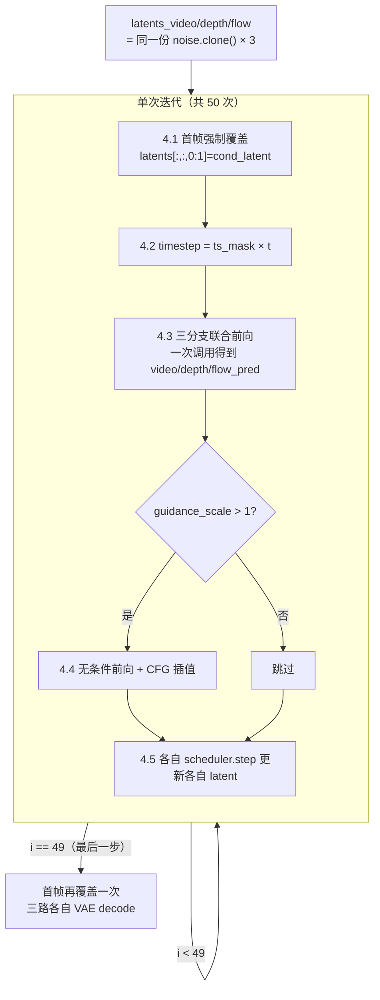

# 世界模型推理：50 步联合去噪的完整流程

> **前情提要**：[第 5 章](./05_训练细节_FlowMatching目标与分支随机丢弃)讲了训练时怎么构造 Flow Matching 的监督信号——RGB/depth/flow 三条分支从同一份高斯噪声出发（`noise_depth = noise_video.clone()`），用 shifted sigma 把干净 latent 和噪声按比例插值成 `noisy_latents`，模型的训练目标是预测 `target = noise - latent` 这个"从数据指向噪声"的速度场（velocity）。本章要讲的是这个训练好的速度场预测器，在推理时怎么被反复调用、沿着速度场反向走，从一份纯噪声一步步走回一份看起来合理的 RGB / 深度 / 光流三路视频。对应的源码是 `inference-sft.py` 里的 `RynnWorld4DInferencePipeline.__call__`。

## 相关阅读

- [Flow Matching 与连续归一化流](/前置知识/000g_前置知识_Flow_Matching与连续归一化流)——本章反复用到的"速度场""ODE 积分"概念的完整推导，建议先读
- [扩散模型 DDPM](/前置知识/000b_前置知识_扩散模型DDPM#53-classifier-free-guidance无分类器引导)——5.3 节讲了 Classifier-Free Guidance 的通用原理，本章第 5 节直接复用
- [第 5 章：训练细节](./05_训练细节_FlowMatching目标与分支随机丢弃)（Flow Matching 目标、共享噪声、分支随机丢弃）——本章推理流程的训练侧对应
- [第 2 章：Tri-Branch 架构总览](./02_TriBranch架构总览_从单分支Wan2.2到三分支世界模型)——三分支 Transformer 一次前向同时输出三个预测的结构基础
- [第 3 章：三阶段渐进式融合](./03_三阶段渐进式融合_训练策略总览)——本章推理用的 checkpoint 来自哪个训练阶段

## 贯穿本章的例子

延续前面章节的场景：输入一张桌面首帧图（一个杯子、一个盘子）加指令"把杯子放到盘子里"，模型要生成 25 帧同步的 RGB / 深度 / 光流视频。经过 VAE 编码后，这段视频对应的 latent 形状是 `(1, 48, 7, 30, 52)`——48 是通道数，7 是时间压缩后的 latent 帧数（对应 25 帧原始视频），`30×52` 是空间压缩后的 latent 分辨率。Patch Embedding 会把空间维度再做一次 2×2 的 patchify，所以送进 Transformer 的 token 网格是 `7 × 15 × 26 = 2730` 个 token。后面所有形状推导都用这组具体数字。

## 1. 从训练目标到推理循环：这一步在解决什么问题

[第 5 章](./05_训练细节_FlowMatching目标与分支随机丢弃)讲清楚了训练在学什么：给定任意一个"数据和噪声按比例 $\sigma$ 混合"出来的中间点 $z_\sigma$，模型要学会预测这个点处的速度场

$$
v_\theta(z_\sigma, \sigma, \text{text}) \approx \text{noise} - \text{latent}
$$

这个速度场指向"从干净数据走向纯噪声"的方向。训练时 $\sigma$ 是随机采样的，模型在所有噪声强度上都要学会预测正确方向。

推理要解决的问题反过来：**已知一份纯噪声，怎么用这个只会"指方向"的模型走回一份干净的 latent？** 答案是数值积分——从 $\sigma=1$（纯噪声）出发，每一步用模型在当前位置预测一次速度场，沿着这个速度场的反方向走一小步（因为要从噪声走向数据，方向和训练目标定义的方向相反），$\sigma$ 逐渐降到 0，落点就是生成的干净 latent。这套"反复预测速度场 + 沿速度场走一步"的循环，就是本章要拆解的 `__call__` 方法主体，一共循环 `num_inference_steps=50` 次。

具体每一步该走多大、用几阶方法外推，这些数值细节被封装进 `self.scheduler.step()`（一个 UniPC 多步调度器）里，`__call__` 方法本身只负责：准备好当前的 latent 和 timestep，调用 Transformer 拿到速度场预测，再把预测结果交给 scheduler 去更新 latent。三个分支（RGB / depth / flow）各自跑一遍这套逻辑，但共享同一个 Transformer 前向和同一套 timestep 序列。

## 2. 初始化：三分支为什么从同一份噪声出发

推理循环开始之前，第一件事是准备好三条分支各自的起点。这里的核心思路不是"每条分支独立随机初始化"，而是刻意让三条分支从数值上完全相同的一份噪声出发——具体做法是只采样一次高斯噪声，然后把它复制三份。为什么要这样做，下面先看代码,再讲原因：

```python
shape = (1, num_channels, num_latent_frames, latent_h, latent_w)
noise = randn_tensor(shape, generator=generator, device=device, dtype=transformer_dtype)
latents_video = noise.clone()
latents_depth = noise.clone()
latents_flow  = noise.clone()
```

**这段代码在做什么**：只调用一次 `randn_tensor` 采样出一份形状 `(1, 48, 7, 30, 52)` 的标准高斯噪声，然后把这同一份噪声 `clone()` 三次，分别作为 RGB、深度、光流三条分支的初始 latent。三条分支不是各自独立采样噪声，而是从数值上完全相同的起点出发。

这个设计不是推理阶段新发明的规则，而是直接照搬训练时的约定——[第 5 章](./05_训练细节_FlowMatching目标与分支随机丢弃)讲过，训练构造 `noisy_latents` 时用的也是同一份噪声克隆三次（`noise_depth = noise_video.clone()`）。这里的逻辑是：**如果训练时模型看到的三路带噪输入在同一个时间步上共享同一份噪声扰动，那么推理时如果三路的起点噪声不一致，就是在用一个和训练分布不匹配的初始条件去驱动模型**。模型的联合去噪能力（Joint Cross-Modal Attention 模块，负责让三条分支在 Transformer 内部交换信息）是在"三路噪声轨迹本身就是对齐的"这个前提下学出来的，如果推理时三路各自独立采样噪声，深度分支在第一步看到的噪声模式和 RGB 分支完全不相关，跨模态注意力要对齐的就不再是"同一份运动在三种模态里的表现"，而是三条各自随机漂移的轨迹，联合去噪的一致性保证就失去了训练时的基础。让三路共享起点噪声，是保证"推理起点也和训练时看到的分布一致"最直接的方式。

## 3. 三个独立 Scheduler：起点相同，但历史状态不能共享

三路 latent 共享起点噪声之后，接下来要给它们各自配一个 scheduler。这里的思路是：三条轨迹起点相同，但推进过程中各自要维护的历史状态不能混用——具体为什么不能混用，先看代码,再逐步展开：

```python
self.scheduler.set_timesteps(num_inference_steps, device=device)
depth_scheduler = deepcopy(self.scheduler)
flow_scheduler  = deepcopy(self.scheduler)
depth_scheduler.set_timesteps(num_inference_steps, device=device)
flow_scheduler.set_timesteps(num_inference_steps, device=device)
timesteps = self.scheduler.timesteps
```

**它和已有系统的关系**：`self.scheduler` 是 pipeline 自带的调度器（一个 UniPC 多步调度器），原本 diffusers 的单分支视频生成 pipeline 只需要一个 scheduler 对象管理一条去噪轨迹。RynnWorld-4D 要同时管理三条轨迹，于是用 `deepcopy` 复制出另外两个独立实例。**在什么阶段使用**：只在推理阶段，训练时不需要 scheduler，训练直接用解析公式构造 `noisy_latents`（[第 5 章](./05_训练细节_FlowMatching目标与分支随机丢弃)的内容）。**为什么需要三份而不是一份**：这是本节要讲清楚的关键点。

UniPC 是一个多步（multistep）求解器，为了达到比一阶 Euler 更高的精度，它在每一步都会参考前几步的模型输出去做外推——具体来说，scheduler 内部维护着一个历史缓冲区（记录最近几步的 `model_output`），每次调用 `.step()` 时不仅用当前这一步的预测值，还会用历史缓冲区里存的前几步预测值一起算出更准的更新方向，算完再把当前这一步的预测值追加进缓冲区，供下一步使用。

问题就出在这个历史缓冲区是**scheduler 对象自身的状态**，不是函数的局部变量。如果三路 latent 共用同一个 `self.scheduler` 对象，三次调用 `self.scheduler.step(video_pred, t, latents_video)`、`self.scheduler.step(depth_pred, t, latents_depth)`、`self.scheduler.step(flow_pred, t, latents_flow)` 会依次把 `video_pred`、`depth_pred`、`flow_pred` 全部写进同一个历史缓冲区，相互覆盖、相互污染。等到后面某一步 UniPC 要用历史信息做外推更新深度分支的 latent 时，它拿到的历史记录里混进了光流分支甚至 RGB 分支的预测值——这是完全无意义的外推依据，得到的更新方向会是错的。

解决方式就是给每条分支一个**独立**的 scheduler 实例，各自维护自己的历史缓冲区，但三个实例的 `timesteps` 序列必须完全一致（都用同样的 `num_inference_steps` 和同样的 `flow_shift` 配置生成）——这保证了三条分支在"现在是第几步、当前噪声强度对应的 timestep 数值是多少"这件事上永远同步，只是各自"记得"的历史预测值互不干扰。用一句话概括：**起点噪声共享是为了让三路的去噪轨迹在统计意义上对齐，独立的 scheduler 状态是为了让每一路各自的多步求解器不被别的分支的预测值污染**——两者解决的是完全不同层面的问题，缺一不可。

## 4. 去噪循环：每一步在做什么

准备好初始 latent 和三个 scheduler 之后，进入循环体，一共跑 `num_inference_steps=50` 次。每一次迭代按顺序做五件事，下面逐一拆开讲。

### 4.1 首帧条件重新注入

每一次循环开始时,代码要做的第一件事是把三路 latent 的第一帧重新设成真实条件值,而不是让上一轮更新后的结果直接留在那里。来看具体写法:

```python
for i, t in enumerate(timesteps):
    latents_video[:, :, 0:1, :, :] = img_latent
    latents_depth[:, :, 0:1, :, :] = depth_latent_cond
    latents_flow[:, :, 0:1, :, :]  = flow_latent_cond
```

这三行在每一次循环**开始时**都会执行一次，把三路 latent 的第一帧强制覆盖成真实的条件 latent（首帧 RGB / 首帧深度 / 零光流首帧）。乍看有点奇怪——上一轮循环结束时不是已经更新过 latent 了吗，为什么这里还要再覆盖一次？

原因在于 `scheduler.step()` 的更新范围：它是对传入的整个 latent 张量按 UniPC 的更新公式统一处理的,不会区分"这个位置是生成目标"还是"这个位置是不该被改动的条件"。也就是说，上一轮循环末尾调用 `self.scheduler.step(video_pred, t, latents_video)` 之后，返回的新 `latents_video` 里，第一帧的数值已经按照更新公式被改动过，偏离了原本的 `img_latent`。如果不在下一轮开始时强制拉回，条件信息会随着迭代逐渐漂移走样。这行代码的作用就是纠正这个漂移——**每一步都要把"这是一次以真实首帧为条件的生成"这件事重新摆正**，模型看到的输入永远是"真实首帧 + 当前还带噪声的后续帧"，不会因为多步迭代积累出错误的首帧。

### 4.2 timestep 构造

首帧在数值上被拉回真值之后,还需要在传给 Transformer 的 timestep 上也标注清楚"首帧不参与去噪"这件事,否则模型会把首帧也当成需要去噪的目标。构造方式是用一个预先算好的掩码去乘当前时间步:

```python
timestep = ts_mask * t
```

这里的 `ts_mask` 是循环外预先算好的一个形状 `(1, 2730)` 的掩码张量（对应前面算出的 token 数），由 `first_frame_mask` 做隔行采样、展平得到，首帧对应的 token 位置是 0，其余帧位置全是 1。乘以当前的标量时间步 `t`，得到的 `timestep` 张量在首帧 token 位置是 0，其余位置是 `t`。这是把"首帧不是被加噪的对象"这一信息以 token 级别的粒度告诉 Transformer——4.1 节的操作是在**数值**层面固定首帧内容，这里是在**语义标注**层面告诉模型"这批 token 里哪些是纯净条件（timestep=0），哪些是真正需要去噪的目标（timestep=t）"，两者配合才能让模型正确处理"部分帧是条件、部分帧是生成目标"这种混合输入。

### 4.3 三分支联合前向

首帧覆盖好、timestep 构造好之后，真正的计算发生在这一步：把三路 latent 一起送进同一个 Transformer，让它们在内部经过跨模态注意力交换信息后，各自给出一份速度场预测。核心是三路数据只经过**一次**前向调用，而不是三次独立的前向：

```python
video_pred, depth_pred, flow_pred = self.transformer(
    hidden_states=latents_video,
    hidden_states_depth=latents_depth,
    hidden_states_flow=latents_flow,
    timestep=timestep,
    encoder_hidden_states=prompt_embeds,
    encoder_hidden_states_image=None,
    return_dict=False,
)
```

一次前向同时喂进三路 latent，一次前向同时拿到三路预测——这正是 Joint Cross-Modal Attention 在推理阶段发挥作用的地方：三条分支在 Transformer 内部经过若干层联合注意力交换信息之后，各自的输出头分别给出 `video_pred`、`depth_pred`、`flow_pred` 三个速度场预测。这一步没有额外的技巧，就是训练时前向传播逻辑在推理时的直接复用,唯一区别是推理时不需要计算 loss，也不需要反向传播。

### 4.4 Classifier-Free Guidance（当 `guidance_scale > 1`）

如果开启了 CFG，这一步会**再跑一次前向**，但把文本条件换成一份预先准备好的空文本嵌入：

```python
if do_cfg:
    video_pred_uncond, depth_pred_uncond, flow_pred_uncond = self.transformer(
        hidden_states=latents_video,
        hidden_states_depth=latents_depth,
        hidden_states_flow=latents_flow,
        timestep=timestep,
        encoder_hidden_states=null_embeds,
        encoder_hidden_states_image=None,
        return_dict=False,
    )
    video_pred = video_pred_uncond + guidance_scale * (video_pred - video_pred_uncond)
    depth_pred = depth_pred_uncond + guidance_scale * (depth_pred - depth_pred_uncond)
    flow_pred  = flow_pred_uncond  + guidance_scale * (flow_pred  - flow_pred_uncond)
```

两次前向用的是完全相同的 latent 和 timestep，唯一变化的是 `encoder_hidden_states`：一次是真实的文本 prompt 编码，一次是空文本（`null_prompt_embedding.safetensors`，一份预先算好的固定张量）编码。三路预测都各自做一次同样的插值。这个插值公式就是本章要重点拆解的 CFG 公式，下一节详细讲。

### 4.5 各自的 scheduler 更新各自的 latent

拿到（可能已经过 CFG 增强的）速度场预测之后，最后一步是让每条分支用自己专属的 scheduler 实例把这次预测转换成 latent 的实际更新，各自独立完成一次数值积分步：

```python
latents_video = self.scheduler.step(video_pred, t, latents_video, return_dict=False)[0]
latents_depth = depth_scheduler.step(depth_pred, t, latents_depth, return_dict=False)[0]
latents_flow  = flow_scheduler.step(flow_pred, t, latents_flow, return_dict=False)[0]
```

三路各自用第 3 节讲的独立 scheduler 实例，把（可能经过 CFG 插值的）速度场预测和当前 latent 一起交给 `.step()`，得到沿速度场走完这一步之后的新 latent。循环回到 4.1，下一轮迭代重新覆盖首帧、重新构造 timestep，直到 50 步全部跑完。

整个循环体的数据流可以画成一张图：



## 5. CFG 插值公式：逐符号拆解

**这个公式在做什么**：把"给了文本条件的预测"和"没给文本条件的预测"之间的差异，按 `guidance_scale` 倍数放大，让最终用来更新 latent 的速度场比模型原始的条件预测更强烈地偏向"符合文本指令的方向"。

$$
v_{\text{cfg}} = v_{\text{uncond}} + w \cdot (v_{\text{cond}} - v_{\text{uncond}})
$$

（对应代码里 `video_pred = video_pred_uncond + guidance_scale * (video_pred - video_pred_uncond)`，depth、flow 两路是同样的公式各自算一遍。）

> **一句话直觉**：无条件预测是"模型不知道指令时会怎么走"，条件预测是"知道指令后会怎么走"，两者的差值就是"指令造成的偏移方向"。CFG 把这个偏移方向按比例放大，逼着生成结果比模型自然给出的条件预测更贴近指令。

**逐符号拆解**：

| 符号 | 数学含义 | 在本场景中具体是什么 | 维度/典型值 |
|------|----------|----------------------|-------------|
| $v_{\text{cond}}$ | 给定真实文本条件时，Transformer 对当前 latent 的速度场预测 | 代码里循环体 4.3 步算出的 `video_pred`（或 depth_pred/flow_pred） | 形状同 latent，`(1, 48, 7, 30, 52)` |
| $v_{\text{uncond}}$ | 把文本条件替换成预先准备的空文本嵌入时，Transformer 给出的速度场预测 | 代码里 4.4 步用 `null_embeds` 再跑一次前向得到的 `video_pred_uncond` | 形状同上 |
| $v_{\text{cond}} - v_{\text{uncond}}$ | 两次预测的差值 | "文本条件把速度场往哪个方向、多大幅度地拉动了" | 同上 |
| $w$ | guidance scale，代码里的 `guidance_scale` 参数 | 控制放大倍数的标量超参 | 本文示例取 $1.5$，`do_cfg` 只在 $w>1$ 时触发 |
| $v_{\text{cfg}}$ | 插值后最终真正交给 scheduler 去更新 latent 的速度场 | 代码里重新赋值给 `video_pred`（覆盖了原始条件预测） | 同上 |

**梯度方向直觉**：把公式展开成 $v_{\text{cfg}} = (1-w) \cdot v_{\text{uncond}} + w \cdot v_{\text{cond}}$ 更容易看出这是一个外推（extrapolation）而不是插值（interpolation）——当 $w>1$ 时，$(1-w)$ 是负数，$v_{\text{cfg}}$ 落在 $v_{\text{uncond}}$ 和 $v_{\text{cond}}$ 连成的直线上、超出 $v_{\text{cond}}$ 那一侧的延长线上，而不是落在两者之间。

**代入具体数字看一遍**：假设某个 token 上某个 latent 通道的预测值是标量（实际是高维张量，这里只看一个分量方便手算）：$v_{\text{cond}} = 2.0$，$v_{\text{uncond}} = 0.8$，取 $w = 1.5$：

$$
v_{\text{cfg}} = 0.8 + 1.5 \times (2.0 - 0.8) = 0.8 + 1.5 \times 1.2 = 0.8 + 1.8 = 2.6
$$

对比几个不同 $w$ 取值下的结果：

| $w$ | 计算 | $v_{\text{cfg}}$ | 解读 |
|---|---|---|---|
| $0$ | $0.8 + 0 \times 1.2$ | $0.8$ | 完全丢弃文本条件，等于纯无条件生成 |
| $1$ | $0.8 + 1 \times 1.2$ | $2.0$ | 退化为直接用条件预测本身，没有额外增强 |
| $1.5$ | $0.8 + 1.5 \times 1.2$ | $2.6$ | 比条件预测本身还要再朝同一方向多走 $0.6$（即 $50\%$ 的差值） |
| $3$ | $0.8 + 3 \times 1.2$ | $4.4$ | 大幅超出条件预测，强引导，但过大容易导致生成畸变（过饱和、结构崩坏） |

$w=1.5$ 这一档意味着：最终用来推进 latent 的速度场，不只是"模型认为在给定指令下应该走的方向"，还要再朝这个方向多走半步差值的距离，相当于人为地夸大"文本指令带来的方向偏移"，让生成结果比模型自然给出的条件预测更贴合指令描述。

**为什么是这个形式**：这个公式最早在图像扩散模型的 classifier-free guidance 里提出（完整的通用原理和数值例子见 [DDPM 前置知识 5.3 节](/前置知识/000b_前置知识_扩散模型DDPM#53-classifier-free-guidance无分类器引导)），动机是训练阶段模型本来就在按一定概率（RynnWorld-4D 训练里是 15% 概率，见 [第 5 章](./05_训练细节_FlowMatching目标与分支随机丢弃)的 `random.random() < 0.15` 分支）把文本替换成空文本一起训练，所以模型对"有无文本条件"两种情况都学过预测。推理时把这两种预测的差值当作一个可控的"方向向量"，通过线性外推放大这个方向，是一种不需要额外训练、只在推理时做后处理就能增强条件依从度的技巧——不用重新训练一个更强条件依赖的模型，只需要多跑一次前向、做一次线性组合。代价在 4.4 节已经提到：每一步都要多跑一次完整的三分支 Transformer 前向，推理时间接近翻倍。

## 6. 最后一步：解码回视频

50 步循环结束后，`latents_video/depth/flow` 已经是（近似）干净的 latent，但在正式解码之前，代码又做了一次和循环体里一样的操作：

```python
self._current_timestep = None

latents_video[:, :, 0:1, :, :] = img_latent
latents_depth[:, :, 0:1, :, :] = depth_latent_cond
latents_flow[:, :, 0:1, :, :]  = flow_latent_cond
```

原因和 4.1 节完全一样——最后一次 `scheduler.step()` 同样会把首帧位置的数值按更新公式改动过，如果不重新拉回，送进 VAE 解码的首帧就不再是真实的输入首帧，解码出来的第一帧画面会和真实输入图片对不上。这行覆盖保证了最终视频的第一帧精确等于原始条件图像，不受去噪过程任何误差影响。

首帧拉回真值之后，latent 还不能直接喂给 VAE——Wan2.2 的 VAE 在训练时对 latent 做过归一化（减均值、除以标准差），所以解码前必须先把这个归一化撤销，再调用 VAE 的解码器把 latent 还原成像素空间的视频。三路 latent 各自独立走一遍这个流程：

```python
latents_mean = torch.tensor(self.vae.config.latents_mean).view(1, self.vae.config.z_dim, 1, 1, 1)...
latents_std  = 1.0 / torch.tensor(self.vae.config.latents_std).view(1, self.vae.config.z_dim, 1, 1, 1)...

def decode(lat):
    lat = lat.to(self.vae.dtype)
    lat = lat / latents_std + latents_mean
    vid = self.vae.decode(lat, return_dict=False)[0]
    return self.video_processor.postprocess_video(vid, output_type=output_type)
```

`latents_mean`/`latents_std` 是存在 `self.vae.config` 里的两组固定统计量，`decode` 函数先用它们把 latent 乘回标准差、加回均值，还原到 VAE 编码器原本输出的数值范围，再调用 `self.vae.decode` 把 latent 还原成像素空间的视频张量，最后用 `video_processor` 转换成可以导出成 mp4 的格式（`np`/`pil`/`pt` 等 `output_type`）。三路 latent 各自独立调用一次 `decode`，得到三段视频——RGB 视频、深度视频（灰度或伪彩色编码的深度图序列）、光流视频（位移矢量编码成的颜色场）。

## 7. 显存管理：为什么要逐个 `del` + `empty_cache`

三次 `decode` 调用之间，代码没有一次性把三路 latent 都解码完再统一清理，而是解码一路就立刻释放：

```python
video_out = decode(latents_video)
del latents_video; torch.cuda.empty_cache()
depth_out = decode(latents_depth)
del latents_depth; torch.cuda.empty_cache()
flow_out  = decode(latents_flow)
del latents_flow; torch.cuda.empty_cache()
```

VAE 解码是整个推理流程里显存占用第二高的环节（仅次于 Transformer 前向），因为要把压缩过的 latent 还原回完整分辨率的像素视频，中间激活值的显存开销会随分辨率和帧数线性增长。三路 latent 在解码前会同时占用显存，如果解码完一路不立刻释放，三路的 latent 和三份 VAE 中间激活会同时叠加在显存里，峰值显存需求接近三倍。逐个 `del` 加 `torch.cuda.empty_cache()` 把这个峰值压低到"任意时刻只有一路 latent + 一份 VAE 激活"的水平，用多花一点点解码时间（无法并行三路解码）换取显著更低的显存占用。

另外，脚本里默认开启了 `pipe.enable_model_cpu_offload()`（除非显式传入 `--keep_on_gpu`）——这是 diffusers 提供的一种显存优化机制，效果是让 Transformer、VAE、文本编码器这些大模块在不参与当前计算时被移到 CPU 内存，只在真正需要用到的那一刻才搬回 GPU，从而让整条 pipeline 用更少的显存跑起来，代价是模块间切换会有额外的数据搬运耗时。本章不展开这套机制的具体实现原理，只需要知道它是这份推理脚本里另一层"用时间换显存"的手段，作用范围是整个 pipeline 级别，和上面这段"逐路 latent 手动释放"是两个独立的显存优化措施,配合使用。

## 8. 小结

`RynnWorld4DInferencePipeline.__call__` 做的事情，用一句话概括就是：**三条分支从同一份噪声出发，用三个各自独立记账的 scheduler，反复调用训练好的联合去噪 Transformer 预测速度场，每一步都强制把首帧条件拉回真值，50 步之后三路 latent 各自解码成视频**。表面上是一个"50 步循环"的简单结构，但每一处设计都能追溯到训练阶段的具体约定——共享噪声对应训练时的共享噪声，独立 scheduler 对应多步方法的历史状态隔离需求，首帧强制覆盖对应训练时"首帧是条件而非生成目标"的设定，CFG 插值对应训练时按概率丢弃文本条件的做法。推理代码没有引入任何训练时不存在的新假设，只是把训练学到的"局部方向预测能力"通过数值积分累积成"全局的噪声到数据映射"。

## 9. 下一章预告

本章讲的推理流程需要三样输入：首帧 RGB latent、首帧深度/光流条件 latent、文本 prompt embedding，这些都是提前算好、存在 `.safetensors` 文件里直接加载的（`load_file(item["rgb_latents"])`）。下一章要往前倒一步：这些 latent 到底是怎么从原始视频文件一步步算出来的——视频怎么被切成固定帧数和分辨率，深度和光流怎么被估计出来，VAE 编码怎么批量跑,文本 embedding 怎么缓存复用。[第 7 章](./07_数据管线_从原始视频到RGBDepthFlow三路Latent)会把数据预处理脚本从头到尾拆解一遍。

## 知识链接

- [Flow Matching 与连续归一化流](/前置知识/000g_前置知识_Flow_Matching与连续归一化流)——理解"速度场""ODE 积分""为什么反向走能从噪声回到数据"的数学基础
- [扩散模型 DDPM](/前置知识/000b_前置知识_扩散模型DDPM#53-classifier-free-guidance无分类器引导)——5.3 节 Classifier-Free Guidance 的通用原理，本章第 5 节直接复用
- [第 5 章：训练细节](./05_训练细节_FlowMatching目标与分支随机丢弃)（Flow Matching 目标、共享噪声、CFG 训练侧的文本丢弃概率）——本章推理流程严格对应的训练侧设计
- 第 2 章：[Tri-Branch 架构总览](./02_TriBranch架构总览_从单分支Wan2.2到三分支世界模型)——三分支 Transformer 一次前向同时输出三个预测的结构基础，本章 4.3 节"三分支联合前向"内部真正发生跨模态信息交换的架构基础
- [第 7 章（下一章）：数据管线，从原始视频到 RGB/Depth/Flow 三路 Latent](./07_数据管线_从原始视频到RGBDepthFlow三路Latent)
