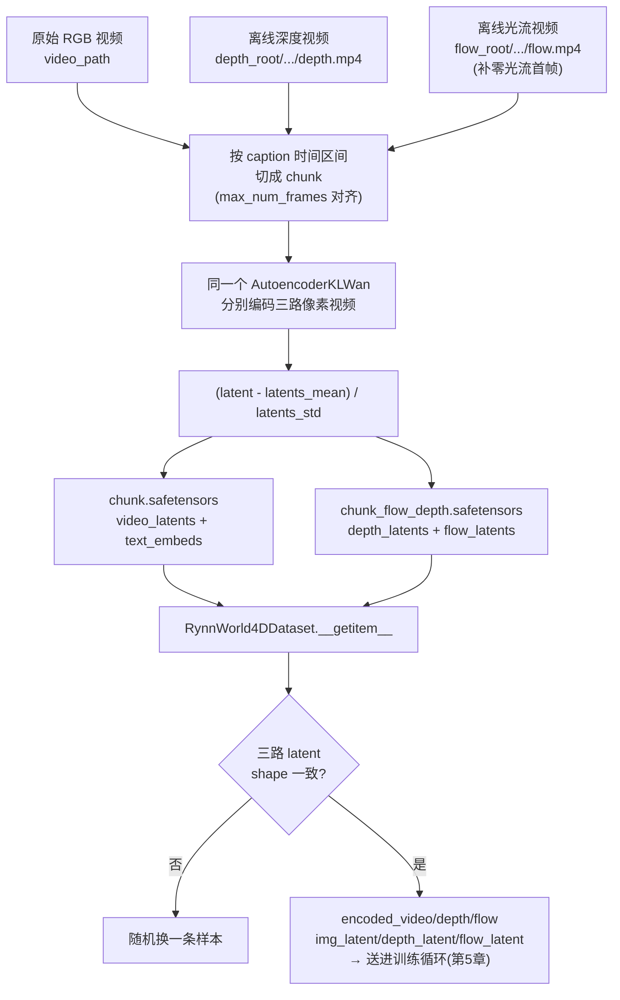

# 数据管线：从原始视频到 RGB/Depth/Flow 三路 Latent

> **前情提要**：第 5 章讲训练时怎么用共享噪声给 `video_latent`/`depth_video_latent`/`flow_video_latent` 加噪构造 `noisy_latents`，第 6 章讲推理时三个 scheduler 怎么从纯噪声一步步去噪回 `latents_video`/`latents_depth`/`latents_flow`。两章都是从"这些 latent 已经存在"这个假设开始讲的——`img_latent`、`text_embedding`、`video_latents` 到底是什么形状、从哪个文件读出来、经过了什么处理才变成训练循环能直接消费的张量，一直没有展开。本章把这一段补上：从一段原始 RGB 视频，加上同步的深度视频和光流视频，到磁盘上两个 `.safetensors` 文件，再到 `Dataset.__getitem__` 吐出的那几个字典 key，完整走一遍。
>
> **相关阅读**：第 2 章 [Tri-Branch 架构总览](./02_TriBranch架构总览_从单分支Wan2.2到三分支世界模型)（VAE 压缩比例、latent 形状的定义）、第 5 章 [训练细节](./05_训练细节_FlowMatching目标与分支随机丢弃)（本章产出的 latent 如何被消费）

## 0. 贯穿本章的例子

用一段具体的原始录像来演示后面每一步：一段 30fps、总长 300 帧（10 秒）的机械臂抓取录像，配一份跨两个时间段的 caption 标注：`[0.0, 5.0, "机械臂靠近方块"]` 和 `[5.0, 10.0, "机械臂抓起方块并放入篮子"]`。同目录下还有离线跑出来的深度视频和光流视频，帧数、分辨率都和 RGB 视频对齐。预处理脚本 `utils/pre-process.py` 要做的事情，就是把这一段视频切成若干个训练用的 chunk，每个 chunk 编码成三路 latent，存成两个文件。

## 1. 三路原始数据从哪来

RynnWorld-4D 训练用的每条数据不是一份文件，而是三份**帧数、分辨率严格对齐**的视频：

| 数据 | 来源 | 约定路径 |
|------|------|----------|
| RGB 视频 | 机器人本身采集的相机录像 | `item['video_path']` 直接指向的原始 mp4 |
| 深度视频 | 用 Depth-Anything 系列模型离线跑一遍原始 RGB 视频，把每帧的深度估计结果编码成一段灰度 mp4 | `depth_root/子路径/exports/mini_npz/depth.mp4` |
| 光流视频 | 用 [ptlflow](https://github.com/hmorimitsu/ptlflow)（一个打包了 RAFT 等多种光流模型的推理库）离线跑一遍原始 RGB 视频，把每两帧之间的位移场编码成一段伪彩色 mp4 | `flow_root/子路径/flow.mp4` |

深度和光流都不是训练时在线算出来的，而是提前用专门的估计模型跑完、存成视频文件——这样做的原因在第 1 章已经点过：深度估计和光流估计本身是成熟的、独立于 RynnWorld-4D 的任务，没必要在训练大模型的同时还占用算力去反复重新推理同一份深度/光流。存成 mp4 而不是存成原始的浮点深度图/光流场，是为了能直接复用视频生成模型现成的 VAE 编码流程（第 4 节会展开这一点）。

"子路径"是同一个概念——`pre-process.py` 里通过 `keyword` 参数把原始 RGB 视频路径按这个关键字切开，去掉扩展名后作为相对路径:

```python
rel_path = video_path_str.split(keyword)[-1]
sub_dir = os.path.splitext(rel_path)[0]
depth_video_path = os.path.join(args.depth_root, sub_dir, "exports/mini_npz", "depth.mp4")
flow_video_path = os.path.join(args.flow_root, sub_dir, "flow.mp4")
```

这段代码要做的事情很直接：假设 RGB 视频存在 `/data/RDT-1B/task01/ep03.mp4`，`keyword="RDT-1B/"`，切出来并去掉扩展名后的相对路径就是 `task01/ep03`，depth/flow 视频分别在 `depth_root/task01/ep03/exports/mini_npz/depth.mp4` 和 `flow_root/task01/ep03/flow.mp4`——三份数据用同一套相对目录结构组织，只是挂在三个不同的根目录下。找不到对应的 depth/flow 文件时脚本直接跳过这条数据（`Skip: {name} not found`），不会用缺失数据凑数。

三路视频对齐这件事不是自动保证的，而是数据准备阶段的硬约束：深度估计模型和光流估计模型都是逐帧/逐帧对处理原始 RGB 视频跑出来的，只要输入帧数和分辨率一致，输出天然就是对齐的。第 6 节会讲到,即便有这层约束,工程上仍然需要一层显式检查来兜底。

## 2. 光流的特殊之处：N 帧视频只有 N-1 个光流,首帧要补零

深度是"逐帧"的量——每一帧都有自己的深度图,视频总帧数不变。光流不是——光流描述的是**两帧之间**的位移,一段 $N$ 帧的视频只能算出 $N-1$ 个光流场(第 1 帧到第 2 帧、第 2 帧到第 3 帧、……、第 $N-1$ 帧到第 $N$ 帧)。这就产生一个实际问题:如果这个 chunk 要送进 VAE 编码 81 帧,RGB 和深度天然就是 81 帧,但光流视频里能对应上的只有 80 帧,直接切片会让光流分支的输入比另外两路少一帧,三路 latent 的时间维度对不上。

预处理脚本用"补一帧零光流在最前面"的方式解决这个错位:

```python
flow_indices = list(range(c_start, c_end - 1))
flow_frames = torch.from_numpy(vr_flow.get_batch(flow_indices).asnumpy()).permute(0, 3, 1, 2)
zero_flow_frame = torch.full_like(flow_frames[:1], 255)
flow_frames = torch.cat([zero_flow_frame, flow_frames], dim=0)
```

这段代码先按 `[c_start, c_end-1)` 取出这个 chunk 对应的光流帧——注意上界是 `c_end - 1` 不是 `c_end`,这正好对应"当前 chunk 里第 $c\_end-1$ 帧朝后的那次位移,已经超出了这个 chunk 的范围,不该算进来"。这样取出来的光流帧数天然比 RGB/depth 少 1 帧。接着构造一帧`zero_flow_frame`,用 `torch.full_like` 把它填成全 255,拼在最前面补齐这一帧的缺口。

为什么是 255 而不是 0:光流视频不是直接存位移的数值,而是存**位移的色彩编码**——业界通用的 Middlebury 光流配色方案里,位移方向映射成色调(hue),位移大小映射成饱和度,**零位移(完全没有运动)对应的是白色**,也就是 RGB 三通道都取最大值 255。项目自己的推理代码里对这一点写得很直接:

```python
def make_zero_flow_latent(self, height, width):
    """Encode a white image (zero optical flow in Middlebury) into a single-frame VAE latent."""
    white_image = Image.new("RGB", (width, height), (255, 255, 255))
    return self.encode_first_frame(white_image, height, width)
```

补在最前面的这一帧,语义上刚好对应这个 chunk 的第一帧——一个 chunk 的第一帧本身要被当成"干净的条件帧"直接放进 `noisy_latents[:, :, 0:1]`(第 5 章讲过这个替换),它不参与去噪,自然也不需要一个"从上一帧到这一帧"的真实位移;给它指定为零位移,和"这是参照系起点、没有运动可言"的直觉完全一致。这样处理之后,光流分支每个 chunk 也凑齐了和 RGB/depth 一样的帧数,三路视频在时间维度上重新对齐。

## 3. Caption 时间切片:一条长视频怎么被切成多个训练样本

一条原始视频往往不止对应一句 caption。数据格式支持给同一段视频标注多个时间区间,每个区间配一句独立的描述:

```json
"caption": [
  {"start_time": 0.0, "end_time": 5.0, "description": "机械臂靠近方块"},
  {"start_time": 5.0, "end_time": 10.0, "description": "机械臂抓起方块并放入篮子"}
]
```

预处理脚本把这种结构统一成 `(start_time, end_time, description)` 三元组的列表;如果 caption 只是一句纯文本(没有时间信息),就统一成 `(0.0, None, 这句话)`,`end_time=None` 在后面会被替换成整段视频的时长。这样不管原始标注是"一整段视频一句话"还是"一段视频切成好几个时间区间各配一句话",后续处理逻辑完全一致。

每个时间区间内部,视频可能仍然比训练用的窗口长得多——比如上面例子里 5 秒对应 150 帧,而模型训练用的 `max_num_frames` 通常是 81 帧,150 帧的片段没法整个塞进一次训练样本。预处理脚本按 `max_num_frames` 把每个 caption 区间再切成若干个 chunk:

```python
start_frame = int(start_t * fps)
end_frame = min(int(end_t * fps), total_frames)
duration_frames = end_frame - start_frame

if duration_frames < self.max_num_frames:
    continue

num_chunks = duration_frames // self.max_num_frames
remainder = duration_frames % self.max_num_frames
if remainder > 40:
    num_chunks += 1
```

**这段代码在做什么**:把一个 caption 覆盖的帧区间 `[start_frame, end_frame)` 按固定长度 `max_num_frames` 切块,算出这个区间能切出几个完整训练样本。

$$
\text{num\_chunks} =
\left\lfloor \frac{\text{duration\_frames}}{\text{max\_num\_frames}} \right\rfloor
+ \mathbb{1}\left[\left(\text{duration\_frames} \bmod \text{max\_num\_frames}\right) > 40\right]
$$

> **一句话**:先看这段视频能整除出几个完整窗口,如果除不尽剩下的那一段够长(超过半个窗口),就再多切一个窗口出来,不让这段数据白白浪费。

**逐符号拆解**:

| 符号 | 含义 | 在本场景中对应什么 |
|------|------|-------------------|
| `duration_frames` | 这个 caption 区间的总帧数 | `end_frame - start_frame` |
| `max_num_frames` | 单个训练样本的固定帧数窗口 | 训练脚本传入的超参数,常见取值 81 |
| $\lfloor \cdot \rfloor$ | 向下取整,即 Python 的整除 `//` | 能切出的"完整"chunk 数 |
| `remainder` | 除不尽的余下帧数 | `duration_frames % max_num_frames` |
| $\mathbb{1}[\cdot > 40]$ | 余数是否大于 40 帧的指示函数,为真取 1,为假取 0 | 决定要不要为余数再开一个 chunk |

**为什么用 40 这个阈值,不是"只要有余数就切"或"只要有余数就丢"**:直接丢弃所有余数,长视频末尾一段有意义的画面永远进不了训练集,浪费数据;但余数如果只有几帧(比如 3 帧),硬切一个新 chunk 会导致这个 chunk 绝大部分内容和前一个 chunk 高度重叠(下面会看到,不满 `max_num_frames` 的余数 chunk 会被强制拉回到和前一个 chunk 大量重叠的位置),边际收益很低,还多占一次 VAE 编码的算力和存储。40 帧(约等于 `max_num_frames` 的一半)是这个取舍的折中阈值:余数够大,值得单独切一个 chunk;余数太小,直接丢弃。

**代入数字**:延续本章开头的例子,第二段 caption `[5.0, 10.0]` 在 30fps 下对应 `start_frame=150, end_frame=300, duration_frames=150`。假设 `max_num_frames=81`:

$$
\text{num\_chunks} = \left\lfloor \frac{150}{81} \right\rfloor + \mathbb{1}[150 \bmod 81 > 40] = 1 + \mathbb{1}[69 > 40] = 1 + 1 = 2
$$

余数 69 帧大于 40,所以从 1 个完整 chunk 变成 2 个 chunk。如果换成整段视频只有一句 caption、覆盖全部 300 帧,`duration_frames=300`:$\lfloor 300/81 \rfloor = 3$,余数 $300 \bmod 81 = 57 > 40$,`num_chunks = 4`。而如果 `duration_frames=250`,$\lfloor 250/81 \rfloor=3$,余数 $250 \bmod 81=7 \le 40$,`num_chunks` 保持 3,末尾这 7 帧被直接丢弃。

算出 `num_chunks` 之后,每个 chunk 的实际帧范围这样确定:

```python
for chunk_idx in range(num_chunks):
    c_start = start_frame + chunk_idx * self.max_num_frames
    c_end = c_start + self.max_num_frames

    if c_end > end_frame:
        c_end = end_frame
        c_start = max(start_frame, c_end - self.max_num_frames)
```

前两行是最直接的等分切块:第 `chunk_idx` 个 chunk 从 `start_frame + chunk_idx * max_num_frames` 开始,取满 `max_num_frames` 帧。但当 `chunk_idx` 对应的是前面因为余数超过 40 而多切出来的那个 chunk 时,`c_start + max_num_frames` 会超出 `end_frame`——这时后两行把 `c_end` 拉回 `end_frame`,再把 `c_start` 反向拉回 `c_end - max_num_frames`,保证这个 chunk 依然凑够完整的 `max_num_frames` 帧,只是代价是和前一个 chunk 产生了重叠。

用 `duration_frames=300, max_num_frames=81` 的例子走一遍全部 4 个 chunk(帧号相对于 `start_frame` 偏移,直接从 0 开始算):

| chunk_idx | 初算 c_start, c_end | 是否超出 end_frame(=300) | 修正后 c_start, c_end | 覆盖帧范围 |
|---|---|---|---|---|
| 0 | 0, 81 | 否 | 0, 81 | 0–80 |
| 1 | 81, 162 | 否 | 81, 162 | 81–161 |
| 2 | 162, 243 | 否 | 162, 243 | 162–242 |
| 3 | 243, 324 | 是(324>300) | `c_end=300`,`c_start=max(0,300-81)=219` | 219–299 |

第 4 个 chunk(`chunk_idx=3`)覆盖 219–299,和第 3 个 chunk(162–242)在 219–242 这 24 帧上重叠——这是"保证每个训练样本帧数固定不变"这个约束下,处理不足一个完整窗口的余数唯一自然的办法:宁可数据重叠,不要产出一个帧数不够、还要额外写 padding 逻辑的短样本。

回到光流对齐:每个 chunk 确定 `c_start, c_end` 之后,前一节讲的 `flow_indices = range(c_start, c_end - 1)` 就是在这个具体的帧范围内取光流,再补一帧零光流对齐——这一步是在 chunk 切分完成之后才发生的,每个 chunk 独立处理。

## 4. VAE 编码:RGB、Depth、Flow 走同一个 VAE,只是内容语义不同

三路视频切好对应的帧范围之后,下一步是编码成 latent。这一步容易有个误解——以为深度、光流各自需要专门设计的编码器。实际上代码里只加载了一个 VAE:

```python
self.vae = AutoencoderKLWan.from_pretrained(self.model_path, subfolder="vae").to(self.device)
```

RGB、depth、flow 三段像素视频**分别独立地**过这同一个 `AutoencoderKLWan` 编码。这行得通的前提是:深度视频和光流视频在磁盘上存的形式,和 RGB 视频完全一样——都是标准的 3 通道、8-bit 像素值的 mp4(深度图渲染成灰度伪 RGB,光流场渲染成 Middlebury 伪彩色 RGB)。VAE 这个模型本身只认识"一段 RGB 像素视频",它不知道、也不需要知道这段像素视频背后代表的是外观、距离还是运动——只要输入的张量形状和数值范围符合它的预期,它就会按同样的方式把它压缩成 latent。这正是第 1 章提到的设计动机:把深度、光流都编码成视频形式,就是为了能直接复用现成的 VAE,不用为每个模态单独训练一套编码器。

编码之前有一步标准化,把像素值从 `[0, 255]` 映射到 VAE 期望的 `[-1, 1]`:

```python
transforms.Lambda(lambda x: x / 255.0 * 2.0 - 1.0)
```

编码完成后,latent 还要再做一次统计意义上的标准化——减掉训练 VAE 时统计出来的均值,除以标准差,让 latent 的数值分布落在一个适合扩散模型训练的范围里:

```python
latents_mean = torch.tensor(self.vae.config.latents_mean).view(1, -1, 1, 1, 1).to(self.device)
latents_std = torch.tensor(self.vae.config.latents_std).view(1, -1, 1, 1, 1).to(self.device)
video_latents = self.vae.encode(video_input).latent_dist.mode()
video_latents = (video_latents - latents_mean) / latents_std
```

$$
z' = \frac{z - \mu}{\sigma}
$$

**这个公式在做什么**:把 VAE 编码出来的原始 latent $z$,按每个通道各自的均值 $\mu$ 和标准差 $\sigma$ 做标准化,得到训练真正使用的 latent $z'$。

> **一句话**:把每个通道的数值都拉到"以 0 为中心、宽度差不多"的范围里,不让某些通道天生数值大就在训练里占主导,某些通道天生数值小就被噪声淹没。

**逐符号拆解**:

| 符号 | 数学含义 | 在本场景中具体是什么 | 维度/典型值 |
|------|---------|---------------------|------------|
| $z$ | VAE 编码器输出的原始 latent | `vae.encode(video_input).latent_dist.mode()` 的结果,取分布的众数(而非采样)作为确定性编码 | 形状 `(1, z_dim, T', H', W')`,`z_dim` 由 VAE 配置决定(第 2 章例子里是 48) |
| $\mu$ | `vae.config.latents_mean`,VAE 训练阶段统计出的每通道均值 | 一个长度为 `z_dim` 的向量,`view` 成 `(1, z_dim, 1, 1, 1)` 以便和 $z$ 逐通道广播相减 | 每个通道各有一个标量均值 |
| $\sigma$ | `vae.config.latents_std`,每通道标准差 | 同上,`view` 成同样的形状用于广播除法 | 每个通道各有一个标量标准差 |
| $z'$ | 标准化后的 latent,真正写进 safetensors、送进 Transformer 的张量 | `video_latents`/`depth_latents`/`flow_latents` | 形状和 $z$ 完全一致,只是数值分布被重新缩放 |

**代入数字**:假设某个通道原始编码值 $z=3.5$,这个通道统计出的 $\mu=-0.76$,$\sigma=2.82$(取自公开的 Wan 系列 VAE 配置里同类通道的量级):

$$
z' = \frac{3.5 - (-0.76)}{2.82} = \frac{4.26}{2.82} \approx 1.51
$$

如果不做这一步标准化,不同通道的原始 latent 数值量级可能差好几倍——有的通道波动范围是 $[-1,1]$,有的是 $[-5,5]$——扩散模型的加噪过程(第 5 章的 $\text{noisy} = (1-\sigma_t) z + \sigma_t \cdot \epsilon$)要求各通道的信号和噪声处在可比的量级上,否则某些通道的信息会被噪声完全淹没,另一些通道又几乎不受噪声影响。按每通道统计量做标准化,是让所有通道在同一个尺度上参与训练的常规做法。

**为什么是减均值除标准差,而不是直接用 min-max 归一化到 $[0,1]$**:均值方差标准化保留了原始分布的形状(只是重新定居中心、缩放尺度),对个别极端值不敏感;min-max 归一化会被单个异常大/小的值把整个通道的有效范围压缩变形。VAE 的 latent 统计量是在大规模数据上预先算好、和模型权重一起发布的,训练和推理阶段必须用同一套 $\mu, \sigma$,否则 latent 的数值分布和模型训练时看到的不一致。

RGB、depth、flow 三路 latent 各自独立走一遍上面这个流程——同一个 VAE,同一套 $\mu, \sigma$,但输入的像素内容不同,输出的 latent 自然也不同。

## 5. 落盘格式:RGB 单独存,Depth+Flow 合并存

三路 latent 编码完成后,不是存成一个文件,而是拆成两份:

```python
data_to_save = {
    "video_latents": video_latents.squeeze(0).cpu().contiguous(),
    "text_embeds": text_embeds.contiguous(),
}
save_file(data_to_save, str(rgb_path))

fd_data = {
    "flow_latents": flow_latents.squeeze(0).cpu().contiguous(),
    "depth_latents": depth_latents.squeeze(0).cpu().contiguous(),
}
save_file(fd_data, str(fd_path))
```

RGB latent 和对应的文本 embedding 存进一个文件(`{start}_{end}_{chunk}.safetensors`),depth latent 和 flow latent 合并存进另一个文件(`{start}_{end}_{chunk}_flow_depth.safetensors`)。这个拆分不是随意的:RGB 视频和文本描述是**每条数据都必须有、且被反复复用**的核心训练目标——不管是不是要训练深度/光流分支,RGB+文本这份数据都用得上;depth/flow 是**可选的附加标注**,不是所有原始视频都跑过深度估计和光流估计(离线跑这两个模型本身有成本,数据集里覆盖率不一定是 100%)。把 RGB 单独存一份,意味着"只有 RGB、没有深度光流标注"的数据依然可以完整用于 Stage1 阶段的 RGB 分支训练,不需要因为缺一个附加文件就整条数据报废。

这个设计直接体现在训练时 Dataset 怎么判断"这条数据有没有深度光流标注"——不是靠某个专门的标志位字段,而是靠 `flow_depth_latents` 这个 key 是否存在:

```python
valid_data = [item for item in data if 'rgb_latents' in item and 'flow_depth_latents' in item]
```

`RynnWorld4DDataset` 在加载 manifest 时直接过滤掉没有 `flow_depth_latents` 字段的条目——目前这个 Dataset 实现要求三分支联合训练时每条数据都必须有完整的深度光流标注,缺失就被排除。但落盘阶段的拆分本身仍然是有意义的:预处理脚本产出的 manifest 里,一条 entry 只要没有跑 `--encode_flow_depth`,就完全不会带 `flow_depth_latents` 字段,只有 `rgb_latents`——这样的数据可以原样喂给第 3 章讲的 Stage1(`fusion_mode=none`)训练,那个阶段本来就不需要跨模态信息,直接复用只编码过 RGB 的数据即可,不需要重新跑一遍预处理。

## 6. 训练时的防御性检查:三路 latent 形状不一致就整条跳过

`wan_dataset.py` 里的 `RynnWorld4DDataset.__getitem__` 从两个文件里分别读出 RGB latent 和 depth/flow latent 之后,做了一次形状比对:

```python
encoded_video = cache_data["video_latents"]              # [C, T, H, W]
encoded_depth = flow_depth_cache_data["depth_latents"]     # [C, T, H, W]
encoded_flow = flow_depth_cache_data["flow_latents"]       # [C, T, H, W]

if encoded_depth.shape != encoded_video.shape or encoded_flow.shape != encoded_video.shape:
    print(f"[Rank {rank}] Shape mismatch at index {index}: ...")
    return self.__getitem__(random.randint(0, len(self) - 1))
```

理论上这个检查应该永远不会触发——第 1 节讲过,三路原始视频在数据准备阶段就要求帧数、分辨率对齐,预处理脚本又是三路统一按同样的 `c_start, c_end` 切片、过同一个 VAE 编码,形状不一致不该发生。但"理论上不该发生"和"工程上确实不会发生"是两件事:深度/光流视频可能是不同批次、不同工具跑出来的,某条数据的深度视频可能因为估计模型跑失败少了几帧、或者中途换过一次分辨率设置,这些问题在大规模数据处理流程里很难做到零遗漏地提前发现。

这行检查的作用不是"修复"数据,而是**在训练循环里提供一个安全退出路径**:一旦碰到形状不匹配的一条数据,不让它带着错位的张量走到后面和 RGB latent 做逐元素加噪、拼接这些操作(那样会直接抛异常让整个分布式训练任务崩掉),而是打印一条日志、换成 `random.randint` 随机抽一条别的数据顶上。牺牲这一条数据,保住整个训练进程不中断,这是数据规模足够大时的合理取舍——比起为每一条可能出问题的数据去反复排查根因,让训练先稳定跑起来,再回头用日志定位哪些数据源出了问题,通常是工程上更划算的路径。这跟前面 `load_file` 失败时的 `max_retries` 重试、最终兜底随机换样本,是同一层防御性设计思路的两个实例。

## 7. 完整数据管线总览



## 8. 下一章预告:从世界模型转向下游策略

到这一章为止,系列的第一部分(全局架构)、第二部分(跨模态融合)、第三部分(推理与数据管线)已经把 RynnWorld-4D 这个世界模型本身——从三分支怎么来、怎么训练、怎么推理、训练数据怎么准备——讲完了一整条闭环。

**第 8 章是整个系列的一个转折点**:接下来不再讨论"怎么生成 RGB/深度/光流视频",而是讨论"生成这三路视频这件事本身产生的中间特征,怎么被复用来直接输出机械臂的动作"。RynnWorld-4D-Policy 的思路是把训练好的三分支世界模型**冻结**,只做一次前向传播提取中间层特征,再接一个 Perceiver Resampler 压缩 token 数量,最后用一个 Flow Matching 策略头把压缩后的特征变成双臂+双灵巧手的动作序列。第 8 章会先给出这套 `VPP_Policy` 的整体数据流,以及它相比原版 VPP(Video Prediction Policy)论文做了哪些关键改动。

## 知识链接

- 第 2 章 [Tri-Branch 架构总览:从单分支 Wan2.2 到三分支世界模型](./02_TriBranch架构总览_从单分支Wan2.2到三分支世界模型) —— `AutoencoderKLWan` 的压缩比例(`z_dim`、时空压缩倍数)和 Patch Embedding 的输入形状,是本章 VAE 编码环节的前置定义
- 第 5 章 [训练细节:Flow Matching 目标、时间步偏移与分支随机丢弃](./05_训练细节_FlowMatching目标与分支随机丢弃) —— 本章产出的 `video_latents`/`depth_latents`/`flow_latents` 如何被拼进 `noisy_latents` 参与 Flow Matching 训练目标
- 第 6 章 [世界模型推理:50 步联合去噪的完整流程](./06_世界模型推理_50步联合去噪完整流程) —— 推理阶段的 `img_latent`/`depth_latent`/`make_zero_flow_latent` 与本章预处理阶段编码首帧的逻辑完全对应
- [Flow Matching 与连续归一化流](/前置知识/000g_前置知识_Flow_Matching与连续归一化流) —— 理解为什么 latent 各通道需要标准化到可比量级才能参与加噪训练
- [3D 卷积与 Causal 卷积](/前置知识/002a_前置知识_3D卷积与Causal卷积) —— VAE 时间维度压缩(`scale_factor_temporal`)背后的因果卷积机制
