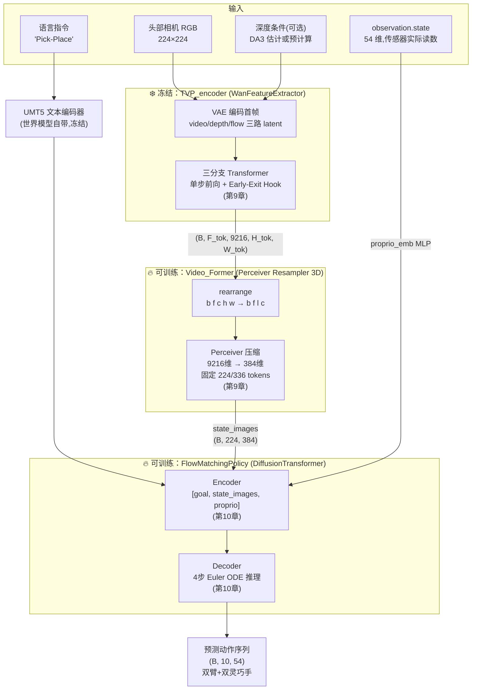

# 策略架构总览：冻结 Backbone + Perceiver 压缩 + Flow Matching 动作头

> **前情提要**：第 1-7 章讲完了 RynnWorld-4D 这个世界模型本身的完整闭环——三分支架构怎么从单分支 Wan2.2 改造而来（第 2 章）、三阶段训练怎么让三个分支学会互相看对方（第 3-5 章）、推理时怎么联合去噪生成三路视频（第 6 章）、训练数据怎么从原始视频处理成三路 latent（第 7 章）。这一整条链路的产出是**生成一段 RGB + 深度 + 光流视频**。
>
> **本章是整个系列的转折点**：接下来七章不再关心"怎么生成视频"，而是关心"这个已经练成的视频生成模型，怎么被拿来直接控制机械臂"。这就是 `RynnWorld-4D-Policy` 要做的事，它改造自一个已有的项目 **VPP（Video Prediction Policy）**。本章先建立起 `VPP_Policy` 这个类的整体骨架认知，把三大组件"谁是谁、谁接谁"讲清楚，具体每个组件的内部实现留给第 9、10 章。
>
> **相关阅读**：第 2 章 [Tri-Branch 架构总览](./02_TriBranch架构总览_从单分支Wan2.2到三分支世界模型)（本章要复用的 3072 维 Transformer 隐层就是那里定义的）

## 0. 贯穿本章的例子

延续系列的机械臂场景，但视角切换成策略而不是世界模型：Tianji 双臂机器人面前摆着一个方块和一个篮子，任务指令是"Pick-Place"（拿起方块放进篮子）。机器人头部相机拍到一帧 224×224 的画面，同时机器人自己的关节传感器汇报当前双臂+双手一共 54 个自由度的实际角度。策略网络要做的事，是根据这一帧画面、这句指令、这 54 维当前状态，输出接下来 10 个时间步、每步 54 维的动作序列，让双臂真的把方块捡起来放进篮子。后面每引入一个新组件，都会说清楚它在这条链路里处理的是哪一段。

## 1. 为什么世界模型能被搬来做策略：VPP 的核心思路

先回答一个直觉上不太自然的问题：一个训练来"生成视频"的模型，为什么能被用来"预测动作"？

视频生成模型在训练时被逼着学会一件事——给定当前帧和文字指令，预测未来会发生什么。要做好这个预测，模型内部必须建立起对物理世界的隐式理解：物体的形状、材质、运动趋势、手和物体的交互关系。这些理解不是只在模型的最终输出（像素）里才存在，而是分布在 Transformer 每一层的中间激活里。VPP（Video Prediction Policy，[arXiv:2412.14803](https://arxiv.org/abs/2412.14803)，项目地址 [roboterax/video-prediction-policy](https://github.com/roboterax/video-prediction-policy)）的核心洞察是：**不需要真的跑完整个视频生成流程去拿最终画面，只需要做一次前向传播、抠出中间某一层的激活，就能拿到一份对物理世界理解很丰富的视觉表征**，这份表征比一般图像分类模型（如 CLIP、ResNet）编出来的特征更贴近"下一步会怎么变化"这个机器人真正关心的问题。

VPP 原本的做法是：拿一个预训练好的 **Stable Video Diffusion（SVD）** 模型作为特征提取器，冻住它的全部参数，只做**一步**前向（不是完整的多步去噪采样），从 UNet 某个中间层 hook 出激活，接一个轻量的策略头，把这份视觉特征变成机械臂的动作。这里有三个关键信息需要在往下读之前钉死：

1. **backbone 全程冻结**，只有后接的策略头是可训练的——这意味着策略训练不会碰、也不会改变世界模型本身的知识
2. **只做一步前向，不跑完整的去噪采样**——世界模型原本要迭代 50 步才能生成一段视频（第 6 章），但这里只需要中间层的激活,不需要看到最终生成的画面，一步前向就够了
3. **策略头是新增的、专门训练的模块**——负责把视觉特征、语言目标、机器人自身状态，整合成动作序列

RynnWorld-4D-Policy 做的事情，就是把 VPP 这套思路里的 backbone 换成 RynnWorld-4D 的三分支 Wan2.2，同时对策略头和训练细节做了一系列适配。接下来六节逐项拆解这些改动。

## 2. 六项改动逐项拆解

`rynnworld4d_policy/README.md` 里明确列出了相对原版 VPP 的六项改动。下面按"原版怎么做 → 改成什么 → 为什么这样改"的顺序逐一讲清楚，这也是判断一个改动是否合理的标准框架。

### 2.1 Backbone：SVD → RynnWorld-4D 三分支 Wan2.2

**原版怎么做**：VPP 用 Stable Video Diffusion 的 UNet 做特征提取器。SVD 是单分支的图生视频扩散模型，UNet 中间层的隐藏维度是 1280，所以 VPP 里 `condition_dim = 1280`——策略头的视觉输入通道数就是这个 1280。

**改成什么**：换成 RynnWorld-4D 的三分支 `JointRynnWorld4DTransformer3DModel`。三分支各自的 Transformer 隐层维度是 3072（`num_attention_heads=40 × attention_head_dim`，第 2 章定义过），三个分支（video / depth / flow）各出一份 3072 维的 token，沿通道维度拼接：

$$
\text{condition\_dim} = 3072 \times 3 = 9216
$$

**为什么这样改**：SVD 只见过 RGB 像素，它的中间层特征里没有显式的几何信息（深度）和运动信息（光流）——这些信息要靠模型自己隐式地从像素规律里"猜"出来。RynnWorld-4D 训练时被逼着显式生成深度和光流（第 1-5 章的核心内容），意味着它的三个分支各自维护着一份专门针对几何、专门针对运动的表征。策略头如果只拿 video 分支的特征，等于白白浪费了另外两个分支已经算好的几何、运动信息；把三个分支的输出直接在 channel 维度拼接，是拿到这份"免费"信息最简单的方式——不需要额外训练一个融合模块，压缩 token 数量这件事交给下一步的 Perceiver 处理就行。

### 2.2 Policy Head：EDM Diffusion → Flow Matching

**原版怎么做**：VPP 的策略头用 EDM（Karras et al. 提出的 score matching 扩散公式）训练，推理时用 DDIM 或 Heun 这类多步采样器，通常需要 10 步左右才能从噪声采样出一个可用的动作序列。EDM 的训练目标涉及噪声水平相关的加权系数、以及训练和推理阶段两套不同的 sigma 调度（`sigma_min`、`sigma_max`、`noise_scheduler` 等一堆超参数），实现和调参都相对繁琐。

**改成什么**：换成 Conditional Flow Matching。训练时的做法可以用一句话概括：把噪声和真实动作沿着一条直线插值，让网络学会预测这条直线的方向（速度场）；推理时不再需要复杂的多步采样器，改用最简单的 Euler 常微分方程积分，默认只需要 **4 步**就能从噪声积分回一个可用的动作序列。这套训练目标和采样过程的完整数学推导、每一项的意义，留到第 10 章结合 `FlowMatchingPolicy` 的代码逐行展开；这里只需要记住一个结论——同样是"从噪声生成一个动作序列"这件事，Flow Matching 用更少的超参数、更少的推理步数做到了。

**为什么这样改**：EDM 需要精心设计噪声调度、还需要在训练和推理之间对齐 sigma 的定义，这套机制是为了处理扩散模型里"分数函数在不同噪声水平下量级差异很大"这个问题而设计的，对一个只需要预测 54 维、10 步动作序列的轻量策略头来说是过度设计。Flow Matching 用线性插值代替了这套调度，训练目标简化成一个 MSE，推理步数也从 10 步降到 4 步——这对策略部署尤其关键，因为策略是在真机上**闭环运行**的，第 12 章会讲到部署要求 9Hz 以上的推理频率，采样步数减少直接换来更低的推理延迟。

### 2.3 新增本体感知（Proprioception）输入

**原版怎么做**：VPP 的策略头只吃两类输入——视觉特征和语言目标（goal），不知道机器人自己当前的关节实际在哪个角度。

**改成什么**：新增一路 54 维的 `observation.state` 作为额外输入，专门过一个 MLP（`proprio_emb`）映射成和视觉 token 同维度的 embedding，再拼进编码器的输入序列。

这里有一个容易忽略但很关键的设计选择：这 54 维输入用的是 **state（观测到的实际状态）**，不是 **action（发给电机的控制指令）**。二者维度相同（都是 54 维：7 左臂 + 7 右臂 + 20 左手 + 20 右手），语义完全不同：

| | 数据来源 | 语义 |
|---|---|---|
| `observation.state` | 关节编码器/传感器读数 | 机器人**实际**处在什么位置——真实发生的物理状态 |
| `action` | 上一步发给电机驱动器的指令 | 系统**想让**机器人去到什么位置——一个意图，不保证被完美执行 |

**为什么用 state 不用 action**：电机指令和电机实际执行之间存在偏差——负载、摩擦、控制延迟、机械间隙都会让"发出去的指令"和"真正走到的位置"不完全一致。如果策略头喂进去的是上一步的 action，它感知到的是"系统以为自己在哪"，一旦真实执行有偏差，这个偏差会在闭环控制里不断累积，策略会基于一个逐渐失真的"自我认知"做决策。用 state 则是直接读传感器，反映的是机器人这一刻**真实**所处的物理状态,策略每一步都能根据"真实发生了什么"重新校正,不会被指令层面的偏差带偏。`vpp_policy.py` 里对应这行:

```python
if self.proprio_dim > 0 and 'state' in dataset_batch:
    predictive_feature['state_obs'] = dataset_batch['state'].to(self.device).to(torch.float32)
```

`tianji_dataset.py` 里也能验证这个取数逻辑——`state` 字段直接来自 parquet 里的 `observation.state` 列，而 `actions` 字段来自单独的 `action` 列,两者是数据集里两个独立的字段,不是同一份数据的不同视角。

### 2.4 输入分辨率：480×640 → 224×224

**原版怎么做**：SVD 默认按更高分辨率（接近 480×640）处理输入图像。

**改成什么**：README 里给出的改动是把输入 RGB 降到 224×224，数据增强也相应调整为 `Resize(256) + RandomCrop(224) + ColorJitter`，训练速度提升约 3 倍。需要提一句工程上的实际情况：仓库里 `policy_conf/train_config.yaml` 这份示例配置目前填的仍是 `wan_height=480, wan_width=640`，说明这是一份未同步更新的样例配置，`README` 描述的是这项改动的设计意图和默认建议值，实际训练时这两个值是可以通过 Hydra 配置直接覆盖的超参数。

**为什么这样改**：Transformer 的自注意力计算量随 token 数量呈平方增长，而 token 数量由输入分辨率经过 VAE 压缩、Patch Embedding 之后的空间网格大小决定——分辨率降低到大约三分之一的边长，视觉 token 数量会降得更多。策略训练本身的目标是学一个相对轻量的动作映射，不需要世界模型那种生成高清视频所要求的细节保真度；降分辨率是用可以接受的视觉细节损失换训练速度,这笔账在策略训练这个场景下是划算的。

### 2.5 数据集：Calvin → Tianji

**原版怎么做**：VPP 用 Calvin，一个仿真环境里的桌面操作数据集，单臂、固定的仿真物理引擎。

**改成什么**：换成 Tianji 天机双臂机器人的真机数据集。`policy_models/datasets/tianji_dataset.py` 里的 `TianjiVideoDataset` 直接读每个 episode 目录下的 `observation.images.head.mp4`（头部相机视频）和 `timeseries.parquet`（逐帧的 `action` 和 `observation.state` 列），`action_dim = 54`（对应双臂 + 双灵巧手），并且支持按 per-dim 均值/标准差对动作做归一化（统计量算好后存成 `action_stats.json`，训练和部署共用同一份统计量,这一点和第 7 章讲到的 VAE latent 标准化是同一个工程原则：训练和推理必须用同一套归一化参数）。

**为什么这样改**：仿真数据和真机数据之间存在没法完全消除的 sim-to-real gap——物理引擎的接触力学、材质摩擦系数、传感器噪声都和真实世界有系统性差异，仿真里训好的策略搬到真机上往往会掉点。RynnWorld-4D-Policy 的目标是真机部署（第 12 章），直接用真机数据训练避免了这层迁移损失，代价是数据采集成本更高、episode 数量通常远少于仿真（仓库自带的样例只有 3 条 episode，完整 Tianji-Wuji Pick-Place 数据集是 250 条）。

### 2.6 代码精简：移除不需要的组件

**原版怎么做**：VPP 的代码库里保留了完整的 SVD pipeline、EDM 的各种噪声调度和采样器实现、双相机 gripper 视角的处理逻辑,以及 Calvin/XBot 相关的数据集和评估脚本。

**改成什么**：RynnWorld-4D-Policy 精简掉了这些不再需要的部分：

| 移除的组件 | 原本的作用 | 为什么现在不需要 |
|---|---|---|
| `StableVideoDiffusionPipeline`、`Diffusion_feature_extractor` | SVD 特征提取 | backbone 已经换成 RynnWorld-4D |
| `GCDenoiser`、`gc_sampling`、各种 noise schedule/sampler | EDM 扩散的训练和采样 | 策略头已经换成 Flow Matching |
| Gripper 双相机逻辑 | 处理带独立夹爪相机视角的场景 | Tianji 数据只用单个头部相机 |
| Calvin/XBot 数据集和评估脚本 | 仿真数据加载和评测 | 数据源已经换成 Tianji |
| Stage-1 视频训练代码 | VPP 自己的视频预测预训练阶段 | RynnWorld-4D 已经是训练好的现成 backbone,不需要重新做视频预训练 |

**为什么这样改**：这是一条纯粹的工程卫生原则——一旦 backbone、policy head、数据集三个核心组件全部替换，原来为旧组件服务的代码就变成了死代码。留着不用的代码会增加维护负担，也容易在后续修改时被误以为还在生效路径上。

六项改动放在一起看，可以发现它们围绕的是同一条主线：**用一个信息更丰富的 backbone（三分支替代单分支）、一个更轻量的训练/推理机制（Flow Matching 替代 EDM）、一份更贴近真实部署场景的数据（真机替代仿真、加入本体感知），去掉一切不再需要的旧组件**。这构成了下一节要讲的 `VPP_Policy` 类的整体组装逻辑。

## 3. VPP_Policy 的整体组装：三大组件谁接谁

`policy_models/vpp_policy.py` 里的 `VPP_Policy` 是一个 `pytorch_lightning.LightningModule`，它的 `__init__` 方法把上一节讲的所有改动串成一个可训练的整体。在看代码之前先把这三大组件的分工说清楚——读完这三句话，后面的代码只是在验证这个认知：

1. **`TVP_encoder`（`WanFeatureExtractor`）**：冻结的 backbone，负责把一帧 RGB（加上可选的深度条件）过一次 RynnWorld-4D 三分支 Transformer 的前几层，抠出中间层的 9216 维三分支拼接特征。这是本章"复用世界模型"这件事具体落地的地方，内部怎么做单步前向、怎么用 hook 提前截断计算，留给第 9 章。
2. **`Video_Former`（`Video_Former_3D`）**：一个 Perceiver Resampler，负责把 `TVP_encoder` 吐出来的、数量随分辨率变化的视觉 token，压缩成固定数量（配置里是 224 或 336）、固定维度（384）的 token 序列。这一步存在的必要性很直接：backbone 输出的 token 数量随输入分辨率和三分支拼接方式变化，而策略头需要一个固定长度的序列才能稳定训练——Perceiver 用一组可学习的 query 向量去"查询"压缩变长的视觉特征，天然能把任意长度的输入映射成固定长度的输出。具体的注意力机制，留给第 9 章展开。
3. **`model`（`FlowMatchingPolicy`）**：真正预测动作的策略头，接收 `Video_Former` 压缩后的视觉 token、本体感知的 proprio 向量、语言目标的 embedding，用 Flow Matching 训练/推理出未来若干步的动作序列。内部的 Encoder-Decoder 结构、FiLM 条件化机制,留给第 10 章。

这三个组件在 `__init__` 里出现的顺序,正好对应它们在前向数据流里被调用的顺序——先算 condition_dim,再建 Video_Former,再建 TVP_encoder,再建 model。来看这段构造代码：

```python
wan_inner_dim = 3072
n_layers = len(wan_extract_block_idx) if isinstance(wan_extract_block_idx, (list, tuple)) else 1
n_branches = 3 if backbone == 'rynnworld4d' else 1
condition_dim = wan_inner_dim * n_layers * n_branches if use_all_layer else wan_inner_dim * n_branches

if use_Former == '3d':
    self.Video_Former = Video_Former_3D(
        dim=latent_dim, depth=Former_depth, dim_head=Former_dim_head,
        heads=Former_heads, num_time_embeds=Former_num_time_embeds,
        num_latents=num_latents, num_frame=Former_num_time_embeds,
        condition_dim=condition_dim, use_temporal=True,
    )
```

`condition_dim` 这几行就是 2.1 节那个 9216 的计算过程写成代码的样子：`backbone='rynnworld4d'` 时 `n_branches=3`，如果只提取单层特征（`use_all_layer=False`，训练配置里的默认值），`condition_dim = 3072 × 3 = 9216`；`Video_Former_3D` 构造时把这个 9216 作为 `condition_dim` 传进去,内部第一层就是把 9216 维的输入线性投影到 `latent_dim=384`（第 9 章会看到这个投影层）。

接下来是 `TVP_encoder`：

```python
self.TVP_encoder = WanFeatureExtractor(
    wan_pretrained_path=pretrained_model_path,
    extract_block_idx=wan_extract_block_idx,
    use_all_layer=use_all_layer,
    num_frames=wan_num_frames,
    height=wan_height, width=wan_width,
    dtype=torch.bfloat16,
    backbone=backbone,
    rynnworld4d_ckpt=rynnworld4d_ckpt,
    sft_ckpt_path=sft_ckpt_path,
    rynnworld4d_fusion_mode=rynnworld4d_fusion_mode,
    rynnworld4d_share_ffn=rynnworld4d_share_ffn,
    rynnworld4d_zero_fusion=rynnworld4d_zero_fusion,
    rynnworld4d_joint_start_layer=rynnworld4d_joint_start_layer,
    num_inference_layers=wan_num_inference_layers,
    da3_quantize=da3_quantize,
)
self.TVP_encoder.pipeline.to(self.device)
```

这里传进去的一大串 `rynnworld4d_*` 参数（`fusion_mode`、`share_ffn`、`zero_fusion`、`joint_start_layer`）不是新概念——它们和第 3、4 章讲过的三分支融合机制里的同名参数完全对应，因为 `WanFeatureExtractor` 内部加载的就是训练好的 `JointRynnWorld4DTransformer3DModel`，策略训练要复用世界模型训练阶段学到的这套跨模态注意力权重,而不是重新训一个新的融合机制。`wan_num_inference_layers` 是新出现的参数，对应"只跑前 N 层就提前退出"的 Early-Exit 机制，这是第 9 章的主题。

最后是策略头：

```python
self.model = FlowMatchingPolicy(
    action_dim=action_dim, obs_dim=latent_dim, goal_dim=4096,
    num_tokens=num_latents, goal_window_size=goal_seq_len,
    obs_seq_len=obs_seq_len, act_seq_len=action_seq_len,
    device=self.device, proprio_dim=proprio_dim,
).to(self.device)
```

`obs_dim=latent_dim`（384）——策略头吃的视觉输入维度，正是 `Video_Former` 压缩后的输出维度，不是 backbone 原始的 9216。`goal_dim=4096` 是语言目标 embedding 的维度，来自 RynnWorld-4D 世界模型自带的 UMT5 文本编码器（`TVP_encoder._encode_text`）的输出维度——策略头的语言理解能力也是白捡的，直接复用世界模型训练时用来编码 caption 的同一个文本编码器,不需要为策略单独训一个语言模块。

三个组件的输入输出维度串起来，正好是一条无缝对接的链路：

$$
\underbrace{9216}_{\text{TVP\_encoder 输出}} \xrightarrow{\text{Video\_Former}} \underbrace{384}_{\text{model 的 obs\_dim}}
$$

这不是巧合，而是构造顺序决定的约束——`Video_Former` 的 `condition_dim` 必须等于 `TVP_encoder` 的输出通道数，`Video_Former` 的 `dim`（也就是输出维度）必须等于 `FlowMatchingPolicy` 的 `obs_dim`，`__init__` 里这三行代码的排列顺序本身就是在显式地对齐这条维度链。

`__init__` 的末尾还有一段容易被忽略但值得记录的处理:

```python
if proprio_dim == 0:
    for param in self.model.inner_model.proprio_emb.parameters():
        param.requires_grad = False
self.model.inner_model.pos_emb.requires_grad = False
```

如果配置里 `proprio_dim=0`（不使用本体感知），`proprio_emb` 这个 MLP 依然会被创建（`DiffusionTransformer.__init__` 里无条件构造了它），但会被冻结——不参与训练也不参与前向里 state 分支的计算，只是留着占位不报错。`pos_emb` 被显式冻结则是另一个独立的设计选择：位置编码这类结构性先验一旦初始化定型，通常不需要随任务数据继续学习。

## 4. training_step 揭示的完整前向数据流

组件之间"谁接谁"讲清楚之后，看 `training_step` 和它调用的 `extract_predictive_feature`，就能看到这些组件在一次训练迭代里具体是怎么被串起来执行的：

```python
def training_step(self, dataset_batch: Dict[str, Dict]) -> torch.Tensor:
    predictive_feature, latent_goal = self.extract_predictive_feature(dataset_batch)
    loss, _ = self.model.loss(predictive_feature, dataset_batch["actions"], latent_goal)
    self.log("train/action_loss", loss, on_step=False, on_epoch=True, sync_dist=True,
             batch_size=dataset_batch["actions"].shape[0])
    return loss
```

两行核心逻辑：先用 `extract_predictive_feature` 从这一批数据里抽出"视觉+本体感知"的联合特征和语言目标，再交给 `model.loss` 算 Flow Matching 的训练损失。`extract_predictive_feature` 才是本章数据流的重点，拆成四步看：

**第一步，语言目标编码。** 训练数据里语言目标可能是预先算好的 embedding（`lang_text_embedding`），也可能是原始文本（`lang_text`）需要现场编码：

```python
if "lang_text_embedding" in dataset_batch:
    latent_goal = dataset_batch["lang_text_embedding"].to(self.device)
    language = None
else:
    language = dataset_batch["lang_text"]
    with torch.no_grad():
        latent_goal = self.TVP_encoder._encode_text(language, max_length=self.text_max_length)
latent_goal = latent_goal[:, :self.goal_seq_len, :].to(rgb_static.dtype)
```

支持预计算 embedding 的原因很实际：第 8 章开头提到 `TVP_encoder` 内部持有的 UMT5 文本编码器体量不小（第 7 章提过训练数据管线里会把文本 embedding 缓存到磁盘），如果每条 Tianji 数据用的都是同一句固定指令（比如都是"Pick-Place"），没必要每次训练迭代都重新跑一遍文本编码器，提前算好存成 `.safetensors` 直接读更省算力——这和第 7 章讲的 `text_embeds` 落盘复用是同一个工程思路。

**第二步，视觉特征提取。** 这一步调用冻结的 `TVP_encoder`，也是"复用世界模型"这件事真正发生的地方：

```python
with torch.no_grad():
    perceptual_features = self.TVP_encoder(
        rgb_static, language, self.timestep,
        self.extract_layer_idx, all_layer=self.use_all_layer,
        step_time=1, max_length=self.max_length,
        depth_cond=depth_cond,
    )
```

`torch.no_grad()` 包裹整个调用，这是"backbone 全程冻结"这条设计原则在代码层面的体现——梯度不会流进 `TVP_encoder` 内部,不管这次前向做了多少层 Transformer 计算,反向传播都不会碰它的参数。`self.timestep=500` 这个参数留一个悬念给第 9 章：视频生成模型的前向本来需要一个噪声时间步作为输入，特征提取只做一步前向，这个时间步要固定成什么值、为什么是 500，属于第 9 章的内容。

**第三步，形状重排 + Perceiver 压缩。** `TVP_encoder` 输出的是 `(B, F_tok, condition_dim, H_tok, W_tok)` 这样一个带空间网格的五维张量，要先摊平成 Perceiver 期望的三维序列：

```python
perceptual_features = einops.rearrange(perceptual_features, 'b f c h w -> b f c (h w)')
perceptual_features = einops.rearrange(perceptual_features, 'b f c l -> b f l c')
perceptual_features = perceptual_features[:, :num_frames, :, :]

perceptual_features = perceptual_features.to(torch.float32)
perceptual_features = self.Video_Former(perceptual_features)
```

两行 `rearrange` 做的事情是把空间维度 `h w` 合并成一维 `l`（每个空间位置当作一个 token），再把通道维 `c` 换到最后一维——这是为了匹配 `Video_Former_3D.forward` 要求的输入形状 `(batch_size, n_frames, n_features, d_visual)`（第 9 章会展开这个 Perceiver 具体怎么消费这个形状）。`Video_Former` 吃进 `(B, F, L, 9216)`，吐出 `(B, num_latents, 384)`——这一步把原本随分辨率变化的、数量不固定的视觉 token，压成了策略头能直接消费的固定长度序列。

**第四步，拼上本体感知，打包成策略头的输入格式。**

```python
predictive_feature = {'state_images': perceptual_features, 'modality': 'lang'}

if self.proprio_dim > 0 and 'state' in dataset_batch:
    predictive_feature['state_obs'] = dataset_batch['state'].to(self.device).to(torch.float32)

return predictive_feature, latent_goal
```

`predictive_feature` 是一个字典，不是单一张量——`state_images` 装着 Perceiver 压缩后的视觉特征，`state_obs` 装着 2.3 节讲的 54 维 proprioception。这个字典会被原样传进 `FlowMatchingPolicy.loss`，第 10 章会看到 `DiffusionTransformer` 怎么从这个字典里分别取出 `state_images` 和 `state_obs`，各自过一层 embedding 之后拼进同一个 Transformer 编码器的输入序列。

把这四步和 `training_step` 的第二行接起来，一次训练迭代的完整链路是：**图像 + 深度条件 → 冻结的 TVP_encoder 提取三分支拼接特征 → 形状重排 → Video_Former 压缩成固定长度 token → 拼上 proprio → 交给 FlowMatchingPolicy 算 Flow Matching loss**。`extract_predictive_feature` 在推理路径的 `eval_forward` 里也被几乎一模一样地调用了一遍（差异只是最后调用 `model.sample` 而不是 `model.loss`），说明训练和推理共用同一套特征提取逻辑,这也是"backbone 冻结、只训策略头"这个设计下自然会得到的结果——特征提取环节本身不区分训练和推理阶段。

## 5. 整体架构图



## 6. 总结：VPP 原版 vs RynnWorld-4D-Policy

| 维度 | 原版 VPP | RynnWorld-4D-Policy |
|---|---|---|
| Backbone | Stable Video Diffusion (SVD UNet) | RynnWorld-4D 三分支 Wan2.2 Transformer |
| condition_dim | 1280 | 9216 = 3072 × 3 |
| Policy Head 训练目标 | EDM (Karras) score matching | Conditional Flow Matching |
| 推理采样步数 | ~10 步（DDIM/Heun） | 4 步（Euler ODE） |
| 本体感知输入 | 无 | 54 维 `observation.state` |
| 输入分辨率 | ~480×640 | 224×224（设计目标） |
| 数据集 | Calvin（仿真） | Tianji（真机双臂灵巧手） |
| 动作维度 | 视 Calvin 任务而定 | 54（7+7+20+20） |
| Backbone 是否冻结 | 是 | 是 |

这张表格背后的共同逻辑是本章反复强调的一点：backbone 换成了信息更丰富的三分支模型，policy head 换成了更轻量的训练/推理机制，数据源换成了更贴近真实部署场景的真机数据，但"冻结 backbone、只训一个轻量策略头"这个核心范式没有变——这正是 VPP 这条技术路线的立足点：预训练视频生成模型的中间特征已经足够好，不需要重新训练一个视觉编码器,策略学习要做的只是学会怎么"读懂"这份特征并转成动作。

## 7. 下一章预告：特征提取的具体机制

本章把 `VPP_Policy` 的整体骨架和数据流讲清楚了，但故意跳过了三个关键的"怎么做"：`WanFeatureExtractor` 内部怎么做单步前向、怎么用 forward hook 在指定层截获激活并提前中止计算（Early-Exit）、深度条件缺失时怎么用 Depth-Anything-3 在线估计兜底。第 9 章 **《特征提取：Early-Exit Hook 与三分支 Token 拼接》** 会把 `wan_feature_extractor.py` 逐行拆开，讲清楚这些机制具体怎么实现、为什么这样设计。

## 知识链接

- 第 2 章 [Tri-Branch 架构总览：从单分支 Wan2.2 到三分支世界模型](./02_TriBranch架构总览_从单分支Wan2.2到三分支世界模型) —— 本章反复用到的 3072 维 Transformer 隐层、三分支概念都在这里首次定义
- 第 7 章 [数据管线：从原始视频到 RGB/Depth/Flow 三路 Latent](./07_数据管线_从原始视频到RGBDepthFlow三路Latent) —— 文本 embedding 预计算落盘复用的思路，与本章 `lang_text_embedding` 的处理方式一致
- [Perceiver Resampler：跨模态 Token 压缩](/前置知识/002o_前置知识_Perceiver_Resampler跨模态Token压缩) —— `Video_Former` 的通用原理，第 9 章会结合具体代码再展开
- [Flow Matching 与连续归一化流](/前置知识/000g_前置知识_Flow_Matching与连续归一化流) —— Policy Head 训练目标的数学基础，第 10 章会给出完整的公式推导与数值示例
- 第 9 章 [特征提取：Early-Exit Hook 与三分支 Token 拼接](./09_特征提取_EarlyExitHook与三分支Token拼接) —— 下一章，展开 `TVP_encoder` 的内部实现
- 第 10 章 [Flow Matching 策略头：DiffusionTransformer 编解码器详解](./10_FlowMatching策略头_DiffusionTransformer编解码器详解) —— 展开 `FlowMatchingPolicy` 的 Encoder-Decoder 实现
