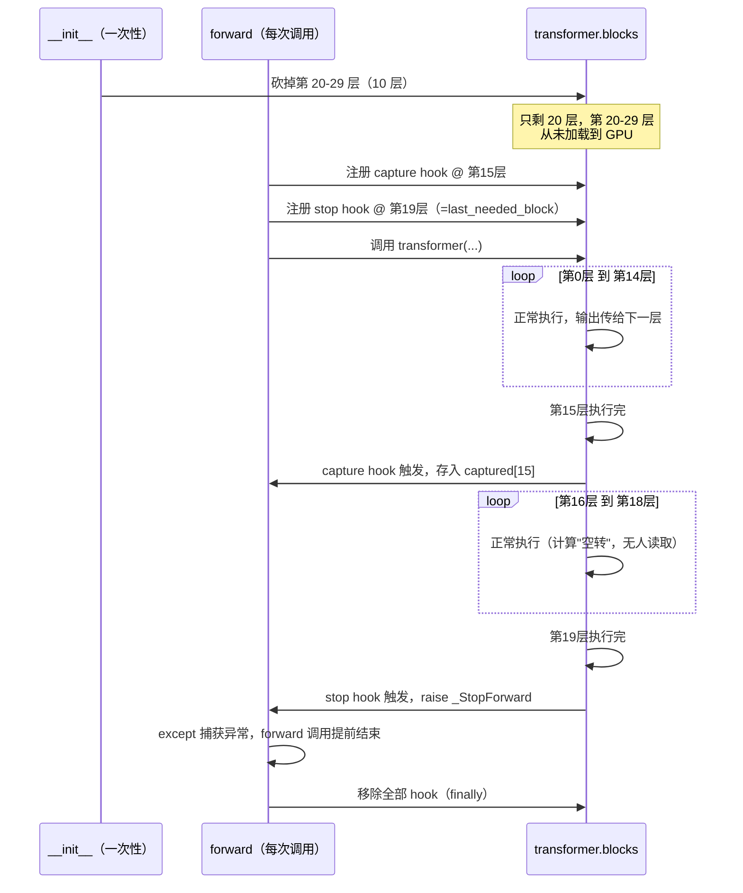
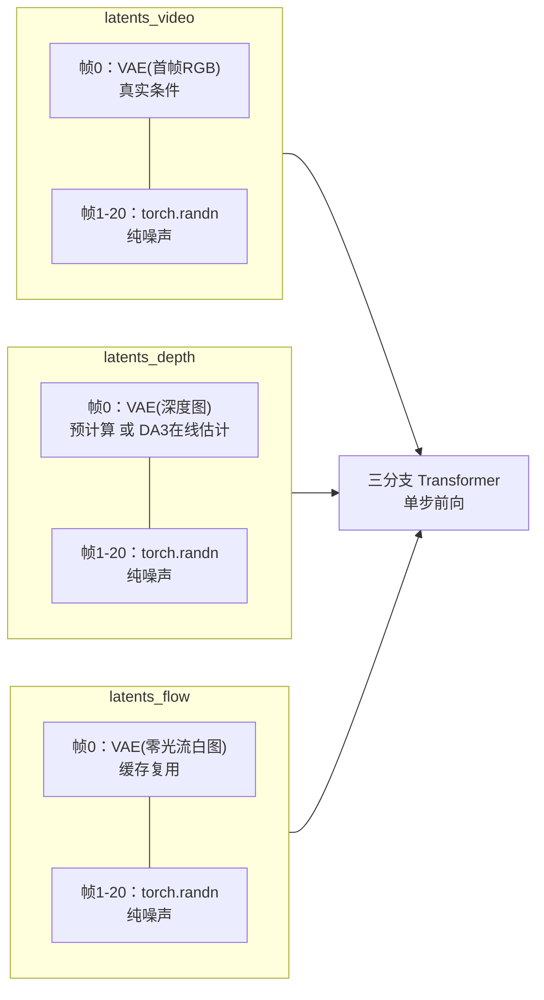

# 特征提取：Early-Exit Hook 与三分支 Token 拼接

> **前情提要**：第 8 章给出了 `VPP_Policy` 的整体数据流——冻结的三分支世界模型（代码里叫 `self.TVP_encoder`，就是本章要打开的 `WanFeatureExtractor`）先把一张首帧图像变成一份视觉特征，`Video_Former`（Perceiver Resampler 3D）把这份特征压缩成 224 个 token，Flow Matching 策略头再把压缩后的 token 变成机械臂动作。第 8 章把 `TVP_encoder` 当作一个黑箱：输入一张图，输出 `condition_dim=9216` 的特征。这一章把这个黑箱打开。
>
> **相关阅读**：[Perceiver Resampler：跨模态 Token 压缩](/前置知识/002o_前置知识_Perceiver_Resampler跨模态Token压缩)（本章输出的下一步去向）、[KV-Cache 与自回归解码](/前置知识/002m_前置知识_KV_Cache与自回归解码)（本章的 Early-Exit 思路可以类比其中"复用已经算过的中间结果"的原则）、第 2 章 [Tri-Branch 架构总览](./02_TriBranch架构总览_从单分支Wan2.2到三分支世界模型)（`inner_dim=3072`、`patch_size=(1,2,2)`、VAE 空间压缩比 16 的定义来源）、第 6 章 [世界模型推理](./06_世界模型推理_50步联合去噪完整流程)（首帧条件注入的写法在这里被复用）

## 0. 先把"打开黑箱"这件事的边界说清楚

`WanFeatureExtractor` 这个类名字带着"Wan"，但它包一层皮之后干的事和世界模型本身完全不同。世界模型（第 6 章）的任务是：从纯噪声开始，用 50 步 UniPC 迭代，一步步把噪声去掉，最终生成一段完整的、能拿去播放的 RGB/深度/光流视频。它关心的是"生成结果好不好看"。

`WanFeatureExtractor` 的任务是：给它一张图（外加一句语言指令），它跑**一次**前向传播，从三分支 Transformer 某个中间层里"偷"出一份隐藏状态，当作这张图的视觉特征喂给下游的动作生成模块。它完全不关心去噪结果好不好看——事实上它自始至终都没有真正把噪声去掉，输出的也从来不是一段视频，而是一个中间层的激活值张量。

这两件事共用同一套权重（同一个 `RynnWorld4DTransformer3DModel`），但调用方式、关心的目标完全不同。搞清楚这一点是理解后面所有代码的前提：**接下来看到的每一行代码，都是在为"怎么尽量便宜地拿到一次中间层激活值"这一个目的服务，不是在为"怎么生成一段逼真的视频"服务。**

## 1. 为什么一次前向传播就够：单步前向 vs 完整去噪

### 1.1 完整去噪在做什么

第 6 章讲过，世界模型推理时，三个 scheduler（RGB/深度/光流各一个）从纯高斯噪声 $x_T$ 出发，每一步都要：把当前带噪的 latent 和当前时间步 $t$ 一起喂进三分支 Transformer，模型预测出一个"速度场"（flow matching 的目标），scheduler 用这个速度场把 $x_t$ 往 $x_{t-1}$ 推一小步，如此循环 50 次，直到 $t=0$，$x_0$ 就是最终生成的、干净的视频 latent。50 次里的每一次都要完整跑一遍全部 30 层 Transformer Block。

### 1.2 特征提取只需要"看一眼"

Policy 要解决的问题不是"生成一段视频"，而是"看到这张图之后应该做什么动作"。它需要的是这张图在世界模型内部被如何理解——世界模型作为一个在海量机器人操控视频上训练出来的大模型，它的中间层激活值天然编码了大量关于"这个场景的几何结构、物体关系、可能的运动模式"的信息，这正是策略网络做决策时用得上的东西。

拿到这份"理解"不需要真的把整个去噪流程跑完。做法是：固定一个中间强度的噪声时间步（代码里默认 `timestep=500`，50 步调度器里大致对应中等噪声强度），把这一个时间步和输入图像对应的 latent 一起喂进 Transformer，跑**一次**前向传播，从某一层（默认 `extract_block_idx=15`，第 16 层，30 层里的中间位置）把这一层算出来的隐藏状态直接捞出来当作特征。不需要 scheduler、不需要迭代、也不需要模型真的预测出准确的速度场——模型算到第 15 层时产生的那份中间表示，本身就是想要的东西。

这就是"单步前向"和"完整去噪"的本质区别：

| | 完整去噪（第 6 章） | 单步特征提取（本章） |
|---|---|---|
| 目标 | 生成一段能播放的干净视频 | 拿到一份中间层激活值当特征 |
| 迭代次数 | 50 步 | 1 步 |
| 用到 scheduler 吗 | 用（UniPC 多步调度器） | 不用 |
| 关心最终输出层 `proj_out`/`norm_out` 吗 | 关心（要还原成 latent 形状） | 不关心（根本不会跑到那一层） |
| 关心中间层第 15 层的激活值吗 | 不关心（只是众多计算步骤之一，不会被读取） | 就是要提取的东西 |
| 后面的层（16-29 层）还需要跑吗 | 需要（模型结构要求跑完全部层才能给出最终预测） | 不需要——这正是下一节 Early-Exit 要解决的问题 |

搞清楚这一点之后，再看下面的代码会发现，几乎所有围绕 `WanFeatureExtractor` 的工程设计——early-exit、hook、只构造首帧条件——都是在把"单步前向只需要一层的输出"这个洞察，转化成实际的算力和显存节省。

## 2. Early-Exit 有两层，作用在两个不同阶段

"Early-Exit"这个名字容易让人以为只是一件事，但源码里实际做了两层独立的优化，发生在两个完全不同的时间点：

- **第一层：模型初始化阶段，物理删除多余的层**——`WanFeatureExtractor.__init__` 里，一旦确定了只需要跑到第几层，就直接把 Transformer 后面用不到的 `blocks` 从 `nn.ModuleList` 里砍掉。这些层从此在这个 `WanFeatureExtractor` 实例里根本不存在。
- **第二层：每次前向传播时，用异常提前跳出调用栈**——`_transformer_step_rynnworld4d` 里注册一个"哨兵" hook，一旦跑到不再需要往后跑的那一层，就抛出一个异常，把 Python 的函数调用栈直接炸穿，跳出 `self.transformer(...)` 这次调用。

这两层解决的是不同的问题，缺一个都不完整。只讲清楚它们的区别，才能理解为什么源码要同时做两件事。

### 2.1 第一层：`__init__` 里的物理截断

先看这一层要解决的问题：假设只需要第 15 层的输出，但 Transformer 一共有 30 层。如果什么都不做，第 16-29 层的权重依然会被加载进内存、依然会被搬到 GPU 显存里，即便它们的输出永远不会被用到。对一个 50 亿参数级别的模型，30 层里砍掉 10 层不用，省下的显存是实打实的——不是"少算一些乘法"，而是"这部分权重从来没有以任何形式占用过 GPU 的一块内存"。

做法是在初始化阶段直接从 `self.transformer.blocks`（一个 `nn.ModuleList`）里切出前 `num_inference_layers` 层，重新赋值回去：

```python
if self.num_inference_layers < self.num_blocks:
    if hasattr(self.transformer, "blocks"):
        kept = nn.ModuleList(
            list(self.transformer.blocks)[: self.num_inference_layers]
        )
        n_dropped = len(self.transformer.blocks) - len(kept)
        self.transformer.blocks = kept
        ...
        gc.collect()
        if torch.cuda.is_available():
            torch.cuda.empty_cache()
```

这段代码的关键就是 `self.transformer.blocks = kept` 这一行赋值——`kept` 是原来 `blocks` 的前 `num_inference_layers` 个元素组成的新 `ModuleList`，被砍掉的那部分层对象失去了唯一的引用来源（原来只有 `self.transformer.blocks` 这个属性指向它们），Python 的垃圾回收器会在没人再引用它们之后把这些层对应的参数张量连同它们占用的内存一起释放掉。`gc.collect()` 和 `torch.cuda.empty_cache()` 是显式催促这个回收发生得更及时一些，不用等到下一次自动垃圾回收的时机。

`Transformer` 的前向传播内部逻辑是一个简单的 `for block in self.blocks: hidden_states = block(hidden_states, ...)` 循环（这是所有 `nn.ModuleList` 驱动的 Transformer 实现的标准写法）。因为 `self.blocks` 已经被替换成只有前 `num_inference_layers` 个元素的新列表，这个循环天然只会跑这么多次——不需要改前向传播的代码本身，仅仅是"喂给循环的列表变短了"，循环自动跑得更短。这是这一层优化最省事也最关键的地方：**不需要碰 Transformer 的 forward 逻辑，只需要在它还没开始跑之前，把它能看到的层列表本身截短。**

多说一句 `num_inference_layers` 这个数值怎么定下来，因为它不是随便设的——它必须至少覆盖到要提取特征的那一层：

```python
min_required = max(self.extract_block_idx) + 1
if num_inference_layers is None:
    self.num_inference_layers = self.num_blocks
else:
    if num_inference_layers < min_required:
        num_inference_layers = min_required   # 强制拉高，不允许砍到提取层之前
    self.num_inference_layers = min(num_inference_layers, self.num_blocks)
```

代入项目实际用的训练配置数字：Wan2.2-TI2V-5B 的 Transformer 一共 `num_blocks=30` 层（第 2 章给出的数字），`extract_block_idx=15`，所以 `min_required = 15 + 1 = 16`——至少要跑够 16 层（下标 0 到 15），才能保证第 15 层真的执行完并产出输出。训练配置里实际设的 `wan_num_inference_layers=20`，比 16 大，说明这份配置在"刚好够用"的基础上留了 4 层余量，而不是掐着理论最小值走。结果是：`self.transformer.blocks` 从 30 层被砍到 20 层，第 21-30 层（下标 20-29，一共 10 层）被物理删除，永远不会加载到 GPU——这部分对应大约 $10/30 \approx 33\%$ 的 Transformer 参数量，实打实省下来的显存和加载时间。

而第 16-19 层（下标 15 之后、20 之前的 4 层）留了下来，但从"特征提取"这个目的看它们的计算是"空转"的——第 15 层产出的特征已经被拿走了，第 16-19 层继续算下去，产出的结果不会被读取。这是这份配置本身留的安全余量造成的，不是设计缺陷：数值上完全可以把 `wan_num_inference_layers` 精确设成 16（`min_required`），那样第 15 层执行完立刻就是允许停止的边界，一层多余的计算都不会发生。这里刻意把配置里的真实数字摆出来，是为了说明：**"物理截断到第几层"和"提取哪一层的特征"是两个独立的可调参数，二者只需要满足"截断层数 ≥ 提取层下标 + 1"这一个约束，不强制相等。**

### 2.2 第二层：forward 时用异常提前中断

第一层解决的是"根本不存在的层不会被跑"，但第二层要解决的是另一个问题：即便 `self.transformer.blocks` 已经被砍到 20 层，这 20 层里第 15 层之后的第 16-19 层依然会被循环跑到（除非再做点什么让循环提前停下来）。如果配置恰好把 `num_inference_layers` 设成精确的最小值（16 层），那么这个问题不明显（跑完第 15 层，循环自然结束）；但只要 `num_inference_layers` 比最小值大（就像上面 20 层的例子），第 16-19 层就是纯粹的浪费计算，而且这种浪费无法通过删减 `blocks` 列表本身来解决——因为这些层已经被判定为"需要保留在模型里"（比如同一个 `WanFeatureExtractor` 实例可能被配置成同时支持多个不同的 `extract_block_idx`，不能因为这次只用第 15 层就把第 16 层也删了）。

真正想要的效果是：**这一次前向传播，一旦第 15 层跑完、需要的特征已经被拿到，就立刻停下来，不管 Transformer 循环里还剩多少层没跑。**

这正是 `forward_hook` 机制要登场的地方。第一次遇到 `forward_hook` 这个概念，先回答三个问题：它和已有系统是什么关系——它是 PyTorch `nn.Module` 自带的一个挂载点，不需要修改 `RynnWorld4DTransformerBlock` 类的任何代码，就能在"这一层跑完之后"这个时间点插入一段自定义逻辑；在什么阶段用——只在这一次单步特征提取的前向传播里临时注册，用完立刻卸载，世界模型自己训练、自己做完整去噪推理时完全不会经过这些 hook；为什么需要它——因为 `RynnWorld4DTransformerBlock.forward` 每算完一层就把这层的输出（一个包含三分支隐藏状态的元组）传给下一层，算完之后这份中间结果就被丢弃了，如果不用 hook 去"截获"，从外部根本拿不到第 15 层的输出，除非去改 Transformer 类内部的代码。

具体来看 `_transformer_step_rynnworld4d` 怎么用两组 hook 配合完成"截获 + 提前终止"：

```python
def make_hook(idx):
    def hook(module, inp, out):
        video_out, depth_out, flow_out = out
        captured[idx] = torch.cat([video_out, depth_out, flow_out], dim=1)
    return hook

handles = [
    self.transformer.blocks[idx].register_forward_hook(make_hook(idx))
    for idx in self.extract_block_idx
]
```

`register_forward_hook` 给某一层注册一个回调函数，这个回调会在这一层的 `forward` 正常执行完之后被自动调用，参数里的 `out` 就是这一层的返回值。`RynnWorld4DTransformerBlock.forward` 返回的是一个三元组 `(video_out, depth_out, flow_out)`（对应三分支各自算完这一层之后的隐藏状态），这里的 `hook` 函数把三个分支的输出沿 `dim=1`（token 序列维度）拼接成一个张量存进 `captured` 这个字典里，key 是层号。这一步只是"存下来"，还没有涉及提前终止。

提前终止靠的是另一个单独注册的 hook，思路更巧：

```python
def stop_hook(module, inp, out):
    raise _StopForward
handles.append(
    self.transformer.blocks[self.last_needed_block].register_forward_hook(stop_hook)
)
```

`_StopForward` 就是文件顶部定义的一个空异常类：

```python
class _StopForward(Exception):
    """Sentinel raised from a forward hook to abort the transformer forward
    pass early once all required block outputs have been captured."""
    pass
```

这里要讲清楚为什么用"抛异常"这么一个看起来绕的手法，而不是更直接的写法。问题在于：`self.transformer.blocks` 的循环写在 `RynnWorld4DTransformer3DModel.forward` 内部，是别人代码里的一个普通 Python `for` 循环，`WanFeatureExtractor` 这一层完全没有办法从外面直接对这个循环说"到这里就 `break`"——hook 函数是在 `block.forward()` 调用返回之后、被 PyTorch 自动触发的一段代码，它没有任何手段去操纵它的调用者（这个 `for` 循环）的控制流,唯一能做的"跳出"手段就是抛出一个异常，让异常沿着 Python 的调用栈一路往外传，直到被外层的 `try/except` 捕获——这正是抛异常这个机制存在的意义:**跨越任意深度的函数调用栈,一次性中断执行**,不需要在中间每一层手动检查"要不要提前返回"。整个流程外面包一层 `try/except _StopForward: pass`:

```python
try:
    self.transformer(
        hidden_states=latent_video.to(self.dtype),
        hidden_states_depth=latent_depth.to(self.dtype),
        hidden_states_flow=latent_flow.to(self.dtype),
        timestep=ts,
        encoder_hidden_states=text_emb,
        encoder_hidden_states_image=None,
        return_dict=False,
    )
except _StopForward:
    pass
finally:
    for h in handles:
        h.remove()
```

这里必须强调一个容易被误解的点：**这不是把后面的层从模型里删掉再执行（那是上一节 `__init__` 阶段做的事），这里的第 16-19 层（如果按 20 层截断的例子）代码依然会真正被执行到——`self.transformer(...)` 这次调用内部的 `for` 循环依然会跑过第 16、17、18、19 层，每一层的矩阵乘法、注意力计算都是真实发生的。`_StopForward` 只是在第 `last_needed_block` 层（这里是第 19 层，因为 `num_inference_layers=20`，`last_needed_block=num_inference_layers-1=19`）**跑完之后**抛出异常，把"跑完这一层之后、原本要继续跑第 20 层"这个后续动作截断掉,让 `self.transformer(...)` 这次调用整体提前返回(以异常的形式),不会继续往后跑到第 20 层及以后**——但由于第 20 层及以后在 `__init__` 阶段就已经被物理删除，这里其实根本不存在"第 20 层"可跑，这个 hook 真正拦下来的,是"跑完最后一层保留的 block(第 19 层)之后,模型试图执行 `norm_out`、`proj_out`、`unpatchify` 这些收尾步骤"这部分计算——这些步骤对特征提取毫无用处(反正提取的是第 15 层的中间结果,不是最终输出),被这个异常直接跳过。

有一个实现细节值得单独指出：捕获 hook 和终止 hook 的注册顺序。代码先用一个列表推导式给 `extract_block_idx` 里的每一层都注册好捕获 hook，然后才 `append` 终止 hook。PyTorch 对同一个模块上注册的多个 `forward_hook` 是按注册顺序依次调用的——这意味着，如果 `extract_block_idx` 恰好包含 `last_needed_block` 这一层（最常见的情况，提取层就是最后需要跑的那一层），捕获 hook 一定先于终止 hook 执行，特征已经被安全存进 `captured` 字典之后，终止 hook 才抛出异常打断后续流程。注册顺序反过来就会出问题——如果终止 hook 先抛异常，捕获 hook 根本没有机会运行，特征就丢了。

用一张时序图把这一次前向传播里，两种 Early-Exit 一起生效之后实际发生的事情理清楚（用 `num_blocks=30`、`extract_block_idx=[15]`、`num_inference_layers=20` 的真实配置为例）：



## 3. `_build_rynnworld4d_latents`：给一次"空转"的前向传播准备输入

上一节讲清楚了怎么"提前停下来"，这一节讲清楚 Transformer 开始跑之前，喂给它的三路输入长什么样。这里有一个容易产生疑惑的地方：三分支 Transformer 的正常输入应该是一整段视频的 latent（比如 21 帧），但特征提取只有一张首帧图像——中间 20 帧从哪来？

答案很直接：**用随机噪声填充**。因为特征提取根本不关心"生成出来的后续帧是否合理"，它只是要利用 Transformer 的中间层在处理这张图（以及围绕它构造出的、形状合法的输入）时产生的表示。后续帧存在的唯一作用是让输入张量的形状符合 Transformer 的期望（Transformer 的 Patch Embedding、Self-Attention 都是针对固定时间维度设计的，不能只喂一帧），内容是什么完全不重要——只要维度对得上，Transformer 照样会跑，第 15 层的输出照样会带上"看到这张首帧图像"之后产生的信息。

`_build_rynnworld4d_latents` 要构造三路（video/depth/flow）这样的输入。核心思路是每一路都遵循同一个模式：**第 0 帧放真实条件，其余帧填随机噪声**。先看视频分支：

```python
condition_frame = pixel_values[:, 0]        # (B, C, H, W) in [-1, 1]
img_latent = self._vae_encode_single_frame(condition_frame.to(device))
C_z = img_latent.shape[1]
H_l, W_l = img_latent.shape[3], img_latent.shape[4]

vae_temporal_scale = getattr(self.vae.config, 'temporal_compression_ratio', 4)
num_latent_frames = (self.num_frames - 1) // vae_temporal_scale + 1

latents_video = torch.randn(B, C_z, num_latent_frames, H_l, W_l, device=device, dtype=self.dtype)
latents_video[:, :, 0:1, :, :] = img_latent.to(self.dtype)
```

`pixel_values` 是 `(B, F, C, H, W)` 的一批输入帧，但代码只取 `pixel_values[:, 0]`——第 0 帧，也就是相机此刻拍到的那张图。`_vae_encode_single_frame` 把这一帧编码成 latent（用 `.mode()` 取分布的众数做确定性编码，第 7 章讲过这个用法），再按 `latents_mean`/`latents_std` 做标准化。接下来 `torch.randn(...)` 直接生成一个形状是 `(B, C_z, num_latent_frames, H_l, W_l)` 的标准高斯噪声张量，把它的第 0 帧位置（`[:, :, 0:1, :, :]`）替换成刚编码好的真实首帧 latent，其余 `num_latent_frames - 1` 帧原样保留随机噪声。

这里能直接用 `torch.randn` 填充、不需要再额外标准化的原因，要回到第 7 章讲过的一个设计事实：VAE latent 在训练时就被 `(z - latents_mean) / latents_std` 标准化过，标准化的目的正是让每个通道的数值分布落在接近标准正态的范围里。也就是说，"标准化后的 latent"和"标准正态噪声"本来就是同一个尺度上的量——用 `torch.randn` 直接生成，等价于"假装这里有一帧，且这一帧当前处于完全被噪声淹没的状态"，这和扩散模型训练、推理时对"带噪 latent"的定义是自洽的。

`num_latent_frames` 这个数字怎么算，值得展开算一遍：

$$
\text{num\_latent\_frames} = \left\lfloor \frac{\text{num\_frames} - 1}{\text{vae\_temporal\_scale}} \right\rfloor + 1
$$

**这个公式在做什么**：把像素空间的帧数（`num_frames`）换算成 VAE 编码之后 latent 空间的帧数。

**逐符号拆解**：

| 符号 | 含义 | 具体取值/来源 |
|---|---|---|
| `num_frames` | 期望的像素视频帧数 | 训练配置里 `wan_num_frames=81` |
| `vae_temporal_scale` | VAE 时间维压缩倍数 | `self.vae.config.temporal_compression_ratio`，默认取 4，和第 2 章给出的 `scale_factor_temporal=4` 一致 |
| $-1$、$+1$ | 对应 VAE 的 causal 时间压缩规则：第一帧单独映射成 latent 第一帧，之后每 4 帧压缩成 1 帧 | 第 2 章推导过完全相同的公式 `T_latent = 1 + (T_pixel - 1) // 4` |
| $\lfloor \cdot \rfloor$ | 向下取整 | Python 的整数除法 `//` |

**代入数字**：`num_frames=81`，`vae_temporal_scale=4`：

$$
\text{num\_latent\_frames} = \left\lfloor \frac{81-1}{4} \right\rfloor + 1 = \left\lfloor \frac{80}{4} \right\rfloor + 1 = 20+1 = 21
$$

算出来是 21——这正好对上训练配置里 `Former_num_time_embeds=21` 这个数字（第 8 章提到过 `Video_Former` 按每帧分配潜变量，需要知道总共有多少帧）。这不是巧合：下游的 `Video_Former` 必须提前知道特征提取会产出多少个时间步的 token，才能正确分配 Perceiver 潜变量,这个 21 就是这个约束的来源。

**为什么是"公式" 而不是简单的除法**：因为 VAE 的时间压缩是 causal 的（详见 [3D 卷积与 Causal 卷积](/前置知识/002a_前置知识_3D卷积与Causal卷积)）——第一帧不参与"每 4 帧压 1 帧"的常规压缩，而是单独映射成 latent 的第一帧,这也是为什么后续帧要单独处理成"条件帧 + 随后若干帧"这种结构,而不是均匀地把 81 帧压成 81/4 帧。

深度分支的构造逻辑完全一样，只是条件帧的来源不同——如果调用方提供了预计算的深度图 `depth_cond`，直接编码它；否则调用 `_estimate_depth_latent` 在线用 DA3（Depth-Anything-3）估计一份深度图出来，这是下一节要展开的兜底机制：

```python
if depth_cond is not None:
    depth_frame = depth_cond.to(device)
    if depth_frame.dim() == 5:
        depth_frame = depth_frame[:, 0]
    depth_cond_latent = self._vae_encode_single_frame(depth_frame)
else:
    depth_cond_latent = self._estimate_depth_latent(condition_frame.to(device))  # DA3 fallback
latents_depth = torch.randn(B, C_z, num_latent_frames, H_l, W_l, device=device, dtype=self.dtype)
latents_depth[:, :, 0:1, :, :] = depth_cond_latent.to(self.dtype)
```

光流分支的条件帧和前两个分支不同——它不是"编码一张真实存在的图"，而是编码一张固定不变的**零光流白图**。第 7 章讲过这个约定：光流用 Middlebury 配色方案渲染成伪彩色视频时，零位移对应纯白色（RGB 三通道都是 255）。首帧作为条件帧本身不参与去噪，语义上就是"没有运动可言的参照系起点"，用零光流去描述它完全自洽：

```python
if not hasattr(self, '_zero_flow_latent') or self._zero_flow_latent is None:
    white = torch.ones(1, 3, pixel_values.shape[-2], pixel_values.shape[-1], device=device)
    self._zero_flow_latent = self._vae_encode_single_frame(white).to(self.dtype)
flow_cond = self._zero_flow_latent.expand(B, -1, -1, -1, -1)
latents_flow = torch.randn(B, C_z, num_latent_frames, H_l, W_l, device=device, dtype=self.dtype)
latents_flow[:, :, 0:1, :, :] = flow_cond
```

`torch.ones(...)` 构造出的是数值全为 1 的张量，而不是 255——因为这里的 `white` 张量后面会直接喂给 `_vae_encode_single_frame`，这个函数内部按 VAE 的输入约定把像素值当作已经归一化到 $[-1, 1]$ 的浮点数（不是 $[0,255]$ 的整数图），全 1 恰好对应归一化后的纯白色（$255/255 \times 2 - 1$ 严格来说是 1.0）。这份零光流 latent 会被缓存在 `self._zero_flow_latent` 里（`if not hasattr(...)` 这行判断），因为它对所有输入样本、所有 batch 都完全一样，没必要每次调用都重新编码一遍，算一次、缓存住、后面直接 `expand` 到当前 batch size 复用即可。

三路 latent 构造完成后的形状关系可以用一张图概括：



## 4. 深度来源的兜底机制：没有预计算深度就在线跑 DA3

上一节留了一个疑点：`depth_cond` 什么时候会是 `None`？在真机部署场景下，机械臂头部相机每一帧只能拿到 RGB 图像，没有配套的深度传感器数据（或者深度传感器本身噪声很大、不可靠），这时候就没有"预先算好的深度图"可以直接编码。`_estimate_depth_latent` 要解决的正是这个问题：**从 RGB 图像在线估计出一张深度图，充当深度分支的条件帧。**

模型选用的是 Depth-Anything-3（简称 DA3），一个专门做单目深度估计的开源模型，和 RynnWorld-4D 本身没有训练上的耦合关系——它就是一个独立的、现成的深度估计器，被当作工具函数调用。第一次用到时才会加载（懒加载），加载逻辑在 `_get_da3_model`：

```python
def _get_da3_model(self):
    if self._da3_model is not None:
        return self._da3_model
    ...
    model = DepthAnything3.from_pretrained(da3_weights)
    model.eval()
    for p in model.parameters():
        p.requires_grad = False

    self._da3_quantized = False
    if self.da3_quantize:
        n = self._replace_linear_with_int8(model)
        target = "cuda" if torch.cuda.is_available() else "cpu"
        model.to(target)
        ...
    self._da3_model = model
    return self._da3_model
```

这里有一个部署层面的显存权衡值得说清楚：DA3 本身也是一个占显存的模型，而它只在"没有预计算深度"这一种情况下才会被用到，和三分支世界模型主体不见得需要同时全程占用 GPU。代码给了两种策略，由 `da3_quantize` 这个开关控制：

- **`da3_quantize=False`（默认，CPU 常驻 + 按需搬运）**：DA3 平时留在 CPU 内存里，只有真正调用深度估计的那一刻才临时 `.to(device)` 搬到 GPU，用完立刻 `.to("cpu")` 搬回去、`torch.cuda.empty_cache()` 清理显存。这样 DA3 从不与世界模型主体的权重同时占用 GPU 显存，代价是每次调用都有一次数据搬运的开销。
- **`da3_quantize=True`（int8 量化 + GPU 常驻）**：用 `bitsandbytes` 把 DA3 内部的 `nn.Linear` 层替换成 int8 量化版本（`_replace_linear_with_int8`），量化后模型体积大幅缩小（int8 相比 fp16/bf16 权重体积减半以上），可以常驻在 GPU 上，不用来回搬运，省下每次调用的搬运延迟，用于对推理延迟更敏感的真机部署场景（第 12 章会讲到这一点如何服务于 9Hz+ 的闭环控制需求）。

拿到 DA3 模型之后，实际的深度估计和格式转换过程是：

```python
rgb01 = ((image + 1.0) / 2.0).clamp(0.0, 1.0)
for i in range(rgb01.shape[0]):
    arr = (rgb01[i].permute(1, 2, 0).float().cpu().numpy() * 255.0).astype(np.uint8)
    pil = PILImage.fromarray(arr)
    prediction = model.inference(image=[pil], process_res=392, process_res_method="upper_bound_resize")
    depth = prediction.depth[0]
    ...
    depth_clipped = np.clip(depth_resized, 0.0, D_MAX)
    depth_uint8 = (depth_clipped / D_MAX * 255).astype(np.uint8)
    depth_rgb = np.stack([depth_uint8] * 3, axis=0).astype(np.float32) / 255.0
    depth_tensor = torch.from_numpy(depth_rgb) * 2.0 - 1.0
```

这段代码要做三件事：把输入图像从 VAE 约定的 $[-1,1]$ 范围转回 DA3 期望的标准 8-bit 图像（`rgb01 * 255` 再转 `uint8`）；调用 DA3 推理出一张单通道的浮点深度图（`prediction.depth`，数值代表实际的深度距离）；再把这张深度图转换成和第 7 章离线深度视频完全一样的表示形式——用 `D_MAX=5.0` 做截断归一化（超过 5 米的深度直接截断到 5 米，这是给定机器人桌面操作场景一个合理的深度上限），映射到 0-255，再复制成三通道的灰度伪 RGB 图，最后还原回 $[-1,1]$。这一步转换是必要的，因为世界模型的深度分支从头到尾都是按照"深度值被渲染成灰度 3 通道 8-bit 图像，再走标准 VAE 编码流程"这套约定训练出来的（第 7 章讲过这个设计动机：复用现成的 VAE，不用给深度单独训练一个编码器）。DA3 在线估计出来的深度图必须严格套进这套约定，才能被同一个 VAE 正确编码，否则深度分支根本认不出这张图对应的是"深度"这个概念。

转换完成后的 `depth_batch` 直接调用 `self._vae_encode_single_frame(depth_batch)`，走的是和 `img_latent`、`flow_cond` 完全一样的编码路径——这也再次印证第 7 章那句话：**RGB、深度、光流三路条件帧最终走的是同一个 VAE，区别只在于喂给它的像素图像内容不同。**

## 5. `forward` 方法：token 怎么从 hook 输出变成 `condition_dim=9216`

前面几节讲完了"怎么构造输入"和"怎么提前停下来"，最后一节把两者的产物拼在一起，看清楚 `condition_dim=9216` 这个第 8 章反复提到的数字究竟是怎么算出来的。

先回顾第 3 节里 capture hook 存下来的东西：`captured[idx] = torch.cat([video_out, depth_out, flow_out], dim=1)`——三个分支各自形状是 `(B, N, 3072)`（`N` 是每个分支的 token 数，`3072` 是第 2 章给出的 Transformer 隐层维度 `inner_dim`），沿 `dim=1`（token 序列维）拼接后变成 `(B, 3N, 3072)`。注意这一步拼接是在**序列长度**上把三份 token 接成一条更长的序列，通道数还是 3072，没有变宽。

回到 `forward` 里，先算清楚 `N` 具体是多少。这里要用到 Patch Embedding 的降采样规则（第 2 章讲过）：VAE 空间压缩比是 16，`patch_size=(1,2,2)` 再压缩一次空间维：

```python
F_lat, H_lat, W_lat = z.shape[2], z.shape[3], z.shape[4]
p_t, p_h, p_w = self.patch_size
F_tok, H_tok, W_tok = F_lat // p_t, H_lat // p_h, W_lat // p_w
```

代入具体数字：策略网络用的输入分辨率是 `wan_height=wan_width=224`（第 8 章提过，相比原版 VPP 论文用的 480×640，这是刻意调小分辨率换训练速度的选择），VAE 空间压缩比 16，所以 `H_lat = W_lat = 224 // 16 = 14`；上一节算过 `F_lat = num_latent_frames = 21`。`patch_size=(1,2,2)` 意味着时间维不再压缩（`F_tok = 21 // 1 = 21`），空间维各自再压缩一倍（`H_tok = W_tok = 14 // 2 = 7`）。也就是说每个分支的 token 数：

$$
N = F_{tok} \times H_{tok} \times W_{tok} = 21 \times 7 \times 7 = 1029
$$

三分支拼接后的序列长度是 $3N = 3087$。接下来 `forward` 要把这个拼在一起的长序列**拆开**、分别 reshape 回 5 维张量、再沿另一个维度重新拼起来：

```python
n_tokens_per_branch = F_tok * H_tok * W_tok
branches = out.split(n_tokens_per_branch, dim=1)   # 拆回3份，每份(B, 1029, 3072)
branch_feats = []
for br in branches:
    f = rearrange(br, "b (f h w) c -> b f c h w", f=F_tok, h=H_tok, w=W_tok)
    branch_feats.append(f)
f = torch.cat(branch_feats, dim=2)   # 这一次沿 channel 维拼接
```

这里的两次"拼接"容易混在一起，务必分清楚它们发生在不同的维度、解决不同的问题：**第一次拼接（hook 里）沿 token 序列维，目的是用一次 `torch.cat` 把三分支的输出打包成一个张量，方便存进 `captured` 字典、不用给每个分支单独开一个 hook；第二次拼接（这里）沿 channel 维，目的是把"同一个空间-时间位置上，三个分支各自的 3072 维特征"合并成一个更宽的向量，让下游的每一个 token 天然携带三种模态的信息。**

`out.split(n_tokens_per_branch, dim=1)` 把 `(B, 3087, 3072)` 按 1029 一段切成 3 份，正好还原出 video/depth/flow 各自的 `(B, 1029, 3072)`。`rearrange(br, "b (f h w) c -> b f c h w", ...)` 把长度为 1029 的序列维拆回 `(21, 7, 7)` 三个维度,并把 channel 维 `c` 挪到第二位,变成 `(B, 21, 3072, 7, 7)`。三个分支各自完成这一步之后,`torch.cat(branch_feats, dim=2)` 沿着 `dim=2`(也就是 channel 维)把三个 `(B,21,3072,7,7)` 拼起来:

$$
\text{condition\_dim} = \text{inner\_dim} \times n_{\text{branches}} = 3072 \times 3 = 9216
$$

**这个公式在做什么**:算出拼接之后每个 token 的最终特征维度。

**逐符号拆解**:

| 符号 | 含义 | 取值 |
|---|---|---|
| `inner_dim` | 单个分支、单个 token 的隐层维度 | 3072（`num_attention_heads × attention_head_dim`,第 2 章给出） |
| $n_{\text{branches}}$ | 参与拼接的分支数 | 3(video/depth/flow),`backbone="wan"` 单分支模式下取 1 |
| `condition_dim` | 每个空间-时间位置最终的特征向量长度 | $3072 \times 3 = 9216$ |

**代入数字**:三个 `(B,21,3072,7,7)` 沿 `dim=2` 拼接后,形状变成 `(B, 21, 9216, 7, 7)`——这正是 `forward` 最终返回的形状 `(B, F_tok, condition_dim, H_tok, W_tok)`,数值上 $F_{tok}=21$、$\text{condition\_dim}=9216$、$H_{tok}=W_{tok}=7$,和第 8 章速查表里给出的数字完全对上。

**为什么要在 channel 维拼接,而不是继续留在 token 维**:如果三分支特征始终按 token 维拼接、不做这次 reshape,下游拿到的是一条长度 3087 的 token 序列——`Video_Former`(下一章要讲的 Perceiver Resampler)需要知道"哪几个 token 对应同一个空间位置的三种模态",按 token 维摆放的话,同一个空间位置的 RGB/深度/光流特征互相隔开了上千个 token 的距离,压缩时的 Cross-Attention 没办法直接把它们当作"一个位置的完整信息"来处理。把三分支拼进 channel 维之后,每一个 token(对应一个具体的时空位置)天然自带 9216 维、揉合了三种模态的完整描述——这才是 `Video_Former` 期望拿到的输入形式。

`forward` 里 `use_all_layer` 这个开关(如果配置了多个 `extract_block_idx`)决定的是要不要再把不同层的输出也沿 channel 维拼接;默认 `use_all_layer=False` 时,只取 `extract_block_idx` 列表的最后一层输出,直接返回:

```python
if self.use_all_layer:
    feats = torch.cat(feats, dim=2)
else:
    feats = feats[-1]
return feats.to(torch.float32)
```

至此,一次前向传播从"一张图 + 一句话"变成 `(B, 21, 9216, 7, 7)` 这个第 8 章反复出现的特征张量,全部环节都对上了源码。

## 6. 小结

把这一章串起来的核心逻辑,可以浓缩成几句话:

- **单步前向替代完整去噪**,是因为 Policy 只需要世界模型某个中间层"看懂"这张图之后产生的表示,不需要真的生成视频,固定时间步、跑一次前向就够了。
- **Early-Exit 分两层**:`__init__` 阶段物理砍掉 `transformer.blocks` 里多余的层,是真正的显存节省(这些层从未被加载到 GPU);`forward` 阶段用 `_StopForward` 异常从 hook 里抛出来中断调用栈,是运行时跳过尚存在于内存里、但这次不需要跑完的收尾计算(`norm_out`/`proj_out`/`unpatchify`)。两者互相补充,不是同一件事的两种说法。
- **`forward_hook` 是无侵入截获中间层输出的标准手段**,capture hook 和 stop hook 的注册顺序决定了"先存下来、再中断"还是"先中断、特征丢失",这一点在源码里通过先注册所有 capture hook、再 append stop hook 保证了顺序正确。
- **三路输入首帧真实、其余帧随机噪声**,是因为特征提取根本不关心后续帧的生成质量,噪声帧的唯一作用是让输入形状合法,能跑通一次前向;深度条件帧支持"预计算优先、DA3 在线估计兜底"两条路径,光流条件帧固定用零光流白图。
- **`condition_dim=9216` 来自两次不同维度的拼接**:第一次(hook 内)沿 token 维打包三分支输出,方便一次性捕获;第二次(`forward` 内)拆开后沿 channel 维重新拼接,让每个空间-时间位置的 token 天然携带三种模态共 9216 维的完整信息,匹配下游 `Video_Former` 对输入格式的期望。

## 下一章预告

拿到 `(B, 21, 9216, 7, 7)` 这份特征、经过 `Video_Former` 压缩成 224 个 token 之后,下一步是怎么把这些 token 变成机械臂的具体动作。第 10 章会打开 Flow Matching 策略头的内部结构——`DiffusionTransformer` 的 Encoder-Decoder 架构怎么把压缩后的视觉 token、语言指令、机器人本体状态(proprioception)一起编码,再用 4 步 Euler 积分从纯噪声一步步"走"到具体的 54 维双臂双灵巧手动作序列。

## 知识链接

- [Perceiver Resampler:跨模态 Token 压缩](/前置知识/002o_前置知识_Perceiver_Resampler跨模态Token压缩) —— 本章输出的 `(B,21,9216,7,7)` 特征,正是下一步喂给 `Video_Former`(Perceiver Resampler 3D)做压缩的原始输入,理解 Perceiver 怎么用固定数量的 Query 吃掉这么宽的 channel 维,需要回到这篇前置知识
- [KV-Cache 与自回归解码](/前置知识/002m_前置知识_KV_Cache与自回归解码) —— 虽然场景不同(一个是跨 token 步复用 K/V,一个是跨层截断计算),但两者背后是同一种工程直觉:**一旦确定后面的计算对当前目标没有价值,就应该有一种机制主动把它省掉,而不是老老实实跑完再丢弃结果**
- 第 2 章 [Tri-Branch 架构总览](./02_TriBranch架构总览_从单分支Wan2.2到三分支世界模型) —— `inner_dim=3072`、`patch_size=(1,2,2)`、VAE 空间压缩比 16 这些贯穿本章计算的基础数字,来源和推导过程
- 第 6 章 [世界模型推理:50 步联合去噪完整流程](./06_世界模型推理_50步联合去噪完整流程) —— 完整去噪流程与本章单步提取的对照基准,理解"为什么只需要一步"离不开先理解"完整流程原本要做什么"
- 第 7 章 [数据管线:从原始视频到 RGB/Depth/Flow 三路 Latent](./07_数据管线_从原始视频到RGBDepthFlow三路Latent) —— 深度视频渲染成灰度伪 RGB、光流零位移对应纯白色的约定,是本章 DA3 在线估计和零光流白图构造必须遵循的前置约定
- [3D 卷积与 Causal 卷积](/前置知识/002a_前置知识_3D卷积与Causal卷积) —— VAE 时间维 causal 压缩规则,是 `num_latent_frames` 计算公式里 $+1$、$-1$ 这两处偏移的来源
