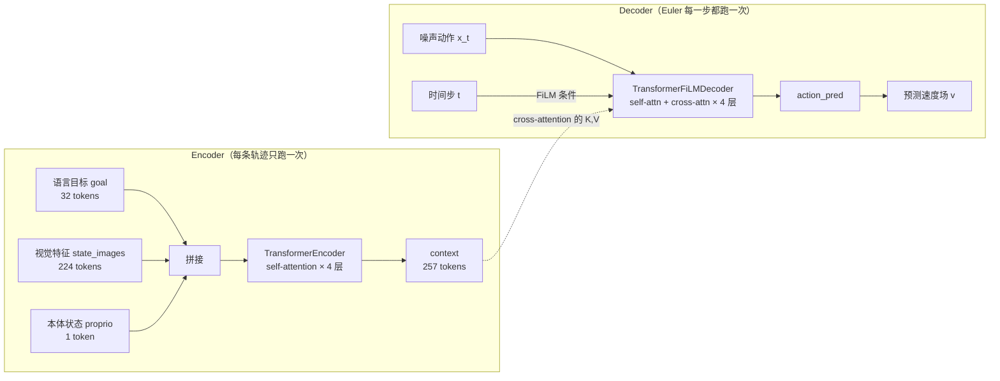

# Flow Matching 策略头：DiffusionTransformer 编解码器详解

> **前情提要**：第 9 章讲的是"看"——冻结的三分支 Wan2.2 backbone 跑一次前向，Hook 拿到中间层特征，`Video_Former`（Perceiver Resampler）把任意分辨率的视觉特征压缩成固定的 224 个 token。第 9 章结束时，我们手里有的是一份形状固定、语义压缩过的视觉表征：`state_images`，形状 `(B, 224, 384)`。
>
> 这一章讲的是"做"——这 224 个视觉 token，怎么和语言目标（goal）、机器人当前的关节角/夹爪状态（proprio）一起，被一个轻量级的 Encoder-Decoder Transformer 转换成双臂灵巧手的 54 维动作。这个 Transformer 叫 `DiffusionTransformer`，名字里带"Diffusion"是因为它最初是给 EDM 式扩散设计的，但 RynnWorld-4D-Policy 实际复用的是它的网络结构，训练和推理走的是 Flow Matching，由外面包一层 `FlowMatchingPolicy` 类来做。
>
> **相关阅读**：第 9 章 [特征提取：Early-Exit Hook 与三分支 Token 拼接](./09_特征提取_EarlyExitHook与三分支Token拼接)（本章 `state_images` 的来源）；如果没读过 Flow Matching 的通用原理，先读 [Flow Matching 与连续归一化流](/前置知识/000g_前置知识_Flow_Matching与连续归一化流)——本章不重复推导条件流匹配的数学，只讲 RynnWorld-4D-Policy 具体怎么落地这套原理；标量条件怎么变成向量可以参考 [标量条件编码：位置编码与时间步嵌入](/前置知识/001s_前置知识_标量条件编码_位置编码与时间步嵌入)。

## 贯穿本章的例子

用 RynnWorld-4D-Policy 的真实配置走一遍数字，后面反复用这一组：

- 语言目标（goal）：编码成 `goal_seq_len = 32` 个 token，每个 token 维度是 CLIP 文本编码器输出的 `goal_dim`
- 视觉特征（state_images）：第 9 章压缩后的 `num_latents = 224` 个 token
- 本体感知（proprio）：机器人当前的双臂关节角 + 双手状态，压成 1 个 token（`proprio_dim=8` 或按实际配置）
- 动作（action）：`action_seq_len = 10` 步，每步 54 维（7+7 双臂 + 20+20 双手）
- Transformer 内部宽度：`embed_dim = 384`，`n_enc_layers = 4`，`n_dec_layers = 4`，`n_heads = 8`
- 推理步数：4 步 Euler 积分

## 一、为什么是 Encoder-Decoder，不是 Decoder-only

先把问题摆清楚：策略头要解决的任务是——**给定一堆"条件"（视觉、语言、本体状态），生成一段动作**。生成的方式是 Flow Matching：从一个随机噪声动作 $x_0$ 出发，沿着一个网络预测的速度场积分几步，走到真实动作 $x_1$。

这里有两类信息，性质完全不同：

- **条件信息**（视觉 224 token + 语言 32 token + 本体 1 token）：在整个生成过程中是**固定不变**的。不管 Euler 积分走到第几步，"这一帧看到了什么"、"要完成什么指令"、"机器人当前姿态是什么"都不会变。
- **待生成信息**（当前噪声动作 $x_t$ 和时间步 $t$）：这是**每一步都在变**的东西，Euler 积分每走一步 $x_t$ 就更新一次。

如果用 Decoder-only 架构（像 GPT 那样把所有 token 拼成一条序列一起过 self-attention），会有两个明显的浪费：

1. **重复计算**：条件信息在 Euler 4 步积分里其实是完全一样的 257 个 token（32+224+1），但 Decoder-only 每一步都要把它们重新过一遍完整的 self-attention，计算量被浪费在"重新理解一遍没变过的场景"上。
2. **耦合过紧**：条件 token 和动作 token 混在一条序列里做 self-attention，网络很难学到"哪些 attention 权重是场景理解、哪些是动作生成"这种清晰的分工。

Encoder-Decoder 架构把这两类信息**显式拆开处理**：

- **Encoder**：只吃条件信息（视觉+语言+本体），跑一遍 self-attention，把它们编码成一个固定的上下文表征 `context`。这一步在代码里对应 `forward_enc_only` 方法，只需要算一次，Euler 积分 4 步全部复用同一个 `context`。
- **Decoder**：吃当前的噪声动作 $x_t$ 和时间步 $t$，通过 **cross-attention** 去查询 `context`，从中提取"和当前生成状态相关"的场景信息，预测速度场 $v$。



这正是条件生成模型里的经典设计模式：**Encoder 负责"理解场景"，Decoder 负责"在场景里生成内容"**。原版 Diffusion Policy 用的是纯 Decoder（Transformer decoder 一次性接收观测和噪声动作），而 RynnWorld-4D-Policy 沿用的是 [Video Prediction Policy (VPP)](https://arxiv.org/abs/2412.14803) 一脉的 Encoder-Decoder 结构——这个设计在观测端 token 数很多（这里 224+32+1=257 个）而动作序列不长（10 步）的场景下更划算，因为把 257 个 token 的自注意力和 10 个动作 token 的处理彻底分离，Decoder 端的计算量不会随观测 token 数线性增长。

## 二、Encoder 输入：三种条件怎么拼成一个序列

### 2.1 三种模态各自的 embedding

`DiffusionTransformer` 给三种输入分别定义了独立的线性投影层，把它们从各自原始维度映射到统一的 `embed_dim=384`：

```python
self.tok_emb = nn.Linear(obs_dim, embed_dim)       # 视觉特征 -> 384
self.lang_emb = nn.Linear(goal_dim, embed_dim)     # 语言目标 -> 384（或 use_mlp_goal 时是两层 MLP）
self.proprio_emb = nn.Sequential(                  # 本体状态 -> 384
    nn.Linear(proprio_dim, embed_dim * 2),
    nn.Mish(),
    nn.Linear(embed_dim * 2, embed_dim),
)
```

三种模态原始维度不同（视觉特征来自 Perceiver 压缩输出的 384 维，语言目标是文本编码器输出维度，本体状态就是关节角+夹爪开合度拼起来的几十维），但投影之后统一变成 384 维——这是能把它们拼进同一条序列的前提，Transformer 的 self-attention 要求序列里每个 token 的维度一致。

`proprio_emb` 用两层 MLP 而不是单层线性层，是因为本体状态是一个低维、信息密度很高的向量（关节角本身没有冗余），单层线性映射到 384 维容易学不出有用的非线性组合；`Mish` 激活函数是 Diffusion Policy 系列常用的选择，比 ReLU 更平滑，避免在这种低维回归任务里出现死区。

### 2.2 concatenate_inputs：具体怎么拼

三路 embedding 算好之后，`concatenate_inputs` 方法把它们在序列维度上拼成一条：

```python
def concatenate_inputs(self, emb_t, goal_x, state_x, proprio_x, uncond=False):
    input_seq_components = [state_x]
    if self.goal_conditioned:
        input_seq_components.insert(0, goal_x)
    if proprio_x is not None:
        input_seq_components.append(proprio_x)
    input_seq = torch.cat(input_seq_components, dim=1)
    return input_seq
```

代码逻辑很直白：先把 `state_x`（视觉）放进列表，如果是 goal-conditioned 就把 `goal_x`（语言）插到最前面，最后如果有 `proprio_x`（本体）就追加到末尾。拼接顺序固定是 **[语言, 视觉, 本体]**，用 `torch.cat(..., dim=1)` 在 token 维度（第二维，序列长度维）上首尾相连。

用本章的具体数字过一遍这一步：

| 模态 | token 数 | 每个 token 维度 | 拼接后位置 |
|------|---------|----------------|-----------|
| 语言目标 goal | 32 | 384 | 第 0 ~ 31 位 |
| 视觉特征 state_images | 224 | 384 | 第 32 ~ 255 位 |
| 本体状态 proprio | 1 | 384 | 第 256 位 |
| **总计** | **257** | 384 | — |

拼接之后的张量形状是 `(B, 257, 384)`，直接送进 `TransformerEncoder`（4 层标准 self-attention block，非因果，即 `causal=False`——因为这是编码"当前观测的完整上下文"，不存在"未来 token 不能看见过去 token"这种自回归约束，257 个 token 之间可以互相看见彼此，比如本体状态那 1 个 token 也能直接 attend 到全部 224 个视觉 token）。Encoder 跑完之后输出同样形状 `(B, 257, 384)` 的 `context`，这就是 Decoder 端 cross-attention 要查询的 K、V 来源。

值得注意的是，代码里没有单独给时间步嵌入 `emb_t` 留位置拼进 `input_seq`（尽管方法签名里有这个参数）——`emb_t` 在这里传进来是为了兼容 `use_ada_conditioning=False` 的旧分支，但当前配置下 `forward_enc_only` 里 `emb_t` 在 `use_ada_conditioning=True` 时直接是 `None`，Encoder 侧完全不使用噪声/时间步信息。时间步条件只作用于 Decoder，这与"条件信息在 Euler 各步之间不变"的设计原则是一致的——如果 Encoder 也吃时间步，那 `context` 就要跟着 $t$ 重新算，Encoder 就白设计了。

## 三、时间步嵌入：process_sigma_embeddings

### 3.1 为什么要对 sigma 做 log 再除以 4

Decoder 需要知道"现在噪声强度有多大/走到扩散的第几步"，这个信息以标量 `sigma` 的形式传入，先要经过预处理：

$$
\text{sigmas} = \frac{\log(\sigma)}{4}
$$

**为什么需要这个公式**：EDM（Karras et al. 2022）式的扩散训练里，`sigma`（噪声标准差）的采样范围通常跨越好几个数量级，比如从 0.002 到 80。如果直接把原始的 `sigma` 数值喂给下游的正弦位置编码，会出现两个问题：一是不同尺度的 `sigma` 在数值上差异悬殊，小的 `sigma`（如 0.002）和大的 `sigma`（如 80）之间的间距被压缩／拉伸到完全不成比例的区间，正弦编码的频率设计是针对"输入在一个合理范围内均匀分布"预设的，输入跨越几个数量级会让编码在某些区间过于密集、另一些区间几乎没有区分度；二是网络的下游线性层对输入尺度敏感，量级悬殊的输入会导致训练早期梯度不稳定。

> **一句话直觉**：把跨越几个数量级、分布不均匀的噪声强度，压缩成一个分布相对均匀、数值适中的标量，再送进位置编码器，位置编码器才能"公平"地区分不同噪声强度。

**逐项拆解**：

| 符号/操作 | 数学含义 | 在本场景中对应什么 |
|-----------|---------|-------------------|
| $\sigma$ | 当前噪声水平（标准差） | EDM 训练里通常按 log-normal 分布采样，范围约 $[0.002, 80]$ |
| $\log(\sigma)$ | 取自然对数 | 把乘法尺度的跨度（几个数量级）压缩成加法尺度的跨度（一个较小的线性区间） |
| $\div 4$ | 除以常数 4 | 进一步把 $\log(\sigma)$ 的数值范围收缩到一个更贴近正弦编码"最佳工作区间"的尺度 |

**具体数值例子**：取 EDM 常用的三个 `sigma` 值，看 `log(sigma)/4` 把它们映射到哪里：

| $\sigma$ | $\log(\sigma)$ | $\log(\sigma)/4$ |
|---|---|---|
| 0.002 | $\log(0.002) \approx -6.21$ | $\approx -1.55$ |
| 1.0 | $\log(1.0) = 0$ | $0$ |
| 80.0 | $\log(80.0) \approx 4.38$ | $\approx 1.10$ |

原始 `sigma` 从 0.002 到 80，跨度是 4 万倍；取 log 之后变成 $-6.21$ 到 $4.38$，是一个宽度约 10.6 的线性区间；再除以 4，收缩到 $-1.55$ 到 $1.10$，宽度约 2.65——这个量级正好是后面 `SinusoidalPosEmb` 里频率设计所对应的"敏感区间"（下一节会看到 `SinusoidalPosEmb` 内部频率是按 `10000` 的指数衰减设计的，对输入在 $[-2,5]$ 附近的区分度最好）。

**为什么是这个形式（为什么是 4 不是别的数）**：这是 EDM 论文和后续 Karras 系工作里的经验超参数，本质上是"让 $\log\sigma$ 的常见训练范围恰好落在正弦编码最敏感的输入区间"这一目标下调出来的缩放常数，没有一个封闭形式的推导，是工程经验值。核心逻辑不是数字 4 本身有什么特殊，而是**必须对 sigma 做某种压缩变换**——直接传原始 sigma 或者只取 log 不做进一步缩放，都会让嵌入退化（不同噪声强度的嵌入向量彼此过于相似或过于悬殊，Decoder 学不出对时间步的敏感性）。

### 3.2 SinusoidalPosEmb：标量怎么变成向量

处理完的标量 `sigmas` 还只是一个数，需要变成一个 384 维的向量才能和视觉/语言 token 处于同一个空间参与注意力计算，这一步交给 `SinusoidalPosEmb`：

```python
class SinusoidalPosEmb(nn.Module):
    def __init__(self, dim):
        super().__init__()
        self.dim = dim

    def forward(self, x):
        half_dim = self.dim // 2
        emb = math.log(10000) / (half_dim - 1)
        emb = torch.exp(torch.arange(half_dim, device=x.device) * -emb)
        emb = x[:, None] * emb[None, :]
        emb = torch.cat((emb.sin(), emb.cos()), dim=-1)
        return emb
```

这段代码的核心思路是 Transformer 位置编码那套经典手法：**用不同频率的正弦/余弦函数，把一个标量展开成一组数值**。`half_dim` 个不同的频率 $\omega_i = 10000^{-i/(half\_dim-1)}$（代码里用 `exp(arange * -log(10000)/(half_dim-1))` 实现，等价于这个指数衰减公式），标量 $x$ 分别乘上每个频率得到 `emb = x[:, None] * emb[None, :]`，再对每个频率同时取 `sin` 和 `cos` 拼起来，凑够 `dim` 维。低频分量对 $x$ 的微小变化不敏感（适合表达"大致在哪个区间"），高频分量对 $x$ 的微小变化敏感（适合表达"精确数值"）——组合起来就能让下游网络既能区分粗粒度的噪声强度差异，也能区分细粒度的差异。

如果不熟悉这种"标量展开成多频率正弦向量"的通用手法，可以先读 [标量条件编码：位置编码与时间步嵌入](/前置知识/001s_前置知识_标量条件编码_位置编码与时间步嵌入)，那里有完整的推导和数值例子，本章不重复。

`process_sigma_embeddings` 把这两步串起来：

```python
def process_sigma_embeddings(self, sigma):
    sigmas = sigma.log() / 4
    sigmas = einops.rearrange(sigmas, 'b -> b 1')
    emb_t = self.sigma_emb(sigmas)
    if len(emb_t.shape) == 2:
        emb_t = einops.rearrange(emb_t, 'b d -> b 1 d')
    return emb_t
```

`self.sigma_emb` 是 `SinusoidalPosEmb` 后面再接两层线性层加 `Mish` 激活的小 MLP（`SinusoidalPosEmb -> Linear(384->768) -> Mish -> Linear(768->384)`），先用正弦编码把标量展开成向量，再用可学习的 MLP 对这个向量做一次非线性变换，让网络能进一步调整时间步信息在 384 维空间里的分布方式。最后 `emb_t` 的形状是 `(B, 1, 384)`——即每个样本对应一个单独的时间步 token，用于后面 Decoder 里的 FiLM 条件调制。

## 四、FlowMatchingPolicy 怎么复用这套组件

### 4.1 sigma 和 t 的区别，以及为什么能复用

`DiffusionTransformer` 原本是给 EDM 式扩散设计的，时间步用 `sigma`（噪声标准差，范围约 $[0.002, 80]$）表示。而 Flow Matching 的时间步用 $t \in [0,1]$ 表示（$t=0$ 是噪声，$t=1$ 是数据），两者的物理含义完全不同，数值范围也完全不同。

`FlowMatchingPolicy` 没有另写一套时间步嵌入网络，而是直接复用 `DiffusionTransformer` 内部现成的 `sigma_emb` 模块，只是在喂进去之前先做一次缩放：

```python
def _encode_time(self, t):
    """Encode t in [0,1] → embedding, reusing sigma_emb's sinusoidal + MLP."""
    # EDM uses log(sigma)/4 which spans roughly [-2, 5].
    # We map t in [0,1] to [0, 5] to get similar coverage.
    t_scaled = t * 5.0
    t_scaled = einops.rearrange(t_scaled, "b -> b 1")
    emb = self.inner_model.sigma_emb(t_scaled)
    if len(emb.shape) == 2:
        emb = einops.rearrange(emb, "b d -> b 1 d")
    return emb
```

这里的关键动作是 `t_scaled = t * 5.0`。回头看第三节的数值例子：EDM 里 `log(sigma)/4` 的常见取值范围大约落在 $[-2, 5]$ 之间（对应 sigma 从很小到很大的整个采样范围）。`sigma_emb` 里的 `SinusoidalPosEmb` 频率参数是按照"输入在这个范围内变化"预先设计好的——频率的指数衰减尺度隐含地假设了输入的典型跨度。如果直接把 $t\in[0,1]$ 喂进去，$t$ 的动态范围只有 EDM 那套时间步范围的 $1/7$ 左右，会导致所有 $t$ 值挤在正弦编码的一个很小的相位区间里，不同 $t$ 之间的嵌入向量差异过小，Decoder 很难分辨"现在是积分的第几步"。

`_encode_time` 用 `t * 5.0` 把 $[0,1]$ 映射到 $[0,5]$，覆盖范围和 EDM 常见的 `log(sigma)/4` 上限（约 5）对齐，这样同一个 `sigma_emb` 模块处理这两种量级不同的标量时，都能落在它"设计时预期"的输入区间内，不用重新训练一套新的时间步嵌入参数。这是一个纯粹的工程复用技巧：**两个不同的时间概念（sigma vs. t）经过各自的预处理之后，落在同一个数值区间，就可以共享同一个下游网络**。

### 4.2 复用带来的实际好处

这个设计避免了两件事：一是不用为 Flow Matching 单独训练一套时间步嵌入 MLP（省参数、省训练成本）；二是让 `FlowMatchingPolicy` 可以直接拿预训练好的 `DiffusionTransformer` 权重做初始化——`encoder`、`decoder`、`action_emb`、`action_pred`、`sigma_emb` 全部原样复用，只是把外层的训练目标和采样逻辑换成了 Flow Matching。这也解释了为什么源码注释里说它是 "Drop-in replacement for GCDenoiser: same inner_model architecture"。

## 五、训练 loss：t ~ U(0,1) 与线性插值

`FlowMatchingPolicy.loss` 方法是整个策略头训练时真正被调用的入口。它要做的事情是：给每个训练样本随机选一个"进度" $t$，在噪声和真实动作之间按 $t$ 的比例插值出一个中间点 $x_t$，把 $x_t$ 和 $t$ 交给网络（也就是调用 `predict_velocity`，5.1 节会展开它内部具体怎么调用 Encoder-Decoder），让网络学习预测"如果站在这个中间点上，应该朝哪个方向、以多大速度移动才能走到真实动作"：

```python
def loss(self, state, actions, goal):
    B = actions.shape[0]
    t = torch.rand(B, device=actions.device).clamp(1e-4, 1.0)
    noise = torch.randn_like(actions)

    t_expand = t.view(B, 1, 1)
    x_t = (1 - t_expand) * noise + t_expand * actions
    v_target = actions - noise

    v_pred = self.predict_velocity(state, x_t, goal, t)
    return F.mse_loss(v_pred, v_target), v_pred
```

$$
x_t = (1-t)\cdot\text{noise} + t\cdot\text{actions}, \qquad v_{\text{target}} = \text{actions} - \text{noise}
$$

**为什么需要这个公式**：Flow Matching 训练的核心是先人为构造一条连接噪声和数据的路径，再让网络学习路径上每一点的瞬时速度。这个式子就是这条路径的具体参数化形式，以及路径对应的目标速度。

> **一句话直觉**：在纯噪声和真实动作之间画一条直线，$t$ 是这条线上的进度百分比；这条直线的方向就是"从噪声指向真实动作"，速度处处相同。

**逐符号拆解**：

| 符号 | 含义 | 具体是什么 | 维度/典型值 |
|------|------|-----------|------------|
| $t$ | 路径进度 | `torch.rand(B)` 均匀采样，再 clamp 到 $[10^{-4}, 1]$ 避免 $t=0$ 时数值问题 | 标量，每个 batch 样本各自独立采样 |
| $\text{noise}$ | 路径起点 | `torch.randn_like(actions)`，标准正态噪声 | `(B, 10, 54)`，与动作同形状 |
| $\text{actions}$ | 路径终点 | 示范数据里的真实动作序列 | `(B, 10, 54)` |
| $x_t$ | 插值中间点 | 当前"含噪"的动作，作为 Decoder 输入 | `(B, 10, 54)` |
| $v_{\text{target}}$ | 训练目标（真实速度） | 从噪声指向数据的方向向量，不随 $t$ 变化 | `(B, 10, 54)` |
| $v_{\text{pred}}$ | 网络预测的速度 | `predict_velocity` 的输出 | `(B, 10, 54)` |

**代入数字**：为简化演示，假设动作只有 1 维，某个样本 $\text{actions} = 6.0$，本次采样的 $\text{noise} = 2.0$，$t = 0.4$：

- $x_t = (1-0.4)\times 2.0 + 0.4\times 6.0 = 1.2 + 2.4 = 3.6$
- $v_{\text{target}} = 6.0 - 2.0 = 4.0$
- 假设当前网络看到 $x_t=3.6, t=0.4$ 时预测出 $v_{\text{pred}} = 3.7$
- 单样本 loss $= (3.7-4.0)^2 = 0.09$

实际训练里这个 loss 在 `predict_velocity` 内部对 `(B, 10, 54)` 的每个数字都算一遍平方误差再取平均（`F.mse_loss` 默认 `reduction='mean'`），通过对训练集里随机采出的 mini-batch 反复执行这个过程来近似对 $t,\text{noise},\text{actions}$ 的完整期望。梯度方向上，如果预测的 3.7 小于目标 4.0，反向传播会把网络参数往"增大这个位置的速度预测"的方向调整。

**注意符号方向和第 5 章不同**：这里的约定是"噪声指向数据"——$t=0$ 是噪声，$t=1$ 是真实动作，$v_{\text{target}}$ 的方向是从噪声指向数据。第 5 章讲世界模型的 Flow Matching 训练目标时用的是反过来的约定（$t=0$ 是数据，$t=1$ 是噪声，速度方向从数据指向噪声）。这两个模块是相互独立的代码实现，各自选了一种社区里都常见的约定，不代表哪一个"更对"——读者只需要注意，看到哪个模块的公式，就按那个模块自己的时间方向理解，不要混着套。

**为什么是这个形式**：直线插值是路径无穷多种可能选择里最简单的一种，对应的目标速度是常数（不随 $t$ 变化），这让训练目标退化成一个普通的 MSE 回归问题，不需要处理"速度随时间怎么变化"这种更复杂的结构。更完整的动机（为什么常数速度场依然能生成正确的多模态动作分布）在 [Flow Matching 前置知识 · 3.2.1 节](/前置知识/000g_前置知识_Flow_Matching与连续归一化流#3.2.1-关键疑问-训练时回归的是-条件速度-为什么推理时能生成正确样本)已经推导过，这里不重复。

### 5.1 predict_velocity：Encoder-Decoder 具体怎么被调用

`loss` 里调用的 `predict_velocity` 就是本章第一、二、三节讲的所有组件串起来的地方：

```python
def predict_velocity(self, state, x_t, goal, t):
    emb_t = self._encode_time(t)
    goals = self.inner_model.preprocess_goals(goal, state["state_images"].size(1))
    state_embed, proprio_embed = self.inner_model.process_state_embeddings(state)
    goal_embed = self.inner_model.process_goal_embeddings(goals)

    input_seq = self.inner_model.concatenate_inputs(emb_t, goal_embed, state_embed, proprio_embed)
    context = self.inner_model.encoder(input_seq)

    action_embed = self.inner_model.action_emb(x_t)
    action_x = self.inner_model.drop(action_embed)
    x = self.inner_model.decoder(action_x, emb_t, context)
    return self.inner_model.action_pred(x)
```

对照第二节的流程图：`emb_t` 是缩放后的时间步嵌入，`goal_embed`/`state_embed`/`proprio_embed` 是三种条件各自的投影，`concatenate_inputs` 拼成 257 个 token 送进 `encoder` 得到 `context`；`x_t`（当前噪声动作）先过 `action_emb` 投影成 384 维，再送进 `decoder`——`decoder` 的输入是 `(action_x, emb_t, context)` 三个参数，`emb_t` 用于 FiLM 式条件调制（下一节展开），`context` 用于 cross-attention。最后 `action_pred`（一个线性层）把 Decoder 输出的 384 维向量映射回 54 维的动作空间，得到预测速度 $v_{\text{pred}}$。

### 5.2 Decoder 内部：FiLM 时间条件 + cross-attention 条件，两条线并行

`decoder` 是 `TransformerFiLMDecoder`，内部每一层（`ConditionedBlock`）同时接收两种条件，作用机制完全不同：

- **时间步 `emb_t`**：通过 **AdaLN-Zero**（一种 FiLM 变体）调制 self-attention 和 MLP 子层——具体做法是用 `emb_t` 算出 6 组 `shift/scale/gate` 参数，在每个子层的 LayerNorm 输出上做 `shift + x * scale` 的仿射变换，再用 `gate` 缩放子层的残差输出。直觉上，这是让"现在处于积分的哪一步"这个信息，直接调节网络内部每一层的激活强度和方向，而不是像 token 一样参与 attention 计算。
- **`context`**：通过 **cross-attention** 参与——`action_x` 作为 query，`context` 提供 key 和 value，Decoder 在每一层都重新"回顾"一遍 257 个条件 token，从中提取和当前生成状态相关的信息。

这两条线的分工很清楚：**FiLM 负责调制"现在走到哪一步了"，cross-attention 负责回答"这一步该往哪个方向走要参考哪些条件信息"**。两者一个是全局的标量式调制，一个是逐 token 的检索式查询，配合起来让 Decoder 既能感知时间进度，又能精确地从视觉/语言/本体条件里提取相关信息。

## 六、推理采样：4 步 Euler 积分

训练学到的是"任意时刻 $t$、任意位置 $x_t$ 处应该往哪走"这个速度场，推理阶段要做的是真正沿着这个速度场从纯噪声走到一个具体的动作：

```python
@torch.no_grad()
def sample(self, state, goal, shape, n_steps=4):
    device = goal.device
    B = shape[0]
    x = torch.randn(shape, device=device)
    dt = 1.0 / n_steps

    for i in range(n_steps):
        t = torch.full((B,), i * dt, device=device)
        v = self.predict_velocity(state, x, goal, t)
        x = x + v * dt

    return x
```

这段代码要做的事情是标准的 **前向 Euler 法** 数值求解一个常微分方程 $\frac{dx}{dt} = v_\theta(x,t)$：从 $t=0$ 出发，每步用当前位置和时间预测速度，再用"速度 × 时间步长"更新位置，重复 `n_steps` 次走到 $t=1$。

$$
x_{t+\Delta t} = x_t + \Delta t \cdot v_\theta(x_t, t)
$$

**为什么需要这个公式**：网络学到的是每一点的瞬时速度，但瞬时速度只是一个"方向盘"，要真正从起点（噪声）出发走到终点（动作），需要把连续的运动过程离散成有限步来数值求解——这正是常微分方程数值积分要解决的问题。

> **一句话直觉**：把整段从噪声到动作的连续运动切成 4 段直线，每段用当前位置的速度方向走一小步，4 步走完就近似地到达了终点。

**逐符号拆解**：

| 符号 | 含义 | 具体是什么 | 典型值 |
|------|------|-----------|--------|
| $x_t$ | 当前位置（部分生成的动作） | 循环变量 `x`，初始是纯噪声 | 形状 `(B, 10, 54)` |
| $t$ | 当前进度 | 循环变量 `i * dt` | 本例中依次是 0, 0.25, 0.5, 0.75 |
| $\Delta t$ | 步长 | `dt = 1.0 / n_steps` | $1/4 = 0.25$ |
| $v_\theta(x_t, t)$ | 网络在当前位置、当前时刻预测的速度 | `predict_velocity` 的输出 | 形状同 $x_t$ |
| $x_{t+\Delta t}$ | 更新后的位置 | 下一轮循环的 `x` | 形状同 $x_t$ |

**具体数值例子**：仍然简化成动作只有 1 维，假设网络碰巧总能精确预测出真实速度（即 $v_\theta \equiv 4.0$，对应第五节例子里 noise=2.0, actions=6.0 的情形），看 4 步 Euler 积分怎么从噪声走到动作：

| 步数 $i$ | $t = i \times 0.25$ | 当前 $x_t$ | 预测速度 $v$ | 更新：$x_{t+\Delta t} = x_t + 0.25v$ |
|---|---|---|---|---|
| 0 | 0.00 | 2.0（初始噪声） | 4.0 | $2.0 + 0.25\times4.0 = 3.0$ |
| 1 | 0.25 | 3.0 | 4.0 | $3.0 + 0.25\times4.0 = 4.0$ |
| 2 | 0.50 | 4.0 | 4.0 | $4.0 + 0.25\times4.0 = 5.0$ |
| 3 | 0.75 | 5.0 | 4.0 | $5.0 + 0.25\times4.0 = 6.0$ |

4 步之后 $x$ 恰好走到 6.0，正是真实动作值——因为这个例子里速度场是常数（第五节已经说明 Flow Matching 直线路径对应常数速度场），Euler 积分在这种情况下是**精确**的，不会有离散化误差。真实场景里网络预测不会完全精确，且不同样本对（noise, action）的真实速度并不完全相同（边际速度场是所有可能路径的加权平均，不是严格常数），所以实际推理会有一定的离散化误差，这也是为什么 Flow Matching 前置知识里提到"步数越多、离散化误差越小，但 Flow Matching 只需要 4-10 步就能达到 DDPM 20-100 步的质量"。

**为什么是这个形式（为什么用 Euler，不用更高阶方法）**：Euler 法是最简单的一阶数值积分方法，实现成本最低（每步只需要一次网络前向）。RynnWorld-4D-Policy 选择 4 步 Euler，是在"推理速度"（机器人闭环控制要求 9Hz+ 的高频输出，每步都要跑一次完整的 Encoder+Decoder 前向，步数直接决定推理延迟）和"生成质量"（步数太少，离散化误差会让动作不够精确）之间的权衡。Flow Matching 的直线路径设计（第五节）让哪怕是一阶 Euler 方法用很少的步数也能取得不错的精度，这是它相比 DDPM 式扩散（需要 20-100 步）在这里被选用的核心原因。

## 七、mask_cond：goal dropout 与 classifier-free guidance 的训练侧准备

`DiffusionTransformer` 在预处理语言目标时还做了一件事——训练阶段以一定概率把 goal 置零：

```python
def mask_cond(self, cond, force_mask=False):
    bs, t, d = cond.shape
    if force_mask:
        return torch.zeros_like(cond)
    elif self.training and self.cond_mask_prob > 0.:
        mask = torch.bernoulli(torch.ones((bs, t, d), device=cond.device) * self.cond_mask_prob)
        return cond * (1. - mask)
    else:
        return cond
```

`preprocess_goals` 在训练模式下（`self.training=True`）会调用这个方法，按 `cond_mask_prob`（对应构造函数的 `goal_drop` 参数）这个概率，对 goal 张量的每个元素独立地做伯努利采样，采样结果为 1 的位置就把对应的 goal 值置零。也就是说，训练时网络会随机遇到"语言目标被完全或部分抹掉"的样本，被迫学会在没有语言指令、只靠视觉和本体状态的情况下也能生成合理动作。

这就是 **classifier-free guidance (CFG)** 的训练侧准备工作：CFG 的推理时机制是同时用"有条件"和"无条件"两次前向的输出做加权外推，来放大条件的影响力；但这要求网络在训练阶段就见过"无条件"这种输入模式，否则推理时构造出的无条件输入会落在训练分布之外，网络输出没有意义。训练时随机丢弃 goal，就是让网络提前"练习"过无条件生成这种情况。`FlowMatchingPolicy` 初始化时把 `goal_drop=0` 传给了 `DiffusionTransformer`（策略头默认关闭 goal dropout），但机制本身是保留的，如果需要在推理时启用 CFG，只需要把 `goal_drop` 调成非零值重新训练。

这个机制和第 5 章讲世界模型训练时的 text dropout 是同一个思路的两处不同实现——世界模型训练时随机把文本条件置空来支撑推理阶段的 CFG，策略头训练时随机把语言目标置零来支撑同样的机制，两者都是"训练时主动制造无条件样本，推理时用条件/无条件的差异做外推"这套通用手法在不同模块里的落地。

## 八、小结

这一章把第 9 章产出的 224 个视觉 token，和语言目标、本体状态一起，讲清楚了它们如何变成动作：

- Encoder-Decoder 架构把"编码条件"和"生成动作"拆成两个独立的计算阶段，条件信息在 Euler 积分的 4 步之间只需要编码一次
- `concatenate_inputs` 把 32(语言) + 224(视觉) + 1(本体) = 257 个 token 拼成一条序列送进 Encoder
- 时间步嵌入先用 `log(sigma)/4` 压缩噪声强度的数量级跨度，再用正弦编码展开成向量
- `FlowMatchingPolicy` 复用 `sigma_emb` 模块处理 Flow Matching 的 $t\in[0,1]$，靠 `t*5.0` 缩放对齐两种时间概念的数值范围
- 训练用 $t\sim U(0,1)$ 采样 + 直线插值构造训练目标，推理用 4 步 Euler 积分沿速度场从噪声走到动作
- `mask_cond` 训练时随机丢弃语言目标，为 classifier-free guidance 做准备

至此，策略网络的核心架构已经拆解完整——从冻结 backbone 提特征，到 Perceiver 压缩，到 Encoder-Decoder 生成动作。下一章要回答的问题是：这套网络实际是拿什么数据训练出来的？第 11 章会讲 Tianji 双臂灵巧手机器人数据集的具体格式、动作归一化方式，以及项目用 Hydra 组织的训练配置系统。

## 知识链接

- [Flow Matching 与连续归一化流](/前置知识/000g_前置知识_Flow_Matching与连续归一化流) —— 条件流匹配训练目标、Euler 积分、直线路径为何不退化成模式平均的完整推导
- [标量条件编码：位置编码与时间步嵌入](/前置知识/001s_前置知识_标量条件编码_位置编码与时间步嵌入) —— `SinusoidalPosEmb` 正弦位置编码的通用原理
- [第 9 章：特征提取——Early-Exit Hook 与三分支 Token 拼接](./09_特征提取_EarlyExitHook与三分支Token拼接) —— 本章 `state_images`（224 个视觉 token）的来源
- [第 5 章：训练细节——Flow Matching 目标与分支随机丢弃](./05_训练细节_FlowMatching目标与分支随机丢弃) —— 世界模型侧的时间方向约定与 text dropout 机制，可与本章第五、七节对照
- [第 11 章：策略训练——Tianji 数据集与训练配置](./11_策略训练_Tianji数据集与训练配置) —— 下一章，本章网络结构实际训练所用的数据与配置
