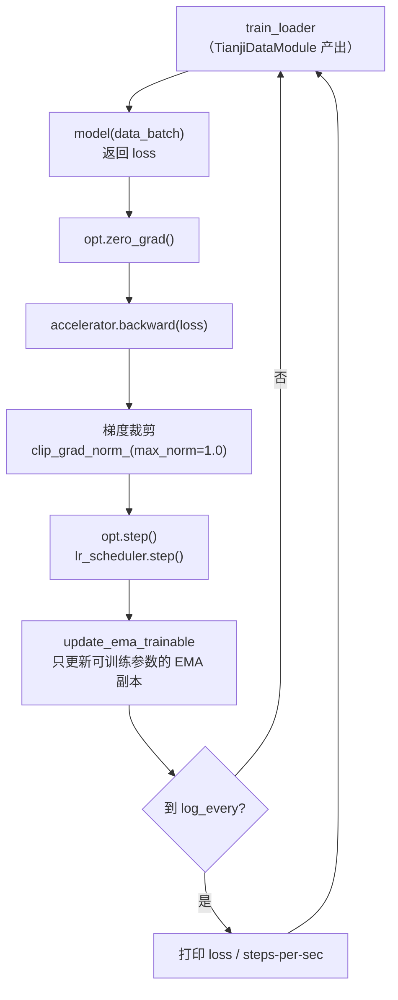

# 策略训练：Tianji 数据集与训练配置

> **前情提要**：第 8-10 章讲完了 `VPP_Policy` 的整套架构——冻结的三分支 Wan2.2 backbone 怎么被 Early-Exit Hook 截出中间层特征，`Video_Former`（Perceiver Resampler 3D）怎么把这些特征压缩成 224 个 token，Flow Matching 策略头的 Encoder-Decoder 怎么把这些 token 加上 proprio、goal 条件，最终用 4 步 Euler 积分吐出一段双臂+双灵巧手动作。这一整条链路描述的都是**前向传播**——给定一批输入，模型怎么算出动作。本章要补的是这条链路缺的另一半：**这批输入从哪来、怎么被组织成一个 batch、训练循环怎么驱动这个模型把参数调整到能输出合理动作**。具体来说：Tianji 双臂机器人的原始数据长什么样，`TianjiVideoDataset` 怎么把一条几十秒的录像切成成千上万个训练样本，动作为什么要归一化而 state 不用，以及 Hydra 配置系统和 `train.py` 主循环怎么把这些部件拼起来跑起来。

**相关阅读**：第 7 章 [数据管线：从原始视频到 RGB/Depth/Flow 三路 Latent](./07_数据管线_从原始视频到RGBDepthFlow三路Latent)（世界模型侧的数据预处理，深度视频路径规则与本章一脉相承）、第 8-10 章（策略模型架构，本章的数据最终喂给这套模型）

## 0. 贯穿本章的例子

用源码仓库自带的示例数据集 `data/tianji_sample/` 来演示后面每一步。这个目录下有 3 个 episode：

| Episode | 总帧数（30fps） | 时长 |
|---|---|---|
| `episode_000001` | 1295 | 约 43.2 秒 |
| `episode_000002` | 1316 | 约 43.9 秒 |
| `episode_000003` | 1491 | 约 49.7 秒 |

三条 episode 的任务描述都是 `"Pick-Place"`（记录在各自的 `metadata.json` 里）。训练配置里 `action_seq_len=10`、`skip_frames=1`，后面的数字例子都用这套具体配置来算。

## 1. Tianji 数据集的目录结构

`TianjiVideoDataset` 认的目录结构非常固定——一个根目录下摆着若干个 `episode_XXXXXX/` 子目录，每个子目录内部三个文件是必需的：

| 文件 | 内容 | 用途 |
|---|---|---|
| `observation.images.head.mp4` | 头部相机录像，1280×720，30fps | 训练样本的 RGB 观测来源 |
| `timeseries.parquet` | 逐帧的 `action` 列和 `observation.state` 列 | 动作标签与本体感知状态 |
| `metadata.json` | 任务描述文本（`task_prompt`）、fps、总帧数等 | 语言条件的来源 |

`timeseries.parquet` 里 `action` 和 `observation.state` 这两列，每一行存的不是标量而是一个长度 54 的向量（`np.stack(df[action_col].values)` 把整列拆成 `(n_frames, 54)` 的矩阵）。54 维的含义在系列总览里已经给出：7（左臂）+7（右臂）+20（左手）+20（右手），双臂双灵巧手各自的关节角/末端位姿拼在一起。`observation.state` 同样是 54 维，语义上是"当前时刻这套关节/手指的真实状态"，`action` 是"这一帧执行的控制指令"——两者维度对齐，但物理含义不同，第 4 节会讲这个区别为什么导致归一化策略不同。

除了这三个必需文件，`TianjiVideoDataset.__init__` 里还会顺带探测两个可选文件：

```python
left_wrist_path = os.path.join(ep_dir, "observation.images.left_wrist.mp4")
right_wrist_path = os.path.join(ep_dir, "observation.images.right_wrist.mp4")
...
"left_wrist_path": left_wrist_path if os.path.exists(left_wrist_path) else None,
"right_wrist_path": right_wrist_path if os.path.exists(right_wrist_path) else None,
```

如果 episode 目录下有手腕相机录像就记录路径，没有就存 `None`——后面 `__getitem__` 会根据这两个字段是不是 `None` 决定要不要多读一路手腕图像。示例数据集里这两个文件不存在，所以本章的例子里只涉及头部相机这一路。

## 2. 深度视频的路径规则：和第 7 章的约定完全一致

深度不是 Tianji 数据集自带的，而是像第 7 章讲的世界模型数据准备一样，**用 Depth-Anything 系列模型离线跑一遍头部相机录像**得出的。存放深度视频的目录和存放 RGB/parquet 的 episode 目录是分开的两棵目录树，`TianjiVideoDataset` 用一个独立的 `depth_data_dir` 参数接收深度数据的根目录，再按固定规则拼出每个 episode 对应的深度视频路径：

```python
if self.depth_data_dir:
    ep_name = os.path.basename(ep_dir)
    cand = os.path.join(self.depth_data_dir, ep_name, self.depth_subpath)
    if os.path.exists(cand):
        depth_path = cand
```

`depth_subpath` 的默认值是 `"exports/mini_npz/depth.mp4"`，拼出来的完整路径就是：

```
{depth_data_dir}/{episode_name}/exports/mini_npz/depth.mp4
```

比如 `depth_data_dir=../data/tianji_sample_depth`、当前处理的是 `episode_000001`，深度视频就应该躺在 `../data/tianji_sample_depth/episode_000001/exports/mini_npz/depth.mp4`。这条规则和第 7 章世界模型数据预处理里 `depth_video_path = os.path.join(args.depth_root, sub_dir, "exports/mini_npz", "depth.mp4")` 是同一套约定——都是"RGB 视频路径的相对结构，原样挂到一个独立的深度根目录下，中间插一段 `exports/mini_npz` 固定后缀"。两处代码出自同一个项目的不同阶段（世界模型预训练 vs 下游策略训练），复用同一套深度视频命名规范，说明这条路径规则是整个项目里"深度数据怎么存"的统一约定，不是某个脚本临时定的。

深度视频缺失时 `depth_path` 保持 `None`，这条 episode 依然可以正常训练——第 9 章讲过，策略模型的特征提取器在拿不到预计算深度时会用 Depth-Anything-3 在线兜底估计。示例数据集里三条 episode 都配了深度视频（`with_depth=3/3`），下面举例时假设深度可用。

## 3. sample_index 的构造：一条 episode 怎么变成上千个训练样本

一条 1295 帧的录像不能整段塞进一次训练迭代——策略模型每次前向只吃"当前一帧观测 + 未来固定步数的动作序列"。`TianjiVideoDataset` 用滑动窗口的方式，把每条 episode 切成很多个可以独立采样的训练样本，每个样本用一个起始帧编号 `start` 加上所属的 episode 编号 `ep_idx` 来标识：

```python
max_start = n_frames - action_seq_len
for start in range(0, max_start, skip_frames):
    self.sample_index.append((ep_idx, start))
```

**这段代码在做什么**：给定一条 episode 的总帧数，算出这条 episode 里所有"往后数还凑得出一整段未来动作"的起始帧位置，把它们全部注册成独立的训练样本。

$$
\text{max\_start} = n_{\text{frames}} - L_a, \qquad
\mathcal{S}_{\text{ep}} = \left\{\, t \;\middle|\; t = k\cdot\Delta,\ k \in \mathbb{Z}_{\ge 0},\ t < \text{max\_start} \,\right\}
$$

> **一句话**：从第 0 帧开始，每隔 $\Delta$ 帧就登记一个训练样本起点，但起点不能晚于"剩下的帧数不够凑一整段未来动作"的那个临界点。

**逐符号拆解**：

| 符号 | 数学含义 | 在本场景中具体是什么 | 典型值 |
|---|---|---|---|
| $n_{\text{frames}}$ | 这条 episode 的总帧数 | `len(df)`，从 `timeseries.parquet` 读出来的行数 | `episode_000001` 是 1295 |
| $L_a$ | 未来动作序列的长度 | 配置里的 `action_seq_len` | `train_config.yaml` 里 `act_seq_len=10` |
| $\text{max\_start}$ | 起始帧的上界（不包含） | 超过这个位置，从 `start` 往后数不够 $L_a$ 帧 | $1295-10=1285$ |
| $\Delta$ | 采样间隔 | `skip_frames`，控制训练样本的稠密程度 | 配置里 `skip_frames=1`，即逐帧滑动 |
| $t$ | 一个具体的训练样本起始帧编号 | `for start in range(0, max_start, skip_frames)` 里的 `start` | 取值范围 $\{0, \Delta, 2\Delta, \dots\}$，且 $< \text{max\_start}$ |
| $\mathcal{S}_{\text{ep}}$ | 这条 episode 产出的全部样本起点集合 | 追加进 `self.sample_index` 的 `(ep_idx, start)` 元组，固定 `ep_idx` 时的 `start` 集合 | 大小为 $\lceil \text{max\_start} / \Delta \rceil$ |

**代入数字**：以 `episode_000001` 为例，$n_{\text{frames}}=1295$，$L_a=10$，$\Delta=1$：

$$
\text{max\_start} = 1295 - 10 = 1285
$$

`range(0, 1285, 1)` 产出 $0, 1, 2, \dots, 1284$，一共 1285 个不同的 `start` 值，也就是这一条录像单独贡献了 1285 个训练样本。三条 episode 各自算一遍：`episode_000002`（$n_{\text{frames}}=1316$）贡献 $1316-10=1306$ 个，`episode_000003`（$n_{\text{frames}}=1491$）贡献 $1491-10=1481$ 个，整个数据集总样本数是 $1285+1306+1481=4072$。

**为什么是这个形式**：$\Delta=1$（逐帧滑窗，不跳过任何一帧起点）能让同一条录像里的每一个时刻都被训练看到过一次"从这里开始接下来会怎么动"，数据利用率最高，代价是相邻样本高度重叠（`start=100` 和 `start=101` 的观测几乎是同一帧，未来动作序列也重叠 9 帧）。如果想减少这种冗余、加快单个 epoch 的遍历速度，调大 `skip_frames` 即可——比如 $\Delta=5$ 时 `episode_000001` 只会贡献 $\lceil 1285/5 \rceil=257$ 个样本，是逐帧滑窗的五分之一。这个取舍完全暴露在配置里，训练时可以按数据量和算力预算调整,不需要改代码。

## 4. 按 episode 切分 train/val：不能按帧切分

`sample_index` 里 4072 个样本平铺在一个列表里，看起来随便切一段当验证集就行——但 `TianjiDataModule.setup` 特意没有这么做：

```python
n_episodes = len(full_dataset.episodes)
n_val = max(1, int(n_episodes * self.val_ratio))
n_train = n_episodes - n_val

train_samples = [(ep_idx, start) for ep_idx, start in full_dataset.sample_index if ep_idx < n_train]
val_samples = [(ep_idx, start) for ep_idx, start in full_dataset.sample_index if ep_idx >= n_train]
```

**先切 episode，再用 episode 编号去筛 sample_index**，这一步的顺序不能反过来。原因很直接：同一条 episode 里,`start=100` 和 `start=101` 这两个训练样本的头部相机画面几乎是同一帧,后面的动作序列也重叠了 9 帧——如果按"打散全部 4072 个样本再随机分 90%/10%"这种按帧切分的方式来划验证集,几乎必然会出现`start=100` 分进训练集、`start=101` 分进验证集的情况。验证集本该衡量模型在"没见过的情况"下的表现,但这种切法下验证样本和某个训练样本高度重叠,模型不需要真正泛化,只要记住训练时见过的那个几乎一样的画面就能在验证集上拿到虚高的分数——这是数据泄露的典型形态。按 episode 切分从根子上杜绝了这个问题：一条 episode 一旦被划进验证集，它产出的所有样本都只出现在验证集里，不会有任何一帧和训练集里的画面共享同一段录像。

`val_ratio=0.1`、`n_episodes=3` 时，$n_{\text{val}} = \max(1, \lfloor 3 \times 0.1 \rfloor) = \max(1, 0) = 1$，$n_{\text{train}}=2$。`ep_idx < n_train` 也就是 `ep_idx < 2`——按 `sorted(glob.glob(...))` 排序后，`ep_idx=0,1,2` 分别对应 `episode_000001/000002/000003`，于是：

| 集合 | episode | 样本数 |
|---|---|---|
| 训练集 | `episode_000001`（1285）+ `episode_000002`（1306） | 2591 |
| 验证集 | `episode_000003` | 1481 |

`max(1, ...)` 这个下限保证即便 `n_episodes` 很小（比如只有 3 条,`0.1` 的比例算出来是 0）,也至少留一条 episode 做验证——没有验证集,训练过程就没有任何独立于训练数据的信号能判断模型是不是在过拟合。

切分的实现方式也值得注意一下：`train_dataset` 直接复用 `full_dataset` 这个对象、只是把它的 `sample_index` 换成训练子集；`val_dataset` 用 `copy.copy(full_dataset)`（浅拷贝）复制出一个新对象再换上验证子集。这样两个 Dataset 对象共享同一份 `episodes` 列表（视频路径、动作矩阵这些真正占内存的数据不会被复制第二遍），只是各自持有不同的 `sample_index` 视图——这是"同一份底层数据，两种不同的样本清单"这个需求下最省内存的实现方式。

## 5. `__getitem__`：一个训练样本具体读什么

有了 `sample_index` 里的 `(ep_idx, start_frame)`，`__getitem__` 要做的事情是把这个索引对翻译成模型真正吃的张量。整个过程分四块：当前帧图像、起始帧深度、当前 proprio、未来动作序列。

### 5.1 读 obs_seq_len 帧图像

策略模型的观测输入设计上支持读多帧历史（`obs_seq_len` 可以大于 1），读取逻辑写成一个通用的滑动窗口：

```python
frames = []
for i in range(self.obs_seq_len):
    frame_idx = max(0, start_frame - (self.obs_seq_len - 1 - i))
    frame = self._read_frame(ep["video_path"], frame_idx)
    frames.append(self.transform(frame))
rgb_static = torch.stack(frames, dim=0)  # (obs_seq_len, 3, H, W)
```

`frame_idx = max(0, start_frame - (obs_seq_len - 1 - i))` 这条公式的意图是"取以 `start_frame` 为终点、往前数 `obs_seq_len` 帧的一段历史窗口"：当 $i=\text{obs\_seq\_len}-1$（循环的最后一次）时，$\text{frame\_idx} = \text{start\_frame}$，也就是当前帧；当 $i$ 变小时，`frame_idx` 相应往前推。外层的 `max(0, ...)` 是边界保护——如果 `start_frame` 本身就很靠前（比如 `start_frame=2` 但 `obs_seq_len=5`），往前推的帧号会变成负数，这时统一钳制到第 0 帧，相当于用第 0 帧重复填充窗口最前面的空缺。

本项目实际训练配置里 `obs_seq_len=1`，代入这条公式：$i=0$，$\text{frame\_idx} = \max(0, \text{start\_frame} - 0) = \text{start\_frame}$。循环只执行一次，直接读 `start_frame` 这一帧——多帧历史窗口的通用逻辑在这个具体配置下退化成了"只读当前帧"。这也是任务本身对策略网络的设计要求：Flow Matching 策略头（第 10 章）靠 Perceiver 压缩后的视觉 token 加上单帧 proprio 就足够条件化出动作分布，不依赖多帧观测历史。

### 5.2 读起始帧深度条件

```python
depth_static = None
if ep["depth_path"] is not None:
    depth_frame = self._read_frame(ep["depth_path"], start_frame)
    depth_static = self.depth_transform(depth_frame).unsqueeze(0)  # (1, 3, H, W)
```

深度只读 `start_frame` 这一帧，不管 `obs_seq_len` 是多少——注释里写得很直接：`RynnWorld4D` 只在 latent 的第 0 帧位置填真实深度作为条件（这正是第 6 章推理流程里"首帧条件注入"的同一套机制，世界模型生成时也只需要一张深度图作为几何锚点，后续帧的深度是模型自己去噪出来的）。策略这边同样只需要"当前时刻的深度长什么样"这一个锚点，不需要一段深度历史。深度视频缺失时 `depth_static` 保持 `None`，最终返回的字典里不会带 `depth_static` 这个 key，第 9 章的特征提取器会据此判断要不要转而调用 DA3 在线估计。

### 5.3 读 proprio（不做归一化）

```python
current_state = ep["states"][start_frame].copy()
state = torch.from_numpy(current_state)  # (state_dim,) — raw, no normalization
```

`observation.state` 直接原样转成 tensor，没有任何缩放或中心化处理——代码注释里特意标出 `raw, no normalization`，强调这是有意为之而不是遗漏。第 6 节会展开讲这个选择背后的理由。

### 5.4 读未来动作序列（要做归一化）

```python
actions = ep["actions"][start_frame : start_frame + self.action_seq_len]
if self.normalize_actions and self.action_mean is not None:
    actions = (actions - self.action_mean) / self.action_std
actions = torch.from_numpy(actions)  # (action_seq_len, action_dim)
```

切片 `ep["actions"][start_frame : start_frame + self.action_seq_len]` 取出的是从 `start_frame` 往后数 `action_seq_len` 帧的动作矩阵，形状 `(action_seq_len, 54)`——这正是第 3 节里 `max_start = n_frames - action_seq_len` 存在的原因：只要 `start_frame < max_start`，这段切片就一定能取满 `action_seq_len` 帧，不会越界。取出来之后紧接着做归一化，下一节详细展开这一步。

四块数据凑齐之后，`__getitem__` 打包成一个字典返回：

```python
result = {
    "rgb_obs": rgb_obs,       # {"rgb_static": (obs_seq_len, 3, H, W), 可能还有 rgb_left_wrist/rgb_right_wrist}
    "state": state,           # (54,)
    "actions": actions,       # (action_seq_len, 54)
    "idx": idx,
}
if depth_static is not None:
    result["depth_static"] = depth_static
```

语言条件（`lang_text` 或预计算好的 `lang_text_embedding`）也在这个字典里，取决于 `text_embedding_path` 是否配置了预算好的文本向量文件——如果配置了，直接读缓存好的 embedding，避免每个训练样本都重新跑一遍文本编码器；没配置就传原始文本 `task_prompt`，交给模型内部的文本编码路径去处理。

## 6. 动作归一化：为什么要做、怎么算、用哪套统计量

### 6.1 归一化公式

$$
a'_{t,d} = \frac{a_{t,d} - \mu_d}{\sigma_d}, \qquad d = 1, 2, \dots, 54
$$

**这个公式在做什么**：把动作向量的每一个维度，各自减掉这个维度在整个数据集上的均值、除以这个维度的标准差，得到数值分布被重新缩放到"以 0 为中心、尺度大致为 1"的归一化动作，这才是策略网络真正学习去回归的目标。

> **一句话**：让 54 个维度里数值范围本来就大的那些（比如某个关节角摆动幅度是几个弧度）和数值范围本来就小的那些（比如某个手指关节只微微开合零点几）在同一个尺度上参与 loss 计算，不让某几个维度天生数值大就主导整体训练信号。

**逐符号拆解**：

| 符号 | 数学含义 | 在本场景中具体是什么 | 维度/典型值 |
|---|---|---|---|
| $a_{t,d}$ | 第 $t$ 帧、第 $d$ 个动作维度的原始值 | `ep["actions"][t, d]`，切片出来的 `(action_seq_len, 54)` 矩阵里的一个元素 | 标量，取值范围因维度而异（弧度制关节角 vs 手指开合比例） |
| $\mu_d$ | 第 $d$ 维在整个数据集所有帧上的均值 | `action_mean[d]` | 示例 `action_stats.json` 里维度 0（左臂第一个关节）的均值是 $1.7085$ |
| $\sigma_d$ | 第 $d$ 维在整个数据集所有帧上的标准差 | `action_std[d]`，代码里额外做了 `np.maximum(std, 1e-6)` 防止除零 | 同一维度的标准差是 $0.4461$ |
| $a'_{t,d}$ | 归一化后的动作值，模型 Flow Matching loss 里真正的回归目标 | `actions` 数组做完减均值除标准差之后的结果 | 理论上均值 0、标准差 1（如果统计量和当前数据一致） |
| $d$ | 维度索引 | 54 维动作向量的某一个分量（7 左臂+7 右臂+20 左手+20 右手中的具体一维） | 取值 $1,\dots,54$，每一维独立统计,**不是**对全部 54 维统一算一个均值方差 |

这里要强调**这是 per-dim 的归一化**——`action_mean`、`action_std` 都是长度 54 的向量，每个维度各自有一套自己的均值和标准差，不是把所有维度混在一起算一个全局的标量均值方差。这一点在代码里体现得很直接：

```python
all_acts = np.concatenate([ep["actions"] for ep in self.episodes])  # (总帧数, 54)
self.action_mean = all_acts.mean(axis=0)   # (54,) —— 沿着"帧"这个轴求均值,每一维单独保留
self.action_std = np.maximum(all_acts.std(axis=0), 1e-6)  # (54,)
```

`axis=0` 是关键——`all_acts` 的形状是 `(总帧数, 54)`，`mean(axis=0)` 是把"总帧数"这个轴压缩掉，对每一列（也就是每一个动作维度）各自求一个均值，结果形状是 `(54,)` 而不是一个标量。左臂关节角和手指开合比例这两类维度的数值范围天差地别,如果统一用一个全局均值方差去归一化,数值范围小的那些维度归一化完仍然很小,数值范围大的维度归一化完仍然很大,等于什么也没做;per-dim 归一化能让每一维各自都被拉到差不多的尺度。

**代入数字**：假设某一帧左臂第一个关节（$d=1$）的原始动作值 $a=2.0$（单位弧度），用示例数据集里跑出来的统计量 $\mu_1=1.7085$，$\sigma_1=0.4461$：

$$
a' = \frac{2.0 - 1.7085}{0.4461} = \frac{0.2915}{0.4461} \approx 0.6535
$$

如果同一帧另一个手指维度（假设 $d=10$，`action_stats.json` 里对应 $\mu_{10}=0.1601$，$\sigma_{10}=0.0556$）的原始值是 $a=0.21$：

$$
a' = \frac{0.21 - 0.1601}{0.0556} = \frac{0.0499}{0.0556} \approx 0.8975
$$

两个原始数值差了近 10 倍（$2.0$ 对 $0.21$），归一化之后都落在了 $[0.6, 0.9]$ 附近的可比范围——这正是这个公式要解决的问题：如果不做归一化直接用原始值算 MSE，$d=1$ 这一维单个误差的平方天然比 $d=10$ 这一维大几十倍，梯度会被数值范围大的维度主导，训练会"顾了大关节顾不上手指精细动作"。

**为什么是减均值除标准差，而不是 min-max 归一化到 $[0,1]$**：均值方差归一化对分布形状影响小、对少数极端值不敏感；机器人动作数据里偶尔会出现操作失误或传感器抖动导致的异常大数值，如果用 min-max（除以最大最小值的差），一个异常点就会把整个维度的有效范围压缩变形，大多数正常样本反而挤在很小的一段区间里。这和第 7 章 VAE latent 标准化选择均值方差而非 min-max 是同一个理由。

### 6.2 `action_stats.json` 从哪来：训练和部署必须用同一套统计量

$\mu_d, \sigma_d$ 不是凭空定的超参数，而是从训练数据本身统计出来的。`__init__` 里的逻辑是：先看数据目录下有没有现成的 `action_stats.json`，有就直接加载；没有就从当前加载的全部 episodes 里现算，算完立刻存盘：

```python
stats_path = os.path.join(data_dir, "action_stats.json")
if os.path.exists(stats_path):
    with open(stats_path) as f:
        stats = json.load(f)
    self.action_mean = np.array(stats["mean"], dtype=np.float32)
    self.action_std = np.array(stats["std"], dtype=np.float32)
else:
    all_acts = np.concatenate([ep["actions"] for ep in self.episodes])
    self.action_mean = all_acts.mean(axis=0)
    self.action_std = np.maximum(all_acts.std(axis=0), 1e-6)
    with open(stats_path, "w") as f:
        json.dump({"mean": self.action_mean.tolist(), "std": self.action_std.tolist()}, f, indent=2)
    print(f"Saved action stats to {stats_path}")
```

**这里有一个必须强调的工程约束：训练和部署必须用同一套统计量。** 模型学到的是"给定观测,输出归一化后的动作分布",部署真机的时候需要把模型输出的归一化动作反归一化（$a = a' \cdot \sigma_d + \mu_d$）回真实的关节角度才能发给机械臂。如果训练时用的是数据集 A 现算出来的 $\mu, \sigma$，部署时又拿另一批数据 B 重新统计出一套不同的 $\mu', \sigma'$ 去做反归一化，模型输出的归一化值和这套新统计量根本不是同一个坐标系，反归一化出来的动作值会系统性地偏移或缩放错误——这不是训练收敛问题，而是训练和推理两端"说的不是同一种语言"的错配问题,表现出来可能是机械臂动作幅度整体偏大偏小,或者某些关节方向性错误。

`action_stats.json` 落盘正是为了杜绝这种错配：只要第一次训练时把统计量存了下来,后续所有的续训、微调、真机部署（第 12 章）都直接加载这同一份 `action_stats.json`,不会因为换了一批数据、换了一次训练脚本、甚至换了台机器,就意外用上一套不一致的归一化参数。这也是为什么加载逻辑优先检查文件是否存在——**只有第一次跑、文件不存在时才现算**,一旦落盘,后面永远复用同一份,不会被覆盖重算。

## 7. 为什么 proprio 不归一化而 action 要归一化

这是这个具体实现的设计选择,道理很直接：

- **`state`（proprio）是额外的条件输入**,进入模型之后要经过一层 `nn.Linear` 投影到隐层维度。`Linear` 层的权重矩阵在训练过程中本身就会自适应输入的数值范围——不管输入是 $[-2, 2]$ 还是 $[-0.1, 0.1]$,网络都可以通过调整权重的量级来学到合适的映射,原始数值范围不做特殊处理不会造成训练上的困难。
- **`action` 是 Flow Matching 训练目标里直接参与 MSE 回归的量**（具体的 loss 构造见第 10 章）,归一化之后 54 个维度的数值范围被拉到可比的量级,避免某些维度因为原始数值范围大就在 loss 里占主导权重,压过其他维度的学习信号——这正是 6.1 节里两个具体数值例子（$2.0$ 对 $0.21$）展示的问题。

一句话总结：state 是"喂给网络的输入",网络自己的参数会学着适配它;action 是"网络输出要逼近的目标",目标各维度之间的量级不平衡会直接体现成 loss 里各维度权重不平衡,所以需要显式归一化来纠正。

## 8. 组 batch：`collate_tianji`

`DataLoader` 默认的 collate 逻辑处理不了这个数据集字典里"某些 key 可能存在也可能不存在"（`rgb_left_wrist`、`depth_static`、`lang_text_embedding` vs `lang_text`）的情况,所以用了一个自定义的 collate 函数:

```python
def collate_tianji(batch):
    rgb_obs = {"rgb_static": torch.stack([b["rgb_obs"]["rgb_static"] for b in batch])}
    if "rgb_left_wrist" in batch[0]["rgb_obs"]:
        rgb_obs["rgb_left_wrist"] = torch.stack([b["rgb_obs"]["rgb_left_wrist"] for b in batch])
    ...
    result = {
        "rgb_obs": rgb_obs,
        "state": torch.stack([b["state"] for b in batch]),
        "actions": torch.stack([b["actions"] for b in batch]),
        "idx": torch.tensor([b["idx"] for b in batch]),
    }
    if "lang_text_embedding" in batch[0]:
        result["lang_text_embedding"] = torch.stack([b["lang_text_embedding"] for b in batch])
    elif "lang_text" in batch[0]:
        result["lang_text"] = [b["lang_text"][0] for b in batch]
    if "depth_static" in batch[0]:
        result["depth_static"] = torch.stack([b["depth_static"] for b in batch])
    return result
```

核心逻辑就是"看第一个样本（`batch[0]`）有没有这个 key，有就对整个 batch 做 `torch.stack`，没有就跳过"——用第一个样本的 key 集合代表整个 batch 的字段结构，这个假设成立的前提是同一个 `DataLoader` 遍历的所有样本来自同一个 `Dataset` 实例，字段是否存在（有没有配深度、有没有手腕相机）在一次训练运行内是固定不变的，不会出现同一个 batch 里有的样本带深度、有的不带的情况。

## 9. Hydra 配置系统与 train.py 主循环

### 9.1 `train_config.yaml` 的关键字段

整个训练脚本用 [Hydra](https://hydra.cc/) 做配置管理——所有超参数、路径、模型结构参数集中写在一份 YAML 里，`train.py` 用 `hydra.compose` 加载配置，再用 `hydra_lib.utils.instantiate(cfg.model)` 之类的调用，根据配置里的 `_target_` 字段（一个 Python 类的完整路径，比如 `policy_models.vpp_policy.VPP_Policy`）直接反射构造出对应的对象。这是一种常见的"配置驱动"设计——模型、数据模块、优化器全部通过配置文件里的类路径动态实例化，换模型或换数据集只需要改 YAML，不需要改 `train.py` 本身的代码。（如果对这类配置驱动系统的设计模式感兴趣，可以参考 [OpenPI 系列第 4 章：配置驱动设计](/系列/openpi_deep_dive/04_配置驱动设计) 里对同一类设计模式的另一种实现的详细拆解。）

几个和本章数据管线直接相关的字段：

| 配置项 | 值 | 作用 |
|---|---|---|
| `root_data_dir` | `../data/tianji_sample` | 传给 `TianjiDataModule` 的 `data_dir` |
| `depth_root_dir` | `../data/tianji_sample_depth` | 传给 `depth_data_dir`，第 2 节的深度根目录 |
| `act_seq_len` | 10 | `action_seq_len`，第 3 节公式里的 $L_a$ |
| `obs_seq_len` | 1 | 第 5.1 节里退化成"只读当前帧"的那个参数 |
| `skip_frames` | 1 | 第 3 节公式里的 $\Delta$ |
| `wan_height` / `wan_width` | 480 / 640 | 图像 resize 目标尺寸,传给 `TianjiVideoDataset` 的 `height`/`width` |
| `text_embedding_path` | `./text_embeddings/pick_up.safetensors` | 预计算文本 embedding 缓存路径 |
| `datamodule.val_ratio` | 0.1 | 第 4 节的验证集比例 |
| `model.proprio_dim` | 54 | 对应第 5.3 节 `state` 的维度 |
| `model.action_dim` | 54 | 对应第 6 节归一化的动作维度数 |

`datamodule/tianji.yaml` 这份子配置里，几乎每个字段都是 `${xxx}` 这种插值语法引用主配置里的同名变量（比如 `action_seq_len: ${act_seq_len}`）——这样顶层配置只需要改一处 `act_seq_len`，数据模块和模型两边用到这个数值的地方会自动同步，不会出现某个地方改了、另一个地方忘了改导致的不一致。

### 9.2 `train.py` 主循环结构

`train.py` 的主循环不需要逐行展开,但整体骨架值得说清楚,方便和前面的数据管线对上号。用 [Accelerate](https://github.com/huggingface/accelerate) 库处理设备分发和混合精度,主循环形状是标准的"取 batch → 前向 → 反向 → 更新参数"四步,外加三个工程上常见的稳定性手段:



三个值得点出来的细节：

- **梯度裁剪**（`clip_grad_norm_(..., max_norm=1.0)`）只在 `accelerator.sync_gradients` 为真时执行,把所有参数的整体梯度范数裁剪到不超过 1.0,防止某个 batch 里异常样本导致的过大梯度把参数一步推得太远。
- **EMA 更新**（`update_ema_trainable`）只针对 `requires_grad=True` 的参数维护一份滑动平均副本,`ema_params_dict[name].mul_(decay).add_(param.data, alpha=1-decay)` 是标准的指数滑动平均写法——这里特意排除了冻结的 backbone,是因为 backbone 参数本身不参与梯度更新,给它维护一份不会变化的"滑动平均"没有意义,还白白多占显存。
- **Checkpoint 保存**发生在每个 epoch 的验证之后,同时存 `model.state_dict()` 和 `ema_params`,验证 loss 创新低时额外存一份带 loss 数值的最佳 checkpoint,每个 epoch 结束还会覆盖存一份 `last.pt`。这样部署时（第 12 章）既可以选验证效果最好的那个 checkpoint,也可以选 EMA 平滑后的版本。

## 10. 小结

这一章把"数据从哪来"到"训练循环怎么跑"这条链路走了一遍完整闭环：

| 环节 | 关键设计 |
|---|---|
| 目录结构 | `episode_XXXXXX/` 下三个必需文件（mp4/parquet/json）+ 两个可选手腕相机 + 独立的深度根目录 |
| 深度路径规则 | `depth_data_dir/episode_name/exports/mini_npz/depth.mp4`，和第 7 章世界模型侧的约定一致 |
| 样本切分 | 每条 episode 按 `skip_frames` 滑动窗口生成起始帧集合，配合 `action_seq_len` 保证每个样本都能凑够未来动作 |
| train/val 划分 | 按 episode 划分而非按帧划分，避免同一录像的相邻帧同时出现在两个集合里造成数据泄露 |
| 观测读取 | 只读当前帧（`obs_seq_len=1` 退化情形）+ 起始帧深度锚点，proprio 原样传入 |
| 动作处理 | per-dim 归一化，统计量来自训练数据本身，落盘为 `action_stats.json` 保证训练/部署一致 |
| 训练循环 | 前向-反向-梯度裁剪-参数更新-EMA-checkpoint 的标准闭环，由 Hydra 配置驱动整体拼装 |

## 11. 下一章预告：真机部署

数据管线和训练循环讲完之后，模型训练出来的 checkpoint（包括普通权重和 EMA 权重）要真正跑到机械臂上才算闭环。**第 12 章**会讲这最后一段：RynnWorld-4D-Policy 怎么通过 OpenPI 协议把训练好的策略包装成一个 Server，机械臂控制端作为 Client 通过 Websocket 发送观测、接收动作；训练时用的图像预处理（本章 5.1 节的 resize/crop/normalize）在部署端要怎么严格对齐，否则会出现"训练时用的输入分布"和"真机推理时的输入分布"不一致的问题；以及 EMA 权重具体怎么加载、和普通权重相比该怎么选。

## 知识链接

- 第 7 章 [数据管线：从原始视频到 RGB/Depth/Flow 三路 Latent](./07_数据管线_从原始视频到RGBDepthFlow三路Latent) —— 深度视频 `exports/mini_npz/depth.mp4` 路径约定的源头，本章第 2 节直接复用同一套规则
- 第 8-10 章（策略架构、特征提取、Flow Matching 策略头）—— 本章产出的 `rgb_obs`/`state`/`actions`/`depth_static` 正是这几章模型的输入输出接口
- 第 12 章 [真机部署：OpenPI 协议 Server/Client 与工程细节](./12_真机部署_OpenPI协议ServerClient与工程细节) —— `action_stats.json` 反归一化、EMA 权重加载在部署端的具体落地
- [方差与标准差](/前置知识/002c2_前置知识_方差与标准差) —— 理解第 6 节归一化公式里 $\mu_d, \sigma_d$ 的统计学定义
- [数据并行与 AllReduce 基础](/前置知识/001h_前置知识_数据并行与AllReduce基础) —— Accelerate 库处理多卡训练分发的底层机制
- [OpenPI 系列第 4 章：配置驱动设计](/系列/openpi_deep_dive/04_配置驱动设计) —— 另一个项目里对"配置文件驱动模型/数据模块动态实例化"这一设计模式的详细拆解，可与本章 Hydra 用法对照阅读
