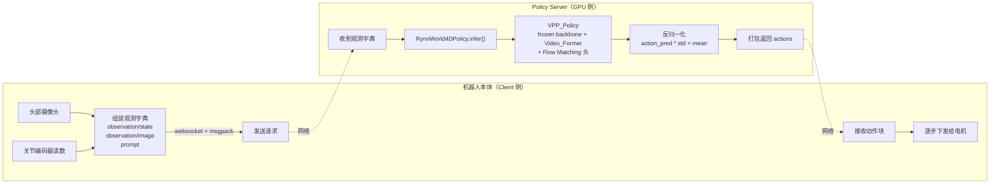
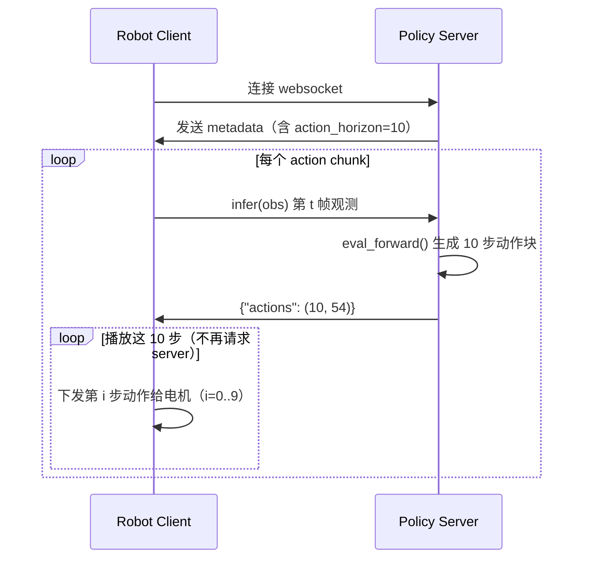

# 真机部署：OpenPI 协议 Server/Client 与工程细节

> **前情提要**：第 11 章讲完了策略训练——Tianji 双臂灵巧手数据集怎么组织、`action_stats.json` 里的 per-dim `mean`/`std` 怎么在训练时把原始关节动作归一化成好训练的数值范围、Hydra 配置怎么把这一整套超参数串起来。训练结束后,磁盘上多出来一个 checkpoint 文件——但一个 `.pt` 文件本身不会动机械臂。本章要接上最后这一段:把训练好的 `VPP_Policy` 包起来,通过一个 websocket 协议对外提供服务,让真实机器人的控制程序能把摄像头画面和关节状态发过来,再把预测的动作发回去。这是整个系列的最后一章。
>
> **相关阅读**:第 9 章 [特征提取:Early-Exit Hook 与三分支 Token 拼接](./09_特征提取_EarlyExitHook与三分支Token拼接)(本章 `infer()` 内部调用的视觉特征提取逻辑)、第 10 章 [Flow Matching 策略头](./10_FlowMatching策略头_DiffusionTransformer编解码器详解)(本章 `eval_forward()` 内部的动作采样逻辑)、第 11 章 [策略训练:Tianji 数据集与训练配置](./11_策略训练_Tianji数据集与训练配置)(本章反归一化用到的 `action_stats.json` 从这里产出)

## 0. 贯穿本章的例子

本章统一用源码里 `serve_rynnworld4d_policy.py` 和 `smoke_test_serve.py` 这一对真实的 server/client 脚本作为例子。场景设定:一台带 GPU 的服务器上跑着加载了 checkpoint 的策略模型,监听 `8000` 端口;机器人本体那台电脑(可能没有 GPU,或者 GPU 要留给别的实时任务)上跑着控制程序,每隔一段时间把头部摄像头拍到的 `720×1280` 原始画面、当前 54 维关节状态打包发过去,等着服务器把下一段动作序列发回来,再把动作序列逐步下发给电机。

## 1. 模型训练好了,怎么真正跑到机器人身上

前 11 章讲的是两件事:世界模型怎么从一张图生成同步的 RGB/深度/光流三路视频,策略网络怎么复用这个世界模型的中间特征、外接一个 Flow Matching 头,把特征变成机械臂动作。这两件事的产物,最终都固化成了一个 PyTorch checkpoint——一堆张量,存在磁盘上。

这堆张量要变成机械臂真实的动作,中间还差一层:**谁来负责读摄像头、读关节角度、把这些数据喂给模型、把模型输出的动作发给电机**?这件事通常不该由模型代码自己做——机器人的底层控制(读传感器、发电机指令、安全联锁)往往是一套独立的、对实时性要求很高的系统,和"要不要跑哪个策略模型"是两回事。业界标准做法是把这两部分解耦成**两个独立的进程**,通过网络通信:

- **Policy Server**:一台有 GPU 的机器,常驻加载模型权重,收到观测就返回动作,不关心机器人本体的细节
- **Robot Client**:跑在机器人本体的控制程序里,负责采集观测、下发动作,不关心模型内部是 Flow Matching 还是别的什么

两者之间用什么协议通信,就是本章要讲的第一件事。



## 2. 为什么用 OpenPI 协议,而不是自己发明一套通信格式

server 和 client 要通信,最直接的做法是:自己定义一个 JSON 或二进制格式,自己写 socket 收发逻辑。这样做的问题不在于"能不能跑通",而在于**每换一个模型就要重新对齐一次协议**——如果 RynnWorld4D-Policy 用一套自定义格式,换成另一个团队训练的 pi0 或 ACT 模型又用另一套格式,机器人控制端的代码就要跟着改一遍收发逻辑、字段名、序列化方式。协议本身不携带任何"这是哪个模型"的信息,双方却要为每一次模型迭代重新达成一次约定。

**OpenPI**(这里指 `rynnworld4d_policy/third_party/Openpi_damo` 这个打包进仓库的开源库)提供的是一个**跟具体模型无关的通用机器人策略服务协议**。它的核心只有一个抽象接口:

```python
class BasePolicy(abc.ABC):
    @abc.abstractmethod
    def infer(self, obs: Dict) -> Dict:
        """Infer actions from observations."""

    def reset(self) -> None:
        """Reset the policy to its initial state."""
        pass
```

**这段代码在定义什么**:任何一个策略,不管内部是 Transformer、Diffusion 还是 Flow Matching,只要能实现"给一个观测字典 `obs`,返回一个动作字典"这一个方法,就符合这个协议。`reset()` 是可选的,用于清空策略内部的状态(比如第 9 节要讲的 `rollout_step_counter`)。

围绕这一个接口,OpenPI 提供了配套的 `WebsocketPolicyServer`(把任意 `BasePolicy` 子类挂到 websocket 上对外提供服务)和 `WebsocketClientPolicy`(在客户端伪装成一个本地的 `BasePolicy`,实际把请求转发到远端 server)。两者之间约定好用 [msgpack](https://msgpack.org/)(一种比 JSON 更紧凑、支持二进制的序列化格式,`msgpack_numpy` 是它的一个扩展,能直接序列化 `numpy.ndarray`)打包字典。

这个设计带来的好处是**关注点分离**:机器人控制端的代码只需要知道"连上某个 host:port,发一个符合观测契约的字典,等着收动作字典回来"——这部分逻辑写一次,永久不用改。真正会变的是 server 端:今天挂的是 RynnWorld4D-Policy,明天想换成另一个训练好的策略,只需要写一个新的 `BasePolicy` 子类(就是本章要拆解的 `RynnWorld4DPolicy`),`main()` 里换一行实例化代码,client 端一行都不用动。这正是"复用生态"的意义——协议这一层的设计成本、调试成本、跨团队沟通成本,只需要付一次,不需要为每个新模型重新付一次。

## 3. RynnWorld4DPolicy:把 VPP_Policy 包成 BasePolicy

`RynnWorld4DPolicy` 这个类要做的事情很单纯:它本身不包含任何新的模型逻辑,只是在 `VPP_Policy`(第 8-10 章讲过的下游策略网络)外面包一层适配代码,让它符合上一节的 `BasePolicy` 接口。`__init__` 里按顺序做五件事:

1. 用训练时同一份 Hydra 配置构建模型结构(保证网络结构、超参数和训练时完全一致)
2. 加载 checkpoint 权重(EMA 或完整 state_dict,第 5 节展开)
3. 加载预先算好的文本 embedding(第 8 节展开)
4. 加载动作归一化统计量 `action_stats.json`(第 7 节展开)
5. 定义图像预处理 transform(第 6 节展开)

先看构建模型这一步——它复用的是训练脚本用的同一套配置系统:

```python
with initialize(config_path="./policy_conf", job_name="serve"):
    cfg = compose(config_name=config_name)
self.cfg = cfg
self.height = int(cfg.wan_height)   # 480
self.width = int(cfg.wan_width)     # 640

model = hydra_lib.utils.instantiate(cfg.model)
```

**这段代码在做什么**:`initialize` + `compose` 是 Hydra 的标准用法,从 `policy_conf/train_config.yaml` 读出和训练时一模一样的那份配置(`act_seq_len`、`wan_height`、`backbone` 等所有超参数);`hydra_lib.utils.instantiate(cfg.model)` 根据配置里 `_target_: policy_models.vpp_policy.VPP_Policy` 这一行,反射式地实例化出一个和训练时结构完全相同、但权重是随机初始化的 `VPP_Policy` 对象。这一步之所以重要,是因为模型结构(多少层、多宽、`condition_dim` 是多少)必须和训练时严格一致——如果 server 端用了一份不同的配置,加载 checkpoint 时张量形状就会直接对不上。

模型结构对齐之后,`infer()` 方法才是真正的推理入口:

```python
@torch.no_grad()
def infer(self, obs: Dict) -> Dict:
    head = np.asarray(obs["observation/image"])
    state = np.asarray(obs["observation/state"], dtype=np.float32)

    rgb_static = self._prep_image(head)
    state_t = torch.from_numpy(state).unsqueeze(0).to(self.device)  # (1, 54)

    model_obs = {"rgb_obs": {"rgb_static": rgb_static}, "state": state_t}
    goal = {"lang_text_embedding": self.text_embedding}

    action_pred = self.model.eval_forward(model_obs, goal)  # (1, horizon, 54)
    action_pred = action_pred[0].float().cpu().numpy()       # (horizon, 54)

    actions = action_pred * self.action_std + self.action_mean
    return {"actions": actions.astype(np.float32)}
```

这段代码把整个 `BasePolicy.infer(obs) -> Dict` 契约落到了实处:从 `obs` 字典里取出图像和状态,分别做预处理,拼成 `VPP_Policy.eval_forward` 期望的输入格式(`model_obs` 和 `goal`,这两个字典的结构和第 9、10 章讲的训练/验证代码路径里传给 `eval_forward` 的完全一样——**这正是"复用已有代码路径"的好处**:部署时不需要重新实现一套推理逻辑,`eval_forward` 在训练脚本的 `validation_step` 里已经被调用过,现在只是换了一个观测来源),拿到模型输出后做反归一化(第 7 节展开),打包成 `{"actions": ...}` 返回。整个方法没有任何新的模型计算——它是纯粹的"格式转换 + 调用已有方法"的适配层。

## 4. 观测契约:client 发来的字典里有什么

`infer(obs)` 里 `obs` 的具体内容,不是随便定义的,而是 server 和 client 双方**必须提前对齐**的一份契约。源码文件开头的 docstring 把这份契约写得很清楚:

| Key | 类型/形状 | 含义 | 本策略是否使用 |
|-----|-----------|------|---------------|
| `observation/state` | `float32 (54,)` | 原始关节状态(未归一化) | ✅ 直接喂给 `eval_forward` 的 `state` 字段 |
| `observation/image` | `uint8 (H,W,3)` | 头部相机画面,**原始分辨率**(如 720×1280) | ✅ 唯一用到的相机 |
| `observation/left_wrist_image` | `uint8 (H,W,3)` | 左手腕相机画面 | ❌ 忽略 |
| `observation/right_wrist_image` | `uint8 (H,W,3)` | 右手腕相机画面 | ❌ 忽略 |
| `prompt` | `str` | 任务描述文本(如 `"Pick-Place"`) | ❌ 忽略,原因见第 8 节 |

这份契约体现的正是上一节讲的"关注点分离":client 端(`tianjiwuji_client_sync_fixed.py`,机器人真机上跑的控制程序)只负责按这份契约把观测**原样**塞进字典发过去,不需要知道 server 端具体用得上哪几个 key、用不上哪几个 key。左右手腕相机、`prompt` 字段被这个策略忽略,不代表协议设计有问题——它们可能是给别的策略(比如一个真的需要腕部视角、或者真的需要按文本动态换任务的策略)预留的,`RynnWorld4DPolicy` 只是没有用到而已。这种"契约里字段可以有冗余,各个策略按需取用"的设计,恰恰是让同一套 client 代码能够服务多个不同策略的关键。

`infer()` 里对应的取值代码只有两行:

```python
head = np.asarray(obs["observation/image"])
state = np.asarray(obs["observation/state"], dtype=np.float32)
```

值得注意的是这里**没有做任何容错处理**——如果 client 发来的字典缺了 `observation/image` 这个 key,这行代码会直接抛 `KeyError`,连接随即在 `websocket_policy_server.py` 的异常处理逻辑里被关闭。这是刻意的设计取向而不是疏漏:观测契约一旦确定,server 端就应该假设 client 严格遵守它,把"契约是否满足"这件事交给开发调试阶段的 `smoke_test_serve.py`(第 10 节会用到)去发现,而不是在生产推理路径里增加运行时判断的开销。

## 5. Checkpoint 加载:EMA 权重还是完整 state_dict

训练产出的 checkpoint 文件里,并不只存了"当前模型参数"这一份数据。源码里的加载逻辑分两条路径:

```python
ckpt = torch.load(checkpoint, map_location="cpu", mmap=True, weights_only=False)
ema = ckpt.get("ema", None)
if ema is not None:
    missing, unexpected = model.load_state_dict(ema, strict=False)
    logger.info("Loaded EMA params (%d tensors). missing=%d unexpected=%d",
                len(ema), len(missing), len(unexpected))
else:
    model.load_state_dict(ckpt["model"], strict=False)
    logger.info("Loaded full model state_dict (no EMA in checkpoint).")
```

**这段代码在做什么**:优先找 checkpoint 里的 `"ema"` 字段,如果存在就只用它覆盖模型的对应权重;否则退回去用 `"model"` 字段做一次完整加载。两条路径都传了 `strict=False`,原因是模型里包含被冻结的 21B 世界模型 backbone 参数——这部分参数从 `rynnworld4d_ckpt` 单独加载(`WanFeatureExtractor` 构造时已经完成,参见第 9 章),不会出现在 policy checkpoint 的 `"ema"` 字段里,`strict=False` 允许这次 `load_state_dict` 只覆盖它能对上号的那部分张量(`Video_Former` 和 Flow Matching 头这两个可训练模块),不会因为 backbone 权重"缺失"而报错。

为什么优先用 EMA 而不是完整 state_dict:`"ema"` 字段里存的是**可训练参数的指数滑动平均值**,而不是训练最后一步的参数本身。训练过程中每一步梯度更新都会让参数发生震荡,尤其是训练末期学习率还没完全退到零的时候,直接取最后一步的参数容易带上这种震荡的噪声;EMA 权重相当于把最近若干步的参数做了一次时间上的平滑,通常泛化能力更稳定——这是深度学习训练里一个通用的经验结论,不是这个项目特有的技巧,所以代码里的策略是"有就优先用",没有 EMA 字段(比如训练脚本被中断在早期、或者用的是一份没有开启 EMA 的旧配置)就退回完整 state_dict,保证部署脚本在两种情况下都能跑起来。

## 6. 图像预处理的严格对齐:训练和部署必须用同一套 transform

`observation/image` 到达 server 时是完全原始的图像——client 端不做任何 resize 或裁剪,直接把摄像头读出来的 `720×1280` 原图打包发过去。真正的预处理发生在 server 端,而且**必须和训练时 dataset 里的 transform 逐字节对齐**:

```python
self.transform = T.Compose([
    T.ToPILImage(),
    T.CenterCrop((self.height, self.width)),   # (480, 640)
    T.ToTensor(),                               # [0,1]
    T.Normalize(mean=[0.5] * 3, std=[0.5] * 3), # [-1,1]
])
```

```python
def _prep_image(self, image: np.ndarray) -> torch.Tensor:
    if image.dtype != np.uint8:
        image = np.clip(image, 0, 255).astype(np.uint8)
    t = self.transform(image)                             # (3, H, W)
    return t.unsqueeze(0).unsqueeze(0).to(self.device)     # (1, 1, 3, H, W)
```

这四步分别是:把 numpy 数组转成 PIL 图像(`torchvision` transform 的标准输入格式)、中心裁剪到训练时用的固定分辨率、转成 `[0,1]` 范围的张量、再线性映射到 `[-1,1]`(`Normalize(mean=0.5, std=0.5)` 对每个像素值做 $(x-0.5)/0.5$,把 `[0,1]` 映射成 `[-1,1]`,这是给 Wan2.2 backbone 的标准输入范围)。最后两个 `unsqueeze` 是在补出 batch 维和时间帧维,凑成模型期望的 `(B, T, C, H, W)` 五维张量——部署时 batch size 恒为 1,时间帧维也恒为 1(单帧推理,不是训练时那种多帧片段)。

这套 transform 为什么必须和训练时 dataset 里的完全一致,而不能是"看起来差不多"的另一套实现——这是真机部署里最容易踩、也最容易被忽视的一类坑,业界通常叫它 **train-test skew**(训练/推理预处理不一致导致的性能衰退)。它的问题本质是:模型在训练阶段学到的所有视觉特征,都是建立在"输入图像经过某个固定变换之后长什么样"这个前提之上的。举个具体的例子——如果训练时用的是 `CenterCrop` 但部署时不小心写成了 `Resize`,同一块画面里的物体在图像中的**像素级位置和尺度**会发生变化(`CenterCrop` 保持原始分辨率下的物体大小、只是裁掉边缘;`Resize` 会拉伸或压缩整张图,改变物体的相对大小),模型看到的输入分布和训练时见过的分布出现了系统性偏移,即便偏移看起来很小,也可能让 backbone 提取出的特征偏离训练时的分布,策略头据此给出的动作预测精度随之下降——而这类问题往往不会在代码层面报错,模型照样输出一个动作,只是这个动作不准,调试起来比崩溃更麻烦。

这也是为什么源码的 docstring 特意强调 "**the client must NOT pre-resize**"——如果 client 端为了省流量先把图像 resize 到某个尺寸再发送,server 端的 `CenterCrop` 拿到的就不再是原始分辨率下的画面,两端对"图像应该长什么样"的假设直接冲突。保证严格对齐的最简单办法就是这里采用的策略:**预处理的全部逻辑只在一个地方实现**(dataset 的 eval transform,训练和部署共用同一份配置驱动的高、宽参数 `cfg.wan_height`/`cfg.wan_width`),client 端不介入任何图像变换,只管传原始像素。

## 7. 动作反归一化:把模型输出的动作从"训练用的数值空间"换回真实物理单位

模型 `eval_forward` 吐出来的 `action_pred`,数值范围和真实关节角度、灵巧手关节角度完全不是一个量级——这是因为第 11 章训练时,dataset 在把原始动作喂给模型之前,先做了一次归一化:$a_{\text{norm}} = (a - \mu)/\sigma$,把每一维动作都变换成均值 0、标准差 1 附近的数值。这样做的原因是 Flow Matching 训练目标(第 5、10 章讲过的插值和速度场回归)在各维度数值量级差异很大时会训练得不稳定——如果 54 维动作里有的维度典型取值是 `-2` 到 `2`(手臂关节弧度),有的维度是 `0` 到 `0.1`(灵巧手某个关节的微小摆动范围),loss 会被数值大的维度主导,数值小的维度的梯度信号相对被淹没。

推理时模型输出的自然也是这个归一化空间里的数值,不是可以直接发给电机的真实角度——必须做归一化的**逆操作**,才能得到物理单位下的动作:

$$
\text{actions} = \text{action\_pred} \times \sigma + \mu
$$

**Step 1:这个公式在做什么**——把模型输出的、处于"零均值、单位标准差"数值空间里的归一化动作 $\text{action\_pred}$,通过乘标准差再加均值,变换回训练数据本身的物理量级(关节角度、灵巧手关节角度的真实弧度值)。这一步和第 11 章训练时的归一化 $a_{\text{norm}}=(a-\mu)/\sigma$ 方向完全相反,是它的逆运算。

> **一句话**:模型只认得"这个动作比平均水平高/低多少个标准差",这一步把"多少个标准差"换算回"具体是多少度"。

**逐符号拆解**:

| 符号 | 数学含义 | 在本场景中具体是什么 | 维度/来源 |
|------|---------|---------------------|-----------|
| $\text{action\_pred}$ | 模型输出的归一化空间动作 | `self.model.eval_forward(...)` 的返回值,取 batch 里第 0 个样本 | 形状 `(action_horizon, 54)`,即 `(10, 54)` |
| $\sigma$ | 每一维动作的标准差 | `self.action_std`,从 `action_stats.json` 的 `"std"` 字段读出 | 长度 54 的向量,按元素(element-wise)乘 |
| $\mu$ | 每一维动作的均值 | `self.action_mean`,从 `action_stats.json` 的 `"mean"` 字段读出 | 长度 54 的向量,按元素加 |
| $\text{actions}$ | 反归一化后、真正发给机器人的动作 | 返回给 client 的 `{"actions": ...}` | 形状与 `action_pred` 相同 `(10, 54)`,单位是真实关节弧度 |

这里的乘法和加法都是**按元素（element-wise）**广播的——`action_pred` 形状是 `(10, 54)`,`self.action_std`/`self.action_mean` 形状是 `(54,)`,NumPy 会把后者在第 0 维(时间步维)上自动广播 10 次,每个时间步各自用同一套 54 维的 $\mu,\sigma$ 做反归一化,不同维度(比如左臂第 1 关节和右手第 3 个手指关节)各自用自己那一维的统计量,互不干扰。

**代入数字**:取 `action_stats.json` 里真实的前 3 维统计量(对应左臂前 3 个关节),假设模型输出归一化动作 `action_pred = [0.5, -1.0, 0.2]`:

| 维度 | $\mu$ | $\sigma$ | $\text{action\_pred}$ | 计算 | $\text{actions}$ |
|------|-------|----------|------------------------|------|-------------------|
| 0 | 1.7085 | 0.4461 | 0.5 | $0.5 \times 0.4461 + 1.7085$ | **1.9316** |
| 1 | -0.7164 | 0.1240 | -1.0 | $-1.0 \times 0.1240 + (-0.7164)$ | **-0.8404** |
| 2 | -0.9482 | 0.3245 | 0.2 | $0.2 \times 0.3245 + (-0.9482)$ | **-0.8833** |

三个维度各自独立完成同样的仿射变换,互不影响,得到的 `1.9316`、`-0.8404`、`-0.8833` 才是真正会被下发给机器人第 1、2、3 号关节电机的角度(弧度)指令。

**为什么是这个形式**:这个反归一化公式的形式完全由第 11 章训练时选择的归一化方式决定——训练用的是标准的 z-score 归一化($(a-\mu)/\sigma$),它的逆运算在数学上就是唯一确定的仿射变换 $a=a_{\text{norm}}\times\sigma+\mu$,没有别的设计选择空间;唯一需要工程上保证的是,这里用的 $\mu,\sigma$ 必须和训练时算 `action_stats.json` 用的是**同一份**统计量,否则反归一化和归一化就不是严格的逆操作,输出的动作会带有系统性偏差。

## 8. text_embedding 怎么被预先算好,而不是每次推理都跑一遍

`infer()` 传给 `eval_forward` 的 `goal` 字典是这样构造的:

```python
goal = {"lang_text_embedding": self.text_embedding}
```

`self.text_embedding` 在 `__init__` 里只加载了一次:

```python
data = load_file(text_embedding_path)          # pick_up.safetensors
emb = data["lang_text_embedding"]               # (1, 77, 4096)
if emb.dim() == 3:
    emb = emb.squeeze(0)                         # (77, 4096)
self.text_embedding = emb.to(self.device)
```

`obs` 字典里明明带了一个 `"prompt": "Pick-Place"` 字段,但 `infer()` 完全没有用它——docstring 里写得很直接:`"prompt": str (ignored; we use a fixed pre-computed UMT5 embedding)`。这不是漏掉了对文本 prompt 的处理,而是刻意的取舍:这套部署脚本服务的是**一个固定任务**(比如天机双臂机器人的 Pick-Place 抓放任务),任务描述文本从头到尾都是同一句话,不会在推理过程中动态切换成另一句指令。既然文本内容不变,把它交给 UMT5 文本编码器(第 8-9 章讲过,这是一个参数量不小的大模型,推理有真实的显存和延迟开销)重新编码一遍,对每一次推理请求来说都是在做一次完全重复、结果完全相同的计算——**缓存掉这份计算**是显而易见的优化:提前用同一个 UMT5 编码器把 `"Pick-Place"` 这句话编码一次,存成 `pick_up.safetensors` 这个文件,部署时直接 `load_file` 读出来,整个服务生命周期里只做一次磁盘 IO,不再需要在 GPU 上跑一次文本编码器的前向传播。

这带来两个直接的收益:一是省掉了 UMT5 编码器本身的推理耗时,让 `infer()` 的关键路径只剩视觉特征提取和动作生成两步,对 9Hz+ 的高频闭环控制(第 8 章提到的推理频率要求)很关键;二是省掉了给 UMT5 编码器单独占用的那部分显存——如果任务描述真的需要动态变化,`eval_forward` 里其实保留了走原始文本编码的分支(`if "lang_text_embedding" in goal: ... else: language = goal["lang_text"]; ... self.TVP_encoder._encode_text(...)`),只是这套部署脚本没有选择走这条路径,因为当前部署场景压根不需要它。

## 9. action_horizon 与 multistep:一次推理管多少步

`metadata` 属性里有一个字段:

```python
@property
def metadata(self) -> dict:
    return {
        "policy": "rynnworld4d",
        "action_dim": int(self.action_mean.shape[0]),
        "action_horizon": int(self.cfg.act_seq_len),   # 10
        "image_size": [self.height, self.width],
    }
```

`action_horizon=10` 意味着**每一次 `infer()` 调用,返回的不是一步动作,而是未来连续 10 步的动作序列**——这正是 `action_pred` 形状里的那个 `10`(`(action_horizon, 54)`)。这不是本章新引入的设计,而是第 8-10 章讲过的策略头本身的输出形式:`VPP_Policy` 的 Flow Matching 头一次采样直接生成一整段动作块(action chunk),不是逐步自回归地一次只生成一步。

这个"一次生成一段"的设计,如果每次机器人执行完一步动作就重新请求一次推理,一整段动作块的价值就浪费了——10 步动作只用了第一步,剩下 9 步直接丢弃,等于每一步控制指令都要重新走一遍完整的视觉特征提取 + Flow Matching 采样,推理开销是必要值的 10 倍。真正划算的做法是**只在动作块用完的时候才重新推理**,中间的步骤直接把上一次拿到的动作块按顺序播放下去。

这套"按需重新推理"的逻辑,在 `VPP_Policy.step()` 里已经有一份现成的实现,用于训练/评估阶段做闭环 rollout(在环境里连续执行多步、观察策略实际表现)时的调用:

```python
def step(self, obs, goal):
    if self.rollout_step_counter % self.multistep == 0:
        self.pred_action_seq = self.eval_forward(obs, goal)
    current_action = self.pred_action_seq[0, self.rollout_step_counter]
    ...
    self.rollout_step_counter += 1
    if self.rollout_step_counter == self.multistep:
        self.rollout_step_counter = 0
    return current_action
```

**这段代码在做什么**:维护一个计数器 `rollout_step_counter`,只有当计数器归零(意味着上一段动作块已经播放完)时才调用一次 `eval_forward()` 重新推理,拿到新的 `pred_action_seq`;其余时候直接从缓存的 `pred_action_seq` 里按计数器取出对应的那一步动作。`multistep` 这个超参数(配置里默认 `10`,和 `act_seq_len` 对齐)决定了一段动作块要连续播放多少步才重新请求下一段。

`RynnWorld4DPolicy.infer()` 本身并**没有**直接调用这个 `step()` 方法,而是每次收到 websocket 请求都直接调 `eval_forward()`,新生成一整段动作块返回给 client。原因是 `rollout_step_counter` 这套计数逻辑天然应该活在**发起请求的一方**,而不是响应请求的一方——在 OpenPI 部署架构里,负责决定"要不要发起新一轮推理请求"的正是机器人本体那台电脑上跑的 `tianjiwuji_client_sync_fixed.py`。`metadata` 里的 `action_horizon` 字段,就是 server 告诉 client "我每次返回的动作块有多长"这个信息,client 据此复刻和 `step()` 完全一致的行为模式:调一次 `infer()`,拿到 10 步动作,在本地把这 10 步依次下发给电机执行完,再发起下一次 `infer()` 请求要下一段动作块——整个决策链条和 `step()` 里 `rollout_step_counter % multistep == 0` 的判断逻辑是同一件事,只是搬到了网络协议的另一端,用 `action_horizon` 这个 metadata 字段替代了本地变量的角色。



这也解释了为什么本章第 7 节反归一化的 `actions` 数组形状是 `(10, 54)` 而不是 `(54,)`——server 一次返回的就是一整段动作块,反归一化对这整段一次性做完,不需要每一步单独反归一化一次。

## 10. websocket_policy_server:从启动到第一次推理

前面几节讲的都是 `RynnWorld4DPolicy` 这个类内部怎么工作,`main()` 函数负责把它真正挂到网络上:

```python
policy = RynnWorld4DPolicy(checkpoint=args.checkpoint, ...)

server = websocket_policy_server.WebsocketPolicyServer(
    policy=policy,
    host=args.host,
    port=args.port,
    metadata=policy.metadata,
)
server.serve_forever()
```

`WebsocketPolicyServer` 本身的实现(第 2 节提过,是 OpenPI 库里的通用代码,不是这个项目专门写的)只做三件跟具体策略无关的事:接受连接、收发 msgpack 打包的字典、把 `infer` 的异常转换成 websocket 错误帧。核心的连接处理逻辑是一个循环:

```python
async def _handler(self, websocket):
    packer = msgpack_numpy.Packer()
    await websocket.send(packer.pack(self._metadata))   # 连接建立时先发一次 metadata

    while True:
        obs = msgpack_numpy.unpackb(await websocket.recv())
        action = self._policy.infer(obs)
        await websocket.send(packer.pack(action))
```

连接刚建立时,server 会**主动**先发一次 `metadata`(也就是第 9 节讲的 `action_horizon` 等字段),不需要 client 主动请求——`WebsocketClientPolicy.__init__` 里 `_wait_for_server()` 建立连接后做的第一件事,正是 `metadata = msgpack_numpy.unpackb(conn.recv())`,同步拿到这份 metadata 并存起来。之后进入的 `while True` 循环,每一轮都是"收一个观测字典 → 调用 `policy.infer(obs)` → 发回一个动作字典",这正是本章第 1-9 节讲的整条链路真正被触发的地方——`RynnWorld4DPolicy.infer()` 就是这里的 `self._policy.infer(obs)`。

`smoke_test_serve.py` 提供了验证整条链路是否打通的最小闭环:

```python
client = websocket_client_policy.WebsocketClientPolicy(host=args.host, port=args.port)
print("server metadata:", client.get_server_metadata())

obs = {
    "observation/state": np.random.randn(54).astype(np.float32),
    "observation/image": np.random.randint(0, 256, (720, 1280, 3), dtype=np.uint8),
    "observation/left_wrist_image": np.random.randint(0, 256, (224, 224, 3), dtype=np.uint8),
    "observation/right_wrist_image": np.random.randint(0, 256, (224, 224, 3), dtype=np.uint8),
    "prompt": "Pick-Place",
}
result = client.infer(obs)
actions = result["actions"]
```

这段代码没有真实机器人,用随机数伪造了一份符合第 4 节观测契约的 `obs`(注意图像特意用了 `720×1280` 这个"原始未裁剪"的分辨率,呼应第 6 节"client 不做 resize"的约定),验证整条链路——序列化、网络传输、`infer()` 内部的图像预处理与模型前向、反归一化、反向序列化——每一步都不出错,返回的 `actions` 形状确实是 `(10, 54)`。这是把一个训练好的模型真正接入机器人之前,最后、也是最基础的一道工程验证:先确认协议和数据格式全部对齐,再谈论动作预测准不准的问题。

## 11. 系列总结

这个系列用 12 章的篇幅,把 RynnWorld-4D 从一个论文里的架构图,拆成了可以逐行对照代码理解的工程实现。回顾整条主线:

**世界模型部分(第 1-7 章)**:第 1-2 章建立了全局认知——RGB-DF 表示(RGB + Depth + Flow 三路同步视频)为什么比纯像素预测更贴近机器人控制需要的物理量,以及单分支的 Wan2.2 视频扩散模型怎么被改造成三个独立分支。第 3-5 章讲跨模态融合怎么练成:三阶段渐进式训练(`fusion_mode` 从 `none` 到 `unidirectional` 再到 `joint`)背后"先分别学会各自的模态,再学会互相借力"的逻辑,Joint Cross-Modal Attention 内部共享 KV、零初始化门控、模态嵌入这些具体机制,以及 Flow Matching 训练目标怎么在这个三分支结构上落地(shifted sigma 采样、共享噪声、branch dropout)。第 6-7 章讲推理和数据管线的收尾:50 步联合去噪怎么让三个 scheduler 协同工作生成同步的三路视频,以及原始视频怎么一步步变成训练循环真正消费的三路 latent 张量。

**下游策略部分(第 8-12 章)**:第 8-10 章是这个系列的第二个转折点——不再讨论"怎么生成视频",而是讨论"生成视频这件事产生的中间特征,怎么被复用来直接输出机械臂动作"。冻结整个三分支世界模型只做特征提取(Early-Exit Hook 截断在某一层,不需要跑完全部 30 层),用 Perceiver Resampler 把庞大的视觉 token 压缩到可控数量,再接一个轻量的 Flow Matching 动作头(4 步 Euler 积分,比原版 VPP 用的 EDM 采样快得多)。第 11 章讲这套架构怎么在天机双臂灵巧手数据上被训练出来。第 12 章(本章)讲训练好的权重怎么通过 OpenPI 协议真正接到机器人身上——EMA 权重加载、图像预处理的严格对齐、动作反归一化、文本 embedding 缓存、action chunk 的按需重新推理机制,这些看起来"琐碎"的工程细节,恰恰是一个训练好的模型和一个真正能用的机器人系统之间的全部距离。

回到系列开篇提出的问题:机器人操控怎么才能真正利用 4D 几何和运动信息做控制,而不是只依赖 2D 像素的表面模式匹配?RynnWorld-4D 给出的答案分两层——**表示层面**,用深度和光流这两路显式的几何/运动信号,强迫模型在生成视频的同时学会理解场景的 3D 结构怎么随交互变化,而不是只学会"这张图接下来大概会变成什么样"这种纯视觉外观层面的预测;**利用层面**,不需要把这些 4D 信息重新解码成显式的点云或场景流才能用,冻结的世界模型中间层特征本身就携带了这些几何/运动线索,策略头直接从这些特征里学习动作,省去了"先重建 3D 几何、再基于几何做规划"这条传统机器人学路线里代价高昂的中间步骤。这是这个项目最核心的工程赌注,也是这个系列想讲透的东西。

## 知识链接

- 第 2 章 [Tri-Branch 架构总览:从单分支 Wan2.2 到三分支世界模型](./02_TriBranch架构总览_从单分支Wan2.2到三分支世界模型) —— 本章 `RynnWorld4DPolicy` 加载的 `rynnworld4d_ckpt` 三分支 backbone 结构定义
- 第 5 章 [训练细节:Flow Matching 目标、时间步偏移与分支随机丢弃](./05_训练细节_FlowMatching目标与分支随机丢弃) —— 本章 Flow Matching 策略头(第 10 章)采样过程复用的同一套 Flow Matching 数学框架
- 第 9 章 [特征提取:Early-Exit Hook 与三分支 Token 拼接](./09_特征提取_EarlyExitHook与三分支Token拼接) —— 本章 `infer()` 内部 `eval_forward` 调用的视觉特征提取逻辑
- 第 10 章 [Flow Matching 策略头:DiffusionTransformer 编解码器详解](./10_FlowMatching策略头_DiffusionTransformer编解码器详解) —— 本章 `action_horizon`/`eval_forward` 输出的动作块具体怎么由策略头采样出来
- 第 11 章 [策略训练:Tianji 数据集与训练配置](./11_策略训练_Tianji数据集与训练配置) —— 本章反归一化用的 `action_stats.json`、图像预处理对齐的 `wan_height`/`wan_width` 配置,均在这一章的训练流程中产出
- [Flow Matching 与连续归一化流](/前置知识/000g_前置知识_Flow_Matching与连续归一化流) —— 理解 `eval_forward` 内部 4 步 Euler 积分采样动作的数学基础
