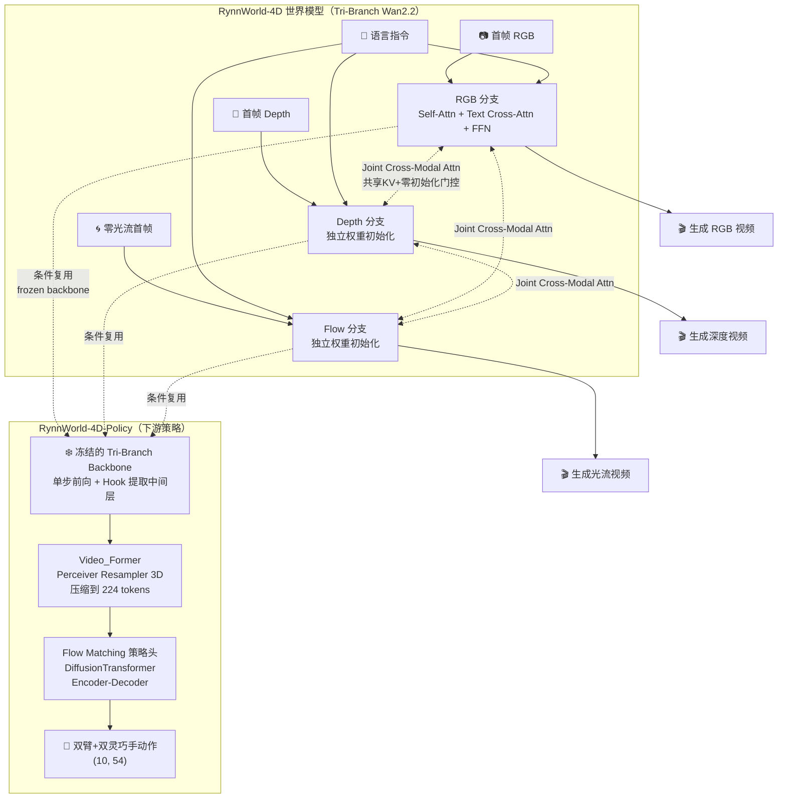

# RynnWorld-4D 深度解析：4D 世界模型与机器人操控策略全拆解

> 从"一张图 + 一句话怎么变成同步的 RGB、深度、光流三路视频"，到"这些 4D 预测怎么被一个策略网络直接吃进去、变成机械臂的下一步动作"，完整拆解阿里达摩院开源的 4D 具身世界模型 RynnWorld-4D 的架构设计、三阶段训练方法与下游策略部署全流程。

## 系列简介

**RynnWorld-4D** 是阿里达摩院（DAMO Academy）2026 年开源的一个具身世界模型，论文题目是《4D Embodied World Models for Robotic Manipulation》（[arXiv:2607.06559](https://arxiv.org/abs/2607.06559)）。它想解决的问题是：机器人操控不仅需要知道"场景看起来是什么样"，还需要知道"场景的 3D 几何结构会怎么随交互变化"。

大多数视频生成式世界模型只预测 2D 像素的未来（RGB 视频），但像素预测本身不携带深度信息、不携带运动的度量信息——机器人真正需要的是"这个物体离我多远"、"它接下来会往哪个方向移动多快"这类物理量。RynnWorld-4D 的核心思路是：**让一个统一的扩散模型同时生成三路同步的视频——RGB（外观）、深度（几何）、光流（运动）**，三者拼在一起构成作者称为"RGB-DF"的表示。这个表示可以被反投影（unproject）成真实的 3D 场景流，比单纯的像素预测更贴近机器人控制所需的物理量。

围绕这个核心表示，项目开源了两部分代码：

- **RynnWorld-4D（世界模型本身）**：一个基于 Wan2.2-TI2V-5B 视频扩散模型改造的**三分支（tri-branch）架构**，三个分支分别对应 RGB / 深度 / 光流，通过跨模态注意力机制让三路生成过程保持时空一致
- **RynnWorld-4D-Policy（下游策略）**：复用冻结的世界模型作为 4D 特征提取器，接一个轻量级 Flow Matching 策略头，做双臂灵巧手操控的闭环控制（9Hz+ 高频推理）

这个系列会像拆发动机一样，把 RynnWorld-4D 从"单分支 Wan2.2 怎么变成三分支"，到"三分支怎么通过精心设计的门控注意力融合信息"，到"训练时的 Flow Matching 目标怎么构造"，再到"下游策略怎么把冻结的世界模型特征变成机械臂动作"，逐层拆解干净。

**适合读者**：
- 已经了解视频扩散模型基本原理（DiT、Flow Matching），想理解"如何给一个预训练模型扩展多模态分支"这一具体工程问题的工程师
- 对世界模型（World Model）在机器人操控中的应用感兴趣的研究者
- 想理解"零初始化门控""渐进式模块注入"这类训练技巧在实际大模型工程中如何落地的开发者
- 想学习如何用 Perceiver Resampler 把大规模视觉特征压缩后接入策略网络的机器人学习从业者

**你将获得**：
- 对 RynnWorld-4D 三分支架构（独立 SFT → 联合跨模态注意力 → 全参数微调）三阶段渐进式训练策略的完整理解
- 对 Joint Cross-Modal Attention 内部每一个组件（共享 KV、零初始化门控、模态嵌入、frame-wise 限制、3D RoPE）的代码级认知
- 对 Flow Matching 训练目标在这个具体工程里如何实现（shifted sigma 时间步、分支随机丢弃、classifier-free guidance）的数学理解
- 对世界模型推理流程（50 步联合去噪、三个 scheduler 并行迭代）的完整认知
- 对下游策略架构（冻结 backbone 特征提取、Perceiver 压缩、Flow Matching 动作头）的代码级理解
- 独立跑通数据预处理、三阶段训练、策略微调与真机部署的实操能力

## 章节目录

| 章节 | 标题 | 简介 |
|------|------|------|
| **第一部分：全局认知与架构总览** | | |
| 01 | [全景图：RynnWorld-4D 在解决什么问题？](./01_全景图_RynnWorld4D在解决什么问题) | RGB-DF 表示的动机、与纯像素世界模型的对比、项目两大组成部分 |
| 02 | [Tri-Branch 架构总览：从单分支 Wan2.2 到三分支世界模型](./02_TriBranch架构总览_从单分支Wan2.2到三分支世界模型) | RynnWorld4DTransformerBlock 整体结构，三分支怎样从预训练权重初始化而来 |
| **第二部分：跨模态融合机制** | | |
| 03 | [三阶段渐进式融合：为什么要 none → joint 这样分阶段训练](./03_三阶段渐进式融合_训练策略总览) | fusion_mode 从 none 到 joint 的演进逻辑，每阶段解决什么问题 |
| 04 | [Joint Cross-Modal Attention 逐行拆解](./04_JointCrossModalAttention逐行拆解) | 共享 KV 设计、零初始化门控、模态嵌入、frame-wise 限制、3D RoPE 的代码级讲解 |
| 05 | [训练细节：Flow Matching 目标、时间步偏移与分支随机丢弃](./05_训练细节_FlowMatching目标与分支随机丢弃) | shifted sigma 构造、共享噪声、loss 加权、branch dropout、joint_video_decay |
| **第三部分：推理与数据管线** | | |
| 06 | [世界模型推理：50 步联合去噪的完整流程](./06_世界模型推理_50步联合去噪完整流程) | 三个 scheduler 并行迭代、CFG 怎么在三分支上生效、首帧条件注入 |
| 07 | [数据管线：从原始视频到 RGB/Depth/Flow 三路 Latent](./07_数据管线_从原始视频到RGBDepthFlow三路Latent) | 预处理脚本详解、VAE 编码、文本编码缓存、caption 切片逻辑 |
| **第四部分：下游策略 RynnWorld-4D-Policy** | | |
| 08 | [策略架构总览：冻结 Backbone + Perceiver 压缩 + Flow Matching 动作头](./08_策略架构总览_冻结Backbone与FlowMatching动作头) | VPP_Policy 整体数据流，相比原版 VPP 的关键改动 |
| 09 | [特征提取：Early-Exit Hook 与三分支 Token 拼接](./09_特征提取_EarlyExitHook与三分支Token拼接) | WanFeatureExtractor 怎么复用冻结 backbone，深度估计 DA3 兜底机制 |
| 10 | [Flow Matching 策略头：DiffusionTransformer 编解码器详解](./10_FlowMatching策略头_DiffusionTransformer编解码器详解) | Encoder-Decoder 架构、proprio/goal 条件化、4 步 Euler 推理 |
| **第五部分：训练与部署** | | |
| 11 | [策略训练：Tianji 数据集与训练配置](./11_策略训练_Tianji数据集与训练配置) | 天机双臂机器人数据格式、动作归一化、Hydra 配置系统 |
| 12 | [真机部署：OpenPI 协议 Server/Client 与工程细节](./12_真机部署_OpenPI协议ServerClient与工程细节) | Websocket 通信协议、图像预处理对齐、EMA 权重加载 |

## 核心架构图

## RynnWorld-4D 关键设计参数速查

| 维度 | 取值 | 说明 |
|------|------|------|
| 基座模型 | Wan2.2-TI2V-5B-Diffusers | HuggingFace 开源视频生成模型 |
| Transformer 层数 | 30（TI2V-5B 配置） | 三分支共享层数，各自独立权重 |
| 隐层维度 | 3072 | `num_attention_heads=40 * attention_head_dim` |
| 三分支耦合方式 | fusion_mode（none/unidirectional/bidirectional/joint） | 三阶段训练依次切换 |
| Joint Attention 层范围 | Stage2/3 典型配置 `joint_start_layer=0, joint_end_layer=30, every_n=3` | 每 3 层插入一次联合注意力，共 10 层 |
| Joint Attention 方向 | `joint_unidirectional=True`（RGB 只做 K/V 源，不被修改） | 保护强 RGB 分支不被弱分支污染 |
| Flow Matching 时间步 | `flow_shift=5.0`，逻辑函数偏移 sigma 采样 | 偏向高噪声区间训练，细节见第 5 章 |
| Branch Dropout | Stage3 典型 `branch_dropout_prob=0.05`，仅丢弃 depth/flow | 强制联合注意力依赖跨模态信息 |
| 推理步数（世界模型） | 50 步 UniPC 多步调度器 | 三个 scheduler 独立迭代，共享同一初始噪声 |
| Policy Backbone | 复用冻结的 Tri-Branch Wan2.2（5B），仅取前若干层 Early-Exit | `wan_num_inference_layers` 截断，省算力 |
| Policy 特征维度 | `condition_dim = 3072 × 3（分支）= 9216` | 三分支 Token 沿 channel 拼接 |
| Video_Former 压缩后 | 224 tokens，`latent_dim=384` | Perceiver Resampler 3D |
| Policy 动作生成 | Flow Matching，4 步 Euler 积分 | 相比 EDM 的 10 步 DDIM 更快 |
| Policy 动作维度 | 54 = 7(左臂) + 7(右臂) + 20(左手) + 20(右手) | Tianji 双臂灵巧手机器人 |
| Policy 输入分辨率 | 224×224（相比原版 VPP 的 480×640，训练提速约 3 倍） | |
| 深度来源（Policy 推理时） | Depth-Anything-3（DA3），若无预计算深度则在线估计 | |

## 前置知识要求

阅读本系列前建议了解（系列中遇到时会链接到对应文章）：
- 线性代数基础：矩阵乘法、向量空间、张量维度变换
- 概率论基础：条件概率、正态分布
- 深度学习入门：前向传播、反向传播、Transformer 基本结构、Self-Attention/Cross-Attention
- [Flow Matching 与连续归一化流](/前置知识/000g_前置知识_Flow_Matching与连续归一化流)（第 5、10 章需要）
- [Cross-Attention 与交替注意力机制](/前置知识/001e_前置知识_Cross_Attention与交替注意力机制)（第 4 章需要）
- [RoPE 旋转位置编码](/前置知识/002k_前置知识_RoPE旋转位置编码)（第 4 章需要）
- [KV-Cache 与自回归解码](/前置知识/002m_前置知识_KV_Cache与自回归解码)（第 9 章的跨模块特征复用思路类似）
- [Zero-Init 门控与渐进式模块注入](/前置知识/002n_前置知识_Zero-Init门控与渐进式模块注入)（第 4 章核心机制）
- [Perceiver Resampler：跨模态 Token 压缩](/前置知识/002o_前置知识_Perceiver_Resampler跨模态Token压缩)（第 9 章核心机制）
- [3D 卷积与 Causal 卷积](/前置知识/002a_前置知识_3D卷积与Causal卷积)（第 2 章 VAE/Patch Embedding 需要）
- [数据并行与 AllReduce 基础](/前置知识/001h_前置知识_数据并行与AllReduce基础) / [FSDP 全分片数据并行](/前置知识/001i_前置知识_FSDP全分片数据并行)（第 11 章训练配置需要）

## 阅读建议

1. **完全零基础**：按顺序从第 1 章读起，前 2 章建立全局架构认知
2. **只关心世界模型架构**：重点读第一、二部分（Ch01-05），这是三分支融合机制的核心
3. **只关心下游策略怎么用**：可以从第 8 章直接开始，第 8-12 章自成一个相对独立的阅读单元
4. **想理解训练技巧的通用原理**：优先读前置知识里的 [Zero-Init 门控](/前置知识/002n_前置知识_Zero-Init门控与渐进式模块注入) 和 [Perceiver Resampler](/前置知识/002o_前置知识_Perceiver_Resampler跨模态Token压缩)，再回来看第 4、9 章的具体应用
5. **想复现训练或做微调**：重点读 Ch05（训练目标）+ Ch07（数据管线）+ Ch11（训练配置）
6. **想部署到自己的机器人上**：重点读 Ch09（特征提取）+ Ch10（策略头）+ Ch12（部署协议）

## 相关系列

- [fast-WAM 人类数据 World Model 实验全记录](/系列/fastwam_human_pretrain/) — 同样基于 Wan2.2 改造的世界模型实验，可对照理解不同团队在"视频生成模型 + 机器人动作"这一路线上的不同工程选择
- [GR00T N1.7 深度解析](/系列/groot_n1d7_deep_dive/) — VLA 范式下 Flow Matching 动作生成的另一种实现，可与 RynnWorld-4D-Policy 的 Flow Matching 策略头对照阅读
