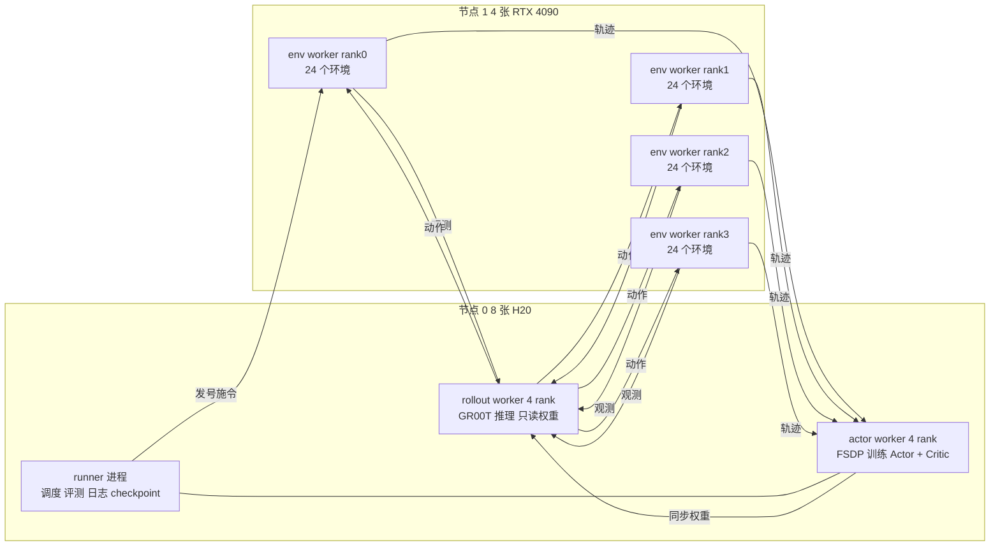
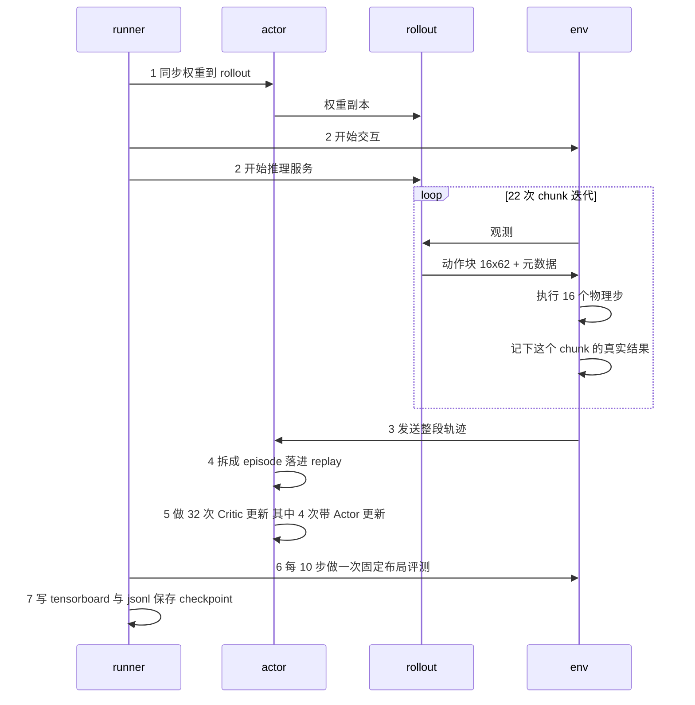

# 第 01 章 全局视角 一个 runner step 发生了什么

> 本章只做一件事：让你能在脑子里完整播放一遍 SAC_FLOW_G 的一个训练步。不讲任何算法公式，只讲谁在什么时候干什么、产出多少东西。

**知识链接**：

- [SAC Soft Actor Critic](/前置知识/000k_前置知识_SAC_Soft_Actor_Critic)
- [行为克隆与 RL 微调范式](/前置知识/000d_前置知识_行为克隆与RL微调范式)
- 下一章：[数据的一生](./02_数据的一生_五条数据流的产生存储与消费)

---

## 1.1 这条链路在解决什么问题

起点是一个已经用行为克隆训练好的 GR00T VLA 权重。它在仿真里的表现有一个很典型的形态：**同一个模型，在有的任务上接近满分，在有的任务上一半左右**。以本系列贯穿使用的例子来说：

```text
任务 A（开笔记本）  固定 48 个布局：45 到 47 成功
任务 B（拉开抽屉）  固定 48 个布局：26 到 33 成功
```

任务 B 不是"模型完全不会"——它会伸手、会靠近抽屉、会做出拉的动作，只是在某些布局下抓不稳、角度偏、力度不对。这类"会做但做不稳"的失败，是在线 RL 唯一有机会改进的部分：因为策略已经能产生成功轨迹，环境里就存在可以用来比较好坏的信号。

于是 SAC_FLOW_G 要做的事可以一句话讲完：

> 把这个 BC 权重放进仿真继续跑，用它自己跑出来的成功与失败数据，训练一个能判断"这个动作比那个动作好"的 Critic，再用这个 Critic 去微调策略。

整个系列剩下的 21 章，全部是在讲这句话里的每一个环节具体怎么落地，以及每个环节可能在哪里出问题。

**贯穿全文的例子**：从本章起，所有具体数字都以"拉开抽屉任务、96 个训练环境、动作 chunk 长度 16"这一组配置为准，也就是配置族里最末端那几条正式实验用的设置。

---

## 1.2 四类进程 谁在哪台机器上

这条链路是一个分布式系统，跑在两台机器上，一共四类角色。理解它们的边界是理解后面所有数据流的前提。



| 角色 | 进程数 | 硬件 | 职责 | 不负责什么 |
|---|---:|---|---|---|
| env worker | 4 | 4090 | 跑 Isaac Sim 物理与渲染，每个 rank 24 个环境；产生观测；执行动作；统计每个 chunk 的真实结果 | 不做任何神经网络前向 |
| rollout worker | 4 | H20 | 跑 GR00T 推理：视觉语言骨干 + Flow 去噪 + 探索候选构造 | 不做反向传播，权重是 actor 同步过来的只读副本 |
| actor worker | 4 | H20 | 持有可训练权重（策略适配器 + Critic + target Critic + 两套优化器），持有 replay buffer，做全部梯度更新 | 不接触仿真，也不做 rollout 推理 |
| runner | 1 | 头节点 | 主循环：调度上面三类 worker、触发评测、写日志与 checkpoint | 不持有模型也不持有数据 |

三个必须记住的边界：

1. **权重有两份**。actor 上那份是可训练的真身，rollout 上那份是副本。每个训练步开头显式同步一次，所以一个 step 内部 rollout 用的权重是固定的。
2. **replay buffer 只在 actor 上**，而且是每个 actor rank 各自一份（4 份互不相同的分片数据）。env 和 rollout 都没有数据存储。
3. **训练与采样是串行的**。默认配置下 env worker 把整个 rollout 跑完才把轨迹发给 actor，actor 收完才开始算梯度。所以一个 step 的墙上时间 = 采样时间 + 训练时间，不重叠。

---

## 1.3 三个时间尺度

这条链路里"一步"这个词有三种完全不同的含义，混淆它们是读日志时最常见的错误来源。

| 尺度 | 名字 | 长度 | 谁在推进 |
|---|---|---|---|
| 最细 | 物理步 physics step | 0.00833 秒，即 1/120 秒 | Isaac Sim 物理引擎 |
| 中间 | chunk 步 | 16 个物理步，约 0.13 秒 | 一次 GR00T 推理管一个 chunk |
| 最粗 | runner step | 22 个 chunk 步 | runner 主循环，日志里的 `global_step` |

中间那一层来自模型本身：GR00T 一次推理输出一个形状为 `[16, 62]` 的动作块——16 个时间步、每步 62 维动作。这 16 步会被完整执行完才重新推理一次。**这是"chunk 级 SAC"这个名字的全部来源**：环境的决策粒度不是单步，而是 16 步一组的宏动作。

最粗那一层的长度不是随便定的。配置里每个 rollout epoch 上限 352 个物理步，除以 chunk 长度 16 得到 22：

```text
22 = 352 物理步 / 16 物理步每 chunk
```

而单个 episode 的上限是 350 个物理步。两个数字几乎相等，意味着：

> 一个 runner step ≈ 每个环境从头到尾跑完一整个 episode。

这个对应关系非常好用。它意味着日志里 `global_step` 从 50 走到 91，就是 96 个环境各自完整地尝试了 41 次任务。后面算数据量、算更新预算、算"策略动了多少"，都建立在这个换算上。

---

## 1.4 一个 runner step 的完整时序

下面是主循环一个迭代的真实顺序。每一格对应 runner 里的一次调用。



逐段说明这七件事。

### 第 1 步 同步权重

actor 把当前可训练权重推给 rollout。配置里同步间隔是每步一次。这一步决定了"这个 step 采集到的数据是用哪个版本的策略采的"，也决定了 replay 里每条轨迹带的 `model_weights_id` 是什么。

### 第 2 步 22 次 chunk 迭代

env worker 和 rollout worker 通过消息通道来回传数据，形成一个紧密的循环。一次迭代内部有四个动作：

1. env 把当前观测（三路相机图像 + 机器人状态 + 任务文本）发给 rollout；
2. rollout 跑一次 GR00T：视觉语言骨干编码，Flow 策略去噪 4 步产出动作块，同时构造探索候选、分配环境角色、记录 BC 参考动作等一批元数据，一起发回 env；
3. env 执行这 16 个物理步；
4. env 统计这个 chunk 的真实结果——有没有成功、有没有失败、有没有物理异常、任务进度从多少变到多少、是否终止或截断——附到刚才那条记录上。

第 4 小步是这条链路的一个关键工程决策：**动作是模型产生的，结果只有环境知道**，所以每条 chunk 记录必须由两边拼起来才完整。拼接的时机是"下一次迭代拿到新观测的时候"，因为那时候才知道执行完的后果，也才拿到了下一状态的模型输入。

### 第 3 步 发送轨迹

22 次迭代全部跑完，env worker 才把这一整段数据打包发给 actor。数据按 actor rank 分片：每个 env rank 的 24 个环境的数据发给对应的 actor rank。

### 第 4 步 入库

actor 收到的是"按时间和环境排列的一批 chunk 记录"，不是完整 episode。它要先按环境把记录切开、攒够一个完整 episode、把奖励重新标注一遍，才能放进 replay。这一步的细节是第 02 章的主题。

### 第 5 步 更新

这是唯一产生梯度的地方。配置里每个 runner step 做 32 次更新，其中每 8 次带一次 Actor 更新，也就是：

```text
每个 runner step = 32 次 Critic 更新 + 4 次 Actor 更新
```

每次更新都要重新从 replay 抽一批数据。抽几种批、各多少条、从哪抽，是第 03 章的主题。

### 第 6 步 评测

每 10 个 runner step 做一次固定布局评测：同样 96 个环境切换到 96 个写死的布局 ID，策略切到确定性模式跑完一整轮，统计成功数。评测结果同时写进 tensorboard 和一个每步一份的 jsonl 文件。

### 第 7 步 落盘

指标写 tensorboard；每步一行的评测明细写 jsonl；到达保存间隔时写 checkpoint。

顺带一个容易困惑的点：主循环里还有一个 `compute_advantages_and_returns` 调用。**对 SAC 它是空操作**，只是为了和 PPO 共用同一个 runner 接口而保留的，返回空指标。看到这个调用不要以为链路里有优势估计。

---

## 1.5 一个 step 的产出账本

把上面的流程换算成数字，就得到这条链路最重要的一张表。所有数字都是配置直接推出来的，可以在日志里逐项核对。

| 项目 | 每个 runner step | 换算依据 |
|---|---:|---|
| 物理步 | 96 × 352 = 33792 | 96 环境 × 22 chunk × 16 步 |
| GR00T 推理次数 | 96 × 22 = 2112 | 每 chunk 一次 |
| 完成的 episode | 约 96 | 一个 step ≈ 每个环境一个 episode |
| 新增 replay 记录 | 约 1260 条 chunk | 4 rank 各约 315 条 |
| 新增 replay 轨迹 | 约 84 条 | 4 rank 各约 21 条 |
| 同状态配对 | 12 对 | 每 24 个环境一块，每块 3 对 |
| Critic 更新 | 32 次 | `num_updates_per_step` |
| Actor 更新 | 4 次 | 32 / `critic_actor_ratio=8` |
| 训练消费的 chunk 样本 | 32 × 32 = 1024 | 每次更新一个全局批 32 |
| pair 消费的样本 | 32 × 64 = 2048 | 每次更新一个 pair 批 64 |

这张表里有一个立刻值得注意的对比：

```text
每步新增 1260 条记录
每步消费 1024 条记录
```

两者同一量级，说明这条链路的"更新预算与采样预算"大致平衡——这是它相对早期配置的一个重要修正。第 17 章会把这笔账算到底，包括为什么这个比值不能太小也不宜太大。

另外注意 84 条新增轨迹与 96 个环境的差：**配对里的探测环境不会产生独立轨迹**，它的数据被折叠进配对主环境的记录里。所以每个 rank 的 24 个环境实际产生 21 条轨迹（18 个独立环境 + 3 个配对主环境）。这个折叠机制是第 02 章要讲的存储结构里最反直觉的一处。

---

## 1.6 这条链路里的四个"不显然"的设计

在进入数据流之前，先把四个后面会反复出现的设计决策点出来，读后面章节时会顺很多。

**一 策略只训练一小部分参数。** GR00T 的视觉语言骨干和 Flow 速度场是冻结的，可训练的只有一个乘性门控适配器加上 Critic。这决定了"策略能动多远"有一个天然的上限，也决定了 checkpoint 里哪些东西必须保存。

**二 奖励不是环境实时给的。** 任务奖励只在成功那一刻有值，而一个 chunk 执行完的当下并不知道这个 episode 最终成不成功。所以入库时要做一次全局重标注。这解释了为什么 replay 的写入不能是流式的，必须有一个"待定 episode"的中间缓冲。

**三 有一部分环境是成对使用的。** 96 个环境里有 24 个被两两配成 12 对，每对的两个环境被强制复制到同一个物理状态，然后执行两个不同的动作。这是为了得到"同一状态下两个动作的真实结果对比"。这套机制在数据结构上引入了一整套镜像字段。

**四 Critic 有一道体检门禁。** 在允许 Actor 跟随 Critic 的梯度之前，系统会用一批从未参与训练的数据检验 Critic 到底会不会比较动作。这道门禁的数据来源、攒法和消费方式，是第 03 章和第 18 章的重点。

---

## 1.7 本章小结

| 问题 | 答案 |
|---|---|
| 链路在做什么 | 用 BC 权重在仿真里继续采数据，训 Critic，再用 Critic 微调策略 |
| 有几类进程 | env 跑仿真、rollout 跑推理、actor 跑训练、runner 做调度，共四类 |
| 数据存在哪 | 只在 actor 上，每个 rank 一份分片 |
| 一个 runner step 是多长 | 22 次 chunk 迭代，约等于每个环境跑完一个 episode |
| 一个 step 产出多少 | 约 96 个 episode、约 1260 条 chunk 记录、12 对同状态配对 |
| 一个 step 消费多少 | 32 次 Critic 更新、4 次 Actor 更新、1024 条训练样本 |
| 采样和训练重叠吗 | 不重叠，严格串行 |

**下章预告**：这一章我们知道了数据大致在什么时候产生。第 02 章把每一份数据追踪到底——它在哪产生、存进哪个容器、结构长什么样、什么时候被谁取走、取走之后还在不在。特别是那个"待定 episode 缓冲"和"配对折叠"，它们是理解整条链路存储设计的钥匙。
