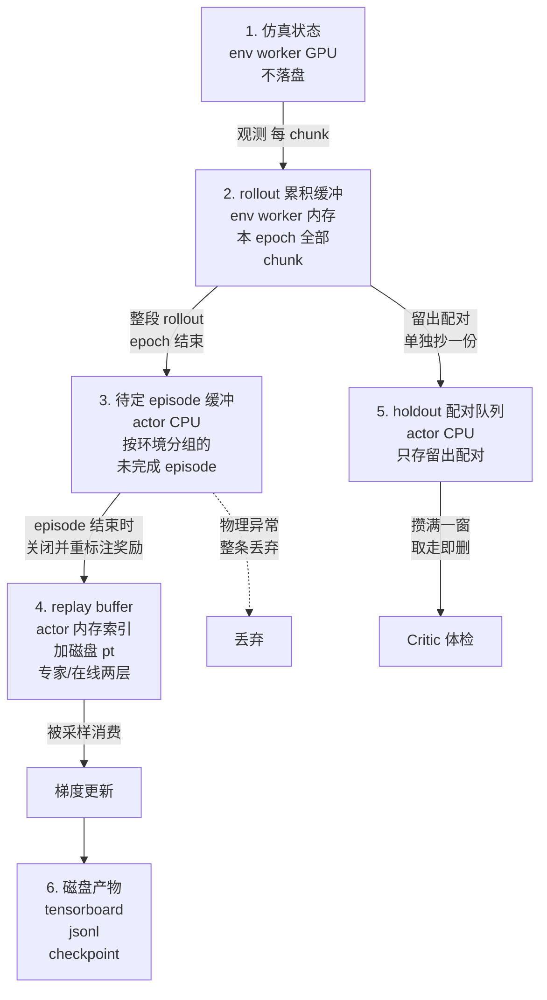

# 第 02 章 数据的一生 五条数据流的产生存储与消费

> **前情提要**：第 01 章我们建立了时间轴——一个 runner step 等于 22 次 chunk 迭代，约等于每个环境跑完一个 episode，产出约 1260 条 chunk 记录。本章把这些记录追踪到底：它在哪产生、存进哪个容器、结构长什么样、什么时候被谁取走、取走之后还在不在。

**知识链接**：

- [Replay Buffer 经验回放](/前置知识/000r_前置知识_Replay_Buffer_经验回放)
- 上一章：[全局视角 一个 runner step 发生了什么](./01_全局视角_一个runner_step发生了什么)
- 下一章：[三种批与消费路径](./03_三种批与消费路径)

---

## 2.1 全局位置 六个存储容器

先给结论。整条链路里一共只有六个地方存着数据，其中三个是**内存里的临时中转**，两个是**长期持有**，一个是**磁盘产物**。

一句话记忆：**数据从仿真出来，先在 env 侧攒满一个 rollout，再在 actor 侧攒满一个 episode，才有资格进 replay；进了 replay 就不再离开，只是被反复抽样。**

下面按这个顺序逐个讲。

---

## 2.2 第一段 观测与动作 只过路不停留

**产生者**：env worker。每次 chunk 迭代开始，Isaac Sim 产出一份观测，包含三路相机图像（头部、左手腕、右手腕）、机器人本体状态、以及任务文本。

**去向**：通过消息通道发给 rollout worker。rollout 跑完 GR00T 推理，把动作块和一批元数据发回来。

**是否存储**：**不单独存储**。这是最容易误解的一点——观测本身不是一个被保存的对象，它是作为"chunk 记录的一部分"被顺手带走的。具体说，rollout 在做推理时会把喂给模型的那一份输入张量原样放进返回结果里，env 收到后连同后续的执行结果一起累积。所以你在 replay 里看到的 `state`、`pixel_values` 这些字段，实际上是 rollout 侧模型输入的副本，而不是 env 侧观测的副本。

这个设计有一个直接后果：**replay 里存的是"模型看到的东西"而不是"环境的真实状态"**。它保证了训练时喂给 Critic 的输入和当初采样时喂给策略的输入完全一致，代价是每条记录都带着高维图像张量，非常占空间。

**动作的方向**：rollout 产出的动作块形状是 `[16, 62]`——16 个时间步、62 维。env 收到后逐步下发给控制器，执行 16 个物理步。

---

## 2.3 第二段 rollout 累积缓冲 chunk 记录在这里成形

**位置**：env worker 内存，每个 rank 一个。

**产生方式**：每次 chunk 迭代结束时追加一条。一条 chunk 记录不是一次性写完的，而是**三方拼接**出来的：

| 来源 | 贡献的内容 | 什么时候能拿到 |
|---|---|---|
| rollout worker | 模型输入、动作块、BC 参考动作、探索元数据、环境角色 | 推理返回的当下 |
| env worker | 这个 chunk 的真实结果：成功 / 失败 / 物理异常 / 终止 / 截断 / 有效步掩码 / 任务进度前后值 | 执行完 16 个物理步之后 |
| 下一次迭代的 rollout | 下一状态的模型输入，也就是算 target 用的那一份 | 下一次推理的当下 |

第三行是关键：**一条记录要等到下一次迭代才算完整**，因为 TD 目标需要下一状态。所以 env 侧的逻辑是"拿到新观测 → 先把上一条记录补完 → 再处理新的一条"。同一时刻，缓冲里最后一条记录总是不完整的。

**结构**：所有字段都是张量，统一按 `[T, B, ...]` 组织，`T` 是这个 rollout epoch 内的 chunk 迭代序号（最多 22），`B` 是这个 rank 的环境数（24）。字段可以分成六组：

| 组 | 代表字段 | 形状 | 作用 |
|---|---|---|---|
| 当前模型输入 | `state` `state_mask` `pixel_values` `input_ids` `attention_mask` `embodiment_id` 等 | 各自不同，图像最大 | 重新前向时喂给模型 |
| 下一状态模型输入 | 同上一组，键名统一加 `chunk_sac_next_input_` 前缀 | 与上一组相同 | 算 target Q |
| 动作 | `chunk_sac_action` `chunk_sac_bc_reference_action` `chunk_sac_canonical_action` `chunk_sac_executed_action` | `[16, 62]` | 训练输入与参考基线 |
| 探索元数据 | `chunk_sac_exploration_delta` `chunk_sac_candidate_index` `chunk_sac_actor_delta_rms` 等 | 标量或 `[16,62]` | 诊断与候选选择记录 |
| 结果遥测 | `chunk_sac_successes` `chunk_sac_failures` `chunk_sac_physics_invalid` `chunk_sac_terminations` `chunk_sac_truncations` `chunk_sac_valid` `chunk_sac_task_progress_before/after` | `[16]` | 每个物理步一个值 |
| 奖励与掩码 | `chunk_sac_rewards` `chunk_sac_bootstrap_mask` `chunk_sac_is_expert` | `[16]` 与标量 | 训练标签 |

注意结果遥测是**每物理步一个值**而不是每 chunk 一个值。`chunk_sac_valid` 尤其重要：episode 在 chunk 中间结束时，后面几个物理步是填充出来的，`valid` 会把它们标成假。后面所有统计——奖励重标注、进度差、质量标签——都必须先乘这个掩码。

**配对折叠**：如果这一批环境里有同状态配对，在附加结果遥测的同一步还会做一次折叠。做法是：把探测环境那一行的全部字段抄到配对主环境那一行的镜像字段上（键名把 `chunk_sac_` 换成 `chunk_sac_pair_`），然后**把探测环境那一行的 `valid` 全部置为假**。

这一步的后果必须记牢：

> 探测环境不产生独立的训练样本。它的动作和结果只以"主环境记录里的镜像字段"这一种形式存在。

这解释了第 01 章那个数字差——每个 rank 24 个环境只产生 21 条轨迹（18 个独立 + 3 个配对主），因为 3 个探测环境被折叠掉了。

**消费与清空**：22 次迭代全部结束后，整个缓冲按 actor rank 打包发走，然后**立即清空并主动触发垃圾回收**。这个缓冲不跨 runner step 存活。

---

## 2.4 第三段 待定 episode 缓冲 为什么必须有它

**位置**：actor worker，CPU 内存，每个 rank 一个。

**它存在的唯一原因**：奖励只有在 episode 结束时才知道。

这条链路的默认奖励模式是"终局成功"——整个 episode 只在成功的那一刻有一个非零值，其余全为零。而一个 chunk 执行完的当下，无法知道这个 episode 最终会不会成功。所以 rollout 期间写进记录的 `chunk_sac_rewards` 是**占位值**，不能直接用。

于是 actor 收到轨迹后不能直接入库，要先做三件事：

**第一件 按环境切开。** 收到的数据是 `[T, B, ...]` 的整块，但不同环境的 episode 边界完全不同（有的第 8 个 chunk 就成功结束了，有的跑满 22 个还没结束）。所以要按 `(rollout 流 ID, 环境编号)` 为键，把每个环境的记录切成一条条 `[1, 1, ...]` 的单条 transition，挂到对应的待定列表上。

**第二件 判断 episode 是否结束。** 一条 transition 里只要有任何一个有效物理步带着终止或截断标志，就认为这个环境的 episode 结束了。

**第三件 关闭 episode。** 把这个环境累积的所有 transition 沿时间维拼起来，然后：

1. 检查物理异常。任何有效步出现物理异常，**整条 episode 直接丢弃**，并累加一个丢弃计数器。这条数据不会进 replay。
2. 检查成功与失败标志不能同时出现，否则报错。
3. 重新生成奖励序列：按有效步总数和"这个 episode 是否成功"生成终局奖励，覆盖掉之前的占位值。
4. 如果配置的是带进度塑形的奖励模式，再在上面叠加进度差项。
5. 如果这条记录带配对镜像字段，同样给探测分支生成一套奖励和 bootstrap 掩码。
6. 生成 `bootstrap_mask`：这个 chunk 里出现过终止或截断，就把掩码置为假，表示不要 bootstrap 未来价值。
7. 打包成一条轨迹对象，交给 replay。

**关于"是否放回"**：待定缓冲是**一次性的**。episode 一关闭，它在缓冲里的所有 transition 立刻被弹出，不再保留。而没能关闭的 episode 会**跨 runner step 留在缓冲里**继续等——这就是日志里 `pending_action_slots_global` 这个指标的含义。保存 checkpoint 时如果这个数不为零，说明有数据卡在缓冲里没进 replay，恢复语义会变复杂（第 20 章细讲）。

---

## 2.5 第四段 replay buffer 长期持有的那份

这是整条链路唯一的长期数据容器，位于每个 actor rank 上，各自独立。

### 2.5.1 三层结构

它同时用三种介质存同一批数据：

| 层 | 内容 | 作用 |
|---|---|---|
| 内存索引 | 每条轨迹的元信息：ID、样本数、形状、产生它的权重版本 | 决定"能抽到哪些数据"，抽样时只查这个 |
| 内存缓存 | 最近若干条轨迹的展平张量 | 避免每次抽样都读磁盘 |
| 磁盘文件 | 每条轨迹一个 `.pt` 文件，外加一份 `metadata.json` 和一份 `trajectory_index.json` | 真正的持久化，容量不受内存限制 |

磁盘文件名的形式是 `trajectory_{轨迹ID}_{权重版本ID}.pt`，全部写在配置指定的 replay 根目录下。写盘是**异步**的：入库时提交给线程池，索引和元数据在所有文件写完后再刷新。这也是为什么运行结束时要显式 flush 一次，确保写入落地。

### 2.5.2 两个分层与三个标记集合

replay 内部并不是一个扁平的池子。入库时每条轨迹会被打上标记，落到不同集合里：

| 集合 | 判定方式 | 用途 |
|---|---|---|
| 专家集合 | 整条轨迹的 `chunk_sac_is_expert` 全为真 | 抽样时单独成一层，永远可抽 |
| 配对集合 | 记录里带探测分支的下一状态输入，且有配对存在标志 | pair 批的抽样范围 |
| 其余在线数据 | 不属于专家集合 | 抽样时受"最近窗口"限制 |

**专家数据从哪来**：在 actor 初始化阶段一次性建好，来源是行为克隆用的 hdf5 数据集。做法是从每个 episode 里采若干个起点（配置是每 episode 256 个），把对应的 16 步窗口切出来，跑一次模型前处理生成模型输入，再补上"专家占位"的探索元数据与全零配对字段——因为 replay 是统一 schema，专家数据也必须有那些字段，只是全零。

在贯穿本系列的配置下，专家层的规模是每个 rank 约 14784 条 chunk，**建好之后不再增长**。在线层则每步增加约 315 条。所以两层的比例随训练进行不断变化，这就是为什么抽样必须显式指定比例，而不能靠"从池子里随机抽"。

### 2.5.3 采样窗口不是淘汰

配置里有一个 `sample_window_size`，在本系列的配置下是 512。它的含义是：**在线层抽样时只考虑最近 512 条轨迹**。

必须强调它不是淘汰机制：

- 超出窗口的老轨迹**仍然在索引里、文件仍然在磁盘上**，只是抽不到了；
- 专家层完全不受窗口影响；
- 所以磁盘占用是单调增长的，一条长 run 的 replay 目录会很大。

### 2.5.4 消费方式与是否放回

replay 的消费只有一种形式：**按 chunk 随机抽样，抽完不删**。

抽样的粒度是 chunk 而不是轨迹：内部维护一个"轨迹 ID → 累积样本数"的前缀和，抽一个全局下标就能定位到"哪条轨迹的第几个 chunk"。这意味着：

- 同一条 chunk 可以在同一个 step 里被抽中多次；
- 跨 update 之间的抽样完全独立，没有"这一轮用过的下一轮不用"这种约束；
- 数据永远留在库里，是彻底的**有放回**消费。

第 03 章会把"同一条数据平均被看多少次"这笔账算出来，那是判断"是不是在拟合噪声"的关键量。

---

## 2.6 第五段 holdout 配对队列 唯一取走不放回的数据

**位置**：actor worker，CPU 内存，每个 rank 一个。

**它为什么单独存在**：这条链路需要一个"从来没参与训练"的数据集去检验 Critic。既然 replay 里的数据全部会被抽去训练，那就必须在数据产生的那一刻就分出一部分，永不进入训练路径。

**留出标记的产生**：在 rollout 侧构造配对时当场抽签，按配置比例（本系列配置是 25%）把一部分配对标记为"留出"。这个标记会**写进记录并永久保留**，主环境和探测环境打同一个标记。

**两条路径的隔离**：

| 路径 | 取哪些配对 |
|---|---|
| pair 训练 | 只取标记为"非留出"的 |
| Critic 体检 | 只取标记为"留出"的 |

这是数据层面的硬隔离，不存在泄漏可能。代价是四分之一的配对预算不参与训练。

**入队的两道筛选**：actor 收到轨迹时，除了正常入库，还会把其中的留出配对**单独抄一份**追加到这个队列。抄之前要过两道筛：

1. 配对必须完整有效：双分支都有有效步、都没有物理异常；
2. 两个分支的局部结果必须真的分出胜负——质量差的绝对值要达到阈值（配置是 0.02），**结果打平的配对被丢掉**。

**为什么要"攒"**：一个 runner step 只产生 12 对配对，其中留出的只有几对，做任何统计都不够。所以要先攒。攒到配置的窗口大小（本系列配置是全局 256 对，每 rank 64 对）才做一次体检。

**取走即删**：一次体检取走队列最前面的一整窗，**从队列里移除**。所以窗口之间互不重叠，同一批数据不会被反复用来"通过"体检。这是整条链路里唯一一处"取走不放回"的数据。

这里也埋着一个真实踩过的坑：如果窗口设得比"每步产量 × 你打算跑的步数"还大，体检**一次都不会发生**，而依赖体检结果的门禁就会永远停在初始状态。第 18 章会用实际数字复现这个现象。

---

## 2.7 第六段 磁盘产物

最后是三类不参与训练、只用于观测和恢复的产物。

| 产物 | 写入者 | 频率 | 内容 |
|---|---|---|---|
| tensorboard 事件文件 | runner | 每步 | 两百多条曲线：环境统计、损失、Critic 体检指标、探索幅度、耗时 |
| 评测明细 jsonl | runner | 每次评测 | 每个布局一行：布局 ID、成功与否、episode 长度、回报、是否物理异常 |
| checkpoint | actor + runner | 按保存间隔 | FSDP 权重分片、两套优化器状态、温度参数、runner 状态；replay 是否包含在内是可配置的 |

评测明细单独写 jsonl 的原因是：它是**逐布局的原始结果**，而 tensorboard 里只有聚合后的成功率。要做"同一个布局在两次评测里结果是否翻转"这类配对分析，必须有这份原始明细。第 19 章的噪声地板分析完全建立在它上面。

顺带说明：**评测数据不进 replay**。评测阶段的轨迹只用来统计指标，不发给 actor，也不参与任何训练。

---

## 2.8 汇总表 一张表回答"产生 存储 消费 放回"

| 数据 | 产生者 | 存在哪 | 结构 | 谁消费 | 何时消费 | 消费后 |
|---|---|---|---|---|---|---|
| 观测 | env 仿真 | 不单独存，随模型输入副本走 | 图像 + 状态 + 文本 | rollout 推理 | 当下 | 作为记录字段留存 |
| 动作块 | rollout 的 Flow 策略 | 进 chunk 记录 | `[16, 62]` | env 执行；后续训练输入 | 当下与训练时 | 留存 |
| 结果遥测 | env 执行 16 步后统计 | 进 chunk 记录 | 每物理步 `[16]` | 奖励重标注、质量标签 | episode 关闭时与训练时 | 留存 |
| 未完成 episode | actor 拆分收到的轨迹 | 待定缓冲 | 按环境分组的单条 transition 列表 | 关闭 episode 的逻辑 | 检测到终止或截断时 | 弹出清空，不保留 |
| 物理异常 episode | 同上 | 待定缓冲 | 同上 | 无人消费 | 关闭时判定 | **整条丢弃** |
| 在线轨迹 | episode 关闭后生成 | replay 在线层 + 磁盘 pt | 展平后按 chunk 索引 | Critic 与 Actor 更新 | 每次 update 抽样 | **有放回，永久留存** |
| 专家轨迹 | 初始化时从 BC 数据集构建 | replay 专家层 + 磁盘 pt | 同上 | 同上 | 同上 | 有放回，不增长 |
| 非留出配对 | rollout 分配角色时抽签决定 | 折叠在主记录的镜像字段里 | `chunk_sac_pair_*` 一整套 | pair 训练项 | 每次 update 抽样 | 有放回 |
| 留出配对 | 同上 | 独立 FIFO 队列 | 记录的完整副本 | Critic 体检 | 攒满一窗时 | **取走即删** |
| 指标 | 各 worker 汇总 | tensorboard | 标量时间序列 | 人 | 事后 | 留存 |
| 评测明细 | runner | 每次评测一个 jsonl | 每布局一行 | 人与配对分析脚本 | 事后 | 留存 |
| checkpoint | actor 与 runner | 磁盘目录 | 权重分片 + 优化器 + 运行状态 | 恢复训练 | 需要时 | 留存 |

---

## 2.9 三个容易搞错的地方

**一 "replay 里存的是图像"这件事的代价。** 每条 chunk 记录带着当前和下一状态两份完整模型输入，其中包含三路相机的像素张量。这直接决定了单条 checkpoint 如果连带 replay 会达到几百 GiB 的量级，也决定了为什么这条链路的保存间隔不能设得太密。

**二 探测环境的数据"不存在"。** 你在 replay 里数不出探测环境的样本，因为它们的 `valid` 被置为假，只以主记录的镜像字段形式存在。任何"为什么样本数比环境数少"的疑问，答案通常都在这里。

**三 丢弃的 episode 是有代价的。** 物理异常导致整条 episode 被丢，采样预算白花，而且丢掉的分布不是随机的——某些布局更容易触发异常。日志里那个丢弃计数器要和总产量一起看，比例超过几个百分点就该去查物理配置，而不是当成噪声。

---

## 2.10 本章小结

| 问题 | 答案 |
|---|---|
| 一共有几个存储位置 | 六个：仿真状态、rollout 缓冲、待定 episode 缓冲、replay、留出配对队列、磁盘产物 |
| 一条 chunk 记录由谁拼成 | rollout 给输入与动作，env 给结果，下一次迭代给下一状态输入 |
| 为什么要待定缓冲 | 终局奖励只有 episode 结束才知道，必须整条重标注 |
| replay 抽样会消耗数据吗 | 不会，彻底有放回，且老数据只是抽不到不是被删 |
| 哪份数据取走就没了 | 留出配对队列的一个窗口 |
| 探测环境的数据在哪 | 折叠进主环境记录的镜像字段，本身不算样本 |
| 评测数据进 replay 吗 | 不进，只产生指标 |

**下章预告**：数据都在库里了，接下来的问题是"怎么被取出来用"。第 03 章讲三种批——训练批、pair 批、校准批——各自从哪抽、抽多少、比例怎么定，并把"同一条数据平均被看多少次"这笔账算出来。那笔账是后面判断"Critic 是在学习还是在拟合噪声"的基础。
