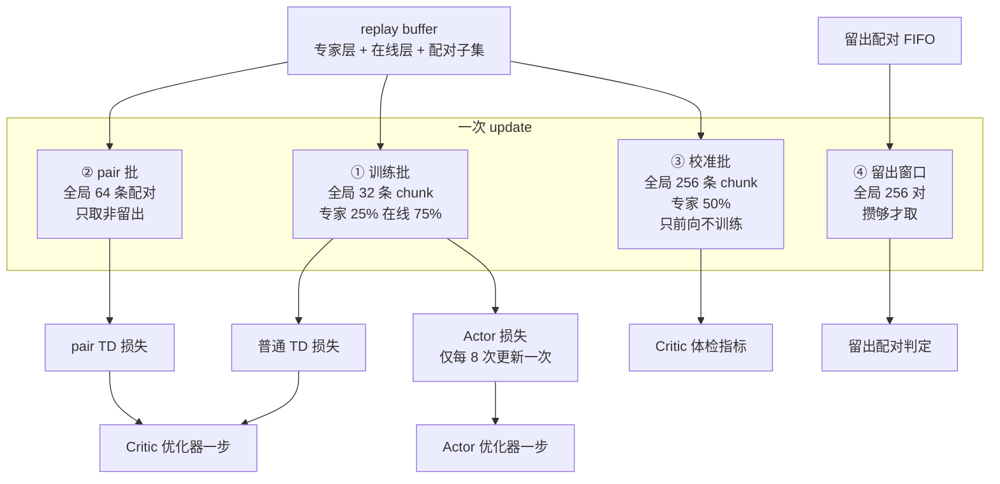

# 第 03 章 三种批与消费路径

> **前情提要**：第 02 章讲清了数据存在哪、结构是什么。本章讲它怎么被取出来用——一次更新里同时抽三种批，各自的来源池、大小、比例都不一样。最后把"同一条数据平均被看多少次"这笔账算出来。

**知识链接**：

- [Replay Buffer 经验回放](/前置知识/000r_前置知识_Replay_Buffer_经验回放)
- [FSDP 全分片数据并行](/前置知识/001i_前置知识_FSDP全分片数据并行)
- 上一章：[数据的一生](./02_数据的一生_五条数据流的产生存储与消费)

---

## 3.1 位置 三种批在链路里的位置

第 01 章说过，一个 runner step 里 actor 会做 32 次更新。本章讲的是**其中任意一次更新内部发生的事**。



四条取数路径的性质完全不同，先给一张对照表，后面逐条展开。

| 路径 | 全局大小 | 来源池 | 受最近窗口限制 | 进梯度 | 是否放回 |
|---|---:|---|---|---|---|
| 训练批 | 32 条 chunk | 专家层 + 在线层 | 在线部分受限 | 是 | 有放回 |
| pair 批 | 64 条配对 | 配对子集的非留出部分 | **不受限** | 是 | 有放回 |
| 校准批 | 256 条 chunk | 专家层 + 在线层 | 在线部分受限 | **否** | 有放回 |
| 留出窗口 | 256 对 | 独立 FIFO | 不适用 | 否 | **取走即删** |

---

## 3.2 第一种 训练批 普通 TD 的输入

**大小与切分**：全局批 32 条 chunk，4 个 actor rank 平分，每 rank 8 条。微批大小也是 8，所以每 rank 恰好一个微批，梯度累积次数为 1。

**分层抽样**：不是从池子里随机抽，而是**按固定比例从两个独立分层各抽一部分**。本系列配置的专家比例是 0.25：

```text
每 rank 每次更新 = 2 条专家 chunk + 6 条在线 chunk
```

抽完两层再拼起来做一次整体打乱。日志里 `batch_expert_fraction` 恒等于 0.25 就是这个设置的直接反映。

**为什么必须显式指定比例**：第 02 章讲过，专家层建好后不再增长（每 rank 约 14784 条），而在线层每步增加约 315 条。如果不指定比例，随着训练进行专家数据的占比会不断被稀释——第 50 步和第 500 步的批构成会完全不同，等于目标函数在偷偷变化。显式分层把这个比例钉死。

**在线部分的窗口限制**：在线层抽样只在**最近 512 条轨迹**里选。超出窗口的老数据还在磁盘上，但抽不到。这是一个典型的 off-policy 取舍：窗口太小则丢掉可用数据、样本效率低；窗口太大则批里混入太多由很旧的策略采集的数据，与当前策略分布差得远。

**消费方式**：抽到的是"哪条轨迹的第几个 chunk"，取出对应记录，喂给 Critic 做一次前向反向。抽完数据留在库里，下一次更新完全独立地重新抽。

---

## 3.3 第二种 pair 批 同状态差分的输入

这条路径专门服务于本链路的核心方法——同状态双动作差分（原理在第 13 章）。它的取数逻辑和训练批完全不同。

**大小**：全局 64 对，每 rank 16 对。注意这个数是训练批的两倍。

**来源池**：只有那些"带配对镜像字段"的记录，也就是第 02 章讲的配对主环境产出的记录。而且**只取标记为非留出的那 75%**。

**不受最近窗口限制**：这是和训练批最重要的差别。pair 抽样的候选集合是**历史上所有配对轨迹**，不做窗口截断。原因是配对数据太稀缺——每个 runner step 只产生 12 对，如果再按窗口截断，可用样本会少到无法组批。

**拒绝采样循环**：pair 记录在库里是稀疏分布的（混在普通记录之间），所以不能直接抽 16 条了事。实际做法是一个最多重试 8 轮的循环：

1. 一次多抽一些 chunk（抽 `max(32, 目标数×4)` 条，本配置是 64 条）；
2. 在抽到的这批里筛出"确实带有效配对且非留出"的行；
3. 如果配置了额外门槛（动作差幅度下限、回报差下限、正负样本配平），继续筛；
4. 攒够 16 条就返回，不够就再抽一轮。

**攒不够时的回退**：如果重试 8 轮还凑不够（典型场景是训练刚开始、库里配对太少），会**回退到"直接用本步 rollout 刚产生的配对候选"**。日志里 `critic_pair_td_rollout_fallback` 这条曲线就是在记录这件事——它为 1 说明这一步的 pair 批不是从 replay 抽的，而是现采现用。如果配置要求冻结 replay 或使用固定语料，则不允许回退，直接报错。

**进梯度的位置**：pair 批只挂在**第一个微批**上计算，不是每个微批都算一遍。在本配置下每 rank 只有一个微批，所以没有区别；但如果调大全局批导致多个微批，pair 损失的权重就不会随微批数放大。这是读损失曲线时需要知道的归一化细节（第 11 章细讲）。

---

## 3.4 第三种 校准批 只看不训

**触发时机**：不是每次更新都做。判定条件是"仍在 Critic 预热期内"或"这次更新带 Actor 更新"。预热结束后的稳定期，就等于**每 8 次更新做一次**，即每个 runner step 4 次。

**大小与比例**：全局 256 条 chunk，每 rank 64 条，专家比例 0.5，即每 rank 32 条专家 + 32 条在线。日志里 `calibration_online_samples` 恒为 128 就是全局在线部分的数量。

**它做什么**：对同一批 state，用**三种不同的动作**各跑一次 Critic 前向，全部在无梯度模式下：

| 前向 | 喂进去的动作 | 用途 |
|---|---|---|
| 第一次 | 记录里实际执行过的动作 | 基准 |
| 第二次 | 同一状态的 BC 参考动作 | 得到"纯状态信息"的对照 |
| 第三次 | BC 参考动作 + **另一条样本的动作偏移** | 幅度一样、方向错误的对照 |

第三种是这套体检里最关键的构造。它保持状态不变、保持扰动幅度分布不变，**只把扰动方向换成别人的**。如果 Critic 真的在利用动作信息，第三次前向的结果应该明显变差；如果没有变化，说明 Critic 对动作方向是盲的。

**为什么要花这个算力**：普通的训练指标无法回答"Critic 学到的是状态好坏还是动作好坏"。损失下降、Q 值与回报正相关，这些都可以完全靠状态信息拿到高分。校准批的三次前向就是为了把两者分开。第 18 章会把这套指标的定义、随机基线和阈值全部展开，第 22 章会用真实数据演示"指标全绿但 Critic 其实对动作无感"的样子。

**是否放回**：校准批也是从 replay 正常抽样，有放回，抽完什么都不改变。它唯一的产物是一批标量指标。

---

## 3.5 第四种 留出窗口 唯一的不放回消费

这就是上一章说的那个 FIFO 队列的消费端。它和前三种批是完全不同的东西，值得单独强调。

**触发条件**：每次做校准时检查队列长度。要求**每个 rank 本地都攒够 64 对**（全局 256 对）才动作，任何一个 rank 不够就整体跳过。

**为什么要按 rank 全都够**：因为体检的前向是分布式做的，所有 rank 必须做同样次数、同样形状的集合通信。如果某个 rank 数据不够、少做一次前向，整个训练会卡死或报错。这条纪律贯穿整条链路（第 12 章会详细讲 FSDP 形状纪律）。

**消费过程**：

1. 取走队列最前面的 64 对（本地），从队列里删除；
2. 对这一窗做一次配对前向：同一状态下同时算主分支和探测分支的 Q；
3. 用两个分支的**真实局部结果**算标签，得到四个判定指标：符号正确率、秩相关、双头分歧、以及两边幅度的均值对比；
4. 把结果交给门禁逻辑，推进或清零"连续通过次数"计数器；
5. 累加"已完成窗口数"。

**取走即删的意义**：这保证了窗口之间**互不重叠**。如果允许重叠，同一批数据会被反复用来做判定，"连续通过三次"就不再是三次独立检验，而是同一次检验重复三遍——那道门禁就失去了统计意义。

**一个真实的坑**：入队速度大约每步 6 对（12 对配对 × 25% 留出，再扣掉打平被筛掉的），而窗口要 256 对。也就是**大约 40 多个 runner step 才能完成一次体检**。如果一条 run 只跑几十步，体检可能一次都不会发生；而门禁逻辑在窗口未完成时会**直接跳过判定**（不是判定失败，是根本不判），于是"连续通过次数"永远是 0。这是第 22 章那条真实 run 里发生过的事情，也是本系列反复强调"要区分指标为零是因为没启用、没数据，还是真的不合格"的原因。

---

## 3.6 消费强度账本 同一条数据被看多少次

现在把所有取数路径按 runner step 汇总。这张表是判断"模型在学习还是在拟合噪声"的基础工具。

**每个 rank 每个 runner step 的抽取次数**：

| 路径 | 单次大小 | 每步次数 | 每步抽取总量 |
|---|---:|---:|---:|
| 训练批 专家部分 | 2 | 32 | 64 |
| 训练批 在线部分 | 6 | 32 | 192 |
| pair 批 | 16 | 32 | 512 |
| 校准批 | 64 | 4 | 256 |

**每个 rank 的可用池规模**（以贯穿本系列的那条 run 跑到第 91 步为例）：

| 池 | 规模 | 说明 |
|---|---:|---|
| 专家层 | 约 14784 条 chunk | 初始化时建好，不增长 |
| 在线层窗口内 | 约 7700 条 chunk | 512 条轨迹 × 每条约 15 个 chunk |
| 非留出配对 | 约 1350 条 | 配对轨迹约 122 条 × 每条约 15 个 chunk × 75% |

**两者相除得到复用强度**：

| 数据 | 每步被抽到的期望次数 | 换算 |
|---|---:|---|
| 一条专家 chunk | 0.0043 | 平均每 230 步被抽一次 |
| 一条在线 chunk | 0.025 | 平均每 40 步被抽一次 |
| 一条非留出配对 | **0.38** | 平均每 2.6 步被抽一次 |

结论很清楚：

> **pair 数据的复用强度比普通训练数据高一个数量级以上。**

原因是双重的——pair 批本身是训练批的两倍大（64 对 32），而可用池只有在线池的六分之一。累计到 42 个 step，一条 pair 记录平均已经被用了十几次，而一条在线 chunk 才被用一次。

这个不对称本身不是错误。pair 数据稀缺、单条信息量高，多用几次是合理的。但它带来一个必须警惕的后果：**如果 pair 的标签里信噪比很低，这种高复用强度会让 Critic 高效地把噪声记住**。判断标签信噪比的方法在第 13 章和第 19 章，这里先把账记下。

**算这笔账的通用方法**（后面几章会反复用）：

```text
单条数据每步被抽期望 = (单次批大小 × 每步次数) / 可用池规模
累计复用次数 ≈ 每步期望 × 已跑步数
```

分母那个"可用池规模"必须按 **chunk 条数**算，不能按轨迹条数算——一条轨迹里有十几个 chunk，混淆这两个单位会让估算差一个数量级。

---

## 3.7 一次更新的完整顺序

把本章内容按真实执行顺序串一遍，这是第 11 章、第 16 章、第 17 章共同的起点。

| 序号 | 动作 | 备注 |
|---|---|---|
| 1 | 全 rank 一次空集合通信 | 作为更新边界的同步屏障 |
| 2 | 判定这次更新是否带 Actor | 依据总样本量、预热次数、更新计数与比例 |
| 3 | 抽训练批并切微批 | 每 rank 8 条，一个微批 |
| 4 | 抽 pair 批 | 每 rank 16 对，必要时回退到现采候选 |
| 5 | 计算各项损失的归一化分母 | 需要跨 rank 统计有效样本数 |
| 6 | 逐微批做 Critic 前向反向 | pair 损失只挂在第一个微批 |
| 7 | Critic 梯度裁剪与优化器一步 | 裁剪阈值与 Actor 不同 |
| 8 | 若到点则做校准 | 抽校准批 + 三次前向；必要时消费一个留出窗口 |
| 9 | 若这次带 Actor 更新 | 检查门禁是否放行，再做 Actor 前向反向与优化器一步 |
| 10 | 更新目标网络与温度参数 | 目标网络是滑动平均更新 |
| 11 | 更新计数加一 | 这个计数是所有调度判定的依据 |

第 9 步那个"检查门禁"是本链路最容易出问题的地方，它同时受三样东西影响：Critic 体检结果、参考门禁的逐样本筛选、以及配置里是否允许绕过。这三者的关系放在第 16 章和第 18 章讲。

---

## 3.8 本章小结

| 问题 | 答案 |
|---|---|
| 一次更新抽几种批 | 三种进梯度或进指标的批，外加一种条件触发的留出窗口 |
| 训练批怎么组成 | 全局 32 条，专家 25% 在线 75%，在线部分只在最近 512 条轨迹里抽 |
| pair 批有什么特殊 | 全局 64 对，只取非留出，不受窗口限制，用拒绝采样凑数，凑不够会回退到现采 |
| 校准批做什么 | 全局 256 条，同一状态跑三种动作，只出指标不出梯度 |
| 哪种消费是不可逆的 | 留出窗口，取走即删，保证窗口互不重叠 |
| 谁被复用得最狠 | pair 记录，平均每 2.6 步就被抽一次，比在线 chunk 高一个数量级 |
| 怎么算复用强度 | 批大小乘每步次数除以池里的 chunk 条数，注意单位是 chunk 不是轨迹 |

**下章预告**：前三章把"流程与数据"讲完了。第 04 章开始转向"这些数字是从哪来的"——配置继承链一共十层，每一层引入了什么语义变化，哪些高风险设置是被隐性继承的。读完第 04 章，你就能拿着任意一份实验配置，自己推出本章这些批大小和比例。
